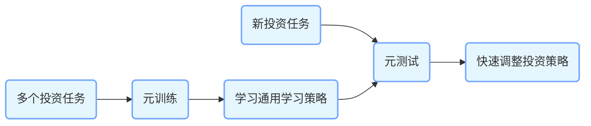

# 金融领域元学习在投资策略快速迭代中的应用

> 关键词：金融领域、元学习、投资策略、快速迭代、机器学习

> 摘要：本文聚焦于金融领域中，元学习在投资策略快速迭代方面的应用。首先介绍了相关背景，包括目的、预期读者、文档结构和术语表。接着阐述了元学习的核心概念及其与投资策略的联系，通过文本示意图和 Mermaid 流程图进行清晰展示。详细讲解了元学习的核心算法原理，并给出 Python 源代码示例。深入探讨了元学习涉及的数学模型和公式，结合实际例子进行说明。通过项目实战，介绍了开发环境搭建、源代码实现及代码解读。分析了元学习在金融投资中的实际应用场景，推荐了相关的学习资源、开发工具框架以及论文著作。最后总结了元学习在投资策略快速迭代中的未来发展趋势与挑战，还包含常见问题解答和扩展阅读参考资料。

## 1. 背景介绍 
### 1.1 目的和范围
在金融市场中，投资环境复杂多变，传统的投资策略往往难以快速适应市场的动态变化。元学习作为机器学习领域的新兴技术，为投资策略的快速迭代提供了新的思路和方法。本文的目的在于深入探讨元学习在金融领域投资策略快速迭代中的应用，详细介绍其原理、算法、数学模型，并通过实际案例展示其应用效果。范围涵盖了元学习的基本概念、核心算法、在金融投资中的具体应用以及相关工具和资源的推荐。

### 1.2 预期读者
本文预期读者包括金融领域的投资分析师、量化交易员、机器学习工程师、对金融科技感兴趣的研究人员以及相关专业的学生。这些读者具备一定的金融知识和编程基础，希望通过本文了解元学习在金融投资领域的应用，提升自己在投资策略开发和优化方面的能力。

### 1.3 文档结构概述
本文共分为十个部分。第一部分为背景介绍，阐述了文章的目的、预期读者、文档结构和术语表。第二部分介绍元学习的核心概念及其与投资策略的联系，通过文本示意图和 Mermaid 流程图进行可视化展示。第三部分详细讲解元学习的核心算法原理，并给出 Python 源代码示例。第四部分深入探讨元学习涉及的数学模型和公式，结合实际例子进行说明。第五部分通过项目实战，介绍开发环境搭建、源代码实现及代码解读。第六部分分析元学习在金融投资中的实际应用场景。第七部分推荐相关的学习资源、开发工具框架以及论文著作。第八部分总结元学习在投资策略快速迭代中的未来发展趋势与挑战。第九部分为附录，包含常见问题解答。第十部分提供扩展阅读参考资料。

### 1.4 术语表
#### 1.4.1 核心术语定义
- **元学习（Meta-learning）**：也称为“学会学习”，是一种让模型能够快速学习新知识和技能的机器学习方法。它通过在多个任务上进行训练，学习到如何快速适应新的任务。
- **投资策略（Investment Strategy）**：投资者为了实现投资目标，根据市场情况和自身风险承受能力制定的投资计划和方法。
- **快速迭代（Rapid Iteration）**：在短时间内对投资策略进行多次调整和优化，以适应市场的变化。
- **机器学习（Machine Learning）**：一门多领域交叉学科，涉及概率论、统计学、逼近论、凸分析、算法复杂度理论等多门学科。它专门研究计算机怎样模拟或实现人类的学习行为，以获取新的知识或技能，重新组织已有的知识结构使之不断改善自身的性能。

#### 1.4.2 相关概念解释
- **任务（Task）**：在元学习中，任务是指一个具体的学习问题，例如预测某只股票的价格走势。
- **元训练（Meta-training）**：元学习的训练过程，模型在多个任务上进行训练，学习到如何快速适应新的任务。
- **元测试（Meta-testing）**：在元训练之后，使用新的任务对模型进行测试，评估模型的快速适应能力。

#### 1.4.3 缩略词列表
- **ML（Machine Learning）**：机器学习
- **RL（Reinforcement Learning）**：强化学习
- **MAML（Model-Agnostic Meta-Learning）**：模型无关元学习

## 2. 核心概念与联系 

### 元学习的核心概念
元学习的核心思想是让模型在多个任务上进行训练，学习到如何快速适应新的任务。传统的机器学习方法通常是在一个固定的数据集上进行训练，模型只能学习到该数据集上的模式和规律。而元学习则关注于模型的学习能力，通过在多个不同的任务上进行训练，模型可以学习到通用的学习策略，从而能够在面对新的任务时快速调整自己的参数，实现快速学习。

### 元学习与投资策略的联系
在金融投资领域，市场环境复杂多变，投资策略需要不断地进行调整和优化。传统的投资策略往往需要大量的历史数据和时间来进行训练和调整，难以快速适应市场的变化。元学习可以帮助投资策略实现快速迭代，通过在多个不同的市场环境和投资任务上进行训练，模型可以学习到如何快速调整投资策略，以适应新的市场情况。

### 文本示意图
元学习在投资策略快速迭代中的应用可以用以下文本示意图来表示：

元学习系统接收多个不同的投资任务作为输入，包括不同的市场环境、投资目标和风险偏好。在元训练阶段，模型在这些任务上进行训练，学习到通用的学习策略。在元测试阶段，当遇到新的投资任务时，模型可以利用学习到的策略快速调整投资策略，实现快速迭代。

### Mermaid 流程图


## 3. 核心算法原理 & 具体操作步骤 

### 核心算法原理
在元学习中，有多种算法可以实现快速学习的目标，其中最经典的算法之一是模型无关元学习（MAML）。MAML 的核心思想是找到一组初始化参数，使得模型在经过少量的梯度更新后，能够在新的任务上取得较好的性能。

### 具体操作步骤
1. **元训练阶段**：
    - 随机初始化模型的参数 $\theta$。
    - 从任务分布 $p(T)$ 中采样一批任务 $\{T_1, T_2, \cdots, T_n\}$。
    - 对于每个任务 $T_i$：
        - 从任务 $T_i$ 的训练数据中采样一个小批量的数据 $D_{i}^{tr}$。
        - 使用 $D_{i}^{tr}$ 对模型进行一次或多次梯度更新，得到临时参数 $\theta_i'$。
        - 从任务 $T_i$ 的测试数据中采样一个小批量的数据 $D_{i}^{te}$。
        - 计算在 $D_{i}^{te}$ 上的损失 $L_{i}(\theta_i')$。
    - 计算所有任务的损失之和 $\sum_{i=1}^{n} L_{i}(\theta_i')$，并使用梯度下降法更新模型的参数 $\theta$。
2. **元测试阶段**：
    - 当遇到新的任务 $T_{new}$ 时，使用元训练得到的参数 $\theta$ 初始化模型。
    - 从任务 $T_{new}$ 的训练数据中采样一个小批量的数据 $D_{new}^{tr}$。
    - 使用 $D_{new}^{tr}$ 对模型进行一次或多次梯度更新，得到调整后的参数 $\theta_{new}'$。
    - 使用调整后的参数 $\theta_{new}'$ 在任务 $T_{new}$ 的测试数据上进行预测。

### Python 源代码示例
```python
import torch
import torch.nn as nn
import torch.optim as optim

# 定义一个简单的神经网络模型
class SimpleModel(nn.Module):
    def __init__(self, input_size, hidden_size, output_size):
        super(SimpleModel, self).__init__()
        self.fc1 = nn.Linear(input_size, hidden_size)
        self.relu = nn.ReLU()
        self.fc2 = nn.Linear(hidden_size, output_size)

    def forward(self, x):
        out = self.fc1(x)
        out = self.relu(out)
        out = self.fc2(out)
        return out

# 定义 MAML 算法
def maml(model, tasks, num_inner_steps, inner_lr, meta_lr, num_epochs):
    meta_optimizer = optim.Adam(model.parameters(), lr=meta_lr)

    for epoch in range(num_epochs):
        meta_loss = 0
        for task in tasks:
            # 复制模型参数
            fast_weights = list(model.parameters())

            # 内循环更新
            for _ in range(num_inner_steps):
                train_inputs, train_labels = task.get_train_data()
                logits = model.forward(train_inputs)
                loss = nn.CrossEntropyLoss()(logits, train_labels)
                grads = torch.autograd.grad(loss, fast_weights)
                fast_weights = [w - inner_lr * g for w, g in zip(fast_weights, grads)]

            # 计算元损失
            test_inputs, test_labels = task.get_test_data()
            logits = model.forward(test_inputs)
            meta_loss += nn.CrossEntropyLoss()(logits, test_labels)

        # 元更新
        meta_optimizer.zero_grad()
        meta_loss.backward()
        meta_optimizer.step()

        print(f'Epoch {epoch + 1}/{num_epochs}, Meta Loss: {meta_loss.item()}')

    return model

# 示例任务类
class Task:
    def __init__(self, train_inputs, train_labels, test_inputs, test_labels):
        self.train_inputs = train_inputs
        self.train_labels = train_labels
        self.test_inputs = test_inputs
        self.test_labels = test_labels

    def get_train_data(self):
        return self.train_inputs, self.train_labels

    def get_test_data(self):
        return self.test_inputs, self.test_labels

# 初始化模型
input_size = 10
hidden_size = 20
output_size = 2
model = SimpleModel(input_size, hidden_size, output_size)

# 生成示例任务
num_tasks = 5
tasks = []
for _ in range(num_tasks):
    train_inputs = torch.randn(100, input_size)
    train_labels = torch.randint(0, output_size, (100,))
    test_inputs = torch.randn(20, input_size)
    test_labels = torch.randint(0, output_size, (20,))
    task = Task(train_inputs, train_labels, test_inputs, test_labels)
    tasks.append(task)

# 训练模型
num_inner_steps = 3
inner_lr = 0.01
meta_lr = 0.001
num_epochs = 10
trained_model = maml(model, tasks, num_inner_steps, inner_lr, meta_lr, num_epochs)
```

## 4. 数学模型和公式 & 详细讲解 & 举例说明 

### 数学模型和公式
#### 元学习目标
元学习的目标是找到一组初始化参数 $\theta$，使得模型在经过少量的梯度更新后，能够在新的任务上取得较好的性能。可以用以下公式表示：

$$\min_{\theta} \sum_{T \sim p(T)} \mathcal{L}_{T}(\theta'_T)$$

其中，$p(T)$ 是任务分布，$\theta'_T$ 是在任务 $T$ 上经过少量梯度更新后的参数，$\mathcal{L}_{T}$ 是任务 $T$ 上的损失函数。

#### 内循环更新
在元训练阶段，对于每个任务 $T$，我们使用训练数据 $D_{T}^{tr}$ 对模型进行一次或多次梯度更新，得到临时参数 $\theta'_T$。内循环更新可以用以下公式表示：

$$\theta'_T = \theta - \alpha \nabla_{\theta} \mathcal{L}_{T}^{tr}(\theta)$$

其中，$\alpha$ 是内循环学习率，$\mathcal{L}_{T}^{tr}$ 是任务 $T$ 的训练损失函数。

#### 元更新
在元训练阶段，我们计算所有任务的损失之和，并使用梯度下降法更新模型的参数 $\theta$。元更新可以用以下公式表示：

$$\theta \leftarrow \theta - \beta \nabla_{\theta} \sum_{T \sim p(T)} \mathcal{L}_{T}(\theta'_T)$$

其中，$\beta$ 是元学习率。

### 详细讲解
元学习的核心思想是通过在多个任务上进行训练，学习到通用的学习策略。在元训练阶段，模型在每个任务上进行内循环更新，得到临时参数 $\theta'_T$。然后，计算所有任务的损失之和，并使用梯度下降法更新模型的参数 $\theta$。这样，模型就可以学习到如何快速调整自己的参数，以适应新的任务。

### 举例说明
假设我们有一个股票价格预测的任务，我们可以将不同的股票和不同的时间区间看作不同的任务。在元训练阶段，我们可以使用多个股票和时间区间的历史数据对模型进行训练，学习到通用的学习策略。在元测试阶段，当遇到新的股票和时间区间时，模型可以利用学习到的策略快速调整自己的参数，实现快速的股票价格预测。

## 5. 项目实战：代码实际案例和详细解释说明 

### 5.1  开发环境搭建
#### 安装 Python
首先，需要安装 Python 环境。建议使用 Python 3.7 及以上版本。可以从 Python 官方网站（https://www.python.org/downloads/）下载并安装 Python。

#### 安装必要的库
在项目中，需要使用到一些 Python 库，如 PyTorch、NumPy、Pandas 等。可以使用以下命令安装这些库：
```sh
pip install torch numpy pandas
```

### 5.2  源代码详细实现和代码解读
```python
import torch
import torch.nn as nn
import torch.optim as optim
import numpy as np
import pandas as pd

# 定义一个简单的神经网络模型
class InvestmentModel(nn.Module):
    def __init__(self, input_size, hidden_size, output_size):
        super(InvestmentModel, self).__init__()
        self.fc1 = nn.Linear(input_size, hidden_size)
        self.relu = nn.ReLU()
        self.fc2 = nn.Linear(hidden_size, output_size)

    def forward(self, x):
        out = self.fc1(x)
        out = self.relu(out)
        out = self.fc2(out)
        return out

# 定义 MAML 算法
def maml(model, tasks, num_inner_steps, inner_lr, meta_lr, num_epochs):
    meta_optimizer = optim.Adam(model.parameters(), lr=meta_lr)

    for epoch in range(num_epochs):
        meta_loss = 0
        for task in tasks:
            # 复制模型参数
            fast_weights = list(model.parameters())

            # 内循环更新
            for _ in range(num_inner_steps):
                train_inputs, train_labels = task.get_train_data()
                logits = model.forward(train_inputs)
                loss = nn.MSELoss()(logits, train_labels)
                grads = torch.autograd.grad(loss, fast_weights)
                fast_weights = [w - inner_lr * g for w, g in zip(fast_weights, grads)]

            # 计算元损失
            test_inputs, test_labels = task.get_test_data()
            logits = model.forward(test_inputs)
            meta_loss += nn.MSELoss()(logits, test_labels)

        # 元更新
        meta_optimizer.zero_grad()
        meta_loss.backward()
        meta_optimizer.step()

        print(f'Epoch {epoch + 1}/{num_epochs}, Meta Loss: {meta_loss.item()}')

    return model

# 示例任务类
class InvestmentTask:
    def __init__(self, train_data, test_data):
        self.train_data = train_data
        self.test_data = test_data

    def get_train_data(self):
        train_inputs = torch.tensor(self.train_data[:, :-1], dtype=torch.float32)
        train_labels = torch.tensor(self.train_data[:, -1], dtype=torch.float32).unsqueeze(1)
        return train_inputs, train_labels

    def get_test_data(self):
        test_inputs = torch.tensor(self.test_data[:, :-1], dtype=torch.float32)
        test_labels = torch.tensor(self.test_data[:, -1], dtype=torch.float32).unsqueeze(1)
        return test_inputs, test_labels

# 加载数据
def load_data(file_path):
    data = pd.read_csv(file_path)
    data = data.values
    return data

# 划分训练集和测试集
def split_data(data, train_ratio=0.8):
    train_size = int(len(data) * train_ratio)
    train_data = data[:train_size]
    test_data = data[train_size:]
    return train_data, test_data

# 主函数
if __name__ == '__main__':
    # 加载数据
    file_path = 'investment_data.csv'
    data = load_data(file_path)

    # 划分训练集和测试集
    train_data, test_data = split_data(data)

    # 创建任务
    task = InvestmentTask(train_data, test_data)
    tasks = [task]

    # 初始化模型
    input_size = data.shape[1] - 1
    hidden_size = 20
    output_size = 1
    model = InvestmentModel(input_size, hidden_size, output_size)

    # 训练模型
    num_inner_steps = 3
    inner_lr = 0.01
    meta_lr = 0.001
    num_epochs = 10
    trained_model = maml(model, tasks, num_inner_steps, inner_lr, meta_lr, num_epochs)
```

### 5.3  代码解读与分析
#### 模型定义
`InvestmentModel` 是一个简单的两层神经网络模型，用于投资策略的预测。输入层的大小由数据的特征数量决定，隐藏层的大小为 20，输出层的大小为 1。

#### MAML 算法实现
`maml` 函数实现了 MAML 算法的核心逻辑。在元训练阶段，模型在每个任务上进行内循环更新，得到临时参数。然后，计算所有任务的损失之和，并使用梯度下降法更新模型的参数。

#### 任务类
`InvestmentTask` 类封装了投资任务的数据，包括训练数据和测试数据。`get_train_data` 和 `get_test_data` 方法用于获取训练数据和测试数据。

#### 数据加载和划分
`load_data` 函数用于加载 CSV 格式的数据，`split_data` 函数用于将数据划分为训练集和测试集。

#### 主函数
在主函数中，我们首先加载数据，然后划分训练集和测试集。接着，创建投资任务并初始化模型。最后，调用 `maml` 函数训练模型。

## 6. 实际应用场景 
### 股票投资策略优化
在股票投资中，市场情况复杂多变，不同的股票和不同的时间区间具有不同的特征。元学习可以帮助投资者快速调整投资策略，以适应不同的市场情况。例如，通过在多个股票和时间区间的历史数据上进行元训练，模型可以学习到如何快速调整投资组合，以实现最大的收益。

### 期货交易策略开发
期货市场的价格波动较大，交易策略需要快速适应市场的变化。元学习可以用于开发期货交易策略，通过在多个期货品种和不同的市场环境下进行训练，模型可以学习到如何快速调整交易策略，以提高交易的成功率和收益。

### 资产配置优化
资产配置是投资组合管理的重要环节，合理的资产配置可以降低投资风险，提高收益。元学习可以帮助投资者快速调整资产配置策略，根据不同的市场情况和投资目标，选择最优的资产组合。例如，在市场上涨时，增加股票资产的配置；在市场下跌时，增加债券资产的配置。

### 风险评估和管理
金融市场存在各种风险，如市场风险、信用风险、流动性风险等。元学习可以用于风险评估和管理，通过在多个风险场景下进行训练，模型可以学习到如何快速识别和评估风险，并采取相应的风险管理措施。例如，在市场波动较大时，增加风险对冲工具的使用。

## 7. 工具和资源推荐
### 7.1 学习资源推荐
#### 7.1.1 书籍推荐
- 《机器学习》（周志华）：本书是机器学习领域的经典教材，系统地介绍了机器学习的基本概念、算法和应用。
- 《深度学习》（Ian Goodfellow、Yoshua Bengio 和 Aaron Courville）：本书是深度学习领域的权威著作，详细介绍了深度学习的理论和实践。
- 《元学习：原理与算法》：本书专门介绍了元学习的原理、算法和应用，是学习元学习的重要参考书籍。

#### 7.1.2 在线课程
- Coursera 上的“机器学习”课程（Andrew Ng 教授）：这是一门经典的机器学习课程，适合初学者入门。
- edX 上的“深度学习”课程：由知名高校和企业的专家授课，内容丰富，涵盖了深度学习的各个方面。
- 网易云课堂上的“元学习实战”课程：该课程结合实际案例，详细介绍了元学习的应用和实现。

#### 7.1.3 技术博客和网站
- Medium：上面有很多关于机器学习和元学习的技术文章，作者来自世界各地的技术专家和研究人员。
- arXiv：是一个预印本服务器，上面有很多最新的机器学习和元学习研究论文。
- Kaggle：是一个数据科学竞赛平台，上面有很多关于金融数据和投资策略的竞赛和数据集，可以通过参与竞赛来学习和实践元学习。

### 7.2 开发工具框架推荐
#### 7.2.1 IDE和编辑器
- PyCharm：是一款专门为 Python 开发设计的集成开发环境，具有强大的代码编辑、调试和项目管理功能。
- Jupyter Notebook：是一个交互式的开发环境，适合进行数据探索、模型实验和代码演示。
- Visual Studio Code：是一款轻量级的代码编辑器，支持多种编程语言和插件，具有丰富的扩展功能。

#### 7.2.2 调试和性能分析工具
- PyTorch Profiler：是 PyTorch 自带的性能分析工具，可以帮助开发者分析模型的性能瓶颈，优化代码。
- TensorBoard：是 TensorFlow 提供的可视化工具，也可以用于 PyTorch 模型的可视化和性能分析。
- cProfile：是 Python 标准库中的性能分析工具，可以帮助开发者分析代码的执行时间和调用关系。

#### 7.2.3 相关框架和库
- PyTorch：是一个开源的深度学习框架，具有动态图机制和丰富的深度学习模型库，适合进行元学习的开发和实验。
- TensorFlow：是另一个广泛使用的深度学习框架，具有强大的分布式训练和部署能力。
- Scikit-learn：是一个简单易用的机器学习库，提供了各种机器学习算法和工具，适合进行数据预处理和模型评估。

### 7.3 相关论文著作推荐
#### 7.3.1 经典论文
- "Model-Agnostic Meta-Learning for Fast Adaptation of Deep Networks"（Chelsea Finn 等人）：这是 MAML 算法的经典论文，详细介绍了 MAML 算法的原理和实现。
- "Optimization as a Model for Few-Shot Learning"（Sachin Ravi 和 Hugo Larochelle）：该论文提出了一种基于优化的元学习方法，用于解决少样本学习问题。
- "Meta-Learning with Memory-Augmented Neural Networks"（Adam Santoro 等人）：这篇论文介绍了一种基于记忆增强神经网络的元学习方法，提高了模型的学习能力和泛化能力。

#### 7.3.2 最新研究成果
- 关注 arXiv 上的最新论文，特别是关于元学习在金融领域应用的研究成果。
- 参加国际机器学习会议（ICML）、神经信息处理系统大会（NeurIPS）等顶级学术会议，了解元学习领域的最新研究动态。

#### 7.3.3 应用案例分析
- 研究 Kaggle 上的金融数据竞赛和解决方案，了解元学习在实际金融投资中的应用案例。
- 阅读金融科技公司的技术博客和研究报告，了解他们在元学习应用方面的实践经验和成果。

## 8. 总结：未来发展趋势与挑战
### 未来发展趋势
#### 与其他技术的融合
元学习有望与强化学习、迁移学习等其他机器学习技术相结合，形成更加强大的学习方法。例如，将元学习与强化学习相结合，可以实现更加智能的投资决策和策略优化。

#### 应用领域的拓展
除了金融投资领域，元学习还将在医疗、交通、能源等领域得到广泛应用。例如，在医疗领域，元学习可以帮助医生快速诊断疾病，制定个性化的治疗方案。

#### 模型的可解释性和可解释性
随着元学习模型的复杂度不断增加，模型的可解释性和可解释性将成为未来研究的重要方向。研究人员将致力于开发更加可解释的元学习模型，以便更好地理解模型的决策过程和结果。

### 挑战
#### 数据质量和数量
元学习需要大量的高质量数据来进行训练，但是在金融领域，数据往往存在噪声、缺失值等问题，数据的质量和数量难以满足元学习的需求。

#### 计算资源和时间成本
元学习的训练过程通常需要大量的计算资源和时间，特别是在处理大规模数据集和复杂模型时，计算资源和时间成本成为制约元学习应用的重要因素。

#### 模型的泛化能力
虽然元学习的目标是提高模型的泛化能力，但是在实际应用中，模型的泛化能力仍然面临挑战。例如，在不同的市场环境和投资任务中，模型的性能可能会出现较大的波动。

## 9. 附录：常见问题与解答
### 问题 1：元学习和传统机器学习有什么区别？
传统机器学习通常是在一个固定的数据集上进行训练，模型只能学习到该数据集上的模式和规律。而元学习则关注于模型的学习能力，通过在多个不同的任务上进行训练，模型可以学习到通用的学习策略，从而能够在面对新的任务时快速调整自己的参数，实现快速学习。

### 问题 2：元学习在金融投资中的应用有哪些优势？
元学习在金融投资中的应用具有以下优势：
- 快速适应市场变化：可以帮助投资策略快速调整，以适应不同的市场环境。
- 提高投资收益：通过学习到通用的学习策略，模型可以更好地捕捉市场机会，提高投资收益。
- 降低投资风险：可以帮助投资者更好地识别和评估风险，并采取相应的风险管理措施。

### 问题 3：元学习需要多少数据才能进行训练？
元学习需要大量的高质量数据来进行训练，具体的数据量取决于任务的复杂度和模型的规模。一般来说，数据量越大，模型的性能越好。但是，在实际应用中，由于数据的获取和处理成本较高，需要根据实际情况合理选择数据量。

### 问题 4：如何评估元学习模型的性能？
可以使用以下指标来评估元学习模型的性能：
- 准确率：在新的任务上的预测准确率。
- 损失函数值：在新的任务上的损失函数值，损失函数值越小，模型的性能越好。
- 适应速度：模型在新的任务上达到较好性能所需的时间或迭代次数。

## 10. 扩展阅读 & 参考资料
### 扩展阅读
- 《人工智能：现代方法》（Stuart Russell 和 Peter Norvig）：本书是人工智能领域的经典著作，系统地介绍了人工智能的基本概念、算法和应用。
- 《金融科技：技术驱动的金融创新》：本书介绍了金融科技的发展趋势和应用场景，包括元学习在金融领域的应用。
- 《数据挖掘：概念与技术》（Jiawei Han、Jian Pei 和 Micheline Kamber）：本书是数据挖掘领域的经典教材，详细介绍了数据挖掘的基本概念、算法和应用。

### 参考资料
- Finn, C., Abbeel, P., & Levine, S. (2017). Model-Agnostic Meta-Learning for Fast Adaptation of Deep Networks. arXiv preprint arXiv:1703.03400.
- Ravi, S., & Larochelle, H. (2016). Optimization as a Model for Few-Shot Learning. arXiv preprint arXiv:1606.04474.
- Santoro, A., Bartunov, S., Botvinick, M., Wierstra, D., & Lillicrap, T. (2016). Meta-Learning with Memory-Augmented Neural Networks. arXiv preprint arXiv:1605.06065.