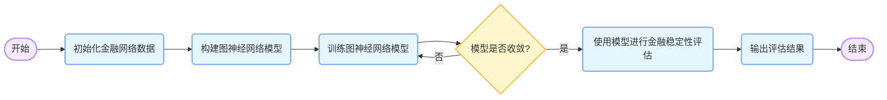

# 金融领域图神经网络在全球金融稳定性评估中的应用

> 关键词：图神经网络、金融领域、全球金融稳定性评估、风险传播、网络拓扑结构

> 摘要：本文聚焦于金融领域中图神经网络在全球金融稳定性评估中的应用。首先介绍了相关背景，包括研究目的、预期读者等内容。接着阐述了图神经网络的核心概念及其与金融稳定性评估的联系，详细讲解了核心算法原理和具体操作步骤，给出了相关数学模型和公式。通过项目实战展示了代码的实现和解读，分析了其在实际应用场景中的作用。同时推荐了相关的学习资源、开发工具框架和论文著作。最后总结了未来发展趋势与挑战，并对常见问题进行解答，提供了扩展阅读和参考资料，旨在全面深入地探讨图神经网络在全球金融稳定性评估中的应用。

## 1. 背景介绍 
### 1.1 目的和范围
在全球金融市场日益复杂和相互关联的背景下，准确评估全球金融稳定性变得至关重要。传统的金融稳定性评估方法往往难以捕捉金融系统中复杂的交互关系和动态变化。图神经网络作为一种强大的机器学习工具，能够有效地处理图结构数据，为金融稳定性评估提供了新的视角和方法。本文的目的在于探讨图神经网络在全球金融稳定性评估中的应用原理、方法和实际效果，范围涵盖图神经网络的基本概念、核心算法、数学模型，以及在实际金融场景中的应用案例。

### 1.2 预期读者
本文预期读者包括金融领域的研究人员、分析师、监管机构工作人员，以及对图神经网络和金融科技感兴趣的技术人员和学者。希望通过本文的阐述，能够为不同背景的读者提供关于图神经网络在金融稳定性评估方面的全面知识和深入理解。

### 1.3 文档结构概述
本文首先介绍背景信息，包括目的、预期读者和文档结构概述等内容。接着详细阐述图神经网络的核心概念及其与金融稳定性评估的联系，包括原理和架构的文本示意图以及 Mermaid 流程图。然后讲解核心算法原理和具体操作步骤，并给出相关的数学模型和公式。通过项目实战展示代码的实现和解读，分析其在实际应用场景中的作用。随后推荐相关的学习资源、开发工具框架和论文著作。最后总结未来发展趋势与挑战，解答常见问题，并提供扩展阅读和参考资料。

### 1.4 术语表
#### 1.4.1 核心术语定义
- **图神经网络（Graph Neural Network，GNN）**：一种专门用于处理图结构数据的神经网络，能够对图中的节点和边进行特征学习和信息传递。
- **全球金融稳定性评估**：对全球金融系统的稳健性、抗风险能力以及是否能够持续有效地运行进行评估和监测的过程。
- **金融网络**：由金融机构、市场和金融工具等节点通过各种金融关系（如借贷、投资、交易等）连接而成的复杂网络。
- **风险传播**：在金融网络中，由于金融机构之间的相互关联，一个机构的风险可能会通过各种渠道传递给其他机构，进而影响整个金融系统的稳定性。

#### 1.4.2 相关概念解释
- **节点特征**：在金融网络中，节点（如金融机构）的特征可以包括资产规模、资本充足率、盈利能力等信息，这些特征可以用来描述节点的状态和属性。
- **边特征**：边（如金融交易关系）的特征可以包括交易金额、交易期限、交易频率等信息，这些特征可以用来描述节点之间关系的强度和性质。
- **图嵌入**：将图结构数据中的节点和边映射到低维向量空间的过程，以便于进行机器学习和数据分析。

#### 1.4.3 缩略词列表
- **GNN**：Graph Neural Network（图神经网络）
- **IMF**：International Monetary Fund（国际货币基金组织）
- **FSB**：Financial Stability Board（金融稳定理事会）

## 2. 核心概念与联系 

### 2.1 图神经网络的基本原理
图神经网络是一种基于图结构数据的深度学习模型，其核心思想是通过节点之间的信息传递和聚合来学习节点和图的特征表示。与传统的神经网络不同，图神经网络能够处理不规则的图结构数据，充分利用节点之间的拓扑关系。

图神经网络的基本工作流程如下：
1. **特征初始化**：为图中的每个节点和边赋予初始特征向量。
2. **信息传递**：节点通过与其相邻节点的边进行信息交换，更新自身的特征表示。
3. **特征聚合**：将节点接收到的相邻节点信息进行聚合，得到新的节点特征。
4. **迭代更新**：重复信息传递和特征聚合的过程，直到节点的特征表示收敛或达到预设的迭代次数。

### 2.2 图神经网络与金融网络的联系
在金融领域，金融系统可以被看作是一个复杂的网络，其中金融机构（如银行、保险公司、投资基金等）是网络中的节点，金融交易关系（如借贷、投资、交易等）是网络中的边。图神经网络可以很好地处理这种金融网络结构，通过学习节点和边的特征表示，挖掘金融网络中的潜在信息和规律。

例如，通过图神经网络可以分析金融机构之间的风险传播路径，评估某个金融机构的风险对整个金融系统的影响程度。还可以利用图神经网络对金融市场的系统性风险进行预测和预警，帮助监管机构及时采取措施维护金融稳定。

### 2.3 图神经网络在金融稳定性评估中的作用
图神经网络在金融稳定性评估中具有重要作用，主要体现在以下几个方面：
1. **捕捉复杂关系**：能够捕捉金融机构之间复杂的交互关系和网络拓扑结构，比传统方法更全面地反映金融系统的实际情况。
2. **风险预测**：通过学习历史数据和网络结构，预测金融机构的违约风险和金融市场的系统性风险。
3. **风险传播分析**：分析风险在金融网络中的传播路径和速度，评估风险的扩散范围和影响程度。
4. **政策评估**：帮助监管机构评估不同政策措施对金融稳定性的影响，为政策制定提供科学依据。

### 2.4 核心概念原理和架构的文本示意图
图神经网络在金融稳定性评估中的基本架构可以描述如下：

输入层：接收金融网络的节点特征、边特征和图的拓扑结构信息。

隐藏层：包含多个图神经网络层，通过信息传递和聚合不断更新节点和边的特征表示。

输出层：根据具体任务输出相应的结果，如节点的风险评分、图的稳定性指标等。

### 2.5 Mermaid 流程图


## 3. 核心算法原理 & 具体操作步骤 

### 3.1 图神经网络的核心算法——图卷积网络（GCN）原理
图卷积网络（Graph Convolutional Network，GCN）是一种常用的图神经网络算法，其基本思想是通过对节点的邻居节点特征进行加权求和来更新节点的特征表示。

设图 $G=(V, E)$ ，其中 $V$ 是节点集合，$E$ 是边集合。节点 $i$ 的特征向量为 $x_i$ ，邻接矩阵为 $A$ ，度矩阵为 $D$ 。GCN 的一层卷积操作可以表示为：

$$H^{(l+1)} = \sigma(\tilde{D}^{-\frac{1}{2}}\tilde{A}\tilde{D}^{-\frac{1}{2}}H^{(l)}W^{(l)})$$

其中，$H^{(l)}$ 是第 $l$ 层的节点特征矩阵，$W^{(l)}$ 是第 $l$ 层的可学习权重矩阵，$\sigma$ 是激活函数，$\tilde{A} = A + I$ （$I$ 是单位矩阵），$\tilde{D}$ 是 $\tilde{A}$ 的度矩阵。

### 3.2 具体操作步骤

#### 3.2.1 数据预处理
1. **数据收集**：收集金融网络的相关数据，包括金融机构的基本信息、金融交易记录等。
2. **数据清洗**：去除数据中的噪声和缺失值，确保数据的质量。
3. **特征工程**：提取节点特征和边特征，如资产规模、资本充足率、交易金额等。
4. **构建图结构**：根据金融交易关系构建金融网络的图结构，确定节点和边的连接关系。

#### 3.2.2 模型构建
1. **选择图神经网络模型**：根据具体任务和数据特点选择合适的图神经网络模型，如 GCN、GraphSAGE 等。
2. **定义模型结构**：确定模型的层数、每层的神经元数量、激活函数等参数。
3. **初始化模型参数**：随机初始化模型的可学习参数。

#### 3.2.3 模型训练
1. **划分数据集**：将预处理后的数据划分为训练集、验证集和测试集。
2. **定义损失函数**：根据具体任务选择合适的损失函数，如均方误差损失、交叉熵损失等。
3. **选择优化器**：选择合适的优化器，如随机梯度下降（SGD）、Adam 等，用于更新模型参数。
4. **训练模型**：在训练集上迭代训练模型，不断调整模型参数，直到模型收敛。

#### 3.2.4 模型评估
1. **在验证集上评估模型**：使用验证集评估模型的性能，选择最优的模型参数。
2. **在测试集上评估模型**：使用测试集评估模型的泛化能力，得到最终的评估结果。

### 3.3 Python 源代码详细阐述
以下是一个使用 PyTorch Geometric 库实现简单 GCN 模型进行节点分类任务的示例代码：

```python
import torch
import torch.nn.functional as F
from torch_geometric.nn import GCNConv
from torch_geometric.datasets import Planetoid

# 加载数据集
dataset = Planetoid(root='data/Planetoid', name='Cora')
data = dataset[0]

# 定义 GCN 模型
class GCN(torch.nn.Module):
    def __init__(self):
        super(GCN, self).__init__()
        self.conv1 = GCNConv(dataset.num_node_features, 16)
        self.conv2 = GCNConv(16, dataset.num_classes)

    def forward(self, data):
        x, edge_index = data.x, data.edge_index

        x = self.conv1(x, edge_index)
        x = F.relu(x)
        x = F.dropout(x, training=self.training)
        x = self.conv2(x, edge_index)

        return F.log_softmax(x, dim=1)

# 初始化模型、优化器和损失函数
model = GCN()
optimizer = torch.optim.Adam(model.parameters(), lr=0.01, weight_decay=5e-4)
criterion = torch.nn.NLLLoss()

# 训练模型
def train():
    model.train()
    optimizer.zero_grad()
    out = model(data)
    loss = criterion(out[data.train_mask], data.y[data.train_mask])
    loss.backward()
    optimizer.step()
    return loss.item()

# 测试模型
def test():
    model.eval()
    out = model(data)
    pred = out.argmax(dim=1)  # Use the class with highest probability.
    test_correct = pred[data.test_mask] == data.y[data.test_mask]
    test_acc = int(test_correct.sum()) / int(data.test_mask.sum())
    return test_acc

# 训练和测试循环
for epoch in range(200):
    loss = train()
    if (epoch + 1) % 10 == 0:
        test_acc = test()
        print(f'Epoch: {epoch + 1}, Loss: {loss:.4f}, Test Acc: {test_acc:.4f}')
```

在这个示例中，我们使用了 Planetoid 数据集（Cora 数据集）进行节点分类任务。定义了一个简单的两层 GCN 模型，使用 Adam 优化器和负对数似然损失函数进行训练。通过迭代训练和测试，不断优化模型参数，最终得到节点分类的准确率。

## 4. 数学模型和公式 & 详细讲解 & 举例说明 

### 4.1 图拉普拉斯矩阵
在图神经网络中，图拉普拉斯矩阵是一个重要的数学工具，用于描述图的拓扑结构。对于一个无向图 $G=(V, E)$ ，其邻接矩阵为 $A$ ，度矩阵为 $D$ ，则图的拉普拉斯矩阵 $L$ 定义为：

$$L = D - A$$

图拉普拉斯矩阵具有以下性质：
1. **对称性**：$L$ 是一个对称矩阵，即 $L = L^T$ 。
2. **半正定性**：$L$ 的所有特征值都非负。
3. **特征值与图的结构**：$L$ 的特征值和特征向量与图的连通性、节点的重要性等结构信息密切相关。

### 4.2 图卷积网络的数学推导
回顾 GCN 的一层卷积操作公式：

$$H^{(l+1)} = \sigma(\tilde{D}^{-\frac{1}{2}}\tilde{A}\tilde{D}^{-\frac{1}{2}}H^{(l)}W^{(l)})$$

其中，$\tilde{A} = A + I$ ，$\tilde{D}$ 是 $\tilde{A}$ 的度矩阵。这个公式的推导基于以下思想：

1. **信息传递**：节点 $i$ 的特征更新需要考虑其邻居节点的信息，$\tilde{A}$ 矩阵用于表示节点之间的连接关系，通过矩阵乘法实现信息传递。
2. **归一化**：$\tilde{D}^{-\frac{1}{2}}$ 矩阵用于对邻居节点的信息进行归一化，避免度大的节点对信息传递的影响过大。
3. **线性变换**：$W^{(l)}$ 矩阵是可学习的权重矩阵，用于对节点特征进行线性变换，增加模型的表达能力。
4. **非线性激活**：$\sigma$ 是激活函数，如 ReLU 函数，用于引入非线性因素，提高模型的拟合能力。

### 4.3 举例说明
假设有一个简单的图，包含 4 个节点，其邻接矩阵 $A$ 为：

$$A = \begin{bmatrix}
0 & 1 & 0 & 1 \\
1 & 0 & 1 & 0 \\
0 & 1 & 0 & 1 \\
1 & 0 & 1 & 0
\end{bmatrix}$$

则度矩阵 $D$ 为：

$$D = \begin{bmatrix}
2 & 0 & 0 & 0 \\
0 & 2 & 0 & 0 \\
0 & 0 & 2 & 0 \\
0 & 0 & 0 & 2
\end{bmatrix}$$

图拉普拉斯矩阵 $L$ 为：

$$L = D - A = \begin{bmatrix}
2 & -1 & 0 & -1 \\
-1 & 2 & -1 & 0 \\
0 & -1 & 2 & -1 \\
-1 & 0 & -1 & 2
\end{bmatrix}$$

假设节点的初始特征矩阵 $H^{(0)}$ 为：

$$H^{(0)} = \begin{bmatrix}
1 & 2 \\
3 & 4 \\
5 & 6 \\
7 & 8
\end{bmatrix}$$

可学习的权重矩阵 $W^{(0)}$ 为：

$$W^{(0)} = \begin{bmatrix}
0.1 & 0.2 \\
0.3 & 0.4
\end{bmatrix}$$

首先计算 $\tilde{A} = A + I$ ：

$$\tilde{A} = \begin{bmatrix}
1 & 1 & 0 & 1 \\
1 & 1 & 1 & 0 \\
0 & 1 & 1 & 1 \\
1 & 0 & 1 & 1
\end{bmatrix}$$

$\tilde{D}$ 为 $\tilde{A}$ 的度矩阵：

$$\tilde{D} = \begin{bmatrix}
3 & 0 & 0 & 0 \\
0 & 3 & 0 & 0 \\
0 & 0 & 3 & 0 \\
0 & 0 & 0 & 3
\end{bmatrix}$$

则 $\tilde{D}^{-\frac{1}{2}}\tilde{A}\tilde{D}^{-\frac{1}{2}}$ 为：

$$\tilde{D}^{-\frac{1}{2}}\tilde{A}\tilde{D}^{-\frac{1}{2}} = \frac{1}{3}\begin{bmatrix}
1 & 1 & 0 & 1 \\
1 & 1 & 1 & 0 \\
0 & 1 & 1 & 1 \\
1 & 0 & 1 & 1
\end{bmatrix}$$

计算 $H^{(1)}$ ：

$$H^{(1)} = \sigma(\tilde{D}^{-\frac{1}{2}}\tilde{A}\tilde{D}^{-\frac{1}{2}}H^{(0)}W^{(0)})$$

假设使用 ReLU 激活函数 $\sigma(x) = \max(0, x)$ ，则可以按照矩阵乘法和激活函数的计算规则逐步计算出 $H^{(1)}$ 的值。

## 5. 项目实战：代码实际案例和详细解释说明 

### 5.1  开发环境搭建
#### 5.1.1 安装 Python
首先需要安装 Python 环境，建议使用 Python 3.7 及以上版本。可以从 Python 官方网站（https://www.python.org/downloads/） 下载并安装适合自己操作系统的 Python 版本。

#### 5.1.2 安装 PyTorch 和 PyTorch Geometric
PyTorch 是一个常用的深度学习框架，PyTorch Geometric 是基于 PyTorch 的图神经网络库。可以使用以下命令安装：

```bash
# 安装 PyTorch
pip install torch torchvision

# 安装 PyTorch Geometric 相关依赖
pip install torch-scatter torch-sparse torch-cluster torch-spline-conv torch-geometric -f https://data.pyg.org/whl/torch-${TORCH_VERSION}.html
```

其中，${TORCH_VERSION}$ 是你安装的 PyTorch 版本号。

#### 5.1.3 安装其他依赖库
还需要安装一些其他的依赖库，如 numpy、pandas 等，可以使用以下命令安装：

```bash
pip install numpy pandas matplotlib
```

### 5.2  源代码详细实现和代码解读
以下是一个使用 PyTorch Geometric 实现的基于图神经网络的金融稳定性评估示例代码：

```python
import torch
import torch.nn.functional as F
from torch_geometric.nn import GCNConv
import pandas as pd
import numpy as np
from sklearn.model_selection import train_test_split
from torch_geometric.data import Data

# 加载金融数据
def load_financial_data():
    # 这里假设数据文件名为 financial_data.csv
    data = pd.read_csv('financial_data.csv')
    node_features = data.iloc[:, :-1].values  # 节点特征
    labels = data.iloc[:, -1].values  # 节点标签

    # 构建图的邻接矩阵（这里简单假设是全连接图）
    num_nodes = node_features.shape[0]
    edge_index = []
    for i in range(num_nodes):
        for j in range(num_nodes):
            if i != j:
                edge_index.append([i, j])
    edge_index = torch.tensor(edge_index, dtype=torch.long).t().contiguous()

    # 划分训练集和测试集
    train_index, test_index = train_test_split(np.arange(num_nodes), test_size=0.2, random_state=42)
    train_mask = torch.zeros(num_nodes, dtype=torch.bool)
    train_mask[train_index] = True
    test_mask = torch.zeros(num_nodes, dtype=torch.bool)
    test_mask[test_index] = True

    # 转换为 PyTorch Geometric 数据对象
    data = Data(x=torch.tensor(node_features, dtype=torch.float),
                edge_index=edge_index,
                y=torch.tensor(labels, dtype=torch.long),
                train_mask=train_mask,
                test_mask=test_mask)
    return data

# 定义图神经网络模型
class FinancialGCN(torch.nn.Module):
    def __init__(self, in_channels, hidden_channels, out_channels):
        super(FinancialGCN, self).__init__()
        self.conv1 = GCNConv(in_channels, hidden_channels)
        self.conv2 = GCNConv(hidden_channels, out_channels)

    def forward(self, data):
        x, edge_index = data.x, data.edge_index

        x = self.conv1(x, edge_index)
        x = F.relu(x)
        x = F.dropout(x, training=self.training)
        x = self.conv2(x, edge_index)

        return F.log_softmax(x, dim=1)

# 训练模型
def train(model, data, optimizer, criterion):
    model.train()
    optimizer.zero_grad()
    out = model(data)
    loss = criterion(out[data.train_mask], data.y[data.train_mask])
    loss.backward()
    optimizer.step()
    return loss.item()

# 测试模型
def test(model, data):
    model.eval()
    out = model(data)
    pred = out.argmax(dim=1)  # Use the class with highest probability.
    test_correct = pred[data.test_mask] == data.y[data.test_mask]
    test_acc = int(test_correct.sum()) / int(data.test_mask.sum())
    return test_acc

# 主函数
def main():
    # 加载数据
    data = load_financial_data()

    # 初始化模型、优化器和损失函数
    model = FinancialGCN(data.num_node_features, 16, 2)
    optimizer = torch.optim.Adam(model.parameters(), lr=0.01, weight_decay=5e-4)
    criterion = torch.nn.NLLLoss()

    # 训练和测试循环
    for epoch in range(200):
        loss = train(model, data, optimizer, criterion)
        if (epoch + 1) % 10 == 0:
            test_acc = test(model, data)
            print(f'Epoch: {epoch + 1}, Loss: {loss:.4f}, Test Acc: {test_acc:.4f}')

if __name__ == '__main__':
    main()
```

### 5.3  代码解读与分析
#### 5.3.1 数据加载部分
`load_financial_data` 函数用于加载金融数据，包括节点特征和节点标签。同时构建图的邻接矩阵，这里简单假设是全连接图。将数据划分为训练集和测试集，并转换为 PyTorch Geometric 数据对象。

#### 5.3.2 模型定义部分
`FinancialGCN` 类定义了一个简单的两层 GCN 模型，包括两个 GCN 卷积层和 ReLU 激活函数、Dropout 层。

#### 5.3.3 训练和测试部分
`train` 函数用于训练模型，计算损失并更新模型参数。`test` 函数用于测试模型，计算测试集的准确率。

#### 5.3.4 主函数部分
`main` 函数是程序的入口，调用上述函数完成数据加载、模型初始化、训练和测试的整个过程。

通过这个示例代码，我们可以看到如何使用图神经网络对金融数据进行建模和分析，评估金融稳定性。

## 6. 实际应用场景 
### 6.1 金融机构风险评估
图神经网络可以用于评估金融机构的风险状况。通过分析金融机构之间的关联关系和交易数据，图神经网络可以学习到金融机构的特征表示，预测其违约风险和信用评级。例如，监管机构可以利用图神经网络对银行、保险公司等金融机构进行风险监测，及时发现潜在的风险点，采取相应的监管措施。

### 6.2 金融市场系统性风险预警
金融市场的系统性风险是指由于整个金融系统的不稳定而导致的风险，可能会对整个经济造成严重影响。图神经网络可以通过分析金融市场中各个参与者之间的复杂关系和市场数据，捕捉系统性风险的早期信号，提前发出预警。例如，在股票市场中，图神经网络可以分析不同股票之间的相关性和交易网络，预测市场的波动和崩溃风险。

### 6.3 金融政策评估
政府和监管机构在制定金融政策时，需要评估政策对金融稳定性的影响。图神经网络可以构建金融系统的模型，模拟不同政策场景下金融机构和市场的行为变化，评估政策的效果和潜在风险。例如，评估利率调整、资本充足率要求等政策对金融机构盈利能力和风险承受能力的影响，为政策制定提供科学依据。

### 6.4 金融交易对手风险分析
在金融交易中，交易对手的信用风险是一个重要的考虑因素。图神经网络可以分析交易对手之间的关系和信用状况，评估交易对手的违约风险。例如，在银行间借贷市场中，银行可以利用图神经网络评估其他银行的信用风险，决定是否与其进行交易以及交易的规模和条件。

## 7. 工具和资源推荐
### 7.1 学习资源推荐
#### 7.1.1 书籍推荐
- 《图神经网络：基础、前沿与应用》：全面介绍了图神经网络的基本原理、算法和应用，适合初学者和有一定基础的读者。
- 《深度学习》：由深度学习领域的三位顶尖专家所著，是深度学习领域的经典教材，其中也包含了图神经网络的相关内容。
- 《金融科技：应用与创新》：介绍了金融科技的最新发展和应用，包括图神经网络在金融领域的应用案例和实践经验。

#### 7.1.2 在线课程
- Coursera 上的“Graph Neural Networks”课程：由知名学者授课，系统讲解图神经网络的理论和实践。
- edX 上的“Deep Learning for Graphs”课程：深入介绍图神经网络的核心算法和应用，提供丰富的实验和案例。
- 哔哩哔哩（B 站）上有许多关于图神经网络和金融科技的教学视频，适合自学和参考。

#### 7.1.3 技术博客和网站
- Medium 上有很多关于图神经网络和金融科技的技术博客，作者们分享了最新的研究成果和实践经验。
- arXiv 是一个预印本平台，上面有大量关于图神经网络和金融领域的研究论文，可以及时了解最新的研究动态。
- 开源中国（OSChina）和 CSDN 等技术社区也有很多关于图神经网络和金融科技的技术文章和讨论。

### 7.2 开发工具框架推荐
#### 7.2.1 IDE和编辑器
- PyCharm：是一款专业的 Python 集成开发环境，提供了丰富的代码编辑、调试和项目管理功能，适合开发图神经网络项目。
- Jupyter Notebook：是一个交互式的开发环境，支持 Python 代码的实时运行和可视化展示，非常适合进行数据探索和模型实验。
- Visual Studio Code：是一款轻量级的代码编辑器，支持多种编程语言和插件扩展，也可以用于开发图神经网络项目。

#### 7.2.2 调试和性能分析工具
- TensorBoard：是 TensorFlow 提供的可视化工具，可以用于监控模型的训练过程、可视化模型结构和分析模型性能。
- PyTorch Profiler：是 PyTorch 提供的性能分析工具，可以帮助开发者分析模型的运行时间、内存使用情况等，优化模型性能。
- NVIDIA Nsight Systems：是一款强大的性能分析工具，特别适合分析 GPU 加速的深度学习模型的性能。

#### 7.2.3 相关框架和库
- PyTorch Geometric：是基于 PyTorch 的图神经网络库，提供了丰富的图神经网络模型和工具，方便开发者进行图神经网络的开发和实验。
- DGL（Deep Graph Library）：是一个通用的图神经网络框架，支持多种深度学习后端，提供了高效的图数据处理和模型训练功能。
- NetworkX：是一个用于创建、操作和研究复杂网络的 Python 库，可以用于构建和分析金融网络的图结构。

### 7.3 相关论文著作推荐
#### 7.3.1 经典论文
- “Semi-Supervised Classification with Graph Convolutional Networks”：首次提出了图卷积网络（GCN）的概念，是图神经网络领域的经典论文。
- “Inductive Representation Learning on Large Graphs”：提出了 GraphSAGE 算法，解决了图神经网络在大规模图数据上的归纳学习问题。
- “Graph Attention Networks”：提出了图注意力网络（GAT），通过引入注意力机制提高了图神经网络的性能。

#### 7.3.2 最新研究成果
- 关注顶级学术会议（如 NeurIPS、ICML、KDD 等）和期刊（如 Journal of Financial Economics、Review of Financial Studies 等）上关于图神经网络和金融稳定性评估的最新研究论文。
- 可以通过学术搜索引擎（如 Google Scholar、Microsoft Academic 等）搜索相关的最新研究成果。

#### 7.3.3 应用案例分析
- 国际货币基金组织（IMF）和金融稳定理事会（FSB）发布的关于金融稳定性评估的报告和研究成果，其中包含了许多图神经网络在金融领域的应用案例和实践经验。
- 一些知名金融机构（如银行、投资公司等）发布的研究报告和技术博客，分享了他们在使用图神经网络进行金融风险评估和管理方面的实践经验。

## 8. 总结：未来发展趋势与挑战
### 8.1 未来发展趋势
#### 8.1.1 模型创新
未来，图神经网络模型将不断创新和发展。例如，结合强化学习、迁移学习等技术，提高图神经网络在金融稳定性评估中的性能和泛化能力。同时，研究更加复杂和高效的图神经网络结构，如深度图生成模型、图对抗网络等，以更好地处理金融网络中的复杂关系和动态变化。

#### 8.1.2 多模态数据融合
金融数据具有多模态的特点，包括文本、图像、时间序列等。未来的研究将更加注重多模态数据的融合，将图神经网络与自然语言处理、计算机视觉等技术相结合，充分利用各种数据信息，提高金融稳定性评估的准确性和全面性。

#### 8.1.3 可解释性增强
随着图神经网络在金融领域的广泛应用，模型的可解释性变得越来越重要。未来的研究将致力于提高图神经网络的可解释性，开发出能够解释模型决策过程和结果的方法和工具，帮助金融从业者和监管机构更好地理解和信任模型。

#### 8.1.4 与金融科技的深度融合
图神经网络将与金融科技的其他领域（如区块链、人工智能、大数据等）深度融合，推动金融行业的创新和变革。例如，结合区块链技术构建更加安全、透明的金融网络，利用人工智能和大数据技术实现金融风险的实时监测和预警。

### 8.2 挑战
#### 8.2.1 数据质量和隐私保护
金融数据通常具有敏感性和隐私性，获取高质量的金融数据并保护数据隐私是一个挑战。同时，数据中的噪声、缺失值和不一致性也会影响图神经网络的性能。因此，需要研究有效的数据预处理和隐私保护方法，确保数据的质量和安全。

#### 8.2.2 计算资源和效率
图神经网络的训练和推理通常需要大量的计算资源和时间，特别是在处理大规模金融网络时。如何提高图神经网络的计算效率，减少计算资源的消耗，是一个亟待解决的问题。可以研究分布式计算、模型压缩等技术来提高计算效率。

#### 8.2.3 模型验证和评估
由于金融系统的复杂性和不确定性，图神经网络模型的验证和评估是一个挑战。传统的评估指标可能无法完全反映模型在金融稳定性评估中的性能。需要研究更加合适的评估指标和方法，确保模型的可靠性和有效性。

#### 8.2.4 监管和合规
图神经网络在金融领域的应用需要遵守相关的监管政策和合规要求。如何确保模型的开发和应用符合监管要求，避免潜在的法律风险，是金融机构和监管机构需要共同面对的问题。

## 9. 附录：常见问题与解答
### 9.1 图神经网络与传统机器学习方法有什么区别？
图神经网络能够处理图结构数据，充分利用节点之间的拓扑关系，而传统机器学习方法通常假设数据是独立同分布的，难以处理数据中的复杂关系。图神经网络通过信息传递和聚合的方式学习节点和图的特征表示，具有更强的表达能力和适应性。

### 9.2 如何选择合适的图神经网络模型？
选择合适的图神经网络模型需要考虑具体的任务和数据特点。例如，如果数据规模较大，可以选择具有归纳学习能力的模型（如 GraphSAGE）；如果需要考虑节点之间的重要性差异，可以选择引入注意力机制的模型（如 GAT）。同时，还可以通过实验和比较不同模型的性能来选择最优的模型。

### 9.3 图神经网络在金融稳定性评估中的准确性如何保证？
保证图神经网络在金融稳定性评估中的准确性需要从多个方面入手。首先，要确保数据的质量，进行充分的数据预处理和特征工程。其次，选择合适的模型和超参数，进行模型的训练和调优。此外，还可以采用交叉验证、集成学习等方法提高模型的泛化能力和稳定性。最后，对模型进行严格的验证和评估，使用多种评估指标来全面评估模型的性能。

### 9.4 图神经网络在金融领域的应用是否会受到金融市场波动的影响？
图神经网络在金融领域的应用可能会受到金融市场波动的影响。金融市场的波动会导致数据的分布发生变化，从而影响模型的性能。为了减少这种影响，可以采用动态模型、自适应学习等方法，使模型能够及时适应市场的变化。同时，不断更新和扩充数据，提高模型的鲁棒性。

## 10. 扩展阅读 & 参考资料
### 10.1 扩展阅读
- 阅读更多关于图神经网络的前沿研究论文和技术博客，了解最新的研究动态和发展趋势。
- 学习金融领域的相关知识，如金融市场、金融风险管理等，以便更好地理解图神经网络在金融稳定性评估中的应用。
- 参与相关的学术会议和技术交流活动，与同行和专家进行交流和讨论，分享经验和见解。

### 10.2 参考资料
- Kipf, T. N., & Welling, M. (2016). Semi-Supervised Classification with Graph Convolutional Networks. arXiv preprint arXiv:1609.02907.
- Hamilton, W. L., Ying, Z., & Leskovec, J. (2017). Inductive Representation Learning on Large Graphs. Advances in Neural Information Processing Systems.
- Veličković, P., Cucurull, G., Casanova, A., Romero, A., Lio, P., & Bengio, Y. (2017). Graph Attention Networks. arXiv preprint arXiv:1710.10903.
- 国际货币基金组织（IMF）官方网站：https://www.imf.org/
- 金融稳定理事会（FSB）官方网站：https://www.fsb.org/
- PyTorch Geometric 官方文档：https://pytorch-geometric.readthedocs.io/
- DGL 官方文档：https://docs.dgl.ai/
- NetworkX 官方文档：https://networkx.org/documentation/stable/