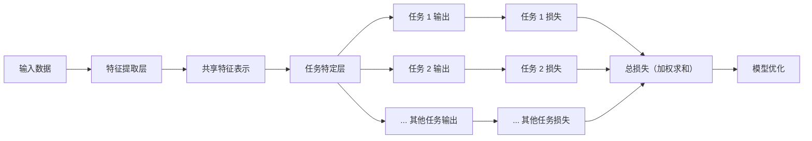

# 金融领域多任务学习在信用评分中的应用

> 关键词：金融领域、多任务学习、信用评分、机器学习、风险评估

> 摘要：本文聚焦于金融领域多任务学习在信用评分中的应用。首先介绍了研究的背景、目的、预期读者等内容。详细阐述了多任务学习和信用评分的核心概念及联系，给出了原理和架构的示意图与流程图。深入讲解了核心算法原理并结合Python代码说明具体操作步骤，同时介绍了相关的数学模型和公式。通过项目实战，展示了代码实际案例并进行详细解释。探讨了多任务学习在信用评分中的实际应用场景，推荐了学习、开发工具及相关论文著作。最后总结了未来发展趋势与挑战，并对常见问题进行解答，提供了扩展阅读和参考资料，旨在为金融领域信用评分应用多任务学习提供全面且深入的技术指导。

## 1. 背景介绍 
### 1.1 目的和范围
在金融领域，信用评分是评估借款人信用风险的重要手段。传统的信用评分模型往往基于单任务学习，仅考虑单一目标，如预测违约概率。然而，金融数据具有多维度、关联性强的特点，单任务学习难以充分挖掘数据中的潜在信息。多任务学习通过同时学习多个相关任务，能够共享数据中的有用信息，提高模型的泛化能力和预测准确性。本文的目的在于探讨多任务学习在金融领域信用评分中的应用，详细介绍其原理、算法、实际应用案例等内容，为金融机构和相关从业者提供技术参考和实践指导。范围涵盖多任务学习的基本概念、核心算法、数学模型，以及在信用评分中的具体实现和应用场景。

### 1.2 预期读者
本文预期读者包括金融机构的风险评估人员、数据科学家、机器学习工程师，以及对金融科技和信用评分领域感兴趣的研究人员和学生。对于希望了解多任务学习在金融信用评分中应用的专业人士，本文提供了深入的技术分析和实践案例；对于初学者，本文也从基础概念出发，逐步引导读者理解多任务学习的原理和应用。

### 1.3 文档结构概述
本文共分为十个部分。第一部分为背景介绍，阐述了研究的目的、范围、预期读者和文档结构。第二部分介绍多任务学习和信用评分的核心概念与联系，包括原理和架构的示意图与流程图。第三部分详细讲解核心算法原理，并给出Python源代码说明具体操作步骤。第四部分介绍相关的数学模型和公式，并进行详细讲解和举例说明。第五部分通过项目实战，展示代码实际案例并进行详细解释。第六部分探讨多任务学习在信用评分中的实际应用场景。第七部分推荐学习、开发工具及相关论文著作。第八部分总结未来发展趋势与挑战。第九部分对常见问题进行解答。第十部分提供扩展阅读和参考资料。

### 1.4 术语表
#### 1.4.1 核心术语定义
- **多任务学习（Multi - task Learning）**：一种机器学习范式，通过同时学习多个相关任务，使模型能够共享不同任务之间的有用信息，从而提高模型的泛化能力和性能。
- **信用评分（Credit Scoring）**：根据借款人的信用历史、财务状况等信息，对其信用风险进行量化评估的过程。
- **违约概率（Probability of Default, PD）**：借款人在一定期限内违约的可能性。
- **特征共享（Feature Sharing）**：多任务学习中，不同任务之间共享部分特征表示，以提高模型的学习效率。

#### 1.4.2 相关概念解释
- **单任务学习（Single - task Learning）**：与多任务学习相对，单任务学习只关注一个特定的任务，独立地进行模型训练和预测。
- **正则化（Regularization）**：一种防止模型过拟合的技术，通过在损失函数中添加额外的惩罚项，限制模型的复杂度。
- **损失函数（Loss Function）**：用于衡量模型预测结果与真实标签之间的差异，模型训练的目标是最小化损失函数。

#### 1.4.3 缩略词列表
- **PD**：Probability of Default（违约概率）
- **MSE**：Mean Squared Error（均方误差）
- **RMSE**：Root Mean Squared Error（均方根误差）
- **AUC**：Area Under the Curve（曲线下面积）

## 2. 核心概念与联系 

### 2.1 多任务学习的原理
多任务学习的核心思想是通过同时学习多个相关任务，利用任务之间的相关性和共享信息来提高模型的性能。在金融信用评分中，可能存在多个相关任务，如预测违约概率、预测逾期天数、预测贷款额度等。这些任务之间存在一定的关联，例如违约概率高的借款人往往逾期天数也较长。多任务学习通过共享特征表示和模型参数，使模型能够更好地捕捉这些关联信息，从而提高每个任务的预测准确性。

### 2.2 信用评分的原理
信用评分是根据借款人的各种信息，如个人基本信息、信用历史、财务状况等，构建一个数学模型来评估其信用风险。常见的信用评分模型包括逻辑回归、决策树、随机森林等。这些模型通过对历史数据的学习，建立输入特征与信用风险之间的映射关系，从而对新的借款人进行信用评分。

### 2.3 多任务学习与信用评分的联系
多任务学习可以为信用评分带来以下好处：
- **提高信息利用率**：金融数据中包含大量的信息，单任务学习可能无法充分利用这些信息。多任务学习通过同时学习多个相关任务，能够挖掘数据中的潜在信息，提高模型的信息利用率。
- **增强模型泛化能力**：多任务学习可以共享不同任务之间的信息，使模型能够学习到更通用的特征表示，从而增强模型的泛化能力，减少过拟合的风险。
- **提供更全面的风险评估**：通过同时预测多个相关的信用指标，如违约概率、逾期天数等，多任务学习可以提供更全面的风险评估，帮助金融机构做出更准确的决策。

### 2.4 核心概念原理和架构的文本示意图
```plaintext
输入数据（借款人信息）
|
|-- 特征提取层
|       |
|       |-- 共享特征表示
|
|-- 任务特定层
|       |
|       |-- 任务 1 输出（如违约概率）
|       |-- 任务 2 输出（如逾期天数）
|       |-- ...
|
|-- 损失函数层
|       |
|       |-- 任务 1 损失
|       |-- 任务 2 损失
|       |-- ...
|       |-- 总损失（加权求和）
|
|-- 模型优化
```

### 2.5 Mermaid 流程图


## 3. 核心算法原理 & 具体操作步骤 

### 3.1 核心算法原理
多任务学习的一种常见方法是使用共享底层特征表示，然后在不同的任务上分别构建任务特定的输出层。具体来说，模型的输入是借款人的特征向量 $x$，经过特征提取层得到共享特征表示 $h$。然后，对于每个任务 $i$，使用一个任务特定的权重矩阵 $W_i$ 和偏置向量 $b_i$ 对共享特征表示进行线性变换，得到任务 $i$ 的输出 $y_i$：

$$h = f(x; \theta_{shared})$$
$$y_i = W_i h + b_i$$

其中，$f$ 是特征提取函数，$\theta_{shared}$ 是共享特征提取层的参数。

模型的目标是最小化所有任务的损失函数的加权和。假设任务 $i$ 的损失函数为 $L_i(y_i, \hat{y}_i)$，其中 $\hat{y}_i$ 是任务 $i$ 的真实标签，那么总损失函数 $L$ 可以表示为：

$$L = \sum_{i=1}^{n} \alpha_i L_i(y_i, \hat{y}_i)$$

其中，$\alpha_i$ 是任务 $i$ 的权重，用于控制每个任务在总损失中的重要性。

### 3.2 具体操作步骤

#### 3.2.1 数据预处理
- **数据清洗**：去除数据中的缺失值、异常值等。
- **特征选择**：选择与信用评分相关的特征，减少特征维度。
- **特征编码**：将分类特征转换为数值特征，例如使用独热编码（One - Hot Encoding）。
- **数据划分**：将数据集划分为训练集、验证集和测试集。

#### 3.2.2 模型构建
- **定义共享特征提取层**：可以使用全连接层、卷积层等作为共享特征提取层。
- **定义任务特定层**：为每个任务定义一个任务特定的输出层。
- **定义损失函数**：根据任务的类型选择合适的损失函数，如逻辑回归任务使用交叉熵损失函数，回归任务使用均方误差损失函数。
- **定义优化器**：选择合适的优化器，如随机梯度下降（SGD）、Adam 等，用于最小化总损失函数。

#### 3.2.3 模型训练
- **初始化模型参数**：随机初始化共享特征提取层和任务特定层的参数。
- **迭代训练**：在训练集上进行多次迭代，每次迭代中计算总损失函数，并使用优化器更新模型参数。
- **验证模型**：在验证集上评估模型的性能，根据验证结果调整模型参数和超参数。

#### 3.2.4 模型评估
- **在测试集上评估模型**：使用测试集评估模型在各个任务上的性能，如准确率、召回率、均方根误差等。
- **分析模型结果**：分析模型的预测结果，评估模型的可靠性和有效性。

### 3.3 Python 源代码实现

```python
import numpy as np
import torch
import torch.nn as nn
import torch.optim as optim
from torch.utils.data import Dataset, DataLoader

# 定义数据集类
class CreditDataset(Dataset):
    def __init__(self, X, y1, y2):
        self.X = torch.tensor(X, dtype=torch.float32)
        self.y1 = torch.tensor(y1, dtype=torch.float32)
        self.y2 = torch.tensor(y2, dtype=torch.float32)

    def __len__(self):
        return len(self.X)

    def __getitem__(self, idx):
        return self.X[idx], self.y1[idx], self.y2[idx]

# 定义多任务学习模型
class MultiTaskModel(nn.Module):
    def __init__(self, input_size, hidden_size):
        super(MultiTaskModel, self).__init__()
        # 共享特征提取层
        self.shared_layer = nn.Linear(input_size, hidden_size)
        self.relu = nn.ReLU()
        # 任务 1 特定层
        self.task1_layer = nn.Linear(hidden_size, 1)
        # 任务 2 特定层
        self.task2_layer = nn.Linear(hidden_size, 1)

    def forward(self, x):
        h = self.relu(self.shared_layer(x))
        y1 = self.task1_layer(h)
        y2 = self.task2_layer(h)
        return y1, y2

# 数据预处理
# 假设 X 是输入特征，y1 是任务 1 的标签，y2 是任务 2 的标签
X = np.random.rand(1000, 10)
y1 = np.random.rand(1000, 1)
y2 = np.random.rand(1000, 1)

# 划分数据集
train_size = int(0.8 * len(X))
X_train, X_test = X[:train_size], X[train_size:]
y1_train, y1_test = y1[:train_size], y1[train_size:]
y2_train, y2_test = y2[:train_size], y2[train_size:]

# 创建数据集和数据加载器
train_dataset = CreditDataset(X_train, y1_train, y2_train)
train_loader = DataLoader(train_dataset, batch_size=32, shuffle=True)

# 初始化模型
input_size = X.shape[1]
hidden_size = 20
model = MultiTaskModel(input_size, hidden_size)

# 定义损失函数和优化器
criterion1 = nn.MSELoss()
criterion2 = nn.MSELoss()
optimizer = optim.Adam(model.parameters(), lr=0.001)

# 训练模型
num_epochs = 10
for epoch in range(num_epochs):
    running_loss = 0.0
    for inputs, target1, target2 in train_loader:
        optimizer.zero_grad()
        y1_pred, y2_pred = model(inputs)
        loss1 = criterion1(y1_pred, target1)
        loss2 = criterion2(y2_pred, target2)
        # 总损失
        total_loss = loss1 + loss2
        total_loss.backward()
        optimizer.step()
        running_loss += total_loss.item()
    print(f'Epoch {epoch + 1}, Loss: {running_loss / len(train_loader)}')

# 评估模型
X_test_tensor = torch.tensor(X_test, dtype=torch.float32)
y1_pred_test, y2_pred_test = model(X_test_tensor)
loss1_test = criterion1(y1_pred_test, torch.tensor(y1_test, dtype=torch.float32))
loss2_test = criterion2(y2_pred_test, torch.tensor(y2_test, dtype=torch.float32))
print(f'Test Loss 1: {loss1_test.item()}, Test Loss 2: {loss2_test.item()}')
```

## 4. 数学模型和公式 & 详细讲解 & 举例说明 

### 4.1 损失函数
在多任务学习中，常用的损失函数包括均方误差损失函数（MSE）和交叉熵损失函数。

#### 4.1.1 均方误差损失函数（MSE）
均方误差损失函数用于回归任务，计算预测值与真实值之间的平方误差的平均值。对于一个包含 $N$ 个样本的数据集，任务 $i$ 的均方误差损失函数定义为：

$$L_{MSE}^i = \frac{1}{N} \sum_{j=1}^{N} (y_{ij} - \hat{y}_{ij})^2$$

其中，$y_{ij}$ 是第 $j$ 个样本在任务 $i$ 上的真实值，$\hat{y}_{ij}$ 是第 $j$ 个样本在任务 $i$ 上的预测值。

**举例说明**：假设我们有一个回归任务，预测借款人的逾期天数。真实的逾期天数为 $[3, 5, 7]$，模型的预测值为 $[2, 6, 8]$。则均方误差损失为：

$$L_{MSE} = \frac{(3 - 2)^2+(5 - 6)^2+(7 - 8)^2}{3}=\frac{1 + 1+1}{3}=1$$

#### 4.1.2 交叉熵损失函数
交叉熵损失函数用于分类任务，衡量预测概率分布与真实概率分布之间的差异。对于二分类任务，任务 $i$ 的交叉熵损失函数定义为：

$$L_{CE}^i = -\frac{1}{N} \sum_{j=1}^{N} [y_{ij} \log(\hat{y}_{ij})+(1 - y_{ij}) \log(1 - \hat{y}_{ij})]$$

其中，$y_{ij}$ 是第 $j$ 个样本在任务 $i$ 上的真实标签（0 或 1），$\hat{y}_{ij}$ 是第 $j$ 个样本在任务 $i$ 上的预测概率。

**举例说明**：假设我们有一个二分类任务，预测借款人是否违约。真实标签为 $[1, 0, 1]$，模型的预测概率为 $[0.8, 0.2, 0.9]$。则交叉熵损失为：

$$L_{CE}=-\frac{1}{3}[(1\times\log(0.8)+(1 - 1)\times\log(1 - 0.8))+(0\times\log(0.2)+(1 - 0)\times\log(1 - 0.2))+(1\times\log(0.9)+(1 - 1)\times\log(1 - 0.9))]$$

### 4.2 总损失函数
总损失函数是各个任务损失函数的加权和，定义为：

$$L = \sum_{i=1}^{n} \alpha_i L_i$$

其中，$\alpha_i$ 是任务 $i$ 的权重，$L_i$ 是任务 $i$ 的损失函数。权重 $\alpha_i$ 可以根据任务的重要性进行调整。

**举例说明**：假设我们有两个任务，任务 1 的损失函数为 $L_1$，任务 2 的损失函数为 $L_2$，任务 1 的权重为 0.6，任务 2 的权重为 0.4。则总损失函数为：

$$L = 0.6L_1+0.4L_2$$

### 4.3 模型优化
模型优化的目标是最小化总损失函数。常用的优化算法是随机梯度下降（SGD）及其变种，如 Adam。

随机梯度下降算法的更新公式为：

$$\theta_{t + 1}=\theta_t-\eta\nabla L(\theta_t)$$

其中，$\theta_t$ 是第 $t$ 次迭代时的模型参数，$\eta$ 是学习率，$\nabla L(\theta_t)$ 是总损失函数在 $\theta_t$ 处的梯度。

**举例说明**：假设模型参数 $\theta$ 是一个一维向量，总损失函数 $L(\theta)=\theta^2$。则梯度 $\nabla L(\theta)=2\theta$。如果初始参数 $\theta_0 = 1$，学习率 $\eta = 0.1$，则第一次迭代时的参数更新为：

$$\theta_1=\theta_0-\eta\nabla L(\theta_0)=1 - 0.1\times2\times1 = 0.8$$

## 5. 项目实战：代码实际案例和详细解释说明 

### 5.1 开发环境搭建
#### 5.1.1 安装 Python
首先，确保你已经安装了 Python 3.x 版本。可以从 Python 官方网站（https://www.python.org/downloads/）下载并安装适合你操作系统的 Python 版本。

#### 5.1.2 安装必要的库
使用以下命令安装必要的 Python 库：
```bash
pip install numpy torch pandas scikit - learn
```
- **numpy**：用于进行数值计算。
- **torch**：用于构建和训练深度学习模型。
- **pandas**：用于数据处理和分析。
- **scikit - learn**：用于数据预处理和模型评估。

### 5.2 源代码详细实现和代码解读

```python
import numpy as np
import pandas as pd
import torch
import torch.nn as nn
import torch.optim as optim
from torch.utils.data import Dataset, DataLoader
from sklearn.model_selection import train_test_split
from sklearn.preprocessing import StandardScaler

# 定义数据集类
class CreditDataset(Dataset):
    def __init__(self, X, y1, y2):
        # 将输入特征和标签转换为 PyTorch 张量
        self.X = torch.tensor(X, dtype=torch.float32)
        self.y1 = torch.tensor(y1, dtype=torch.float32)
        self.y2 = torch.tensor(y2, dtype=torch.float32)

    def __len__(self):
        # 返回数据集的长度
        return len(self.X)

    def __getitem__(self, idx):
        # 根据索引返回输入特征和标签
        return self.X[idx], self.y1[idx], self.y2[idx]

# 定义多任务学习模型
class MultiTaskModel(nn.Module):
    def __init__(self, input_size, hidden_size):
        super(MultiTaskModel, self).__init__()
        # 共享特征提取层
        self.shared_layer = nn.Linear(input_size, hidden_size)
        self.relu = nn.ReLU()
        # 任务 1 特定层
        self.task1_layer = nn.Linear(hidden_size, 1)
        # 任务 2 特定层
        self.task2_layer = nn.Linear(hidden_size, 1)

    def forward(self, x):
        # 前向传播
        h = self.relu(self.shared_layer(x))
        y1 = self.task1_layer(h)
        y2 = self.task2_layer(h)
        return y1, y2

# 加载数据
data = pd.read_csv('credit_data.csv')
# 假设数据集中包含输入特征和两个任务的标签
X = data.drop(['target1', 'target2'], axis=1).values
y1 = data['target1'].values
y2 = data['target2'].values

# 数据预处理
scaler = StandardScaler()
X = scaler.fit_transform(X)

# 划分数据集
X_train, X_test, y1_train, y1_test, y2_train, y2_test = train_test_split(X, y1, y2, test_size=0.2, random_state=42)

# 创建数据集和数据加载器
train_dataset = CreditDataset(X_train, y1_train, y2_train)
train_loader = DataLoader(train_dataset, batch_size=32, shuffle=True)

# 初始化模型
input_size = X.shape[1]
hidden_size = 20
model = MultiTaskModel(input_size, hidden_size)

# 定义损失函数和优化器
criterion1 = nn.MSELoss()
criterion2 = nn.MSELoss()
optimizer = optim.Adam(model.parameters(), lr=0.001)

# 训练模型
num_epochs = 10
for epoch in range(num_epochs):
    running_loss = 0.0
    for inputs, target1, target2 in train_loader:
        optimizer.zero_grad()
        y1_pred, y2_pred = model(inputs)
        loss1 = criterion1(y1_pred, target1)
        loss2 = criterion2(y2_pred, target2)
        # 总损失
        total_loss = loss1 + loss2
        total_loss.backward()
        optimizer.step()
        running_loss += total_loss.item()
    print(f'Epoch {epoch + 1}, Loss: {running_loss / len(train_loader)}')

# 评估模型
X_test_tensor = torch.tensor(X_test, dtype=torch.float32)
y1_pred_test, y2_pred_test = model(X_test_tensor)
loss1_test = criterion1(y1_pred_test, torch.tensor(y1_test, dtype=torch.float32))
loss2_test = criterion2(y2_pred_test, torch.tensor(y2_test, dtype=torch.float32))
print(f'Test Loss 1: {loss1_test.item()}, Test Loss 2: {loss2_test.item()}')
```

### 5.3 代码解读与分析
#### 5.3.1 数据集类 `CreditDataset`
- `__init__` 方法：将输入特征和标签转换为 PyTorch 张量。
- `__len__` 方法：返回数据集的长度。
- `__getitem__` 方法：根据索引返回输入特征和标签。

#### 5.3.2 多任务学习模型 `MultiTaskModel`
- `__init__` 方法：定义共享特征提取层和任务特定层。
- `forward` 方法：实现前向传播，计算每个任务的输出。

#### 5.3.3 数据预处理
- 使用 `StandardScaler` 对输入特征进行标准化处理，使特征具有零均值和单位方差。
- 使用 `train_test_split` 函数将数据集划分为训练集和测试集。

#### 5.3.4 模型训练
- 使用 `Adam` 优化器最小化总损失函数。
- 在每个 epoch 中，遍历训练数据加载器，计算每个任务的损失，然后计算总损失并进行反向传播和参数更新。

#### 5.3.5 模型评估
- 在测试集上评估模型的性能，计算每个任务的测试损失。

## 6. 实际应用场景 
### 6.1 个人信贷审批
在个人信贷审批中，金融机构需要评估借款人的信用风险，以决定是否批准贷款以及贷款的额度和利率。多任务学习可以同时预测多个相关指标，如违约概率、逾期天数、贷款偿还能力等，为信贷审批提供更全面的风险评估。例如，通过同时学习违约概率和逾期天数，模型可以更好地捕捉借款人的还款行为特征，提高信贷审批的准确性。

### 6.2 信用卡风险管理
信用卡风险管理包括信用额度调整、逾期催收等。多任务学习可以帮助银行更好地管理信用卡风险。例如，通过同时预测持卡人的违约概率和消费行为，银行可以根据持卡人的信用状况动态调整信用额度，及时采取逾期催收措施，降低信用卡风险。

### 6.3 中小企业信贷评估
中小企业的信用评估相对复杂，因为中小企业的财务数据可能不完整，经营状况波动较大。多任务学习可以综合考虑多个因素，如企业的财务指标、行业前景、经营管理水平等，为中小企业信贷评估提供更准确的风险评估。例如，同时预测企业的违约概率和盈利能力，帮助银行做出更合理的信贷决策。

### 6.4 金融投资决策
在金融投资决策中，投资者需要评估投资标的的风险和收益。多任务学习可以同时预测投资标的的收益率、波动率、违约风险等多个指标，为投资者提供更全面的投资信息。例如，在债券投资中，同时预测债券的违约概率和收益率，帮助投资者选择更合适的投资标的。

## 7. 工具和资源推荐
### 7.1 学习资源推荐
#### 7.1.1 书籍推荐
- 《机器学习》（周志华）：介绍了机器学习的基本概念、算法和应用，是机器学习领域的经典教材。
- 《深度学习》（Ian Goodfellow、Yoshua Bengio、Aaron Courville）：全面介绍了深度学习的理论和实践，适合深入学习深度学习的读者。
- 《Python 数据分析实战》（Sebastian Raschka）：介绍了使用 Python 进行数据分析的方法和技巧，包括数据处理、可视化、机器学习等方面。

#### 7.1.2 在线课程
- Coursera 上的“机器学习”课程（Andrew Ng 教授）：是机器学习领域的经典在线课程，讲解了机器学习的基本概念和算法。
- edX 上的“深度学习基础”课程：由百度和华盛顿大学联合推出，介绍了深度学习的基本原理和应用。
- Kaggle 上的机器学习和数据科学教程：提供了丰富的实践案例和教程，帮助读者提高数据分析和机器学习能力。

#### 7.1.3 技术博客和网站
- Medium 上的机器学习和数据科学博客：有许多专业人士分享机器学习和数据科学的最新研究成果和实践经验。
- Towards Data Science：是一个专注于数据科学和机器学习的技术博客，提供了大量的优质文章和教程。
- arXiv：是一个预印本数据库，包含了许多机器学习和人工智能领域的最新研究论文。

### 7.2 开发工具框架推荐
#### 7.2.1 IDE和编辑器
- PyCharm：是一款专业的 Python 集成开发环境，提供了代码编辑、调试、版本控制等功能，适合开发 Python 项目。
- Jupyter Notebook：是一个交互式的笔记本环境，适合进行数据探索、模型训练和结果展示。
- Visual Studio Code：是一款轻量级的代码编辑器，支持多种编程语言，并且有丰富的扩展插件。

#### 7.2.2 调试和性能分析工具
- PyTorch Profiler：是 PyTorch 提供的性能分析工具，可以帮助用户分析模型的运行时间和内存使用情况。
- TensorBoard：是 TensorFlow 提供的可视化工具，也可以用于 PyTorch 模型的可视化和调试。
- cProfile：是 Python 内置的性能分析工具，可以帮助用户分析 Python 代码的运行时间和函数调用情况。

#### 7.2.3 相关框架和库
- PyTorch：是一个开源的深度学习框架，提供了丰富的深度学习模型和工具，适合进行多任务学习的开发。
- TensorFlow：是另一个流行的深度学习框架，具有强大的分布式训练和部署能力。
- Scikit - learn：是一个用于机器学习的 Python 库，提供了许多常用的机器学习算法和工具，如数据预处理、模型评估等。

### 7.3 相关论文著作推荐
#### 7.3.1 经典论文
- "Multi-Task Learning"（Rich Caruana）：是多任务学习领域的经典论文，介绍了多任务学习的基本概念和方法。
- "Learning Multiple Tasks with Gradient Boosting"（Yoav Freund、Llew Mason、Najeeha H. Sill）：提出了一种基于梯度提升的多任务学习方法。
- "An Overview of Multi-Task Learning in Deep Neural Networks"（Sebastian Ruder）：对深度学习中的多任务学习进行了全面的综述。

#### 7.3.2 最新研究成果
- 关注 arXiv 上关于多任务学习和金融信用评分的最新研究论文，了解该领域的最新进展。
- 参加国际机器学习会议（ICML）、神经信息处理系统大会（NeurIPS）等学术会议，获取最新的研究成果。

#### 7.3.3 应用案例分析
- Kaggle 上有许多关于金融信用评分的竞赛和案例，通过分析这些案例可以学习到多任务学习在实际应用中的技巧和方法。
- 金融机构的研究报告和白皮书，介绍了多任务学习在金融领域的实际应用案例和效果。

## 8. 总结：未来发展趋势与挑战
### 8.1 未来发展趋势
#### 8.1.1 与深度学习的深度融合
随着深度学习技术的不断发展，多任务学习将与深度学习更加紧密地结合。例如，使用更复杂的深度学习架构，如卷积神经网络（CNN）、循环神经网络（RNN）等，来提取更丰富的特征表示，提高多任务学习的性能。

#### 8.1.2 强化学习的应用
强化学习可以为多任务学习提供一种新的学习方式。通过将多任务学习与强化学习相结合，可以根据任务的实时反馈动态调整模型的参数和任务权重，提高模型的适应性和性能。

#### 8.1.3 跨领域应用
多任务学习在金融领域的成功应用将推动其在其他领域的跨领域应用。例如，在医疗领域，多任务学习可以同时预测疾病的诊断、治疗效果和复发风险；在交通领域，多任务学习可以同时预测交通流量、交通事故风险和出行需求。

### 8.2 挑战
#### 8.2.1 任务相关性的度量和利用
如何准确地度量任务之间的相关性，并有效地利用这些相关性是多任务学习面临的一个挑战。不同任务之间的相关性可能是复杂的、非线性的，需要开发更有效的方法来挖掘和利用这些相关性。

#### 8.2.2 任务权重的动态调整
在多任务学习中，任务权重的选择对模型的性能有重要影响。如何根据任务的重要性和数据的分布动态调整任务权重，是一个需要解决的问题。

#### 8.2.3 模型的可解释性
深度学习模型通常具有较高的复杂度，导致模型的可解释性较差。在金融领域，模型的可解释性尤为重要，因为金融决策需要有明确的依据。如何提高多任务学习模型的可解释性，是未来研究的一个重要方向。

## 9. 附录：常见问题与解答
### 9.1 多任务学习一定比单任务学习效果好吗？
不一定。多任务学习的效果取决于任务之间的相关性和数据的质量。如果任务之间相关性较弱，或者数据中存在噪声和异常值，多任务学习可能无法充分发挥其优势，甚至可能比单任务学习效果更差。

### 9.2 如何选择合适的任务权重？
任务权重的选择可以根据任务的重要性和数据的分布来确定。一种简单的方法是根据任务的先验知识手动设置任务权重。另一种方法是使用自适应的方法，如通过优化算法自动调整任务权重，使总损失函数最小化。

### 9.3 多任务学习模型的训练时间会比单任务学习模型长吗？
一般来说，多任务学习模型的训练时间会比单任务学习模型长。因为多任务学习需要同时考虑多个任务的损失函数，计算量相对较大。但是，通过合理的模型设计和优化算法的选择，可以在一定程度上减少训练时间。

### 9.4 如何评估多任务学习模型的性能？
可以使用每个任务的评估指标来评估多任务学习模型的性能，如准确率、召回率、均方根误差等。同时，也可以考虑使用总损失函数来评估模型的整体性能。在实际应用中，还需要根据具体的业务需求和目标来选择合适的评估指标。

## 10. 扩展阅读 & 参考资料
### 10.1 扩展阅读
- 《人工智能：现代方法》（Stuart Russell、Peter Norvig）：介绍了人工智能的基本概念、算法和应用，是人工智能领域的经典教材。
- 《数据挖掘：概念与技术》（Jiawei Han、Jian Pei、Jianwen Yin）：介绍了数据挖掘的基本概念、算法和应用，适合深入学习数据挖掘的读者。
- 《金融科技：框架与实践》（谢平、邹传伟）：介绍了金融科技的基本概念、技术和应用，对金融领域的技术创新有深入的探讨。

### 10.2 参考资料
- Goodfellow, I., Bengio, Y., & Courville, A. (2016). Deep Learning. MIT Press.
- Caruana, R. (1997). Multi-Task Learning. Machine Learning, 28(1), 41 - 75.
- Ruder, S. (2017). An Overview of Multi-Task Learning in Deep Neural Networks. arXiv preprint arXiv:1706.05098.
- 数据集来源：可从 Kaggle、UCI Machine Learning Repository 等网站获取金融信用评分相关的数据集。