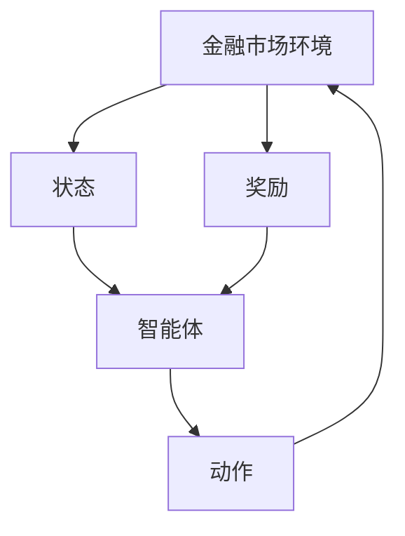

# 金融领域强化学习在动态最优执行策略中的应用

> 关键词：金融领域、强化学习、动态最优执行策略、马尔可夫决策过程、智能交易

> 摘要：本文深入探讨了金融领域中强化学习在动态最优执行策略方面的应用。首先介绍了相关背景知识，包括研究目的、预期读者、文档结构和术语定义。接着阐述了核心概念，如强化学习和动态最优执行策略的原理及联系，并给出了相应的文本示意图和 Mermaid 流程图。详细讲解了核心算法原理，通过 Python 代码进行具体说明，同时介绍了相关的数学模型和公式，并举例说明。通过项目实战，展示了开发环境搭建、源代码实现及解读。分析了强化学习在金融领域的实际应用场景，推荐了学习资源、开发工具框架和相关论文著作。最后总结了未来发展趋势与挑战，并提供了常见问题解答和扩展阅读参考资料。

## 1. 背景介绍 
### 1.1 目的和范围
在金融市场中，交易执行策略的优劣直接影响交易成本和收益。传统的交易执行策略往往基于静态模型，难以适应市场的动态变化。而强化学习作为一种能够在动态环境中学习最优策略的机器学习方法，为金融领域的动态最优执行策略提供了新的解决方案。本文的目的在于深入探讨强化学习在金融动态最优执行策略中的应用原理、算法实现和实际应用场景，帮助读者全面了解这一领域的理论和实践。

本文的范围涵盖了强化学习的基本概念、动态最优执行策略的核心原理、相关算法的 Python 实现、实际应用案例分析，以及学习资源和工具的推荐等方面。

### 1.2 预期读者
本文预期读者包括金融领域的从业者，如交易员、投资经理、金融分析师等，他们希望了解强化学习技术在金融交易执行中的应用，以优化交易策略和提高收益。同时，也适合计算机科学和人工智能领域的研究人员和开发者，他们对将强化学习应用于金融场景感兴趣，希望通过实际案例加深对强化学习的理解和应用能力。此外，对金融科技和量化交易有兴趣的学生和爱好者也可以从本文中获取有价值的信息。

### 1.3 文档结构概述
本文共分为十个部分。第一部分为背景介绍，阐述了研究的目的、预期读者、文档结构和术语定义。第二部分介绍核心概念与联系，包括强化学习和动态最优执行策略的原理及联系，并给出文本示意图和 Mermaid 流程图。第三部分详细讲解核心算法原理，并通过 Python 代码进行具体操作步骤的说明。第四部分介绍相关的数学模型和公式，并举例说明。第五部分进行项目实战，包括开发环境搭建、源代码详细实现和代码解读。第六部分分析强化学习在金融领域的实际应用场景。第七部分推荐学习资源、开发工具框架和相关论文著作。第八部分总结未来发展趋势与挑战。第九部分为附录，提供常见问题与解答。第十部分给出扩展阅读和参考资料。

### 1.4 术语表
#### 1.4.1 核心术语定义
- **强化学习（Reinforcement Learning）**：是一种机器学习方法，智能体（Agent）通过与环境进行交互，根据环境反馈的奖励信号来学习最优策略，以最大化长期累积奖励。
- **动态最优执行策略（Dynamic Optimal Execution Strategy）**：在金融交易中，根据市场的动态变化，实时调整交易指令的执行方式和时机，以达到最小化交易成本或最大化交易收益的策略。
- **智能体（Agent）**：在强化学习中，执行动作并与环境进行交互的主体。在金融交易场景中，智能体可以是交易算法或交易系统。
- **环境（Environment）**：智能体交互的外部世界，在金融交易中，环境可以是金融市场，包括价格、成交量等市场信息。
- **状态（State）**：环境在某一时刻的特征描述，在金融交易中，状态可以包括当前的市场价格、剩余待交易的数量、时间等信息。
- **动作（Action）**：智能体在某一状态下可以执行的操作，在金融交易中，动作可以是买入、卖出的数量。
- **奖励（Reward）**：环境在智能体执行动作后给予的反馈信号，用于评价动作的好坏。在金融交易中，奖励可以是交易成本的减少或收益的增加。

#### 1.4.2 相关概念解释
- **马尔可夫决策过程（Markov Decision Process，MDP）**：是强化学习的数学基础，描述了智能体在环境中的决策过程。MDP 具有马尔可夫性，即智能体的下一个状态只与当前状态和当前动作有关，而与历史状态和动作无关。
- **策略（Policy）**：是智能体在不同状态下选择动作的规则，通常用 $\pi(s)$ 表示，其中 $s$ 是状态。
- **价值函数（Value Function）**：用于评估状态或状态 - 动作对的价值。状态价值函数 $V^{\pi}(s)$ 表示在策略 $\pi$ 下，从状态 $s$ 开始的长期累积奖励的期望；动作价值函数 $Q^{\pi}(s,a)$ 表示在策略 $\pi$ 下，从状态 $s$ 执行动作 $a$ 后的长期累积奖励的期望。

#### 1.4.3 缩略词列表
- **MDP**：Markov Decision Process（马尔可夫决策过程）
- **Q - learning**：一种无模型的强化学习算法
- **DQN**：Deep Q - Network（深度 Q 网络）

## 2. 核心概念与联系 

### 强化学习原理
强化学习的核心思想是智能体通过与环境进行交互，不断尝试不同的动作，并根据环境反馈的奖励信号来学习最优策略。智能体在每个时间步 $t$ 观察环境的状态 $s_t$，选择一个动作 $a_t$ 执行，环境根据动作更新状态为 $s_{t + 1}$，并给予智能体一个奖励 $r_{t+1}$。智能体的目标是学习一个策略 $\pi$，使得长期累积奖励最大化，即 $\max_{\pi} E\left[\sum_{t = 0}^{T}\gamma^{t}r_{t+1}\right]$，其中 $\gamma \in [0,1]$ 是折扣因子，用于权衡近期奖励和远期奖励。

### 动态最优执行策略原理
在金融交易中，动态最优执行策略的目标是根据市场的动态变化，实时调整交易指令的执行方式和时机，以达到最小化交易成本或最大化交易收益。交易成本通常包括显性成本（如佣金）和隐性成本（如市场冲击成本）。市场冲击成本是指由于大额交易对市场价格产生的影响，导致交易价格偏离市场平均价格。动态最优执行策略需要考虑市场的流动性、价格波动等因素，以确定最优的交易数量和交易时间。

### 核心概念联系
强化学习可以用于求解动态最优执行策略。将金融市场视为环境，交易算法或交易系统视为智能体。智能体根据市场的状态（如价格、成交量、剩余待交易数量等）选择交易动作（如买入、卖出的数量），市场根据动作更新状态，并给予智能体一个奖励（如交易成本的减少或收益的增加）。智能体通过不断与市场环境进行交互，学习到在不同市场状态下的最优交易策略。

### 文本示意图
```plaintext
金融市场环境
|
|-- 状态（价格、成交量、剩余待交易数量等）
|
|-- 智能体（交易算法/系统）
|   |
|   |-- 动作（买入/卖出数量）
|
|-- 奖励（交易成本减少/收益增加）
```

### Mermaid 流程图


## 3. 核心算法原理 & 具体操作步骤 

### Q - learning 算法原理
Q - learning 是一种无模型的强化学习算法，用于学习最优动作价值函数 $Q^*(s,a)$。Q - learning 的核心思想是通过不断更新动作价值函数 $Q(s,a)$ 来逼近最优动作价值函数 $Q^*(s,a)$。Q - learning 的更新公式为：

$Q(s_t,a_t) \leftarrow Q(s_t,a_t) + \alpha\left[r_{t + 1}+\gamma\max_{a}Q(s_{t+1},a)-Q(s_t,a_t)\right]$

其中，$\alpha$ 是学习率，控制每次更新的步长；$\gamma$ 是折扣因子，权衡近期奖励和远期奖励。

### Python 代码实现
```python
import numpy as np

# 定义 Q - learning 类
class QLearningAgent:
    def __init__(self, state_size, action_size, learning_rate=0.1, discount_factor=0.9):
        self.state_size = state_size
        self.action_size = action_size
        self.learning_rate = learning_rate
        self.discount_factor = discount_factor
        # 初始化 Q 表
        self.q_table = np.zeros((state_size, action_size))

    def choose_action(self, state, epsilon=0.1):
        # epsilon - greedy 策略
        if np.random.uniform(0, 1) < epsilon:
            # 随机选择动作
            action = np.random.choice(self.action_size)
        else:
            # 选择 Q 值最大的动作
            action = np.argmax(self.q_table[state, :])
        return action

    def update_q_table(self, state, action, reward, next_state):
        # Q - learning 更新公式
        max_q_next = np.max(self.q_table[next_state, :])
        self.q_table[state, action] = (1 - self.learning_rate) * self.q_table[state, action] + \
                                      self.learning_rate * (reward + self.discount_factor * max_q_next)


# 示例使用
state_size = 10
action_size = 5
agent = QLearningAgent(state_size, action_size)

# 模拟一次交互
state = 2
action = agent.choose_action(state)
next_state = 3
reward = 1
agent.update_q_table(state, action, reward, next_state)
```

### 具体操作步骤
1. **初始化**：初始化 Q 表 $Q(s,a)$ 为全零矩阵，设置学习率 $\alpha$ 和折扣因子 $\gamma$。
2. **循环交互**：
    - 观察当前状态 $s_t$。
    - 使用 epsilon - greedy 策略选择动作 $a_t$。
    - 执行动作 $a_t$，观察下一个状态 $s_{t + 1}$ 和奖励 $r_{t + 1}$。
    - 根据 Q - learning 更新公式更新 Q 表 $Q(s_t,a_t)$。
3. **重复步骤 2**：直到达到最大训练步数或满足收敛条件。

## 4. 数学模型和公式 & 详细讲解 & 举例说明 

### 马尔可夫决策过程（MDP）
马尔可夫决策过程可以用一个五元组 $(S,A,P,R,\gamma)$ 表示，其中：
- $S$ 是状态空间，表示环境的所有可能状态。
- $A$ 是动作空间，表示智能体可以执行的所有可能动作。
- $P(s_{t + 1}|s_t,a_t)$ 是状态转移概率，表示在状态 $s_t$ 执行动作 $a_t$ 后转移到状态 $s_{t + 1}$ 的概率。
- $R(s_t,a_t,s_{t + 1})$ 是奖励函数，表示在状态 $s_t$ 执行动作 $a_t$ 后转移到状态 $s_{t + 1}$ 时获得的奖励。
- $\gamma \in [0,1]$ 是折扣因子，用于权衡近期奖励和远期奖励。

### 价值函数
#### 状态价值函数
状态价值函数 $V^{\pi}(s)$ 表示在策略 $\pi$ 下，从状态 $s$ 开始的长期累积奖励的期望，定义为：

$V^{\pi}(s)=E_{\pi}\left[\sum_{t = 0}^{\infty}\gamma^{t}r_{t+1}|s_0 = s\right]$

#### 动作价值函数
动作价值函数 $Q^{\pi}(s,a)$ 表示在策略 $\pi$ 下，从状态 $s$ 执行动作 $a$ 后的长期累积奖励的期望，定义为：

$Q^{\pi}(s,a)=E_{\pi}\left[\sum_{t = 0}^{\infty}\gamma^{t}r_{t+1}|s_0 = s,a_0 = a\right]$

### 贝尔曼方程
#### 状态价值函数的贝尔曼方程
$V^{\pi}(s)=\sum_{a\in A}\pi(a|s)\sum_{s'\in S}P(s'|s,a)\left[R(s,a,s')+\gamma V^{\pi}(s')\right]$

#### 动作价值函数的贝尔曼方程
$Q^{\pi}(s,a)=\sum_{s'\in S}P(s'|s,a)\left[R(s,a,s')+\gamma\sum_{a'\in A}\pi(a'|s')Q^{\pi}(s',a')\right]$

### 最优价值函数和最优策略
最优状态价值函数 $V^*(s)$ 和最优动作价值函数 $Q^*(s,a)$ 分别定义为：

$V^*(s)=\max_{\pi}V^{\pi}(s)$

$Q^*(s,a)=\max_{\pi}Q^{\pi}(s,a)$

最优策略 $\pi^*$ 满足：

$\pi^*(a|s)=\begin{cases}1, & a = \arg\max_{a'}Q^*(s,a')\\0, & \text{otherwise}\end{cases}$

### 举例说明
假设一个简单的金融交易场景，状态空间 $S=\{s_1,s_2\}$，动作空间 $A=\{a_1,a_2\}$，状态转移概率和奖励函数如下：

$P(s_1|s_1,a_1)=0.8$，$P(s_2|s_1,a_1)=0.2$，$R(s_1,a_1,s_1)=1$，$R(s_1,a_1,s_2)= - 1$

$P(s_1|s_1,a_2)=0.3$，$P(s_2|s_1,a_2)=0.7$，$R(s_1,a_2,s_1)=2$，$R(s_1,a_2,s_2)= - 2$

假设折扣因子 $\gamma = 0.9$，初始策略 $\pi(a_1|s_1)=0.6$，$\pi(a_2|s_1)=0.4$。

首先计算状态价值函数 $V^{\pi}(s_1)$：

$V^{\pi}(s_1)=\pi(a_1|s_1)\left[P(s_1|s_1,a_1)\left(R(s_1,a_1,s_1)+\gamma V^{\pi}(s_1)\right)+P(s_2|s_1,a_1)\left(R(s_1,a_1,s_2)+\gamma V^{\pi}(s_2)\right)\right]+\pi(a_2|s_1)\left[P(s_1|s_1,a_2)\left(R(s_1,a_2,s_1)+\gamma V^{\pi}(s_1)\right)+P(s_2|s_1,a_2)\left(R(s_1,a_2,s_2)+\gamma V^{\pi}(s_2)\right)\right]$

假设 $V^{\pi}(s_2)=0$，则：

$V^{\pi}(s_1)=0.6\times\left[0.8\times(1 + 0.9V^{\pi}(s_1))+0.2\times(-1+0)\right]+0.4\times\left[0.3\times(2 + 0.9V^{\pi}(s_1))+0.7\times(-2+0)\right]$

解这个方程可以得到 $V^{\pi}(s_1)$ 的值。

## 5. 项目实战：代码实际案例和详细解释说明 

### 5.1  开发环境搭建
#### 安装 Python
首先需要安装 Python 3.x 版本，可以从 Python 官方网站（https://www.python.org/downloads/）下载并安装。

#### 安装必要的库
在命令行中使用以下命令安装必要的库：
```sh
pip install numpy pandas matplotlib gym
```
- `numpy`：用于数值计算。
- `pandas`：用于数据处理和分析。
- `matplotlib`：用于数据可视化。
- `gym`：一个开源的强化学习环境库。

### 5.2  源代码详细实现和代码解读
#### 定义金融交易环境
```python
import gym
from gym import spaces
import numpy as np

class FinancialTradingEnv(gym.Env):
    def __init__(self, initial_balance=10000, initial_stock=0, price_data=None):
        super(FinancialTradingEnv, self).__init__()
        self.initial_balance = initial_balance
        self.initial_stock = initial_stock
        self.price_data = price_data
        self.current_step = 0
        self.balance = self.initial_balance
        self.stock = self.initial_stock

        # 定义动作空间和状态空间
        self.action_space = spaces.Discrete(3)  # 0: 不操作，1: 买入，2: 卖出
        self.observation_space = spaces.Box(low=0, high=np.inf, shape=(3,), dtype=np.float32)

    def reset(self):
        self.current_step = 0
        self.balance = self.initial_balance
        self.stock = self.initial_stock
        return self._get_observation()

    def step(self, action):
        current_price = self.price_data[self.current_step]
        if action == 1:  # 买入
            if self.balance >= current_price:
                self.stock += 1
                self.balance -= current_price
        elif action == 2:  # 卖出
            if self.stock > 0:
                self.stock -= 1
                self.balance += current_price

        self.current_step += 1
        done = self.current_step == len(self.price_data) - 1
        reward = self._calculate_reward()
        next_state = self._get_observation()
        return next_state, reward, done, {}

    def _get_observation(self):
        current_price = self.price_data[self.current_step]
        return np.array([self.balance, self.stock, current_price], dtype=np.float32)

    def _calculate_reward(self):
        current_price = self.price_data[self.current_step]
        portfolio_value = self.balance + self.stock * current_price
        return portfolio_value - self.initial_balance


# 示例使用
price_data = np.random.rand(100) * 100
env = FinancialTradingEnv(price_data=price_data)
state = env.reset()
done = False
while not done:
    action = env.action_space.sample()
    next_state, reward, done, _ = env.step(action)
    state = next_state
```

#### 代码解读
- **环境类定义**：`FinancialTradingEnv` 类继承自 `gym.Env`，定义了金融交易环境。
- **初始化方法**：`__init__` 方法初始化环境的初始资金、初始股票数量和价格数据，定义了动作空间和状态空间。
- **重置方法**：`reset` 方法将环境重置到初始状态，并返回初始观察状态。
- **步进方法**：`step` 方法根据动作更新环境状态，计算奖励，并返回下一个观察状态、奖励、是否完成标志和额外信息。
- **观察方法**：`_get_observation` 方法返回当前环境的观察状态，包括当前资金、股票数量和当前价格。
- **奖励计算方法**：`_calculate_reward` 方法计算当前步骤的奖励，奖励定义为当前投资组合价值与初始资金的差值。

### 5.3  代码解读与分析
#### 环境设计
通过 `gym.Env` 类封装金融交易环境，使得强化学习算法可以方便地与环境进行交互。动作空间定义为离散的三个动作：不操作、买入和卖出。状态空间包括当前资金、股票数量和当前价格，通过这些信息可以全面描述当前的交易状态。

#### 奖励设计
奖励函数设计为当前投资组合价值与初始资金的差值，这样可以激励智能体通过合理的交易策略增加投资组合的价值。

#### 交互过程
智能体通过与环境进行交互，不断选择动作并根据环境反馈的奖励来学习最优策略。在每次交互中，智能体观察当前状态，选择动作，执行动作后环境更新状态并返回奖励，智能体根据奖励更新策略。

## 6. 实际应用场景 
### 高频交易
在高频交易中，市场价格和流动性变化非常快，传统的交易策略难以实时适应市场变化。强化学习可以用于高频交易的动态最优执行策略，智能体根据实时的市场状态（如价格、成交量、买卖价差等）选择最优的交易动作（如买入、卖出的数量和时机），以最小化交易成本和最大化交易收益。

### 算法交易
算法交易是指使用计算机算法自动执行交易指令的交易方式。强化学习可以用于算法交易的执行策略优化，根据市场的动态变化实时调整交易指令的执行方式和时机。例如，在执行大额交易时，智能体可以根据市场的流动性和价格波动情况，将大额交易拆分成多个小额交易，并选择最优的交易时间和交易数量，以减少市场冲击成本。

### 投资组合管理
在投资组合管理中，强化学习可以用于动态调整投资组合的权重。智能体根据市场的状态（如资产价格、收益率、风险等）选择最优的资产配置策略，以最大化投资组合的收益和最小化风险。例如，在市场行情变化时，智能体可以实时调整股票、债券、现金等资产的比例，以适应市场变化。

## 7. 工具和资源推荐
### 7.1 学习资源推荐
#### 7.1.1 书籍推荐
- 《强化学习：原理与Python实现》：这本书系统地介绍了强化学习的基本原理和算法，并通过Python代码实现了各种强化学习算法，适合初学者入门。
- 《Reinforcement Learning: An Introduction》：这是强化学习领域的经典教材，详细介绍了强化学习的理论和算法，是深入学习强化学习的必备书籍。
- 《金融机器学习》：这本书介绍了机器学习在金融领域的应用，包括强化学习在金融交易中的应用，适合金融领域的从业者和对金融科技感兴趣的读者。

#### 7.1.2 在线课程
- Coursera上的“Reinforcement Learning Specialization”：由美国华盛顿大学的教授授课，系统地介绍了强化学习的理论和算法，并提供了实践项目。
- edX上的“Artificial Intelligence: Reinforcement Learning”：由加拿大阿尔伯塔大学的教授授课，深入讲解了强化学习的高级算法和应用。

#### 7.1.3 技术博客和网站
- OpenAI Blog：OpenAI发布的关于人工智能和强化学习的最新研究成果和应用案例。
- Towards Data Science：一个数据科学和机器学习的技术博客平台，上面有很多关于强化学习的文章和教程。

### 7.2 开发工具框架推荐
#### 7.2.1 IDE和编辑器
- PyCharm：一款专业的Python集成开发环境，提供了丰富的代码编辑、调试和项目管理功能。
- Jupyter Notebook：一个交互式的编程环境，适合进行数据探索、模型训练和可视化。

#### 7.2.2 调试和性能分析工具
- TensorBoard：一个用于可视化深度学习模型训练过程和性能的工具，可以帮助开发者监控模型的训练进度和性能指标。
- cProfile：Python内置的性能分析工具，可以帮助开发者找出代码中的性能瓶颈。

#### 7.2.3 相关框架和库
- TensorFlow：一个开源的深度学习框架，提供了丰富的深度学习模型和算法，支持强化学习的开发。
- PyTorch：另一个流行的深度学习框架，具有简洁的API和强大的计算能力，也广泛应用于强化学习领域。
- Stable Baselines3：一个基于PyTorch的强化学习库，提供了各种预训练的强化学习算法和环境，方便开发者快速实现强化学习项目。

### 7.3 相关论文著作推荐
#### 7.3.1 经典论文
- “Q - learning”：Watkins和Dayan在1992年发表的论文，提出了Q - learning算法，是强化学习领域的经典论文之一。
- “Playing Atari with Deep Reinforcement Learning”：Mnih等人在2013年发表的论文，提出了深度Q网络（DQN）算法，开启了深度强化学习的时代。

#### 7.3.2 最新研究成果
- 关注NeurIPS、ICML、AAAI等顶级人工智能会议上关于强化学习在金融领域应用的最新研究成果。
- 阅读《Journal of Financial Economics》、《Review of Financial Studies》等金融领域的顶级期刊上关于金融机器学习和强化学习的研究论文。

#### 7.3.3 应用案例分析
- 一些金融科技公司和量化交易机构会在其官方网站或技术博客上分享强化学习在金融交易中的应用案例，可以关注这些案例以了解实际应用中的经验和挑战。

## 8. 总结：未来发展趋势与挑战
### 未来发展趋势
- **深度强化学习的应用**：随着深度学习技术的不断发展，深度强化学习将在金融领域得到更广泛的应用。深度强化学习可以处理高维的市场数据，学习更复杂的交易策略，提高交易的效率和收益。
- **多智能体强化学习**：在金融市场中，存在多个参与者，如交易员、投资者、机构等。多智能体强化学习可以用于模拟多个参与者之间的交互和竞争，学习最优的群体策略，提高市场的稳定性和效率。
- **与其他技术的融合**：强化学习将与其他技术，如自然语言处理、计算机视觉等进行融合，实现更智能的金融交易决策。例如，通过自然语言处理技术分析新闻和社交媒体数据，获取市场情绪信息，结合强化学习进行交易决策。

### 挑战
- **数据质量和隐私问题**：金融数据通常包含敏感信息，数据的质量和隐私保护是一个重要的挑战。在使用强化学习进行金融交易时，需要确保数据的准确性、完整性和安全性。
- **模型可解释性**：深度强化学习模型通常是黑盒模型，难以解释其决策过程。在金融领域，模型的可解释性非常重要，因为监管机构和投资者需要了解模型的决策依据。
- **市场不确定性**：金融市场具有高度的不确定性，价格波动和市场变化难以预测。强化学习模型需要具备较强的鲁棒性，能够在不确定的市场环境中学习到有效的交易策略。

## 9. 附录：常见问题与解答
### 问题1：强化学习在金融交易中的应用是否需要大量的历史数据？
解答：强化学习在金融交易中的应用通常需要一定量的历史数据来训练模型。历史数据可以帮助模型学习市场的规律和模式，提高模型的性能。但是，数据量并不是越多越好，过多的数据可能会导致过拟合问题。此外，还可以使用在线学习的方法，让模型在实时的市场数据上进行学习和更新。

### 问题2：如何评估强化学习模型在金融交易中的性能？
解答：可以使用多种指标来评估强化学习模型在金融交易中的性能，如收益率、夏普比率、最大回撤等。收益率反映了模型的盈利能力，夏普比率衡量了模型在承担一定风险下的收益能力，最大回撤表示模型在交易过程中可能遭受的最大损失。此外，还可以通过模拟交易和实际交易来评估模型的性能。

### 问题3：强化学习模型在金融交易中是否能够保证盈利？
解答：强化学习模型在金融交易中不能保证盈利。金融市场具有高度的不确定性，价格波动和市场变化难以预测。强化学习模型只是根据历史数据和当前市场状态学习到的一种策略，不能完全适应未来市场的变化。因此，在使用强化学习模型进行金融交易时，需要进行风险控制和合理的资产配置。

## 10. 扩展阅读 & 参考资料
### 扩展阅读
- 可以阅读一些关于金融市场微观结构、行为金融学等方面的书籍，以深入了解金融市场的运行机制和投资者的行为模式，为强化学习在金融交易中的应用提供更深入的理论支持。
- 关注金融科技领域的最新发展动态，了解其他新技术在金融交易中的应用，如区块链、人工智能等。

### 参考资料
- Sutton, R. S., & Barto, A. G. (2018). Reinforcement Learning: An Introduction. MIT press.
- Mnih, V., Kavukcuoglu, K., Silver, D., Graves, A., Antonoglou, I., Wierstra, D., & Riedmiller, M. (2013). Playing Atari with Deep Reinforcement Learning. arXiv preprint arXiv:1312.5602.
- Watkins, C. J., & Dayan, P. (1992). Q - learning. Machine learning, 8(3 - 4), 279 - 292.