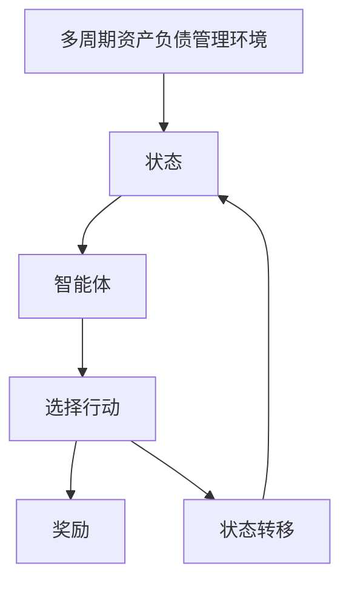

# 金融领域强化学习在多周期资产负债管理中的应用

> 关键词：金融领域、强化学习、多周期资产负债管理、马尔可夫决策过程、策略优化

> 摘要：本文聚焦于金融领域中强化学习在多周期资产负债管理的应用。首先介绍了该研究的背景、目的、预期读者及文档结构等内容。详细阐述了强化学习和多周期资产负债管理的核心概念及其联系，给出了相应的原理和架构示意图与流程图。深入讲解了核心算法原理，并用 Python 代码进行详细说明，同时介绍了相关的数学模型和公式。通过项目实战，展示了开发环境搭建、源代码实现及代码解读。探讨了其实际应用场景，推荐了学习资源、开发工具框架以及相关论文著作。最后总结了未来发展趋势与挑战，还设置了常见问题解答和扩展阅读参考资料，为金融领域的多周期资产负债管理提供了全面且深入的技术指导。

## 1. 背景介绍 
### 1.1 目的和范围
在金融领域，多周期资产负债管理是一个关键问题，它涉及到在多个时间段内合理配置资产和负债，以实现特定的金融目标，如最大化收益、最小化风险等。传统的资产负债管理方法往往基于静态模型和假设，难以适应市场的动态变化和不确定性。强化学习作为一种新兴的人工智能技术，具有在动态环境中学习最优策略的能力，为多周期资产负债管理提供了新的解决方案。

本文的目的是深入探讨强化学习在多周期资产负债管理中的应用，详细介绍相关的理论、算法和实践案例，为金融从业者和研究人员提供全面的技术指导。范围涵盖了强化学习的基本概念、核心算法原理、数学模型、实际应用场景以及相关的工具和资源推荐。

### 1.2 预期读者
本文的预期读者包括金融领域的从业者，如银行风险管理专家、投资经理、资产负债管理人员等，他们希望了解强化学习在资产负债管理中的应用，以提升业务决策的科学性和有效性。同时，也适合计算机科学和人工智能领域的研究人员和开发者，他们对金融应用场景感兴趣，希望通过实际案例深入理解强化学习的应用。此外，对金融科技和人工智能交叉领域感兴趣的学生和爱好者也可以从本文中获取有价值的信息。

### 1.3 文档结构概述
本文将按照以下结构进行组织：
- 核心概念与联系：介绍强化学习和多周期资产负债管理的核心概念，以及它们之间的联系，并给出相应的原理和架构示意图与流程图。
- 核心算法原理 & 具体操作步骤：详细讲解强化学习在多周期资产负债管理中常用的算法原理，并用 Python 代码进行详细说明。
- 数学模型和公式 & 详细讲解 & 举例说明：介绍相关的数学模型和公式，并通过具体例子进行详细讲解。
- 项目实战：通过一个实际的项目案例，展示如何使用强化学习进行多周期资产负债管理，包括开发环境搭建、源代码实现和代码解读。
- 实际应用场景：探讨强化学习在多周期资产负债管理中的实际应用场景。
- 工具和资源推荐：推荐相关的学习资源、开发工具框架和论文著作。
- 总结：总结未来发展趋势与挑战。
- 附录：解答常见问题。
- 扩展阅读 & 参考资料：提供相关的扩展阅读材料和参考资料。

### 1.4 术语表
#### 1.4.1 核心术语定义
- **强化学习（Reinforcement Learning）**：一种机器学习方法，智能体通过与环境进行交互，根据环境反馈的奖励信号来学习最优策略，以最大化长期累积奖励。
- **多周期资产负债管理（Multi - period Asset - Liability Management）**：在多个时间段内，对资产和负债进行合理配置和管理，以实现特定的金融目标。
- **智能体（Agent）**：在强化学习中，智能体是执行决策的主体，它根据当前的状态选择行动，并与环境进行交互。
- **环境（Environment）**：智能体所处的外部世界，它接收智能体的行动，并返回下一个状态和奖励信号。
- **状态（State）**：描述环境当前情况的一组变量，智能体根据状态来选择行动。
- **行动（Action）**：智能体在某个状态下可以采取的操作。
- **奖励（Reward）**：环境根据智能体的行动给予的反馈信号，用于指导智能体学习最优策略。
- **策略（Policy）**：智能体根据状态选择行动的规则，通常表示为一个函数 $\pi(s)$，其中 $s$ 是状态。

#### 1.4.2 相关概念解释
- **马尔可夫决策过程（Markov Decision Process，MDP）**：是强化学习的数学基础，它描述了一个动态系统，其中系统的状态转移具有马尔可夫性质，即下一个状态只依赖于当前状态和行动。一个 MDP 可以用一个五元组 $(S, A, P, R, \gamma)$ 表示，其中 $S$ 是状态空间，$A$ 是行动空间，$P$ 是状态转移概率，$R$ 是奖励函数，$\gamma$ 是折扣因子。
- **值函数（Value Function）**：用于评估在某个状态下采取某个策略的价值。常见的值函数包括状态值函数 $V^{\pi}(s)$ 和动作值函数 $Q^{\pi}(s, a)$，分别表示在状态 $s$ 下遵循策略 $\pi$ 的长期累积奖励的期望和在状态 $s$ 下采取行动 $a$ 并遵循策略 $\pi$ 的长期累积奖励的期望。
- **策略梯度（Policy Gradient）**：一种直接优化策略的强化学习算法，通过计算策略的梯度来更新策略参数，以最大化长期累积奖励。

#### 1.4.3 缩略词列表
- **MDP**：Markov Decision Process（马尔可夫决策过程）
- **DQN**：Deep Q - Network（深度 Q 网络）
- **A2C**：Advantage Actor - Critic（优势演员 - 评论家算法）
- **PPO**：Proximal Policy Optimization（近端策略优化算法）

## 2. 核心概念与联系 

### 2.1 强化学习核心概念原理
强化学习的核心思想是智能体通过与环境进行交互，不断尝试不同的行动，并根据环境反馈的奖励信号来学习最优策略。其基本原理可以用马尔可夫决策过程（MDP）来描述。

在 MDP 中，智能体在每个时间步 $t$ 处于一个状态 $s_t \in S$，根据当前策略 $\pi$ 选择一个行动 $a_t \in A$ 执行。环境接收到行动后，根据状态转移概率 $P(s_{t + 1}|s_t, a_t)$ 转移到下一个状态 $s_{t + 1}$，并给予智能体一个奖励 $r_t = R(s_t, a_t, s_{t + 1})$。智能体的目标是最大化长期累积奖励 $G_t=\sum_{k = 0}^{\infty}\gamma^{k}r_{t + k}$，其中 $\gamma \in [0, 1]$ 是折扣因子，用于平衡即时奖励和未来奖励。

为了评估策略的好坏，引入了值函数。状态值函数 $V^{\pi}(s)$ 定义为在状态 $s$ 下遵循策略 $\pi$ 的长期累积奖励的期望：
$$V^{\pi}(s)=\mathbb{E}_{\pi}\left[G_t|s_t = s\right]$$

动作值函数 $Q^{\pi}(s, a)$ 定义为在状态 $s$ 下采取行动 $a$ 并遵循策略 $\pi$ 的长期累积奖励的期望：
$$Q^{\pi}(s, a)=\mathbb{E}_{\pi}\left[G_t|s_t = s, a_t = a\right]$$

### 2.2 多周期资产负债管理核心概念原理
多周期资产负债管理的目标是在多个时间段内，根据资产和负债的特点以及市场环境的变化，合理配置资产和负债，以实现特定的金融目标，如最大化收益、最小化风险等。

在每个周期 $t$，资产负债管理面临的状态可以用一组变量来描述，包括资产的价值、负债的规模、市场利率、资产收益率等。决策者需要根据当前状态选择合适的行动，如调整资产配置比例、发行或偿还负债等。每个行动会对下一个周期的状态产生影响，并带来相应的收益或成本。

### 2.3 两者联系
强化学习与多周期资产负债管理的联系在于，多周期资产负债管理问题可以被建模为一个马尔可夫决策过程。资产负债管理中的状态对应于 MDP 中的状态 $s$，决策者的行动对应于 MDP 中的行动 $a$，资产负债管理的收益或成本对应于 MDP 中的奖励 $r$。通过强化学习算法，智能体可以在多周期的资产负债管理环境中学习最优的资产配置和负债管理策略，以最大化长期累积收益。

### 2.4 文本示意图和 Mermaid 流程图

#### 文本示意图
```plaintext
多周期资产负债管理环境
|
|-- 状态（资产价值、负债规模、市场利率等）
|
|-- 智能体（强化学习算法）
|   |
|   |-- 选择行动（调整资产配置、发行或偿还负债等）
|
|-- 奖励（收益或成本）
|
|-- 状态转移（下一个周期的状态）
```

#### Mermaid 流程图


## 3. 核心算法原理 & 具体操作步骤 

### 3.1 深度 Q 网络（DQN）算法原理
深度 Q 网络（DQN）是一种基于价值的强化学习算法，它通过深度神经网络来近似动作值函数 $Q(s, a)$。DQN 的核心思想是使用经验回放和目标网络来提高算法的稳定性和收敛性。

#### 算法步骤
1. **初始化**：初始化深度神经网络 $Q$（主网络）和目标网络 $\hat{Q}$，并将 $\hat{Q}$ 的参数初始化为与 $Q$ 相同。初始化经验回放缓冲区 $D$。
2. **循环**：
    - 在每个时间步 $t$，智能体处于状态 $s_t$，根据 $\epsilon$-贪心策略选择行动 $a_t$：
        - 以概率 $\epsilon$ 随机选择一个行动。
        - 以概率 $1 - \epsilon$ 选择 $Q(s_t, a)$ 最大的行动。
    - 执行行动 $a_t$，环境返回下一个状态 $s_{t + 1}$ 和奖励 $r_t$。
    - 将经验 $(s_t, a_t, r_t, s_{t + 1})$ 存储到经验回放缓冲区 $D$ 中。
    - 从经验回放缓冲区 $D$ 中随机采样一个小批量的经验 $(s_i, a_i, r_i, s_{i + 1})$。
    - 计算目标值 $y_i$：
        - 如果 $s_{i + 1}$ 是终止状态，则 $y_i = r_i$。
        - 否则，$y_i = r_i+\gamma\max_{a}\hat{Q}(s_{i + 1}, a)$。
    - 使用均方误差损失函数 $L=\frac{1}{N}\sum_{i = 1}^{N}(y_i - Q(s_i, a_i))^2$ 来更新主网络 $Q$ 的参数。
    - 每隔一定的时间步，将主网络 $Q$ 的参数复制到目标网络 $\hat{Q}$ 中。

### 3.2 Python 代码实现
```python
import numpy as np
import torch
import torch.nn as nn
import torch.optim as optim
import random

# 定义深度 Q 网络
class DQN(nn.Module):
    def __init__(self, input_dim, output_dim):
        super(DQN, self).__init__()
        self.fc1 = nn.Linear(input_dim, 64)
        self.fc2 = nn.Linear(64, 64)
        self.fc3 = nn.Linear(64, output_dim)

    def forward(self, x):
        x = torch.relu(self.fc1(x))
        x = torch.relu(self.fc2(x))
        return self.fc3(x)

# 定义 DQN 智能体
class DQNAgent:
    def __init__(self, input_dim, output_dim, lr=0.001, gamma=0.99, epsilon=1.0, epsilon_decay=0.995, epsilon_min=0.01, batch_size=64, memory_size=10000):
        self.input_dim = input_dim
        self.output_dim = output_dim
        self.lr = lr
        self.gamma = gamma
        self.epsilon = epsilon
        self.epsilon_decay = epsilon_decay
        self.epsilon_min = epsilon_min
        self.batch_size = batch_size
        self.memory = []
        self.memory_size = memory_size

        self.model = DQN(input_dim, output_dim)
        self.target_model = DQN(input_dim, output_dim)
        self.target_model.load_state_dict(self.model.state_dict())
        self.optimizer = optim.Adam(self.model.parameters(), lr=lr)
        self.criterion = nn.MSELoss()

    def remember(self, state, action, reward, next_state, done):
        self.memory.append((state, action, reward, next_state, done))
        if len(self.memory) > self.memory_size:
            self.memory.pop(0)

    def act(self, state):
        if np.random.rand() <= self.epsilon:
            return random.randrange(self.output_dim)
        state = torch.FloatTensor(state).unsqueeze(0)
        q_values = self.model(state)
        action = torch.argmax(q_values).item()
        return action

    def replay(self):
        if len(self.memory) < self.batch_size:
            return
        minibatch = random.sample(self.memory, self.batch_size)
        states, actions, rewards, next_states, dones = zip(*minibatch)

        states = torch.FloatTensor(states)
        actions = torch.LongTensor(actions)
        rewards = torch.FloatTensor(rewards)
        next_states = torch.FloatTensor(next_states)
        dones = torch.FloatTensor(dones)

        q_values = self.model(states)
        q_values = q_values.gather(1, actions.unsqueeze(1)).squeeze(1)

        next_q_values = self.target_model(next_states)
        next_q_values = next_q_values.max(1)[0]
        next_q_values = next_q_values * (1 - dones)

        targets = rewards + self.gamma * next_q_values

        loss = self.criterion(q_values, targets)
        self.optimizer.zero_grad()
        loss.backward()
        self.optimizer.step()

        if self.epsilon > self.epsilon_min:
            self.epsilon *= self.epsilon_decay

    def update_target_model(self):
        self.target_model.load_state_dict(self.model.state_dict())
```

### 3.3 策略梯度算法原理
策略梯度算法是一种直接优化策略的强化学习算法，它通过计算策略的梯度来更新策略参数，以最大化长期累积奖励。常见的策略梯度算法有优势演员 - 评论家算法（A2C）和近端策略优化算法（PPO）。

#### A2C 算法步骤
1. **初始化**：初始化演员网络 $\pi_{\theta}(a|s)$ 和评论家网络 $V_{\phi}(s)$，其中 $\theta$ 和 $\phi$ 分别是演员网络和评论家网络的参数。
2. **循环**：
    - 在每个时间步 $t$，智能体处于状态 $s_t$，根据演员网络 $\pi_{\theta}(a|s_t)$ 采样一个行动 $a_t$。
    - 执行行动 $a_t$，环境返回下一个状态 $s_{t + 1}$ 和奖励 $r_t$。
    - 计算优势函数 $A_t = r_t+\gamma V_{\phi}(s_{t + 1})-V_{\phi}(s_t)$。
    - 使用策略梯度更新演员网络的参数：
        - $\nabla_{\theta}J(\theta)=\mathbb{E}\left[\nabla_{\theta}\log\pi_{\theta}(a_t|s_t)A_t\right]$
    - 使用均方误差损失函数更新评论家网络的参数：
        - $L_{\phi}=\mathbb{E}\left[\left(r_t+\gamma V_{\phi}(s_{t + 1})-V_{\phi}(s_t)\right)^2\right]$

### 3.4 Python 代码实现
```python
import torch
import torch.nn as nn
import torch.optim as optim
import numpy as np

# 定义演员网络
class Actor(nn.Module):
    def __init__(self, input_dim, output_dim):
        super(Actor, self).__init__()
        self.fc1 = nn.Linear(input_dim, 64)
        self.fc2 = nn.Linear(64, 64)
        self.fc3 = nn.Linear(64, output_dim)
        self.softmax = nn.Softmax(dim=-1)

    def forward(self, x):
        x = torch.relu(self.fc1(x))
        x = torch.relu(self.fc2(x))
        x = self.softmax(self.fc3(x))
        return x

# 定义评论家网络
class Critic(nn.Module):
    def __init__(self, input_dim):
        super(Critic, self).__init__()
        self.fc1 = nn.Linear(input_dim, 64)
        self.fc2 = nn.Linear(64, 64)
        self.fc3 = nn.Linear(64, 1)

    def forward(self, x):
        x = torch.relu(self.fc1(x))
        x = torch.relu(self.fc2(x))
        return self.fc3(x)

# 定义 A2C 智能体
class A2CAgent:
    def __init__(self, input_dim, output_dim, lr_actor=0.001, lr_critic=0.001, gamma=0.99):
        self.input_dim = input_dim
        self.output_dim = output_dim
        self.lr_actor = lr_actor
        self.lr_critic = lr_critic
        self.gamma = gamma

        self.actor = Actor(input_dim, output_dim)
        self.critic = Critic(input_dim)
        self.optimizer_actor = optim.Adam(self.actor.parameters(), lr=lr_actor)
        self.optimizer_critic = optim.Adam(self.critic.parameters(), lr=lr_critic)

    def act(self, state):
        state = torch.FloatTensor(state).unsqueeze(0)
        probs = self.actor(state)
        action = torch.multinomial(probs, 1).item()
        return action

    def update(self, states, actions, rewards, next_states, dones):
        states = torch.FloatTensor(states)
        actions = torch.LongTensor(actions)
        rewards = torch.FloatTensor(rewards)
        next_states = torch.FloatTensor(next_states)
        dones = torch.FloatTensor(dones)

        values = self.critic(states).squeeze()
        next_values = self.critic(next_states).squeeze()
        next_values = next_values * (1 - dones)

        advantages = rewards + self.gamma * next_values - values

        log_probs = torch.log(self.actor(states).gather(1, actions.unsqueeze(1)).squeeze())
        actor_loss = -(log_probs * advantages.detach()).mean()

        critic_loss = advantages.pow(2).mean()

        self.optimizer_actor.zero_grad()
        actor_loss.backward()
        self.optimizer_actor.step()

        self.optimizer_critic.zero_grad()
        critic_loss.backward()
        self.optimizer_critic.step()
```

## 4. 数学模型和公式 & 详细讲解 & 举例说明 

### 4.1 马尔可夫决策过程（MDP）公式
一个马尔可夫决策过程可以用一个五元组 $(S, A, P, R, \gamma)$ 表示，其中：
- $S$ 是状态空间，是所有可能状态的集合。
- $A$ 是行动空间，是所有可能行动的集合。
- $P(s_{t + 1}|s_t, a_t)$ 是状态转移概率，表示在状态 $s_t$ 下采取行动 $a_t$ 后转移到状态 $s_{t + 1}$ 的概率。
- $R(s_t, a_t, s_{t + 1})$ 是奖励函数，表示在状态 $s_t$ 下采取行动 $a_t$ 并转移到状态 $s_{t + 1}$ 时获得的奖励。
- $\gamma \in [0, 1]$ 是折扣因子，用于平衡即时奖励和未来奖励。

#### 举例说明
假设一个简单的资产负债管理问题，状态空间 $S=\{s_1, s_2\}$，行动空间 $A=\{a_1, a_2\}$。状态转移概率矩阵 $P$ 如下：
$$P=\begin{bmatrix}
P(s_1|s_1, a_1) & P(s_2|s_1, a_1) \\
P(s_1|s_1, a_2) & P(s_2|s_1, a_2) \\
P(s_1|s_2, a_1) & P(s_2|s_2, a_1) \\
P(s_1|s_2, a_2) & P(s_2|s_2, a_2)
\end{bmatrix}$$

奖励函数 $R$ 可以表示为一个四维数组 $R(s_t, a_t, s_{t + 1})$。例如，$R(s_1, a_1, s_2)=10$ 表示在状态 $s_1$ 下采取行动 $a_1$ 并转移到状态 $s_2$ 时获得的奖励为 10。

### 4.2 值函数公式
- 状态值函数 $V^{\pi}(s)$：
$$V^{\pi}(s)=\mathbb{E}_{\pi}\left[G_t|s_t = s\right]=\mathbb{E}_{\pi}\left[\sum_{k = 0}^{\infty}\gamma^{k}r_{t + k}|s_t = s\right]$$

- 动作值函数 $Q^{\pi}(s, a)$：
$$Q^{\pi}(s, a)=\mathbb{E}_{\pi}\left[G_t|s_t = s, a_t = a\right]=\mathbb{E}_{\pi}\left[\sum_{k = 0}^{\infty}\gamma^{k}r_{t + k}|s_t = s, a_t = a\right]$$

#### 详细讲解
状态值函数 $V^{\pi}(s)$ 表示在状态 $s$ 下遵循策略 $\pi$ 的长期累积奖励的期望。动作值函数 $Q^{\pi}(s, a)$ 表示在状态 $s$ 下采取行动 $a$ 并遵循策略 $\pi$ 的长期累积奖励的期望。值函数可以通过贝尔曼方程进行递归计算。

### 4.3 贝尔曼方程
- 状态值函数的贝尔曼方程：
$$V^{\pi}(s)=\sum_{a\in A}\pi(a|s)\sum_{s'\in S}P(s'|s, a)\left[R(s, a, s')+\gamma V^{\pi}(s')\right]$$

- 动作值函数的贝尔曼方程：
$$Q^{\pi}(s, a)=\sum_{s'\in S}P(s'|s, a)\left[R(s, a, s')+\gamma\sum_{a'\in A}\pi(a'|s')Q^{\pi}(s', a')\right]$$

#### 举例说明
假设在上述简单资产负债管理问题中，策略 $\pi$ 是一个确定性策略，即 $\pi(a_1|s_1)=1$，$\pi(a_2|s_1)=0$，$\pi(a_1|s_2)=0$，$\pi(a_2|s_2)=1$。状态转移概率 $P(s_2|s_1, a_1)=0.8$，$P(s_1|s_1, a_1)=0.2$，$R(s_1, a_1, s_2)=10$，$R(s_1, a_1, s_1)= - 2$，折扣因子 $\gamma = 0.9$。

根据状态值函数的贝尔曼方程，$V^{\pi}(s_1)$ 可以计算如下：
$$
\begin{align*}
V^{\pi}(s_1)&=\pi(a_1|s_1)\left[P(s_1|s_1, a_1)\left(R(s_1, a_1, s_1)+\gamma V^{\pi}(s_1)\right)+P(s_2|s_1, a_1)\left(R(s_1, a_1, s_2)+\gamma V^{\pi}(s_2)\right)\right]\\
&=1\times\left[0.2\times(-2 + 0.9V^{\pi}(s_1))+0.8\times(10 + 0.9V^{\pi}(s_2))\right]
\end{align*}
$$

### 4.4 策略梯度公式
策略梯度算法的目标是最大化长期累积奖励的期望 $J(\theta)=\mathbb{E}_{\pi_{\theta}}\left[G_0\right]$，其中 $\pi_{\theta}(a|s)$ 是参数为 $\theta$ 的策略。

策略梯度定理表明，策略梯度可以表示为：
$$\nabla_{\theta}J(\theta)=\mathbb{E}_{\pi_{\theta}}\left[\nabla_{\theta}\log\pi_{\theta}(a|s)Q^{\pi_{\theta}}(s, a)\right]$$

在实际应用中，通常使用优势函数 $A(s, a)=Q^{\pi}(s, a)-V^{\pi}(s)$ 来代替 $Q^{\pi}(s, a)$，以减少方差：
$$\nabla_{\theta}J(\theta)=\mathbb{E}_{\pi_{\theta}}\left[\nabla_{\theta}\log\pi_{\theta}(a|s)A(s, a)\right]$$

#### 举例说明
假设策略 $\pi_{\theta}(a|s)$ 是一个高斯策略，即 $\pi_{\theta}(a|s)=\mathcal{N}(\mu_{\theta}(s), \sigma_{\theta}^2(s))$，其中 $\mu_{\theta}(s)$ 和 $\sigma_{\theta}^2(s)$ 是由神经网络参数化的均值和方差。在状态 $s$ 下采样一个行动 $a$，则 $\nabla_{\theta}\log\pi_{\theta}(a|s)$ 可以通过求导计算得到。优势函数 $A(s, a)$ 可以通过评论家网络进行估计。

## 5. 项目实战：代码实际案例和详细解释说明 

### 5.1  开发环境搭建
#### 5.1.1 安装 Python
首先，确保你已经安装了 Python 3.6 或更高版本。你可以从 Python 官方网站（https://www.python.org/downloads/） 下载并安装适合你操作系统的 Python 版本。

#### 5.1.2 创建虚拟环境
为了避免不同项目之间的依赖冲突，建议使用虚拟环境。可以使用 `venv` 模块来创建虚拟环境：
```bash
python -m venv asset_liability_env
```

激活虚拟环境：
- 在 Windows 上：
```bash
asset_liability_env\Scripts\activate
```
- 在 Linux 或 macOS 上：
```bash
source asset_liability_env/bin/activate
```

#### 5.1.3 安装依赖库
在激活的虚拟环境中，安装所需的依赖库：
```bash
pip install torch numpy matplotlib
```

### 5.2  源代码详细实现和代码解读
#### 5.2.1 定义环境
我们首先定义一个简单的多周期资产负债管理环境。假设在每个周期，我们可以选择两种行动：增加资产配置或减少资产配置。环境的状态由资产价值和负债规模组成。

```python
import numpy as np

class AssetLiabilityEnv:
    def __init__(self):
        self.asset = 100  # 初始资产价值
        self.liability = 50  # 初始负债规模
        self.max_steps = 10  # 最大周期数
        self.current_step = 0

    def reset(self):
        self.asset = 100
        self.liability = 50
        self.current_step = 0
        return np.array([self.asset, self.liability])

    def step(self, action):
        # 行动 0：减少资产配置
        # 行动 1：增加资产配置
        if action == 0:
            self.asset -= 10
        elif action == 1:
            self.asset += 10

        # 模拟负债的增长
        self.liability += 5

        # 计算奖励
        reward = self.asset - self.liability

        self.current_step += 1
        done = self.current_step >= self.max_steps

        next_state = np.array([self.asset, self.liability])
        return next_state, reward, done, {}
```

#### 5.2.2 训练智能体
使用之前定义的 DQN 智能体进行训练。

```python
# 初始化环境和智能体
env = AssetLiabilityEnv()
input_dim = 2
output_dim = 2
agent = DQNAgent(input_dim, output_dim)

# 训练循环
num_episodes = 100
for episode in range(num_episodes):
    state = env.reset()
    total_reward = 0
    done = False
    while not done:
        action = agent.act(state)
        next_state, reward, done, _ = env.step(action)
        agent.remember(state, action, reward, next_state, done)
        agent.replay()
        state = next_state
        total_reward += reward
    if episode % 10 == 0:
        agent.update_target_model()
    print(f"Episode {episode}: Total Reward = {total_reward}")
```

### 5.3  代码解读与分析
#### 5.3.1 环境代码解读
- `__init__` 方法：初始化环境的资产价值、负债规模、最大周期数和当前步数。
- `reset` 方法：重置环境的状态，返回初始状态。
- `step` 方法：根据输入的行动更新环境的状态，计算奖励，并返回下一个状态、奖励、是否终止的标志和额外信息。

#### 5.3.2 智能体训练代码解读
- 初始化环境和智能体：创建一个 `AssetLiabilityEnv` 环境实例和一个 `DQNAgent` 智能体实例。
- 训练循环：进行多个回合的训练，每个回合中智能体与环境进行交互，选择行动，接收奖励，并更新经验回放缓冲区和网络参数。
- 目标网络更新：每隔 10 个回合，将主网络的参数复制到目标网络中，以提高算法的稳定性。

#### 5.3.3 分析
通过训练，智能体可以学习到在不同状态下选择最优的行动，以最大化长期累积奖励。在这个简单的例子中，智能体需要根据资产价值和负债规模的情况，合理调整资产配置，以实现资产负债的平衡和收益最大化。

## 6. 实际应用场景 
### 6.1 银行资产负债管理
在银行的资产负债管理中，强化学习可以用于优化贷款组合、存款策略和资金配置。银行需要在多个周期内平衡资产的收益和风险，同时满足监管要求。通过强化学习，银行可以根据市场利率、客户需求和信用风险等因素，动态调整资产和负债的结构，以实现利润最大化和风险最小化。

例如，银行可以使用强化学习算法来决定是否发放贷款、贷款的额度和利率，以及如何配置存款资金。智能体可以根据客户的信用评分、市场利率和银行的资金状况等状态信息，选择最优的贷款和存款策略，以提高银行的盈利能力和稳定性。

### 6.2 保险公司资产负债管理
保险公司面临着长期的资产负债管理挑战，需要确保资产的价值能够覆盖未来的理赔责任。强化学习可以帮助保险公司优化投资组合，根据保险业务的特点和市场环境的变化，合理配置资产，以实现资产负债的匹配和收益最大化。

例如，保险公司可以使用强化学习算法来决定投资哪些资产、投资的比例和时机。智能体可以根据保险产品的类型、理赔风险和市场利率等状态信息，选择最优的投资策略，以提高保险公司的偿付能力和盈利能力。

### 6.3 养老金管理
养老金管理涉及到长期的资产积累和支付，需要在多个周期内平衡资产的收益和风险，以确保养老金的充足性和稳定性。强化学习可以用于优化养老金的投资组合，根据养老金计划的特点、参与者的年龄结构和市场环境的变化，合理配置资产，以实现养老金的保值增值。

例如，养老金管理机构可以使用强化学习算法来决定投资哪些资产、投资的比例和时机。智能体可以根据养老金计划的负债情况、市场利率和资产收益率等状态信息，选择最优的投资策略，以提高养老金的回报率和安全性。

## 7. 工具和资源推荐
### 7.1 学习资源推荐
#### 7.1.1 书籍推荐
- 《强化学习：原理与Python实现》：这本书系统地介绍了强化学习的基本概念、算法和应用，通过Python代码实现了多个经典的强化学习算法，适合初学者入门。
- 《Deep Reinforcement Learning Hands-On》：该书深入讲解了深度强化学习的原理和实践，包括深度Q网络、策略梯度算法等，提供了大量的代码示例和实际应用案例。
- 《金融机器学习》：这本书结合了金融领域和机器学习的知识，介绍了机器学习在金融领域的应用，包括资产定价、风险管理和投资组合优化等，其中也涉及到强化学习在金融领域的应用。

#### 7.1.2 在线课程
- Coursera上的“Reinforcement Learning Specialization”：由阿尔伯塔大学的教授授课，系统地介绍了强化学习的理论和实践，包括马尔可夫决策过程、动态规划、蒙特卡罗方法、时间差分学习等内容。
- edX上的“Introduction to Reinforcement Learning”：该课程由麻省理工学院的教授授课，介绍了强化学习的基本概念和算法，通过实际案例帮助学生理解强化学习的应用。
- Udemy上的“Practical Reinforcement Learning in Python”：该课程通过Python代码实现了多个强化学习算法，包括Q学习、深度Q网络、策略梯度算法等，适合有一定编程基础的学习者。

#### 7.1.3 技术博客和网站
- OpenAI Blog（https://openai.com/blog/）：OpenAI发布的最新研究成果和技术文章，涵盖了强化学习、人工智能等领域的前沿技术。
- DeepMind Blog（https://deepmind.com/blog/）：DeepMind发布的最新研究成果和技术文章，包括强化学习在游戏、机器人等领域的应用。
- Towards Data Science（https://towardsdatascience.com/）：一个数据科学和机器学习领域的技术博客，有很多关于强化学习的文章和教程。

### 7.2 开发工具框架推荐
#### 7.2.1 IDE和编辑器
- PyCharm：一款专业的Python集成开发环境，提供了丰富的代码编辑、调试和项目管理功能，适合开发大型的Python项目。
- Jupyter Notebook：一个交互式的开发环境，适合进行数据探索、模型训练和结果可视化，非常适合强化学习的实验和研究。
- Visual Studio Code：一款轻量级的代码编辑器，支持多种编程语言和插件，具有丰富的代码编辑和调试功能。

#### 7.2.2 调试和性能分析工具
- TensorBoard：TensorFlow提供的可视化工具，可以用于监控模型的训练过程、可视化损失函数和指标的变化，帮助调试和优化模型。
- PyTorch Profiler：PyTorch提供的性能分析工具，可以用于分析模型的运行时间和内存使用情况，帮助优化模型的性能。
- cProfile：Python内置的性能分析工具，可以用于分析Python代码的运行时间和函数调用次数，帮助找出代码中的性能瓶颈。

#### 7.2.3 相关框架和库
- PyTorch：一个开源的深度学习框架，提供了丰富的神经网络模型和优化算法，支持GPU加速，非常适合开发强化学习算法。
- TensorFlow：另一个开源的深度学习框架，提供了丰富的工具和库，支持分布式训练和模型部署，广泛应用于工业界和学术界。
- Stable Baselines3：一个基于PyTorch的强化学习库，提供了多种经典的强化学习算法的实现，如DQN、A2C、PPO等，易于使用和扩展。

### 7.3 相关论文著作推荐
#### 7.3.1 经典论文
- “Playing Atari with Deep Reinforcement Learning”：这篇论文提出了深度Q网络（DQN）算法，首次将深度学习和强化学习相结合，在Atari游戏上取得了很好的效果，开创了深度强化学习的先河。
- “Asynchronous Methods for Deep Reinforcement Learning”：这篇论文提出了异步优势演员 - 评论家（A3C）算法，通过异步训练的方式提高了强化学习算法的训练效率和稳定性。
- “Proximal Policy Optimization Algorithms”：这篇论文提出了近端策略优化（PPO）算法，是一种高效的策略梯度算法，在多个强化学习任务上取得了很好的效果。

#### 7.3.2 最新研究成果
- “Deep Reinforcement Learning for Portfolio Optimization”：这篇论文研究了深度强化学习在投资组合优化中的应用，提出了一种基于深度强化学习的投资组合优化算法，在真实的金融数据上进行了实验验证。
- “Reinforcement Learning for Asset - Liability Management”：这篇论文研究了强化学习在资产负债管理中的应用，提出了一种基于强化学习的资产负债管理策略，通过模拟实验验证了算法的有效性。
- “Risk - Averse Reinforcement Learning in Financial Markets”：这篇论文研究了风险厌恶的强化学习在金融市场中的应用，提出了一种考虑风险的强化学习算法，在金融市场的风险管理中具有重要的应用价值。

#### 7.3.3 应用案例分析
- “Applying Reinforcement Learning to Bank Asset - Liability Management”：这篇文章分析了强化学习在银行资产负债管理中的应用案例，介绍了如何使用强化学习算法优化银行的贷款组合和资金配置，提高银行的盈利能力和稳定性。
- “Reinforcement Learning for Insurance Asset - Liability Management”：这篇文章分析了强化学习在保险公司资产负债管理中的应用案例，介绍了如何使用强化学习算法优化保险公司的投资组合，实现资产负债的匹配和收益最大化。
- “Pension Fund Management with Reinforcement Learning”：这篇文章分析了强化学习在养老金管理中的应用案例，介绍了如何使用强化学习算法优化养老金的投资组合，确保养老金的充足性和稳定性。

## 8. 总结：未来发展趋势与挑战
### 8.1 未来发展趋势
- **与其他技术的融合**：强化学习将与深度学习、区块链、量子计算等技术相结合，为金融领域的多周期资产负债管理带来更强大的解决方案。例如，深度学习可以用于处理复杂的金融数据，区块链可以提供安全可靠的交易环境，量子计算可以加速强化学习算法的训练过程。
- **多智能体强化学习的应用**：在金融市场中，存在多个参与者和利益主体，多智能体强化学习可以用于模拟和优化多个智能体之间的交互和竞争，提高资产负债管理的效率和效果。例如，银行、保险公司和投资者可以作为不同的智能体，通过多智能体强化学习算法实现协同决策和资源分配。
- **个性化资产负债管理**：随着金融科技的发展，客户对个性化金融服务的需求越来越高。强化学习可以根据客户的风险偏好、投资目标和财务状况等因素，为客户提供个性化的资产负债管理方案，提高客户的满意度和忠诚度。

### 8.2 挑战
- **数据质量和隐私问题**：强化学习需要大量的高质量数据进行训练，而金融数据往往存在噪声、缺失值和隐私问题。如何处理这些数据问题，保证数据的质量和安全性，是强化学习在金融领域应用的一个挑战。
- **模型可解释性**：强化学习模型通常是黑盒模型，难以解释其决策过程和结果。在金融领域，模型的可解释性非常重要，因为决策者需要理解模型的决策依据，以便做出合理的决策。如何提高强化学习模型的可解释性，是一个亟待解决的问题。
- **市场不确定性和风险**：金融市场具有高度的不确定性和风险，强化学习模型在面对复杂多变的市场环境时，可能会出现过拟合或泛化能力不足的问题。如何提高强化学习模型的鲁棒性和适应性，是强化学习在金融领域应用的另一个挑战。

## 9. 附录：常见问题与解答
### 9.1 强化学习在多周期资产负债管理中的优势是什么？
强化学习在多周期资产负债管理中的优势主要包括：
- 能够适应动态变化的市场环境，根据实时的市场信息和状态变化，动态调整资产配置和负债管理策略。
- 可以通过与环境进行交互，不断学习和优化策略，以最大化长期累积奖励，实现更优的资产负债管理效果。
- 可以处理复杂的决策问题，考虑多个因素和约束条件，如资产收益率、风险、流动性等，提供更全面和科学的决策支持。

### 9.2 强化学习算法在实际应用中需要注意什么？
在实际应用中，需要注意以下几点：
- **数据质量**：确保使用的金融数据准确、完整、无噪声，以提高模型的训练效果和泛化能力。
- **模型调优**：不同的强化学习算法和参数设置可能会对模型的性能产生很大影响，需要进行充分的实验和调优，以找到最优的算法和参数组合。
- **风险控制**：在实际应用中，需要考虑风险控制问题，避免模型过度冒险或出现不可预测的行为。可以采用一些风险控制策略，如设置止损点、限制仓位等。
- **模型可解释性**：尽量选择可解释性强的强化学习算法或采用一些解释性技术，以便决策者理解模型的决策依据和风险。

### 9.3 如何评估强化学习模型在多周期资产负债管理中的性能？
可以从以下几个方面评估强化学习模型的性能：
- **收益指标**：如平均收益率、夏普比率等，衡量模型的盈利能力和风险调整后的收益。
- **风险指标**：如最大回撤、波动率等，衡量模型的风险水平。
- **稳定性指标**：如策略的一致性、模型的泛化能力等，衡量模型在不同市场环境下的稳定性和可靠性。
- **对比基准**：与传统的资产负债管理方法或市场基准进行对比，评估模型的相对优势和劣势。

## 10. 扩展阅读 & 参考资料
### 10.1 扩展阅读
- 《人工智能：现代方法》：这本书全面介绍了人工智能的基本概念、算法和应用，包括搜索算法、机器学习、自然语言处理等内容，对于深入理解强化学习的理论基础和应用场景有很大帮助。
- 《金融科技：架构与实践》：这本书介绍了金融科技的最新发展和应用，包括区块链、人工智能、大数据等技术在金融领域的应用，对于了解强化学习在金融科技中的应用有一定的参考价值。
- 《强化学习实战：基于Python和TensorFlow》：这本书通过实际案例详细介绍了强化学习的实现方法和应用技巧，适合有一定编程基础的读者深入学习强化学习。

### 10.2 参考资料
- Sutton, R. S., & Barto, A. G. (2018). Reinforcement learning: An introduction. MIT press.
- Mnih, V., Kavukcuoglu, K., Silver, D., Rusu, A. A., Veness, J., Bellemare, M. G., ... & Petersen, S. (2015). Human-level control through deep reinforcement learning. Nature, 518(7540), 529-533.
- Schulman, J., Wolski, F., Dhariwal, P., Radford,