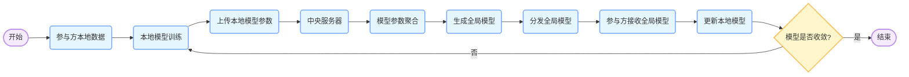

# 金融领域联邦学习在跨机构风险评估中的应用

> 关键词：金融领域、联邦学习、跨机构风险评估、数据隐私、协同计算

> 摘要：本文聚焦于金融领域联邦学习在跨机构风险评估中的应用。随着金融行业的发展，跨机构间的数据共享与协同风险评估需求日益增长，但数据隐私与安全问题成为阻碍。联邦学习作为一种新兴的分布式机器学习技术，为解决这一矛盾提供了有效途径。文章深入探讨了联邦学习的核心概念、算法原理、数学模型，通过项目实战展示其在跨机构风险评估中的具体实现，并分析了实际应用场景、推荐了相关工具和资源，最后对未来发展趋势与挑战进行了总结。

## 1. 背景介绍 
### 1.1 目的和范围
在金融领域，准确的风险评估对于金融机构的稳健运营至关重要。传统的风险评估方法通常依赖于单一机构内部的数据，难以全面、准确地评估跨机构业务带来的风险。随着金融市场的全球化和金融业务的复杂化，不同金融机构之间的数据共享与协同风险评估变得越来越重要。然而，由于数据隐私保护法规的限制以及金融机构之间的竞争关系，直接共享原始数据存在诸多困难。

本文的目的是探讨联邦学习在金融领域跨机构风险评估中的应用，介绍联邦学习的基本原理和技术，分析其在解决数据隐私问题的同时实现跨机构协同风险评估的可行性和有效性。范围涵盖联邦学习的核心概念、算法原理、数学模型、项目实战、实际应用场景以及相关工具和资源推荐等方面。

### 1.2 预期读者
本文预期读者包括金融行业的从业者，如银行、证券、保险等机构的风险管理专家、数据分析师；计算机科学领域的研究人员和开发者，特别是对机器学习、隐私计算感兴趣的人员；以及关注金融科技发展的学者和政策制定者。

### 1.3 文档结构概述
本文共分为十个部分。第一部分为背景介绍，阐述了文章的目的、范围、预期读者和文档结构概述，并给出了相关术语表。第二部分介绍了联邦学习的核心概念与联系，包括其原理和架构，并通过文本示意图和 Mermaid 流程图进行展示。第三部分详细讲解了联邦学习的核心算法原理，并给出了具体的 Python 代码实现。第四部分介绍了联邦学习的数学模型和公式，并通过举例进行说明。第五部分进行项目实战，包括开发环境搭建、源代码详细实现和代码解读。第六部分分析了联邦学习在金融领域跨机构风险评估中的实际应用场景。第七部分推荐了相关的学习资源、开发工具框架和论文著作。第八部分总结了联邦学习的未来发展趋势与挑战。第九部分为附录，解答了常见问题。第十部分提供了扩展阅读和参考资料。

### 1.4 术语表
#### 1.4.1 核心术语定义
- **联邦学习（Federated Learning）**：一种分布式机器学习技术，允许多个参与方在不共享原始数据的情况下协同训练机器学习模型。
- **跨机构风险评估（Cross - institutional Risk Assessment）**：对多个金融机构之间的业务往来和风险状况进行综合评估，以识别和管理潜在的系统性风险。
- **数据隐私（Data Privacy）**：保护个人或机构的数据不被未经授权的访问、使用和披露。
- **模型聚合（Model Aggregation）**：在联邦学习中，将各个参与方的局部模型参数进行汇总和融合，得到全局模型的过程。
- **加密技术（Encryption Technology）**：用于保护数据在传输和存储过程中的安全性，防止数据被窃取或篡改。

#### 1.4.2 相关概念解释
- **垂直联邦学习（Vertical Federated Learning）**：参与方的数据特征重叠较少，但样本重叠较多的联邦学习模式。在金融领域，不同金融机构可能拥有不同类型的客户数据，如银行拥有客户的信贷数据，保险公司拥有客户的保险数据，通过垂直联邦学习可以实现这些数据的协同利用。
- **水平联邦学习（Horizontal Federated Learning）**：参与方的数据特征重叠较多，但样本重叠较少的联邦学习模式。例如，不同地区的银行可能拥有类似的客户数据结构，但客户群体不同，通过水平联邦学习可以整合这些数据进行更准确的风险评估。
- **联邦迁移学习（Federated Transfer Learning）**：当参与方的数据特征和样本重叠都较少时，可以采用联邦迁移学习，通过迁移学习的方法将不同领域或不同分布的数据进行有效利用。

#### 1.4.3 缩略词列表
- **FL**：Federated Learning（联邦学习）
- **VFL**：Vertical Federated Learning（垂直联邦学习）
- **HFL**：Horizontal Federated Learning（水平联邦学习）
- **FTL**：Federated Transfer Learning（联邦迁移学习）
- **SGD**：Stochastic Gradient Descent（随机梯度下降）

## 2. 核心概念与联系 

### 2.1 联邦学习原理
联邦学习的核心思想是在不共享原始数据的情况下，通过在本地进行模型训练并交换模型参数，实现多个参与方之间的协同学习。具体来说，每个参与方在本地使用自己的数据训练模型，然后将模型参数上传到中央服务器。中央服务器对这些参数进行聚合，得到全局模型，并将全局模型分发给各个参与方。参与方使用全局模型更新本地模型，继续进行下一轮的训练，直到模型收敛。

### 2.2 联邦学习架构
联邦学习的架构主要包括参与方（Client）、中央服务器（Server）和通信网络（Communication Network）三个部分。参与方是拥有数据的实体，如金融机构；中央服务器负责模型参数的聚合和分发；通信网络用于参与方和中央服务器之间的数据传输。

以下是联邦学习架构的文本示意图：

```plaintext
                +-----------------+
                | 中央服务器 (Server) |
                +-----------------+
                       |
                       | 通信网络
                       |
       +---------------------+---------------------+
       |                     |                     |
+--------------+     +--------------+     +--------------+
| 参与方 1 (Client 1) |     | 参与方 2 (Client 2) |     | 参与方 3 (Client 3) |
+--------------+     +--------------+     +--------------+
```

### 2.3 Mermaid 流程图


## 3. 核心算法原理 & 具体操作步骤 

### 3.1 联邦平均算法（Federated Averaging，FedAvg）原理
联邦平均算法是联邦学习中最常用的算法之一，其基本思想是通过多次迭代，在各个参与方之间不断交换模型参数，逐步优化全局模型。具体步骤如下：

1. **初始化**：中央服务器初始化一个全局模型 $W^0$，并将其分发给各个参与方。
2. **本地训练**：每个参与方 $i$ 在本地使用自己的数据 $D_i$ 对全局模型 $W^t$ 进行 $E$ 轮的训练，得到本地模型 $W_i^{t + 1}$。
3. **参数上传**：参与方 $i$ 将本地模型 $W_i^{t + 1}$ 上传到中央服务器。
4. **模型聚合**：中央服务器根据各个参与方上传的本地模型参数，计算全局模型的更新：
   - 计算每个参与方的权重 $\omega_i=\frac{n_i}{\sum_{j = 1}^{N}n_j}$，其中 $n_i$ 是参与方 $i$ 的数据样本数量，$N$ 是参与方的总数。
   - 计算全局模型的更新：$W^{t + 1}=\sum_{i = 1}^{N}\omega_iW_i^{t + 1}$。
5. **模型分发**：中央服务器将更新后的全局模型 $W^{t + 1}$ 分发给各个参与方。
6. **重复步骤 2 - 5**，直到模型收敛。

### 3.2 Python 代码实现
以下是一个简化的联邦平均算法的 Python 代码示例：

```python
import numpy as np

# 模拟参与方的数据和模型
class Client:
    def __init__(self, data, num_epochs):
        self.data = data
        self.num_epochs = num_epochs
        self.model = np.random.rand(10)  # 初始化模型参数

    def local_train(self, global_model):
        self.model = global_model
        for _ in range(self.num_epochs):
            # 简单的梯度下降更新
            gradient = np.random.rand(10)  # 模拟梯度
            self.model -= 0.1 * gradient
        return self.model

# 中央服务器
class Server:
    def __init__(self, clients):
        self.clients = clients
        self.global_model = np.random.rand(10)  # 初始化全局模型

    def aggregate_models(self):
        total_samples = sum([len(client.data) for client in self.clients])
        new_global_model = np.zeros(10)
        for client in self.clients:
            weight = len(client.data) / total_samples
            new_global_model += weight * client.model
        self.global_model = new_global_model
        return self.global_model

# 模拟数据
client1_data = np.random.rand(100, 10)
client2_data = np.random.rand(200, 10)
client3_data = np.random.rand(150, 10)

client1 = Client(client1_data, num_epochs=5)
client2 = Client(client2_data, num_epochs=5)
client3 = Client(client3_data, num_epochs=5)

clients = [client1, client2, client3]
server = Server(clients)

# 联邦学习训练过程
num_rounds = 10
for round in range(num_rounds):
    for client in clients:
        client.model = client.local_train(server.global_model)
    server.global_model = server.aggregate_models()
    print(f"Round {round + 1}: Global model = {server.global_model}")
```

### 3.3 代码解释
- **Client 类**：模拟参与方，包含本地数据和本地模型。`local_train` 方法用于在本地进行模型训练，使用简单的梯度下降算法更新模型参数。
- **Server 类**：模拟中央服务器，包含全局模型和参与方列表。`aggregate_models` 方法用于对各个参与方的本地模型参数进行聚合，计算新的全局模型。
- **主程序**：模拟了三个参与方，每个参与方有不同数量的数据。进行 10 轮的联邦学习训练，每轮中各个参与方在本地训练模型，然后中央服务器聚合模型参数，更新全局模型。

## 4. 数学模型和公式 & 详细讲解 & 举例说明 

### 4.1 损失函数
在联邦学习中，通常使用损失函数来衡量模型的性能。常见的损失函数包括均方误差损失（Mean Squared Error，MSE）和交叉熵损失（Cross - Entropy Loss）。

#### 均方误差损失
对于回归问题，均方误差损失的定义为：
$$
L(y, \hat{y})=\frac{1}{n}\sum_{i = 1}^{n}(y_i-\hat{y}_i)^2
$$
其中 $y$ 是真实标签，$\hat{y}$ 是模型的预测值，$n$ 是样本数量。

#### 交叉熵损失
对于分类问题，交叉熵损失的定义为：
$$
L(y, \hat{y})=-\frac{1}{n}\sum_{i = 1}^{n}\sum_{j = 1}^{m}y_{ij}\log(\hat{y}_{ij})
$$
其中 $y$ 是真实标签的 one - hot 编码，$\hat{y}$ 是模型的预测概率分布，$n$ 是样本数量，$m$ 是类别数量。

### 4.2 梯度计算
在联邦学习中，参与方需要在本地计算损失函数关于模型参数的梯度，然后将梯度信息上传到中央服务器进行聚合。以均方误差损失为例，假设模型的预测值 $\hat{y}=WX + b$，其中 $W$ 是权重矩阵，$b$ 是偏置向量，$X$ 是输入特征矩阵。则损失函数关于 $W$ 和 $b$ 的梯度分别为：
$$
\frac{\partial L}{\partial W}=\frac{2}{n}X^T(\hat{y}-y)
$$
$$
\frac{\partial L}{\partial b}=\frac{2}{n}\sum_{i = 1}^{n}(\hat{y}_i - y_i)
$$

### 4.3 模型聚合公式
在联邦平均算法中，全局模型的更新公式为：
$$
W^{t + 1}=\sum_{i = 1}^{N}\omega_iW_i^{t + 1}
$$
其中 $W^{t + 1}$ 是第 $t + 1$ 轮的全局模型，$W_i^{t + 1}$ 是第 $i$ 个参与方在第 $t + 1$ 轮的本地模型，$\omega_i$ 是第 $i$ 个参与方的权重，$\omega_i=\frac{n_i}{\sum_{j = 1}^{N}n_j}$，$n_i$ 是第 $i$ 个参与方的数据样本数量，$N$ 是参与方的总数。

### 4.4 举例说明
假设我们有两个参与方，参与方 1 有 100 个样本，参与方 2 有 200 个样本。在某一轮训练中，参与方 1 的本地模型参数为 $W_1=[1, 2, 3]$，参与方 2 的本地模型参数为 $W_2=[4, 5, 6]$。则参与方 1 的权重 $\omega_1=\frac{100}{100 + 200}=\frac{1}{3}$，参与方 2 的权重 $\omega_2=\frac{200}{100 + 200}=\frac{2}{3}$。

全局模型的更新为：
$$
W=\omega_1W_1+\omega_2W_2=\frac{1}{3}[1, 2, 3]+\frac{2}{3}[4, 5, 6]=[\frac{1\times1 + 2\times4}{3},\frac{1\times2+2\times5}{3},\frac{1\times3 + 2\times6}{3}]=[3, 4, 5]
$$

## 5. 项目实战：代码实际案例和详细解释说明 

### 5.1  开发环境搭建
#### 5.1.1 安装 Python
首先，确保你已经安装了 Python 3.6 或更高版本。可以从 Python 官方网站（https://www.python.org/downloads/）下载并安装。

#### 5.1.2 安装必要的库
使用以下命令安装所需的 Python 库：
```sh
pip install numpy pandas scikit-learn tensorflow
```
- `numpy`：用于数值计算。
- `pandas`：用于数据处理和分析。
- `scikit-learn`：提供了常用的机器学习算法和工具。
- `tensorflow`：用于构建和训练深度学习模型。

### 5.2  源代码详细实现和代码解读
以下是一个使用 TensorFlow 实现的简单的联邦学习跨机构风险评估项目示例：

```python
import numpy as np
import tensorflow as tf
from sklearn.datasets import make_classification
from sklearn.model_selection import train_test_split

# 模拟跨机构数据
def generate_data(num_clients, num_samples_per_client):
    X, y = make_classification(n_samples=num_clients * num_samples_per_client, n_features=20, n_informative=10, n_classes=2)
    clients_data = []
    for i in range(num_clients):
        start = i * num_samples_per_client
        end = (i + 1) * num_samples_per_client
        X_client = X[start:end]
        y_client = y[start:end]
        X_train, X_test, y_train, y_test = train_test_split(X_client, y_client, test_size=0.2)
        clients_data.append((X_train, y_train, X_test, y_test))
    return clients_data

# 定义本地模型
def create_local_model():
    model = tf.keras.Sequential([
        tf.keras.layers.Dense(10, activation='relu', input_shape=(20,)),
        tf.keras.layers.Dense(1, activation='sigmoid')
    ])
    model.compile(optimizer='adam', loss='binary_crossentropy', metrics=['accuracy'])
    return model

# 本地训练
def local_train(model, X_train, y_train, epochs):
    model.fit(X_train, y_train, epochs=epochs, verbose=0)
    return model.get_weights()

# 模型聚合
def aggregate_models(weights_list, client_weights):
    num_clients = len(weights_list)
    num_layers = len(weights_list[0])
    aggregated_weights = []
    for layer in range(num_layers):
        layer_weights = np.zeros_like(weights_list[0][layer])
        for client in range(num_clients):
            layer_weights += client_weights[client] * weights_list[client][layer]
        aggregated_weights.append(layer_weights)
    return aggregated_weights

# 联邦学习训练过程
def federated_learning(clients_data, num_rounds, local_epochs):
    global_model = create_local_model()
    num_clients = len(clients_data)
    client_weights = [len(data[0]) / sum([len(data[0]) for data in clients_data]) for data in clients_data]
    for round in range(num_rounds):
        local_weights_list = []
        for client in range(num_clients):
            X_train, y_train, _, _ = clients_data[client]
            local_model = create_local_model()
            local_model.set_weights(global_model.get_weights())
            local_weights = local_train(local_model, X_train, y_train, local_epochs)
            local_weights_list.append(local_weights)
        aggregated_weights = aggregate_models(local_weights_list, client_weights)
        global_model.set_weights(aggregated_weights)
        print(f"Round {round + 1} completed.")
    return global_model

# 主程序
if __name__ == "__main__":
    num_clients = 3
    num_samples_per_client = 100
    clients_data = generate_data(num_clients, num_samples_per_client)
    num_rounds = 10
    local_epochs = 5
    global_model = federated_learning(clients_data, num_rounds, local_epochs)

    # 评估全局模型
    total_accuracy = 0
    for client in range(num_clients):
        _, _, X_test, y_test = clients_data[client]
        _, accuracy = global_model.evaluate(X_test, y_test, verbose=0)
        total_accuracy += accuracy
    average_accuracy = total_accuracy / num_clients
    print(f"Average accuracy across all clients: {average_accuracy}")
```

### 5.3  代码解读与分析
- **数据生成**：`generate_data` 函数模拟了跨机构的数据，使用 `make_classification` 生成分类数据，并将数据分割成多个客户端的数据。
- **本地模型定义**：`create_local_model` 函数定义了一个简单的神经网络模型，包含一个隐藏层和一个输出层，使用二元交叉熵损失函数和 Adam 优化器。
- **本地训练**：`local_train` 函数在本地对模型进行训练，并返回训练后的模型参数。
- **模型聚合**：`aggregate_models` 函数根据各个客户端的权重对本地模型参数进行聚合，得到全局模型的参数。
- **联邦学习训练过程**：`federated_learning` 函数实现了联邦学习的训练过程，包括多轮的本地训练和模型聚合。
- **主程序**：生成客户端数据，调用 `federated_learning` 函数进行训练，并评估全局模型在各个客户端测试数据上的平均准确率。

## 6. 实际应用场景 
### 6.1 跨银行信贷风险评估
不同银行之间可能拥有不同客户的信贷数据，通过联邦学习可以在不共享原始数据的情况下，协同训练一个更准确的信贷风险评估模型。例如，一家银行可能拥有客户的还款记录数据，另一家银行可能拥有客户的收入和资产数据。通过联邦学习，两家银行可以共同训练一个模型，综合考虑这些因素，提高信贷风险评估的准确性。

### 6.2 保险行业的风险评估
在保险行业，不同保险公司可能拥有不同类型的客户数据，如健康险公司拥有客户的健康数据，车险公司拥有客户的驾驶记录数据。通过联邦学习，保险公司可以在保护客户隐私的前提下，协同评估客户的风险，开发更合理的保险产品和定价策略。

### 6.3 金融市场系统性风险监测
金融监管机构和多个金融机构可以通过联邦学习共同监测金融市场的系统性风险。各个金融机构在本地使用自己的数据训练风险监测模型，然后将模型参数上传到监管机构进行聚合。监管机构可以根据聚合后的模型更全面地评估金融市场的风险状况，及时采取措施防范系统性风险。

## 7. 工具和资源推荐
### 7.1 学习资源推荐
#### 7.1.1 书籍推荐
- 《Federated Learning: Foundations and Modern Applications》：全面介绍了联邦学习的理论基础和实际应用，是学习联邦学习的经典书籍。
- 《Machine Learning》：Tom Mitchell 著，经典的机器学习教材，对于理解联邦学习中的机器学习算法有很大帮助。
- 《Deep Learning》：Ian Goodfellow、Yoshua Bengio 和 Aaron Courville 著，深度学习领域的权威书籍，涵盖了深度学习的基本原理和应用。

#### 7.1.2 在线课程
- Coursera 上的“Federated Learning for Data Privacy and Confidentiality”：由知名学者授课，系统地介绍了联邦学习的原理、算法和应用。
- edX 上的“Machine Learning”：由 Andrew Ng 教授授课，是机器学习领域的经典课程，对于掌握联邦学习的基础知识很有帮助。

#### 7.1.3 技术博客和网站
- FedML 官方博客（https://fedml.ai/blog/）：提供了联邦学习的最新研究成果和实践经验。
- Medium 上的“Towards Data Science”：有很多关于机器学习和联邦学习的优质文章。

### 7.2 开发工具框架推荐
#### 7.2.1 IDE和编辑器
- PyCharm：功能强大的 Python 集成开发环境，提供了代码编辑、调试、版本控制等功能，适合开发联邦学习项目。
- Jupyter Notebook：交互式的开发环境，方便进行代码的编写、测试和文档的生成，常用于数据探索和模型实验。

#### 7.2.2 调试和性能分析工具
- TensorBoard：TensorFlow 提供的可视化工具，可以用于监控模型的训练过程、查看模型的结构和性能指标。
- Py-Spy：用于分析 Python 代码的性能瓶颈，帮助优化联邦学习代码的性能。

#### 7.2.3 相关框架和库
- TensorFlow Federated（TFF）：Google 开发的联邦学习框架，提供了丰富的工具和接口，方便开发联邦学习模型。
- PySyft：OpenMined 开发的隐私计算和联邦学习库，支持在 PyTorch 上进行联邦学习开发。

### 7.3 相关论文著作推荐
#### 7.3.1 经典论文
- 《Communication-Efficient Learning of Deep Networks from Decentralized Data》：提出了联邦平均算法（FedAvg），是联邦学习领域的经典论文。
- 《Federated Learning: Challenges, Methods, and Future Directions》：对联邦学习的挑战、方法和未来发展方向进行了全面的综述。

#### 7.3.2 最新研究成果
- 关注顶级学术会议如 NeurIPS、ICML、CVPR 等上关于联邦学习的研究论文，了解最新的技术进展。

#### 7.3.3 应用案例分析
- 可以在 IEEE Xplore、ACM Digital Library 等学术数据库中搜索关于金融领域联邦学习应用案例的论文，学习实际应用中的经验和方法。

## 8. 总结：未来发展趋势与挑战
### 8.1 未来发展趋势
- **更广泛的应用场景**：随着金融行业数字化转型的加速，联邦学习在跨机构风险评估、反洗钱、客户信用评分等更多领域的应用将不断拓展。
- **与其他技术的融合**：联邦学习将与区块链、差分隐私等技术相结合，进一步增强数据隐私保护和模型的安全性。
- **自动化和智能化**：未来的联邦学习系统将更加自动化和智能化，能够自动调整模型参数、优化训练过程，提高学习效率和性能。

### 8.2 挑战
- **数据异质性问题**：不同金融机构的数据可能存在分布差异、特征缺失等问题，如何处理这些异质性数据，提高联邦学习模型的性能是一个挑战。
- **通信开销问题**：在联邦学习中，参与方和中央服务器之间需要频繁交换模型参数，会产生较大的通信开销。如何降低通信成本，提高通信效率是需要解决的问题。
- **安全和隐私问题**：尽管联邦学习在一定程度上保护了数据隐私，但仍然存在安全漏洞，如模型参数泄露、恶意攻击等。如何进一步加强安全和隐私保护是联邦学习面临的重要挑战。

## 9. 附录：常见问题与解答
### 9.1 联邦学习与传统机器学习的区别是什么？
传统机器学习通常需要将所有数据集中到一个中心节点进行训练，而联邦学习允许各个参与方在本地使用自己的数据进行训练，只交换模型参数，从而保护了数据隐私。

### 9.2 联邦学习是否能完全保证数据隐私？
联邦学习在一定程度上保护了数据隐私，但并不能完全保证。例如，攻击者可能通过分析模型参数来推断原始数据的某些信息。因此，还需要结合其他隐私保护技术，如差分隐私、同态加密等。

### 9.3 联邦学习的训练时间是否比传统机器学习长？
由于联邦学习需要在多个参与方之间进行多次通信和模型聚合，训练时间通常会比传统机器学习长。但可以通过优化通信协议、采用分布式计算等方法来缩短训练时间。

### 9.4 如何选择合适的联邦学习算法？
选择合适的联邦学习算法需要考虑数据的分布、参与方的数量、通信开销等因素。例如，对于数据特征重叠较少的情况，可以选择垂直联邦学习算法；对于数据样本重叠较少的情况，可以选择水平联邦学习算法。

## 10. 扩展阅读 & 参考资料
- 《联邦学习：原理与应用》，杨强、何文奇等著，机械工业出版社。
- 《Privacy-Preserving Machine Learning》，由 Cynthia Dwork 等人撰写的关于隐私保护机器学习的综述论文。
- FedML 官方文档（https://fedml.ai/docs/），提供了关于 FedML 框架的详细使用说明和示例代码。
- TensorFlow Federated 官方文档（https://www.tensorflow.org/federated），对于使用 TensorFlow Federated 进行联邦学习开发有很大帮助。