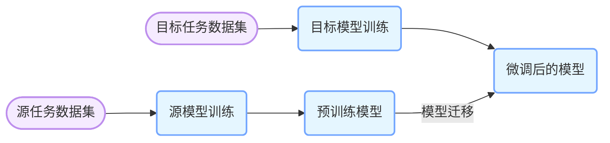

# 降低推理成本:模型学习与迁移的重要性

> 关键词：推理成本、模型学习、模型迁移、深度学习、成本优化、知识复用、效率提升

> 摘要：在当今的人工智能和机器学习领域，推理成本是一个备受关注的问题。高昂的推理成本不仅限制了模型的大规模应用，还增加了企业和开发者的负担。本文深入探讨了降低推理成本的重要性，并详细阐述了模型学习与迁移在这一过程中的关键作用。通过对核心概念、算法原理、数学模型的分析，结合实际项目案例，展示了如何利用模型学习与迁移来有效降低推理成本。同时，介绍了相关的工具和资源，分析了未来的发展趋势与挑战，为读者提供了全面且深入的技术指导。

## 1. 背景介绍 
### 1.1 目的和范围
随着人工智能技术的飞速发展，深度学习模型在图像识别、自然语言处理、语音识别等众多领域取得了巨大的成功。然而，这些模型的推理过程往往需要大量的计算资源和时间，导致推理成本居高不下。本文的目的在于探讨如何通过模型学习与迁移的方法来降低推理成本。具体范围涵盖了模型学习与迁移的基本概念、核心算法原理、数学模型，以及实际项目中的应用案例，同时介绍了相关的工具和资源，为降低推理成本提供全面的解决方案。

### 1.2 预期读者
本文的预期读者包括人工智能和机器学习领域的开发者、研究人员、数据科学家，以及对降低推理成本感兴趣的技术爱好者。对于正在从事模型开发和部署的专业人士，本文可以提供实用的技术指导和优化思路；对于研究人员，本文可以激发他们在模型学习与迁移领域的进一步研究；对于技术爱好者，本文可以帮助他们了解降低推理成本的基本原理和方法。

### 1.3 文档结构概述
本文将按照以下结构进行组织：首先介绍模型学习与迁移的核心概念和它们之间的联系，并通过文本示意图和 Mermaid 流程图进行直观展示；接着详细阐述核心算法原理，并用 Python 源代码进行具体说明；然后介绍相关的数学模型和公式，并结合实际例子进行讲解；之后通过一个实际项目案例，展示如何在开发环境中实现模型学习与迁移以降低推理成本，并对代码进行详细解读；再介绍模型学习与迁移在实际应用场景中的应用；接着推荐相关的学习资源、开发工具框架和论文著作；最后总结未来的发展趋势与挑战，并提供常见问题的解答和扩展阅读的参考资料。

### 1.4 术语表
#### 1.4.1 核心术语定义
- **推理成本**：指在模型部署后，对新数据进行预测或分类时所消耗的计算资源（如 CPU、GPU 等）和时间成本。
- **模型学习**：指通过大量的数据训练模型，使模型能够学习到数据中的模式和规律，从而对新数据进行准确的预测或分类。
- **模型迁移**：指将在一个任务或领域中训练好的模型，应用到另一个相关的任务或领域中，以减少新模型的训练时间和计算资源消耗。
- **深度学习**：一种基于人工神经网络的机器学习方法，通过多层神经网络对数据进行特征提取和模式识别。
- **知识复用**：指在模型迁移过程中，将源模型中学习到的知识应用到目标模型中，以提高目标模型的性能和训练效率。

#### 1.4.2 相关概念解释
- **预训练模型**：在大规模数据集上进行预训练的模型，通常具有较好的泛化能力。可以作为模型迁移的基础，减少目标模型的训练时间和成本。
- **微调**：在模型迁移过程中，对预训练模型的部分参数进行调整，以适应目标任务的需求。
- **特征提取**：从原始数据中提取出具有代表性的特征，以便模型能够更好地进行学习和预测。

#### 1.4.3 缩略词列表
- **CPU**：中央处理器（Central Processing Unit）
- **GPU**：图形处理器（Graphics Processing Unit）
- **CNN**：卷积神经网络（Convolutional Neural Network）
- **RNN**：循环神经网络（Recurrent Neural Network）
- **NLP**：自然语言处理（Natural Language Processing）

## 2. 核心概念与联系 
### 核心概念原理
#### 模型学习
模型学习是机器学习和深度学习的核心过程。其基本原理是通过优化算法（如梯度下降）来最小化模型的损失函数。损失函数衡量了模型预测结果与真实标签之间的差异。例如，在分类问题中，常用的损失函数是交叉熵损失函数；在回归问题中，常用的损失函数是均方误差损失函数。

通过不断地调整模型的参数，使得损失函数的值逐渐减小，从而使模型能够更好地拟合训练数据。模型学习的过程可以分为监督学习、无监督学习和强化学习等不同类型。在监督学习中，模型通过学习带有标签的数据来进行训练；在无监督学习中，模型通过学习无标签的数据来发现数据中的结构和模式；在强化学习中，模型通过与环境进行交互并根据奖励信号来学习最优策略。

#### 模型迁移
模型迁移的核心思想是利用在一个任务或领域中学习到的知识，来加速和优化在另一个相关任务或领域中的模型训练。这是基于不同任务或领域之间往往存在一定的共性和相关性的假设。例如，在图像识别任务中，不同类型的图像可能具有相似的底层特征，如边缘、纹理等。因此，在一个大规模图像数据集上预训练的模型，可以将其学习到的特征表示迁移到另一个图像识别任务中，从而减少新模型的训练时间和计算资源消耗。

模型迁移的方法主要包括基于特征的迁移、基于参数的迁移和基于关系的迁移等。基于特征的迁移是指将源模型学习到的特征提取器应用到目标模型中；基于参数的迁移是指直接复用源模型的部分参数；基于关系的迁移是指利用源模型和目标模型之间的关系来进行迁移。

### 架构的文本示意图
```plaintext
|------------------|         |------------------|
| 源任务数据集     |         | 目标任务数据集   |
|------------------|         |------------------|
           |                        |
           v                        v
|------------------|         |------------------|
| 源模型训练       |         | 目标模型训练     |
|------------------|         |------------------|
           |                        |
           v                        v
|------------------|         |------------------|
| 预训练模型       |         | 微调后的模型     |
|------------------|         |------------------|
           |                        |
           |----------------------->|
                      模型迁移
```

### Mermaid 流程图


## 3. 核心算法原理 & 具体操作步骤 
### 核心算法原理
#### 梯度下降算法
梯度下降算法是模型学习中最常用的优化算法之一。其基本思想是通过沿着损失函数的负梯度方向更新模型的参数，使得损失函数的值逐渐减小。假设模型的参数为 $\theta$，损失函数为 $L(\theta)$，则梯度下降算法的更新公式为：

$$\theta_{t+1} = \theta_{t} - \alpha \nabla L(\theta_{t})$$

其中，$\theta_{t}$ 是第 $t$ 次迭代时的参数值，$\alpha$ 是学习率，$\nabla L(\theta_{t})$ 是损失函数在 $\theta_{t}$ 处的梯度。

#### 微调算法
在模型迁移中，微调算法是常用的方法。其基本步骤是：首先，使用源任务数据集对模型进行预训练，得到预训练模型；然后，将预训练模型的部分参数固定，只对部分参数进行微调。在微调过程中，使用目标任务数据集对模型进行训练，通过调整模型的参数，使得模型能够更好地适应目标任务。

### 具体操作步骤
#### 步骤 1：数据准备
收集和整理源任务数据集和目标任务数据集，并对数据进行预处理，如归一化、裁剪等。

#### 步骤 2：预训练模型
使用源任务数据集对模型进行预训练。可以选择一个合适的模型架构，如卷积神经网络（CNN）或循环神经网络（RNN），并使用梯度下降算法进行训练。

#### 步骤 3：模型迁移
将预训练模型的参数迁移到目标模型中。可以选择直接复用预训练模型的所有参数，或者只复用部分参数。

#### 步骤 4：微调模型
使用目标任务数据集对迁移后的模型进行微调。在微调过程中，可以选择固定部分参数，只对部分参数进行调整，以减少计算资源的消耗。

#### 步骤 5：评估模型
使用目标任务数据集对微调后的模型进行评估，计算模型的性能指标，如准确率、召回率等。

### Python 源代码实现
```python
import torch
import torch.nn as nn
import torch.optim as optim
from torchvision import datasets, transforms
from torch.utils.data import DataLoader

# 步骤 1：数据准备
transform = transforms.Compose([
    transforms.ToTensor(),
    transforms.Normalize((0.1307,), (0.3081,))
])

# 源任务数据集（以 MNIST 为例）
source_train_dataset = datasets.MNIST(root='./data', train=True,
                                      download=True, transform=transform)
source_train_loader = DataLoader(source_train_dataset, batch_size=64, shuffle=True)

# 目标任务数据集（假设是一个类似的手写数字识别任务）
target_train_dataset = datasets.MNIST(root='./data', train=True,
                                      download=True, transform=transform)
target_train_loader = DataLoader(target_train_dataset, batch_size=64, shuffle=True)

# 步骤 2：定义模型
class SimpleCNN(nn.Module):
    def __init__(self):
        super(SimpleCNN, self).__init__()
        self.conv1 = nn.Conv2d(1, 10, kernel_size=5)
        self.conv2 = nn.Conv2d(10, 20, kernel_size=5)
        self.fc1 = nn.Linear(320, 50)
        self.fc2 = nn.Linear(50, 10)

    def forward(self, x):
        x = nn.functional.relu(nn.functional.max_pool2d(self.conv1(x), 2))
        x = nn.functional.relu(nn.functional.max_pool2d(self.conv2(x), 2))
        x = x.view(-1, 320)
        x = nn.functional.relu(self.fc1(x))
        x = self.fc2(x)
        return nn.functional.log_softmax(x, dim=1)

model = SimpleCNN()

# 步骤 3：预训练模型
criterion = nn.NLLLoss()
optimizer = optim.SGD(model.parameters(), lr=0.01, momentum=0.5)

def train(model, train_loader, criterion, optimizer, epochs):
    model.train()
    for epoch in range(epochs):
        for batch_idx, (data, target) in enumerate(train_loader):
            optimizer.zero_grad()
            output = model(data)
            loss = criterion(output, target)
            loss.backward()
            optimizer.step()
        print(f'Epoch {epoch + 1} completed')

# 预训练模型
train(model, source_train_loader, criterion, optimizer, epochs=5)

# 步骤 4：模型迁移和微调
# 假设只微调最后一层全连接层
for param in model.parameters():
    param.requires_grad = False
model.fc2 = nn.Linear(50, 10)  # 重新定义最后一层
optimizer = optim.SGD(model.fc2.parameters(), lr=0.01, momentum=0.5)

# 微调模型
train(model, target_train_loader, criterion, optimizer, epochs=3)

# 步骤 5：评估模型
model.eval()
correct = 0
total = 0
with torch.no_grad():
    for data, target in target_train_loader:
        output = model(data)
        _, predicted = torch.max(output.data, 1)
        total += target.size(0)
        correct += (predicted == target).sum().item()

print(f'Accuracy: {100 * correct / total}%')
```

## 4. 数学模型和公式 & 详细讲解 & 举例说明 
### 损失函数
#### 交叉熵损失函数
在分类问题中，交叉熵损失函数是常用的损失函数之一。假设模型的输出为 $\hat{y} = [\hat{y}_1, \hat{y}_2, \cdots, \hat{y}_C]$，其中 $\hat{y}_i$ 表示第 $i$ 个类别的预测概率，真实标签为 $y = [y_1, y_2, \cdots, y_C]$，其中 $y_i$ 是一个二进制向量，表示第 $i$ 个类别的真实标签。交叉熵损失函数的定义为：

$$L(\hat{y}, y) = -\sum_{i=1}^{C} y_i \log(\hat{y}_i)$$

例如，在一个三分类问题中，模型的输出为 $\hat{y} = [0.1, 0.3, 0.6]$，真实标签为 $y = [0, 0, 1]$，则交叉熵损失为：

$$L(\hat{y}, y) = - (0 \log(0.1) + 0 \log(0.3) + 1 \log(0.6)) \approx 0.51$$

#### 均方误差损失函数
在回归问题中，均方误差损失函数是常用的损失函数之一。假设模型的输出为 $\hat{y}$，真实标签为 $y$，则均方误差损失函数的定义为：

$$L(\hat{y}, y) = \frac{1}{n} \sum_{i=1}^{n} (\hat{y}_i - y_i)^2$$

其中，$n$ 是样本的数量。例如，在一个回归问题中，模型的输出为 $\hat{y} = [1.2, 2.3, 3.4]$，真实标签为 $y = [1, 2, 3]$，则均方误差损失为：

$$L(\hat{y}, y) = \frac{1}{3} ((1.2 - 1)^2 + (2.3 - 2)^2 + (3.4 - 3)^2) \approx 0.087$$

### 梯度计算
在梯度下降算法中，需要计算损失函数关于模型参数的梯度。以简单的线性回归模型 $y = wx + b$ 为例，损失函数为均方误差损失函数 $L(w, b) = \frac{1}{n} \sum_{i=1}^{n} (wx_i + b - y_i)^2$。

对 $w$ 和 $b$ 分别求偏导数：

$$\frac{\partial L}{\partial w} = \frac{2}{n} \sum_{i=1}^{n} (wx_i + b - y_i) x_i$$

$$\frac{\partial L}{\partial b} = \frac{2}{n} \sum_{i=1}^{n} (wx_i + b - y_i)$$

例如，假设有三个样本 $(x_1, y_1) = (1, 2)$，$(x_2, y_2) = (2, 4)$，$(x_3, y_3) = (3, 6)$，当前的参数 $w = 0.5$，$b = 1$。则：

$$\frac{\partial L}{\partial w} = \frac{2}{3} ((0.5 \times 1 + 1 - 2) \times 1 + (0.5 \times 2 + 1 - 4) \times 2 + (0.5 \times 3 + 1 - 6) \times 3) \approx -5.67$$

$$\frac{\partial L}{\partial b} = \frac{2}{3} ((0.5 \times 1 + 1 - 2) + (0.5 \times 2 + 1 - 4) + (0.5 \times 3 + 1 - 6)) \approx -2.33$$

### 模型迁移中的参数调整
在模型迁移的微调过程中，通常会对模型的部分参数进行调整。假设预训练模型的参数为 $\theta_{pretrained}$，微调后的模型参数为 $\theta_{fine - tuned}$，则微调过程可以表示为：

$$\theta_{fine - tuned} = \theta_{pretrained} + \Delta \theta$$

其中，$\Delta \theta$ 是在微调过程中参数的调整量。例如，在上述的 Python 代码中，只对最后一层全连接层的参数进行微调，其他层的参数保持不变。

## 5. 项目实战：代码实际案例和详细解释说明 
### 5.1  开发环境搭建
#### 安装 Python
首先，需要安装 Python 环境。可以从 Python 官方网站（https://www.python.org/downloads/）下载适合自己操作系统的 Python 版本，并按照安装向导进行安装。

#### 安装 PyTorch
PyTorch 是一个常用的深度学习框架，用于实现模型学习和迁移。可以使用以下命令安装 PyTorch：

```sh
pip install torch torchvision
```

#### 安装其他依赖库
还需要安装一些其他的依赖库，如 NumPy、Matplotlib 等。可以使用以下命令安装：

```sh
pip install numpy matplotlib
```

### 5.2  源代码详细实现和代码解读
```python
import torch
import torch.nn as nn
import torch.optim as optim
from torchvision import datasets, transforms
from torch.utils.data import DataLoader

# 步骤 1：数据准备
transform = transforms.Compose([
    transforms.ToTensor(),
    transforms.Normalize((0.1307,), (0.3081,))
])

# 源任务数据集（以 MNIST 为例）
source_train_dataset = datasets.MNIST(root='./data', train=True,
                                      download=True, transform=transform)
source_train_loader = DataLoader(source_train_dataset, batch_size=64, shuffle=True)

# 目标任务数据集（假设是一个类似的手写数字识别任务）
target_train_dataset = datasets.MNIST(root='./data', train=True,
                                      download=True, transform=transform)
target_train_loader = DataLoader(target_train_dataset, batch_size=64, shuffle=True)
```
- **代码解读**：这段代码主要完成了数据的准备工作。使用 `torchvision` 库中的 `datasets.MNIST` 函数加载 MNIST 数据集，并使用 `transforms` 对数据进行预处理，包括将图像转换为张量和归一化操作。然后使用 `DataLoader` 函数将数据集封装成可迭代的数据加载器。

```python
# 步骤 2：定义模型
class SimpleCNN(nn.Module):
    def __init__(self):
        super(SimpleCNN, self).__init__()
        self.conv1 = nn.Conv2d(1, 10, kernel_size=5)
        self.conv2 = nn.Conv2d(10, 20, kernel_size=5)
        self.fc1 = nn.Linear(320, 50)
        self.fc2 = nn.Linear(50, 10)

    def forward(self, x):
        x = nn.functional.relu(nn.functional.max_pool2d(self.conv1(x), 2))
        x = nn.functional.relu(nn.functional.max_pool2d(self.conv2(x), 2))
        x = x.view(-1, 320)
        x = nn.functional.relu(self.fc1(x))
        x = self.fc2(x)
        return nn.functional.log_softmax(x, dim=1)

model = SimpleCNN()
```
- **代码解读**：这段代码定义了一个简单的卷积神经网络模型 `SimpleCNN`。该模型包含两个卷积层和两个全连接层。在 `forward` 方法中，定义了模型的前向传播过程，包括卷积、池化、激活函数等操作。

```python
# 步骤 3：预训练模型
criterion = nn.NLLLoss()
optimizer = optim.SGD(model.parameters(), lr=0.01, momentum=0.5)

def train(model, train_loader, criterion, optimizer, epochs):
    model.train()
    for epoch in range(epochs):
        for batch_idx, (data, target) in enumerate(train_loader):
            optimizer.zero_grad()
            output = model(data)
            loss = criterion(output, target)
            loss.backward()
            optimizer.step()
        print(f'Epoch {epoch + 1} completed')

# 预训练模型
train(model, source_train_loader, criterion, optimizer, epochs=5)
```
- **代码解读**：这段代码完成了模型的预训练过程。定义了损失函数 `nn.NLLLoss()` 和优化器 `optim.SGD()`，并定义了 `train` 函数用于训练模型。在 `train` 函数中，使用循环遍历每个 epoch 和每个 batch，计算损失并进行反向传播和参数更新。

```python
# 步骤 4：模型迁移和微调
# 假设只微调最后一层全连接层
for param in model.parameters():
    param.requires_grad = False
model.fc2 = nn.Linear(50, 10)  # 重新定义最后一层
optimizer = optim.SGD(model.fc2.parameters(), lr=0.01, momentum=0.5)

# 微调模型
train(model, target_train_loader, criterion, optimizer, epochs=3)
```
- **代码解读**：这段代码完成了模型的迁移和微调过程。首先，将模型的所有参数的 `requires_grad` 属性设置为 `False`，表示不更新这些参数。然后重新定义最后一层全连接层，并创建一个新的优化器，只对最后一层的参数进行更新。最后，使用目标任务数据集对模型进行微调。

```python
# 步骤 5：评估模型
model.eval()
correct = 0
total = 0
with torch.no_grad():
    for data, target in target_train_loader:
        output = model(data)
        _, predicted = torch.max(output.data, 1)
        total += target.size(0)
        correct += (predicted == target).sum().item()

print(f'Accuracy: {100 * correct / total}%')
```
- **代码解读**：这段代码完成了模型的评估过程。将模型设置为评估模式，使用 `torch.no_grad()` 上下文管理器禁用梯度计算，遍历目标任务数据集，计算模型的预测结果，并统计预测正确的样本数量，最后计算并输出模型的准确率。

### 5.3  代码解读与分析
通过上述代码，我们可以看到模型学习与迁移的整个过程。首先，使用源任务数据集对模型进行预训练，使得模型学习到数据中的一些通用特征。然后，将预训练模型的参数迁移到目标模型中，并只对最后一层全连接层进行微调，这样可以减少计算资源的消耗，同时利用预训练模型的知识来加速目标模型的训练。最后，使用目标任务数据集对微调后的模型进行评估，得到模型的准确率。

在这个过程中，通过模型迁移和微调，我们可以在不从头开始训练模型的情况下，快速得到一个性能较好的模型，从而降低了推理成本。

## 6. 实际应用场景 
### 图像识别
在图像识别领域，模型学习与迁移有着广泛的应用。例如，在医学图像识别中，由于医学图像数据集通常较小，从头开始训练一个高性能的模型是非常困难的。可以使用在大规模自然图像数据集（如 ImageNet）上预训练的模型，将其迁移到医学图像识别任务中，并进行微调。这样可以利用预训练模型学习到的通用图像特征，减少训练时间和计算资源的消耗，同时提高模型的性能。

### 自然语言处理
在自然语言处理领域，模型学习与迁移也非常重要。例如，在情感分析任务中，可以使用在大规模文本数据集（如 Wikipedia）上预训练的语言模型（如 BERT），将其迁移到情感分析任务中，并进行微调。预训练的语言模型可以学习到语言的语法和语义信息，通过微调可以使模型更好地适应情感分析任务，提高模型的准确率。

### 语音识别
在语音识别领域，模型学习与迁移同样可以发挥重要作用。例如，在特定领域的语音识别任务中，如医疗语音识别、金融语音识别等，可以使用在大规模通用语音数据集上预训练的模型，将其迁移到特定领域的语音识别任务中，并进行微调。这样可以利用预训练模型学习到的语音特征，提高模型在特定领域的识别准确率，同时降低训练成本。

## 7. 工具和资源推荐
### 7.1 学习资源推荐
#### 7.1.1 书籍推荐
- 《深度学习》（Deep Learning）：由 Ian Goodfellow、Yoshua Bengio 和 Aaron Courville 编写，是深度学习领域的经典教材，涵盖了深度学习的基本概念、算法和应用。
- 《Python 深度学习》（Deep Learning with Python）：由 Francois Chollet 编写，介绍了如何使用 Python 和 Keras 框架进行深度学习模型的开发和训练。
- 《动手学深度学习》（Dive into Deep Learning）：由 Aston Zhang、Zack C. Lipton、Mu Li 和 Alexander J. Smola 编写，提供了丰富的代码示例和实践项目，帮助读者快速掌握深度学习的实践技能。

#### 7.1.2 在线课程
- Coursera 上的“深度学习专项课程”（Deep Learning Specialization）：由 Andrew Ng 教授讲授，包括五门课程，涵盖了深度学习的各个方面。
- edX 上的“强化学习”（Reinforcement Learning）：由 Berkeley 大学的 Pieter Abbeel 教授讲授，介绍了强化学习的基本概念和算法。
- 哔哩哔哩上的“李沐深度学习”系列视频：由李沐老师讲解，以通俗易懂的方式介绍了深度学习的原理和实践。

#### 7.1.3 技术博客和网站
- Medium 上的 Towards Data Science：汇集了众多数据科学和机器学习领域的优秀文章，涵盖了模型学习、模型迁移等方面的内容。
- arXiv.org：是一个预印本平台，提供了大量的机器学习和人工智能领域的研究论文，包括最新的模型学习与迁移的研究成果。
- Kaggle：是一个数据科学竞赛平台，提供了丰富的数据集和代码示例，有助于读者学习和实践模型学习与迁移。

### 7.2 开发工具框架推荐
#### 7.2.1 IDE和编辑器
- PyCharm：是一个专门为 Python 开发设计的集成开发环境，提供了丰富的代码编辑、调试和项目管理功能。
- Jupyter Notebook：是一个交互式的开发环境，适合进行数据分析和模型开发，支持代码、文本和可视化的混合展示。
- Visual Studio Code：是一个轻量级的代码编辑器，支持多种编程语言和插件，适合快速开发和调试。

#### 7.2.2 调试和性能分析工具
- TensorBoard：是 TensorFlow 提供的一个可视化工具，用于监控模型的训练过程、可视化模型的结构和性能指标。
- PyTorch Profiler：是 PyTorch 提供的性能分析工具，用于分析模型的计算时间和内存使用情况，帮助优化模型的性能。
- NVIDIA Nsight Systems：是 NVIDIA 提供的性能分析工具，用于分析 GPU 上的程序性能，帮助优化深度学习模型在 GPU 上的运行效率。

#### 7.2.3 相关框架和库
- PyTorch：是一个开源的深度学习框架，提供了丰富的神经网络层和优化算法，支持动态图和静态图的混合编程，适合进行模型学习和迁移。
- TensorFlow：是一个广泛使用的深度学习框架，提供了高级的 API 和分布式训练功能，适合大规模的模型开发和部署。
- Scikit-learn：是一个用于机器学习的 Python 库，提供了各种机器学习算法和工具，如分类、回归、聚类等，适合进行简单的模型学习和实验。

### 7.3 相关论文著作推荐
#### 7.3.1 经典论文
- “ImageNet Classification with Deep Convolutional Neural Networks”：由 Alex Krizhevsky、Ilya Sutskever 和 Geoffrey E. Hinton 发表，介绍了 AlexNet 模型，开启了深度学习在图像识别领域的革命。
- “Attention Is All You Need”：由 Ashish Vaswani 等人发表，提出了 Transformer 模型，在自然语言处理领域取得了巨大的成功。
- “How Transferable are Features in Deep Neural Networks?”：由 Jason Yosinski 等人发表，探讨了深度学习模型中特征的可迁移性问题。

#### 7.3.2 最新研究成果
- 关注 arXiv.org 上的最新论文，特别是关于模型学习与迁移的研究成果。例如，一些研究致力于提高模型迁移的效率和性能，如提出新的迁移方法和损失函数。

#### 7.3.3 应用案例分析
- 可以在 Kaggle 上查找一些模型学习与迁移的应用案例，了解如何在实际项目中应用这些技术。例如，一些图像识别竞赛中，选手会使用预训练模型进行迁移学习，以提高模型的性能。

## 8. 总结：未来发展趋势与挑战
### 未来发展趋势
#### 更高效的迁移方法
未来，研究人员将致力于开发更高效的模型迁移方法，以进一步降低推理成本。例如，探索更细粒度的迁移策略，只迁移模型中最相关的部分，减少不必要的参数调整。

#### 跨领域迁移
随着人工智能的发展，模型迁移将不再局限于同一领域内的任务。未来，有望实现跨领域的模型迁移，例如将图像识别模型的知识迁移到语音识别任务中，或者将自然语言处理模型的知识迁移到机器人控制任务中。

#### 自动化迁移学习
自动化迁移学习将成为未来的一个重要发展方向。通过自动化的工具和算法，能够自动选择合适的预训练模型、迁移策略和微调参数，降低模型迁移的技术门槛，提高开发效率。

### 挑战
#### 数据隐私和安全
在模型迁移过程中，可能会涉及到不同来源的数据。如何保护数据的隐私和安全是一个重要的挑战。例如，在使用预训练模型时，需要确保预训练模型的训练数据不包含敏感信息。

#### 模型适应性
不同的任务和领域具有不同的特点和需求，如何确保迁移后的模型能够适应目标任务的要求是一个挑战。例如，在某些特定领域的任务中，预训练模型学习到的通用特征可能并不适用，需要进行更复杂的调整和优化。

#### 计算资源限制
尽管模型迁移可以降低推理成本，但在一些大规模的应用场景中，仍然需要大量的计算资源。如何在有限的计算资源下实现高效的模型迁移和推理是一个亟待解决的问题。

## 9. 附录：常见问题与解答
### 问题 1：模型迁移一定能降低推理成本吗？
答：模型迁移通常可以降低推理成本，但并不是绝对的。如果源任务和目标任务之间的相关性较低，或者迁移方法选择不当，可能无法有效利用预训练模型的知识，甚至可能导致模型性能下降，从而增加推理成本。因此，在进行模型迁移时，需要仔细选择源任务和迁移方法，确保迁移的有效性。

### 问题 2：如何选择合适的预训练模型？
答：选择合适的预训练模型需要考虑以下几个因素：
- 任务相关性：选择与目标任务相关性较高的预训练模型。例如，在图像识别任务中，可以选择在大规模图像数据集上预训练的模型。
- 模型复杂度：根据目标任务的复杂度和可用的计算资源，选择合适复杂度的预训练模型。如果计算资源有限，可以选择较小的模型。
- 性能指标：参考预训练模型在相关任务上的性能指标，选择性能较好的模型。

### 问题 3：在微调过程中，应该固定哪些层的参数？
答：在微调过程中，通常可以根据源任务和目标任务的相关性来决定固定哪些层的参数。如果源任务和目标任务相关性较高，可以固定前面的卷积层或特征提取层的参数，只微调后面的全连接层或分类层的参数；如果相关性较低，可以适当微调更多的层的参数。此外，还可以通过实验来确定最佳的参数固定策略。

## 10. 扩展阅读 & 参考资料
### 扩展阅读
- 关注行业内的顶级会议，如 NeurIPS、ICML、CVPR 等，了解模型学习与迁移领域的最新研究成果和发展趋势。
- 阅读相关的技术博客和论坛，如 Reddit 上的 r/MachineLearning 板块，与其他开发者和研究人员交流经验和心得。

### 参考资料
- Goodfellow, I., Bengio, Y., & Courville, A. (2016). Deep Learning. MIT Press.
- Chollet, F. (2018). Deep Learning with Python. Manning Publications.
- Zhang, A., Lipton, Z. C., Li, M., & Smola, A. J. (2020). Dive into Deep Learning. https://d2l.ai/
- Krizhevsky, A., Sutskever, I., & Hinton, G. E. (2012). ImageNet Classification with Deep Convolutional Neural Networks. Advances in Neural Information Processing Systems.
- Vaswani, A., Shazeer, N., Parmar, N., Uszkoreit, J., Jones, L., Gomez, A. N., ... & Polosukhin, I. (2017). Attention Is All You Need. Advances in Neural Information Processing Systems.
- Yosinski, J., Clune, J., Bengio, Y., & Lipson, H. (2014). How Transferable are Features in Deep Neural Networks? Advances in Neural Information Processing Systems.