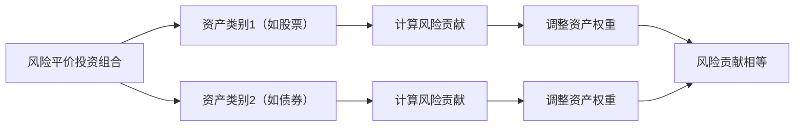

# 雷·达里奥的风险平价投资策略

> 关键词：雷·达里奥、风险平价、投资策略、资产配置、风险均衡

> 摘要：本文深入探讨雷·达里奥的风险平价投资策略。首先介绍该策略提出的背景，包括其目的、适用读者群体等。接着阐述风险平价的核心概念与联系，给出原理和架构示意图及流程图。详细讲解核心算法原理，并结合 Python 代码说明具体操作步骤。呈现相关数学模型和公式，辅以举例加深理解。通过项目实战展示代码实际案例并进行详细解释。分析该策略的实际应用场景，推荐相关学习资源、开发工具框架以及论文著作。最后总结其未来发展趋势与挑战，解答常见问题并提供扩展阅读与参考资料，旨在全面剖析风险平价投资策略，为投资者和相关从业者提供深入的理论与实践指导。

## 1. 背景介绍 
### 1.1 目的和范围
雷·达里奥（Ray Dalio）是全球知名的投资家，其创立的桥水基金（Bridgewater Associates）在全球投资领域具有广泛影响力。风险平价投资策略是达里奥及其团队的重要创新之一。该策略的目的在于通过平衡不同资产类别的风险，构建一个在各种市场环境下都能较为稳健的投资组合，降低单一资产波动对组合的影响，实现更稳定的长期收益。

本文章的范围涵盖风险平价投资策略的理论基础、算法原理、实际应用等多个方面。从基本概念的阐述到具体操作步骤的演示，从数学模型的推导到实际案例的分析，全面且深入地介绍该策略，帮助读者理解其本质和应用方法。

### 1.2 预期读者
本文预期读者包括金融投资者，无论是个人投资者还是机构投资者，都可以从该策略中获取资产配置的新思路和方法，优化投资组合，降低风险。金融分析师和研究人员可以通过对风险平价投资策略的研究，深入了解现代投资理论和实践的发展趋势，为进一步的学术研究和市场分析提供参考。此外，对金融投资领域感兴趣的学生和爱好者也能通过本文初步了解风险平价投资策略，拓宽金融知识视野。

### 1.3 文档结构概述
本文将按照以下结构展开：首先介绍风险平价投资策略的背景信息，包括目的、读者群体和文档结构等。接着阐述核心概念与联系，通过示意图和流程图帮助读者理解。然后详细讲解核心算法原理和具体操作步骤，结合 Python 代码进行说明。呈现相关数学模型和公式，并举例说明。通过项目实战展示代码实际案例并进行详细解读。分析该策略的实际应用场景。推荐相关的学习资源、开发工具框架和论文著作。最后总结其未来发展趋势与挑战，解答常见问题并提供扩展阅读与参考资料。

### 1.4 术语表
#### 1.4.1 核心术语定义
- **风险平价**：一种资产配置方法，旨在使投资组合中各资产类别的风险贡献相等，从而实现风险的均衡分布。
- **资产类别**：指具有相似特征和风险收益属性的资产集合，常见的资产类别包括股票、债券、商品等。
- **风险贡献**：指某一资产对投资组合整体风险的贡献程度，通常用该资产的权重乘以其边际风险来衡量。
- **边际风险**：指在投资组合中增加一单位某资产时，投资组合风险的变化率。

#### 1.4.2 相关概念解释
- **投资组合**：由多种资产组成的集合，投资者通过合理配置不同资产，以实现特定的投资目标。
- **风险分散**：通过投资多种不同的资产，降低单一资产波动对投资组合的影响，从而降低整体风险。风险平价投资策略是风险分散的一种高级应用。
- **波动率**：衡量资产价格波动程度的指标，通常用标准差来表示。在风险平价投资策略中，波动率是衡量资产风险的重要指标之一。

#### 1.4.3 缩略词列表
- **ETF**：交易型开放式指数基金（Exchange-Traded Fund），是一种在交易所上市交易的、基金份额可变的开放式基金，常被用于风险平价投资组合中作为资产配置的工具。
- **VAR**：风险价值（Value at Risk），是一种常用的风险度量方法，用于衡量在一定置信水平下，投资组合在未来一段时间内可能遭受的最大损失。

## 2. 核心概念与联系 
风险平价投资策略的核心思想是平衡不同资产类别的风险，而不是传统的平衡资产的权重。传统的资产配置方法，如 60/40 股票债券组合，是按照资产的市值或其他主观因素来分配权重。但这种方法可能导致组合的风险主要集中在某一类资产上，例如股票市场波动较大时，60% 股票的配置可能使组合面临较高的风险。

风险平价策略通过调整资产的权重，使各资产对投资组合整体风险的贡献相等。例如，假设一个投资组合包含股票和债券两种资产，股票的波动率较高，债券的波动率较低。在风险平价策略下，会降低股票的权重，增加债券的权重，使得股票和债券对组合风险的贡献相同。

### 核心概念原理和架构的文本示意图
```plaintext
                风险平价投资组合
               /                   \
        资产类别1（如股票）      资产类别2（如债券）
           |                          |
    计算风险贡献               计算风险贡献
           |                          |
  调整资产权重               调整资产权重
           |                          |
    风险贡献相等               风险贡献相等
```

### Mermaid 流程图


## 3. 核心算法原理 & 具体操作步骤 
风险平价投资策略的核心算法是通过调整资产的权重，使得各资产的风险贡献相等。以下是具体的操作步骤和 Python 代码实现。

### 步骤 1：获取资产的历史收益率数据
首先，需要获取各资产的历史收益率数据，这些数据可以从金融数据提供商处获取，如雅虎财经、Bloomberg 等。

```python
import pandas as pd
import yfinance as yf

# 定义资产列表
assets = ['SPY', 'AGG']  # SPY 代表标普 500 指数 ETF，AGG 代表美国综合债券指数 ETF

# 获取历史数据
start_date = '2010-01-01'
end_date = '2023-12-31'
data = yf.download(assets, start=start_date, end=end_date)['AdjClose']

# 计算收益率
returns = data.pct_change().dropna()
```

### 步骤 2：计算资产的协方差矩阵
协方差矩阵反映了各资产之间的相关性和波动情况，是计算风险贡献的重要输入。

```python
cov_matrix = returns.cov()
```

### 步骤 3：定义目标风险贡献
在风险平价策略中，目标是使各资产的风险贡献相等。假设投资组合中有 $n$ 种资产，则每种资产的目标风险贡献为 $\frac{1}{n}$。

```python
n = len(assets)
target_risk_contribution = 1 / n
```

### 步骤 4：优化资产权重
通过优化算法，找到一组资产权重，使得各资产的风险贡献接近目标风险贡献。这里使用 `scipy.optimize` 库中的 `minimize` 函数进行优化。

```python
import numpy as np
from scipy.optimize import minimize

# 定义风险贡献函数
def risk_contribution(weights, cov_matrix):
    portfolio_volatility = np.sqrt(np.dot(weights.T, np.dot(cov_matrix, weights)))
    marginal_risks = np.dot(cov_matrix, weights) / portfolio_volatility
    risk_contributions = weights * marginal_risks
    return risk_contributions

# 定义目标函数：最小化各资产风险贡献与目标风险贡献的差值平方和
def objective(weights, cov_matrix, target_risk_contribution):
    rc = risk_contribution(weights, cov_matrix)
    return np.sum((rc - target_risk_contribution) ** 2)

# 定义约束条件：权重之和为 1，且权重非负
constraints = [{'type': 'eq', 'fun': lambda x: np.sum(x) - 1}]
bounds = [(0, 1) for _ in range(n)]

# 初始权重猜测
initial_weights = np.ones(n) / n

# 优化求解
result = minimize(objective, initial_weights, args=(cov_matrix, target_risk_contribution),
                  constraints=constraints, bounds=bounds)

optimal_weights = result.x
```

### 步骤 5：计算投资组合的风险和收益
根据优化得到的资产权重，计算投资组合的风险（波动率）和收益。

```python
# 计算投资组合的收益率
portfolio_returns = np.dot(returns, optimal_weights)

# 计算投资组合的波动率
portfolio_volatility = np.sqrt(np.dot(optimal_weights.T, np.dot(cov_matrix, optimal_weights)))
```

## 4. 数学模型和公式 & 详细讲解 & 举例说明 
### 风险贡献的计算公式
设投资组合中有 $n$ 种资产，资产的权重向量为 $\mathbf{w} = [w_1, w_2, \cdots, w_n]^T$，资产收益率的协方差矩阵为 $\mathbf{\Sigma}$，投资组合的波动率为 $\sigma_p$，则第 $i$ 种资产的风险贡献 $RC_i$ 计算公式为：

$$RC_i = w_i \cdot \frac{\partial \sigma_p}{\partial w_i}$$

其中，$\frac{\partial \sigma_p}{\partial w_i}$ 是第 $i$ 种资产的边际风险。投资组合的波动率 $\sigma_p$ 计算公式为：

$$\sigma_p = \sqrt{\mathbf{w}^T \mathbf{\Sigma} \mathbf{w}}$$

### 风险平价的优化目标
风险平价的目标是使各资产的风险贡献相等，即对于任意的 $i, j \in \{1, 2, \cdots, n\}$，有 $RC_i = RC_j$。可以将其转化为优化问题，最小化各资产风险贡献与目标风险贡献的差值平方和：

$$\min_{\mathbf{w}} \sum_{i=1}^{n} (RC_i - \frac{1}{n})^2$$

约束条件为：

$$\sum_{i=1}^{n} w_i = 1$$

$$w_i \geq 0, \quad i = 1, 2, \cdots, n$$

### 举例说明
假设投资组合中有两种资产：股票和债券，其协方差矩阵为：

$$\mathbf{\Sigma} = \begin{bmatrix}
0.04 & 0.01 \\
0.01 & 0.01
\end{bmatrix}$$

初始权重为 $\mathbf{w} = [0.5, 0.5]^T$。

首先计算投资组合的波动率：

$$\sigma_p = \sqrt{\begin{bmatrix}
0.5 & 0.5
\end{bmatrix} \begin{bmatrix}
0.04 & 0.01 \\
0.01 & 0.01
\end{bmatrix} \begin{bmatrix}
0.5 \\
0.5
\end{bmatrix}} = \sqrt{0.5^2 \times 0.04 + 2 \times 0.5 \times 0.5 \times 0.01 + 0.5^2 \times 0.01} = \sqrt{0.0125} \approx 0.1118$$

然后计算各资产的边际风险：

$$\frac{\partial \sigma_p}{\partial w_1} = \frac{0.5 \times 0.04 + 0.5 \times 0.01}{0.1118} \approx 0.2236$$

$$\frac{\partial \sigma_p}{\partial w_2} = \frac{0.5 \times 0.01 + 0.5 \times 0.01}{0.1118} \approx 0.0894$$

各资产的风险贡献为：

$$RC_1 = 0.5 \times 0.2236 = 0.1118$$

$$RC_2 = 0.5 \times 0.0894 = 0.0447$$

可以看到，两种资产的风险贡献不相等。通过优化算法，调整权重，使得 $RC_1 = RC_2$，实现风险平价。

## 5. 项目实战：代码实际案例和详细解释说明 
### 5.1  开发环境搭建
- **Python 安装**：确保已经安装 Python 3.7 及以上版本。可以从 Python 官方网站（https://www.python.org/downloads/） 下载并安装。
- **必要库的安装**：使用 `pip` 安装所需的库，包括 `pandas`、`yfinance`、`numpy`、`scipy` 等。

```sh
pip install pandas yfinance numpy scipy
```

### 5.2  源代码详细实现和代码解读
以下是完整的风险平价投资策略的 Python 代码实现：

```python
import pandas as pd
import yfinance as yf
import numpy as np
from scipy.optimize import minimize

# 步骤 1：获取资产的历史收益率数据
assets = ['SPY', 'AGG']
start_date = '2010-01-01'
end_date = '2023-12-31'
data = yf.download(assets, start=start_date, end=end_date)['AdjClose']
returns = data.pct_change().dropna()

# 步骤 2：计算资产的协方差矩阵
cov_matrix = returns.cov()

# 步骤 3：定义目标风险贡献
n = len(assets)
target_risk_contribution = 1 / n

# 步骤 4：优化资产权重
def risk_contribution(weights, cov_matrix):
    portfolio_volatility = np.sqrt(np.dot(weights.T, np.dot(cov_matrix, weights)))
    marginal_risks = np.dot(cov_matrix, weights) / portfolio_volatility
    risk_contributions = weights * marginal_risks
    return risk_contributions

def objective(weights, cov_matrix, target_risk_contribution):
    rc = risk_contribution(weights, cov_matrix)
    return np.sum((rc - target_risk_contribution) ** 2)

constraints = [{'type': 'eq', 'fun': lambda x: np.sum(x) - 1}]
bounds = [(0, 1) for _ in range(n)]
initial_weights = np.ones(n) / n
result = minimize(objective, initial_weights, args=(cov_matrix, target_risk_contribution),
                  constraints=constraints, bounds=bounds)
optimal_weights = result.x

# 步骤 5：计算投资组合的风险和收益
portfolio_returns = np.dot(returns, optimal_weights)
portfolio_volatility = np.sqrt(np.dot(optimal_weights.T, np.dot(cov_matrix, optimal_weights)))

# 输出结果
print("优化后的资产权重：", optimal_weights)
print("投资组合的波动率：", portfolio_volatility)
```

### 代码解读与分析
1. **数据获取**：使用 `yfinance` 库从雅虎财经获取资产的历史收盘价数据，并计算收益率。
2. **协方差矩阵计算**：使用 `pandas` 的 `cov` 函数计算资产收益率的协方差矩阵。
3. **目标风险贡献定义**：根据资产的数量，定义每种资产的目标风险贡献为 $\frac{1}{n}$。
4. **优化资产权重**：定义风险贡献函数和目标函数，使用 `scipy.optimize` 库中的 `minimize` 函数进行优化，找到使各资产风险贡献相等的最优权重。
5. **计算投资组合的风险和收益**：根据优化得到的资产权重，计算投资组合的收益率和波动率。

## 6. 实际应用场景 
### 机构投资者
对于养老金、保险公司等机构投资者，风险平价投资策略可以帮助他们构建更加稳健的投资组合，降低市场波动对资产价值的影响。这些机构投资者通常具有长期的投资目标和较大的资金规模，需要在保证资产安全的前提下实现一定的收益。风险平价策略通过平衡不同资产的风险，使得投资组合在各种市场环境下都能保持相对稳定的表现，符合机构投资者的需求。

### 个人投资者
个人投资者可以利用风险平价策略进行资产配置，实现风险分散和长期财富增值。尤其是对于那些风险承受能力较低、希望在不同市场环境下都能获得稳定收益的投资者来说，风险平价策略提供了一种有效的投资方法。个人投资者可以通过投资 ETF 等金融产品，轻松实现风险平价投资组合的构建。

### 基金管理公司
基金管理公司可以开发基于风险平价策略的基金产品，满足不同投资者的需求。这些基金产品通常具有较低的波动率和较为稳定的收益，吸引了大量追求稳健投资的投资者。例如，桥水基金的全天候策略就是基于风险平价思想开发的，该策略在全球范围内取得了广泛的认可和应用。

## 7. 工具和资源推荐
### 7.1 学习资源推荐
#### 7.1.1 书籍推荐
- 《原则》（Ray Dalio 著）：雷·达里奥的自传性书籍，其中包含了他的投资理念和生活原则，对理解风险平价投资策略的背景和思想有很大帮助。
- 《资产配置的艺术》（Roger G. Ibbotson 等著）：全面介绍资产配置的理论和实践，包括风险平价等现代资产配置方法。
- 《聪明的投资者》（Benjamin Graham 著）：价值投资的经典著作，虽然主要强调股票投资，但其中的风险控制和资产配置思想对理解风险平价策略有一定的启示作用。

#### 7.1.2 在线课程
- Coursera 上的“投资学原理”课程：系统介绍投资学的基本原理和方法，包括资产配置、风险度量等内容，对理解风险平价投资策略的理论基础有帮助。
- edX 上的“金融市场”课程：由知名教授授课，深入讲解金融市场的运行机制和投资策略，包括一些现代资产配置策略的介绍。

#### 7.1.3 技术博客和网站
- 雪球网：国内知名的财经社区，有很多投资者分享自己的投资经验和策略，包括对风险平价投资策略的讨论和实践案例。
- Seeking Alpha：国外知名的金融投资网站，提供大量的金融分析文章和投资策略研究，对了解风险平价投资策略的最新发展和应用有很大帮助。

### 7.2 开发工具框架推荐
#### 7.2.1 IDE和编辑器
- PyCharm：功能强大的 Python 集成开发环境，提供代码编辑、调试、版本控制等功能，适合开发复杂的金融分析和投资策略代码。
- Jupyter Notebook：交互式的开发环境，适合进行数据探索、模型验证和代码演示，对于学习和实践风险平价投资策略非常方便。

#### 7.2.2 调试和性能分析工具
- `pdb`：Python 内置的调试器，可以帮助开发者定位代码中的错误和问题。
- `cProfile`：Python 的性能分析工具，可以分析代码的运行时间和函数调用次数，帮助优化代码性能。

#### 7.2.3 相关框架和库
- `pandas`：强大的数据处理和分析库，提供了丰富的数据结构和函数，用于处理金融数据和计算收益率、协方差等指标。
- `numpy`：Python 的数值计算库，提供了高效的数组操作和数学函数，用于实现风险平价投资策略的算法。
- `scipy`：科学计算库，包含了优化、统计等多个模块，用于解决风险平价策略中的优化问题。

### 7.3 相关论文著作推荐
#### 7.3.1 经典论文
- “Risk Parity Portfolios”（Ronald N. Kahn 著）：详细介绍风险平价投资策略的理论和实践，是该领域的经典论文之一。
- “Optimal Versus Naive Diversification: How Inefficient is the 1/N Portfolio Strategy?”（Victor DeMiguel 等著）：对比了不同资产配置策略的效果，包括风险平价策略，对理解风险平价策略的优势和局限性有重要意义。

#### 7.3.2 最新研究成果
- 可以关注《Journal of Financial Economics》、《Review of Financial Studies》等顶级金融学术期刊，这些期刊上经常发表关于资产配置和风险平价策略的最新研究成果。

#### 7.3.3 应用案例分析
- 桥水基金的相关研究报告和案例分析，桥水基金是风险平价策略的先驱和实践者，其公开的研究报告和案例对了解风险平价策略的实际应用有很大帮助。

## 8. 总结：未来发展趋势与挑战
### 未来发展趋势
- **多元化资产配置**：随着金融市场的不断发展和创新，风险平价投资策略将越来越多地应用于多元化的资产类别，如房地产、大宗商品、数字货币等。通过纳入更多的资产类别，可以进一步提高投资组合的风险分散效果，实现更加稳健的收益。
- **智能化投资**：人工智能和机器学习技术的发展将为风险平价投资策略带来新的机遇。利用这些技术可以更准确地预测资产的风险和收益，优化资产配置方案，提高投资组合的绩效。例如，通过深度学习算法对海量金融数据进行分析，挖掘潜在的投资机会和风险因素。
- **全球市场应用**：风险平价投资策略将在全球范围内得到更广泛的应用。随着全球经济一体化的加深，投资者越来越关注全球市场的资产配置。风险平价策略可以帮助投资者在不同国家和地区的市场中实现风险均衡，降低单一市场波动对投资组合的影响。

### 挑战
- **模型假设的局限性**：风险平价投资策略基于一些假设，如资产收益率服从正态分布、协方差矩阵稳定等。然而，在实际金融市场中，这些假设往往不成立。例如，资产收益率可能存在肥尾现象，即极端事件发生的概率比正态分布假设下更高。这可能导致风险平价模型对风险的估计不准确，从而影响投资组合的绩效。
- **市场环境的变化**：金融市场环境是不断变化的，资产之间的相关性和波动率也会随之变化。风险平价策略通常基于历史数据来估计资产的风险和相关性，但历史数据并不能完全反映未来市场的变化。当市场环境发生重大变化时，原有的风险平价投资组合可能不再有效，需要及时调整资产配置。
- **流动性风险**：在某些市场情况下，某些资产的流动性可能会变差，导致难以按照预期的价格买卖资产。这可能会影响风险平价投资组合的调整和再平衡，增加投资组合的风险。例如，在市场恐慌时期，一些高收益债券的流动性可能会急剧下降，投资者难以及时卖出这些资产，从而导致投资组合的风险暴露增加。

## 9. 附录：常见问题与解答
### 问题 1：风险平价投资策略一定能实现稳定的收益吗？
答：风险平价投资策略旨在平衡不同资产的风险，降低单一资产波动对投资组合的影响，但并不能保证一定能实现稳定的收益。金融市场是复杂多变的，存在许多不确定性因素，如宏观经济环境的变化、政策调整、突发事件等，这些因素都可能影响投资组合的收益。风险平价策略只是一种降低风险的方法，不能消除所有风险。

### 问题 2：风险平价投资策略适合所有投资者吗？
答：风险平价投资策略并不适合所有投资者。该策略通常更适合那些风险承受能力较低、追求长期稳健收益的投资者。对于那些风险偏好较高、追求高收益的投资者来说，可能会觉得风险平价策略的收益相对较低。此外，风险平价策略需要一定的专业知识和技术来实施和管理，对于缺乏相关知识和经验的投资者来说，可能会存在一定的困难。

### 问题 3：如何确定风险平价投资组合中的资产类别？
答：确定风险平价投资组合中的资产类别需要考虑多个因素，包括投资者的投资目标、风险承受能力、市场环境等。一般来说，可以选择具有不同风险收益特征和相关性较低的资产类别，如股票、债券、商品等。此外，还可以根据市场情况和投资机会，适时调整资产类别的选择。例如，在经济衰退时期，可以适当增加债券等防御性资产的配置；在经济复苏时期，可以增加股票等风险资产的配置。

### 问题 4：风险平价投资策略需要频繁调整资产配置吗？
答：风险平价投资策略是否需要频繁调整资产配置取决于多个因素，如市场环境的变化、资产之间相关性和波动率的变化等。一般来说，不需要过于频繁地调整资产配置，因为频繁调整可能会增加交易成本，降低投资组合的收益。可以定期对投资组合进行评估和调整，例如每季度或每年进行一次调整。在市场环境发生重大变化时，也需要及时调整资产配置，以确保投资组合的风险均衡。

## 10. 扩展阅读 & 参考资料
- Dalio, Ray. *Principles: Life and Work*. Simon & Schuster, 2017.
- Ibbotson, Roger G., et al. *The Art of Asset Allocation*. McGraw-Hill Education, 2017.
- Graham, Benjamin. *The Intelligent Investor*. HarperBusiness, 2003.
- Kahn, Ronald N. “Risk Parity Portfolios.” *The Journal of Portfolio Management*, vol. 38, no. 4, 2012, pp. 75–86.
- DeMiguel, Victor, et al. “Optimal Versus Naive Diversification: How Inefficient is the 1/N Portfolio Strategy?” *The Review of Financial Studies*, vol. 22, no. 5, 2009, pp. 1915–1953.
- Yahoo Finance: https://finance.yahoo.com/
- Coursera: https://www.coursera.org/
- edX: https://www.edx.org/
- 雪球网: https://xueqiu.com/
- Seeking Alpha: https://seekingalpha.com/