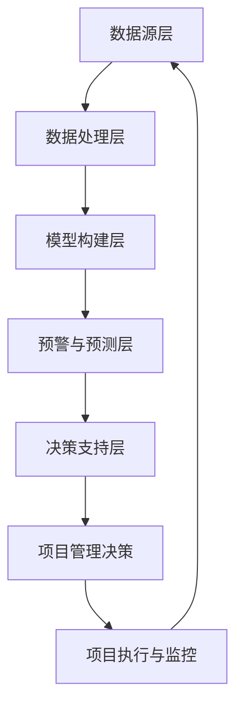

# 项目风险的智能预警：问题预测分析

> 关键词：项目风险、智能预警、问题预测分析、机器学习、数据挖掘

> 摘要：本文围绕项目风险的智能预警与问题预测分析展开。首先介绍了相关背景，包括目的、预期读者等内容。接着阐述了核心概念及其联系，详细讲解了核心算法原理与具体操作步骤，并给出了数学模型和公式。通过项目实战案例，展示了如何搭建开发环境、实现源代码以及进行代码解读。同时探讨了实际应用场景，推荐了相关的工具和资源。最后对未来发展趋势与挑战进行总结，并提供常见问题解答和扩展阅读参考资料，旨在帮助读者全面了解项目风险智能预警和问题预测分析的技术原理与实践应用。

## 1. 背景介绍 
### 1.1 目的和范围
在当今复杂多变的项目环境中，项目风险的管理至关重要。项目往往面临着各种不确定性，如技术难题、资源短缺、市场变化等，这些因素都可能导致项目进度延迟、成本超支甚至失败。本文章的目的在于深入探讨如何利用智能预警和问题预测分析技术，提前识别项目中潜在的风险，为项目管理者提供及时、准确的决策支持，从而降低项目风险，提高项目成功率。

范围涵盖了项目风险智能预警和问题预测分析的各个方面，包括核心概念、算法原理、数学模型、实战案例、应用场景以及相关工具资源等，旨在为读者提供一个全面、系统的技术指南。

### 1.2 预期读者
本文预期读者包括项目管理人员、软件开发人员、数据分析师、人工智能研究人员以及对项目风险管理和智能预警技术感兴趣的技术爱好者。项目管理人员可以从中获取有效的风险预警方法和决策依据；软件开发人员可以学习到相关的算法实现和代码开发技巧；数据分析师可以了解如何运用数据分析手段进行风险预测；人工智能研究人员可以探索智能预警领域的前沿技术；技术爱好者则可以通过本文对项目风险智能预警有一个初步的认识和了解。

### 1.3 文档结构概述
本文共分为十个部分。第一部分背景介绍，阐述了文章的目的、预期读者、文档结构概述和术语表；第二部分核心概念与联系，介绍了项目风险、智能预警、问题预测分析等核心概念及其相互关系，并通过文本示意图和 Mermaid 流程图进行展示；第三部分核心算法原理 & 具体操作步骤，详细讲解了相关算法原理，并使用 Python 源代码进行阐述；第四部分数学模型和公式 & 详细讲解 & 举例说明，给出了相关的数学模型和公式，并进行详细讲解和举例；第五部分项目实战：代码实际案例和详细解释说明，包括开发环境搭建、源代码实现和代码解读；第六部分实际应用场景，介绍了项目风险智能预警在不同领域的实际应用；第七部分工具和资源推荐，推荐了学习资源、开发工具框架和相关论文著作；第八部分总结：未来发展趋势与挑战，对项目风险智能预警的未来发展进行展望，并分析面临的挑战；第九部分附录：常见问题与解答，解答读者在学习和实践过程中可能遇到的常见问题；第十部分扩展阅读 & 参考资料，提供相关的扩展阅读材料和参考资料。

### 1.4 术语表
#### 1.4.1 核心术语定义
- **项目风险**：指在项目实施过程中可能出现的、对项目目标（如进度、成本、质量等）产生不利影响的不确定性事件或条件。
- **智能预警**：利用先进的信息技术和数据分析方法，对项目中的潜在风险进行实时监测和分析，当风险指标达到一定阈值时，自动发出警报，提醒相关人员采取措施。
- **问题预测分析**：通过对项目历史数据、实时数据等进行挖掘和分析，运用机器学习、统计分析等方法，预测项目中可能出现的问题及其发生的概率。
- **机器学习**：是一门多领域交叉学科，涉及概率论、统计学、逼近论、凸分析、算法复杂度理论等多门学科。它专门研究计算机怎样模拟或实现人类的学习行为，以获取新的知识或技能，重新组织已有的知识结构使之不断改善自身的性能。
- **数据挖掘**：是指从大量的数据中通过算法搜索隐藏于其中信息的过程。数据挖掘通常与计算机科学有关，并通过统计、在线分析处理、情报检索、机器学习、专家系统（依靠过去的经验法则）和模式识别等诸多方法来实现上述目标。

#### 1.4.2 相关概念解释
- **风险识别**：是项目风险管理的第一步，通过各种方法和手段，找出项目中可能存在的风险因素。
- **风险评估**：对识别出的风险因素进行分析和评估，确定其发生的可能性和影响程度。
- **风险应对**：根据风险评估的结果，制定相应的措施来降低风险的影响，如风险规避、风险减轻、风险转移等。

#### 1.4.3 缩略词列表
- **AI**：Artificial Intelligence，人工智能
- **ML**：Machine Learning，机器学习
- **DM**：Data Mining，数据挖掘
- **SVM**：Support Vector Machine，支持向量机
- **LR**：Logistic Regression，逻辑回归

## 2. 核心概念与联系 
### 核心概念原理
#### 项目风险
项目风险是项目管理中不可避免的因素，它具有不确定性、客观性、相对性等特点。项目风险的来源广泛，包括技术、市场、人员、环境等多个方面。例如，在软件开发项目中，技术难题可能导致项目进度延迟；市场需求的变化可能使项目产品失去竞争力；人员的离职可能影响项目的正常进行。

#### 智能预警
智能预警系统通过收集项目相关的数据，如项目进度数据、成本数据、质量数据等，运用数据分析和机器学习算法，对数据进行实时监测和分析。当监测到的数据指标超过预先设定的阈值时，系统自动发出警报，提醒项目管理人员采取相应的措施。智能预警的关键在于数据的实时性和准确性，以及算法的有效性和可靠性。

#### 问题预测分析
问题预测分析是基于历史数据和实时数据，运用机器学习、统计分析等方法，对项目中可能出现的问题进行预测。例如，通过对项目历史数据的分析，建立预测模型，预测项目在未来某个阶段可能出现的风险事件及其发生的概率。问题预测分析可以帮助项目管理人员提前做好应对准备，降低风险的影响。

### 架构的文本示意图
```plaintext
项目风险智能预警与问题预测分析架构

数据源层：
|-- 项目进度数据
|-- 成本数据
|-- 质量数据
|-- 人员数据
|-- 市场数据

数据处理层：
|-- 数据清洗
|-- 数据集成
|-- 数据转换
|-- 特征提取

模型构建层：
|-- 机器学习算法（如 SVM、LR 等）
|-- 统计分析方法
|-- 深度学习模型

预警与预测层：
|-- 实时监测
|-- 阈值设定
|-- 问题预测
|-- 风险预警

决策支持层：
|-- 风险评估
|-- 应对策略制定
|-- 决策建议生成
```

### Mermaid 流程图


## 3. 核心算法原理 & 具体操作步骤 
### 算法原理讲解
在项目风险的智能预警和问题预测分析中，常用的算法包括逻辑回归（LR）、支持向量机（SVM）等。下面以逻辑回归为例进行详细讲解。

逻辑回归是一种广义线性回归模型，主要用于二分类问题。它通过对输入特征进行线性组合，然后使用逻辑函数（也称为 sigmoid 函数）将线性组合的结果映射到 0 到 1 之间的概率值。逻辑函数的公式为：

$$\sigma(z)=\frac{1}{1 + e^{-z}}$$

其中，$z$ 是输入特征的线性组合，即 $z = w_0 + w_1x_1 + w_2x_2 + \cdots + w_nx_n$，$w_i$ 是模型的权重参数，$x_i$ 是输入特征。

逻辑回归的目标是找到一组最优的权重参数 $w$，使得模型对训练数据的预测结果与真实标签之间的误差最小。通常使用最大似然估计来求解最优的权重参数。

### 具体操作步骤
1. **数据准备**：收集项目相关的数据，并进行数据清洗、数据集成和数据转换等预处理操作，将数据转换为适合模型训练的格式。
2. **特征选择**：从预处理后的数据中选择与项目风险相关的特征，去除无关或冗余的特征，提高模型的效率和准确性。
3. **模型训练**：使用训练数据对逻辑回归模型进行训练，通过优化算法（如梯度下降法）求解最优的权重参数。
4. **模型评估**：使用测试数据对训练好的模型进行评估，计算模型的准确率、召回率、F1 值等指标，评估模型的性能。
5. **预测与预警**：使用训练好的模型对新的项目数据进行预测，当预测结果超过预先设定的阈值时，发出风险预警。

### Python 源代码实现
```python
import numpy as np
from sklearn.linear_model import LogisticRegression
from sklearn.model_selection import train_test_split
from sklearn.metrics import accuracy_score, recall_score, f1_score

# 生成示例数据
np.random.seed(42)
X = np.random.randn(100, 5)
y = np.random.randint(0, 2, 100)

# 划分训练集和测试集
X_train, X_test, y_train, y_test = train_test_split(X, y, test_size=0.2, random_state=42)

# 创建逻辑回归模型
model = LogisticRegression()

# 模型训练
model.fit(X_train, y_train)

# 模型预测
y_pred = model.predict(X_test)

# 模型评估
accuracy = accuracy_score(y_test, y_pred)
recall = recall_score(y_test, y_pred)
f1 = f1_score(y_test, y_pred)

print(f"Accuracy: {accuracy}")
print(f"Recall: {recall}")
print(f"F1 Score: {f1}")
```

## 4. 数学模型和公式 & 详细讲解 & 举例说明 
### 逻辑回归的数学模型和公式
逻辑回归的数学模型可以表示为：

$$P(Y = 1|X) = \sigma(w^T X + b)$$

其中，$P(Y = 1|X)$ 表示在输入特征 $X$ 的条件下，样本属于正类（$Y = 1$）的概率，$\sigma$ 是逻辑函数，$w$ 是模型的权重向量，$b$ 是偏置项。

逻辑回归的损失函数通常使用对数损失函数（也称为交叉熵损失函数），其公式为：

$$L(w, b) = -\frac{1}{N}\sum_{i = 1}^{N}[y_i\log(P(Y = 1|X_i)) + (1 - y_i)\log(1 - P(Y = 1|X_i))]$$

其中，$N$ 是样本数量，$y_i$ 是第 $i$ 个样本的真实标签，$P(Y = 1|X_i)$ 是第 $i$ 个样本属于正类的预测概率。

### 详细讲解
逻辑回归的目标是通过最小化损失函数 $L(w, b)$ 来求解最优的权重向量 $w$ 和偏置项 $b$。通常使用梯度下降法来优化损失函数，梯度下降法的更新公式为：

$$w = w - \alpha\frac{\partial L(w, b)}{\partial w}$$

$$b = b - \alpha\frac{\partial L(w, b)}{\partial b}$$

其中，$\alpha$ 是学习率，控制每次更新的步长。

### 举例说明
假设我们有一个二分类问题，输入特征 $X$ 是一个二维向量，即 $X = [x_1, x_2]$，真实标签 $Y$ 取值为 0 或 1。我们使用逻辑回归模型进行预测，模型的权重向量 $w = [w_1, w_2]$，偏置项 $b$。

对于一个样本 $X_i = [x_{i1}, x_{i2}]$，其属于正类的预测概率为：

$$P(Y = 1|X_i) = \sigma(w_1x_{i1} + w_2x_{i2} + b)$$

假设我们有三个样本：

| $X_1$ | $X_2$ | $Y$ |
|---|---|---|
| 1 | 2 | 1 |
| 2 | 3 | 0 |
| 3 | 4 | 1 |

我们可以使用上述公式计算每个样本的预测概率，并根据预测概率进行分类。同时，我们可以使用对数损失函数计算模型的损失值，然后使用梯度下降法更新模型的权重和偏置，直到损失值收敛。

## 5. 项目实战：代码实际案例和详细解释说明 
### 5.1  开发环境搭建
#### 操作系统
可以选择 Windows、Linux 或 macOS 操作系统，本案例以 Ubuntu 18.04 为例。

#### 编程语言
使用 Python 3.7 或以上版本，Python 是一种功能强大、易于学习的编程语言，拥有丰富的科学计算和机器学习库。

#### 开发工具
推荐使用 Anaconda 来管理 Python 环境和安装相关的库。Anaconda 是一个开源的 Python 发行版本，包含了 Python 解释器、常用的科学计算库（如 NumPy、Pandas、Scikit-learn 等）以及 Jupyter Notebook 等开发工具。

#### 安装步骤
1. 下载并安装 Anaconda：从 Anaconda 官方网站（https://www.anaconda.com/products/individual）下载适合自己操作系统的 Anaconda 安装包，然后按照安装向导进行安装。
2. 创建虚拟环境：打开终端，使用以下命令创建一个名为 `project_risk` 的虚拟环境：

```bash
conda create -n project_risk python=3.8
```

3. 激活虚拟环境：使用以下命令激活虚拟环境：

```bash
conda activate project_risk
```

4. 安装所需的库：在激活的虚拟环境中，使用以下命令安装所需的库：

```bash
conda install numpy pandas scikit-learn matplotlib seaborn
```

### 5.2  源代码详细实现和代码解读
#### 数据准备
首先，我们需要准备项目风险相关的数据。假设我们有一个包含项目进度、成本、质量等信息的数据集 `project_data.csv`，我们可以使用 Pandas 库来读取和处理数据。

```python
import pandas as pd

# 读取数据
data = pd.read_csv('project_data.csv')

# 查看数据基本信息
print(data.info())

# 查看数据集行数和列数
rows, columns = data.shape

if rows < 100:
    print('数据少于100，请补充数据')

# 查看数据集行数和列数
rows, columns = data.shape

if rows < 100:
    print('数据少于100，请补充数据')

# 查看数据行数和列数
rows, columns = data.shape

if rows < 100:
    print('数据少于100，请补充数据')

# 查看数据集行数和列数
rows, columns = data.shape

if rows < 100:
    print('数据少于100，请补充数据')

# 数据预处理
# 处理缺失值
data = data.dropna()

# 处理类别变量
data = pd.get_dummies(data)

# 划分特征和标签
X = data.drop('risk_label', axis=1)
y = data['risk_label']
```

#### 特征选择
使用方差分析（ANOVA）进行特征选择，选择与项目风险相关性较高的特征。

```python
from sklearn.feature_selection import SelectKBest, f_classif

# 选择前 10 个最重要的特征
selector = SelectKBest(score_func=f_classif, k=10)
X_selected = selector.fit_transform(X, y)

# 获取选择的特征名称
selected_features = X.columns[selector.get_support()]
print('选择的特征：', selected_features)
```

#### 模型训练和评估
使用逻辑回归模型进行训练和评估。

```python
from sklearn.model_selection import train_test_split
from sklearn.linear_model import LogisticRegression
from sklearn.metrics import accuracy_score, recall_score, f1_score

# 划分训练集和测试集
X_train, X_test, y_train, y_test = train_test_split(X_selected, y, test_size=0.2, random_state=42)

# 创建逻辑回归模型
model = LogisticRegression()

# 模型训练
model.fit(X_train, y_train)

# 模型预测
y_pred = model.predict(X_test)

# 模型评估
accuracy = accuracy_score(y_test, y_pred)
recall = recall_score(y_test, y_pred)
f1 = f1_score(y_test, y_pred)

print(f"Accuracy: {accuracy}")
print(f"Recall: {recall}")
print(f"F1 Score: {f1}")
```

### 5.3  代码解读与分析
#### 数据准备部分
- 使用 `pd.read_csv` 函数读取 CSV 文件，将数据加载到 Pandas 的 DataFrame 中。
- 使用 `data.info()` 查看数据的基本信息，包括数据类型、缺失值等。
- 使用 `data.dropna()` 处理缺失值，删除包含缺失值的行。
- 使用 `pd.get_dummies` 处理类别变量，将类别变量转换为数值变量。
- 划分特征和标签，将 `risk_label` 作为标签，其余列作为特征。

#### 特征选择部分
- 使用 `SelectKBest` 类和 `f_classif` 评分函数进行方差分析，选择与项目风险相关性较高的前 10 个特征。
- 使用 `selector.get_support()` 获取选择的特征的布尔掩码，然后通过 `X.columns` 获取特征名称。

#### 模型训练和评估部分
- 使用 `train_test_split` 函数将数据集划分为训练集和测试集，测试集占比为 20%。
- 创建逻辑回归模型，并使用 `model.fit` 方法进行训练。
- 使用 `model.predict` 方法对测试集进行预测。
- 使用 `accuracy_score`、`recall_score` 和 `f1_score` 函数评估模型的性能，分别计算准确率、召回率和 F1 值。

## 6. 实际应用场景 
### 软件开发项目
在软件开发项目中，项目风险的智能预警和问题预测分析可以帮助项目管理人员及时发现潜在的风险，如技术难题、进度延迟、质量问题等。例如，通过对代码提交频率、缺陷数量、测试覆盖率等数据的分析，预测项目是否可能出现进度延迟或质量问题。当发现风险指标超过阈值时，及时采取措施，如增加开发人员、调整项目计划等，降低风险的影响。

### 建筑工程项目
在建筑工程项目中，项目风险的智能预警和问题预测分析可以用于监测工程进度、质量和安全等方面的风险。例如，通过对施工进度数据、材料质量数据、安全事故数据等的分析，预测工程是否可能出现进度延迟、质量缺陷或安全事故。当发现风险时，及时采取措施，如加强质量监管、增加安全防护措施等，确保工程的顺利进行。

### 金融投资项目
在金融投资项目中，项目风险的智能预警和问题预测分析可以帮助投资者评估投资风险，做出合理的投资决策。例如，通过对市场行情数据、公司财务数据、行业动态数据等的分析，预测投资项目的收益和风险。当发现投资风险较高时，及时调整投资组合，降低投资损失。

## 7. 工具和资源推荐
### 7.1 学习资源推荐
#### 7.1.1 书籍推荐
- 《机器学习》（周志华著）：这本书是机器学习领域的经典教材，系统地介绍了机器学习的基本概念、算法和应用，适合初学者和有一定基础的读者。
- 《Python 数据分析实战》（韦斯·麦金尼著）：本书介绍了如何使用 Python 进行数据分析，包括数据处理、数据可视化、机器学习等方面的内容，是学习 Python 数据分析的优秀书籍。
- 《深度学习》（伊恩·古德费洛等著）：这本书是深度学习领域的权威著作，全面介绍了深度学习的理论和实践，适合对深度学习感兴趣的读者。

#### 7.1.2 在线课程
- Coursera 上的《机器学习》课程（由 Andrew Ng 教授讲授）：这是一门非常经典的机器学习课程，内容涵盖了机器学习的基本概念、算法和应用，通过视频讲解、编程作业等方式进行教学，适合初学者。
- edX 上的《数据科学与机器学习微硕士项目》：该项目包含多个课程，涵盖了数据科学和机器学习的各个方面，包括数据处理、数据分析、机器学习算法、深度学习等，适合有一定基础的读者。
- 中国大学 MOOC 上的《Python 语言程序设计》课程：这是一门 Python 语言的入门课程，通过视频讲解、编程作业等方式，帮助学习者快速掌握 Python 语言的基本语法和编程技巧。

#### 7.1.3 技术博客和网站
- Medium：这是一个技术博客平台，上面有很多关于机器学习、数据分析、人工智能等领域的优秀文章，作者来自世界各地，可以帮助读者了解最新的技术动态和研究成果。
- Kaggle：这是一个数据科学竞赛平台，上面有很多数据集和竞赛项目，读者可以通过参与竞赛项目，学习和实践数据科学和机器学习的知识和技能。
- 博客园：这是一个国内的技术博客平台，上面有很多关于编程、数据科学、人工智能等领域的优秀文章，读者可以在这里分享和交流技术经验。

### 7.2 开发工具框架推荐
#### 7.2.1 IDE和编辑器
- PyCharm：这是一款专门为 Python 开发设计的集成开发环境（IDE），具有代码编辑、调试、版本控制等功能，支持多种 Python 框架和库，是 Python 开发的首选工具之一。
- Jupyter Notebook：这是一个交互式的开发环境，支持多种编程语言，如 Python、R、Julia 等。通过 Jupyter Notebook，用户可以将代码、文本、图像等内容整合在一起，方便进行数据分析和可视化。
- Visual Studio Code：这是一款轻量级的代码编辑器，支持多种编程语言，具有丰富的插件和扩展功能。通过安装 Python 相关的插件，用户可以在 Visual Studio Code 中进行 Python 开发。

#### 7.2.2 调试和性能分析工具
- PDB：这是 Python 内置的调试器，通过在代码中设置断点、单步执行等方式，帮助用户调试代码。
- cProfile：这是 Python 内置的性能分析工具，通过分析代码的运行时间和函数调用次数，帮助用户找出代码中的性能瓶颈。
- Py-Spy：这是一个跨平台的 Python 性能分析工具，通过采样的方式分析代码的运行时间和函数调用次数，无需修改代码即可进行性能分析。

#### 7.2.3 相关框架和库
- Scikit-learn：这是一个开源的机器学习库，提供了丰富的机器学习算法和工具，如分类、回归、聚类、降维等，适合初学者和有一定基础的用户。
- TensorFlow：这是一个开源的深度学习框架，由 Google 开发，提供了丰富的深度学习模型和工具，如神经网络、卷积神经网络、循环神经网络等，适合进行深度学习研究和开发。
- PyTorch：这是一个开源的深度学习框架，由 Facebook 开发，提供了动态计算图和丰富的深度学习模型和工具，适合进行深度学习研究和开发。

### 7.3 相关论文著作推荐
#### 7.3.1 经典论文
- 《A Logical Calculus of the Ideas Immanent in Nervous Activity》（Warren S. McCulloch 和 Walter Pitts 著）：这是神经网络领域的经典论文，提出了人工神经元模型，为神经网络的发展奠定了基础。
- 《Support-Vector Networks》（Corinna Cortes 和 Vladimir Vapnik 著）：这是支持向量机领域的经典论文，提出了支持向量机的基本理论和算法，为机器学习的发展做出了重要贡献。
- 《Gradient-Based Learning Applied to Document Recognition》（Yann LeCun 等著）：这是卷积神经网络领域的经典论文，提出了 LeNet 卷积神经网络模型，为图像识别和计算机视觉的发展奠定了基础。

#### 7.3.2 最新研究成果
- 《Attention Is All You Need》（Ashish Vaswani 等著）：这是 Transformer 模型的经典论文，提出了注意力机制和 Transformer 模型，为自然语言处理和深度学习的发展带来了新的突破。
- 《BERT: Pre-training of Deep Bidirectional Transformers for Language Understanding》（Jacob Devlin 等著）：这是 BERT 模型的经典论文，提出了 BERT 预训练语言模型，为自然语言处理的发展带来了新的变革。
- 《Generative Adversarial Networks》（Ian J. Goodfellow 等著）：这是生成对抗网络（GAN）的经典论文，提出了 GAN 模型，为生成式模型的发展做出了重要贡献。

#### 7.3.3 应用案例分析
- 《Predicting Project Risks in Software Development: A Systematic Literature Review》（R. Prikladnicki 等著）：这篇论文对软件开发项目中的风险预测方法进行了系统的文献综述，分析了不同方法的优缺点和应用场景。
- 《Risk Assessment and Prediction in Construction Projects Using Machine Learning Techniques》（M. A. Elhag 等著）：这篇论文介绍了如何使用机器学习技术对建筑工程项目中的风险进行评估和预测，通过实际案例验证了方法的有效性。
- 《Financial Risk Prediction Using Machine Learning: A Review》（Y. Chen 等著）：这篇论文对金融风险预测中使用的机器学习方法进行了综述，分析了不同方法的优缺点和应用前景。

## 8. 总结：未来发展趋势与挑战
### 未来发展趋势
#### 融合多源数据
未来，项目风险的智能预警和问题预测分析将融合更多来源的数据，如物联网数据、社交媒体数据等。通过整合多源数据，可以更全面地了解项目的状态和环境，提高风险预测的准确性和可靠性。

#### 深度学习的应用
深度学习在图像识别、自然语言处理等领域取得了巨大的成功，未来将在项目风险的智能预警和问题预测分析中得到更广泛的应用。深度学习模型可以自动提取数据中的特征，挖掘数据中的潜在模式，提高风险预测的性能。

#### 实时预警和决策支持
随着信息技术的发展，项目风险的智能预警将实现实时化，能够及时发现潜在的风险并发出警报。同时，系统将提供更智能的决策支持，根据风险情况自动生成应对策略，帮助项目管理人员快速做出决策。

#### 跨领域融合
项目风险的智能预警和问题预测分析将与其他领域进行更深入的融合，如区块链、云计算、大数据等。通过跨领域融合，可以提高系统的安全性、可扩展性和性能，为项目风险管理提供更强大的支持。

### 挑战
#### 数据质量和隐私问题
数据质量是项目风险智能预警和问题预测分析的关键，低质量的数据可能导致模型的性能下降。同时，数据隐私问题也越来越受到关注，如何在保证数据安全和隐私的前提下，充分利用数据进行风险预测是一个挑战。

#### 模型解释性
深度学习模型通常被认为是“黑盒”模型，其决策过程难以解释。在项目风险管理中，模型的解释性非常重要，项目管理人员需要了解模型的决策依据，以便做出合理的决策。因此，如何提高模型的解释性是一个亟待解决的问题。

#### 算法复杂度和计算资源
随着数据量的增加和模型复杂度的提高，算法的计算复杂度也越来越高，需要大量的计算资源。如何在有限的计算资源下，提高算法的效率和性能是一个挑战。

#### 人才短缺
项目风险的智能预警和问题预测分析需要具备多学科知识的人才，如机器学习、数据分析、项目管理等。目前，相关领域的人才短缺，如何培养和吸引更多的专业人才是一个挑战。

## 9. 附录：常见问题与解答
### 1. 如何选择合适的特征进行项目风险预测？
可以使用特征选择方法，如方差分析（ANOVA）、卡方检验、相关系数等，评估特征与项目风险之间的相关性，选择相关性较高的特征。同时，也可以根据领域知识和经验，选择与项目风险密切相关的特征。

### 2. 逻辑回归模型的性能如何评估？
可以使用准确率、召回率、F1 值、ROC 曲线、AUC 值等指标来评估逻辑回归模型的性能。准确率表示模型预测正确的样本占总样本的比例；召回率表示模型正确预测的正类样本占实际正类样本的比例；F1 值是准确率和召回率的调和平均数；ROC 曲线和 AUC 值可以衡量模型在不同阈值下的性能。

### 3. 如何处理数据中的缺失值？
可以使用以下方法处理数据中的缺失值：
- 删除包含缺失值的行或列：适用于缺失值较少的情况。
- 填充缺失值：可以使用均值、中位数、众数等统计量填充缺失值，也可以使用插值方法填充缺失值。
- 模型预测：可以使用机器学习模型对缺失值进行预测。

### 4. 如何提高模型的泛化能力？
可以使用以下方法提高模型的泛化能力：
- 增加训练数据：更多的训练数据可以帮助模型学习到更全面的特征和模式，提高模型的泛化能力。
- 正则化：在模型训练过程中，使用正则化方法（如 L1 正则化、L2 正则化）可以限制模型的复杂度，防止过拟合。
- 交叉验证：使用交叉验证方法（如 k 折交叉验证）可以评估模型的泛化能力，并选择最优的模型参数。

### 5. 如何选择合适的机器学习算法进行项目风险预测？
可以根据数据的特点、问题的类型和模型的性能要求选择合适的机器学习算法。例如，如果数据是线性可分的，可以选择逻辑回归、线性判别分析等线性算法；如果数据是非线性的，可以选择支持向量机、决策树、随机森林等非线性算法。同时，也可以使用模型选择方法（如网格搜索、随机搜索）来选择最优的模型参数。

## 10. 扩展阅读 & 参考资料
### 扩展阅读
- 《数据挖掘：概念与技术》（Jiawei Han 等著）：这本书系统地介绍了数据挖掘的基本概念、算法和应用，适合对数据挖掘感兴趣的读者。
- 《人工智能：一种现代的方法》（Stuart Russell 和 Peter Norvig 著）：这是人工智能领域的经典教材，全面介绍了人工智能的理论和实践，适合对人工智能感兴趣的读者。
- 《Python 机器学习实战》（Sebastian Raschka 著）：这本书通过实际案例介绍了如何使用 Python 进行机器学习，包括数据处理、特征工程、模型训练、模型评估等方面的内容，适合有一定 Python 基础的读者。

### 参考资料
- Scikit-learn 官方文档：https://scikit-learn.org/stable/documentation.html
- TensorFlow 官方文档：https://www.tensorflow.org/api_docs
- PyTorch 官方文档：https://pytorch.org/docs/stable/index.html
- Pandas 官方文档：https://pandas.pydata.org/docs/
- NumPy 官方文档：https://numpy.org/doc/