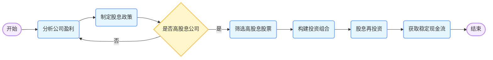

# 高股息策略：构建稳定现金流的投资组合

> 关键词：高股息策略、投资组合、稳定现金流、股息率、股息再投资

> 摘要：本文深入探讨了高股息策略在构建稳定现金流投资组合中的应用。首先介绍了高股息策略的背景，包括目的、预期读者和文档结构等内容。接着阐述了高股息策略的核心概念与联系，详细讲解了核心算法原理及具体操作步骤，并给出了相关的数学模型和公式。通过项目实战案例，展示了如何运用高股息策略构建投资组合。同时，分析了高股息策略的实际应用场景，推荐了学习、开发相关的工具和资源。最后总结了高股息策略的未来发展趋势与挑战，并提供了常见问题解答和扩展阅读参考资料，旨在帮助投资者深入理解并运用高股息策略实现稳定的现金流回报。

## 1. 背景介绍 
### 1.1 目的和范围
在投资领域，投资者的目标通常是实现资产的增值和稳定的现金流回报。高股息策略作为一种重要的投资策略，旨在通过投资那些股息支付稳定且股息率较高的股票，为投资者提供持续的现金流。本文的目的是全面深入地介绍高股息策略，包括其原理、实施步骤、数学模型以及实际应用等方面，帮助投资者了解如何运用该策略构建稳定现金流的投资组合。

本文的范围涵盖了高股息策略的基本概念、核心算法、数学模型的分析，通过实际案例展示该策略在投资组合构建中的应用，同时探讨了该策略在不同市场环境下的实际应用场景，并为投资者提供了学习和应用高股息策略所需的工具和资源推荐。

### 1.2 预期读者
本文预期读者主要包括对股票投资感兴趣的个人投资者，希望通过合理的投资策略实现资产的保值增值和稳定的现金流收入；也适用于专业的投资机构从业人员，如基金经理、投资顾问等，他们可以从本文中获取关于高股息策略的深入分析和实践经验，为其投资决策提供参考；此外，对于金融专业的学生和研究人员，本文可以作为了解投资策略和资产配置的学习资料，帮助他们深入理解高股息策略的原理和应用。

### 1.3 文档结构概述
本文将按照以下结构进行阐述：
1. **核心概念与联系**：介绍高股息策略的核心概念，包括股息、股息率等，分析这些概念之间的联系，并通过文本示意图和 Mermaid 流程图展示其架构。
2. **核心算法原理 & 具体操作步骤**：详细讲解高股息策略的核心算法原理，通过 Python 源代码阐述如何筛选高股息股票以及构建投资组合的具体操作步骤。
3. **数学模型和公式 & 详细讲解 & 举例说明**：给出高股息策略相关的数学模型和公式，如股息率的计算、投资组合的收益计算等，并进行详细讲解和举例说明。
4. **项目实战：代码实际案例和详细解释说明**：通过实际项目案例，展示如何在开发环境中搭建高股息投资组合的代码实现，对源代码进行详细解读和分析。
5. **实际应用场景**：分析高股息策略在不同市场环境下的实际应用场景，如牛市、熊市和震荡市等。
6. **工具和资源推荐**：为投资者提供学习高股息策略的相关资源，包括书籍、在线课程、技术博客和网站等，同时推荐开发工具框架，如 IDE 和编辑器、调试和性能分析工具、相关框架和库等，还推荐了相关的论文著作。
7. **总结：未来发展趋势与挑战**：总结高股息策略的未来发展趋势，分析可能面临的挑战。
8. **附录：常见问题与解答**：解答投资者在应用高股息策略过程中常见的问题。
9. **扩展阅读 & 参考资料**：提供与高股息策略相关的扩展阅读资料和参考书目。

### 1.4 术语表
#### 1.4.1 核心术语定义
- **股息**：股息是指股份公司从提取了公积金、公益金的税后利润中按照股息率派发给股东的收益。简单来说，就是公司将一部分盈利分配给股东的现金。
- **股息率**：股息率是股息与股票价格之间的比率，通常以百分比表示。它是衡量股票投资价值的重要指标之一，计算公式为：$股息率=\frac{年度股息}{股票价格}\times100\%$。
- **股息再投资**：股息再投资是指投资者将获得的股息收入再次投资于该股票或其他资产，以增加投资份额，实现复利增长。
- **高股息股票**：高股息股票是指股息率相对较高的股票，一般来说，股息率高于市场平均水平的股票可以被视为高股息股票。
- **投资组合**：投资组合是指由多种资产构成的集合，投资者通过合理配置不同资产，以达到分散风险、实现预期收益的目的。在高股息策略中，投资组合通常由多只高股息股票组成。

#### 1.4.2 相关概念解释
- **除息日**：除息日是指股票除去股息的日期。在除息日当天或之后购买该股票的投资者将不再享有本次股息分配的权利。
- **派息日**：派息日是指公司实际向股东发放股息的日期。
- **股息政策**：股息政策是指公司关于股息分配的原则和方针，包括是否分配股息、分配多少股息以及何时分配股息等决策。不同的公司可能有不同的股息政策，这会影响股票的股息率和投资者的收益。

#### 1.4.3 缩略词列表
- **EPS**：Earnings Per Share，每股收益，是指公司净利润与发行在外普通股股数的比率，反映了每股股票的盈利水平。
- **P/E**：Price-to-Earnings Ratio，市盈率，是指股票价格与每股收益的比率，用于衡量股票的估值水平。

## 2. 核心概念与联系 

### 核心概念原理
高股息策略的核心在于通过投资高股息股票来获取稳定的现金流。股息是公司盈利的一部分，公司将盈利以股息的形式分配给股东，股息率反映了股票的股息收益水平。投资者选择高股息股票的原因主要有以下几点：
1. **稳定的现金流**：高股息股票能够为投资者提供定期的现金收入，无论市场行情如何，这些现金收入可以作为投资者的日常开支或进行再投资。
2. **抗风险能力**：一般来说，能够持续支付高股息的公司通常具有较为稳定的经营业绩和财务状况，这些公司在市场波动时具有较强的抗风险能力。
3. **复利效应**：通过股息再投资，投资者可以增加投资份额，实现复利增长，长期来看，复利效应可以显著提高投资收益。

### 架构的文本示意图
```plaintext
高股息策略架构
|-- 股息来源
|   |-- 公司盈利
|       |-- 主营业务收入
|       |-- 其他收入
|-- 股息分配
|   |-- 股息政策
|       |-- 固定股息政策
|       |-- 固定比率股息政策
|       |-- 剩余股息政策
|-- 高股息股票筛选
|   |-- 股息率指标
|       |-- 历史股息率
|       |-- 预期股息率
|   |-- 财务指标
|       |-- 净利润
|       |-- 现金流
|       |-- 资产负债率
|-- 投资组合构建
|   |-- 股票选择
|       |-- 行业分散
|       |-- 规模分散
|   |-- 权重分配
|       |-- 等权重
|       |-- 市值加权
```

### Mermaid 流程图


## 3. 核心算法原理 & 具体操作步骤 

### 核心算法原理
高股息策略的核心算法主要包括两个部分：高股息股票的筛选和投资组合的构建。

#### 高股息股票筛选算法
高股息股票筛选的主要依据是股息率和公司的财务状况。具体步骤如下：
1. **计算股息率**：通过公司的历史股息数据和当前股票价格计算股息率。公式为：$股息率=\frac{年度股息}{股票价格}\times100\%$。
2. **筛选高股息股票**：设定一个股息率阈值，选择股息率高于该阈值的股票。
3. **评估公司财务状况**：除了股息率，还需要评估公司的财务状况，如净利润、现金流、资产负债率等，确保公司具有持续支付股息的能力。

#### 投资组合构建算法
投资组合构建的目标是在分散风险的前提下，实现预期的收益。常见的投资组合构建方法有等权重法和市值加权法。

- **等权重法**：将投资资金平均分配到每只股票上，每只股票的权重相等。
- **市值加权法**：根据股票的市值大小分配投资资金，市值越大的股票权重越高。

### 具体操作步骤

#### 步骤 1：数据收集
收集股票的历史股息数据、当前股票价格、公司财务报表等信息。可以通过金融数据提供商，如 Wind、东方财富等获取相关数据。

#### 步骤 2：计算股息率
使用 Python 代码计算每只股票的股息率。以下是一个简单的示例代码：
```python
import pandas as pd

# 假设 data 是一个包含股票代码、年度股息和股票价格的数据框
data = pd.DataFrame({
    'stock_code': ['000001', '000002', '000003'],
    'annual_dividend': [1.0, 2.0, 1.5],
    'stock_price': [10.0, 20.0, 15.0]
})

# 计算股息率
data['dividend_yield'] = data['annual_dividend'] / data['stock_price'] * 100

print(data)
```

#### 步骤 3：筛选高股息股票
设定一个股息率阈值，如 5%，筛选出股息率高于该阈值的股票。
```python
# 设定股息率阈值
threshold = 5

# 筛选高股息股票
high_dividend_stocks = data[data['dividend_yield'] > threshold]

print(high_dividend_stocks)
```

#### 步骤 4：评估公司财务状况
除了股息率，还需要评估公司的财务状况。可以使用财务指标，如净利润增长率、现金流状况、资产负债率等进行评估。以下是一个简单的示例代码，假设我们有一个包含财务指标的数据框 `financial_data`：
```python
# 假设 financial_data 是一个包含股票代码、净利润增长率、现金流比率和资产负债率的数据框
financial_data = pd.DataFrame({
    'stock_code': ['000001', '000002', '000003'],
    'net_profit_growth_rate': [0.1, 0.2, 0.15],
    'cash_flow_ratio': [0.5, 0.6, 0.55],
    'debt_to_asset_ratio': [0.4, 0.3, 0.35]
})

# 合并高股息股票和财务数据
merged_data = pd.merge(high_dividend_stocks, financial_data, on='stock_code')

# 筛选财务状况良好的股票
# 假设净利润增长率大于 0.1，现金流比率大于 0.5，资产负债率小于 0.4
good_financial_stocks = merged_data[(merged_data['net_profit_growth_rate'] > 0.1) &
                                    (merged_data['cash_flow_ratio'] > 0.5) &
                                    (merged_data['debt_to_asset_ratio'] < 0.4)]

print(good_financial_stocks)
```

#### 步骤 5：构建投资组合
根据筛选出的股票，使用等权重法或市值加权法构建投资组合。以下是一个使用等权重法构建投资组合的示例代码：
```python
# 假设我们有 10000 元的投资资金
investment_amount = 10000

# 计算每只股票的投资金额
num_stocks = len(good_financial_stocks)
investment_per_stock = investment_amount / num_stocks

# 为每只股票分配投资金额
good_financial_stocks['investment_amount'] = investment_per_stock

print(good_financial_stocks)
```

## 4. 数学模型和公式 & 详细讲解 & 举例说明 

### 股息率计算公式
股息率是衡量股票股息收益水平的重要指标，其计算公式为：
$$股息率=\frac{年度股息}{股票价格}\times100\%$$
其中，年度股息是指公司在一年内向股东支付的股息总额，股票价格是指当前股票的市场价格。

**举例说明**：假设某股票的年度股息为 2 元，当前股票价格为 20 元，则该股票的股息率为：
$$股息率=\frac{2}{20}\times100\% = 10\%$$

### 投资组合收益率计算公式
投资组合的收益率可以通过加权平均的方法计算。假设投资组合中有 $n$ 只股票，第 $i$ 只股票的权重为 $w_i$，收益率为 $r_i$，则投资组合的收益率 $R_p$ 计算公式为：
$$R_p=\sum_{i = 1}^{n}w_ir_i$$

**举例说明**：假设投资组合中有三只股票，权重分别为 $w_1 = 0.3$，$w_2 = 0.3$，$w_3 = 0.4$，收益率分别为 $r_1 = 0.1$，$r_2 = 0.15$，$r_3 = 0.2$，则投资组合的收益率为：
$$R_p=0.3\times0.1 + 0.3\times0.15 + 0.4\times0.2 = 0.155 = 15.5\%$$

### 股息再投资后的资产价值计算公式
股息再投资可以实现复利增长，假设初始投资金额为 $P$，股息率为 $d$，投资期限为 $n$ 年，每年进行一次股息再投资，股票价格保持不变，则 $n$ 年后的资产价值 $V$ 计算公式为：
$$V = P(1 + d)^n$$

**举例说明**：假设初始投资金额为 10000 元，股息率为 5%，投资期限为 10 年，则 10 年后的资产价值为：
$$V = 10000\times(1 + 0.05)^{10}\approx16288.95$$

### 风险分散模型
在构建投资组合时，为了降低风险，需要进行风险分散。可以使用现代投资组合理论中的马科维茨模型，该模型通过计算资产之间的协方差来确定最优投资组合。假设投资组合中有 $n$ 只股票，第 $i$ 只股票的收益率为 $r_i$，方差为 $\sigma_i^2$，第 $i$ 只股票和第 $j$ 只股票的协方差为 $\sigma_{ij}$，投资组合的权重向量为 $\mathbf{w}=(w_1,w_2,\cdots,w_n)^T$，则投资组合的方差 $\sigma_p^2$ 计算公式为：
$$\sigma_p^2=\sum_{i = 1}^{n}\sum_{j = 1}^{n}w_iw_j\sigma_{ij}$$

在给定预期收益率的情况下，通过求解最小化投资组合方差的问题，可以得到最优投资组合的权重。

## 5. 项目实战：代码实际案例和详细解释说明 

### 5.1  开发环境搭建
#### 安装 Python
首先需要安装 Python 环境，建议使用 Python 3.7 及以上版本。可以从 Python 官方网站（https://www.python.org/downloads/）下载并安装。

#### 安装必要的库
在使用 Python 进行高股息策略投资组合构建时，需要安装一些必要的库，如 `pandas`、`numpy` 等。可以使用以下命令进行安装：
```sh
pip install pandas numpy
```

#### 数据获取
可以使用金融数据提供商的 API 或下载历史数据文件来获取股票的股息数据、价格数据和财务数据。例如，可以使用 `pandas-datareader` 库从雅虎财经获取股票数据：
```sh
pip install pandas-datareader
```

### 5.2  源代码详细实现和代码解读
以下是一个完整的高股息策略投资组合构建的 Python 代码示例：
```python
import pandas as pd
import numpy as np
import pandas_datareader.data as web
import datetime

# 定义数据获取函数
def get_stock_data(tickers, start_date, end_date):
    data = {}
    for ticker in tickers:
        try:
            df = web.DataReader(ticker, 'yahoo', start_date, end_date)
            data[ticker] = df
        except Exception as e:
            print(f"Error getting data for {ticker}: {e}")
    return data

# 定义股息率计算函数
def calculate_dividend_yield(data):
    dividend_yields = {}
    for ticker, df in data.items():
        if 'Dividends' in df.columns and not df['Dividends'].empty:
            annual_dividend = df['Dividends'].sum()
            last_price = df['Close'].iloc[-1]
            dividend_yield = annual_dividend / last_price * 100
            dividend_yields[ticker] = dividend_yield
    return dividend_yields

# 定义高股息股票筛选函数
def select_high_dividend_stocks(dividend_yields, threshold):
    high_dividend_stocks = []
    for ticker, dividend_yield in dividend_yields.items():
        if dividend_yield > threshold:
            high_dividend_stocks.append(ticker)
    return high_dividend_stocks

# 定义投资组合构建函数（等权重法）
def build_portfolio(high_dividend_stocks, investment_amount):
    num_stocks = len(high_dividend_stocks)
    investment_per_stock = investment_amount / num_stocks
    portfolio = {ticker: investment_per_stock for ticker in high_dividend_stocks}
    return portfolio

# 主函数
def main():
    # 定义股票代码列表
    tickers = ['AAPL', 'MSFT', 'JPM', 'PG', 'KO']
    # 定义数据获取时间范围
    start_date = datetime.datetime(2020, 1, 1)
    end_date = datetime.datetime(2023, 12, 31)
    # 定义股息率阈值
    dividend_yield_threshold = 3
    # 定义投资金额
    investment_amount = 10000

    # 获取股票数据
    stock_data = get_stock_data(tickers, start_date, end_date)
    # 计算股息率
    dividend_yields = calculate_dividend_yield(stock_data)
    # 筛选高股息股票
    high_dividend_stocks = select_high_dividend_stocks(dividend_yields, dividend_yield_threshold)
    # 构建投资组合
    portfolio = build_portfolio(high_dividend_stocks, investment_amount)

    print("股息率：", dividend_yields)
    print("高股息股票：", high_dividend_stocks)
    print("投资组合：", portfolio)

if __name__ == "__main__":
    main()
```

### 5.3  代码解读与分析
#### 数据获取函数 `get_stock_data`
该函数接受股票代码列表、开始日期和结束日期作为参数，使用 `pandas-datareader` 库从雅虎财经获取股票的历史数据，并将数据存储在一个字典中，键为股票代码，值为对应的 `DataFrame`。

#### 股息率计算函数 `calculate_dividend_yield`
该函数接受股票数据字典作为参数，遍历每个股票的数据，计算年度股息和最后收盘价，然后计算股息率，并将结果存储在一个字典中，键为股票代码，值为对应的股息率。

#### 高股息股票筛选函数 `select_high_dividend_stocks`
该函数接受股息率字典和股息率阈值作为参数，遍历股息率字典，选择股息率高于阈值的股票，并将这些股票代码存储在一个列表中返回。

#### 投资组合构建函数 `build_portfolio`
该函数接受高股息股票列表和投资金额作为参数，使用等权重法将投资金额平均分配到每只股票上，并将结果存储在一个字典中，键为股票代码，值为对应的投资金额。

#### 主函数 `main`
主函数定义了股票代码列表、数据获取时间范围、股息率阈值和投资金额，调用上述函数完成数据获取、股息率计算、高股息股票筛选和投资组合构建，并打印相关结果。

## 6. 实际应用场景 
### 牛市环境
在牛市环境中，股票市场整体上涨，高股息策略仍然具有一定的优势。一方面，高股息股票通常具有稳定的业绩和现金流，在市场上涨时，这些股票也会跟随市场上涨，为投资者带来资本增值；另一方面，高股息股票的股息收入可以为投资者提供额外的收益，降低投资组合的波动风险。例如，在 2014 - 2015 年的牛市中，一些高股息的蓝筹股如银行股、消费股等不仅股价上涨，还为投资者提供了稳定的股息收入。

### 熊市环境
在熊市环境中，股票市场整体下跌，投资者的风险偏好降低，更倾向于追求稳定的现金流。高股息策略在熊市中表现出较强的抗跌性，因为高股息股票的股息收入可以部分弥补股价下跌带来的损失。例如，在 2008 年全球金融危机期间，许多高股息股票的股息率相对较高，为投资者提供了一定的保护。

### 震荡市环境
在震荡市环境中，股票市场波动较大，缺乏明显的趋势。高股息策略可以为投资者提供稳定的现金流，使投资者在市场波动中保持相对稳定的心态。同时，投资者可以通过股息再投资，在市场低位买入更多的股票，降低平均成本，等待市场上涨时获得更高的收益。

### 长期投资场景
对于长期投资者来说，高股息策略是一种非常适合的投资策略。通过长期持有高股息股票，投资者可以获得稳定的现金流收入，并通过股息再投资实现复利增长。长期来看，复利效应可以显著提高投资收益。例如，一些知名的高股息股票如可口可乐、强生等，长期以来一直为投资者提供了稳定的股息收入和资本增值。

## 7. 工具和资源推荐
### 7.1 学习资源推荐
#### 7.1.1 书籍推荐
- 《聪明的投资者》（The Intelligent Investor）：作者本杰明·格雷厄姆（Benjamin Graham）是价值投资的鼻祖，这本书是价值投资领域的经典之作，其中包含了关于股息投资的重要思想和方法。
- 《漫步华尔街》（A Random Walk Down Wall Street）：作者伯顿·马尔基尔（Burton G. Malkiel）在书中介绍了各种投资策略，包括高股息策略，并对不同投资策略的优缺点进行了分析。
- 《股息投资策略》（The Dividend Investor's Handbook）：这本书专门介绍了股息投资的策略和方法，包括如何筛选高股息股票、如何构建股息投资组合等内容。

#### 7.1.2 在线课程
- Coursera 上的“投资学原理”（Principles of Investment）课程：该课程由知名大学的教授授课，涵盖了投资学的基本原理和方法，包括股息投资策略的介绍。
- Udemy 上的“股息投资实战”（Dividend Investing for Beginners）课程：该课程适合初学者，通过实际案例讲解股息投资的操作步骤和技巧。

#### 7.1.3 技术博客和网站
- Seeking Alpha（https://seekingalpha.com/）：这是一个专业的金融投资网站，提供了大量关于股息投资的文章和分析报告，投资者可以从中获取最新的市场信息和投资建议。
- Dividend.com（https://www.dividend.com/）：该网站专注于股息投资，提供了股息股票的筛选工具、股息率排名、股息历史数据等信息，方便投资者进行股息投资研究。

### 7.2 开发工具框架推荐
#### 7.2.1 IDE和编辑器
- PyCharm：这是一款专业的 Python 集成开发环境，具有代码编辑、调试、版本控制等功能，适合开发高股息策略相关的 Python 代码。
- Jupyter Notebook：这是一个交互式的开发环境，支持 Python、R 等多种编程语言，适合进行数据分析和模型验证，在高股息策略的研究和开发中非常有用。

#### 7.2.2 调试和性能分析工具
- PDB：Python 自带的调试器，可以帮助开发者在代码中设置断点、查看变量值等，方便调试高股息策略的代码。
- cProfile：Python 标准库中的性能分析工具，可以分析代码的运行时间和函数调用情况，帮助开发者优化代码性能。

#### 7.2.3 相关框架和库
- Pandas：这是一个强大的数据分析库，提供了数据结构和数据处理工具，在处理股票数据、计算股息率等方面非常有用。
- Numpy：这是一个用于科学计算的库，提供了高效的数组操作和数学函数，在投资组合计算等方面可以提高代码的运行效率。

### 7.3 相关论文著作推荐
#### 7.3.1 经典论文
- Fama, E. F., & French, K. R. (1993). Common risk factors in the returns on stocks and bonds. Journal of Financial Economics, 33(1), 3-56. 这篇论文提出了著名的 Fama - French 三因子模型，对理解股票收益率的影响因素具有重要意义，也可以应用于高股息策略的研究。
- Black, F., & Scholes, M. (1973). The pricing of options and corporate liabilities. Journal of Political Economy, 81(3), 637-654. 这篇论文提出了 Black - Scholes 期权定价模型，虽然主要用于期权定价，但其中的一些思想和方法也可以应用于投资组合的风险管理。

#### 7.3.2 最新研究成果
可以通过学术数据库如 Web of Science、EBSCOhost 等搜索关于高股息策略的最新研究成果，了解该领域的前沿动态和研究方向。

#### 7.3.3 应用案例分析
一些金融研究机构和投资公司会发布关于高股息策略的应用案例分析报告，投资者可以通过这些报告了解高股息策略在实际投资中的应用效果和经验教训。

## 8. 总结：未来发展趋势与挑战
### 未来发展趋势
#### 智能化和自动化
随着人工智能和机器学习技术的发展，高股息策略的应用将越来越智能化和自动化。投资者可以利用算法模型自动筛选高股息股票、构建投资组合，并根据市场变化实时调整投资策略。例如，一些量化投资机构已经开始使用机器学习算法预测股票的股息率和股价走势，从而优化高股息投资组合。

#### 多元化投资
未来，高股息策略可能会与其他投资策略相结合，实现多元化投资。例如，将高股息策略与成长股投资策略相结合，既可以获得稳定的股息收入，又可以分享成长股的资本增值潜力。此外，投资者还可以将高股息股票与债券、基金等其他资产进行组合，进一步分散风险。

#### 全球投资
随着全球金融市场的一体化，投资者将有更多的机会进行全球高股息投资。不同国家和地区的股票市场具有不同的特点和股息政策，投资者可以通过全球配置高股息股票，实现更高的收益和更低的风险。

### 挑战
#### 市场波动风险
尽管高股息股票通常具有较强的抗风险能力，但在市场大幅波动时，高股息股票的股价也可能会受到影响。例如，在金融危机期间，一些高股息股票的股价也出现了大幅下跌，导致投资者的资本损失。因此，投资者需要在市场波动时保持冷静，合理调整投资组合。

#### 股息政策变化风险
公司的股息政策可能会受到多种因素的影响，如公司业绩、行业竞争、宏观经济环境等。如果公司的股息政策发生变化，减少或停止股息分配，将直接影响投资者的股息收入。因此，投资者需要密切关注公司的经营状况和股息政策变化。

#### 数据质量和准确性
高股息策略的实施依赖于准确的股票数据和财务信息。如果数据质量不高或存在错误，将影响股息率的计算和高股息股票的筛选结果。因此，投资者需要选择可靠的数据来源，并对数据进行仔细的验证和分析。

## 9. 附录：常见问题与解答
### 问题 1：高股息股票一定是好的投资选择吗？
不一定。虽然高股息股票可以为投资者提供稳定的现金流，但高股息率可能是由于公司股价下跌导致的，而不是公司业绩良好。此外，公司的股息政策可能会发生变化，如果公司未来业绩下滑，可能会减少或停止股息分配。因此，投资者在选择高股息股票时，不仅要关注股息率，还要评估公司的财务状况、行业前景等因素。

### 问题 2：如何判断公司是否有能力持续支付股息？
可以从以下几个方面判断公司是否有能力持续支付股息：
1. **财务状况**：关注公司的净利润、现金流、资产负债率等财务指标。净利润稳定增长、现金流充足、资产负债率较低的公司通常具有较强的支付股息的能力。
2. **股息政策**：了解公司的股息政策，如是否有固定的股息支付比例、是否有稳定的股息增长历史等。
3. **行业前景**：选择处于稳定发展行业的公司，这些公司的业绩相对稳定，更有可能持续支付股息。

### 问题 3：股息再投资有什么好处？
股息再投资可以实现复利增长，长期来看，复利效应可以显著提高投资收益。通过股息再投资，投资者可以在不增加额外资金投入的情况下，增加投资份额，从而在股票价格上涨时获得更多的资本增值。此外，股息再投资还可以降低交易成本，提高投资效率。

### 问题 4：高股息策略适合短期投资吗？
高股息策略更适合长期投资。短期来看，股票价格的波动可能会掩盖股息收入的影响，而且短期投资可能会面临较高的交易成本。而长期持有高股息股票，投资者可以获得稳定的股息收入，并通过股息再投资实现复利增长，同时也可以分享公司成长带来的资本增值。

## 10. 扩展阅读 & 参考资料
### 扩展阅读
- 《金融市场与金融机构》：深入了解金融市场的运作机制和金融机构的功能，有助于更好地理解高股息策略在金融市场中的应用。
- 《量化投资：策略与技术》：介绍了量化投资的方法和技术，包括如何使用量化模型进行股票筛选和投资组合构建，对高股息策略的量化应用有一定的参考价值。

### 参考资料
- 金融数据提供商的官方网站，如 Wind、东方财富等，获取股票的历史数据和财务信息。
- 证券交易所的官方网站，如上海证券交易所、深圳证券交易所、纽约证券交易所等，获取上市公司的公告和信息披露文件。
- 学术数据库，如 Web of Science、EBSCOhost 等，获取关于高股息策略的学术研究论文。