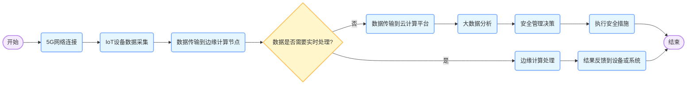

# 5G+IoT在智慧校园安全管理中的应用

> 关键词：5G、物联网（IoT）、智慧校园、安全管理、应用

> 摘要：本文深入探讨了5G+IoT在智慧校园安全管理中的应用。首先介绍了相关背景，包括研究目的、预期读者等。接着阐述了5G和IoT的核心概念及联系，分析了其核心算法原理与操作步骤。通过数学模型和公式进一步说明其理论基础，并结合实际案例详细解释了代码实现与分析。探讨了5G+IoT在智慧校园安全管理中的实际应用场景，推荐了相关学习资源、开发工具框架和论文著作。最后总结了未来发展趋势与挑战，提供了常见问题解答和扩展阅读参考资料，旨在为智慧校园安全管理领域的研究和实践提供全面的技术指导。

## 1. 背景介绍 
### 1.1 目的和范围
随着信息技术的飞速发展，5G和物联网（IoT）技术逐渐成熟并广泛应用。智慧校园作为教育信息化的重要发展方向，安全管理是其核心需求之一。本文章旨在探讨5G+IoT技术如何应用于智慧校园安全管理，分析其技术原理、实现方法和实际应用场景，为提升智慧校园安全管理水平提供理论和实践指导。文章的范围涵盖了5G和IoT的核心概念、算法原理、数学模型，以及在智慧校园安全管理中的具体应用案例和相关工具资源推荐。

### 1.2 预期读者
本文预期读者包括从事智慧校园建设和安全管理的技术人员、教育机构的管理人员、相关领域的研究人员以及对5G和IoT技术在教育领域应用感兴趣的爱好者。通过阅读本文，读者可以了解5G+IoT在智慧校园安全管理中的应用全貌，掌握相关技术知识和实践方法。

### 1.3 文档结构概述
本文将按照以下结构进行组织：首先介绍背景信息，包括目的、读者和文档结构概述；接着阐述5G和IoT的核心概念及联系，展示其架构和流程图；然后详细讲解核心算法原理和操作步骤，并用Python代码进行示例；通过数学模型和公式进一步说明其理论基础；结合实际案例介绍代码实现和分析；探讨实际应用场景；推荐相关工具和资源；最后总结未来发展趋势与挑战，提供常见问题解答和扩展阅读参考资料。

### 1.4 术语表
#### 1.4.1 核心术语定义
- **5G**：第五代移动通信技术，具有高速率、低延迟、大容量等特点，能够满足物联网设备大规模连接和数据快速传输的需求。
- **物联网（IoT）**：通过各种信息传感器、射频识别技术、全球定位系统等技术和装置，实时采集任何需要监控、连接、互动的物体或过程，采集其声、光、热、电、力学、化学、生物、位置等各种需要的信息，通过各类可能的网络接入，实现物与物、物与人的泛在连接，实现对物品和过程的智能化感知、识别和管理。
- **智慧校园**：利用物联网、云计算、大数据、人工智能等新一代信息技术，全面感知校园物理环境，整合校园信息资源，实现教学、科研、管理、服务等业务的数字化、网络化、智能化，为师生提供个性化、便捷化、智能化的学习和生活环境。
- **安全管理**：对校园内的人员、财产、设施等进行保护，预防和处理各种安全事故和突发事件，确保校园的安全稳定运行。

#### 1.4.2 相关概念解释
- **边缘计算**：在靠近物或数据源头的一侧，采用网络、计算、存储、应用核心能力为一体的开放平台，就近提供最近端服务。其应用程序在边缘侧发起，产生更快的网络服务响应，满足行业在实时业务、应用智能、安全与隐私保护等方面的基本需求。
- **云计算**：基于互联网的相关服务的增加、使用和交付模式，通常涉及通过互联网来提供动态易扩展且经常是虚拟化的资源。云是网络、互联网的一种比喻说法。
- **大数据**：指无法在一定时间范围内用常规软件工具进行捕捉、管理和处理的数据集合，是需要新处理模式才能具有更强的决策力、洞察发现力和流程优化能力的海量、高增长率和多样化的信息资产。

#### 1.4.3 缩略词列表
- **5G**：Fifth Generation Mobile Communication Technology
- **IoT**：Internet of Things
- **AI**：Artificial Intelligence
- **MEC**：Multi-access Edge Computing

## 2. 核心概念与联系 
### 2.1 5G技术原理
5G技术采用了一系列先进的技术，如毫米波、大规模MIMO、网络切片等，以实现高速率、低延迟和大容量的通信。毫米波频段具有丰富的频谱资源，可以提供更高的传输速率；大规模MIMO技术通过增加天线数量，提高了信号的发射和接收能力，增强了通信的可靠性和覆盖范围；网络切片技术可以将物理网络划分为多个虚拟网络，满足不同应用场景的需求。

### 2.2 IoT技术原理
物联网（IoT）是通过各种传感器和设备将物理世界与数字世界连接起来的技术。传感器可以采集物体的各种信息，如温度、湿度、光照、位置等，然后通过网络将这些信息传输到云端或边缘设备进行处理和分析。物联网的核心是传感器技术、网络通信技术和数据处理技术。

### 2.3 5G与IoT的联系
5G技术为物联网的发展提供了强有力的支持。5G的高速率可以满足物联网设备大量数据的快速传输需求，低延迟可以保证实时性应用的响应速度，大容量可以支持更多的物联网设备连接。同时，物联网的广泛应用也为5G技术提供了更多的应用场景和发展空间。

### 2.4 核心概念架构的文本示意图
```plaintext
                            +-------------------+
                            |      智慧校园      |
                            +-------------------+
                                   |
                                   |
            +----------------------+----------------------+
            |                                           |
+-------------------+                          +-------------------+
|       5G网络       |                          |      IoT设备       |
+-------------------+                          +-------------------+
            |                                           |
            |                                           |
+-------------------+                          +-------------------+
|    网络切片管理    |                          |    传感器采集    |
+-------------------+                          +-------------------+
            |                                           |
            |                                           |
+-------------------+                          +-------------------+
|    边缘计算节点    |                          |    数据传输模块    |
+-------------------+                          +-------------------+
            |                                           |
            |                                           |
+-------------------+                          +-------------------+
|     云计算平台     |                          |    数据存储模块    |
+-------------------+                          +-------------------+
            |                                           |
            |                                           |
+-------------------+                          +-------------------+
|    大数据分析    |                          |    数据处理模块    |
+-------------------+                          +-------------------+
```

### 2.5 Mermaid流程图


## 3. 核心算法原理 & 具体操作步骤 
### 3.1 传感器数据采集算法
传感器数据采集是物联网的基础，其核心是如何准确、高效地采集物理世界的信息。以下是一个简单的Python代码示例，模拟传感器数据采集：
```python
import random
import time

# 模拟传感器数据采集
def sensor_data_collection():
    # 模拟采集温度数据
    temperature = random.uniform(20, 30)
    # 模拟采集湿度数据
    humidity = random.uniform(40, 60)
    return temperature, humidity

# 循环采集数据
while True:
    temp, hum = sensor_data_collection()
    print(f"温度: {temp:.2f} °C, 湿度: {hum:.2f} %")
    time.sleep(1)  # 每秒采集一次数据
```
### 3.2 数据传输算法
数据传输算法的目标是将采集到的数据可靠、快速地传输到目标节点。在5G网络环境下，可以使用TCP/IP协议进行数据传输。以下是一个简单的Python代码示例，使用socket库进行数据传输：
```python
import socket
import time

# 服务器配置
server_ip = '127.0.0.1'
server_port = 8888

# 创建socket对象
client_socket = socket.socket(socket.AF_INET, socket.SOCK_STREAM)

# 连接服务器
client_socket.connect((server_ip, server_port))

# 模拟传感器数据采集并发送
while True:
    # 模拟采集数据
    data = f"温度: {random.uniform(20, 30):.2f} °C, 湿度: {random.uniform(40, 60):.2f} %"
    # 发送数据
    client_socket.sendall(data.encode())
    print(f"发送数据: {data}")
    time.sleep(1)  # 每秒发送一次数据

# 关闭socket连接
client_socket.close()
```
### 3.3 数据处理算法
数据处理算法的目的是对采集到的数据进行清洗、分析和挖掘，提取有价值的信息。以下是一个简单的Python代码示例，对采集到的温度数据进行简单的统计分析：
```python
import random

# 模拟采集100个温度数据
temperature_data = [random.uniform(20, 30) for _ in range(100)]

# 计算平均温度
average_temperature = sum(temperature_data) / len(temperature_data)

# 找出最高温度和最低温度
max_temperature = max(temperature_data)
min_temperature = min(temperature_data)

print(f"平均温度: {average_temperature:.2f} °C")
print(f"最高温度: {max_temperature:.2f} °C")
print(f"最低温度: {min_temperature:.2f} °C")
```

## 4. 数学模型和公式 & 详细讲解 & 举例说明 
### 4.1 传感器数据采集模型
传感器数据采集可以用随机过程模型来描述。假设传感器采集的数据是一个随机变量 $X(t)$，其中 $t$ 表示时间。在实际应用中，传感器采集的数据通常受到噪声的影响，可以表示为：
$$X(t) = S(t) + N(t)$$
其中 $S(t)$ 是真实信号，$N(t)$ 是噪声。噪声通常可以假设为高斯白噪声，其概率密度函数为：
$$p(n) = \frac{1}{\sqrt{2\pi\sigma^2}} \exp\left(-\frac{n^2}{2\sigma^2}\right)$$
其中 $\sigma^2$ 是噪声的方差。

举例说明：假设一个温度传感器采集的真实温度信号为 $S(t) = 25 + 2\sin(2\pi ft)$，其中 $f = 0.1$ Hz，噪声 $N(t)$ 是方差为 $\sigma^2 = 0.5$ 的高斯白噪声。则传感器采集到的温度数据为：
```python
import numpy as np
import matplotlib.pyplot as plt

# 时间范围
t = np.linspace(0, 10, 1000)

# 真实信号
S = 25 + 2 * np.sin(2 * np.pi * 0.1 * t)

# 噪声
N = np.random.normal(0, np.sqrt(0.5), len(t))

# 传感器采集的数据
X = S + N

# 绘制图形
plt.figure(figsize=(10, 6))
plt.plot(t, S, label='真实信号')
plt.plot(t, X, label='采集数据')
plt.xlabel('时间 (s)')
plt.ylabel('温度 (°C)')
plt.title('传感器数据采集模型')
plt.legend()
plt.grid(True)
plt.show()
```
### 4.2 数据传输模型
数据传输可以用排队论模型来描述。假设数据传输系统是一个 $M/M/1$ 排队系统，其中到达率为 $\lambda$，服务率为 $\mu$。系统的平均队长 $L_s$ 和平均等待时间 $W_s$ 可以用以下公式计算：
$$L_s = \frac{\lambda}{\mu - \lambda}$$
$$W_s = \frac{1}{\mu - \lambda}$$

举例说明：假设一个数据传输系统的到达率为 $\lambda = 10$ 个数据包/秒，服务率为 $\mu = 15$ 个数据包/秒。则系统的平均队长和平均等待时间为：
```python
lambda_ = 10
mu = 15

L_s = lambda_ / (mu - lambda_)
W_s = 1 / (mu - lambda_)

print(f"平均队长: {L_s:.2f} 个数据包")
print(f"平均等待时间: {W_s:.2f} 秒")
```
### 4.3 数据处理模型
数据处理可以用机器学习模型来描述。例如，使用线性回归模型对传感器采集的数据进行预测。假设我们有一组温度数据 $(x_1, y_1), (x_2, y_2), \cdots, (x_n, y_n)$，其中 $x_i$ 是时间，$y_i$ 是温度。线性回归模型可以表示为：
$$y = \beta_0 + \beta_1x + \epsilon$$
其中 $\beta_0$ 和 $\beta_1$ 是模型的参数，$\epsilon$ 是误差项。可以使用最小二乘法来估计模型的参数：
$$\hat{\beta}_1 = \frac{\sum_{i=1}^{n}(x_i - \bar{x})(y_i - \bar{y})}{\sum_{i=1}^{n}(x_i - \bar{x})^2}$$
$$\hat{\beta}_0 = \bar{y} - \hat{\beta}_1\bar{x}$$

举例说明：假设我们有以下温度数据：
```python
import numpy as np

# 时间
x = np.array([1, 2, 3, 4, 5])
# 温度
y = np.array([20, 22, 24, 26, 28])

# 计算均值
x_mean = np.mean(x)
y_mean = np.mean(y)

# 计算斜率
beta_1 = np.sum((x - x_mean) * (y - y_mean)) / np.sum((x - x_mean) ** 2)

# 计算截距
beta_0 = y_mean - beta_1 * x_mean

print(f"斜率: {beta_1:.2f}")
print(f"截距: {beta_0:.2f}")
```

## 5. 项目实战：代码实际案例和详细解释说明 
### 5.1  开发环境搭建
#### 5.1.1 硬件环境
- **传感器设备**：选择适合的传感器，如温度传感器、湿度传感器、光照传感器等。可以使用Arduino、Raspberry Pi等开发板连接传感器进行数据采集。
- **网络设备**：确保校园内有稳定的5G网络覆盖，可以使用5G路由器或5G模组实现设备的网络连接。
- **服务器**：选择性能稳定的服务器，如阿里云、腾讯云等云服务器，用于存储和处理采集到的数据。

#### 5.1.2 软件环境
- **操作系统**：选择适合的操作系统，如Linux（Ubuntu、CentOS等）或Windows Server。
- **编程语言**：选择Python作为开发语言，Python具有丰富的库和工具，适合物联网开发。
- **开发框架**：可以使用Flask、Django等Web框架开发后端服务，使用MQTT协议进行设备通信。

### 5.2  源代码详细实现和代码解读
#### 5.2.1 传感器数据采集代码
```python
import Adafruit_DHT

# 传感器类型
sensor = Adafruit_DHT.DHT11
# 传感器连接的引脚
pin = 4

# 读取传感器数据
humidity, temperature = Adafruit_DHT.read_retry(sensor, pin)

if humidity is not None and temperature is not None:
    print(f"温度: {temperature:.2f} °C, 湿度: {humidity:.2f} %")
else:
    print('无法读取传感器数据')
```
代码解读：这段代码使用Adafruit_DHT库读取DHT11传感器的温度和湿度数据。首先定义传感器类型和连接的引脚，然后调用`read_retry`函数读取数据。如果读取成功，则打印温度和湿度数据；否则，打印错误信息。

#### 5.2.2 数据传输代码
```python
import paho.mqtt.client as mqtt

# MQTT服务器配置
broker_address = "localhost"
port = 1883
topic = "sensor/data"

# 创建MQTT客户端
client = mqtt.Client()

# 连接到MQTT服务器
client.connect(broker_address, port)

# 模拟传感器数据采集并发送
while True:
    humidity, temperature = Adafruit_DHT.read_retry(sensor, pin)
    if humidity is not None and temperature is not None:
        data = f"温度: {temperature:.2f} °C, 湿度: {humidity:.2f} %"
        client.publish(topic, data)
        print(f"发送数据: {data}")
    time.sleep(1)  # 每秒发送一次数据
```
代码解读：这段代码使用paho-mqtt库将传感器采集到的数据通过MQTT协议发送到服务器。首先配置MQTT服务器的地址、端口和主题，然后创建MQTT客户端并连接到服务器。在循环中，不断读取传感器数据并将其发布到指定的主题上。

#### 5.2.3 数据处理代码
```python
import paho.mqtt.client as mqtt
import json

# MQTT服务器配置
broker_address = "localhost"
port = 1883
topic = "sensor/data"

# 处理接收到的数据
def on_message(client, userdata, msg):
    data = msg.payload.decode()
    print(f"接收到数据: {data}")
    # 这里可以进行数据处理和分析
    # 例如，将数据存储到数据库中

# 创建MQTT客户端
client = mqtt.Client()

# 设置消息处理函数
client.on_message = on_message

# 连接到MQTT服务器
client.connect(broker_address, port)

# 订阅主题
client.subscribe(topic)

# 开始循环处理网络流量
client.loop_forever()
```
代码解读：这段代码使用paho-mqtt库接收MQTT服务器发布的传感器数据。首先配置MQTT服务器的地址、端口和主题，然后创建MQTT客户端并连接到服务器。设置消息处理函数`on_message`，当接收到数据时，调用该函数进行处理。最后订阅指定的主题并开始循环处理网络流量。

### 5.3  代码解读与分析
#### 5.3.1 传感器数据采集代码分析
传感器数据采集代码使用了Adafruit_DHT库，该库提供了简单的接口来读取DHT系列传感器的数据。代码通过调用`read_retry`函数进行多次尝试读取数据，提高了数据读取的成功率。

#### 5.3.2 数据传输代码分析
数据传输代码使用了MQTT协议，MQTT是一种轻量级的消息传输协议，适合物联网设备之间的通信。代码通过创建MQTT客户端并连接到服务器，将传感器采集到的数据发布到指定的主题上。

#### 5.3.3 数据处理代码分析
数据处理代码同样使用了MQTT协议，通过订阅指定的主题接收服务器发布的传感器数据。在消息处理函数`on_message`中，可以对接收到的数据进行处理和分析，例如将数据存储到数据库中。

## 6. 实际应用场景 
### 6.1 校园环境监测
通过部署大量的传感器，如温度传感器、湿度传感器、光照传感器等，可以实时监测校园内的环境参数。例如，当教室的温度过高或过低时，系统可以自动调节空调的运行；当光照强度不足时，系统可以自动打开灯光。

### 6.2 校园安全监控
在校园内安装摄像头、门禁系统等设备，通过5G网络将视频和门禁数据实时传输到监控中心。监控中心可以实时监控校园内的人员和车辆活动，及时发现异常情况并采取相应的措施。例如，当有人非法闯入校园时，系统可以自动报警并通知安保人员。

### 6.3 校园设施管理
通过在校园设施上安装传感器，如电梯、消防设备等，可以实时监测设施的运行状态。当设施出现故障时，系统可以自动通知维修人员进行维修。例如，当电梯出现故障时，系统可以自动发送故障信息到维修人员的手机上。

### 6.4 校园人员管理
通过使用RFID标签、人脸识别等技术，对校园内的人员进行管理。例如，学生和教职工可以通过刷卡或人脸识别进入校园和教学楼，系统可以实时记录人员的进出时间和位置信息。同时，系统还可以对人员的考勤情况进行统计和分析。

## 7. 工具和资源推荐
### 7.1 学习资源推荐
#### 7.1.1 书籍推荐
- 《物联网：技术、应用与标准》：全面介绍了物联网的技术原理、应用场景和标准体系，适合初学者入门。
- 《5G技术原理与应用》：详细讲解了5G技术的原理、关键技术和应用场景，对深入理解5G技术有很大帮助。
- 《Python数据分析实战》：介绍了Python在数据分析领域的应用，包括数据采集、清洗、分析和可视化等方面的内容。

#### 7.1.2 在线课程
- Coursera上的“物联网基础”课程：由知名高校的教授授课，系统地介绍了物联网的基础知识和应用。
- edX上的“5G技术与应用”课程：深入讲解了5G技术的原理和应用，提供了丰富的案例和实验。
- 慕课网上的“Python数据分析与机器学习实战”课程：通过实际案例介绍了Python在数据分析和机器学习领域的应用。

#### 7.1.3 技术博客和网站
- 物联网世界（https://www.iotworld.com.cn/）：提供了物联网领域的最新技术、产品和应用案例。
- 5G通信网（https://www.5gcom.net/）：专注于5G技术的研究和应用，提供了丰富的5G技术资料和新闻。
- 开源中国（https://www.oschina.net/）：提供了大量的开源项目和技术文章，对学习和实践有很大帮助。

### 7.2 开发工具框架推荐
#### 7.2.1 IDE和编辑器
- PyCharm：一款专业的Python集成开发环境，提供了丰富的代码编辑、调试和部署功能。
- Visual Studio Code：一款轻量级的代码编辑器，支持多种编程语言和插件扩展，适合快速开发。
- Arduino IDE：专门用于Arduino开发板的集成开发环境，提供了简单易用的编程界面。

#### 7.2.2 调试和性能分析工具
- Wireshark：一款网络协议分析工具，可以用于捕获和分析网络数据包，帮助调试网络通信问题。
- Py-Spy：一款Python性能分析工具，可以实时监测Python程序的性能指标，帮助优化代码性能。
- MQTT.fx：一款MQTT客户端工具，可以用于测试和调试MQTT协议的通信。

#### 7.2.3 相关框架和库
- Flask：一款轻量级的Python Web框架，适合快速开发Web应用和API服务。
- Django：一款功能强大的Python Web框架，提供了丰富的功能和插件，适合开发大型Web应用。
- Paho-MQTT：一款Python MQTT客户端库，提供了简单易用的接口，用于实现MQTT协议的通信。

### 7.3 相关论文著作推荐
#### 7.3.1 经典论文
- "A Survey on Internet of Things: Architecture, Enabling Technologies, Security and Privacy, and Applications"：对物联网的架构、关键技术、安全隐私和应用进行了全面的综述。
- "5G Wireless Systems for the Internet of Things"：探讨了5G技术在物联网中的应用和挑战。
- "Big Data Analytics for Smart Cities: A Survey"：介绍了大数据分析在智慧城市建设中的应用和方法。

#### 7.3.2 最新研究成果
- 可以关注IEEE Transactions on Mobile Computing、ACM Transactions on Sensor Networks等顶级学术期刊，了解5G+IoT领域的最新研究成果。
- 参加IEEE International Conference on Communications (ICC)、ACM SIGCOMM等国际学术会议，获取最新的研究动态和技术趋势。

#### 7.3.3 应用案例分析
- 可以参考华为、爱立信等通信设备厂商的官方网站，了解他们在5G+IoT领域的应用案例和解决方案。
- 关注一些知名的物联网企业，如小米、海尔等，了解他们在智能家居、工业物联网等领域的应用实践。

## 8. 总结：未来发展趋势与挑战
### 8.1 未来发展趋势
- **融合化发展**：5G、IoT、AI等技术将进一步融合，实现更加智能化、自动化的校园安全管理。例如，通过AI技术对监控视频进行分析，实现对异常行为的自动识别和预警。
- **个性化服务**：根据不同用户的需求和偏好，提供个性化的校园安全管理服务。例如，为学生提供个性化的安全提醒和防护建议。
- **生态化建设**：构建智慧校园安全管理生态系统，整合各类资源和服务，实现资源共享和协同发展。例如，与公安、消防等部门建立联动机制，提高应急处理能力。

### 8.2 挑战
- **安全隐私问题**：5G+IoT在智慧校园安全管理中的应用涉及大量的个人信息和敏感数据，如何保障数据的安全和隐私是一个重要的挑战。
- **技术标准不统一**：目前，5G和IoT领域的技术标准还不够完善和统一，不同厂商的设备和系统之间可能存在兼容性问题，影响了系统的集成和应用。
- **成本问题**：5G+IoT技术的应用需要大量的硬件设备和软件系统支持，建设和维护成本较高，如何降低成本是一个需要解决的问题。

## 9. 附录：常见问题与解答
### 9.1 5G网络不稳定怎么办？
可以检查5G设备的信号强度和网络设置，确保设备正常连接到5G网络。如果问题仍然存在，可以联系运营商进行排查和解决。

### 9.2 传感器数据不准确怎么办？
可以检查传感器的安装位置和工作状态，确保传感器正常工作。如果问题仍然存在，可以对传感器进行校准或更换。

### 9.3 如何保障数据的安全和隐私？
可以采用加密技术对数据进行加密处理，确保数据在传输和存储过程中的安全性。同时，建立严格的访问控制机制，限制对数据的访问权限。

### 9.4 如何选择适合的传感器？
可以根据实际需求和应用场景选择适合的传感器。例如，如果需要监测温度和湿度，可以选择温湿度传感器；如果需要监测光照强度，可以选择光照传感器。

## 10. 扩展阅读 & 参考资料
### 10.1 扩展阅读
- 《工业物联网：从边缘到云端》：介绍了工业物联网的技术原理和应用案例，对理解物联网在不同领域的应用有很大帮助。
- 《人工智能：现代方法》：全面介绍了人工智能的基本概念、算法和应用，对深入理解AI技术有很大帮助。
- 《云计算与大数据》：介绍了云计算和大数据的技术原理和应用，对理解数据存储和处理有很大帮助。

### 10.2 参考资料
- 相关技术标准和规范，如IEEE 802.11ax（Wi-Fi 6）、3GPP 5G标准等。
- 设备厂商的产品说明书和技术文档，如华为、中兴等厂商的5G设备和物联网传感器的产品说明书。
- 学术论文和研究报告，如IEEE、ACM等学术组织发表的相关论文和研究报告。

作者：AI天才研究院/AI Genius Institute & 禅与计算机程序设计艺术 /Zen And The Art of Computer Programming