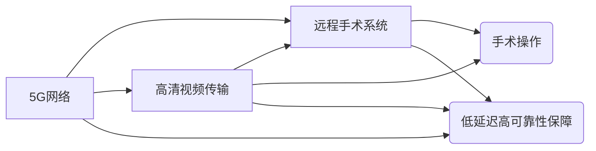

# 5G网络在远程手术中的高清视频传输

> 关键词：5G网络、远程手术、高清视频传输、低延迟、高可靠性

> 摘要：本文聚焦于5G网络在远程手术中高清视频传输的应用。首先介绍了相关背景，包括目的范围、预期读者等内容。接着阐述了5G网络、远程手术及高清视频传输的核心概念与联系。详细讲解了核心算法原理与具体操作步骤，并给出了相应的数学模型和公式。通过项目实战，展示了代码实际案例并进行详细解释。探讨了5G网络在远程手术中高清视频传输的实际应用场景，推荐了相关的工具和资源。最后总结了未来发展趋势与挑战，还包含常见问题与解答以及扩展阅读等内容，旨在全面深入地剖析5G网络在远程手术高清视频传输中的关键作用和技术要点。

## 1. 背景介绍 
### 1.1 目的和范围
远程手术作为医疗领域的一项重大创新，旨在打破地域限制，让患者能够获得更优质的医疗资源。而高清视频传输在远程手术中至关重要，它能够让主刀医生清晰、准确地观察手术部位的情况，做出正确的决策。5G网络具有高速率、低延迟、高可靠性等特性，为远程手术中的高清视频传输提供了强大的技术支持。本文的目的在于深入探讨5G网络如何实现远程手术中的高清视频传输，分析其技术原理、应用场景以及面临的挑战等，范围涵盖5G网络技术、高清视频编码解码、远程手术系统架构等多个方面。

### 1.2 预期读者
本文预期读者包括医疗行业的从业者，如外科医生、麻醉师等，他们可以通过了解5G网络在远程手术高清视频传输中的应用，更好地利用新技术提升手术的安全性和成功率；通信领域的专业人员，包括网络工程师、通信技术研发人员等，有助于他们深入研究5G网络在医疗场景中的应用和优化；还有对医疗科技和通信技术交叉领域感兴趣的科研人员、学生等，为他们提供全面的知识和研究思路。

### 1.3 文档结构概述
本文首先介绍背景信息，让读者对5G网络在远程手术高清视频传输的相关内容有初步的了解。接着阐述核心概念与联系，明确关键技术的原理和相互关系。然后详细讲解核心算法原理及具体操作步骤，通过Python代码进行说明。给出数学模型和公式并举例解释。进行项目实战，展示实际代码案例并解读。探讨实际应用场景，推荐相关工具和资源。最后总结未来发展趋势与挑战，提供常见问题解答和扩展阅读资料，使读者对整个主题有全面、深入的认识。

### 1.4 术语表
#### 1.4.1 核心术语定义
- **5G网络**：第五代移动通信网络，具有高速率、低延迟、高可靠性、大容量等特点，能够满足多种复杂场景的通信需求。
- **远程手术**：利用通信技术和机器人技术，让医生在远离患者的地方通过操作手术设备进行手术的医疗模式。
- **高清视频传输**：将分辨率较高（如1080p及以上）、画质清晰的视频信号从源端传输到接收端的过程。

#### 1.4.2 相关概念解释
- **低延迟**：指信号从发送端到接收端的传输时间非常短，在远程手术中，低延迟能够保证医生操作与手术设备动作的实时同步，减少手术风险。
- **高可靠性**：5G网络具有高度的稳定性和容错能力，确保在远程手术过程中高清视频传输不中断，数据准确无误。
- **视频编码**：将原始视频信号进行压缩处理，减少数据量，便于传输和存储。常见的视频编码标准有H.264、H.265等。

#### 1.4.3 缩略词列表
- **5G**：Fifth Generation Mobile Networks（第五代移动通信网络）
- **HDR**：High Dynamic Range（高动态范围）
- **FPS**：Frames Per Second（帧率）

## 2. 核心概念与联系 

### 2.1 5G网络原理
5G网络采用了一系列先进的技术，如毫米波通信、大规模多输入多输出（Massive MIMO）、网络切片等。毫米波通信利用高频段的毫米波进行数据传输，能够提供极高的带宽，满足高清视频传输对大量数据的需求。大规模多输入多输出技术通过多个天线同时发送和接收信号，提高了信号的强度和覆盖范围，增强了通信的可靠性。网络切片则可以将5G网络划分为多个虚拟的子网，每个子网可以根据不同的应用场景进行定制化配置，为远程手术中的高清视频传输提供专用的网络资源，确保其低延迟和高可靠性。

### 2.2 远程手术系统架构
远程手术系统主要由手术端设备、通信网络和医生控制端设备组成。手术端设备包括手术机器人、高清摄像头等，用于执行手术操作和采集手术部位的高清视频图像。通信网络负责将手术端采集的视频数据和医生控制端的操作指令进行传输。医生控制端设备则是医生操作手术的界面，医生通过它观察手术视频并发出操作指令。

### 2.3 高清视频传输原理
高清视频由于数据量巨大，在传输前需要进行编码压缩。常见的视频编码算法通过去除视频中的冗余信息，如空间冗余、时间冗余等，将视频数据量大幅减少。在接收端，再进行解码还原出原始的高清视频。同时，为了保证视频传输的实时性和流畅性，还需要采用自适应码率调整等技术，根据网络状况动态调整视频的编码参数。

### 2.4 核心概念联系示意图


## 3. 核心算法原理 & 具体操作步骤 

### 3.1 视频编码算法原理
以H.264视频编码算法为例，其核心原理是通过预测编码和变换编码来去除视频中的冗余信息。预测编码包括帧内预测和帧间预测。帧内预测是在同一帧图像内，根据相邻像素的信息来预测当前像素的值，从而减少空间冗余。帧间预测则是利用相邻帧之间的相关性，通过运动估计和运动补偿来预测当前帧的内容，减少时间冗余。变换编码是将预测后的残差信号进行离散余弦变换（DCT），将空间域的信号转换到频域，然后对频域系数进行量化和熵编码，进一步减少数据量。

以下是一个简单的Python代码示例，使用OpenCV库进行视频编码：
```python
import cv2

# 打开视频文件
cap = cv2.VideoCapture('input_video.mp4')

# 获取视频的帧率、宽度和高度
fps = cap.get(cv2.CAP_PROP_FPS)
width = int(cap.get(cv2.CAP_PROP_FRAME_WIDTH))
height = int(cap.get(cv2.CAP_PROP_FRAME_HEIGHT))

# 定义视频编码器和输出文件
fourcc = cv2.VideoWriter_fourcc(*'XVID')
out = cv2.VideoWriter('output_video.avi', fourcc, fps, (width, height))

while cap.isOpened():
    ret, frame = cap.read()
    if ret:
        # 对帧进行处理（这里可以添加更复杂的编码处理）
        out.write(frame)
    else:
        break

# 释放资源
cap.release()
out.release()
cv2.destroyAllWindows()
```
### 3.2 5G网络传输优化算法
为了保证5G网络在远程手术高清视频传输中的低延迟和高可靠性，可以采用拥塞控制算法和自适应调制编码（AMC）算法。拥塞控制算法可以根据网络的拥塞情况动态调整数据的发送速率，避免网络拥塞导致的延迟增加和丢包。自适应调制编码算法则可以根据信道质量动态调整调制方式和编码速率，提高传输效率。

以下是一个简单的拥塞控制算法示例：
```python
# 模拟拥塞控制算法
class CongestionControl:
    def __init__(self, initial_rate):
        self.rate = initial_rate
        self.congestion_window = 1
        self.threshold = 10

    def update_rate(self, packet_loss):
        if packet_loss:
            self.threshold = max(self.congestion_window // 2, 1)
            self.congestion_window = 1
        else:
            if self.congestion_window < self.threshold:
                self.congestion_window += 1
            else:
                self.congestion_window += 1 / self.congestion_window
        self.rate = self.congestion_window
        return self.rate
```
### 3.3 具体操作步骤
1. **手术端视频采集**：使用高清摄像头采集手术部位的视频图像。
2. **视频编码**：将采集到的视频数据进行编码压缩，减少数据量。
3. **5G网络传输**：通过5G网络将编码后的视频数据发送到医生控制端。
4. **视频解码**：医生控制端接收到视频数据后，进行解码还原出高清视频。
5. **医生操作指令传输**：医生根据视频图像发出操作指令，通过5G网络传输到手术端。
6. **手术端执行操作**：手术端接收到操作指令后，由手术机器人执行相应的手术操作。

## 4. 数学模型和公式 & 详细讲解 & 举例说明 

### 4.1 视频编码数学模型
在H.264视频编码中，帧内预测可以用以下数学模型表示：
设当前像素为 $x_{i,j}$，其预测值为 $\hat{x}_{i,j}$，则预测误差为：
$$e_{i,j}=x_{i,j}-\hat{x}_{i,j}$$
通过选择合适的预测模式，使得预测误差的能量最小。

帧间预测的运动估计可以用以下公式表示：
设当前帧的像素块为 $B_{t}(i,j)$，参考帧的像素块为 $B_{r}(m,n)$，则运动矢量为：
$$\mathbf{v}=(m - i,n - j)$$
运动补偿就是用参考帧的像素块 $B_{r}(m,n)$ 来预测当前帧的像素块 $B_{t}(i,j)$。

### 4.2 5G网络传输数学模型
5G网络的信道容量可以用香农公式表示：
$$C = B\log_{2}(1 + \frac{S}{N})$$
其中，$C$ 表示信道容量（单位：bps），$B$ 表示信道带宽（单位：Hz），$S$ 表示信号功率，$N$ 表示噪声功率。

在拥塞控制算法中，拥塞窗口的更新可以用以下公式表示：
当发生丢包时：
$$\text{threshold}=\max(\frac{\text{cwnd}}{2},1)$$
$$\text{cwnd}=1$$
当未发生丢包时：
$$\text{cwnd}=\begin{cases}\text{cwnd}+1, & \text{if } \text{cwnd}<\text{threshold}\\\text{cwnd}+\frac{1}{\text{cwnd}}, & \text{if } \text{cwnd}\geq\text{threshold}\end{cases}$$
其中，$\text{cwnd}$ 表示拥塞窗口大小，$\text{threshold}$ 表示拥塞阈值。

### 4.3 举例说明
假设一个5G网络信道带宽 $B = 100$ MHz，信号功率 $S = 100$ mW，噪声功率 $N = 1$ mW。
首先计算信噪比：
$$\frac{S}{N}=\frac{100}{1}=100$$
然后根据香农公式计算信道容量：
$$C = 100\times10^{6}\log_{2}(1 + 100)\approx664.4\times10^{6}\text{ bps}$$
这意味着该5G网络信道理论上可以支持高达约664.4 Mbps的数据传输速率，能够满足高清视频传输的需求。

## 5. 项目实战：代码实际案例和详细解释说明 

### 5.1  开发环境搭建
1. **硬件环境**：需要一台支持5G网络的设备，如5G手机或5G路由器，以及高清摄像头和计算机。
2. **软件环境**：安装Python开发环境（建议使用Python 3.7及以上版本），并安装相关的库，如OpenCV、numpy等。可以使用以下命令安装：
```bash
pip install opencv-python numpy
```

### 5.2  源代码详细实现和代码解读
以下是一个完整的远程手术高清视频传输的模拟代码示例：
```python
import cv2
import socket
import struct
import pickle

# 服务器端代码
def server():
    server_socket = socket.socket(socket.AF_INET, socket.SOCK_STREAM)
    host_name = socket.gethostname()
    host_ip = socket.gethostbyname(host_name)
    port = 9999
    socket_address = (host_ip, port)
    server_socket.bind(socket_address)
    server_socket.listen(5)
    print("Listening at", socket_address)

    while True:
        client_socket, addr = server_socket.accept()
        print('Got connection from', addr)
        if client_socket:
            vid = cv2.VideoCapture(0)
            while(vid.isOpened()):
                img, frame = vid.read()
                a = pickle.dumps(frame)
                message = struct.pack("Q", len(a))+a
                client_socket.sendall(message)
                cv2.imshow('Sending...', frame)
                key = cv2.waitKey(10) 
                if key == 13:
                    client_socket.close()
    cv2.destroyAllWindows()

# 客户端代码
def client():
    client_socket = socket.socket(socket.AF_INET, socket.SOCK_STREAM)
    host_ip = '127.0.0.1'  # 服务器的IP地址
    port = 9999
    client_socket.connect((host_ip, port))
    data = b""
    payload_size = struct.calcsize("Q")
    while True:
        while len(data) < payload_size:
            packet = client_socket.recv(4*1024) 
            if not packet: break
            data += packet
        packed_msg_size = data[:payload_size]
        data = data[payload_size:]
        msg_size = struct.unpack("Q", packed_msg_size)[0]
        while len(data) < msg_size:
            data += client_socket.recv(4*1024)
        frame_data = data[:msg_size]
        data = data[msg_size:]
        frame = pickle.loads(frame_data)
        cv2.imshow("Receiving...", frame)
        key = cv2.waitKey(1) 
        if key == 13:
            break
    client_socket.close()
    cv2.destroyAllWindows()
```
### 5.3  代码解读与分析
- **服务器端代码**：
  - 首先创建一个TCP套接字，并绑定到指定的IP地址和端口。
  - 开始监听客户端的连接请求。
  - 当有客户端连接时，打开摄像头开始采集视频帧。
  - 将视频帧使用 `pickle` 进行序列化，然后使用 `struct` 打包数据长度信息。
  - 将打包后的数据发送给客户端。
  - 显示发送的视频帧。
- **客户端代码**：
  - 创建一个TCP套接字，并连接到服务器的IP地址和端口。
  - 接收服务器发送的数据，首先接收数据长度信息。
  - 根据数据长度信息接收完整的视频帧数据。
  - 使用 `pickle` 反序列化视频帧数据。
  - 显示接收到的视频帧。

这个代码示例模拟了远程手术中高清视频的传输过程，通过5G网络可以实现更高效、低延迟的传输。

## 6. 实际应用场景 
### 6.1 偏远地区医疗救援
在偏远地区，医疗资源相对匮乏，遇到复杂的手术病例时，当地医生可能无法独立完成手术。通过5G网络进行远程手术，专家可以在远程通过高清视频实时观察手术情况，指导当地医生进行手术操作，提高手术的成功率，为患者争取宝贵的治疗时间。

### 6.2 战地医疗
在战场上，医疗条件艰苦，伤员需要及时的手术治疗。利用5G网络和远程手术技术，后方的医疗专家可以通过高清视频传输，对前线的伤员进行手术指导，减少伤员的死亡率和伤残率。

### 6.3 医疗教学
在医疗教学中，5G网络支持的高清视频传输可以让学生实时观看专家的手术操作过程，就像在现场一样清晰。学生可以通过观看视频，学习手术技巧和经验，提高教学效果。

## 7. 工具和资源推荐
### 7.1 学习资源推荐
#### 7.1.1 书籍推荐
- 《5G无线网络规划与优化》：详细介绍了5G网络的规划、优化等相关知识，对于理解5G网络在远程手术中的应用有很大帮助。
- 《数字视频处理》：深入讲解了视频编码、解码等数字视频处理技术，是学习高清视频传输的重要参考书籍。
- 《机器人手术学》：介绍了机器人手术的原理、技术和应用，对于了解远程手术系统有很大的指导作用。

#### 7.1.2 在线课程
- Coursera上的“5G Technology Fundamentals”：由知名高校的教授授课，系统地介绍了5G技术的基础知识和关键技术。
- edX上的“Video Coding and Communications