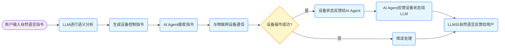

# AI Agent 在智能家居中的应用：LLM 控制物联网设备

> 关键词：AI Agent、智能家居、大语言模型（LLM）、物联网设备、设备控制

> 摘要：本文聚焦于 AI Agent 在智能家居领域的应用，详细探讨了如何利用大语言模型（LLM）实现对物联网设备的控制。首先介绍了相关背景知识，包括目的、预期读者、文档结构和术语表。接着阐述了核心概念及其联系，给出了原理和架构的文本示意图与 Mermaid 流程图。深入讲解了核心算法原理和具体操作步骤，并结合 Python 源代码进行说明。同时，对数学模型和公式进行了详细讲解与举例。通过项目实战，展示了代码实际案例并进行详细解释。分析了实际应用场景，推荐了相关工具和资源，包括学习资源、开发工具框架和论文著作。最后总结了未来发展趋势与挑战，还提供了常见问题解答和扩展阅读参考资料，旨在为相关领域的研究和实践提供全面的指导。

## 1. 背景介绍 
### 1.1 目的和范围
随着人工智能和物联网技术的飞速发展，智能家居逐渐成为人们生活中的一部分。AI Agent 和大语言模型（LLM）的出现为智能家居的控制带来了新的可能性。本文的目的是深入探讨如何利用 AI Agent 和 LLM 实现对智能家居中物联网设备的有效控制。范围涵盖了相关核心概念的介绍、算法原理的讲解、实际项目的实现、应用场景的分析以及工具资源的推荐等方面。

### 1.2 预期读者
本文预期读者包括智能家居领域的开发者、人工智能研究者、对智能家居技术感兴趣的技术爱好者以及相关专业的学生。这些读者希望了解如何将 AI Agent 和 LLM 应用于智能家居设备控制，掌握相关技术的原理和实现方法。

### 1.3 文档结构概述
本文将按照以下结构进行组织：首先介绍背景知识，让读者对相关概念和研究目的有初步了解；接着阐述核心概念与联系，包括原理和架构的说明；然后详细讲解核心算法原理和具体操作步骤，并结合 Python 代码；之后介绍数学模型和公式；通过项目实战展示代码案例并进行分析；分析实际应用场景；推荐相关工具和资源；总结未来发展趋势与挑战；提供常见问题解答和扩展阅读参考资料。

### 1.4 术语表
#### 1.4.1 核心术语定义
- **AI Agent**：人工智能代理，是一种能够感知环境、根据感知信息进行决策并采取行动的实体。在智能家居中，AI Agent 可以感知设备状态和用户需求，做出相应的控制决策。
- **大语言模型（LLM）**：是一种基于深度学习的语言模型，具有强大的语言理解和生成能力。可以处理自然语言输入，理解用户的意图，并生成相应的指令。
- **物联网设备**：通过网络连接的设备，能够收集和传输数据，并且可以接受外部指令进行控制。在智能家居中，常见的物联网设备包括智能灯泡、智能门锁、智能空调等。

#### 1.4.2 相关概念解释
- **智能家居**：利用先进的计算机技术、网络通信技术、综合布线技术，将与家居生活有关的各种子系统有机地结合在一起，通过统筹管理，让家居生活更加舒适、安全、有效。
- **自然语言处理（NLP）**：是人工智能的一个重要领域，研究如何让计算机理解和处理人类语言。在本文中，NLP 技术用于 LLM 对用户自然语言指令的理解。

#### 1.4.3 缩略词列表
- **AI**：Artificial Intelligence，人工智能
- **LLM**：Large Language Model，大语言模型
- **IoT**：Internet of Things，物联网
- **NLP**：Natural Language Processing，自然语言处理

## 2. 核心概念与联系 

### 核心概念原理
在智能家居中使用 AI Agent 通过 LLM 控制物联网设备的核心原理是将自然语言交互引入到设备控制中。用户使用自然语言表达对设备的控制需求，LLM 接收并理解这些自然语言指令，将其转化为计算机可理解的操作指令。AI Agent 根据这些指令与物联网设备进行通信，实现对设备的控制。

### 架构的文本示意图
用户通过语音或文本输入自然语言指令，指令首先被发送到 LLM。LLM 对指令进行语义分析，理解用户的意图，并生成相应的设备控制指令。AI Agent 接收这些控制指令，根据设备的通信协议和接口，与物联网设备进行通信，发送控制信号。物联网设备接收到信号后执行相应的操作，并将设备状态反馈给 AI Agent。AI Agent 可以将设备状态信息反馈给 LLM，LLM 再将信息以自然语言的形式反馈给用户。

### Mermaid 流程图


## 3. 核心算法原理 & 具体操作步骤 

### 核心算法原理
#### 自然语言理解算法
在 LLM 中，通常使用基于深度学习的自然语言理解算法，如 Transformer 架构。Transformer 架构通过自注意力机制能够捕捉输入文本中的长距离依赖关系，从而更好地理解文本的语义。其核心思想是计算输入序列中每个位置与其他位置的相关性，根据相关性对输入进行加权求和，得到每个位置的表示。

#### 设备控制指令生成算法
根据自然语言理解的结果，LLM 需要生成具体的设备控制指令。这可以通过预定义的规则或基于机器学习的方法实现。预定义规则是根据常见的用户指令和设备操作类型，定义一系列的映射关系。机器学习方法则是通过大量的训练数据，让模型学习自然语言指令与设备控制指令之间的映射。

### 具体操作步骤
#### 步骤 1：用户输入自然语言指令
用户可以通过语音或文本的方式输入对物联网设备的控制指令，如“打开客厅的灯”。

#### 步骤 2：LLM 进行语义分析
LLM 接收用户输入的指令，对其进行分词、词性标注、句法分析等操作，提取关键信息，理解用户的意图。

#### 步骤 3：生成设备控制指令
根据语义分析的结果，LLM 生成具体的设备控制指令，如“向客厅的智能灯泡发送打开指令”。

#### 步骤 4：AI Agent 接收指令
AI Agent 从 LLM 接收生成的设备控制指令。

#### 步骤 5：与物联网设备通信
AI Agent 根据设备的通信协议和接口，与物联网设备进行通信，发送控制指令。

#### 步骤 6：设备操作与状态反馈
物联网设备接收到控制指令后执行相应的操作，并将设备状态反馈给 AI Agent。

#### 步骤 7：反馈给用户
AI Agent 将设备状态信息反馈给 LLM，LLM 以自然语言的形式将信息反馈给用户。

### Python 源代码详细阐述
```python
import requests
import json

# 模拟 LLM 进行语义分析和指令生成
def llm_process(user_input):
    # 这里简单模拟，实际需要使用真实的 LLM 模型
    if "打开客厅的灯" in user_input:
        return {"device": "living_room_light", "action": "turn_on"}
    elif "关闭卧室的空调" in user_input:
        return {"device": "bedroom_air_conditioner", "action": "turn_off"}
    else:
        return None

# AI Agent 与物联网设备通信
def ai_agent_communicate(control_instruction):
    if control_instruction is None:
        return "未识别的指令"
    device = control_instruction["device"]
    action = control_instruction["action"]
    # 模拟与物联网设备通信的 API 请求
    url = f"http://iot_device_api/{device}/{action}"
    try:
        response = requests.get(url)
        if response.status_code == 200:
            result = response.json()
            return result.get("status", "操作失败")
        else:
            return f"通信错误: {response.status_code}"
    except requests.RequestException as e:
        return f"请求异常: {e}"

# 主函数
def main():
    user_input = input("请输入设备控制指令: ")
    control_instruction = llm_process(user_input)
    result = ai_agent_communicate(control_instruction)
    print(f"操作结果: {result}")

if __name__ == "__main__":
    main()
```

在上述代码中，`llm_process` 函数模拟了 LLM 的语义分析和指令生成过程。`ai_agent_communicate` 函数模拟了 AI Agent 与物联网设备的通信过程。主函数接收用户输入，调用 `llm_process` 函数生成控制指令，再调用 `ai_agent_communicate` 函数进行设备通信，并输出操作结果。

## 4. 数学模型和公式 & 详细讲解 & 举例说明 

### 自然语言处理中的注意力机制公式
在 Transformer 架构中，注意力机制的核心公式如下：

$$Attention(Q, K, V) = softmax(\frac{QK^T}{\sqrt{d_k}})V$$

其中，$Q$ 是查询矩阵，$K$ 是键矩阵，$V$ 是值矩阵，$d_k$ 是键向量的维度。

### 详细讲解
- **查询（Query）、键（Key）和值（Value）**：在自然语言处理中，输入序列中的每个词都可以表示为一个向量。$Q$、$K$ 和 $V$ 分别是由输入序列的词向量通过线性变换得到的矩阵。
- **相似度计算**：$QK^T$ 计算了查询向量与键向量之间的相似度。$\frac{QK^T}{\sqrt{d_k}}$ 是为了防止相似度值过大，导致 softmax 函数的梯度消失。
- **注意力权重**：$softmax(\frac{QK^T}{\sqrt{d_k}})$ 对相似度进行归一化，得到每个位置的注意力权重。
- **加权求和**：最后将注意力权重与值矩阵 $V$ 相乘，得到每个位置的加权表示。

### 举例说明
假设输入序列为 "打开 客厅 的 灯"，每个词的向量维度为 128，即 $d_k = 128$。经过线性变换得到 $Q$、$K$ 和 $V$ 矩阵，维度分别为 $[4, 128]$、$[4, 128]$ 和 $[4, 128]$。计算 $QK^T$ 得到一个 $[4, 4]$ 的相似度矩阵，对其进行缩放和 softmax 操作得到注意力权重矩阵。最后将注意力权重矩阵与 $V$ 矩阵相乘，得到每个词的加权表示。

### 设备控制指令生成的概率模型
在基于机器学习的设备控制指令生成方法中，可以使用概率模型。假设用户输入的自然语言指令为 $x$，生成的设备控制指令为 $y$，则可以建立条件概率模型 $P(y|x)$。通过大量的训练数据 $(x_i, y_i)$，可以使用最大似然估计来估计模型的参数。

### 详细讲解
- **条件概率**：$P(y|x)$ 表示在给定自然语言指令 $x$ 的情况下，生成设备控制指令 $y$ 的概率。
- **最大似然估计**：目标是找到一组参数 $\theta$，使得训练数据的似然函数 $L(\theta) = \prod_{i=1}^{n}P(y_i|x_i; \theta)$ 最大。通常使用对数似然函数 $l(\theta) = \sum_{i=1}^{n}\log P(y_i|x_i; \theta)$ 进行优化。

### 举例说明
假设训练数据中有以下样本：
- 输入指令 $x_1$：“打开客厅的灯”，生成指令 $y_1$：“向客厅的智能灯泡发送打开指令”
- 输入指令 $x_2$：“关闭卧室的空调”，生成指令 $y_2$：“向卧室的空调发送关闭指令”

通过训练概率模型 $P(y|x)$，可以学习到不同输入指令与生成指令之间的概率关系。当新的输入指令到来时，选择概率最大的生成指令作为输出。

## 5. 项目实战：代码实际案例和详细解释说明 

### 5.1  开发环境搭建
#### 硬件环境
- 物联网设备：可以选择一些常见的智能家居设备，如智能灯泡、智能插座等。确保设备支持网络通信，并且有开放的 API 接口。
- 服务器：可以使用云服务器或本地服务器，用于运行 AI Agent 和 LLM 模型。推荐使用配置较高的服务器，以保证系统的性能。

#### 软件环境
- 操作系统：推荐使用 Linux 系统，如 Ubuntu 或 CentOS。
- Python 环境：安装 Python 3.7 及以上版本。可以使用 Anaconda 来管理 Python 环境。
- 依赖库：安装必要的 Python 库，如 `requests` 用于网络请求，`transformers` 用于使用预训练的 LLM 模型。可以使用以下命令进行安装：
```bash
pip install requests transformers
```

### 5.2  源代码详细实现和代码解读
```python
import requests
from transformers import AutoTokenizer, AutoModelForCausalLM

# 加载预训练的 LLM 模型
tokenizer = AutoTokenizer.from_pretrained("gpt2")
model = AutoModelForCausalLM.from_pretrained("gpt2")

# 定义设备信息和 API 接口
device_info = {
    "living_room_light": {
        "api_url": "http://192.168.1.100/living_room_light",
        "actions": {
            "turn_on": "/turn_on",
            "turn_off": "/turn_off"
        }
    },
    "bedroom_air_conditioner": {
        "api_url": "http://192.168.1.101/bedroom_air_conditioner",
        "actions": {
            "turn_on": "/turn_on",
            "turn_off": "/turn_off",
            "set_temperature": "/set_temperature"
        }
    }
}

# LLM 进行语义分析和指令生成
def llm_process(user_input):
    input_ids = tokenizer.encode(user_input, return_tensors="pt")
    output = model.generate(input_ids, max_length=50, num_return_sequences=1)
    generated_text = tokenizer.decode(output[0], skip_special_tokens=True)
    # 简单解析生成的文本，提取设备和操作信息
    for device, info in device_info.items():
        for action in info["actions"]:
            if f"{device} {action}" in generated_text:
                return {"device": device, "action": action}
    return None

# AI Agent 与物联网设备通信
def ai_agent_communicate(control_instruction):
    if control_instruction is None:
        return "未识别的指令"
    device = control_instruction["device"]
    action = control_instruction["action"]
    api_url = device_info[device]["api_url"] + device_info[device]["actions"][action]
    try:
        response = requests.get(api_url)
        if response.status_code == 200:
            result = response.json()
            return result.get("status", "操作失败")
        else:
            return f"通信错误: {response.status_code}"
    except requests.RequestException as e:
        return f"请求异常: {e}"

# 主函数
def main():
    user_input = input("请输入设备控制指令: ")
    control_instruction = llm_process(user_input)
    result = ai_agent_communicate(control_instruction)
    print(f"操作结果: {result}")

if __name__ == "__main__":
    main()
```

### 代码解读
- **加载预训练的 LLM 模型**：使用 `transformers` 库加载预训练的 GPT-2 模型和对应的分词器。
- **定义设备信息和 API 接口**：`device_info` 字典中存储了物联网设备的信息，包括设备的 API 地址和支持的操作。
- **LLM 进行语义分析和指令生成**：`llm_process` 函数接收用户输入的自然语言指令，使用 LLM 模型生成文本，然后解析生成的文本，提取设备和操作信息。
- **AI Agent 与物联网设备通信**：`ai_agent_communicate` 函数根据设备和操作信息，构造 API 请求，与物联网设备进行通信，并返回操作结果。
- **主函数**：接收用户输入，调用 `llm_process` 函数生成控制指令，再调用 `ai_agent_communicate` 函数进行设备通信，并输出操作结果。

### 5.3  代码解读与分析
#### 优点
- **灵活性**：使用预训练的 LLM 模型可以处理各种自然语言指令，具有较高的灵活性。
- **可扩展性**：通过修改 `device_info` 字典，可以方便地添加新的物联网设备和操作。

#### 缺点
- **性能问题**：LLM 模型的计算量较大，可能会导致响应时间较长。
- **准确性问题**：LLM 模型生成的文本可能存在歧义，需要进一步的处理和解析。

#### 改进建议
- **模型优化**：可以选择更轻量级的 LLM 模型，或者对模型进行量化和剪枝，以提高性能。
- **规则增强**：结合预定义的规则和机器学习方法，提高指令生成的准确性。

## 6. 实际应用场景 
### 家庭自动化控制
用户可以使用自然语言指令控制家中的各种物联网设备，如打开或关闭灯光、调节空调温度、控制窗帘的开合等。例如，用户说“打开客厅的灯”，系统会自动控制客厅的智能灯泡亮起。

### 场景模式设置
用户可以通过自然语言设置不同的场景模式，如“睡眠模式”“阅读模式”等。系统会根据预设的规则，同时控制多个设备的状态。例如，设置“睡眠模式”后，系统会关闭客厅的灯，调暗卧室的灯光，将空调温度调整到合适的范围。

### 安全监控与报警
结合智能摄像头、门窗传感器等设备，用户可以使用自然语言查询家中的安全状况。当传感器检测到异常情况时，系统可以通过语音提示用户，并发送报警信息。例如，用户说“查看客厅的监控画面”，系统会将客厅的摄像头画面显示在手机或其他设备上。

### 能源管理
用户可以通过自然语言了解家中设备的能耗情况，并对设备进行节能控制。例如，用户说“查看冰箱的能耗”，系统会显示冰箱的能耗数据。用户还可以说“将空调温度调高 2 度”，以减少能源消耗。

## 7. 工具和资源推荐
### 7.1 学习资源推荐
#### 7.1.1 书籍推荐
- 《自然语言处理入门》：介绍了自然语言处理的基本概念、算法和技术，适合初学者入门。
- 《深度学习》：全面介绍了深度学习的理论和方法，包括神经网络、卷积神经网络、循环神经网络等。
- 《智能家居系统设计与实现》：详细介绍了智能家居系统的设计原理、架构和实现方法。

#### 7.1.2 在线课程
- Coursera 上的“Natural Language Processing Specialization”：由斯坦福大学教授授课，系统地介绍了自然语言处理的各个方面。
- edX 上的“Artificial Intelligence”：涵盖了人工智能的基本概念、算法和应用，包括机器学习、深度学习等。
- 网易云课堂上的“智能家居开发实战”：通过实际项目，介绍了智能家居系统的开发流程和技术。

#### 7.1.3 技术博客和网站
- Medium：有许多关于人工智能、自然语言处理和智能家居的技术文章。
- arXiv：提供了大量的学术论文，涵盖了最新的研究成果。
- 智能家居网：专注于智能家居领域的新闻、技术和产品信息。

### 7.2 开发工具框架推荐
#### 7.2.1 IDE和编辑器
- PyCharm：一款专业的 Python 集成开发环境，提供了丰富的代码编辑、调试和项目管理功能。
- Visual Studio Code：一款轻量级的代码编辑器，支持多种编程语言，有丰富的插件扩展。

#### 7.2.2 调试和性能分析工具
- PDB：Python 自带的调试器，可以帮助开发者定位代码中的问题。
- cProfile：Python 内置的性能分析工具，可以分析代码的运行时间和函数调用次数。

#### 7.2.3 相关框架和库
- Transformers：由 Hugging Face 开发的深度学习框架，提供了大量的预训练语言模型和工具，方便进行自然语言处理任务。
- Flask：一个轻量级的 Python Web 框架，适合用于开发物联网设备的 API 接口。
- MQTT：一种轻量级的消息传输协议，常用于物联网设备之间的通信。可以使用 Python 的 `paho-mqtt` 库进行开发。

### 7.3 相关论文著作推荐
#### 7.3.1 经典论文
- “Attention Is All You Need”：介绍了 Transformer 架构，是自然语言处理领域的经典论文。
- “BERT: Pre-training of Deep Bidirectional Transformers for Language Understanding”：提出了 BERT 模型，显著提升了自然语言处理任务的性能。

#### 7.3.2 最新研究成果
- 在 arXiv 上搜索“AI Agent in Smart Home”“LLM for IoT Device Control”等关键词，可以找到最新的研究论文。

#### 7.3.3 应用案例分析
- 一些学术会议和期刊上会发表智能家居领域的应用案例分析，如 ACM SIGKDD、IEEE Transactions on Smart Grid 等。

## 8. 总结：未来发展趋势与挑战
### 未来发展趋势
#### 更智能的交互体验
随着 LLM 技术的不断发展，系统将能够更好地理解用户的自然语言指令，提供更加智能、个性化的交互体验。例如，系统可以根据用户的习惯和偏好，自动调整设备的状态。

#### 多模态交互
除了自然语言交互，未来的智能家居系统可能会支持多模态交互，如手势识别、表情识别等。用户可以通过多种方式与系统进行交互，提高操作的便捷性。

#### 设备间的协同与融合
智能家居设备将越来越多地实现协同工作，不同品牌和类型的设备之间可以更好地进行互联互通。例如，智能门锁可以与智能摄像头、智能报警系统等设备进行联动，提高家庭的安全性。

#### 人工智能的深度融合
AI Agent 将在智能家居中发挥更加重要的作用，不仅可以实现设备控制，还可以进行数据分析、预测和决策。例如，根据用户的用电习惯和天气情况，自动调整空调的温度和风速，实现节能优化。

### 挑战
#### 安全性和隐私问题
智能家居系统涉及大量的用户隐私信息，如家庭的布局、设备的使用习惯等。如何保障系统的安全性和用户的隐私，是一个亟待解决的问题。

#### 设备兼容性问题
市场上的物联网设备品牌和型号繁多，不同设备的通信协议和接口标准不一致，导致设备之间的兼容性问题。需要建立统一的标准和协议，促进设备的互联互通。

#### 性能和可靠性问题
LLM 模型的计算量较大，对系统的性能要求较高。同时，智能家居系统需要保证长时间的稳定运行，如何提高系统的性能和可靠性是一个挑战。

#### 法律和伦理问题
随着人工智能在智能家居中的应用，可能会引发一系列的法律和伦理问题，如责任界定、数据所有权等。需要建立相应的法律和伦理规范，保障用户的合法权益。

## 9. 附录：常见问题与解答
### 问题 1：LLM 模型的选择有哪些考虑因素？
答：选择 LLM 模型时，需要考虑以下因素：
- **性能**：模型的计算量和推理速度，影响系统的响应时间。
- **准确性**：模型对自然语言的理解和生成能力，影响指令的生成准确性。
- **可扩展性**：模型是否支持微调，能否适应特定的应用场景。
- **开源性**：开源模型可以方便地进行定制和扩展。

### 问题 2：如何解决设备兼容性问题？
答：可以采取以下措施解决设备兼容性问题：
- **使用中间件**：通过中间件将不同设备的通信协议进行转换，实现设备之间的互联互通。
- **遵循标准协议**：鼓励设备厂商遵循统一的通信协议和接口标准，如 MQTT、HTTP 等。
- **开发适配器**：针对不同的设备，开发相应的适配器，实现与系统的对接。

### 问题 3：如何保障智能家居系统的安全性？
答：可以从以下几个方面保障智能家居系统的安全性：
- **数据加密**：对用户的隐私信息和设备通信数据进行加密处理，防止数据泄露。
- **访问控制**：设置严格的访问权限，只有授权的用户才能访问系统和设备。
- **安全审计**：对系统的操作和访问进行审计，及时发现和处理安全漏洞。
- **定期更新**：及时更新系统和设备的软件，修复已知的安全漏洞。

### 问题 4：如何提高系统的性能和可靠性？
答：可以采取以下措施提高系统的性能和可靠性：
- **优化模型**：选择轻量级的 LLM 模型，或者对模型进行量化和剪枝，减少计算量。
- **分布式计算**：采用分布式计算架构，将计算任务分配到多个节点上，提高系统的处理能力。
- **冗余设计**：对关键设备和服务进行冗余设计，当某个设备或服务出现故障时，能够自动切换到备用设备或服务。
- **监控和维护**：实时监控系统的运行状态，及时发现和处理异常情况，定期进行系统维护和优化。

## 10. 扩展阅读 & 参考资料
### 扩展阅读
- 《人工智能简史》：了解人工智能的发展历程和重要里程碑。
- 《物联网：技术、应用与标准》：深入学习物联网的技术原理、应用场景和标准规范。
- 《智能语音交互技术与应用》：专注于智能语音交互领域的技术和应用。

### 参考资料
- Hugging Face 官方文档：https://huggingface.co/docs
- Python 官方文档：https://docs.python.org/3/
- MQTT 官方文档：https://mqtt.org/documentation/

作者：AI天才研究院/AI Genius Institute & 禅与计算机程序设计艺术 /Zen And The Art of Computer Programming