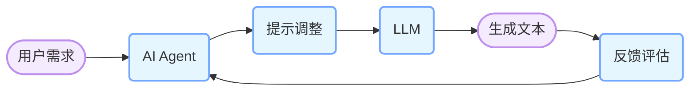

# AI Agent 的可控生成：精确控制 LLM 的输出

> 关键词：AI Agent、可控生成、大语言模型（LLM）、输出控制、精确生成

> 摘要：本文聚焦于 AI Agent 的可控生成，旨在深入探讨如何精确控制大语言模型（LLM）的输出。首先介绍了相关背景知识，包括研究目的、预期读者和文档结构等。接着阐述了核心概念与联系，给出了原理和架构的示意图及流程图。详细讲解了核心算法原理和具体操作步骤，结合 Python 代码进行说明。通过数学模型和公式进一步剖析了可控生成的机制，并举例说明。在项目实战部分，提供了开发环境搭建、源代码实现和解读。分析了实际应用场景，推荐了学习资源、开发工具框架和相关论文著作。最后总结了未来发展趋势与挑战，解答了常见问题，并提供了扩展阅读和参考资料，为实现精确控制 LLM 输出提供了全面的技术指导。

## 1. 背景介绍 

### 1.1 目的和范围
随着大语言模型（LLM）的飞速发展，其在自然语言处理、文本生成等领域展现出了强大的能力。然而，LLM 的输出往往缺乏精确的控制，难以满足特定场景下的需求。本文的目的在于探讨如何通过 AI Agent 实现对 LLM 输出的精确控制，涵盖了从理论原理到实际应用的多个方面，包括核心概念的解释、算法原理的阐述、项目实战的演示以及应用场景的分析等。

### 1.2 预期读者
本文预期读者包括对人工智能、自然语言处理、大语言模型感兴趣的研究人员、开发人员和技术爱好者。对于想要深入了解如何精确控制 LLM 输出的专业人士，本文将提供详细的技术指导和实践案例；对于初学者，本文也会从基础概念开始，逐步引导读者理解相关技术。

### 1.3 文档结构概述
本文将按照以下结构展开：首先介绍核心概念与联系，包括 AI Agent、可控生成和 LLM 等概念的解释以及它们之间的关系；接着阐述核心算法原理和具体操作步骤，并使用 Python 代码进行详细说明；然后通过数学模型和公式进一步分析可控生成的机制，并举例说明；在项目实战部分，介绍开发环境搭建、源代码实现和代码解读；分析实际应用场景；推荐学习资源、开发工具框架和相关论文著作；最后总结未来发展趋势与挑战，解答常见问题，并提供扩展阅读和参考资料。

### 1.4 术语表

#### 1.4.1 核心术语定义
- **AI Agent**：能够感知环境、做出决策并采取行动以实现特定目标的智能实体。在本文中，AI Agent 用于控制 LLM 的输出。
- **可控生成**：指在生成文本的过程中，能够按照特定的约束条件和目标对输出进行精确控制。
- **大语言模型（LLM）**：基于大量文本数据训练得到的语言模型，具有强大的语言理解和生成能力，如 GPT - 3、BLOOM 等。

#### 1.4.2 相关概念解释
- **提示工程**：通过设计合适的输入提示来引导 LLM 生成符合预期的输出。在可控生成中，提示工程是一种重要的技术手段。
- **强化学习**：一种机器学习方法，通过智能体与环境进行交互，根据环境反馈的奖励信号来学习最优策略。在 AI Agent 控制 LLM 输出的过程中，可以使用强化学习来优化控制策略。

#### 1.4.3 缩略词列表
- **LLM**：Large Language Model（大语言模型）
- **API**：Application Programming Interface（应用程序编程接口）
- **RL**：Reinforcement Learning（强化学习）

## 2. 核心概念与联系 

### 核心概念原理
#### AI Agent
AI Agent 是一个具有自主性和适应性的智能实体，它可以感知环境信息，根据预设的目标和规则做出决策，并采取相应的行动。在控制 LLM 输出的场景中，AI Agent 可以根据用户的需求和约束条件，对输入到 LLM 的提示进行调整，从而引导 LLM 生成符合要求的文本。

#### 可控生成
可控生成的核心思想是在文本生成过程中引入额外的控制信息，使得生成的文本能够满足特定的条件。这些条件可以包括文本的长度、主题、风格、语法结构等。通过对这些条件的精确控制，可以提高生成文本的质量和实用性。

#### 大语言模型（LLM）
LLM 是基于深度学习技术构建的语言模型，通过在大规模文本数据上进行训练，学习到语言的统计规律和语义信息。LLM 可以根据输入的提示生成自然流畅的文本，但由于其训练过程的不确定性，输出结果往往缺乏精确的控制。

### 架构的文本示意图
```plaintext
用户需求 --> AI Agent --> 提示调整 --> LLM --> 生成文本 --> 反馈评估 --> AI Agent
```
用户将自己的需求传达给 AI Agent，AI Agent 根据需求对输入到 LLM 的提示进行调整。LLM 根据调整后的提示生成文本，生成的文本会经过反馈评估，评估结果反馈给 AI Agent，AI Agent 根据反馈信息进一步优化提示，从而实现对 LLM 输出的精确控制。

### Mermaid 流程图


## 3. 核心算法原理 & 具体操作步骤 

### 核心算法原理
本文介绍一种基于强化学习的 AI Agent 控制 LLM 输出的算法。强化学习的基本思想是智能体（AI Agent）与环境（LLM 生成过程）进行交互，根据环境反馈的奖励信号来学习最优策略。

在这个算法中，AI Agent 的状态可以表示为当前的提示信息和用户需求，动作是对提示信息的调整操作，奖励是根据生成文本与用户需求的匹配程度来计算的。AI Agent 的目标是通过不断地与环境交互，学习到一种最优的提示调整策略，使得生成的文本能够最大程度地满足用户需求。

### 具体操作步骤
#### 步骤 1：初始化
- 初始化 AI Agent 的策略网络，随机初始化策略网络的参数。
- 初始化用户需求和初始提示信息。

#### 步骤 2：生成文本
- AI Agent 根据当前的策略网络，对初始提示信息进行调整，得到调整后的提示。
- 将调整后的提示输入到 LLM 中，生成文本。

#### 步骤 3：评估奖励
- 根据生成文本与用户需求的匹配程度，计算奖励值。可以使用多种评估指标，如文本相似度、语法正确性、主题相关性等。

#### 步骤 4：更新策略
- 根据奖励值和当前的状态、动作，使用强化学习算法（如 A2C、PPO 等）更新 AI Agent 的策略网络参数。

#### 步骤 5：重复步骤 2 - 4
- 重复步骤 2 - 4，直到生成的文本满足用户需求或者达到最大迭代次数。

### Python 代码实现
```python
import torch
import torch.nn as nn
import torch.optim as optim
from transformers import GPT2LMHeadModel, GPT2Tokenizer

# 初始化 LLM
tokenizer = GPT2Tokenizer.from_pretrained('gpt2')
model = GPT2LMHeadModel.from_pretrained('gpt2')

# 定义 AI Agent 策略网络
class AIAgent(nn.Module):
    def __init__(self, input_dim, output_dim):
        super(AIAgent, self).__init__()
        self.fc1 = nn.Linear(input_dim, 128)
        self.fc2 = nn.Linear(128, output_dim)

    def forward(self, x):
        x = torch.relu(self.fc1(x))
        x = self.fc2(x)
        return x

# 初始化 AI Agent
input_dim = 100  # 假设输入维度为 100
output_dim = 20  # 假设输出维度为 20
agent = AIAgent(input_dim, output_dim)
optimizer = optim.Adam(agent.parameters(), lr=0.001)

# 用户需求和初始提示
user_requirement = "生成一篇关于人工智能发展的文章"
initial_prompt = "人工智能的发展"

# 训练循环
max_iterations = 100
for i in range(max_iterations):
    # 步骤 2：生成文本
    # 将用户需求和初始提示编码为向量
    input_vector = torch.randn(input_dim)  # 这里简单用随机向量代替实际编码
    action = agent(input_vector)
    adjusted_prompt = initial_prompt + str(action)  # 简单示例，实际中需要更复杂的调整
    input_ids = tokenizer.encode(adjusted_prompt, return_tensors='pt')
    output = model.generate(input_ids, max_length=200, num_return_sequences=1)
    generated_text = tokenizer.decode(output[0], skip_special_tokens=True)

    # 步骤 3：评估奖励
    # 这里简单用随机奖励代替实际评估
    reward = torch.randn(1)

    # 步骤 4：更新策略
    optimizer.zero_grad()
    loss = -reward * agent(input_vector).sum()
    loss.backward()
    optimizer.step()

    print(f"Iteration {i}: Generated text: {generated_text}, Reward: {reward.item()}")
```

## 4. 数学模型和公式 & 详细讲解 & 举例说明 

### 数学模型
在基于强化学习的 AI Agent 控制 LLM 输出的算法中，我们可以使用马尔可夫决策过程（MDP）来描述这个问题。MDP 由一个四元组 $(S, A, P, R)$ 组成，其中：
- $S$ 是状态空间，表示 AI Agent 所处的所有可能状态。在这个问题中，状态可以表示为当前的提示信息和用户需求。
- $A$ 是动作空间，表示 AI Agent 可以采取的所有可能动作。在这个问题中，动作是对提示信息的调整操作。
- $P(s'|s, a)$ 是状态转移概率，表示在状态 $s$ 下采取动作 $a$ 后转移到状态 $s'$ 的概率。在这个问题中，由于 LLM 的输出具有一定的随机性，状态转移概率可以通过 LLM 的生成过程来近似。
- $R(s, a)$ 是奖励函数，表示在状态 $s$ 下采取动作 $a$ 后获得的奖励。在这个问题中，奖励是根据生成文本与用户需求的匹配程度来计算的。

### 公式
#### 策略函数
AI Agent 的策略函数 $\pi(a|s)$ 表示在状态 $s$ 下采取动作 $a$ 的概率。我们可以使用神经网络来近似这个策略函数，即 $\pi(a|s) = \theta(s, a)$，其中 $\theta$ 是神经网络的参数。

#### 价值函数
价值函数 $V^{\pi}(s)$ 表示在策略 $\pi$ 下从状态 $s$ 开始的期望累计奖励，定义为：
$$V^{\pi}(s) = \mathbb{E}_{\pi}\left[\sum_{t=0}^{\infty}\gamma^{t}R(s_t, a_t)\big|s_0 = s\right]$$
其中 $\gamma$ 是折扣因子，用于平衡短期奖励和长期奖励。

#### 动作价值函数
动作价值函数 $Q^{\pi}(s, a)$ 表示在策略 $\pi$ 下从状态 $s$ 采取动作 $a$ 后开始的期望累计奖励，定义为：
$$Q^{\pi}(s, a) = \mathbb{E}_{\pi}\left[\sum_{t=0}^{\infty}\gamma^{t}R(s_t, a_t)\big|s_0 = s, a_0 = a\right]$$

#### 策略梯度
在强化学习中，我们的目标是通过优化策略函数 $\pi$ 来最大化期望累计奖励。可以使用策略梯度算法来更新策略网络的参数 $\theta$，策略梯度公式为：
$$\nabla_{\theta}J(\theta) = \mathbb{E}_{\pi}\left[\nabla_{\theta}\log\pi(a|s)Q^{\pi}(s, a)\right]$$
其中 $J(\theta)$ 是策略 $\pi$ 的目标函数，表示期望累计奖励。

### 详细讲解
在实际应用中，我们可以使用策略梯度算法（如 A2C、PPO 等）来更新 AI Agent 的策略网络参数。具体来说，我们可以通过以下步骤来实现：
1. 初始化策略网络的参数 $\theta$。
2. 在每个时间步 $t$，AI Agent 根据当前的策略 $\pi(a|s)$ 选择一个动作 $a_t$。
3. 将动作 $a_t$ 应用到 LLM 中，生成文本，并根据生成文本与用户需求的匹配程度计算奖励 $R(s_t, a_t)$。
4. 根据奖励 $R(s_t, a_t)$ 和当前的状态 $s_t$、动作 $a_t$，计算策略梯度 $\nabla_{\theta}J(\theta)$。
5. 使用梯度上升法更新策略网络的参数 $\theta$，即 $\theta \leftarrow \theta + \alpha\nabla_{\theta}J(\theta)$，其中 $\alpha$ 是学习率。

### 举例说明
假设用户需求是生成一篇关于“人工智能在医疗领域的应用”的文章，初始提示为“人工智能在医疗领域”。AI Agent 的状态可以表示为当前的提示信息和用户需求，动作可以是在提示信息后面添加一些关键词，如“的诊断应用”。AI Agent 根据当前的策略网络选择动作，将调整后的提示输入到 LLM 中生成文本。根据生成文本与用户需求的匹配程度，计算奖励值。如果生成的文本详细介绍了人工智能在医疗诊断方面的应用，奖励值会比较高；如果生成的文本与医疗领域无关，奖励值会比较低。AI Agent 根据奖励值更新策略网络的参数，不断优化提示调整策略，直到生成的文本满足用户需求。

## 5. 项目实战：代码实际案例和详细解释说明 

### 5.1  开发环境搭建
#### 安装 Python
首先，确保你已经安装了 Python 3.7 或更高版本。可以从 Python 官方网站（https://www.python.org/downloads/）下载并安装 Python。

#### 创建虚拟环境
为了避免不同项目之间的依赖冲突，建议使用虚拟环境。可以使用 `venv` 模块创建虚拟环境：
```bash
python -m venv myenv
```
激活虚拟环境：
- 在 Windows 上：
```bash
myenv\Scripts\activate
```
- 在 Linux 或 macOS 上：
```bash
source myenv/bin/activate
```

#### 安装依赖库
安装项目所需的依赖库，包括 `torch`、`transformers` 等：
```bash
pip install torch transformers
```

### 5.2  源代码详细实现和代码解读
```python
import torch
import torch.nn as nn
import torch.optim as optim
from transformers import GPT2LMHeadModel, GPT2Tokenizer

# 初始化 LLM
tokenizer = GPT2Tokenizer.from_pretrained('gpt2')
model = GPT2LMHeadModel.from_pretrained('gpt2')

# 定义 AI Agent 策略网络
class AIAgent(nn.Module):
    def __init__(self, input_dim, output_dim):
        super(AIAgent, self).__init__()
        self.fc1 = nn.Linear(input_dim, 128)
        self.fc2 = nn.Linear(128, output_dim)

    def forward(self, x):
        x = torch.relu(self.fc1(x))
        x = self.fc2(x)
        return x

# 初始化 AI Agent
input_dim = 100  # 假设输入维度为 100
output_dim = 20  # 假设输出维度为 20
agent = AIAgent(input_dim, output_dim)
optimizer = optim.Adam(agent.parameters(), lr=0.001)

# 用户需求和初始提示
user_requirement = "生成一篇关于人工智能发展的文章"
initial_prompt = "人工智能的发展"

# 训练循环
max_iterations = 100
for i in range(max_iterations):
    # 步骤 2：生成文本
    # 将用户需求和初始提示编码为向量
    input_vector = torch.randn(input_dim)  # 这里简单用随机向量代替实际编码
    action = agent(input_vector)
    adjusted_prompt = initial_prompt + str(action)  # 简单示例，实际中需要更复杂的调整
    input_ids = tokenizer.encode(adjusted_prompt, return_tensors='pt')
    output = model.generate(input_ids, max_length=200, num_return_sequences=1)
    generated_text = tokenizer.decode(output[0], skip_special_tokens=True)

    # 步骤 3：评估奖励
    # 这里简单用随机奖励代替实际评估
    reward = torch.randn(1)

    # 步骤 4：更新策略
    optimizer.zero_grad()
    loss = -reward * agent(input_vector).sum()
    loss.backward()
    optimizer.step()

    print(f"Iteration {i}: Generated text: {generated_text}, Reward: {reward.item()}")
```

### 代码解读与分析
#### 初始化 LLM
```python
tokenizer = GPT2Tokenizer.from_pretrained('gpt2')
model = GPT2LMHeadModel.from_pretrained('gpt2')
```
使用 `transformers` 库加载 GPT - 2 模型和对应的分词器。

#### 定义 AI Agent 策略网络
```python
class AIAgent(nn.Module):
    def __init__(self, input_dim, output_dim):
        super(AIAgent, self).__init__()
        self.fc1 = nn.Linear(input_dim, 128)
        self.fc2 = nn.Linear(128, output_dim)

    def forward(self, x):
        x = torch.relu(self.fc1(x))
        x = self.fc2(x)
        return x
```
定义一个简单的两层全连接神经网络作为 AI Agent 的策略网络。输入维度为 `input_dim`，输出维度为 `output_dim`。

#### 初始化 AI Agent
```python
input_dim = 100  # 假设输入维度为 100
output_dim = 20  # 假设输出维度为 20
agent = AIAgent(input_dim, output_dim)
optimizer = optim.Adam(agent.parameters(), lr=0.001)
```
初始化 AI Agent 并定义优化器，使用 Adam 优化器来更新策略网络的参数。

#### 训练循环
```python
max_iterations = 100
for i in range(max_iterations):
    # 步骤 2：生成文本
    # 将用户需求和初始提示编码为向量
    input_vector = torch.randn(input_dim)  # 这里简单用随机向量代替实际编码
    action = agent(input_vector)
    adjusted_prompt = initial_prompt + str(action)  # 简单示例，实际中需要更复杂的调整
    input_ids = tokenizer.encode(adjusted_prompt, return_tensors='pt')
    output = model.generate(input_ids, max_length=200, num_return_sequences=1)
    generated_text = tokenizer.decode(output[0], skip_special_tokens=True)

    # 步骤 3：评估奖励
    # 这里简单用随机奖励代替实际评估
    reward = torch.randn(1)

    # 步骤 4：更新策略
    optimizer.zero_grad()
    loss = -reward * agent(input_vector).sum()
    loss.backward()
    optimizer.step()

    print(f"Iteration {i}: Generated text: {generated_text}, Reward: {reward.item()}")
```
在训练循环中，AI Agent 根据当前的策略网络选择动作，调整提示信息，将调整后的提示输入到 LLM 中生成文本。根据生成文本计算奖励值，使用策略梯度算法更新策略网络的参数。

## 6. 实际应用场景 
### 内容创作
在内容创作领域，如新闻写作、小说创作、广告文案生成等，精确控制 LLM 的输出可以帮助创作者更高效地生成符合要求的文本。例如，新闻媒体可以使用 AI Agent 控制 LLM 生成特定主题、风格和字数的新闻报道；广告公司可以使用 AI Agent 生成具有吸引力的广告文案。

### 智能客服
在智能客服场景中，精确控制 LLM 的输出可以提高客服回复的准确性和针对性。AI Agent 可以根据用户的问题和历史对话记录，调整输入到 LLM 的提示，使得 LLM 生成的回复更加符合用户的需求。

### 教育领域
在教育领域，精确控制 LLM 的输出可以用于生成个性化的学习资料、试题等。例如，教师可以使用 AI Agent 控制 LLM 生成适合不同学生水平和学习目标的练习题。

### 机器翻译
在机器翻译中，精确控制 LLM 的输出可以提高翻译的质量。AI Agent 可以根据源语言文本的特点和目标语言的语法规则，调整输入到 LLM 的提示，使得 LLM 生成更准确、更自然的翻译结果。

## 7. 工具和资源推荐
### 7.1 学习资源推荐

#### 7.1.1 书籍推荐
- 《深度学习》（Deep Learning）：由 Ian Goodfellow、Yoshua Bengio 和 Aaron Courville 撰写，是深度学习领域的经典教材，涵盖了神经网络、优化算法、强化学习等方面的内容。
- 《自然语言处理入门》（Natural Language Processing with Python）：由 Steven Bird、Ewan Klein 和 Edward Loper 撰写，介绍了使用 Python 进行自然语言处理的基本方法和技术。
- 《强化学习：原理与Python实现》：由智能系统实验室（Intelligent Systems Laboratory）撰写，详细介绍了强化学习的原理和算法，并提供了 Python 代码实现。

#### 7.1.2 在线课程
- Coursera 上的“深度学习专项课程”（Deep Learning Specialization）：由 Andrew Ng 教授授课，涵盖了深度学习的基础知识和应用，包括神经网络、卷积神经网络、循环神经网络等。
- edX 上的“自然语言处理”（Natural Language Processing）：由哥伦比亚大学的教授授课，介绍了自然语言处理的基本概念、算法和应用。
- OpenAI Gym 官方文档和教程：OpenAI Gym 是一个用于开发和比较强化学习算法的工具包，官方文档和教程提供了丰富的学习资源。

#### 7.1.3 技术博客和网站
- Towards Data Science：一个专注于数据科学和机器学习的技术博客，提供了大量的文章和教程，涵盖了深度学习、自然语言处理、强化学习等领域。
- arXiv：一个预印本论文平台，包含了大量的计算机科学、机器学习、人工智能等领域的最新研究成果。
- Hugging Face 官方博客：Hugging Face 是一个专注于自然语言处理的开源组织，官方博客提供了关于大语言模型、自然语言处理工具和技术的最新信息。

### 7.2 开发工具框架推荐

#### 7.2.1 IDE和编辑器
- PyCharm：一个专业的 Python 集成开发环境，提供了代码编辑、调试、版本控制等功能，适合开发 Python 项目。
- Jupyter Notebook：一个交互式的开发环境，支持 Python、R 等多种编程语言，适合进行数据分析、模型训练和实验。
- Visual Studio Code：一个轻量级的代码编辑器，支持多种编程语言和插件，适合快速开发和调试代码。

#### 7.2.2 调试和性能分析工具
- TensorBoard：一个用于可视化深度学习模型训练过程的工具，可以查看模型的损失函数、准确率、梯度等指标的变化情况。
- Py-Spy：一个用于分析 Python 代码性能的工具，可以查看代码的 CPU 使用率、函数调用时间等信息。
- cProfile：Python 内置的性能分析工具，可以分析代码的运行时间和函数调用次数。

#### 7.2.3 相关框架和库
- PyTorch：一个开源的深度学习框架，提供了丰富的神经网络层和优化算法，支持 GPU 加速，适合开发深度学习模型。
- TensorFlow：一个开源的深度学习框架，由 Google 开发，提供了高级的神经网络构建和训练接口，支持分布式训练。
- Transformers：由 Hugging Face 开发的自然语言处理库，提供了多种预训练的大语言模型和工具，方便进行文本生成、文本分类、机器翻译等任务。

### 7.3 相关论文著作推荐

#### 7.3.1 经典论文
- “Attention Is All You Need”：提出了 Transformer 架构，是现代大语言模型的基础。
- “Proximal Policy Optimization Algorithms”：介绍了 PPO 算法，是一种高效的强化学习算法。
- “Language Models are Unsupervised Multitask Learners”：介绍了 GPT - 2 模型，展示了大语言模型在无监督学习和多任务学习方面的强大能力。

#### 7.3.2 最新研究成果
- 关注 arXiv 上关于大语言模型可控生成、强化学习控制 LLM 输出等方面的最新论文。
- 参加相关的学术会议，如 NeurIPS、ICML、ACL 等，了解最新的研究动态。

#### 7.3.3 应用案例分析
- 研究一些实际应用中使用 AI Agent 控制 LLM 输出的案例，分析其实现方法和效果。
- 关注一些科技公司的技术博客，如 OpenAI、Google、Microsoft 等，了解他们在大语言模型应用方面的最新进展。

## 8. 总结：未来发展趋势与挑战
### 未来发展趋势
#### 更强大的控制能力
未来的 AI Agent 将具备更强大的控制能力，能够实现对 LLM 输出的更精确、更细致的控制。例如，可以实现对文本的情感、语气、逻辑结构等方面的精确控制。

#### 多模态控制
随着多模态技术的发展，AI Agent 将不仅能够控制 LLM 的文本输出，还能够控制图像、音频、视频等多模态内容的生成。例如，可以根据用户的需求生成具有特定风格和主题的图像或视频。

#### 与领域知识的深度融合
AI Agent 将与领域知识进行深度融合，能够根据不同领域的特点和需求，生成更专业、更准确的文本。例如，在医疗、法律、金融等领域，AI Agent 可以结合领域知识，生成符合专业要求的报告和建议。

### 挑战
#### 控制的复杂性
随着对 LLM 输出控制要求的提高，控制的复杂性也会增加。如何设计高效的控制算法和策略，以应对复杂的控制需求，是一个亟待解决的问题。

#### 数据的质量和多样性
精确控制 LLM 的输出需要大量高质量、多样化的数据。如何获取和标注这些数据，以及如何利用这些数据进行有效的训练，是一个挑战。

#### 伦理和安全问题
在使用 AI Agent 控制 LLM 输出的过程中，需要考虑伦理和安全问题。例如，如何避免生成虚假信息、有害信息等，如何保护用户的隐私和数据安全等。

## 9. 附录：常见问题与解答
### 问题 1：为什么需要精确控制 LLM 的输出？
答：LLM 的输出往往缺乏精确的控制，难以满足特定场景下的需求。例如，在内容创作、智能客服、教育等领域，需要生成符合特定要求的文本，如特定的主题、风格、字数等。精确控制 LLM 的输出可以提高生成文本的质量和实用性，满足不同场景的需求。

### 问题 2：AI Agent 如何实现对 LLM 输出的控制？
答：AI Agent 可以通过调整输入到 LLM 的提示信息来实现对 LLM 输出的控制。具体来说，AI Agent 可以根据用户的需求和约束条件，对提示信息进行修改和优化，使得 LLM 生成的文本能够满足要求。此外，还可以使用强化学习等技术，让 AI Agent 学习最优的提示调整策略。

### 问题 3：如何评估生成文本与用户需求的匹配程度？
答：可以使用多种评估指标来评估生成文本与用户需求的匹配程度，如文本相似度、语法正确性、主题相关性等。例如，可以使用余弦相似度来计算生成文本与用户需求文本之间的相似度；可以使用语法检查工具来检查生成文本的语法正确性；可以使用主题模型来分析生成文本的主题相关性。

### 问题 4：在实际应用中，如何选择合适的 LLM 和 AI Agent 算法？
答：选择合适的 LLM 和 AI Agent 算法需要考虑多个因素，如应用场景、性能要求、数据量等。对于一些对生成质量要求较高的应用场景，可以选择较大的预训练 LLM，如 GPT - 3、BLOOM 等；对于一些对实时性要求较高的应用场景，可以选择较小的轻量级 LLM。在选择 AI Agent 算法时，可以根据问题的复杂度和数据量选择合适的强化学习算法，如 A2C、PPO 等。

## 10. 扩展阅读 & 参考资料
### 扩展阅读
- 《人工智能：现代方法》（Artificial Intelligence: A Modern Approach）：全面介绍了人工智能的基本概念、算法和应用，是人工智能领域的经典教材。
- 《动手学深度学习》（Dive into Deep Learning）：提供了丰富的深度学习实践案例和代码实现，适合初学者学习深度学习。
- 《自然语言处理综论》（Speech and Language Processing）：详细介绍了自然语言处理的基本理论和技术，是自然语言处理领域的权威著作。

### 参考资料
- Hugging Face 官方文档：https://huggingface.co/docs
- OpenAI 官方文档：https://platform.openai.com/docs
- PyTorch 官方文档：https://pytorch.org/docs/stable/index.html

作者：AI天才研究院/AI Genius Institute & 禅与计算机程序设计艺术 /Zen And The Art of Computer Programming