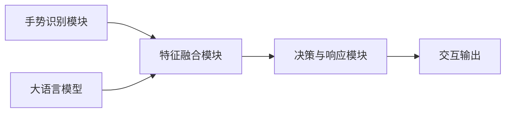

# AI Agent 的多模态交互：整合 LLM 与手势识别

> 关键词：AI Agent、多模态交互、大语言模型（LLM）、手势识别、人机交互

> 摘要：本文聚焦于 AI Agent 的多模态交互，深入探讨如何将大语言模型（LLM）与手势识别技术进行整合。通过详细介绍核心概念、算法原理、数学模型等内容，结合实际项目案例进行分析，阐述了这种整合在不同应用场景中的重要作用。同时，推荐了相关的学习资源、开发工具和研究论文，最后对未来发展趋势与挑战进行了总结，旨在为该领域的研究和实践提供全面且深入的参考。

## 1. 背景介绍 
### 1.1 目的和范围
随着人工智能技术的飞速发展，单一模态的交互方式已难以满足人们对高效、自然、智能交互的需求。AI Agent 的多模态交互成为研究热点，本文章的目的在于探讨如何将大语言模型（LLM）强大的语言理解和生成能力与手势识别技术相结合，实现更加自然和丰富的人机交互。范围涵盖了从核心概念的阐述、算法原理的剖析、数学模型的建立，到实际项目案例的分析以及未来发展趋势的展望。

### 1.2 预期读者
本文预期读者包括人工智能领域的研究人员、开发者、对人机交互技术感兴趣的学生以及相关行业的从业者。对于想要深入了解 AI Agent 多模态交互技术，特别是 LLM 与手势识别整合的读者具有较高的参考价值。

### 1.3 文档结构概述
本文首先介绍了相关的背景信息，包括目的、预期读者和文档结构。接着阐述了核心概念，包括 LLM、手势识别以及它们之间的联系，并给出了相应的示意图和流程图。然后详细讲解了核心算法原理和具体操作步骤，使用 Python 代码进行示例。随后介绍了数学模型和公式，并通过举例进行说明。之后通过实际项目案例，展示了代码的实现和解读。再探讨了该技术的实际应用场景，推荐了相关的工具和资源。最后对未来发展趋势与挑战进行总结，并提供了常见问题解答和扩展阅读参考资料。

### 1.4 术语表
#### 1.4.1 核心术语定义
- **AI Agent（人工智能代理）**：能够感知环境、进行决策并采取行动以实现特定目标的智能实体。
- **大语言模型（LLM）**：基于深度学习的大规模语言模型，能够处理和生成自然语言文本，具有强大的语言理解和生成能力。
- **手势识别**：通过计算机视觉等技术，对人体手势动作进行检测、分析和识别的过程。
- **多模态交互**：综合利用多种信息模态（如语言、手势、表情等）进行人机交互的方式。

#### 1.4.2 相关概念解释
- **人机交互（HCI）**：研究人与计算机之间交互方式的学科，旨在设计出更加自然、高效、舒适的交互界面和系统。
- **深度学习**：一种基于人工神经网络的机器学习方法，通过大量数据的训练，让模型自动学习数据中的特征和规律。

#### 1.4.3 缩略词列表
- **LLM**：Large Language Model（大语言模型）
- **HCI**：Human-Computer Interaction（人机交互）

## 2. 核心概念与联系 

### 核心概念原理
#### 大语言模型（LLM）
大语言模型是基于深度学习的神经网络模型，通常采用 Transformer 架构。它通过在大规模文本数据上进行预训练，学习到了丰富的语言知识和模式。在输入文本时，LLM 能够对文本进行理解，并根据上下文生成合理的回复。例如，OpenAI 的 GPT 系列模型就是典型的大语言模型，能够完成文本生成、问答、翻译等多种自然语言处理任务。

#### 手势识别
手势识别主要基于计算机视觉技术，通过摄像头等设备采集人体手势图像或视频数据。首先对数据进行预处理，如图像增强、归一化等，然后使用特征提取算法提取手势的特征，最后通过分类算法将提取的特征映射到具体的手势类别。常见的手势识别方法包括基于传统机器学习的方法和基于深度学习的方法，如卷积神经网络（CNN）在手势识别中取得了很好的效果。

### 架构的文本示意图
```plaintext
+----------------+       +----------------+
|   手势识别模块   | ----> |  特征融合模块  |
+----------------+       +----------------+
|   大语言模型    | ----> |  特征融合模块  |
+----------------+       +----------------+
                         |  决策与响应模块 |
                         +----------------+
                         |  交互输出      |
                         +----------------+
```

### Mermaid 流程图


在这个架构中，手势识别模块负责从输入的图像或视频中提取手势特征，大语言模型负责处理输入的文本信息。特征融合模块将手势特征和语言特征进行融合，为决策与响应模块提供更全面的信息。决策与响应模块根据融合后的特征做出决策，并生成相应的响应，最后通过交互输出模块将结果呈现给用户。

## 3. 核心算法原理 & 具体操作步骤 

### 手势识别算法原理及 Python 代码示例
手势识别可以使用基于卷积神经网络（CNN）的方法，以下是一个简单的基于 PyTorch 的手势识别代码示例：

```python
import torch
import torch.nn as nn
import torch.optim as optim
from torchvision import datasets, transforms
from torch.utils.data import DataLoader

# 定义 CNN 模型
class GestureCNN(nn.Module):
    def __init__(self):
        super(GestureCNN, self).__init__()
        self.conv1 = nn.Conv2d(3, 16, kernel_size=3, padding=1)
        self.relu1 = nn.ReLU()
        self.pool1 = nn.MaxPool2d(2)
        self.conv2 = nn.Conv2d(16, 32, kernel_size=3, padding=1)
        self.relu2 = nn.ReLU()
        self.pool2 = nn.MaxPool2d(2)
        self.fc1 = nn.Linear(32 * 8 * 8, 128)
        self.relu3 = nn.ReLU()
        self.fc2 = nn.Linear(128, 5)  # 假设 5 种手势类别

    def forward(self, x):
        x = self.pool1(self.relu1(self.conv1(x)))
        x = self.pool2(self.relu2(self.conv2(x)))
        x = x.view(-1, 32 * 8 * 8)
        x = self.relu3(self.fc1(x))
        x = self.fc2(x)
        return x

# 数据预处理
transform = transforms.Compose([
    transforms.Resize((32, 32)),
    transforms.ToTensor(),
    transforms.Normalize((0.5, 0.5, 0.5), (0.5, 0.5, 0.5))
])

# 加载数据集
train_dataset = datasets.ImageFolder(root='train_data', transform=transform)
train_loader = DataLoader(train_dataset, batch_size=32, shuffle=True)

# 初始化模型、损失函数和优化器
model = GestureCNN()
criterion = nn.CrossEntropyLoss()
optimizer = optim.Adam(model.parameters(), lr=0.001)

# 训练模型
num_epochs = 10
for epoch in range(num_epochs):
    running_loss = 0.0
    for i, (images, labels) in enumerate(train_loader):
        optimizer.zero_grad()
        outputs = model(images)
        loss = criterion(outputs, labels)
        loss.backward()
        optimizer.step()
        running_loss += loss.item()
    print(f'Epoch {epoch + 1}, Loss: {running_loss / len(train_loader)}')
```

### 大语言模型调用及与手势识别整合步骤
1. **大语言模型调用**：可以使用 OpenAI 的 API 来调用 GPT 模型，以下是一个简单的 Python 代码示例：

```python
import openai

openai.api_key = 'your_api_key'

def get_llm_response(prompt):
    response = openai.Completion.create(
        engine="text-davinci-003",
        prompt=prompt,
        max_tokens=100
    )
    return response.choices[0].text.strip()

```

2. **特征融合**：将手势识别模块输出的手势类别信息和大语言模型处理的文本信息进行融合。可以将手势类别转换为向量表示，然后与语言特征向量进行拼接。

```python
# 假设手势类别为一个整数，转换为 one-hot 向量
import numpy as np

def gesture_to_onehot(gesture_class, num_classes=5):
    onehot = np.zeros(num_classes)
    onehot[gesture_class] = 1
    return onehot

# 示例：将手势类别 2 转换为 one-hot 向量
gesture_class = 2
gesture_onehot = gesture_to_onehot(gesture_class)

# 假设大语言模型输出的语言特征向量
language_feature = np.random.rand(100)

# 特征融合
merged_feature = np.concatenate((gesture_onehot, language_feature))

```

3. **决策与响应生成**：根据融合后的特征，设计决策规则，生成相应的交互响应。例如，可以使用一个简单的分类器来根据融合特征判断用户的意图，并生成相应的回复。

```python
# 简单的决策函数示例
def make_decision(merged_feature):
    # 这里只是一个简单示例，实际中需要根据具体任务训练分类器
    if np.sum(merged_feature[:5]) > 0:
        return "检测到手势，有特殊操作"
    else:
        return "正常文本交互响应"

response = make_decision(merged_feature)
print(response)

```

## 4. 数学模型和公式 & 详细讲解 & 举例说明 

### 手势识别中的数学模型
在基于 CNN 的手势识别中，卷积层的数学模型可以用以下公式表示：

$$
y_{i,j}^l = f\left(\sum_{m = 0}^{M - 1}\sum_{n = 0}^{N - 1}w_{m,n}^l x_{i + m,j + n}^{l - 1}+b^l\right)
$$

其中，$y_{i,j}^l$ 是第 $l$ 层卷积层在位置 $(i, j)$ 的输出，$x_{i + m,j + n}^{l - 1}$ 是第 $l - 1$ 层的输入，$w_{m,n}^l$ 是卷积核的权重，$b^l$ 是偏置，$f$ 是激活函数（如 ReLU），$M$ 和 $N$ 是卷积核的大小。

例如，在我们的手势识别代码中，第一个卷积层 `self.conv1 = nn.Conv2d(3, 16, kernel_size=3, padding=1)`，这里输入通道数为 3（RGB 图像），输出通道数为 16，卷积核大小为 $3\times3$。对于输入图像中的每个 $3\times3$ 区域，会与卷积核进行卷积操作，得到一个输出值，经过激活函数处理后得到最终的输出。

### 大语言模型中的数学模型
大语言模型通常基于 Transformer 架构，Transformer 中的注意力机制是其核心部分。多头注意力机制的数学公式如下：

$$
\text{MultiHead}(Q, K, V)=\text{Concat}(\text{head}_1,\cdots,\text{head}_h)W^O
$$

其中，$\text{head}_i=\text{Attention}(QW_i^Q, KW_i^K, VW_i^V)$，$\text{Attention}(Q, K, V)=\text{softmax}\left(\frac{QK^T}{\sqrt{d_k}}\right)V$。

$Q$、$K$、$V$ 分别是查询、键、值矩阵，$W_i^Q$、$W_i^K$、$W_i^V$ 是投影矩阵，$d_k$ 是键向量的维度，$W^O$ 是输出投影矩阵。

例如，在处理输入文本时，大语言模型会将输入的词向量分别投影到查询、键、值空间，然后通过注意力机制计算每个词与其他词之间的关联程度，最后将多头注意力的结果进行拼接和投影得到最终的输出。

### 特征融合的数学模型
特征融合可以采用简单的拼接方式，假设手势特征向量为 $\mathbf{g}\in\mathbb{R}^{d_g}$，语言特征向量为 $\mathbf{l}\in\mathbb{R}^{d_l}$，则融合后的特征向量为：

$$
\mathbf{f}=\begin{bmatrix}\mathbf{g}\\\mathbf{l}\end{bmatrix}\in\mathbb{R}^{d_g + d_l}
$$

在我们的代码示例中，手势类别转换为 one-hot 向量 $\mathbf{g}$ （维度为 5），语言特征向量 $\mathbf{l}$ （维度为 100），融合后的特征向量 $\mathbf{f}$ 维度为 105。

## 5. 项目实战：代码实际案例和详细解释说明 

### 5.1  开发环境搭建
- **操作系统**：推荐使用 Ubuntu 20.04 或 Windows 10 等主流操作系统。
- **Python 环境**：安装 Python 3.8 及以上版本，可以使用 Anaconda 来管理 Python 环境。
- **深度学习框架**：安装 PyTorch 和相关依赖库，可以根据自己的 GPU 情况选择合适的 CUDA 版本进行安装。例如，在 Linux 系统上可以使用以下命令安装 PyTorch：

```bash
pip install torch torchvision torchaudio
```

- **OpenAI API**：如果要调用 OpenAI 的大语言模型，需要注册 OpenAI 账号并获取 API 密钥。

### 5.2  源代码详细实现和代码解读
以下是一个完整的项目代码示例，实现了手势识别与大语言模型的整合：

```python
import torch
import torch.nn as nn
import torch.optim as optim
from torchvision import datasets, transforms
from torch.utils.data import DataLoader
import openai
import numpy as np

# 定义 CNN 模型
class GestureCNN(nn.Module):
    def __init__(self):
        super(GestureCNN, self).__init__()
        self.conv1 = nn.Conv2d(3, 16, kernel_size=3, padding=1)
        self.relu1 = nn.ReLU()
        self.pool1 = nn.MaxPool2d(2)
        self.conv2 = nn.Conv2d(16, 32, kernel_size=3, padding=1)
        self.relu2 = nn.ReLU()
        self.pool2 = nn.MaxPool2d(2)
        self.fc1 = nn.Linear(32 * 8 * 8, 128)
        self.relu3 = nn.ReLU()
        self.fc2 = nn.Linear(128, 5)  # 假设 5 种手势类别

    def forward(self, x):
        x = self.pool1(self.relu1(self.conv1(x)))
        x = self.pool2(self.relu2(self.conv2(x)))
        x = x.view(-1, 32 * 8 * 8)
        x = self.relu3(self.fc1(x))
        x = self.fc2(x)
        return x

# 数据预处理
transform = transforms.Compose([
    transforms.Resize((32, 32)),
    transforms.ToTensor(),
    transforms.Normalize((0.5, 0.5, 0.5), (0.5, 0.5, 0.5))
])

# 加载数据集
train_dataset = datasets.ImageFolder(root='train_data', transform=transform)
train_loader = DataLoader(train_dataset, batch_size=32, shuffle=True)

# 初始化模型、损失函数和优化器
gesture_model = GestureCNN()
criterion = nn.CrossEntropyLoss()
optimizer = optim.Adam(gesture_model.parameters(), lr=0.001)

# 训练手势识别模型
num_epochs = 10
for epoch in range(num_epochs):
    running_loss = 0.0
    for i, (images, labels) in enumerate(train_loader):
        optimizer.zero_grad()
        outputs = gesture_model(images)
        loss = criterion(outputs, labels)
        loss.backward()
        optimizer.step()
        running_loss += loss.item()
    print(f'Epoch {epoch + 1}, Loss: {running_loss / len(train_loader)}')

# 设置 OpenAI API 密钥
openai.api_key = 'your_api_key'

def get_llm_response(prompt):
    response = openai.Completion.create(
        engine="text-davinci-003",
        prompt=prompt,
        max_tokens=100
    )
    return response.choices[0].text.strip()

def gesture_to_onehot(gesture_class, num_classes=5):
    onehot = np.zeros(num_classes)
    onehot[gesture_class] = 1
    return onehot

# 模拟输入
test_image = torch.randn(1, 3, 32, 32)  # 模拟一张测试图像
prompt = "请介绍一下人工智能"

# 手势识别
with torch.no_grad():
    gesture_output = gesture_model(test_image)
    _, predicted = torch.max(gesture_output.data, 1)
    gesture_class = predicted.item()

# 大语言模型响应
llm_response = get_llm_response(prompt)

# 特征融合
gesture_onehot = gesture_to_onehot(gesture_class)
language_feature = np.random.rand(100)  # 模拟语言特征
merged_feature = np.concatenate((gesture_onehot, language_feature))

# 决策与响应生成
def make_decision(merged_feature):
    if np.sum(merged_feature[:5]) > 0:
        return f"检测到手势 {gesture_class}，LLM 回复：{llm_response}"
    else:
        return f"正常文本交互，LLM 回复：{llm_response}"

response = make_decision(merged_feature)
print(response)

```

### 5.3  代码解读与分析
- **手势识别部分**：
  - 定义了一个简单的 CNN 模型 `GestureCNN`，包含两个卷积层、两个池化层和两个全连接层。
  - 对训练数据进行预处理，使用 `ImageFolder` 加载数据集，并使用 `DataLoader` 进行批量处理。
  - 使用交叉熵损失函数和 Adam 优化器对模型进行训练。
- **大语言模型部分**：
  - 定义了 `get_llm_response` 函数，使用 OpenAI API 调用 GPT 模型获取文本响应。
- **特征融合部分**：
  - 将手势识别的结果转换为 one-hot 向量，与模拟的语言特征向量进行拼接。
- **决策与响应生成部分**：
  - 定义了 `make_decision` 函数，根据融合后的特征判断是否检测到手势，并生成相应的响应。

## 6. 实际应用场景 
### 智能教育
在智能教育场景中，学生可以通过手势与 AI 教师进行交互。例如，学生举起手掌表示有问题要提问，AI 教师可以结合学生的手势和提出的问题，使用大语言模型给出更准确和详细的解答。同时，手势还可以用于控制教学内容的展示，如翻页、放大缩小等操作，提高学习的交互性和趣味性。

### 智能家居
在智能家居系统中，用户可以通过手势控制家电设备。例如，挥动手臂可以打开或关闭灯光，握拳可以调节空调的温度。同时，用户还可以通过语音与 AI 智能助手进行交互，AI 助手结合手势和语音信息，更准确地理解用户的需求，实现更加便捷的家居控制。

### 虚拟现实（VR）和增强现实（AR）
在 VR 和 AR 应用中，手势识别与大语言模型的整合可以提供更加自然和沉浸式的交互体验。用户可以通过手势与虚拟环境中的物体进行交互，如抓取、移动等操作，同时可以使用语音与虚拟角色进行对话。AI 代理可以根据用户的手势和语音信息，实时调整虚拟环境的内容和行为，增强用户的沉浸感。

### 医疗康复
在医疗康复领域，患者可以通过手势与康复训练设备进行交互。例如，患者做出特定的手势可以启动康复训练程序，调整训练强度等。同时，AI 医生可以结合患者的手势和语言描述，更准确地了解患者的康复情况，提供个性化的康复建议。

## 7. 工具和资源推荐
### 7.1 学习资源推荐
#### 7.1.1 书籍推荐
- 《深度学习》（Deep Learning）：Ian Goodfellow、Yoshua Bengio 和 Aaron Courville 所著，是深度学习领域的经典教材，详细介绍了深度学习的基本原理和方法。
- 《Python 深度学习》（Deep Learning with Python）：Francois Chollet 所著，结合 Keras 框架，介绍了如何使用 Python 进行深度学习开发。
- 《自然语言处理入门》：何晗所著，适合初学者入门自然语言处理领域，介绍了自然语言处理的基本概念和方法。

#### 7.1.2 在线课程
- Coursera 上的 “深度学习专项课程”（Deep Learning Specialization）：由 Andrew Ng 教授授课，涵盖了深度学习的各个方面，包括神经网络、卷积神经网络、循环神经网络等。
- edX 上的 “人工智能导论”（Introduction to Artificial Intelligence）：介绍了人工智能的基本概念、算法和应用。
- 哔哩哔哩（B 站）上有很多关于人工智能和深度学习的教程视频，如李宏毅老师的机器学习课程，讲解生动易懂。

#### 7.1.3 技术博客和网站
- Medium：上面有很多人工智能领域的优秀博客文章，涵盖了最新的研究成果和技术应用。
- arXiv：提供了大量的学术论文，是获取最新研究动态的重要来源。
- 机器之心：专注于人工智能领域的资讯和技术分享，有很多深度的技术文章和行业分析。

### 7.2 开发工具框架推荐
#### 7.2.1 IDE和编辑器
- PyCharm：是一款专门为 Python 开发设计的集成开发环境（IDE），具有强大的代码编辑、调试和项目管理功能。
- Jupyter Notebook：是一个交互式的开发环境，适合进行数据探索、模型开发和实验记录。
- Visual Studio Code：是一款轻量级的代码编辑器，支持多种编程语言，有丰富的插件可以扩展功能。

#### 7.2.2 调试和性能分析工具
- PyTorch Profiler：可以帮助用户分析 PyTorch 模型的性能瓶颈，找出耗时较长的操作。
- TensorBoard：是 TensorFlow 提供的可视化工具，也可以用于 PyTorch 模型的可视化和性能分析。
- cProfile：是 Python 内置的性能分析工具，可以分析 Python 代码的运行时间和函数调用情况。

#### 7.2.3 相关框架和库
- PyTorch：是一个开源的深度学习框架，具有动态图机制，方便模型的开发和调试。
- OpenCV：是一个强大的计算机视觉库，提供了丰富的图像处理和计算机视觉算法，可用于手势识别中的图像预处理和特征提取。
- Hugging Face Transformers：提供了大量预训练的大语言模型，方便用户进行自然语言处理任务的开发。

### 7.3 相关论文著作推荐
#### 7.3.1 经典论文
- “Attention Is All You Need”：提出了 Transformer 架构，是大语言模型的基础。
- “ImageNet Classification with Deep Convolutional Neural Networks”：介绍了 AlexNet 模型，开启了深度学习在计算机视觉领域的热潮。
- “Long Short-Term Memory”：介绍了长短期记忆网络（LSTM），解决了循环神经网络中的梯度消失问题。

#### 7.3.2 最新研究成果
- 可以关注 arXiv 上关于多模态交互、大语言模型和手势识别的最新论文，了解该领域的最新研究动态。
- 顶级学术会议如 NeurIPS、ICCV、ACL 等的论文也反映了该领域的前沿研究成果。

#### 7.3.3 应用案例分析
- 可以在 ACM Digital Library、IEEE Xplore 等数据库中搜索关于 AI Agent 多模态交互在不同应用场景中的案例分析论文，学习实际应用中的经验和方法。

## 8. 总结：未来发展趋势与挑战
### 未来发展趋势
- **更加自然和智能的交互**：随着技术的不断发展，AI Agent 的多模态交互将更加自然和智能。手势识别的准确率将不断提高，能够识别更加复杂和细微的手势动作。大语言模型将能够更好地理解上下文和语义，生成更加自然和流畅的回复。两者的结合将使交互更加接近人与人之间的交流方式。
- **跨领域融合**：AI Agent 的多模态交互将与其他领域进行更深入的融合，如医疗、教育、娱乐等。在医疗领域，结合手势识别和大语言模型可以实现更加智能的医疗诊断和康复训练；在教育领域，可以提供更加个性化的学习体验。
- **硬件设备的发展**：随着硬件技术的不断进步，手势识别设备将更加小型化、便携化和低成本化。例如，可穿戴设备如智能手表、智能眼镜等可以集成手势识别功能，为多模态交互提供更多的可能性。

### 挑战
- **数据融合与处理**：如何有效地融合手势识别数据和语言数据是一个挑战。两种数据的特征表示和分布不同，需要研究更加有效的特征融合方法，以提高交互的准确性和效率。
- **模型的可解释性**：大语言模型通常是黑盒模型，其决策过程难以解释。在多模态交互中，需要提高模型的可解释性，以便用户更好地理解 AI Agent 的决策依据，增强用户对系统的信任。
- **隐私和安全问题**：手势识别和语言交互涉及到用户的隐私信息，如何保护用户的隐私和数据安全是一个重要的问题。需要研究更加安全可靠的算法和技术，防止用户信息的泄露和滥用。

## 9. 附录：常见问题与解答
### 1. 手势识别的准确率受哪些因素影响？
手势识别的准确率受多种因素影响，包括光照条件、手势的速度和幅度、手势的姿态和角度、图像或视频的质量等。此外，数据集的质量和数量、模型的复杂度和训练方法也会对手势识别的准确率产生影响。

### 2. 如何选择合适的大语言模型？
选择合适的大语言模型需要考虑多个因素，如任务的需求、模型的性能、计算资源和成本等。如果任务对语言生成的质量要求较高，可以选择像 GPT 系列这样的大型模型；如果计算资源有限，可以选择一些轻量级的模型。同时，还需要考虑模型的许可证和使用限制。

### 3. 特征融合有哪些方法？
常见的特征融合方法包括拼接、加权求和、乘法融合等。拼接是将不同模态的特征向量直接拼接在一起；加权求和是给不同模态的特征向量分配不同的权重，然后进行求和；乘法融合是将不同模态的特征向量对应元素相乘。此外，还可以使用深度学习模型来学习特征融合的权重。

### 4. 如何提高多模态交互系统的实时性？
可以从以下几个方面提高多模态交互系统的实时性：优化模型结构，减少模型的计算量；使用高效的硬件设备，如 GPU 加速计算；采用并行计算技术，同时处理多个模态的数据；优化数据传输和处理流程，减少数据传输和处理的延迟。

## 10. 扩展阅读 & 参考资料
- 《多模态人机交互技术》：系统介绍了多模态人机交互的相关技术和方法。
- OpenAI 官方文档：提供了关于 GPT 模型的详细介绍和使用指南。
- PyTorch 官方文档：详细介绍了 PyTorch 框架的使用方法和 API。
- OpenCV 官方文档：提供了 OpenCV 库的详细文档和示例代码。

作者：AI天才研究院/AI Genius Institute & 禅与计算机程序设计艺术 /Zen And The Art of Computer Programming