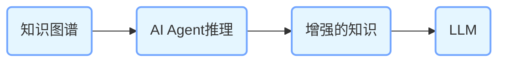

# AI Agent 的知识图谱推理：增强 LLM 的关系理解

> 关键词：AI Agent、知识图谱推理、大语言模型（LLM）、关系理解、知识表示

> 摘要：本文聚焦于 AI Agent 的知识图谱推理在增强大语言模型（LLM）关系理解方面的应用。首先介绍了相关背景，包括目的范围、预期读者等内容。接着阐述了核心概念与联系，通过文本示意图和 Mermaid 流程图直观呈现。详细讲解了核心算法原理，并使用 Python 代码进行具体操作步骤的阐述。同时给出了数学模型和公式，结合实例进行说明。在项目实战部分，从开发环境搭建到源代码实现及解读进行了详细介绍。还探讨了实际应用场景，推荐了学习、开发相关的工具和资源。最后总结了未来发展趋势与挑战，并提供常见问题解答和扩展阅读参考资料，旨在为读者全面深入地介绍如何利用知识图谱推理提升 LLM 的关系理解能力。

## 1. 背景介绍 
### 1.1 目的和范围
大语言模型（LLM）在自然语言处理领域取得了显著进展，但在理解复杂的实体关系和知识推理方面仍存在不足。知识图谱作为一种结构化的知识表示形式，能够清晰地展现实体之间的关系。本文章的目的是探讨如何利用 AI Agent 进行知识图谱推理，以增强 LLM 对关系的理解能力。范围涵盖了知识图谱推理的核心概念、算法原理、数学模型，以及实际项目中的应用和开发，同时介绍相关的工具和资源。

### 1.2 预期读者
本文预期读者包括自然语言处理领域的研究人员、人工智能开发者、对知识图谱和大语言模型感兴趣的技术爱好者。研究人员可以从本文中获取关于知识图谱推理与 LLM 结合的最新研究思路和方法；开发者可以学习到具体的算法实现和项目开发经验；技术爱好者能够了解相关领域的基本概念和应用场景。

### 1.3 文档结构概述
本文将按照以下结构展开：首先介绍背景知识，包括目的、读者和文档结构等。接着阐述核心概念与联系，通过示意图和流程图帮助读者理解。然后详细讲解核心算法原理和具体操作步骤，使用 Python 代码进行说明。之后给出数学模型和公式，并举例分析。在项目实战部分，介绍开发环境搭建、源代码实现和代码解读。再探讨实际应用场景，推荐相关工具和资源。最后总结未来发展趋势与挑战，提供常见问题解答和扩展阅读参考资料。

### 1.4 术语表
#### 1.4.1 核心术语定义
- **AI Agent**：一种能够感知环境、进行决策并采取行动的智能体，在本文中主要负责知识图谱推理相关的任务。
- **知识图谱**：一种用图结构来表示实体和实体之间关系的知识表示形式，通常由节点（实体）和边（关系）组成。
- **大语言模型（LLM）**：基于深度学习的大规模语言模型，如 GPT 系列、BERT 等，能够处理自然语言任务。
- **知识图谱推理**：根据知识图谱中已有的知识，推导出新的知识或关系的过程。
- **关系理解**：指模型对实体之间语义关系的理解和把握能力。

#### 1.4.2 相关概念解释
- **实体**：知识图谱中的具体对象，如人、地点、事物等。例如，在知识图谱中，“李白”“唐朝”“诗歌”都可以作为实体。
- **关系**：表示实体之间的联系，如“李白”和“唐朝”之间存在“所处朝代”的关系。
- **三元组**：知识图谱的基本组成单元，由头实体、关系和尾实体组成，例如（李白，所处朝代，唐朝）。

#### 1.4.3 缩略词列表
- **LLM**：Large Language Model（大语言模型）
- **KG**：Knowledge Graph（知识图谱）

## 2. 核心概念与联系 

### 核心概念原理
知识图谱推理的核心原理是利用知识图谱中已有的知识来推断未知的知识。例如，已知（A，是朋友，B）和（B，是朋友，C），可以推断出（A，可能认识，C）。通过这种推理，可以丰富知识图谱的内容，同时为 LLM 提供更准确的关系信息。

LLM 虽然能够生成自然语言文本，但对于一些复杂的关系理解可能不够准确。知识图谱推理可以为 LLM 提供结构化的知识支持，帮助 LLM 更好地理解实体之间的关系。例如，在回答“李白的诗歌风格受到哪些朝代的影响”这个问题时，知识图谱可以提供李白所处朝代以及当时的文化背景等信息，辅助 LLM 给出更准确的答案。

### 文本示意图
```plaintext
+----------------+        +----------------+
|    知识图谱    | -----> |  AI Agent推理  |
+----------------+        +----------------+
                          |                |
                          +------+---------+
                                 |
                                 v
+----------------+        +----------------+
|   增强的知识   | -----> |    LLM         |
+----------------+        +----------------+
```

### Mermaid 流程图


## 3. 核心算法原理 & 具体操作步骤 

### 核心算法原理
常见的知识图谱推理算法包括基于规则的推理和基于嵌入的推理。

#### 基于规则的推理
基于规则的推理是根据预先定义的规则来进行推理。例如，定义规则“如果（A，是父亲，B）且（B，是父亲，C），那么（A，是祖父，C）”。当知识图谱中存在（A，是父亲，B）和（B，是父亲，C）这两个三元组时，就可以根据规则推导出（A，是祖父，C）。

#### 基于嵌入的推理
基于嵌入的推理是将知识图谱中的实体和关系映射到低维向量空间中，通过向量运算来进行推理。例如，使用 TransE 算法，将实体和关系表示为向量，对于三元组（h，r，t），要求 $h + r \approx t$。如果给定一个头实体 $h$ 和关系 $r$，可以通过计算向量 $h + r$ 来预测尾实体 $t$。

### 具体操作步骤（以 TransE 算法为例）
#### 步骤 1：数据准备
首先需要准备知识图谱的三元组数据，将其划分为训练集、验证集和测试集。

```python
import numpy as np

# 假设三元组数据存储在一个列表中，每个元素是一个三元组 (h, r, t)
triples = [('entity1', 'relation1', 'entity2'), ('entity2', 'relation2', 'entity3')]

# 构建实体和关系的索引
entities = set()
relations = set()
for h, r, t in triples:
    entities.add(h)
    entities.add(t)
    relations.add(r)

entity_to_id = {entity: idx for idx, entity in enumerate(entities)}
relation_to_id = {relation: idx for idx, relation in enumerate(relations)}

# 将三元组转换为索引形式
triple_ids = [(entity_to_id[h], relation_to_id[r], entity_to_id[t]) for h, r, t in triples]

# 划分训练集、验证集和测试集
np.random.shuffle(triple_ids)
train_size = int(0.8 * len(triple_ids))
valid_size = int(0.1 * len(triple_ids))
train_triples = triple_ids[:train_size]
valid_triples = triple_ids[train_size:train_size + valid_size]
test_triples = triple_ids[train_size + valid_size:]
```

#### 步骤 2：模型初始化
初始化实体和关系的嵌入向量。

```python
import torch
import torch.nn as nn

# 嵌入维度
embedding_dim = 100

# 实体嵌入层
entity_embeddings = nn.Embedding(len(entities), embedding_dim)
# 关系嵌入层
relation_embeddings = nn.Embedding(len(relations), embedding_dim)

# 初始化嵌入向量
nn.init.xavier_uniform_(entity_embeddings.weight)
nn.init.xavier_uniform_(relation_embeddings.weight)
```

#### 步骤 3：模型训练
定义损失函数和优化器，进行模型训练。

```python
import torch.optim as optim

# 定义损失函数
criterion = nn.MarginRankingLoss(margin=1.0)

# 定义优化器
optimizer = optim.Adam(list(entity_embeddings.parameters()) + list(relation_embeddings.parameters()), lr=0.001)

# 训练轮数
num_epochs = 100

for epoch in range(num_epochs):
    optimizer.zero_grad()
    
    # 随机选择一批正样本
    batch_size = 32
    indices = np.random.choice(len(train_triples), batch_size)
    batch_triples = [train_triples[i] for i in indices]
    
    # 生成负样本
    negative_triples = []
    for h, r, t in batch_triples:
        # 随机替换头实体或尾实体
        if np.random.rand() < 0.5:
            negative_h = np.random.choice(len(entities))
            negative_triples.append((negative_h, r, t))
        else:
            negative_t = np.random.choice(len(entities))
            negative_triples.append((h, r, negative_t))
    
    # 将三元组转换为张量
    pos_h = torch.tensor([h for h, _, _ in batch_triples], dtype=torch.long)
    pos_r = torch.tensor([r for _, r, _ in batch_triples], dtype=torch.long)
    pos_t = torch.tensor([t for _, _, t in batch_triples], dtype=torch.long)
    
    neg_h = torch.tensor([h for h, _, _ in negative_triples], dtype=torch.long)
    neg_r = torch.tensor([r for _, r, _ in negative_triples], dtype=torch.long)
    neg_t = torch.tensor([t for _, _, t in negative_triples], dtype=torch.long)
    
    # 计算正样本和负样本的得分
    pos_score = torch.norm(entity_embeddings(pos_h) + relation_embeddings(pos_r) - entity_embeddings(pos_t), p=1, dim=1)
    neg_score = torch.norm(entity_embeddings(neg_h) + relation_embeddings(neg_r) - entity_embeddings(neg_t), p=1, dim=1)
    
    # 计算损失
    y = torch.ones(batch_size, dtype=torch.float)
    loss = criterion(pos_score, neg_score, y)
    
    # 反向传播和优化
    loss.backward()
    optimizer.step()
    
    if (epoch + 1) % 10 == 0:
        print(f'Epoch {epoch + 1}/{num_epochs}, Loss: {loss.item()}')
```

#### 步骤 4：模型评估
使用测试集对模型进行评估。

```python
# 计算测试集的平均得分
test_scores = []
for h, r, t in test_triples:
    h_tensor = torch.tensor([h], dtype=torch.long)
    r_tensor = torch.tensor([r], dtype=torch.long)
    t_tensor = torch.tensor([t], dtype=torch.long)
    score = torch.norm(entity_embeddings(h_tensor) + relation_embeddings(r_tensor) - entity_embeddings(t_tensor), p=1).item()
    test_scores.append(score)

average_score = np.mean(test_scores)
print(f'Test Average Score: {average_score}')
```

## 4. 数学模型和公式 & 详细讲解 & 举例说明 

### 基于 TransE 算法的数学模型
TransE 算法的核心思想是将实体和关系表示为向量，对于一个三元组 $(h, r, t)$，要求 $h + r \approx t$。具体来说，定义一个能量函数 $d(h + r, t)$ 来衡量 $h + r$ 与 $t$ 之间的距离，通常使用 $L_1$ 或 $L_2$ 范数：

$$d(h + r, t) = \| h + r - t \|_p$$

其中 $p$ 通常取 1 或 2。

### 损失函数
为了训练模型，需要定义一个损失函数。TransE 使用的是基于间隔的损失函数（Margin-based Loss）：

$$L = \sum_{(h, r, t) \in S} \sum_{(h', r, t') \in S'} \left[ \gamma + d(h + r, t) - d(h' + r, t') \right]_+$$

其中 $S$ 是正样本集合，$S'$ 是负样本集合，$\gamma$ 是间隔参数，$[x]_+ = \max(0, x)$。

### 详细讲解
能量函数 $d(h + r, t)$ 越小，说明 $h + r$ 与 $t$ 越接近，即三元组 $(h, r, t)$ 越合理。损失函数的目的是让正样本的能量函数值尽可能小，负样本的能量函数值尽可能大，并且两者之间的差距要大于间隔 $\gamma$。

### 举例说明
假设知识图谱中有三元组（中国，首都，北京），实体“中国”的嵌入向量为 $h = [0.1, 0.2, 0.3]$，关系“首都”的嵌入向量为 $r = [0.4, 0.5, 0.6]$，实体“北京”的嵌入向量为 $t = [0.5, 0.7, 0.9]$。

计算能量函数 $d(h + r, t)$：

$$h + r = [0.1 + 0.4, 0.2 + 0.5, 0.3 + 0.6] = [0.5, 0.7, 0.9]$$

$$d(h + r, t) = \| [0.5, 0.7, 0.9] - [0.5, 0.7, 0.9] \|_1 = 0$$

这说明该三元组在模型中是非常合理的。如果生成一个负样本（中国，首都，上海），计算其能量函数值会比较大，从而在损失函数的作用下，模型会调整嵌入向量，使得正样本的能量函数值更小，负样本的能量函数值更大。

## 5. 项目实战：代码实际案例和详细解释说明 

### 5.1  开发环境搭建
#### 安装 Python
确保已经安装了 Python 3.6 及以上版本。可以从 Python 官方网站（https://www.python.org/downloads/） 下载并安装。

#### 安装必要的库
使用以下命令安装所需的库：
```bash
pip install torch numpy
```

### 5.2  源代码详细实现和代码解读
以下是一个完整的基于 TransE 算法的知识图谱推理代码示例：

```python
import numpy as np
import torch
import torch.nn as nn
import torch.optim as optim

# 数据准备
triples = [('entity1', 'relation1', 'entity2'), ('entity2', 'relation2', 'entity3')]

entities = set()
relations = set()
for h, r, t in triples:
    entities.add(h)
    entities.add(t)
    relations.add(r)

entity_to_id = {entity: idx for idx, entity in enumerate(entities)}
relation_to_id = {relation: idx for idx, relation in enumerate(relations)}

triple_ids = [(entity_to_id[h], relation_to_id[r], entity_to_id[t]) for h, r, t in triples]

np.random.shuffle(triple_ids)
train_size = int(0.8 * len(triple_ids))
valid_size = int(0.1 * len(triple_ids))
train_triples = triple_ids[:train_size]
valid_triples = triple_ids[train_size:train_size + valid_size]
test_triples = triple_ids[train_size + valid_size:]

# 模型初始化
embedding_dim = 100
entity_embeddings = nn.Embedding(len(entities), embedding_dim)
relation_embeddings = nn.Embedding(len(relations), embedding_dim)

nn.init.xavier_uniform_(entity_embeddings.weight)
nn.init.xavier_uniform_(relation_embeddings.weight)

# 定义损失函数和优化器
criterion = nn.MarginRankingLoss(margin=1.0)
optimizer = optim.Adam(list(entity_embeddings.parameters()) + list(relation_embeddings.parameters()), lr=0.001)

# 训练模型
num_epochs = 100
for epoch in range(num_epochs):
    optimizer.zero_grad()
    
    batch_size = 32
    indices = np.random.choice(len(train_triples), batch_size)
    batch_triples = [train_triples[i] for i in indices]
    
    negative_triples = []
    for h, r, t in batch_triples:
        if np.random.rand() < 0.5:
            negative_h = np.random.choice(len(entities))
            negative_triples.append((negative_h, r, t))
        else:
            negative_t = np.random.choice(len(entities))
            negative_triples.append((h, r, negative_t))
    
    pos_h = torch.tensor([h for h, _, _ in batch_triples], dtype=torch.long)
    pos_r = torch.tensor([r for _, r, _ in batch_triples], dtype=torch.long)
    pos_t = torch.tensor([t for _, _, t in batch_triples], dtype=torch.long)
    
    neg_h = torch.tensor([h for h, _, _ in negative_triples], dtype=torch.long)
    neg_r = torch.tensor([r for _, r, _ in negative_triples], dtype=torch.long)
    neg_t = torch.tensor([t for _, _, t in negative_triples], dtype=torch.long)
    
    pos_score = torch.norm(entity_embeddings(pos_h) + relation_embeddings(pos_r) - entity_embeddings(pos_t), p=1, dim=1)
    neg_score = torch.norm(entity_embeddings(neg_h) + relation_embeddings(neg_r) - entity_embeddings(neg_t), p=1, dim=1)
    
    y = torch.ones(batch_size, dtype=torch.float)
    loss = criterion(pos_score, neg_score, y)
    
    loss.backward()
    optimizer.step()
    
    if (epoch + 1) % 10 == 0:
        print(f'Epoch {epoch + 1}/{num_epochs}, Loss: {loss.item()}')

# 模型评估
test_scores = []
for h, r, t in test_triples:
    h_tensor = torch.tensor([h], dtype=torch.long)
    r_tensor = torch.tensor([r], dtype=torch.long)
    t_tensor = torch.tensor([t], dtype=torch.long)
    score = torch.norm(entity_embeddings(h_tensor) + relation_embeddings(r_tensor) - entity_embeddings(t_tensor), p=1).item()
    test_scores.append(score)

average_score = np.mean(test_scores)
print(f'Test Average Score: {average_score}')
```

### 代码解读与分析
#### 数据准备部分
- 首先，将三元组数据存储在列表 `triples` 中。
- 然后，构建实体和关系的索引，将实体和关系映射到唯一的整数 ID。
- 最后，将三元组转换为索引形式，并划分为训练集、验证集和测试集。

#### 模型初始化部分
- 使用 `nn.Embedding` 层初始化实体和关系的嵌入向量。
- 使用 `nn.init.xavier_uniform_` 函数对嵌入向量进行初始化，有助于模型的收敛。

#### 模型训练部分
- 定义损失函数 `nn.MarginRankingLoss` 和优化器 `optim.Adam`。
- 在每个训练轮次中，随机选择一批正样本，并生成相应的负样本。
- 计算正样本和负样本的得分，使用损失函数计算损失，并进行反向传播和优化。

#### 模型评估部分
- 使用测试集对模型进行评估，计算测试集的平均得分。得分越小，说明模型的性能越好。

## 6. 实际应用场景 
### 智能问答系统
在智能问答系统中，知识图谱推理可以帮助 LLM 更好地理解问题中的实体关系，从而给出更准确的答案。例如，当用户询问“牛顿和爱因斯坦在物理学领域的贡献有哪些异同”时，知识图谱可以提供牛顿和爱因斯坦的相关信息，包括他们的理论成果、所处时代等，辅助 LLM 进行分析和回答。

### 推荐系统
在推荐系统中，知识图谱推理可以挖掘用户和物品之间的潜在关系，提高推荐的准确性。例如，通过知识图谱可以了解用户的兴趣爱好、历史购买记录等信息，以及物品的属性和相关信息。利用知识图谱推理，可以发现用户可能感兴趣但尚未发现的物品，为用户提供更个性化的推荐。

### 信息检索
在信息检索中，知识图谱推理可以帮助搜索引擎更好地理解用户的查询意图，提高检索结果的相关性。例如，当用户搜索“唐朝诗人的代表作品”时，知识图谱可以提供唐朝诗人的信息以及他们的代表作品，搜索引擎可以根据这些信息进行更精准的检索。

### 医疗诊断
在医疗诊断中，知识图谱推理可以整合患者的症状、病史、检查结果等信息，以及医学知识和临床经验，辅助医生进行诊断和治疗决策。例如，通过知识图谱推理可以发现患者的症状与某种疾病之间的潜在联系，为医生提供参考。

## 7. 工具和资源推荐
### 7.1 学习资源推荐
#### 7.1.1 书籍推荐
- 《知识图谱：方法、实践与应用》：全面介绍了知识图谱的基本概念、构建方法、推理技术和应用案例，是学习知识图谱的经典书籍。
- 《深度学习》：由 Ian Goodfellow、Yoshua Bengio 和 Aaron Courville 编写，系统地介绍了深度学习的理论和方法，对于理解大语言模型和知识图谱推理的相关技术有很大帮助。

#### 7.1.2 在线课程
- Coursera 上的“Natural Language Processing Specialization”：由深度学习领域的知名学者授课，涵盖了自然语言处理的各个方面，包括知识图谱和大语言模型。
- edX 上的“Artificial Intelligence MicroMasters Program”：提供了人工智能领域的系统学习课程，包括知识图谱推理和大语言模型的相关内容。

#### 7.1.3 技术博客和网站
- Towards Data Science：一个专注于数据科学和人工智能的技术博客平台，上面有很多关于知识图谱和大语言模型的优秀文章。
- arXiv：一个预印本平台，提供了最新的学术研究成果，包括知识图谱推理和大语言模型的相关论文。

### 7.2 开发工具框架推荐
#### 7.2.1 IDE和编辑器
- PyCharm：一款专业的 Python 集成开发环境，提供了丰富的代码编辑、调试和项目管理功能，适合开发知识图谱推理和大语言模型相关的项目。
- Jupyter Notebook：一个交互式的开发环境，支持 Python 代码的编写、运行和可视化，非常适合进行实验和数据分析。

#### 7.2.2 调试和性能分析工具
- TensorBoard：一个用于可视化深度学习模型训练过程的工具，可以帮助开发者监控模型的损失函数、准确率等指标，进行模型调试和性能分析。
- Py-Spy：一个用于分析 Python 程序性能的工具，可以找出程序中的性能瓶颈，帮助开发者优化代码。

#### 7.2.3 相关框架和库
- PyTorch：一个开源的深度学习框架，提供了丰富的神经网络层和优化算法，适合开发知识图谱推理和大语言模型相关的模型。
- RDFLib：一个用于处理 RDF（Resource Description Framework）数据的 Python 库，RDF 是知识图谱的一种常用表示形式，RDFLib 可以帮助开发者进行知识图谱的构建和操作。

### 7.3 相关论文著作推荐
#### 7.3.1 经典论文
- “Translating Embeddings for Modeling Multi-relational Data”：提出了 TransE 算法，是知识图谱嵌入领域的经典论文。
- “Attention Is All You Need”：提出了 Transformer 架构，是大语言模型的基础，对自然语言处理领域产生了深远影响。

#### 7.3.2 最新研究成果
- 可以关注每年的 ACL（Association for Computational Linguistics）、EMNLP（Conference on Empirical Methods in Natural Language Processing）等自然语言处理领域的顶级会议，获取最新的研究成果。

#### 7.3.3 应用案例分析
- 一些企业和研究机构会发布关于知识图谱推理和大语言模型应用的案例分析报告，可以通过相关的技术博客和网站获取这些资料。

## 8. 总结：未来发展趋势与挑战
### 未来发展趋势
#### 融合多模态信息
未来的知识图谱推理和 LLM 可能会融合更多的模态信息，如图像、音频、视频等。通过多模态信息的融合，可以更全面地理解实体和关系，提高模型的性能和应用范围。

#### 强化学习与知识图谱推理的结合
强化学习可以为知识图谱推理提供一种新的学习机制，通过与环境的交互不断优化推理策略。将强化学习与知识图谱推理相结合，可以提高模型的自主学习能力和推理效率。

#### 知识图谱的动态更新和演化
随着时间的推移，知识图谱中的知识会不断更新和演化。未来的研究需要关注如何实现知识图谱的动态更新和演化，以保证知识的及时性和准确性。

### 挑战
#### 知识图谱的构建和维护成本高
知识图谱的构建需要大量的人力和物力投入，包括数据收集、清洗、标注等工作。同时，知识图谱的维护也需要不断更新和完善，成本较高。

#### 大语言模型的可解释性问题
大语言模型通常是基于深度学习的黑盒模型，其决策过程难以解释。在一些对可解释性要求较高的应用场景中，如医疗诊断、金融风险评估等，大语言模型的可解释性问题是一个亟待解决的挑战。

#### 数据隐私和安全问题
知识图谱和大语言模型需要处理大量的数据，其中可能包含用户的敏感信息。如何保护数据的隐私和安全，防止数据泄露和滥用，是一个重要的挑战。

## 9. 附录：常见问题与解答
### 问题 1：知识图谱推理和传统的规则推理有什么区别？
知识图谱推理不仅仅依赖于预先定义的规则，还可以利用知识图谱中丰富的知识和数据进行推理。传统的规则推理通常是基于固定的规则进行推理，灵活性较差。知识图谱推理可以通过机器学习和深度学习的方法，自动学习和发现新的推理规则，具有更强的适应性和扩展性。

### 问题 2：如何评估知识图谱推理模型的性能？
常见的评估指标包括准确率、召回率、F1 值等。准确率表示模型预测正确的三元组占所有预测三元组的比例；召回率表示模型预测正确的三元组占所有真实三元组的比例；F1 值是准确率和召回率的调和平均数。此外，还可以使用 Mean Rank（平均排名）和 Hits@k（排名前 k 的准确率）等指标来评估模型的性能。

### 问题 3：知识图谱推理对大语言模型的性能提升有多大？
知识图谱推理可以为大语言模型提供结构化的知识支持，帮助大语言模型更好地理解实体之间的关系，从而提高大语言模型在一些任务上的性能，如问答系统、信息检索等。具体的性能提升程度取决于知识图谱的质量和规模，以及推理算法的有效性。

## 10. 扩展阅读 & 参考资料
### 扩展阅读
- 《人工智能：现代方法》：全面介绍了人工智能的各个领域，包括知识表示、推理、机器学习等，对于深入理解知识图谱推理和大语言模型有很大帮助。
- 《图神经网络：基础、前沿与应用》：介绍了图神经网络的基本概念、算法和应用，知识图谱可以看作是一种图结构，图神经网络在知识图谱推理中有广泛的应用。

### 参考资料
- Bordes, A., Usunier, N., Garcia-Duran, A., Weston, J., & Yakhnenko, O. (2013). Translating embeddings for modeling multi-relational data. Advances in neural information processing systems.
- Vaswani, A., Shazeer, N., Parmar, N., Uszkoreit, J., Jones, L., Gomez, A. N.,... & Polosukhin, I. (2017). Attention is all you need. Advances in neural information processing systems.

作者：AI天才研究院/AI Genius Institute & 禅与计算机程序设计艺术 /Zen And The Art of Computer Programming