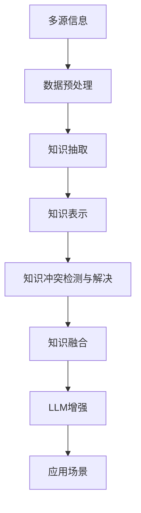

# AI Agent 的知识融合：整合多源信息增强 LLM

> 关键词：AI Agent、知识融合、多源信息、大语言模型（LLM）、信息整合

> 摘要：本文聚焦于 AI Agent 的知识融合，探讨如何通过整合多源信息来增强大语言模型（LLM）的能力。首先介绍了相关背景，包括目的范围、预期读者、文档结构和术语表。接着阐述了核心概念及其联系，给出了原理和架构的示意图与流程图。详细讲解了核心算法原理，用 Python 代码进行说明，并给出了数学模型和公式及举例。通过项目实战，展示了代码的实际案例及解读。分析了实际应用场景，推荐了学习资源、开发工具框架和相关论文著作。最后总结了未来发展趋势与挑战，提供了常见问题解答和扩展阅读参考资料，旨在为读者全面深入地理解 AI Agent 的知识融合提供帮助。

## 1. 背景介绍 
### 1.1 目的和范围
随着大语言模型（LLM）的广泛应用，其在知识储备和处理复杂任务方面的局限性逐渐显现。单一来源的知识往往无法满足多样化的需求，因此需要整合多源信息来增强 LLM 的能力。本文的目的是深入探讨 AI Agent 如何进行知识融合，通过整合不同来源的信息，提升 LLM 在各种应用场景下的性能和智能水平。

本文的范围涵盖了知识融合的核心概念、算法原理、数学模型、实际案例以及相关的工具和资源推荐。我们将从理论和实践两个层面进行分析，旨在为研究人员、开发者和从业者提供全面的指导。

### 1.2 预期读者
本文预期读者包括但不限于以下几类人群：
- **人工智能研究人员**：对知识融合和大语言模型的发展感兴趣，希望深入了解相关技术原理和最新研究成果。
- **软件开发人员**：想要将知识融合技术应用到实际项目中，提升软件系统的智能水平。
- **数据科学家**：关注数据处理和信息整合，探索如何利用多源数据增强模型的性能。
- **企业决策者**：希望了解知识融合技术对业务的潜在影响，为企业的数字化转型提供决策依据。

### 1.3 文档结构概述
本文的结构如下：
- **核心概念与联系**：介绍知识融合、AI Agent 和 LLM 的基本概念，以及它们之间的关系，并给出原理和架构的示意图与流程图。
- **核心算法原理 & 具体操作步骤**：详细讲解知识融合的核心算法，用 Python 代码进行说明。
- **数学模型和公式 & 详细讲解 & 举例说明**：给出知识融合的数学模型和公式，并通过具体例子进行解释。
- **项目实战：代码实际案例和详细解释说明**：通过一个实际项目，展示知识融合的具体实现过程，包括开发环境搭建、源代码实现和代码解读。
- **实际应用场景**：分析知识融合在不同领域的应用场景。
- **工具和资源推荐**：推荐相关的学习资源、开发工具框架和论文著作。
- **总结：未来发展趋势与挑战**：总结知识融合技术的发展趋势和面临的挑战。
- **附录：常见问题与解答**：解答读者在学习和实践过程中常见的问题。
- **扩展阅读 & 参考资料**：提供进一步学习和研究的参考资料。

### 1.4 术语表
#### 1.4.1 核心术语定义
- **AI Agent**：能够感知环境、做出决策并采取行动的智能实体，它可以与外界进行交互，完成各种任务。
- **知识融合**：将来自不同数据源的知识进行整合，消除冲突和冗余，形成统一、一致的知识表示。
- **大语言模型（LLM）**：基于大规模文本数据训练的语言模型，具有强大的语言理解和生成能力。
- **多源信息**：来自不同渠道、不同格式的信息，如文本、图像、音频等。

#### 1.4.2 相关概念解释
- **信息整合**：将不同来源的信息进行收集、整理和合并的过程，旨在提高信息的可用性和价值。
- **知识表示**：将知识以计算机能够理解和处理的方式进行表示，如符号表示、语义网络等。
- **数据清洗**：对原始数据进行预处理，去除噪声、错误和重复数据，提高数据质量。

#### 1.4.3 缩略词列表
- **LLM**：Large Language Model（大语言模型）
- **NLP**：Natural Language Processing（自然语言处理）
- **ML**：Machine Learning（机器学习）

## 2. 核心概念与联系 
### 核心概念原理
#### AI Agent
AI Agent 是一个具有自主性和适应性的智能实体，它能够感知环境中的信息，根据自身的目标和知识做出决策，并采取相应的行动。AI Agent 可以通过与外界的交互不断学习和进化，提高自己的性能和能力。

#### 知识融合
知识融合是将来自不同数据源的知识进行整合的过程。这些数据源可以是结构化的数据库、非结构化的文本、图像、音频等。知识融合的目标是消除不同数据源之间的冲突和冗余，形成统一、一致的知识表示，以便更好地支持决策和推理。

#### 大语言模型（LLM）
大语言模型是基于大规模文本数据训练的语言模型，它通过学习文本中的语言模式和语义信息，能够生成自然流畅的文本、回答问题、进行对话等。LLM 具有强大的语言理解和生成能力，但它的知识储备往往局限于训练数据，缺乏实时性和多源信息的融合。

### 架构的文本示意图
```plaintext
+-------------------+
|      AI Agent     |
|                   |
| +--------------+  |
| | Knowledge    |  |
| | Fusion Module|  |
| +--------------+  |
|                   |
| +--------------+  |
| | LLM Interface |  |
| +--------------+  |
|                   |
+-------------------+
|                   |
| +--------------+  |
| | Data Sources |  |
| | (Multi - Source)| |
| +--------------+  |
|                   |
+-------------------+
```
在这个架构中，AI Agent 作为核心，包含知识融合模块和 LLM 接口。知识融合模块负责整合来自多个数据源的信息，消除冲突和冗余。LLM 接口则将融合后的知识传递给大语言模型，以增强其性能。数据来源包括各种多源信息，如数据库、文本文件、网络资源等。

### Mermaid 流程图

这个流程图展示了知识融合的主要步骤。首先，对多源信息进行数据预处理，包括清洗、转换等操作。然后进行知识抽取，从预处理后的数据中提取有价值的知识。接着将抽取的知识进行表示，以便计算机能够处理。在知识融合过程中，需要检测和解决知识之间的冲突，最后将融合后的知识用于增强大语言模型，并应用到具体的场景中。

## 3. 核心算法原理 & 具体操作步骤 
### 核心算法原理
知识融合的核心算法主要包括以下几个方面：
- **数据预处理**：对多源信息进行清洗、转换和归一化处理，以提高数据质量。
- **知识抽取**：从预处理后的数据中提取有价值的知识，如实体、关系等。
- **知识表示**：将抽取的知识以计算机能够理解和处理的方式进行表示，如向量表示、图表示等。
- **知识冲突检测与解决**：检测不同数据源之间的知识冲突，并采用合适的方法进行解决。
- **知识融合**：将经过处理的知识进行整合，形成统一的知识表示。

### 具体操作步骤及 Python 代码实现
#### 数据预处理
数据预处理是知识融合的第一步，主要包括去除噪声、缺失值处理和数据归一化等操作。以下是一个简单的 Python 代码示例，用于处理文本数据：
```python
import re
import string

def preprocess_text(text):
    # 转换为小写
    text = text.lower()
    # 去除标点符号
    text = text.translate(str.maketrans('', '', string.punctuation))
    # 去除多余的空格
    text = re.sub(r'\s+', ' ', text).strip()
    return text

# 示例文本
text = "Hello, World! This is a sample text."
preprocessed_text = preprocess_text(text)
print(preprocessed_text)
```
#### 知识抽取
知识抽取是从文本中提取有价值的信息，如实体和关系。这里我们使用 `spaCy` 库进行实体抽取：
```python
import spacy

# 加载英文模型
nlp = spacy.load("en_core_web_sm")

def extract_entities(text):
    doc = nlp(text)
    entities = [(ent.text, ent.label_) for ent in doc.ents]
    return entities

# 示例文本
text = "Apple is a technology company based in California."
entities = extract_entities(text)
print(entities)
```
#### 知识表示
知识表示是将抽取的知识以向量形式表示，以便计算机能够处理。这里我们使用 `scikit-learn` 库的 `TfidfVectorizer` 进行文本的向量表示：
```python
from sklearn.feature_extraction.text import TfidfVectorizer

# 示例文本列表
corpus = [
    "This is the first document.",
    "This document is the second document.",
    "And this is the third one.",
    "Is this the first document?"
]

# 创建 TfidfVectorizer 对象
vectorizer = TfidfVectorizer()
# 计算 TF-IDF 向量
X = vectorizer.fit_transform(corpus)

# 输出向量表示
print(X.toarray())
```
#### 知识冲突检测与解决
知识冲突检测与解决是知识融合的关键步骤。以下是一个简单的示例，用于检测两个文本中实体的冲突：
```python
def detect_conflict(entities1, entities2):
    conflict = []
    for ent1 in entities1:
        for ent2 in entities2:
            if ent1[0] == ent2[0] and ent1[1]!= ent2[1]:
                conflict.append((ent1, ent2))
    return conflict

# 示例实体列表
entities1 = [("Apple", "ORG"), ("California", "GPE")]
entities2 = [("Apple", "PRODUCT"), ("California", "GPE")]

conflicts = detect_conflict(entities1, entities2)
print(conflicts)
```
#### 知识融合
知识融合是将处理后的知识进行整合。以下是一个简单的示例，将两个文本的实体进行融合：
```python
def merge_entities(entities1, entities2):
    merged_entities = entities1.copy()
    for ent2 in entities2:
        found = False
        for i, ent1 in enumerate(merged_entities):
            if ent1[0] == ent2[0]:
                # 这里可以根据具体规则选择合适的标签
                merged_entities[i] = (ent1[0], ent1[1])
                found = True
                break
        if not found:
            merged_entities.append(ent2)
    return merged_entities

# 示例实体列表
entities1 = [("Apple", "ORG"), ("California", "GPE")]
entities2 = [("Microsoft", "ORG"), ("California", "GPE")]

merged_entities = merge_entities(entities1, entities2)
print(merged_entities)
```

## 4. 数学模型和公式 & 详细讲解 & 举例说明 
### 向量空间模型
在知识表示中，向量空间模型是一种常用的方法。假设我们有一个文本集合 $D = \{d_1, d_2, \cdots, d_n\}$，其中每个文本 $d_i$ 可以表示为一个向量 $\mathbf{v}_i$。向量的每个维度对应一个词项，向量的值表示该词项在文本中的重要性。

#### TF-IDF 公式
TF-IDF（Term Frequency-Inverse Document Frequency）是一种常用的计算词项重要性的方法。TF 表示词项在文本中出现的频率，IDF 表示词项在整个文本集合中的稀有程度。

- **词频（TF）**：
$$TF_{t,d}=\frac{f_{t,d}}{\max\{f_{w,d}:w\in d\}}$$
其中，$f_{t,d}$ 表示词项 $t$ 在文本 $d$ 中出现的次数，$\max\{f_{w,d}:w\in d\}$ 表示文本 $d$ 中出现次数最多的词项的出现次数。

- **逆文档频率（IDF）**：
$$IDF_t=\log\frac{N}{df_t}$$
其中，$N$ 是文本集合中的文本总数，$df_t$ 是包含词项 $t$ 的文本数。

- **TF-IDF 值**：
$$TF - IDF_{t,d}=TF_{t,d}\times IDF_t$$

#### 举例说明
假设我们有以下文本集合：
- $d_1$: "This is a sample text."
- $d_2$: "This text is another sample."
- $d_3$: "And this is the third one."

我们来计算词项 "sample" 在文本 $d_1$ 中的 TF-IDF 值。

- 首先计算 TF：
在文本 $d_1$ 中，"sample" 出现了 1 次，出现次数最多的词项是 "is"，出现了 1 次，所以 $TF_{sample,d_1}=\frac{1}{1}=1$。

- 然后计算 IDF：
文本集合中共有 3 个文本，包含 "sample" 的文本有 2 个，所以 $IDF_{sample}=\log\frac{3}{2}\approx0.405$。

- 最后计算 TF-IDF：
$TF - IDF_{sample,d_1}=1\times0.405 = 0.405$。

### 余弦相似度
在知识融合中，我们经常需要计算两个向量之间的相似度。余弦相似度是一种常用的相似度度量方法，它通过计算两个向量之间的夹角余弦值来衡量它们的相似度。

#### 余弦相似度公式
对于两个向量 $\mathbf{v}_1$ 和 $\mathbf{v}_2$，它们的余弦相似度定义为：
$$\cos(\theta)=\frac{\mathbf{v}_1\cdot\mathbf{v}_2}{\|\mathbf{v}_1\|\|\mathbf{v}_2\|}$$
其中，$\mathbf{v}_1\cdot\mathbf{v}_2$ 是两个向量的点积，$\|\mathbf{v}_1\|$ 和 $\|\mathbf{v}_2\|$ 分别是两个向量的模。

#### 举例说明
假设我们有两个向量 $\mathbf{v}_1 = [1, 2, 3]$ 和 $\mathbf{v}_2 = [2, 4, 6]$。

- 计算点积：
$\mathbf{v}_1\cdot\mathbf{v}_2 = 1\times2 + 2\times4 + 3\times6 = 2 + 8 + 18 = 28$。

- 计算向量的模：
$\|\mathbf{v}_1\|=\sqrt{1^2 + 2^2 + 3^2}=\sqrt{1 + 4 + 9}=\sqrt{14}$
$\|\mathbf{v}_2\|=\sqrt{2^2 + 4^2 + 6^2}=\sqrt{4 + 16 + 36}=\sqrt{56}=2\sqrt{14}$

- 计算余弦相似度：
$\cos(\theta)=\frac{28}{\sqrt{14}\times2\sqrt{14}}=\frac{28}{2\times14}=1$

由于余弦相似度的值为 1，说明这两个向量是完全相似的。

## 5. 项目实战：代码实际案例和详细解释说明 
### 5.1  开发环境搭建
#### 安装 Python
首先，确保你已经安装了 Python 3.6 或更高版本。你可以从 Python 官方网站（https://www.python.org/downloads/）下载并安装。

#### 创建虚拟环境
为了避免不同项目之间的依赖冲突，建议使用虚拟环境。在命令行中执行以下命令创建并激活虚拟环境：
```bash
# 创建虚拟环境
python -m venv myenv

# 激活虚拟环境（Windows）
myenv\Scripts\activate

# 激活虚拟环境（Linux/Mac）
source myenv/bin/activate
```

#### 安装依赖库
在虚拟环境中安装所需的依赖库，包括 `spaCy`、`scikit-learn` 等：
```bash
pip install spacy scikit-learn
python -m spacy download en_core_web_sm
```

### 5.2  源代码详细实现和代码解读
#### 项目概述
我们将实现一个简单的知识融合系统，从两个文本文件中提取实体信息，并进行融合。

#### 源代码实现
```python
import spacy
from sklearn.feature_extraction.text import TfidfVectorizer

# 加载英文模型
nlp = spacy.load("en_core_web_sm")

def preprocess_text(text):
    # 转换为小写
    text = text.lower()
    # 去除标点符号
    import string
    text = text.translate(str.maketrans('', '', string.punctuation))
    # 去除多余的空格
    import re
    text = re.sub(r'\s+', ' ', text).strip()
    return text

def extract_entities(text):
    doc = nlp(text)
    entities = [(ent.text, ent.label_) for ent in doc.ents]
    return entities

def detect_conflict(entities1, entities2):
    conflict = []
    for ent1 in entities1:
        for ent2 in entities2:
            if ent1[0] == ent2[0] and ent1[1]!= ent2[1]:
                conflict.append((ent1, ent2))
    return conflict

def merge_entities(entities1, entities2):
    merged_entities = entities1.copy()
    for ent2 in entities2:
        found = False
        for i, ent1 in enumerate(merged_entities):
            if ent1[0] == ent2[0]:
                # 这里可以根据具体规则选择合适的标签
                merged_entities[i] = (ent1[0], ent1[1])
                found = True
                break
        if not found:
            merged_entities.append(ent2)
    return merged_entities

# 读取文本文件
with open('text1.txt', 'r', encoding='utf-8') as f1:
    text1 = f1.read()
with open('text2.txt', 'r', encoding='utf-8') as f2:
    text2 = f2.read()

# 预处理文本
preprocessed_text1 = preprocess_text(text1)
preprocessed_text2 = preprocess_text(text2)

# 提取实体
entities1 = extract_entities(preprocessed_text1)
entities2 = extract_entities(preprocessed_text2)

# 检测冲突
conflicts = detect_conflict(entities1, entities2)
print("Conflicts:", conflicts)

# 融合实体
merged_entities = merge_entities(entities1, entities2)
print("Merged Entities:", merged_entities)
```

#### 代码解读
1. **导入库**：导入 `spacy` 和 `scikit-learn` 库，用于实体抽取和文本处理。
2. **加载模型**：使用 `spacy.load` 加载英文模型。
3. **预处理函数**：`preprocess_text` 函数用于对文本进行预处理，包括转换为小写、去除标点符号和多余空格。
4. **实体抽取函数**：`extract_entities` 函数使用 `spaCy` 模型从文本中提取实体。
5. **冲突检测函数**：`detect_conflict` 函数用于检测两个实体列表之间的冲突。
6. **实体融合函数**：`merge_entities` 函数将两个实体列表进行融合。
7. **读取文本文件**：使用 `open` 函数读取两个文本文件。
8. **预处理和实体抽取**：对读取的文本进行预处理，并提取实体。
9. **冲突检测和实体融合**：调用相应的函数进行冲突检测和实体融合，并输出结果。

### 5.3  代码解读与分析
#### 优点
- **模块化设计**：代码采用模块化设计，将不同的功能封装成独立的函数，提高了代码的可读性和可维护性。
- **使用成熟库**：使用了 `spaCy` 和 `scikit-learn` 等成熟的库，减少了开发工作量。

#### 不足之处
- **冲突解决策略简单**：在冲突检测和解决部分，采用了简单的策略，可能无法处理复杂的冲突情况。
- **缺乏扩展性**：代码的扩展性较差，对于不同类型的数据源和知识表示方法，需要进行较大的修改。

#### 改进建议
- **优化冲突解决策略**：可以引入更复杂的冲突解决策略，如基于规则的方法、机器学习方法等。
- **提高扩展性**：可以采用面向对象的设计思想，将不同的数据源和知识表示方法封装成不同的类，提高代码的扩展性。

## 6. 实际应用场景 
### 智能客服
在智能客服系统中，知识融合可以整合来自不同渠道的信息，如常见问题解答、产品文档、用户反馈等。通过将这些多源信息融合到 LLM 中，智能客服可以更准确地回答用户的问题，提供更全面的服务。例如，当用户询问某款产品的特点时，智能客服可以结合产品文档和用户反馈，给出详细的回答。

### 金融风险评估
在金融领域，知识融合可以整合来自不同数据源的信息，如市场数据、企业财务报表、新闻报道等。通过将这些信息融合到 LLM 中，可以更准确地评估金融风险。例如，在评估一家企业的信用风险时，可以结合企业的财务数据和新闻报道中的负面信息，做出更准确的判断。

### 医疗诊断辅助
在医疗领域，知识融合可以整合来自不同医疗机构的病历数据、医学研究成果、临床指南等信息。通过将这些多源信息融合到 LLM 中，医生可以获得更全面的诊断依据，提高诊断的准确性。例如，在诊断一种罕见疾病时，医生可以参考多个医疗机构的病历数据和最新的医学研究成果，做出更准确的诊断。

### 智能教育
在智能教育系统中，知识融合可以整合来自不同教材、教学视频、在线课程等的信息。通过将这些多源信息融合到 LLM 中，智能教育系统可以为学生提供个性化的学习建议和辅导。例如，当学生在学习某个知识点时，智能教育系统可以结合不同教材的讲解和教学视频，为学生提供更全面的学习资源。

## 7. 工具和资源推荐
### 7.1 学习资源推荐
#### 7.1.1 书籍推荐
- 《人工智能：一种现代的方法》（Artificial Intelligence: A Modern Approach）：这是一本经典的人工智能教材，涵盖了人工智能的各个方面，包括知识表示、推理、机器学习等。
- 《自然语言处理入门》：本书介绍了自然语言处理的基本概念和方法，适合初学者入门。
- 《机器学习》（Machine Learning）：这本书系统地介绍了机器学习的基本理论和算法，是机器学习领域的经典教材。

#### 7.1.2 在线课程
- Coursera 上的 “Natural Language Processing Specialization”：由斯坦福大学的教授授课，涵盖了自然语言处理的各个方面，包括词法分析、句法分析、语义分析等。
- edX 上的 “Artificial Intelligence”：由麻省理工学院的教授授课，介绍了人工智能的基本概念和方法。
- 中国大学 MOOC 上的 “机器学习”：由国内知名高校的教授授课，适合国内学生学习。

#### 7.1.3 技术博客和网站
- Towards Data Science：这是一个专注于数据科学和机器学习的技术博客，提供了大量的优质文章和教程。
- Medium 上的 AI 相关专栏：Medium 上有很多关于人工智能的专栏，作者们分享了自己的研究成果和实践经验。
- 开源中国：这是一个国内知名的开源技术社区，提供了大量的技术文章和开源项目。

### 7.2 开发工具框架推荐
#### 7.2.1 IDE和编辑器
- PyCharm：这是一款专业的 Python 集成开发环境，提供了丰富的功能和插件，适合开发 Python 项目。
- Visual Studio Code：这是一款轻量级的代码编辑器，支持多种编程语言，具有丰富的插件生态系统。
- Jupyter Notebook：这是一个交互式的开发环境，适合进行数据分析和机器学习实验。

#### 7.2.2 调试和性能分析工具
- pdb：Python 自带的调试工具，可以帮助开发者定位和解决代码中的问题。
- cProfile：Python 自带的性能分析工具，可以分析代码的运行时间和内存使用情况。
- TensorBoard：这是 TensorFlow 提供的可视化工具，可以帮助开发者可视化模型的训练过程和性能指标。

#### 7.2.3 相关框架和库
- spaCy：这是一个用于自然语言处理的 Python 库，提供了高效的实体抽取、词性标注、句法分析等功能。
- scikit-learn：这是一个用于机器学习的 Python 库，提供了丰富的机器学习算法和工具。
- PyTorch：这是一个深度学习框架，具有动态图的特点，适合进行深度学习模型的开发和训练。

### 7.3 相关论文著作推荐
#### 7.3.1 经典论文
- “Attention Is All You Need”：这篇论文提出了 Transformer 模型，是自然语言处理领域的里程碑式论文。
- “BERT: Pre-training of Deep Bidirectional Transformers for Language Understanding”：这篇论文提出了 BERT 模型，显著提升了自然语言处理任务的性能。
- “Knowledge Graph Embedding: A Survey of Approaches and Applications”：这篇论文对知识图谱嵌入技术进行了全面的综述。

#### 7.3.2 最新研究成果
- 可以关注顶级学术会议，如 ACL（Association for Computational Linguistics）、NeurIPS（Neural Information Processing Systems）等，这些会议上会发布很多最新的研究成果。
- 也可以关注知名学术期刊，如 Journal of Artificial Intelligence Research（JAIR）、Artificial Intelligence 等。

#### 7.3.3 应用案例分析
- 《智能时代：大数据与智能革命重新定义未来》：这本书介绍了人工智能在各个领域的应用案例，包括医疗、金融、交通等。
- 《AI未来进行式》：作者通过多个实际案例，探讨了人工智能的发展趋势和应用前景。

## 8. 总结：未来发展趋势与挑战
### 未来发展趋势
#### 多模态知识融合
未来，知识融合将不仅仅局限于文本信息，还将涉及图像、音频、视频等多模态信息。通过整合多模态信息，可以为大语言模型提供更丰富的知识，提升其在复杂场景下的理解和处理能力。

#### 知识图谱与知识融合的深度结合
知识图谱可以将实体和关系以图的形式进行表示，为知识融合提供更强大的语义支持。未来，知识图谱与知识融合的深度结合将成为一个重要的发展方向，可以更好地解决知识冲突和语义理解问题。

#### 个性化知识融合
随着人工智能技术的发展，用户对个性化服务的需求越来越高。未来，知识融合将更加注重个性化，根据用户的兴趣、偏好和历史行为，为用户提供个性化的知识融合结果。

### 挑战
#### 数据质量和隐私问题
多源信息的质量参差不齐，数据中可能存在噪声、错误和缺失值等问题，这给知识融合带来了很大的挑战。同时，多源信息可能涉及用户的隐私，如何在保证数据质量的同时保护用户的隐私，是一个亟待解决的问题。

#### 知识冲突解决
不同数据源之间的知识冲突是知识融合中的一个关键问题。目前的冲突解决方法大多基于规则或机器学习，对于复杂的冲突情况，还需要进一步研究和探索更有效的解决方法。

#### 计算资源和效率问题
知识融合涉及大量的数据处理和计算，需要消耗大量的计算资源。如何在有限的计算资源下提高知识融合的效率，是一个需要解决的问题。

## 9. 附录：常见问题与解答
### 问题 1：知识融合和数据融合有什么区别？
知识融合是将来自不同数据源的知识进行整合，形成统一、一致的知识表示，更注重知识的语义和逻辑关系。而数据融合主要是将不同数据源的数据进行合并和清洗，更注重数据的格式和结构。

### 问题 2：如何选择合适的知识表示方法？
选择合适的知识表示方法需要考虑多个因素，如知识的类型、应用场景、计算资源等。常见的知识表示方法包括符号表示、语义网络、向量表示等。对于结构化的知识，可以选择符号表示或语义网络；对于非结构化的知识，可以选择向量表示。

### 问题 3：知识融合的性能如何评估？
知识融合的性能可以从多个方面进行评估，如融合结果的准确性、完整性、一致性等。可以使用一些指标来评估，如准确率、召回率、F1 值等。同时，也可以通过人工评估的方式，对融合结果进行主观评价。

### 问题 4：如何处理知识融合中的大规模数据？
处理知识融合中的大规模数据可以采用分布式计算、并行计算等技术。可以使用分布式计算框架，如 Hadoop、Spark 等，将数据分布到多个节点上进行处理，提高处理效率。同时，也可以采用增量式融合的方法，逐步处理和融合数据。

## 10. 扩展阅读 & 参考资料
### 扩展阅读
- 《深度学习》（Deep Learning）：这本书系统地介绍了深度学习的基本理论和算法，适合深入学习深度学习的读者。
- 《知识图谱：方法、实践与应用》：本书介绍了知识图谱的基本概念、构建方法和应用场景，对于了解知识图谱与知识融合的关系有很大帮助。

### 参考资料
- [spaCy 官方文档](https://spacy.io/)
- [scikit-learn 官方文档](https://scikit-learn.org/stable/)
- [PyTorch 官方文档](https://pytorch.org/)

作者：AI天才研究院/AI Genius Institute & 禅与计算机程序设计艺术 /Zen And The Art of Computer Programming