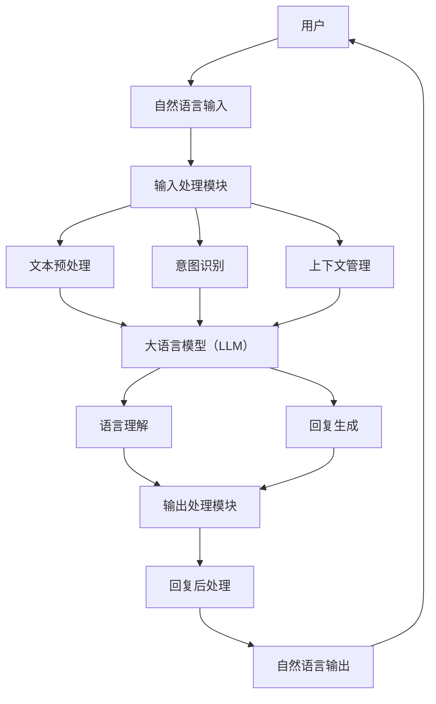

# AI Agent 的自然语言交互：LLM 对话系统设计

> 关键词：AI Agent、自然语言交互、LLM、对话系统设计、大语言模型

> 摘要：本文围绕 AI Agent 的自然语言交互，深入探讨了基于大语言模型（LLM）的对话系统设计。首先介绍了相关背景知识，包括目的范围、预期读者等内容。接着详细阐述了核心概念及其联系，给出了清晰的文本示意图和 Mermaid 流程图。对核心算法原理进行了深入讲解，并结合 Python 代码说明具体操作步骤。通过数学模型和公式进一步剖析其内在原理，并举例说明。以实际项目为例，展示了开发环境搭建、源代码实现与解读。分析了该技术的实际应用场景，推荐了学习、开发相关的工具和资源，最后总结了未来发展趋势与挑战，还提供了常见问题解答及扩展阅读参考资料，旨在为开发者和研究者提供全面的技术指导。

## 1. 背景介绍 
### 1.1 目的和范围
随着人工智能技术的飞速发展，自然语言交互成为了人机交互领域的关键研究方向。AI Agent 作为能够自主执行任务的智能实体，其与人类进行自然语言交互的能力至关重要。基于大语言模型（LLM）的对话系统设计，旨在构建能够理解人类自然语言、生成合理回复并与用户进行有效沟通的智能系统。本文的范围涵盖了从核心概念的介绍、算法原理的分析、数学模型的推导，到实际项目的开发和应用场景的探讨，为读者全面了解和设计基于 LLM 的对话系统提供指导。

### 1.2 预期读者
本文预期读者包括人工智能领域的研究者、开发者、软件工程师以及对自然语言处理和对话系统感兴趣的技术爱好者。无论是初学者希望了解基本概念和原理，还是有一定经验的开发者想要深入研究系统设计和实现细节，都能从本文中获得有价值的信息。

### 1.3 文档结构概述
本文共分为十个部分。第一部分为背景介绍，阐述了文章的目的、预期读者和文档结构。第二部分介绍核心概念与联系，包括相关概念的原理和架构，并给出文本示意图和 Mermaid 流程图。第三部分详细讲解核心算法原理和具体操作步骤，结合 Python 代码进行说明。第四部分通过数学模型和公式进一步解释系统的工作原理，并举例说明。第五部分是项目实战，涵盖开发环境搭建、源代码实现和代码解读。第六部分分析实际应用场景。第七部分推荐学习、开发所需的工具和资源。第八部分总结未来发展趋势与挑战。第九部分是附录，提供常见问题与解答。第十部分给出扩展阅读和参考资料。

### 1.4 术语表
#### 1.4.1 核心术语定义
- **AI Agent**：能够感知环境、自主决策并执行任务的智能实体。在自然语言交互中，它可以理解用户输入的语言信息，并生成合适的回复。
- **自然语言交互**：人类使用自然语言（如汉语、英语等）与计算机系统进行沟通和交流的过程。
- **大语言模型（LLM）**：基于深度学习技术训练的大规模语言模型，如 GPT、BERT 等，具有强大的语言理解和生成能力。
- **对话系统**：一种能够与用户进行对话的计算机程序，根据用户的输入生成相应的回复。

#### 1.4.2 相关概念解释
- **上下文理解**：在对话系统中，上下文理解是指系统能够理解当前对话的上下文信息，包括之前的对话内容、用户的意图等，以便生成更准确和连贯的回复。
- **意图识别**：分析用户输入的自然语言，确定用户的意图，例如查询信息、请求帮助、进行闲聊等。
- **回复生成**：根据用户的意图和上下文信息，生成合适的回复内容。

#### 1.4.3 缩略词列表
- **LLM**：Large Language Model（大语言模型）
- **NLP**：Natural Language Processing（自然语言处理）
- **API**：Application Programming Interface（应用程序编程接口）

## 2. 核心概念与联系 

### 核心概念原理
#### AI Agent
AI Agent 是具有自主性、反应性、社会性和主动性的智能实体。在自然语言交互中，它接收用户的自然语言输入，通过一系列处理步骤，如意图识别、上下文理解等，生成合适的回复。AI Agent 可以根据不同的任务和场景进行定制化开发，例如智能客服、智能助手等。

#### 自然语言交互
自然语言交互是人类与计算机之间最自然和直观的交互方式。它涉及到自然语言处理的多个领域，包括语音识别、语义理解、语言生成等。在基于 LLM 的对话系统中，自然语言交互的核心是利用大语言模型的强大能力，实现对用户输入的准确理解和高质量回复的生成。

#### 大语言模型（LLM）
大语言模型是基于深度学习技术训练的大规模神经网络模型。它通过在海量文本数据上进行无监督学习，学习到语言的统计规律和语义信息。LLM 具有强大的语言理解和生成能力，可以用于各种自然语言处理任务，如文本生成、机器翻译、问答系统等。在对话系统中，LLM 可以作为核心组件，负责对用户输入的理解和回复的生成。

#### 对话系统
对话系统是一种能够与用户进行对话的计算机程序。它可以分为任务导向型对话系统和闲聊型对话系统。任务导向型对话系统旨在帮助用户完成特定的任务，如查询信息、预订机票等；闲聊型对话系统则主要用于与用户进行闲聊，提供娱乐和陪伴。基于 LLM 的对话系统通常结合了任务导向和闲聊的功能，以提供更全面的交互体验。

### 架构的文本示意图
```plaintext
用户 -- 自然语言输入 --> 对话系统
对话系统：
|-- 输入处理模块
|   |-- 文本预处理（分词、词性标注等）
|   |-- 意图识别
|   |-- 上下文管理
|-- 大语言模型（LLM）
|   |-- 语言理解
|   |-- 回复生成
|-- 输出处理模块
|   |-- 回复后处理（格式调整、纠错等）
|-- 自然语言输出 --> 用户
```

### Mermaid 流程图


## 3. 核心算法原理 & 具体操作步骤 

### 核心算法原理
在基于 LLM 的对话系统中，核心算法主要涉及到意图识别、上下文管理和回复生成。

#### 意图识别
意图识别的目的是确定用户输入的自然语言的意图。常见的方法包括基于规则的方法、基于机器学习的方法和基于深度学习的方法。基于深度学习的方法通常使用预训练的语言模型，如 BERT、RoBERTa 等，对用户输入进行编码，然后通过分类器预测用户的意图。

#### 上下文管理
上下文管理是对话系统中非常重要的一环。它的作用是维护对话的上下文信息，以便在回复生成时能够考虑到之前的对话内容。常见的上下文管理方法包括基于栈的方法、基于图的方法和基于注意力机制的方法。基于注意力机制的方法可以根据当前输入动态地关注上下文信息，从而提高回复的连贯性和准确性。

#### 回复生成
回复生成是对话系统的最终目标。在基于 LLM 的对话系统中，通常使用大语言模型来生成回复。大语言模型可以根据用户的输入和上下文信息，生成自然流畅的回复内容。为了提高回复的质量，可以采用一些技术，如微调、提示工程等。

### 具体操作步骤及 Python 代码示例
#### 1. 安装必要的库
```python
!pip install transformers
```

#### 2. 加载预训练的语言模型
```python
from transformers import AutoTokenizer, AutoModelForCausalLM

# 加载 tokenizer 和模型
tokenizer = AutoTokenizer.from_pretrained("gpt2")
model = AutoModelForCausalLM.from_pretrained("gpt2")
```

#### 3. 实现意图识别（简单示例）
```python
import torch

def intent_recognition(input_text):
    # 这里简单假设意图分为查询信息和闲聊两种
    if "查询" in input_text:
        return "查询信息"
    else:
        return "闲聊"

input_text = "查询今天的天气"
intent = intent_recognition(input_text)
print(f"用户意图: {intent}")
```

#### 4. 上下文管理（简单示例）
```python
context = []

def manage_context(input_text):
    global context
    context.append(input_text)
    # 只保留最近的 3 条对话信息
    if len(context) > 3:
        context = context[-3:]
    return context

input_text = "你好"
context = manage_context(input_text)
print(f"当前上下文: {context}")
```

#### 5. 回复生成
```python
def generate_response(input_text):
    global context
    # 将上下文和当前输入拼接
    full_text = " ".join(context + [input_text])
    # 对输入进行编码
    input_ids = tokenizer.encode(full_text, return_tensors="pt")
    # 生成回复
    output = model.generate(input_ids, max_length=100, num_beams=5, no_repeat_ngram_size=2, early_stopping=True)
    # 解码输出
    response = tokenizer.decode(output[0], skip_special_tokens=True)
    # 提取回复内容
    response = response[len(full_text):].strip()
    # 更新上下文
    context = manage_context(response)
    return response

input_text = "今天过得怎么样？"
response = generate_response(input_text)
print(f"回复: {response}")
```

## 4. 数学模型和公式 & 详细讲解 & 举例说明 

### 意图识别的数学模型
在基于深度学习的意图识别中，通常使用分类器来预测用户的意图。假设输入的文本为 $x$，意图类别为 $y$，分类器的参数为 $\theta$。分类器的目标是最大化条件概率 $P(y|x;\theta)$。

常见的分类器是基于神经网络的，例如多层感知机（MLP）。MLP 的输入是文本的编码表示 $h(x)$，输出是每个意图类别的概率分布。可以使用交叉熵损失函数来训练分类器：

$$L(\theta) = -\sum_{i=1}^{N} \sum_{j=1}^{C} y_{ij} \log(p_{ij})$$

其中，$N$ 是训练样本的数量，$C$ 是意图类别的数量，$y_{ij}$ 是第 $i$ 个样本属于第 $j$ 个类别的真实标签（0 或 1），$p_{ij}$ 是分类器预测第 $i$ 个样本属于第 $j$ 个类别的概率。

### 上下文管理的数学模型
在基于注意力机制的上下文管理中，假设上下文信息为 $C = [c_1, c_2, \cdots, c_n]$，当前输入为 $x$。注意力机制可以计算每个上下文元素 $c_i$ 与当前输入 $x$ 的相关性得分 $a_i$：

$$a_i = \frac{\exp(sim(c_i, x))}{\sum_{j=1}^{n} \exp(sim(c_j, x))}$$

其中，$sim(c_i, x)$ 是上下文元素 $c_i$ 与当前输入 $x$ 的相似度函数，常见的相似度函数包括点积、余弦相似度等。

然后，通过加权求和得到上下文的表示 $h_C$：

$$h_C = \sum_{i=1}^{n} a_i c_i$$

### 回复生成的数学模型
在基于大语言模型的回复生成中，通常使用自回归模型。假设输入序列为 $x = [x_1, x_2, \cdots, x_m]$，模型的目标是生成输出序列 $y = [y_1, y_2, \cdots, y_n]$。自回归模型通过逐步生成每个输出词 $y_t$，条件是之前生成的词 $y_{<t}$ 和输入序列 $x$：

$$P(y_t|y_{<t}, x) = softmax(W_h h_t + b)$$

其中，$h_t$ 是模型在时间步 $t$ 的隐藏状态，$W_h$ 是权重矩阵，$b$ 是偏置向量。

### 举例说明
假设我们有一个简单的意图识别任务，意图类别包括“查询信息”和“闲聊”。训练数据如下：

| 输入文本 | 意图类别 |
| --- | --- |
| 查询今天的天气 | 查询信息 |
| 你好，最近怎么样 | 闲聊 |

使用一个简单的 MLP 分类器，输入是文本的词向量表示，输出是两个类别的概率分布。通过交叉熵损失函数训练分类器，最终可以得到一个能够准确预测用户意图的模型。

对于上下文管理，假设当前上下文为 $C = ["你好", "今天过得怎么样"]$，当前输入为 $x = "还不错"$。使用点积相似度函数计算每个上下文元素与当前输入的相关性得分，然后通过加权求和得到上下文的表示，用于后续的回复生成。

在回复生成中，假设输入序列为 $x = ["今天", "过得", "怎么样"]$，模型逐步生成输出序列，例如 $y = ["还", "不错"]$。每个输出词的生成都是基于之前生成的词和输入序列的条件概率。

## 5. 项目实战：代码实际案例和详细解释说明 

### 5.1  开发环境搭建
#### 操作系统
可以选择 Windows、Linux 或 macOS 操作系统。建议使用 Linux 系统，因为它在开发和部署方面具有更好的稳定性和兼容性。

#### Python 环境
安装 Python 3.7 或更高版本。可以使用 Anaconda 来管理 Python 环境，方便安装和管理各种依赖库。

#### 依赖库安装
在命令行中执行以下命令安装必要的依赖库：
```bash
pip install transformers torch flask
```
- `transformers`：用于加载和使用预训练的语言模型。
- `torch`：深度学习框架，用于模型的训练和推理。
- `flask`：轻量级 Web 框架，用于搭建对话系统的 Web 接口。

### 5.2  源代码详细实现和代码解读
#### 代码实现
```python
from flask import Flask, request, jsonify
from transformers import AutoTokenizer, AutoModelForCausalLM

app = Flask(__name__)

# 加载 tokenizer 和模型
tokenizer = AutoTokenizer.from_pretrained("gpt2")
model = AutoModelForCausalLM.from_pretrained("gpt2")

# 上下文管理
context = []

def manage_context(input_text):
    global context
    context.append(input_text)
    if len(context) > 3:
        context = context[-3:]
    return context

def generate_response(input_text):
    global context
    full_text = " ".join(context + [input_text])
    input_ids = tokenizer.encode(full_text, return_tensors="pt")
    output = model.generate(input_ids, max_length=100, num_beams=5, no_repeat_ngram_size=2, early_stopping=True)
    response = tokenizer.decode(output[0], skip_special_tokens=True)
    response = response[len(full_text):].strip()
    context = manage_context(response)
    return response

@app.route('/chat', methods=['POST'])
def chat():
    data = request.get_json()
    input_text = data.get('input_text')
    if input_text:
        response = generate_response(input_text)
        return jsonify({'response': response})
    else:
        return jsonify({'error': 'No input text provided'}), 400

if __name__ == '__main__':
    app.run(debug=True)
```

#### 代码解读
1. **导入必要的库**：导入 `Flask`、`request`、`jsonify` 用于搭建 Web 接口，导入 `AutoTokenizer` 和 `AutoModelForCausalLM` 用于加载预训练的语言模型。
2. **初始化 Flask 应用**：创建一个 Flask 应用实例。
3. **加载预训练的语言模型**：使用 `AutoTokenizer` 和 `AutoModelForCausalLM` 加载 GPT-2 模型。
4. **上下文管理**：定义 `manage_context` 函数，用于管理对话的上下文信息。
5. **回复生成**：定义 `generate_response` 函数，根据用户输入和上下文信息生成回复。
6. **定义 Web 接口**：使用 `@app.route` 装饰器定义一个 `/chat` 接口，接收用户的输入文本，并返回生成的回复。
7. **启动应用**：使用 `app.run` 启动 Flask 应用。

### 5.3  代码解读与分析
#### 优点
- **简单易用**：使用 Flask 框架搭建 Web 接口，代码简洁，易于理解和维护。
- **可扩展性**：可以方便地替换不同的预训练语言模型，也可以添加更多的功能，如意图识别、情感分析等。
- **上下文管理**：通过维护对话的上下文信息，提高了回复的连贯性和准确性。

#### 缺点
- **性能问题**：使用 GPT-2 模型进行推理时，可能会存在性能瓶颈，特别是在处理大量请求时。
- **回复质量**：回复的质量取决于预训练语言模型的性能，可能会存在一些不准确或不合理的回复。

#### 改进建议
- **模型优化**：可以使用更强大的预训练语言模型，如 GPT-3、ChatGPT 等，提高回复的质量。
- **性能优化**：可以使用分布式计算、模型量化等技术，提高模型的推理速度。
- **多模态融合**：可以结合图像、语音等多模态信息，提供更丰富的交互体验。

## 6. 实际应用场景 
### 智能客服
在电商、金融、电信等行业，智能客服系统可以使用基于 LLM 的对话系统来自动回答用户的问题。用户可以通过自然语言与智能客服进行交流，查询商品信息、办理业务、解决问题等。智能客服系统可以根据用户的问题，快速准确地生成回复，提高客户服务的效率和质量。

### 智能助手
智能助手可以集成到手机、电脑、智能家居等设备中，为用户提供各种服务。用户可以通过语音或文本与智能助手进行交互，查询天气、设置提醒、播放音乐、控制家电等。基于 LLM 的智能助手可以更好地理解用户的意图，提供更个性化的服务。

### 在线教育
在在线教育领域，对话系统可以作为虚拟教师，与学生进行互动交流。学生可以向虚拟教师提问、讨论问题，虚拟教师可以根据学生的问题提供解答和指导。对话系统还可以根据学生的学习情况，提供个性化的学习建议和辅导。

### 智能写作
基于 LLM 的对话系统可以用于智能写作，帮助用户生成文章、故事、诗歌等。用户可以输入一些关键词或主题，对话系统可以根据用户的输入生成相应的文本内容。智能写作可以提高写作效率，为用户提供创意灵感。

## 7. 工具和资源推荐
### 7.1 学习资源推荐
#### 7.1.1 书籍推荐
- 《自然语言处理入门》：这本书适合初学者，系统地介绍了自然语言处理的基本概念、方法和技术。
- 《深度学习》：由 Ian Goodfellow、Yoshua Bengio 和 Aaron Courville 所著，是深度学习领域的经典教材，对理解大语言模型的原理有很大帮助。
- 《Python 自然语言处理》：详细介绍了如何使用 Python 进行自然语言处理，包含大量的代码示例。

#### 7.1.2 在线课程
- Coursera 上的“自然语言处理专项课程”：由顶尖大学的教授授课，涵盖了自然语言处理的各个方面。
- edX 上的“深度学习基础”：帮助学习者掌握深度学习的基本原理和方法，为学习大语言模型打下基础。
- 哔哩哔哩上有很多关于自然语言处理和大语言模型的教学视频，可以根据自己的需求选择学习。

#### 7.1.3 技术博客和网站
- Hugging Face 博客：提供了关于大语言模型和自然语言处理的最新研究成果和技术文章。
- Medium 上的自然语言处理相关专栏：有很多专业人士分享的经验和见解。
- 机器之心、新智元等科技媒体网站：及时报道人工智能领域的最新动态和研究成果。

### 7.2 开发工具框架推荐
#### 7.2.1 IDE和编辑器
- PyCharm：功能强大的 Python 集成开发环境，提供代码编辑、调试、版本控制等功能。
- Visual Studio Code：轻量级的代码编辑器，支持多种编程语言，有丰富的插件扩展。
- Jupyter Notebook：交互式的开发环境，适合进行数据探索和模型实验。

#### 7.2.2 调试和性能分析工具
- TensorBoard：用于可视化深度学习模型的训练过程和性能指标。
- Py-Spy：可以分析 Python 程序的性能瓶颈，找出耗时的代码段。
- cProfile：Python 内置的性能分析工具，可以统计函数的调用次数和执行时间。

#### 7.2.3 相关框架和库
- Transformers：Hugging Face 开发的用于自然语言处理的库，提供了大量的预训练语言模型和工具。
- PyTorch：深度学习框架，具有动态图的特点，易于使用和调试。
- TensorFlow：另一个流行的深度学习框架，具有强大的分布式训练和部署能力。

### 7.3 相关论文著作推荐
#### 7.3.1 经典论文
- 《Attention Is All You Need》：介绍了 Transformer 架构，是大语言模型的基础。
- 《BERT: Pre-training of Deep Bidirectional Transformers for Language Understanding》：提出了 BERT 模型，在自然语言处理任务中取得了很好的效果。
- 《GPT: Generative Pretrained Transformer》：介绍了 GPT 系列模型的原理和应用。

#### 7.3.2 最新研究成果
- 可以关注 arXiv 上的自然语言处理相关论文，了解最新的研究进展。
- NeurIPS、ACL、EMNLP 等顶级学术会议的论文集，包含了自然语言处理领域的最新研究成果。

#### 7.3.3 应用案例分析
- 《Applied Natural Language Processing with Python》：通过实际案例介绍了自然语言处理的应用，包括对话系统、情感分析等。
- 各大科技公司的技术博客，如 Google AI Blog、Microsoft Research Blog 等，会分享一些实际应用案例和技术经验。

## 8. 总结：未来发展趋势与挑战
### 未来发展趋势
#### 多模态融合
未来的对话系统将不仅仅局限于文本交互，而是会融合图像、语音、视频等多模态信息。用户可以通过语音、手势、表情等多种方式与对话系统进行交互，对话系统也可以生成更丰富的回复，如语音播报、图像展示等。

#### 个性化服务
随着用户数据的不断积累，对话系统将能够更好地了解用户的偏好、习惯和需求，提供更加个性化的服务。例如，根据用户的历史对话记录和兴趣爱好，推荐相关的商品、文章或活动。

#### 知识增强
为了提高对话系统的回复质量和准确性，未来的对话系统将结合知识图谱等技术，引入外部知识。对话系统可以利用知识图谱中的知识进行推理和判断，为用户提供更有价值的信息。

#### 自主学习和进化
对话系统将具备自主学习和进化的能力，能够不断从新的对话数据中学习，提高自身的性能和智能水平。同时，对话系统还可以根据用户的反馈进行自我调整和优化，提供更好的交互体验。

### 挑战
#### 数据隐私和安全
对话系统需要处理大量的用户数据，包括个人信息、对话记录等。如何保护用户的数据隐私和安全，防止数据泄露和滥用，是一个重要的挑战。

#### 模型可解释性
大语言模型通常是黑盒模型，其决策过程和推理逻辑难以解释。在一些对安全性和可靠性要求较高的应用场景中，如医疗、金融等，模型的可解释性是一个关键问题。

#### 计算资源需求
训练和部署大语言模型需要大量的计算资源，包括高性能的 GPU、TPU 等。如何降低计算资源的需求，提高模型的效率，是一个亟待解决的问题。

#### 语言多样性和文化差异
不同的语言和文化之间存在着巨大的差异，对话系统需要能够处理各种语言和文化背景的用户输入。如何实现语言多样性和文化适应性，是一个具有挑战性的任务。

## 9. 附录：常见问题与解答
### 问题 1：如何选择合适的预训练语言模型？
解答：选择合适的预训练语言模型需要考虑多个因素，如任务类型、数据规模、计算资源等。如果是处理英文文本，可以选择 GPT-3、BERT 等模型；如果是处理中文文本，可以选择中文 BERT、ERNIE 等模型。同时，还需要根据自己的计算资源选择合适的模型大小，避免出现内存不足或计算时间过长的问题。

### 问题 2：如何提高对话系统的回复质量？
解答：可以从以下几个方面提高对话系统的回复质量：
- 使用更强大的预训练语言模型。
- 进行模型微调，使用自己的数据集对模型进行训练。
- 优化上下文管理，更好地利用对话的上下文信息。
- 引入知识图谱等外部知识，提高回复的准确性和可靠性。

### 问题 3：如何处理对话系统中的错误回复？
解答：可以采用以下方法处理对话系统中的错误回复：
- 收集错误回复的样本，对模型进行微调，提高模型的性能。
- 引入人工干预，当对话系统生成错误回复时，人工进行修正和补充。
- 设计规则和策略，对回复进行过滤和修正，避免出现明显的错误。

### 问题 4：如何部署对话系统到生产环境？
解答：部署对话系统到生产环境可以按照以下步骤进行：
- 选择合适的服务器和云平台，确保有足够的计算资源和稳定性。
- 使用 Docker 等容器技术将对话系统打包成容器，方便部署和管理。
- 配置负载均衡和监控系统，确保对话系统能够处理大量的请求，并及时发现和解决问题。
- 进行性能测试和安全测试，确保对话系统在生产环境中的性能和安全性。

## 10. 扩展阅读 & 参考资料
### 扩展阅读
- 《人工智能：现代方法》：全面介绍了人工智能的各个领域，包括自然语言处理、机器学习、知识表示等。
- 《对话系统：从原理到实践》：深入探讨了对话系统的设计和实现，包含了大量的案例和代码。
- 《自然语言处理实战：基于 Python 和深度学习》：通过实际项目介绍了自然语言处理的应用，包括对话系统、文本分类等。

### 参考资料
- Hugging Face 官方文档：https://huggingface.co/docs
- PyTorch 官方文档：https://pytorch.org/docs/stable/index.html
- TensorFlow 官方文档：https://www.tensorflow.org/api_docs

作者：AI天才研究院/AI Genius Institute & 禅与计算机程序设计艺术 /Zen And The Art of Computer Programming