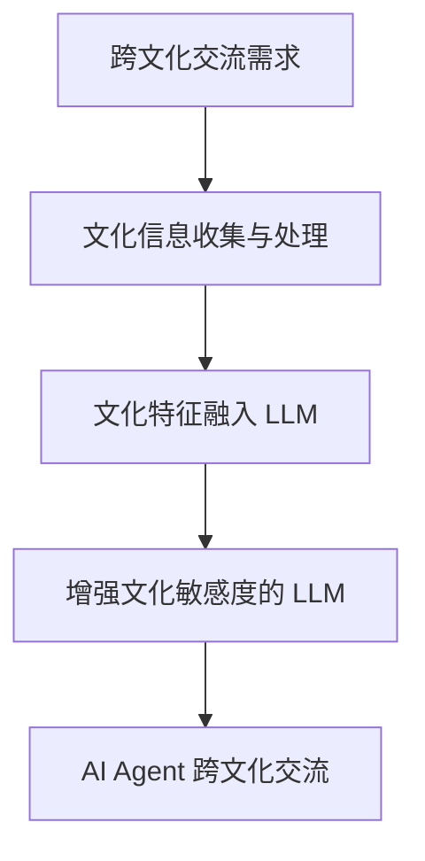

# AI Agent 的跨文化交流：增强 LLM 的文化敏感度

> 关键词：AI Agent、跨文化交流、大语言模型（LLM）、文化敏感度、语言理解、文化适应

> 摘要：本文聚焦于 AI Agent 在跨文化交流中的重要性以及如何增强大语言模型（LLM）的文化敏感度。首先介绍了研究背景，包括目的、预期读者、文档结构和相关术语。接着阐述了 AI Agent 跨文化交流和文化敏感度的核心概念及联系，通过示意图和流程图展示其架构。详细讲解了增强文化敏感度的核心算法原理，并用 Python 代码进行说明。给出了相关的数学模型和公式，并举例说明。通过项目实战，展示了如何搭建开发环境、实现源代码并进行解读分析。探讨了实际应用场景，推荐了学习资源、开发工具框架和相关论文著作。最后总结了未来发展趋势与挑战，提供了常见问题解答和扩展阅读参考资料，旨在为提升 AI Agent 在跨文化交流中的表现提供全面的技术指导。

## 1. 背景介绍 
### 1.1 目的和范围
在全球化的时代，跨文化交流变得日益频繁。AI Agent 作为人机交互和信息处理的重要工具，在跨文化场景中的应用也越来越广泛。然而，现有的大语言模型（LLM）在处理不同文化背景下的语言和信息时，往往缺乏足够的文化敏感度，可能导致误解、不恰当的回应等问题。本文章的目的是探讨如何增强 LLM 的文化敏感度，使 AI Agent 能够更好地进行跨文化交流。具体范围包括核心概念的介绍、算法原理的讲解、项目实战案例的分析以及相关工具和资源的推荐等。

### 1.2 预期读者
本文的预期读者包括人工智能领域的研究人员、开发人员、软件工程师，对跨文化交流和自然语言处理感兴趣的学者和爱好者，以及希望利用 AI Agent 进行跨文化业务拓展的企业从业者等。

### 1.3 文档结构概述
本文将按照以下结构进行阐述：首先介绍背景知识，包括目的、读者和文档结构；接着讲解核心概念与联系，展示相关的架构示意图和流程图；然后详细说明核心算法原理和具体操作步骤，并用 Python 代码实现；给出数学模型和公式，并举例说明；通过项目实战展示代码的实际应用和解读；探讨实际应用场景；推荐学习资源、开发工具框架和相关论文著作；总结未来发展趋势与挑战；提供常见问题解答和扩展阅读参考资料。

### 1.4 术语表
#### 1.4.1 核心术语定义
- **AI Agent**：是一种能够感知环境、做出决策并采取行动以实现特定目标的智能实体。在本文中，主要指基于大语言模型的智能对话代理。
- **大语言模型（LLM）**：是一种基于深度学习的语言模型，通过在大规模文本数据上进行训练，能够生成自然语言文本、回答问题、进行对话等。
- **文化敏感度**：指对不同文化之间的差异和特点的感知、理解和适应能力。在 AI Agent 中，文化敏感度体现为能够理解和处理不同文化背景下的语言、价值观、习俗等信息。
- **跨文化交流**：指不同文化背景的个体或群体之间进行的信息传递、互动和理解的过程。

#### 1.4.2 相关概念解释
- **语言相对性**：认为语言结构影响人们的思维方式和对世界的认知。不同文化的语言可能具有不同的语法、词汇和表达方式，这会影响 AI Agent 对语言的理解和生成。
- **文化图式**：是人们在长期的文化生活中形成的对事物的认知模式和预期。在跨文化交流中，AI Agent 需要了解不同文化的图式，以避免误解和不恰当的回应。
- **多模态信息**：除了文本信息外，还包括图像、音频、视频等多种形式的信息。在跨文化交流中，多模态信息可以提供更丰富的文化线索，帮助 AI Agent 更好地理解和表达。

#### 1.4.3 缩略词列表
- **LLM**：大语言模型（Large Language Model）
- **NLP**：自然语言处理（Natural Language Processing）
- **AI**：人工智能（Artificial Intelligence）

## 2. 核心概念与联系 

### 核心概念原理
#### AI Agent 的跨文化交流
AI Agent 的跨文化交流是指在不同文化背景下，AI Agent 能够与用户进行有效的沟通和互动。这需要 AI Agent 不仅能够理解和生成自然语言文本，还能够考虑到不同文化的语言习惯、价值观、习俗等因素。例如，在某些文化中，直接表达意见可能被认为是不礼貌的，而在另一些文化中则被视为坦率和真诚。因此，AI Agent 需要根据不同的文化背景调整自己的表达方式。

#### 增强 LLM 的文化敏感度
增强 LLM 的文化敏感度是提高 AI Agent 跨文化交流能力的关键。这可以通过多种方式实现，例如在训练数据中加入不同文化背景的文本，引入文化特征向量，使用元学习等方法。通过增强文化敏感度，LLM 能够更好地理解不同文化背景下的语言含义和语境，从而生成更恰当的回应。

### 架构的文本示意图
```plaintext
           +----------------------+
           |  跨文化交流需求     |
           +----------------------+
                      |
                      v
           +----------------------+
           |  文化信息收集与处理 |
           +----------------------+
                      |
                      v
           +----------------------+
           |  文化特征融入 LLM    |
           +----------------------+
                      |
                      v
           +----------------------+
           |  增强文化敏感度的 LLM|
           +----------------------+
                      |
                      v
           +----------------------+
           |  AI Agent 跨文化交流 |
           +----------------------+
```

### Mermaid 流程图


## 3. 核心算法原理 & 具体操作步骤 

### 算法原理
增强 LLM 文化敏感度的一种常见算法是基于文化特征向量的方法。具体步骤如下：
1. **文化信息收集**：收集不同文化背景下的文本数据，包括文学作品、新闻报道、社交媒体帖子等。同时，收集文化相关的知识，如文化价值观、习俗、禁忌等。
2. **文化特征提取**：从收集到的文化信息中提取文化特征。可以使用词嵌入技术将文本转换为向量表示，然后通过聚类、主题建模等方法提取文化特征。例如，可以将与某个文化相关的词汇、短语等映射到一个低维向量空间中，形成文化特征向量。
3. **文化特征融入 LLM**：将提取的文化特征向量融入到 LLM 的训练过程中。可以通过在输入层添加文化特征向量，或者在模型的中间层引入文化注意力机制，使模型能够更好地关注文化相关的信息。
4. **模型训练与优化**：使用融合了文化特征的数据集对 LLM 进行训练，并使用合适的优化算法进行模型参数的调整，以提高模型的文化敏感度。

### Python 代码实现
```python
import torch
import torch.nn as nn
from transformers import GPT2LMHeadModel, GPT2Tokenizer

# 加载预训练的 LLM
tokenizer = GPT2Tokenizer.from_pretrained('gpt2')
model = GPT2LMHeadModel.from_pretrained('gpt2')

# 假设我们已经提取了文化特征向量
cultural_feature_vector = torch.randn(1, 768)  # 示例文化特征向量

# 定义一个简单的文化注意力机制
class CulturalAttention(nn.Module):
    def __init__(self, hidden_size):
        super(CulturalAttention, self).__init__()
        self.linear = nn.Linear(hidden_size, 1)

    def forward(self, hidden_states, cultural_feature):
        attention_scores = self.linear(hidden_states)
        attention_probs = torch.softmax(attention_scores, dim=1)
        weighted_cultural_feature = attention_probs * cultural_feature
        return weighted_cultural_feature

# 初始化文化注意力机制
cultural_attention = CulturalAttention(768)

# 准备输入文本
input_text = "Hello, how are you?"
input_ids = tokenizer.encode(input_text, return_tensors='pt')

# 获取 LLM 的隐藏状态
outputs = model(input_ids)
hidden_states = outputs.hidden_states[-1]

# 应用文化注意力机制
weighted_cultural_feature = cultural_attention(hidden_states, cultural_feature_vector)

# 将加权后的文化特征与隐藏状态相加
enhanced_hidden_states = hidden_states + weighted_cultural_feature

# 生成输出
lm_logits = model.lm_head(enhanced_hidden_states)
output_ids = torch.argmax(lm_logits, dim=-1)
output_text = tokenizer.decode(output_ids[0], skip_special_tokens=True)

print("Enhanced output:", output_text)
```

### 具体操作步骤
1. **数据准备**：收集不同文化背景的文本数据，并进行清洗和预处理。可以使用常见的文本处理库，如 NLTK、SpaCy 等。
2. **文化特征提取**：使用词嵌入模型（如 Word2Vec、GloVe 等）将文本转换为向量表示，然后使用聚类算法（如 K-Means、DBSCAN 等）或主题建模算法（如 LDA、NMF 等）提取文化特征。
3. **模型修改**：在现有的 LLM 基础上，添加文化注意力机制或其他文化特征融合模块。可以使用深度学习框架（如 PyTorch、TensorFlow 等）进行模型的修改和训练。
4. **模型训练**：使用融合了文化特征的数据集对修改后的模型进行训练。可以使用随机梯度下降（SGD）、Adam 等优化算法进行模型参数的调整。
5. **模型评估**：使用测试数据集对训练好的模型进行评估，评估指标可以包括准确率、召回率、F1 值等。根据评估结果对模型进行进一步的优化。

## 4. 数学模型和公式 & 详细讲解 & 举例说明 

### 文化特征提取的数学模型
#### 词嵌入
词嵌入是将文本中的每个词映射到一个低维向量空间的过程。常见的词嵌入模型有 Word2Vec 和 GloVe。以 Word2Vec 为例，其目标是最大化给定上下文词预测目标词的概率。具体公式如下：
$$
\max_{\theta} \prod_{t=1}^{T} \prod_{-c \leq j \leq c, j \neq 0} P(w_{t+j} | w_t; \theta)
$$
其中，$T$ 是文本的长度，$c$ 是上下文窗口的大小，$w_t$ 是第 $t$ 个词，$\theta$ 是模型的参数。

#### 聚类算法
聚类算法的目标是将相似的词或文本划分到同一个簇中。以 K-Means 算法为例，其目标是最小化每个簇内样本到簇中心的距离之和。具体公式如下：
$$
\min_{S} \sum_{i=1}^{k} \sum_{x \in S_i} \| x - \mu_i \|^2
$$
其中，$k$ 是簇的数量，$S = \{ S_1, S_2, \cdots, S_k \}$ 是簇的划分，$\mu_i$ 是第 $i$ 个簇的中心，$x$ 是样本。

### 文化特征融入 LLM 的数学模型
#### 文化注意力机制
文化注意力机制的目标是根据文化特征向量对 LLM 的隐藏状态进行加权。具体公式如下：
$$
\alpha_i = \frac{\exp(\text{score}(h_i, c))}{\sum_{j=1}^{n} \exp(\text{score}(h_j, c))}
$$
$$
\tilde{h}_i = \alpha_i \cdot c
$$
其中，$h_i$ 是 LLM 的第 $i$ 个隐藏状态，$c$ 是文化特征向量，$\alpha_i$ 是注意力权重，$\tilde{h}_i$ 是加权后的隐藏状态。

### 举例说明
假设我们有一个关于不同文化中问候语的文本数据集。首先，使用 Word2Vec 模型将每个问候语中的词映射到一个 300 维的向量空间中。然后，使用 K-Means 算法将这些向量聚类成 5 个簇，每个簇代表一种文化的问候语特征。接下来，在 LLM 的输入层添加一个文化特征向量，该向量是某个簇的中心向量。在模型的中间层，使用文化注意力机制根据文化特征向量对隐藏状态进行加权。最后，训练模型，使其能够根据不同的文化背景生成合适的问候语回应。

## 5. 项目实战：代码实际案例和详细解释说明 

### 5.1  开发环境搭建
#### 操作系统
可以选择 Windows、Linux 或 macOS 操作系统。建议使用 Linux 系统，因为它在开发和部署方面具有更好的稳定性和兼容性。

#### Python 环境
安装 Python 3.7 或更高版本。可以使用 Anaconda 或 Miniconda 来管理 Python 环境。以下是创建和激活虚拟环境的命令：
```bash
conda create -n ai_agent_cultural python=3.8
conda activate ai_agent_cultural
```

#### 依赖库安装
安装必要的 Python 库，包括 `transformers`、`torch`、`nltk` 等。可以使用以下命令进行安装：
```bash
pip install transformers torch nltk
```

### 5.2  源代码详细实现和代码解读
```python
import torch
import torch.nn as nn
from transformers import GPT2LMHeadModel, GPT2Tokenizer
import nltk
from nltk.corpus import stopwords
from sklearn.feature_extraction.text import TfidfVectorizer
from sklearn.cluster import KMeans

# 下载停用词
nltk.download('stopwords')

# 加载预训练的 LLM
tokenizer = GPT2Tokenizer.from_pretrained('gpt2')
model = GPT2LMHeadModel.from_pretrained('gpt2')

# 假设我们有一个不同文化背景的文本数据集
cultural_texts = [
    "In Western cultures, people often say 'Hello' when they meet.",
    "In Asian cultures, bowing is a common greeting gesture.",
    "In Middle Eastern cultures, it is polite to ask about family and health."
]

# 文本预处理
stop_words = set(stopwords.words('english'))
vectorizer = TfidfVectorizer(stop_words=stop_words)
X = vectorizer.fit_transform(cultural_texts)

# 文化特征提取：使用 K-Means 聚类
kmeans = KMeans(n_clusters=3, random_state=42)
kmeans.fit(X)

# 定义一个简单的文化注意力机制
class CulturalAttention(nn.Module):
    def __init__(self, hidden_size):
        super(CulturalAttention, self).__init__()
        self.linear = nn.Linear(hidden_size, 1)

    def forward(self, hidden_states, cultural_feature):
        attention_scores = self.linear(hidden_states)
        attention_probs = torch.softmax(attention_scores, dim=1)
        weighted_cultural_feature = attention_probs * cultural_feature
        return weighted_cultural_feature

# 初始化文化注意力机制
cultural_attention = CulturalAttention(768)

# 准备输入文本
input_text = "How do people greet in different cultures?"
input_ids = tokenizer.encode(input_text, return_tensors='pt')

# 获取 LLM 的隐藏状态
outputs = model(input_ids)
hidden_states = outputs.hidden_states[-1]

# 选择一个文化特征向量（这里简单选择第一个簇的中心）
cultural_feature_vector = torch.tensor(kmeans.cluster_centers_[0], dtype=torch.float32).unsqueeze(0)

# 应用文化注意力机制
weighted_cultural_feature = cultural_attention(hidden_states, cultural_feature_vector)

# 将加权后的文化特征与隐藏状态相加
enhanced_hidden_states = hidden_states + weighted_cultural_feature

# 生成输出
lm_logits = model.lm_head(enhanced_hidden_states)
output_ids = torch.argmax(lm_logits, dim=-1)
output_text = tokenizer.decode(output_ids[0], skip_special_tokens=True)

print("Enhanced output:", output_text)
```

### 代码解读与分析
1. **数据准备**：首先，我们定义了一个包含不同文化背景文本的数据集 `cultural_texts`。然后，使用 `TfidfVectorizer` 对文本进行预处理，将文本转换为 TF-IDF 特征向量。
2. **文化特征提取**：使用 `KMeans` 算法对 TF-IDF 特征向量进行聚类，得到不同文化的特征簇。这里我们选择将文本分为 3 个簇。
3. **文化注意力机制**：定义了一个简单的文化注意力机制 `CulturalAttention`，用于根据文化特征向量对 LLM 的隐藏状态进行加权。
4. **输入处理**：将输入文本 `input_text` 编码为输入 ID，并输入到 LLM 中，获取隐藏状态。
5. **文化特征融合**：选择一个文化特征向量（这里简单选择第一个簇的中心），并使用文化注意力机制对隐藏状态进行加权。
6. **输出生成**：将加权后的隐藏状态输入到 LLM 的语言模型头中，生成输出 ID，并解码为文本。

通过这种方式，我们可以在 LLM 中融入文化特征，提高其在跨文化交流中的表现。

## 6. 实际应用场景 
### 跨文化客户服务
在跨国企业的客户服务中，AI Agent 可以使用增强文化敏感度的 LLM 来更好地理解不同文化背景客户的需求和问题，并提供恰当的解决方案。例如，对于来自不同文化的客户，AI Agent 可以根据其文化背景调整回应的语气和方式，避免因文化差异导致的误解。

### 国际教育
在国际教育领域，AI Agent 可以作为虚拟学习伙伴，帮助学生进行跨文化交流和学习。例如，在语言学习中，AI Agent 可以根据学生的文化背景提供更贴合其文化习惯的学习资源和练习，提高学习效果。

### 跨境电商
在跨境电商平台上，AI Agent 可以为不同文化背景的买家和卖家提供沟通和交易支持。例如，帮助卖家了解不同文化市场的需求和偏好，为买家提供符合其文化习惯的产品推荐和购物指导。

### 外交和国际合作
在外交和国际合作中，AI Agent 可以辅助外交官和国际组织工作人员进行跨文化沟通和谈判。例如，分析不同国家的文化背景和谈判风格，提供相应的建议和策略，促进国际合作的顺利进行。

## 7. 工具和资源推荐
### 7.1 学习资源推荐
#### 7.1.1 书籍推荐
- 《自然语言处理入门》：介绍了自然语言处理的基本概念、算法和技术，适合初学者入门。
- 《深度学习》：详细讲解了深度学习的原理和应用，包括神经网络、卷积神经网络、循环神经网络等。
- 《跨文化交际学概论》：系统介绍了跨文化交际的理论和实践，有助于了解不同文化之间的差异和交流技巧。

#### 7.1.2 在线课程
- Coursera 上的“Natural Language Processing Specialization”：由顶尖大学的教授授课，全面介绍了自然语言处理的各个方面。
- edX 上的“Deep Learning for Natural Language Processing”：深入讲解了深度学习在自然语言处理中的应用。
- Udemy 上的“Cross-Cultural Communication: Effective Strategies for Global Success”：提供了跨文化交流的实用技巧和策略。

#### 7.1.3 技术博客和网站
- Hugging Face Blog：提供了关于自然语言处理和大语言模型的最新研究成果和技术应用。
- Towards Data Science：分享了各种数据科学和人工智能的技术文章和案例。
- Cross-Cultural Communication Institute：专注于跨文化交流的研究和实践，提供了丰富的跨文化交流资源和工具。

### 7.2 开发工具框架推荐
#### 7.2.1 IDE和编辑器
- PyCharm：功能强大的 Python 集成开发环境，提供了代码编辑、调试、版本控制等功能。
- Jupyter Notebook：交互式的开发环境，适合进行数据分析、模型训练和代码演示。
- Visual Studio Code：轻量级的代码编辑器，支持多种编程语言和插件扩展。

#### 7.2.2 调试和性能分析工具
- PyTorch Profiler：用于分析 PyTorch 模型的性能瓶颈，帮助优化模型的训练和推理速度。
- TensorBoard：用于可视化深度学习模型的训练过程和性能指标，方便调试和优化模型。
- cProfile：Python 内置的性能分析工具，可以分析代码的执行时间和函数调用情况。

#### 7.2.3 相关框架和库
- Transformers：Hugging Face 开发的自然语言处理框架，提供了丰富的预训练模型和工具，方便进行大语言模型的开发和应用。
- NLTK：自然语言处理工具包，提供了多种文本处理功能，如分词、词性标注、命名实体识别等。
- SpaCy：高效的自然语言处理库，具有快速的处理速度和良好的性能，适合大规模文本处理任务。

### 7.3 相关论文著作推荐
#### 7.3.1 经典论文
- “Attention Is All You Need”：介绍了 Transformer 架构，是现代大语言模型的基础。
- “BERT: Pre-training of Deep Bidirectional Transformers for Language Understanding”：提出了 BERT 模型，开创了预训练语言模型的新时代。
- “Cultural Linguistics: The Cultural Construal of Language and Thought”：探讨了语言和文化之间的关系，为跨文化自然语言处理提供了理论基础。

#### 7.3.2 最新研究成果
- “Multilingual BERT: Cross-lingual Language Model for Natural Language Processing”：研究了多语言 BERT 模型在跨语言自然语言处理中的应用。
- “Enhancing Cultural Sensitivity in Large Language Models through Cultural Feature Integration”：提出了一种通过文化特征融合增强大语言模型文化敏感度的方法。
- “Cross-Cultural Communication with AI Agents: Challenges and Solutions”：分析了 AI Agent 在跨文化交流中面临的挑战，并提出了相应的解决方案。

#### 7.3.3 应用案例分析
- “Case Studies in Cross-Cultural Customer Service with AI Agents”：通过实际案例分析了 AI Agent 在跨文化客户服务中的应用效果和经验教训。
- “AI-Enabled Cross-Cultural Education: A Case Study”：介绍了一个基于 AI Agent 的跨文化教育项目的实施情况和成果。
- “Using AI Agents for Cross-Border E-commerce: A Practical Guide”：提供了 AI Agent 在跨境电商中的应用实践和指导。

## 8. 总结：未来发展趋势与挑战
### 未来发展趋势
- **多模态融合**：未来的 AI Agent 将不仅依赖于文本信息，还会融合图像、音频、视频等多模态信息，以更全面地理解和处理跨文化交流中的信息。例如，通过分析面部表情、肢体语言等非语言信息，更好地理解不同文化背景下的情感和意图。
- **个性化文化适应**：AI Agent 将能够根据用户的个人文化背景和偏好，提供更加个性化的跨文化交流服务。例如，针对不同文化背景的用户，调整回应的语言风格、话题选择等。
- **跨语言和跨文化迁移学习**：利用迁移学习技术，使 AI Agent 能够在不同语言和文化之间快速迁移知识和技能，提高跨文化交流的效率和效果。
- **与人类的深度协作**：AI Agent 将与人类更加紧密地协作，共同完成跨文化交流任务。例如，在外交谈判、国际商务合作等场景中，AI Agent 可以为人类提供实时的文化分析和建议，辅助人类做出更明智的决策。

### 挑战
- **文化数据的获取和标注**：获取高质量的跨文化数据是增强 LLM 文化敏感度的关键。然而，不同文化的数据来源有限，且数据标注需要专业的跨文化知识，这增加了数据获取和标注的难度。
- **文化多样性的建模**：文化是复杂多样的，很难用简单的模型来全面表示。如何准确地建模文化多样性，使 AI Agent 能够理解和处理各种文化差异，是一个亟待解决的问题。
- **伦理和法律问题**：在跨文化交流中，AI Agent 的回应可能会涉及到不同文化的价值观、宗教信仰等敏感问题，需要考虑伦理和法律的约束。例如，避免因不当回应引起文化冲突和法律纠纷。
- **性能和效率问题**：增强 LLM 的文化敏感度可能会增加模型的复杂度和计算量，导致性能和效率下降。如何在提高文化敏感度的同时，保证模型的性能和效率，是一个挑战。

## 9. 附录：常见问题与解答
### 问题 1：如何选择合适的文化特征进行融合？
解答：选择合适的文化特征需要考虑多个因素。首先，可以从文化的核心要素入手，如价值观、习俗、语言习惯等。可以通过分析不同文化背景的文本数据，提取与这些核心要素相关的词汇、短语或主题作为文化特征。此外，还可以参考相关的文化研究和领域知识，确定具有代表性的文化特征。同时，需要进行实验和评估，选择能够有效提高模型文化敏感度的特征。

### 问题 2：文化注意力机制的效果如何评估？
解答：可以使用多种指标来评估文化注意力机制的效果。例如，可以使用准确率、召回率、F1 值等指标来评估模型在跨文化交流任务中的表现，如文本分类、问答系统等。还可以进行人工评估，邀请具有不同文化背景的人员对模型的回应进行评价，判断其是否符合相应的文化背景和语境。此外，还可以分析注意力权重的分布情况，判断模型是否能够正确地关注文化相关的信息。

### 问题 3：如何处理不同文化之间的冲突和误解？
解答：在设计 AI Agent 时，可以引入文化规则和约束，避免因文化差异导致的冲突和误解。例如，在回应中避免使用可能引起争议的词汇和表达方式，尊重不同文化的价值观和习俗。同时，可以提供文化解释和说明，帮助用户理解不同文化之间的差异。此外，还可以通过不断学习和更新文化知识，提高 AI Agent 处理文化冲突和误解的能力。

### 问题 4：增强文化敏感度会对模型的性能产生多大影响？
解答：增强文化敏感度可能会对模型的性能产生一定的影响。一方面，引入文化特征和注意力机制会增加模型的复杂度，导致计算量和内存占用增加，从而影响模型的训练和推理速度。另一方面，如果文化特征和注意力机制设计不合理，可能会导致模型过拟合或欠拟合，影响模型的泛化能力。因此，在增强文化敏感度的同时，需要进行性能优化，如使用高效的算法和硬件加速技术，合理调整模型的参数和结构等。

## 10. 扩展阅读 & 参考资料
### 扩展阅读
- 《文化与组织：心理软件的力量》：深入探讨了文化对组织和个人行为的影响，为理解跨文化交流提供了更广阔的视角。
- 《语言与文化》：研究了语言和文化之间的相互关系，有助于更好地理解语言在跨文化交流中的作用。
- 《人工智能：现代方法》：全面介绍了人工智能的各个领域和方法，包括自然语言处理、机器学习等，为进一步学习和研究提供了理论基础。

### 参考资料
- Hugging Face 官方文档：https://huggingface.co/docs
- PyTorch 官方文档：https://pytorch.org/docs/stable/index.html
- NLTK 官方文档：https://www.nltk.org/

作者：AI天才研究院/AI Genius Institute & 禅与计算机程序设计艺术 /Zen And The Art of Computer Programming