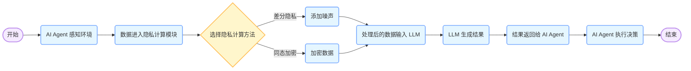

# AI Agent 的隐私计算：在保护数据隐私的同时应用 LLM

> 关键词：AI Agent、隐私计算、大语言模型（LLM）、数据保护、安全应用

> 摘要：本文聚焦于 AI Agent 的隐私计算，探讨在利用大语言模型（LLM）时如何有效保护数据隐私。首先介绍相关背景知识，包括目的范围、预期读者等内容。接着深入剖析核心概念及其联系，阐述核心算法原理并给出具体操作步骤，同时借助数学模型和公式进行详细讲解与举例说明。通过项目实战案例展示代码实现和解读，分析实际应用场景。推荐了学习资源、开发工具框架以及相关论文著作。最后总结未来发展趋势与挑战，还包含常见问题解答和扩展阅读参考资料，旨在为读者全面呈现 AI Agent 隐私计算在结合 LLM 应用时的技术全貌。

## 1. 背景介绍 
### 1.1 目的和范围
在当今数字化时代，数据已经成为一种重要的资产。大语言模型（LLM）如 GPT 系列、BLOOM 等展现出了强大的语言理解和生成能力，被广泛应用于各种领域，如智能客服、内容创作、知识问答等。然而，LLM 在处理数据时往往需要访问大量的信息，这就涉及到数据隐私的问题。用户的数据可能包含敏感信息，如个人身份、健康状况、商业机密等，如果这些数据在使用 LLM 的过程中被泄露，将给用户带来严重的损失。

AI Agent 作为一种能够自主执行任务的智能实体，在与 LLM 结合使用时，可以通过隐私计算技术来保护数据隐私。本文章的目的就是深入探讨如何在 AI Agent 应用 LLM 的过程中进行隐私计算，涵盖隐私计算的基本概念、核心算法、数学模型、实际应用案例等方面，为开发者和研究人员提供全面的技术指导。

### 1.2 预期读者
本文预期读者包括但不限于以下几类人群：
- **人工智能开发者**：希望在开发 AI Agent 应用时，能够更好地保护用户数据隐私，提升应用的安全性和可信度。
- **数据科学家**：对隐私计算技术感兴趣，想要了解如何将其应用于大语言模型，以解决数据隐私保护的问题。
- **安全专家**：关注数据安全和隐私保护领域，希望深入研究 AI Agent 和 LLM 结合场景下的隐私计算方法。
- **研究人员**：从事人工智能、密码学、隐私计算等相关领域的研究，需要获取最新的技术进展和研究成果。

### 1.3 文档结构概述
本文将按照以下结构进行组织：
- 核心概念与联系：介绍 AI Agent、隐私计算和 LLM 的基本概念，以及它们之间的联系。
- 核心算法原理 & 具体操作步骤：详细阐述隐私计算的核心算法，如差分隐私、同态加密等，并给出具体的操作步骤。
- 数学模型和公式 & 详细讲解 & 举例说明：通过数学模型和公式对隐私计算算法进行深入分析，并举例说明其应用。
- 项目实战：代码实际案例和详细解释说明：通过一个实际的项目案例，展示如何在 AI Agent 中应用隐私计算技术结合 LLM 进行开发。
- 实际应用场景：介绍 AI Agent 的隐私计算在不同领域的实际应用场景。
- 工具和资源推荐：推荐学习隐私计算和 LLM 相关的书籍、在线课程、技术博客和网站，以及开发工具框架和相关论文著作。
- 总结：未来发展趋势与挑战：总结 AI Agent 的隐私计算在结合 LLM 应用时的未来发展趋势和面临的挑战。
- 附录：常见问题与解答：解答读者在阅读过程中可能遇到的常见问题。
- 扩展阅读 & 参考资料：提供扩展阅读的建议和相关参考资料。

### 1.4 术语表
#### 1.4.1 核心术语定义
- **AI Agent（人工智能代理）**：一种能够感知环境、自主决策并执行任务的智能实体。它可以与用户、其他 Agent 或系统进行交互，以实现特定的目标。
- **隐私计算**：指在保护数据隐私的前提下，对数据进行分析、计算和挖掘的一系列技术和方法。
- **大语言模型（LLM）**：一种基于深度学习的语言模型，通过在大规模文本数据上进行训练，能够生成自然语言文本，具有强大的语言理解和生成能力。
- **差分隐私**：一种通过在数据中添加噪声来保护数据隐私的技术，使得在查询数据时，无法区分特定个体的数据是否被包含在查询结果中。
- **同态加密**：一种特殊的加密技术，允许在加密数据上进行特定的计算，而无需先解密数据，计算结果解密后与在明文数据上进行相同计算的结果相同。

#### 1.4.2 相关概念解释
- **数据隐私**：指个人或组织对其数据的控制权和保密性，包括数据的收集、存储、使用、共享和披露等方面的隐私保护。
- **安全多方计算（MPC）**：一种允许多个参与方在不泄露各自私有数据的情况下进行联合计算的技术。
- **零知识证明**：一种证明者能够在不向验证者泄露任何有用信息的情况下，证明某个论断是正确的技术。

#### 1.4.3 缩略词列表
- **LLM**：Large Language Model（大语言模型）
- **AI**：Artificial Intelligence（人工智能）
- **MPC**：Secure Multi - Party Computation（安全多方计算）
- **DP**：Differential Privacy（差分隐私）
- **HE**：Homomorphic Encryption（同态加密）

## 2. 核心概念与联系 

### 2.1 核心概念原理

#### 2.1.1 AI Agent
AI Agent 是一种能够自主感知环境、做出决策并执行相应动作的智能体。它通常由感知模块、决策模块和执行模块组成。感知模块负责收集环境信息，决策模块根据感知到的信息进行分析和推理，做出最优决策，执行模块则根据决策结果执行相应的动作。例如，一个智能客服 AI Agent 可以感知用户的提问（感知模块），通过自然语言处理和知识图谱等技术进行分析和推理，给出最佳的回答（决策模块），并将回答反馈给用户（执行模块）。

#### 2.1.2 隐私计算
隐私计算的核心原理是在不泄露原始数据的前提下，对数据进行分析和处理。其主要目的是保护数据所有者的隐私，同时又能让数据在一定程度上得到利用。差分隐私通过在数据中添加噪声来实现隐私保护，使得攻击者无法从查询结果中准确推断出某个个体的数据。同态加密则是在加密数据上进行计算，计算过程中数据始终保持加密状态，只有在需要结果时才进行解密，从而避免了数据在计算过程中的泄露。

#### 2.1.3 大语言模型（LLM）
大语言模型基于深度学习技术，通常采用 Transformer 架构。它通过在大规模的文本数据上进行无监督学习，学习到语言的模式和规律。LLM 可以接受文本输入，并生成与之相关的文本输出。例如，当输入一个问题时，LLM 可以根据其学习到的知识和模式生成相应的答案。

### 2.2 架构的文本示意图
```plaintext
             +----------------+
             |    AI Agent    |
             | +------------+ |
             | | 感知模块  | |
             | +------------+ |
             | +------------+ |
             | | 决策模块  | |
             | +------------+ |
             | +------------+ |
             | | 执行模块  | |
             | +------------+ |
             +----------------+
                   |           ^
                   |           |
                   v           |
        +----------------+      |
        | 隐私计算模块  | ------+
        +----------------+
                   |
                   v
        +----------------+
        |     LLM        |
        +----------------+
```

### 2.3 Mermaid 流程图


## 3. 核心算法原理 & 具体操作步骤 

### 3.1 差分隐私算法原理及 Python 实现

#### 3.1.1 原理
差分隐私的核心思想是在数据中添加噪声，使得查询结果的变化不会因为某个个体数据的加入或删除而产生显著影响。常用的噪声分布是拉普拉斯分布。对于一个查询函数 $f(x)$，其中 $x$ 是数据集，差分隐私机制 $M(x)$ 定义为 $M(x)=f(x)+\text{Lap}(\frac{\Delta f}{\epsilon})$，其中 $\Delta f$ 是查询函数 $f$ 的敏感度，$\epsilon$ 是隐私预算。敏感度 $\Delta f$ 表示当数据集 $x$ 中一个个体数据发生变化时，查询函数 $f(x)$ 的最大变化量。

#### 3.1.2 Python 代码实现
```python
import numpy as np

def laplace_mechanism(data, epsilon, sensitivity):
    """
    实现差分隐私的拉普拉斯机制
    :param data: 原始数据
    :param epsilon: 隐私预算
    :param sensitivity: 查询函数的敏感度
    :return: 添加噪声后的数据
    """
    noise = np.random.laplace(0, sensitivity / epsilon)
    return data + noise

# 示例使用
original_data = 10
epsilon = 0.1
sensitivity = 1
noisy_data = laplace_mechanism(original_data, epsilon, sensitivity)
print(f"原始数据: {original_data}, 添加噪声后的数据: {noisy_data}")
```

### 3.2 同态加密算法原理及 Python 实现

#### 3.2.1 原理
同态加密允许在加密数据上进行特定的计算，而无需先解密数据。以 Paillier 同态加密为例，它支持加法同态和数乘同态。设 $E(m)$ 表示对明文 $m$ 的加密结果，对于两个明文 $m_1$ 和 $m_2$，有 $E(m_1) \cdot E(m_2)=E(m_1 + m_2)$；对于一个明文 $m$ 和一个整数 $k$，有 $E(m)^k = E(k \cdot m)$。

#### 3.2.2 Python 代码实现
```python
from phe import paillier

# 生成公钥和私钥
public_key, private_key = paillier.generate_paillier_keypair()

# 明文数据
m1 = 5
m2 = 3

# 加密数据
encrypted_m1 = public_key.encrypt(m1)
encrypted_m2 = public_key.encrypt(m2)

# 在加密数据上进行加法运算
encrypted_sum = encrypted_m1 + encrypted_m2

# 解密结果
decrypted_sum = private_key.decrypt(encrypted_sum)

print(f"明文相加结果: {m1 + m2}, 同态加密计算结果: {decrypted_sum}")
```

### 3.3 具体操作步骤

#### 3.3.1 差分隐私操作步骤
1. **确定查询函数和敏感度**：明确需要对数据进行的查询操作，并计算查询函数的敏感度。
2. **设置隐私预算 $\epsilon$**：根据实际需求和隐私保护的要求，选择合适的隐私预算。
3. **添加噪声**：使用拉普拉斯机制在查询结果中添加噪声。
4. **返回处理后的数据**：将添加噪声后的数据作为最终的查询结果返回。

#### 3.3.2 同态加密操作步骤
1. **生成密钥对**：使用同态加密算法生成公钥和私钥。
2. **加密数据**：使用公钥对需要处理的数据进行加密。
3. **在加密数据上进行计算**：根据同态加密算法的特性，在加密数据上进行允许的计算。
4. **解密结果**：使用私钥对计算结果进行解密，得到最终的明文结果。

## 4. 数学模型和公式 & 详细讲解 & 举例说明 

### 4.1 差分隐私的数学模型和公式

#### 4.1.1 差分隐私定义
设 $\mathcal{X}$ 是所有可能的数据集的集合，$\mathcal{R}$ 是查询结果的集合。一个随机算法 $M: \mathcal{X} \to \mathcal{R}$ 满足 $\epsilon$-差分隐私，如果对于任意两个相邻的数据集 $x, x' \in \mathcal{X}$（即 $x$ 和 $x'$ 只有一个个体数据不同），以及任意的 $S \subseteq \mathcal{R}$，有
$$
\frac{\Pr[M(x) \in S]}{\Pr[M(x') \in S]} \leq e^{\epsilon}
$$
其中 $\epsilon$ 是隐私预算，$\epsilon$ 越小，隐私保护程度越高。

#### 4.1.2 拉普拉斯机制
对于一个实值查询函数 $f: \mathcal{X} \to \mathbb{R}$，其敏感度 $\Delta f$ 定义为
$$
\Delta f = \max_{x, x' \in \mathcal{X}, |x - x'| = 1} |f(x) - f(x')|
$$
拉普拉斯机制 $M(x)$ 定义为
$$
M(x) = f(x) + \text{Lap}(\frac{\Delta f}{\epsilon})
$$
其中 $\text{Lap}(\mu, b)$ 表示均值为 $\mu$，尺度参数为 $b$ 的拉普拉斯分布。

#### 4.1.3 举例说明
假设有一个数据集 $x = \{1, 2, 3, 4, 5\}$，我们要查询数据集中所有元素的和。查询函数 $f(x)=\sum_{i=1}^{n}x_i$，其中 $n$ 是数据集的大小。对于相邻的数据集 $x' = \{1, 2, 3, 4, 6\}$，敏感度 $\Delta f = |f(x') - f(x)| = |21 - 15| = 6$。

设隐私预算 $\epsilon = 0.1$，则需要添加的噪声服从拉普拉斯分布 $\text{Lap}(\frac{6}{0.1})=\text{Lap}(60)$。假设添加的噪声为 $n = 10$，则添加噪声后的查询结果为 $f(x)+n = 15 + 10 = 25$。

### 4.2 同态加密的数学模型和公式

#### 4.2.1 Paillier 同态加密
Paillier 同态加密的密钥生成过程如下：
- 选择两个大素数 $p$ 和 $q$，计算 $n = pq$ 和 $\lambda = \text{lcm}(p - 1, q - 1)$。
- 选择一个随机整数 $g \in \mathbb{Z}_{n^2}^*$，使得 $\gcd(L(g^{\lambda} \bmod n^2), n) = 1$，其中 $L(u)=\frac{u - 1}{n}$。
- 公钥为 $(n, g)$，私钥为 $(\lambda)$。

加密过程：对于明文 $m \in \mathbb{Z}_n$，选择一个随机整数 $r \in \mathbb{Z}_n^*$，加密结果 $c = g^m r^n \bmod n^2$。

解密过程：对于密文 $c \in \mathbb{Z}_{n^2}^*$，明文 $m = \frac{L(c^{\lambda} \bmod n^2)}{L(g^{\lambda} \bmod n^2)} \bmod n$。

加法同态：设 $c_1 = E(m_1)$ 和 $c_2 = E(m_2)$ 是两个密文，则 $c_1 \cdot c_2 = E(m_1 + m_2)$。

数乘同态：设 $c = E(m)$ 是一个密文，$k$ 是一个整数，则 $c^k = E(k \cdot m)$。

#### 4.2.2 举例说明
假设 $p = 3$，$q = 5$，则 $n = pq = 15$，$\lambda = \text{lcm}(2, 4) = 4$。选择 $g = 2$，计算 $L(g^{\lambda} \bmod n^2)=L(16 \bmod 225)=L(16)=\frac{16 - 1}{15}=1$，$\gcd(1, 15) = 1$，公钥为 $(15, 2)$，私钥为 $(4)$。

设明文 $m_1 = 2$，$m_2 = 3$，选择随机数 $r_1 = 4$，$r_2 = 5$。
- 加密 $m_1$：$c_1 = g^{m_1} r_1^n \bmod n^2 = 2^2 \cdot 4^{15} \bmod 225 = 4 \cdot 163 \bmod 225 = 652 \bmod 225 = 197$。
- 加密 $m_2$：$c_2 = g^{m_2} r_2^n \bmod n^2 = 2^3 \cdot 5^{15} \bmod 225 = 8 \cdot 125 \bmod 225 = 1000 \bmod 225 = 100$。

在加密数据上进行加法运算：$c = c_1 \cdot c_2 \bmod n^2 = 197 \cdot 100 \bmod 225 = 19700 \bmod 225 = 125$。

解密 $c$：$m = \frac{L(c^{\lambda} \bmod n^2)}{L(g^{\lambda} \bmod n^2)} \bmod n = \frac{L(125^4 \bmod 225)}{1} \bmod 15 = \frac{L(625)}{1} \bmod 15 = \frac{625 - 1}{15} \bmod 15 = 41 \bmod 15 = 5$，而 $m_1 + m_2 = 2 + 3 = 5$，验证了加法同态的正确性。

## 5. 项目实战：代码实际案例和详细解释说明 

### 5.1  开发环境搭建
#### 5.1.1 安装 Python
确保你的系统上已经安装了 Python 3.7 或更高版本。可以从 Python 官方网站（https://www.python.org/downloads/）下载并安装适合你操作系统的 Python 版本。

#### 5.1.2 安装必要的库
在项目中，我们将使用 `numpy` 进行数值计算，`phe` 库进行同态加密，`transformers` 库调用大语言模型。可以使用以下命令进行安装：
```bash
pip install numpy phe transformers
```

### 5.2  源代码详细实现和代码解读
以下是一个简单的项目案例，展示了如何在 AI Agent 中应用差分隐私和同态加密技术结合 LLM 进行开发。

```python
import numpy as np
from phe import paillier
from transformers import AutoTokenizer, AutoModelForCausalLM

# 差分隐私函数
def laplace_mechanism(data, epsilon, sensitivity):
    noise = np.random.laplace(0, sensitivity / epsilon)
    return data + noise

# 同态加密函数
def encrypt_data(data, public_key):
    return public_key.encrypt(data)

def decrypt_data(encrypted_data, private_key):
    return private_key.decrypt(encrypted_data)

# 初始化大语言模型
tokenizer = AutoTokenizer.from_pretrained("gpt2")
model = AutoModelForCausalLM.from_pretrained("gpt2")

# 生成同态加密密钥对
public_key, private_key = paillier.generate_paillier_keypair()

# 模拟 AI Agent 接收到的数据
original_data = 10
sensitivity = 1
epsilon = 0.1

# 应用差分隐私
noisy_data = laplace_mechanism(original_data, epsilon, sensitivity)

# 加密数据
encrypted_data = encrypt_data(noisy_data, public_key)

# 将加密数据转换为字符串输入到 LLM
input_text = f"The encrypted data is {encrypted_data.ciphertext()}"
input_ids = tokenizer.encode(input_text, return_tensors='pt')

# 使用 LLM 生成结果
output = model.generate(input_ids, max_length=50, num_beams=5, no_repeat_ngram_size=2, early_stopping=True)
generated_text = tokenizer.decode(output[0], skip_special_tokens=True)

# 解密结果（这里只是示例，LLM 输出可能不是可解密的加密数据）
# 假设我们提取出加密结果并转换为 paillier.EncryptedNumber 对象
# 实际情况需要根据 LLM 输出的格式进行处理
# encrypted_result = paillier.EncryptedNumber(public_key, ciphertext, exponent=0)
# decrypted_result = decrypt_data(encrypted_result, private_key)

print(f"原始数据: {original_data}")
print(f"添加噪声后的数据: {noisy_data}")
print(f"加密数据: {encrypted_data.ciphertext()}")
print(f"LLM 生成的文本: {generated_text}")
```

### 5.3  代码解读与分析
- **差分隐私部分**：`laplace_mechanism` 函数实现了差分隐私的拉普拉斯机制，通过在原始数据中添加拉普拉斯噪声来保护数据隐私。
- **同态加密部分**：`encrypt_data` 和 `decrypt_data` 函数分别实现了数据的加密和解密操作，使用 Paillier 同态加密算法。
- **大语言模型部分**：使用 `transformers` 库加载 GPT - 2 模型，将加密后的数据转换为文本输入到模型中，生成相应的文本结果。
- **整体流程**：AI Agent 接收到原始数据后，先应用差分隐私添加噪声，然后对噪声数据进行同态加密，将加密数据作为输入传递给 LLM 生成结果。虽然在这个示例中，LLM 输出可能不是可解密的加密数据，但在实际应用中，可以根据具体需求设计合适的输入和输出格式，使得 LLM 能够在加密数据上进行有意义的计算。

## 6. 实际应用场景 
### 6.1 医疗健康领域
在医疗健康领域，患者的病历数据包含大量敏感信息，如疾病诊断、治疗方案、个人健康状况等。AI Agent 可以利用隐私计算技术结合 LLM 对这些数据进行分析和处理。例如，医院可以使用 AI Agent 收集患者的加密病历数据，通过差分隐私和同态加密技术在不泄露患者隐私的情况下，将加密数据输入到 LLM 中进行疾病预测、治疗方案推荐等任务。医生可以根据 LLM 生成的结果为患者提供更准确的医疗建议，同时保护患者的隐私。

### 6.2 金融领域
金融机构拥有大量客户的金融数据，如账户信息、交易记录、信用评分等。为了保护客户的隐私，AI Agent 可以在隐私计算的框架下应用 LLM。例如，银行可以使用 AI Agent 对客户的加密交易数据进行分析，通过同态加密技术在加密数据上进行风险评估和欺诈检测。LLM 可以根据加密数据生成风险报告和预警信息，帮助银行及时发现潜在的风险，同时确保客户数据的安全性。

### 6.3 教育领域
在教育领域，学生的学习数据如成绩、学习习惯、作业完成情况等属于敏感信息。AI Agent 可以利用隐私计算技术结合 LLM 对这些数据进行分析，为学生提供个性化的学习建议。例如，学校可以使用 AI Agent 收集学生的加密学习数据，通过差分隐私技术保护学生的隐私，将加密数据输入到 LLM 中进行学习分析。LLM 可以根据学生的学习情况生成个性化的学习计划和辅导建议，帮助学生提高学习效果。

### 6.4 商业领域
企业在市场调研、客户分析等方面需要处理大量的用户数据。AI Agent 可以通过隐私计算技术结合 LLM 对这些数据进行分析，为企业提供决策支持。例如，电商企业可以使用 AI Agent 收集用户的加密浏览记录和购买行为数据，通过同态加密技术在加密数据上进行用户画像和市场趋势分析。LLM 可以根据加密数据生成市场调研报告和营销策略建议，帮助企业更好地了解市场需求，制定合理的商业策略，同时保护用户的隐私。

## 7. 工具和资源推荐
### 7.1 学习资源推荐
#### 7.1.1 书籍推荐
- 《隐私计算：原理、技术与应用》：全面介绍了隐私计算的基本原理、核心技术和实际应用案例，是学习隐私计算的经典书籍。
- 《深度学习》：由 Ian Goodfellow、Yoshua Bengio 和 Aaron Courville 撰写，是深度学习领域的权威教材，对理解大语言模型的原理和架构有很大帮助。
- 《人工智能：一种现代方法》：涵盖了人工智能的各个方面，包括 AI Agent 的设计和实现，是学习人工智能的优秀入门书籍。

#### 7.1.2 在线课程
- Coursera 上的 “Privacy Engineering Specialization”：该课程由宾夕法尼亚大学提供，深入讲解了隐私工程的理论和实践，包括差分隐私、同态加密等隐私计算技术。
- edX 上的 “Deep Learning Specialization”：由 Andrew Ng 教授主讲，系统地介绍了深度学习的基本概念、算法和应用，对学习大语言模型有很大的帮助。
- Udemy 上的 “AI and Machine Learning for Beginners”：适合初学者入门人工智能和机器学习，课程内容包括 AI Agent 的基础知识和实际应用案例。

#### 7.1.3 技术博客和网站
- Towards Data Science：是一个专注于数据科学和机器学习的技术博客平台，上面有很多关于隐私计算、大语言模型和 AI Agent 的高质量文章。
- arXiv：是一个预印本论文库，提供了大量最新的学术研究成果，包括隐私计算和人工智能领域的前沿论文。
- Medium：是一个综合性的写作平台，有很多技术专家和学者在上面分享关于隐私计算和 AI 的经验和见解。

### 7.2 开发工具框架推荐
#### 7.2.1 IDE和编辑器
- PyCharm：是一款专门为 Python 开发设计的集成开发环境（IDE），具有强大的代码编辑、调试和自动补全功能，适合开发 AI Agent 和隐私计算相关的项目。
- Jupyter Notebook：是一个交互式的开发环境，支持 Python、R 等多种编程语言，非常适合进行数据分析和模型实验，在学习和开发隐私计算和大语言模型项目时非常有用。
- Visual Studio Code：是一款轻量级的代码编辑器，具有丰富的插件生态系统，可以方便地进行 Python 开发和调试，同时支持 Markdown 文档编写，适合编写技术博客和项目文档。

#### 7.2.2 调试和性能分析工具
- pdb：是 Python 自带的调试器，可以帮助开发者在代码执行过程中进行调试，定位和解决问题。
- cProfile：是 Python 标准库中的性能分析工具，可以统计代码中各个函数的执行时间和调用次数，帮助开发者找出性能瓶颈。
- TensorBoard：是 TensorFlow 提供的可视化工具，也可以用于 PyTorch 项目，能够直观地展示模型的训练过程、性能指标等信息，方便开发者进行模型调试和优化。

#### 7.2.3 相关框架和库
- TensorFlow：是一个广泛使用的深度学习框架，提供了丰富的工具和接口，支持开发各种类型的神经网络模型，包括大语言模型。
- PyTorch：是另一个流行的深度学习框架，具有动态图机制，易于使用和调试，在学术界和工业界都有广泛的应用。
- TenSEAL：是一个基于 CKKS 和 BFV 同态加密方案的 Python 库，提供了高效的同态加密计算功能，适合开发隐私计算相关的项目。

### 7.3 相关论文著作推荐
#### 7.3.1 经典论文
- “Differential Privacy” by Cynthia Dwork：是差分隐私领域的开创性论文，详细介绍了差分隐私的定义、原理和应用。
- “Public-Key Cryptosystems Based on Composite Degree Residuosity Classes” by Pascal Paillier：提出了 Paillier 同态加密算法，是同态加密领域的经典论文。
- “Attention Is All You Need” by Ashish Vaswani et al.：介绍了 Transformer 架构，是大语言模型发展的重要里程碑。

#### 7.3.2 最新研究成果
- 可以关注 arXiv 上关于 “Privacy - Preserving Machine Learning”、“Large Language Models” 和 “AI Agents” 等主题的最新论文，了解隐私计算和大语言模型领域的最新研究进展。
- 参加顶级学术会议如 NeurIPS、ICML、ACL 等，这些会议上会有很多关于隐私计算、大语言模型和 AI Agent 的前沿研究成果发表。

#### 7.3.3 应用案例分析
- 可以参考一些企业和研究机构发布的应用案例报告，了解隐私计算和大语言模型在实际场景中的应用效果和挑战。例如，金融机构发布的关于隐私计算在风险评估中的应用案例，医疗企业发布的关于隐私计算在医疗数据分析中的应用案例等。

## 8. 总结：未来发展趋势与挑战
### 8.1 未来发展趋势
#### 8.1.1 隐私计算与大语言模型的深度融合
未来，隐私计算技术将与大语言模型更加紧密地结合。一方面，隐私计算技术将进一步优化，使得大语言模型能够在更高效、更安全的隐私保护机制下处理数据。例如，开发更复杂的差分隐私机制和同态加密算法，以满足大语言模型对大规模数据处理的需求。另一方面，大语言模型也将为隐私计算提供更强大的分析和推理能力，帮助更好地理解和处理加密数据。

#### 8.1.2 AI Agent 的智能化和自主化
AI Agent 将变得更加智能化和自主化，能够在不同的场景中自动选择合适的隐私计算方法和大语言模型进行任务处理。例如，AI Agent 可以根据数据的敏感程度、任务的需求和可用的计算资源，动态地调整隐私预算和加密算法，以实现最优的隐私保护和性能平衡。

#### 8.1.3 跨领域应用的拓展
AI Agent 的隐私计算结合大语言模型的应用将从目前的医疗、金融、教育等领域拓展到更多的行业，如交通、能源、娱乐等。在交通领域，AI Agent 可以利用隐私计算技术处理车辆的行驶数据和乘客的个人信息，同时使用大语言模型进行交通流量预测和智能导航。在能源领域，AI Agent 可以对能源消耗数据进行隐私保护处理，并通过大语言模型进行能源管理和优化。

### 8.2 挑战
#### 8.2.1 性能开销问题
隐私计算技术如差分隐私和同态加密通常会带来一定的性能开销。在处理大规模数据和复杂计算任务时，这种性能开销可能会导致系统响应时间变长，计算效率降低。例如，同态加密的计算复杂度较高，在进行大规模数据的加密和解密操作时，会消耗大量的计算资源和时间。如何在保证隐私保护的前提下，降低性能开销，提高系统的计算效率，是一个亟待解决的问题。

#### 8.2.2 数据质量和可用性
隐私计算技术在保护数据隐私的同时，可能会对数据的质量和可用性产生一定的影响。例如，差分隐私通过添加噪声来保护数据隐私，但噪声的添加可能会导致数据的准确性下降，影响大语言模型的训练和预测效果。如何在隐私保护和数据质量、可用性之间找到一个平衡点，是一个挑战。

#### 8.2.3 安全漏洞和攻击风险
尽管隐私计算技术提供了一定的安全保障，但仍然存在安全漏洞和攻击风险。例如，攻击者可能会通过分析差分隐私添加的噪声模式，尝试推断出原始数据的信息；或者利用同态加密算法中的漏洞，对加密数据进行破解。如何加强隐私计算系统的安全性，防范各种安全攻击，是未来发展需要关注的重要问题。

#### 8.2.4 法律法规和伦理问题
随着隐私计算和大语言模型的广泛应用，相关的法律法规和伦理问题也日益凸显。例如，不同国家和地区对数据隐私保护的法律法规存在差异，如何确保 AI Agent 在不同的法律环境下合法合规地应用隐私计算技术和大语言模型是一个挑战。此外，还需要考虑伦理问题，如数据的使用是否符合道德规范，是否会对个人和社会造成不良影响等。

## 9. 附录：常见问题与解答
### 9.1 差分隐私和同态加密有什么区别？
差分隐私是通过在数据中添加噪声来保护数据隐私，使得攻击者无法从查询结果中准确推断出某个个体的数据。它主要关注的是数据查询结果的隐私保护，对数据的可用性影响相对较小，但可能会降低数据的准确性。同态加密则是一种特殊的加密技术，允许在加密数据上进行特定的计算，而无需先解密数据。它能够在数据加密的状态下进行计算，提供了更高的隐私保护级别，但计算复杂度较高，性能开销较大。

### 9.2 如何选择合适的隐私计算方法？
选择合适的隐私计算方法需要考虑多个因素，如数据的敏感程度、计算任务的需求、可用的计算资源等。如果数据的敏感程度较低，且对计算效率要求较高，可以选择差分隐私方法；如果数据的敏感程度较高，且需要在加密数据上进行复杂的计算，可以选择同态加密方法。此外，还可以根据实际情况将不同的隐私计算方法结合使用，以达到更好的隐私保护和性能平衡。

### 9.3 大语言模型在隐私计算中有什么作用？
大语言模型在隐私计算中可以发挥重要作用。一方面，大语言模型可以对加密数据进行分析和推理，帮助提取有价值的信息。例如，在医疗领域，大语言模型可以对加密的病历数据进行疾病诊断和治疗方案推荐。另一方面，大语言模型可以通过学习隐私计算技术的规则和策略，自动选择合适的隐私计算方法和参数，提高隐私计算的效率和准确性。

### 9.4 隐私计算会影响大语言模型的性能吗？
隐私计算可能会对大语言模型的性能产生一定的影响。例如，差分隐私添加的噪声可能会降低数据的质量，从而影响大语言模型的训练和预测效果；同态加密的计算复杂度较高，会增加大语言模型的计算时间和资源消耗。然而，通过合理选择隐私计算方法和参数，以及优化大语言模型的架构和算法，可以在一定程度上降低这种影响，实现隐私保护和性能的平衡。

## 10. 扩展阅读 & 参考资料
### 10.1 扩展阅读
- 《密码学原理与实践》：深入介绍了密码学的基本原理和算法，对于理解隐私计算中的加密技术有很大帮助。
- 《自然语言处理入门》：系统地介绍了自然语言处理的基本概念、算法和应用，有助于进一步了解大语言模型的工作原理和应用场景。
- 《智能体系统：原理、设计与应用》：详细阐述了 AI Agent 的设计和实现方法，以及在不同领域的应用案例。

### 10.2 参考资料
- Dwork, C. (2006). Differential privacy. In Automata, Languages and Programming (pp. 1 - 12). Springer, Berlin, Heidelberg.
- Paillier, P. (1999, May). Public - key cryptosystems based on composite degree residuosity classes. In International conference on the theory and applications of cryptographic techniques (pp. 223 - 238). Springer, Berlin, Heidelberg.
- Vaswani, A., Shazeer, N., Parmar, N., Uszkoreit, J., Jones, L., Gomez, A. N.,... & Polosukhin, I. (2017). Attention is all you need. Advances in neural information processing systems, 30.

作者：AI天才研究院/AI Genius Institute & 禅与计算机程序设计艺术 /Zen And The Art of Computer Programming