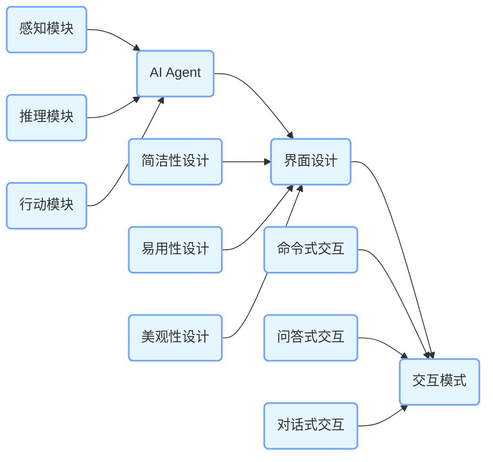

# AI Agent与人类协作：界面设计与交互模式

> 关键词：AI Agent、人类协作、界面设计、交互模式、人机交互

> 摘要：本文深入探讨了AI Agent与人类协作过程中的界面设计与交互模式。首先介绍了研究的背景、目的、预期读者和文档结构等信息。接着阐述了AI Agent、界面设计和交互模式的核心概念及它们之间的联系，并给出了相应的示意图和流程图。然后详细讲解了相关的核心算法原理，结合Python代码进行说明，同时介绍了涉及的数学模型和公式。通过项目实战部分，展示了开发环境搭建、源代码实现及代码解读。还列举了实际应用场景，推荐了学习资源、开发工具框架和相关论文著作。最后总结了未来发展趋势与挑战，提供了常见问题解答和扩展阅读参考资料，旨在为从事人机交互、界面设计等相关领域的人员提供全面且深入的技术指导。

## 1. 背景介绍 
### 1.1 目的和范围
随着人工智能技术的飞速发展，AI Agent在各个领域的应用越来越广泛。AI Agent与人类协作的场景也日益增多，例如智能客服、智能办公助手等。然而，如何设计出高效、友好的界面以及合适的交互模式，以促进AI Agent与人类的良好协作，仍然是一个亟待解决的问题。本文的目的在于深入研究AI Agent与人类协作中的界面设计和交互模式，探讨其原理、方法和实践应用。范围涵盖了从核心概念的阐述到具体项目实战，以及相关工具资源的推荐等多个方面。

### 1.2 预期读者
本文预期读者包括人机交互领域的研究人员、界面设计师、AI开发工程师、对AI Agent与人类协作感兴趣的技术爱好者等。对于研究人员，本文可以为其提供新的研究思路和理论参考；对于设计师，能帮助他们设计出更符合用户需求和人机协作特点的界面；对于开发工程师，可指导他们实现更高效的交互功能；对于技术爱好者，则能让他们了解该领域的前沿知识和实践经验。

### 1.3 文档结构概述
本文将按照以下结构进行阐述：首先介绍核心概念与联系，让读者对AI Agent、界面设计和交互模式有清晰的认识；接着讲解核心算法原理和具体操作步骤，结合Python代码进行详细说明；然后介绍相关的数学模型和公式，并举例说明；通过项目实战部分，展示如何在实际中应用这些理论和技术；列举实际应用场景，让读者了解该领域的应用方向；推荐相关的工具和资源，帮助读者进一步学习和实践；最后总结未来发展趋势与挑战，提供常见问题解答和扩展阅读参考资料。

### 1.4 术语表
#### 1.4.1 核心术语定义
- **AI Agent**：指具有一定智能和自主性的软件实体，能够感知环境、进行推理和决策，并采取行动以实现特定目标。
- **界面设计**：是指对软件或系统的用户界面进行规划、设计和美化，以提高用户体验和交互效率。
- **交互模式**：是指AI Agent与人类之间进行信息交流和协作的方式和规则。

#### 1.4.2 相关概念解释
- **人机交互**：研究人和计算机之间的信息交换和相互作用的学科，包括用户如何使用计算机以及计算机如何向用户提供信息和反馈。
- **自然语言处理**：是人工智能的一个分支，研究如何让计算机理解和处理人类语言，实现人机之间的自然语言交互。

#### 1.4.3 缩略词列表
- **NLP**：Natural Language Processing，自然语言处理
- **UI**：User Interface，用户界面

## 2. 核心概念与联系 
### 核心概念原理
#### AI Agent
AI Agent是基于人工智能技术构建的智能实体。它通常包含感知模块、推理模块和行动模块。感知模块用于获取环境信息，例如通过语音识别、图像识别等技术获取用户输入；推理模块则根据感知到的信息进行分析和决策，这可能涉及到机器学习、深度学习等算法；行动模块根据推理结果采取相应的行动，如输出文本、执行任务等。

#### 界面设计
界面设计的核心原理是以人为本，要充分考虑用户的需求、认知能力和操作习惯。良好的界面设计应该具有简洁性、易用性和美观性。简洁性意味着界面元素不应过于复杂，避免给用户造成视觉和认知负担；易用性要求界面操作方便快捷，符合用户的操作逻辑；美观性则能提升用户的使用体验和满意度。

#### 交互模式
交互模式是AI Agent与人类协作的桥梁。常见的交互模式包括命令式交互、问答式交互、对话式交互等。命令式交互是用户直接向AI Agent下达明确的命令，AI Agent执行相应的操作；问答式交互是用户提出问题，AI Agent给出答案；对话式交互则更强调自然流畅的对话过程，类似于人与人之间的交流。

### 架构的文本示意图
```plaintext
           +-----------------+
           |    AI Agent     |
           | +-------------+ |
           | | 感知模块    | |
           | +-------------+ |
           | | 推理模块    | |
           | +-------------+ |
           | | 行动模块    | |
           | +-------------+ |
           +-----------------+
                   |
                   |
           +-----------------+
           |    界面设计     |
           | +-------------+ |
           | | 简洁性设计  | |
           | +-------------+ |
           | | 易用性设计  | |
           | +-------------+ |
           | | 美观性设计  | |
           | +-------------+ |
           +-----------------+
                   |
                   |
           +-----------------+
           |    交互模式     |
           | +-------------+ |
           | | 命令式交互  | |
           | +-------------+ |
           | | 问答式交互  | |
           | +-------------+ |
           | | 对话式交互  | |
           | +-------------+ |
           +-----------------+
```

### Mermaid流程图


## 3. 核心算法原理 & 具体操作步骤 
### 核心算法原理
在AI Agent与人类协作的过程中，自然语言处理算法起着关键作用。例如，在对话式交互中，需要对用户输入的自然语言进行理解和处理。下面以简单的文本分类算法为例进行说明，文本分类可以用于判断用户的意图，如判断用户是在询问信息、下达命令还是进行闲聊等。

#### 朴素贝叶斯算法原理
朴素贝叶斯算法是一种基于贝叶斯定理的简单概率分类器。它假设特征之间相互独立，通过计算每个类别的后验概率，选择后验概率最大的类别作为分类结果。

贝叶斯定理公式为：
$P(C|X)=\frac{P(X|C)P(C)}{P(X)}$

其中，$P(C|X)$ 是在给定特征 $X$ 的情况下，类别 $C$ 的后验概率；$P(X|C)$ 是在类别 $C$ 下特征 $X$ 的条件概率；$P(C)$ 是类别 $C$ 的先验概率；$P(X)$ 是特征 $X$ 的先验概率。

在文本分类中，$X$ 可以表示文本中的词向量，$C$ 表示不同的类别。

### 具体操作步骤
#### 步骤1：数据准备
收集和整理文本数据，并进行标注，将文本分为不同的类别。例如，对于一个智能客服系统，可以将用户的问题分为“产品咨询”、“故障报修”、“投诉建议”等类别。

#### 步骤2：特征提取
将文本转换为计算机可以处理的特征向量。常用的方法是词袋模型，即将文本中的每个词看作一个特征，统计每个词在文本中出现的频率。

#### 步骤3：模型训练
使用训练数据对朴素贝叶斯模型进行训练，计算每个类别的先验概率和条件概率。

#### 步骤4：模型预测
使用训练好的模型对新的文本进行分类预测。

### Python源代码实现
```python
import numpy as np
from sklearn.feature_extraction.text import CountVectorizer
from sklearn.naive_bayes import MultinomialNB

# 步骤1：数据准备
corpus = [
    "我想了解一下你们的产品价格",
    "我的设备出现故障了，需要报修",
    "我对你们的服务不满意，要投诉",
    "这个产品有哪些功能",
    "设备无法开机，请求维修"
]
labels = ["产品咨询", "故障报修", "投诉建议", "产品咨询", "故障报修"]

# 步骤2：特征提取
vectorizer = CountVectorizer()
X = vectorizer.fit_transform(corpus)

# 步骤3：模型训练
clf = MultinomialNB()
clf.fit(X, labels)

# 步骤4：模型预测
new_text = ["这个产品的保修期是多久"]
new_X = vectorizer.transform(new_text)
predicted_label = clf.predict(new_X)
print("预测结果：", predicted_label[0])
```

### 代码解释
- `CountVectorizer` 用于将文本转换为词频矩阵，实现特征提取。
- `MultinomialNB` 是朴素贝叶斯算法的实现，用于模型训练和预测。
- 通过 `fit` 方法对模型进行训练，`predict` 方法对新的文本进行预测。

## 4. 数学模型和公式 & 详细讲解 & 举例说明 
### 贝叶斯定理公式详细讲解
贝叶斯定理公式 $P(C|X)=\frac{P(X|C)P(C)}{P(X)}$ 是朴素贝叶斯算法的核心。

- **$P(C)$：先验概率**
先验概率是在没有任何额外信息的情况下，类别 $C$ 出现的概率。例如，在一个文本分类任务中，如果有 100 个文本样本，其中“产品咨询”类别的样本有 30 个，那么“产品咨询”类别的先验概率 $P(产品咨询)=\frac{30}{100}=0.3$。

- **$P(X|C)$：条件概率**
条件概率是在类别 $C$ 下特征 $X$ 出现的概率。在文本分类中，假设“产品咨询”类别中有 20 个样本包含“价格”这个词，而“产品咨询”类别的样本总数是 30 个，那么在“产品咨询”类别下“价格”这个词出现的条件概率 $P(价格|产品咨询)=\frac{20}{30}\approx0.67$。

- **$P(X)$：特征先验概率**
特征先验概率是特征 $X$ 在所有样本中出现的概率。计算方法是统计包含特征 $X$ 的样本数占总样本数的比例。

- **$P(C|X)$：后验概率**
后验概率是在给定特征 $X$ 的情况下，类别 $C$ 出现的概率。朴素贝叶斯算法通过计算每个类别的后验概率，选择后验概率最大的类别作为分类结果。

### 举例说明
假设有一个简单的文本分类任务，要判断一条文本是关于“体育”还是“科技”。我们有以下训练数据：

| 文本 | 类别 |
| --- | --- |
| 篮球比赛很精彩 | 体育 |
| 新款手机发布 | 科技 |
| 足球世界杯 | 体育 |
| 人工智能发展迅速 | 科技 |

现在有一条新的文本“智能手机功能强大”，我们要使用朴素贝叶斯算法进行分类。

#### 步骤1：计算先验概率
- 体育类别的样本数为 2，总样本数为 4，所以 $P(体育)=\frac{2}{4}=0.5$。
- 科技类别的样本数为 2，总样本数为 4，所以 $P(科技)=\frac{2}{4}=0.5$。

#### 步骤2：计算条件概率
假设我们使用词袋模型，将文本拆分为词。新文本包含“智能手机”和“功能强大”两个词。

- 在体育类别中，“智能手机”出现的次数为 0，所以 $P(智能手机|体育)=0$；“功能强大”出现的次数为 0，所以 $P(功能强大|体育)=0$。
- 在科技类别中，“智能手机”出现的次数为 1，科技类样本数为 2，所以 $P(智能手机|科技)=\frac{1}{2}=0.5$；“功能强大”出现的次数为 0，所以 $P(功能强大|科技)=0$。

#### 步骤3：计算后验概率
由于 $P(智能手机|体育)=0$，所以 $P(体育|智能手机,功能强大)=0$。

$P(科技|智能手机,功能强大)=\frac{P(智能手机|科技)P(功能强大|科技)P(科技)}{P(智能手机,功能强大)}$

因为 $P(功能强大|科技)=0$，所以 $P(科技|智能手机,功能强大)=0$。

在实际应用中，为了避免概率为 0 的情况，通常会使用拉普拉斯平滑等方法进行处理。

## 5. 项目实战：代码实际案例和详细解释说明 
### 5.1  开发环境搭建
#### 安装Python
首先需要安装Python环境，建议使用Python 3.6及以上版本。可以从Python官方网站（https://www.python.org/downloads/）下载安装包，按照安装向导进行安装。

#### 安装必要的库
使用以下命令安装必要的库：
```bash
pip install numpy scikit-learn
```

#### 选择开发工具
可以选择使用PyCharm、Jupyter Notebook等开发工具。PyCharm是一款功能强大的Python集成开发环境，适合大型项目开发；Jupyter Notebook则更适合交互式开发和数据分析。

### 5.2  源代码详细实现和代码解读
下面是一个更完整的AI Agent与人类协作的文本分类项目示例，用于判断用户输入的文本是属于“问候”、“问题咨询”还是“任务请求”类别。

```python
import numpy as np
from sklearn.feature_extraction.text import TfidfVectorizer
from sklearn.naive_bayes import MultinomialNB
from sklearn.pipeline import Pipeline

# 步骤1：数据准备
corpus = [
    "你好",
    "今天天气怎么样",
    "帮我订一张机票",
    "早上好",
    "如何提高学习效率",
    "帮我查找一份资料"
]
labels = ["问候", "问题咨询", "任务请求", "问候", "问题咨询", "任务请求"]

# 步骤2：创建模型管道
text_clf = Pipeline([
    ('tfidf', TfidfVectorizer()),
    ('clf', MultinomialNB())
])

# 步骤3：模型训练
text_clf.fit(corpus, labels)

# 步骤4：用户交互
while True:
    user_input = input("请输入你的文本（输入 '退出' 结束程序）：")
    if user_input == "退出":
        break
    predicted_label = text_clf.predict([user_input])
    print("预测类别：", predicted_label[0])
```

### 代码解读与分析
- **数据准备**：定义了一个包含文本样本和对应类别的语料库。
- **模型管道**：使用 `Pipeline` 将 `TfidfVectorizer` 和 `MultinomialNB` 组合在一起。`TfidfVectorizer` 用于将文本转换为TF-IDF特征向量，TF-IDF是一种常用的文本特征表示方法，能够反映词在文本中的重要性；`MultinomialNB` 是朴素贝叶斯分类器。
- **模型训练**：使用 `fit` 方法对模型进行训练。
- **用户交互**：通过一个循环不断获取用户输入的文本，使用训练好的模型进行预测，并输出预测结果。当用户输入“退出”时，程序结束。

## 6. 实际应用场景 
### 智能客服系统
在智能客服系统中，AI Agent可以通过界面与用户进行交互。用户可以通过文本框输入问题，AI Agent根据用户输入进行分类和处理，判断用户的意图是咨询产品信息、反馈问题还是进行投诉等。界面设计可以采用简洁的聊天窗口形式，方便用户输入和查看回复。交互模式可以采用问答式或对话式，对于简单的问题，AI Agent可以直接给出答案；对于复杂的问题，可以通过对话进一步了解用户需求。

### 智能办公助手
智能办公助手可以帮助用户完成各种办公任务，如日程安排、文件查找、邮件处理等。界面设计可以集成到办公软件中，以快捷菜单或悬浮窗的形式呈现。交互模式可以采用命令式和对话式相结合的方式，用户可以直接下达命令，如“安排明天上午的会议”，也可以通过对话与AI Agent交流，如询问“我明天的日程安排有哪些”。

### 智能家居控制系统
在智能家居控制系统中，用户可以通过手机APP或智能音箱与AI Agent进行交互，控制家中的电器设备。界面设计要简洁直观，方便用户操作。交互模式可以采用语音交互和图形界面交互相结合的方式，用户可以通过语音命令“打开客厅的灯”，也可以在APP上点击相应的按钮进行操作。

## 7. 工具和资源推荐
### 7.1 学习资源推荐
#### 7.1.1 书籍推荐
- 《人工智能：一种现代的方法》：全面介绍了人工智能的基本概念、算法和应用，是人工智能领域的经典教材。
- 《Python自然语言处理》：详细讲解了使用Python进行自然语言处理的方法和技术，适合初学者和有一定基础的开发者。
- 《人机交互：以用户为中心的设计和评估》：深入探讨了人机交互的理论和实践，对界面设计和交互模式有详细的阐述。

#### 7.1.2 在线课程
- Coursera上的“人工智能基础”课程：由知名高校的教授授课，系统介绍了人工智能的基础知识和算法。
- edX上的“自然语言处理”课程：提供了丰富的自然语言处理案例和实践项目，帮助学习者掌握相关技术。
- 网易云课堂上的“人机交互设计”课程：从用户体验的角度出发，讲解了人机交互设计的原则和方法。

#### 7.1.3 技术博客和网站
- Medium：上面有很多关于人工智能、人机交互等领域的优秀博客文章，作者来自世界各地的技术专家和研究人员。
- AI科技大本营：专注于人工智能技术的推广和应用，提供了大量的技术文章、案例分析和行业动态。
- 人机交互社区：专门讨论人机交互领域的问题和经验，有很多实际项目的分享和讨论。

### 7.2 开发工具框架推荐
#### 7.2.1 IDE和编辑器
- PyCharm：功能强大的Python集成开发环境，提供了代码编辑、调试、版本控制等一系列功能，适合大型项目开发。
- Jupyter Notebook：交互式开发环境，支持Python、R等多种编程语言，方便进行数据分析和模型训练。
- Visual Studio Code：轻量级的代码编辑器，支持多种编程语言和插件扩展，具有良好的开发体验。

#### 7.2.2 调试和性能分析工具
- PDB：Python自带的调试工具，可以帮助开发者定位代码中的问题。
- Py-Spy：用于分析Python程序的性能，找出性能瓶颈。
- TensorBoard：用于可视化深度学习模型的训练过程和性能指标。

#### 7.2.3 相关框架和库
- Scikit-learn：提供了丰富的机器学习算法和工具，包括分类、回归、聚类等算法，方便进行模型训练和评估。
- NLTK：自然语言处理工具包，包含了大量的语料库和工具，用于文本处理、词性标注、命名实体识别等任务。
- Dialogflow：Google提供的对话式AI平台，可用于构建智能对话系统，支持多种语言和交互方式。

### 7.3 相关论文著作推荐
#### 7.3.1 经典论文
- “A Mathematical Theory of Communication”：香农的经典论文，奠定了信息论的基础，对自然语言处理和人机交互有重要的影响。
- “The Design of Everyday Things”：探讨了产品设计中的人机交互原则，提出了很多有价值的设计理念。
- “Natural Language Processing with Deep Learning”：介绍了深度学习在自然语言处理中的应用，推动了该领域的发展。

#### 7.3.2 最新研究成果
- 关注顶级学术会议如ACL（Association for Computational Linguistics）、CHI（Conference on Human Factors in Computing Systems）等的论文，了解该领域的最新研究动态和成果。
- 一些知名学术期刊如Journal of Artificial Intelligence Research、ACM Transactions on Interactive Intelligent Systems等也会发表相关的高质量研究论文。

#### 7.3.3 应用案例分析
- 可以参考一些实际应用案例的分析报告，如智能客服系统、智能办公助手等的案例研究，了解如何将理论和技术应用到实际项目中。

## 8. 总结：未来发展趋势与挑战
### 未来发展趋势
#### 更加自然的交互方式
未来，AI Agent与人类的交互将更加自然，语音交互、手势交互、眼神交互等多种交互方式将得到更广泛的应用。例如，用户可以通过语音与智能设备进行流畅的对话，无需手动输入；通过手势控制智能家居设备的开关和调节参数。

#### 个性化的协作体验
AI Agent将能够根据用户的个性化需求和偏好，提供更加定制化的协作服务。例如，智能办公助手可以根据用户的工作习惯和日程安排，自动提醒重要事项，并提供个性化的任务建议。

#### 多模态交互的融合
将文本、语音、图像、视频等多种模态的信息融合在一起进行交互，能够提供更加丰富和全面的信息传递和协作体验。例如，在智能客服系统中，用户可以同时通过语音和图片描述问题，AI Agent能够更准确地理解用户需求。

### 挑战
#### 隐私和安全问题
随着AI Agent与人类协作的深入，用户的个人信息和隐私将面临更大的风险。如何确保用户信息的安全和隐私，防止信息泄露和滥用，是一个亟待解决的问题。

#### 语义理解的准确性
虽然自然语言处理技术取得了很大的进展，但在语义理解的准确性方面仍然存在挑战。特别是对于一些模糊、歧义的语言表达，AI Agent可能无法准确理解用户的意图，导致协作效率低下。

#### 伦理和法律问题
AI Agent的决策和行为可能会对人类产生影响，涉及到伦理和法律问题。例如，智能驾驶系统在面临紧急情况时的决策可能会引发伦理争议；AI Agent在提供医疗建议等领域的应用也需要明确法律责任。

## 9. 附录：常见问题与解答
### 问题1：如何提高AI Agent对自然语言的理解能力？
解答：可以通过以下方法提高AI Agent对自然语言的理解能力：
- 增加训练数据的多样性和规模，让模型学习更多的语言模式和表达方式。
- 使用更先进的自然语言处理算法，如深度学习模型（如BERT、GPT等）。
- 结合上下文信息进行语义理解，不仅仅依赖于单个句子。

### 问题2：界面设计中如何平衡简洁性和功能性？
解答：在界面设计中，可以采取以下措施平衡简洁性和功能性：
- 对功能进行分类和优先级排序，将常用的功能放在显眼的位置，不常用的功能可以通过隐藏菜单等方式处理。
- 采用简洁的界面元素和布局，避免过多的装饰和复杂的设计。
- 进行用户测试，根据用户的反馈和使用习惯进行优化。

### 问题3：如何选择合适的交互模式？
解答：选择合适的交互模式需要考虑以下因素：
- 用户的使用场景和需求。例如，在紧急情况下，命令式交互可能更高效；而在日常交流中，对话式交互可能更自然。
- 任务的复杂程度。对于简单的任务，问答式交互可能足够；对于复杂的任务，可能需要对话式交互进行深入沟通。
- 用户的技术水平和习惯。对于技术水平较低的用户，简单直观的交互模式可能更合适。

## 10. 扩展阅读 & 参考资料
### 扩展阅读
- 《人工智能时代的人机协作》：深入探讨了人工智能时代人机协作的各种模式和应用，以及面临的挑战和机遇。
- 《设计心理学》：从心理学的角度出发，讲解了设计中的用户体验和交互原则。
- 《深度学习》：全面介绍了深度学习的理论和实践，对理解AI Agent的算法原理有很大帮助。

### 参考资料
- [Scikit-learn官方文档](https://scikit-learn.org/stable/documentation.html)
- [NLTK官方文档](https://www.nltk.org/)
- [Dialogflow官方文档](https://cloud.google.com/dialogflow/docs)

作者：AI天才研究院/AI Genius Institute & 禅与计算机程序设计艺术 /Zen And The Art of Computer Programming