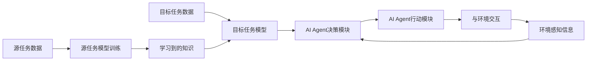

# AI Agent中的迁移学习技术应用

> 关键词：AI Agent、迁移学习、技术应用、模型训练、知识迁移

> 摘要：本文聚焦于AI Agent中迁移学习技术的应用。首先介绍了迁移学习在AI Agent领域应用的背景，包括目的、预期读者等内容。接着详细阐述了迁移学习和AI Agent的核心概念及联系，给出了相应的原理和架构示意图。通过Python代码深入讲解了核心算法原理和具体操作步骤，并运用数学模型和公式进行理论分析。结合项目实战，给出代码实际案例及详细解释。探讨了迁移学习在AI Agent中的实际应用场景，推荐了相关的学习资源、开发工具框架和论文著作。最后总结了未来发展趋势与挑战，提供常见问题解答和扩展阅读参考资料，旨在帮助读者全面了解和掌握AI Agent中迁移学习技术的应用。

## 1. 背景介绍 
### 1.1 目的和范围
迁移学习在AI Agent中的应用目的在于解决传统机器学习中数据和模型复用性低的问题。传统的机器学习任务往往需要大量的数据来训练特定的模型，而且每个模型只能针对特定的任务进行学习。而迁移学习能够将在一个任务上学习到的知识迁移到另一个相关的任务中，从而减少新任务所需的训练数据量，提高模型的训练效率和性能。

本文的范围主要涵盖迁移学习在AI Agent中的基本概念、核心算法、数学模型、实际应用案例以及相关的工具和资源推荐等方面。旨在为读者提供一个全面而深入的关于AI Agent中迁移学习技术应用的知识体系。

### 1.2 预期读者
本文的预期读者包括对人工智能、机器学习领域感兴趣的研究人员、开发者，以及希望了解AI Agent和迁移学习技术的学生和从业者。无论是初学者想要入门，还是有一定经验的专业人士想要深入研究，都能从本文中获取有价值的信息。

### 1.3 文档结构概述
本文将按照以下结构进行组织：首先介绍迁移学习和AI Agent的核心概念及它们之间的联系，通过示意图和流程图进行直观展示；接着详细讲解核心算法原理，并给出Python代码实现和具体操作步骤；运用数学模型和公式对迁移学习进行理论分析，并举例说明；通过项目实战，展示迁移学习在实际中的应用，包括开发环境搭建、源代码实现和代码解读；探讨迁移学习在AI Agent中的实际应用场景；推荐相关的学习资源、开发工具框架和论文著作；最后总结未来发展趋势与挑战，提供常见问题解答和扩展阅读参考资料。

### 1.4 术语表
#### 1.4.1 核心术语定义
- **AI Agent**：即人工智能代理，是一种能够感知环境、做出决策并采取行动以实现特定目标的智能实体。它可以是软件程序、机器人等形式，通过与环境进行交互来完成各种任务。
- **迁移学习**：是一种机器学习技术，它允许模型将在一个或多个源任务上学习到的知识迁移到一个或多个目标任务上，从而提高目标任务的学习效率和性能。

#### 1.4.2 相关概念解释
- **源任务**：是迁移学习中知识的来源任务，模型在源任务上进行训练，学习到相关的特征和模式。
- **目标任务**：是迁移学习中需要应用迁移知识的任务，利用从源任务迁移过来的知识来提高目标任务的学习效果。

#### 1.4.3 缩略词列表
- **ML**：Machine Learning，机器学习
- **DL**：Deep Learning，深度学习
- **CNN**：Convolutional Neural Network，卷积神经网络
- **RNN**：Recurrent Neural Network，循环神经网络

## 2. 核心概念与联系 

### 迁移学习的原理
迁移学习的核心思想是利用已有的知识来加速新任务的学习。在实际应用中，不同的任务往往具有一定的相关性，例如图像分类任务中，不同类别的图像可能具有相似的特征，如边缘、纹理等。迁移学习通过在源任务上学习到这些通用的特征，然后将其应用到目标任务中，从而减少目标任务的训练时间和数据需求。

### AI Agent的架构
AI Agent通常由感知模块、决策模块和行动模块组成。感知模块负责收集环境信息，决策模块根据感知到的信息做出决策，行动模块则根据决策采取相应的行动。在这个过程中，迁移学习可以应用于决策模块，通过迁移其他相关任务的知识来提高决策的准确性和效率。

### 迁移学习与AI Agent的联系
迁移学习为AI Agent提供了一种高效的知识复用方式。AI Agent在面对不同的任务时，可以利用迁移学习将之前学习到的知识迁移到新的任务中，从而更快地适应新环境和完成新任务。例如，一个智能机器人在学习了抓取不同形状物体的任务后，可以利用迁移学习将这些知识应用到新的物体抓取任务中，提高抓取的成功率。

### 文本示意图
```plaintext
             迁移学习
                |
                | 知识迁移
                v
       AI Agent（感知 - 决策 - 行动）
```

### Mermaid流程图


## 3. 核心算法原理 & 具体操作步骤 

### 基于特征迁移的算法原理
基于特征迁移的方法是迁移学习中常用的一种方法。其核心思想是从源任务的数据中提取出有用的特征，然后将这些特征应用到目标任务中。以下是一个简单的基于特征迁移的算法示例，使用Python和Scikit-learn库实现。

```python
import numpy as np
from sklearn.datasets import make_classification
from sklearn.model_selection import train_test_split
from sklearn.linear_model import LogisticRegression

# 生成源任务数据
X_source, y_source = make_classification(n_samples=1000, n_features=20, n_informative=10, n_classes=2, random_state=42)
X_train_source, X_test_source, y_train_source, y_test_source = train_test_split(X_source, y_source, test_size=0.2, random_state=42)

# 训练源任务模型
source_model = LogisticRegression()
source_model.fit(X_train_source, y_train_source)

# 生成目标任务数据
X_target, y_target = make_classification(n_samples=200, n_features=20, n_informative=10, n_classes=2, random_state=43)
X_train_target, X_test_target, y_train_target, y_test_target = train_test_split(X_target, y_target, test_size=0.2, random_state=43)

# 提取源任务的特征表示
feature_extractor = lambda x: source_model.predict_proba(x)[:, 1].reshape(-1, 1)
X_train_target_features = feature_extractor(X_train_target)
X_test_target_features = feature_extractor(X_test_target)

# 训练目标任务模型
target_model = LogisticRegression()
target_model.fit(X_train_target_features, y_train_target)

# 评估目标任务模型
accuracy = target_model.score(X_test_target_features, y_test_target)
print(f"目标任务模型的准确率: {accuracy}")
```

### 具体操作步骤
1. **数据准备**：分别准备源任务和目标任务的数据。源任务数据通常需要足够多，以便学习到有用的特征。
2. **源任务模型训练**：使用源任务数据训练一个模型，例如上述代码中的逻辑回归模型。
3. **特征提取**：使用训练好的源任务模型从目标任务数据中提取特征。
4. **目标任务模型训练**：使用提取的特征训练目标任务模型。
5. **模型评估**：使用目标任务的测试数据评估训练好的目标任务模型的性能。

## 4. 数学模型和公式 & 详细讲解 & 举例说明 

### 迁移学习的损失函数
在迁移学习中，通常会结合源任务和目标任务的损失函数来进行模型训练。假设源任务的损失函数为 $L_s(\theta)$，目标任务的损失函数为 $L_t(\theta)$，则迁移学习的总损失函数可以表示为：

$$L(\theta) = \lambda_s L_s(\theta) + \lambda_t L_t(\theta)$$

其中，$\lambda_s$ 和 $\lambda_t$ 是权重系数，用于控制源任务和目标任务损失函数的相对重要性。

### 详细讲解
- 当 $\lambda_s$ 较大时，模型会更注重源任务的损失，这意味着模型会更多地保留从源任务中学习到的知识。
- 当 $\lambda_t$ 较大时，模型会更注重目标任务的损失，这意味着模型会更适应目标任务的特点。

### 举例说明
假设源任务是一个图像分类任务，目标任务是一个图像分割任务。源任务的损失函数可以是交叉熵损失函数，目标任务的损失函数可以是Dice损失函数。通过调整 $\lambda_s$ 和 $\lambda_t$ 的值，可以使模型在保留源任务知识的同时，更好地适应目标任务的需求。

```python
import torch
import torch.nn as nn
import torch.optim as optim

# 定义源任务和目标任务的损失函数
criterion_source = nn.CrossEntropyLoss()
criterion_target = nn.BCELoss()

# 定义权重系数
lambda_s = 0.7
lambda_t = 0.3

# 假设模型的输出和标签
output_source = torch.randn(10, 5)
target_source = torch.randint(0, 5, (10,))
output_target = torch.sigmoid(torch.randn(10, 1))
target_target = torch.randint(0, 2, (10, 1)).float()

# 计算源任务和目标任务的损失
loss_source = criterion_source(output_source, target_source)
loss_target = criterion_target(output_target, target_target)

# 计算迁移学习的总损失
total_loss = lambda_s * loss_source + lambda_t * loss_target
print(f"迁移学习的总损失: {total_loss.item()}")
```

## 5. 项目实战：代码实际案例和详细解释说明 

### 5.1  开发环境搭建
- **操作系统**：推荐使用Linux系统，如Ubuntu 18.04及以上版本。
- **Python环境**：使用Python 3.7及以上版本，可以通过Anaconda进行安装和管理。
- **深度学习框架**：使用PyTorch或TensorFlow，这里以PyTorch为例。可以通过以下命令进行安装：
```bash
pip install torch torchvision
```

### 5.2  源代码详细实现和代码解读
以下是一个基于PyTorch的迁移学习项目实战案例，用于图像分类任务。

```python
import torch
import torch.nn as nn
import torch.optim as optim
from torchvision import datasets, transforms, models
from torch.utils.data import DataLoader

# 数据预处理
transform = transforms.Compose([
    transforms.Resize((224, 224)),
    transforms.ToTensor(),
    transforms.Normalize(mean=[0.485, 0.456, 0.406], std=[0.229, 0.224, 0.225])
])

# 加载源任务数据集（如ImageNet）
source_dataset = datasets.ImageFolder(root='path/to/source/dataset', transform=transform)
source_dataloader = DataLoader(source_dataset, batch_size=32, shuffle=True)

# 加载目标任务数据集
target_dataset = datasets.ImageFolder(root='path/to/target/dataset', transform=transform)
target_dataloader = DataLoader(target_dataset, batch_size=32, shuffle=True)

# 加载预训练的模型（如ResNet18）
model = models.resnet18(pretrained=True)

# 冻结模型的参数
for param in model.parameters():
    param.requires_grad = False

# 修改模型的最后一层以适应目标任务的类别数
num_ftrs = model.fc.in_features
model.fc = nn.Linear(num_ftrs, len(target_dataset.classes))

# 定义损失函数和优化器
criterion = nn.CrossEntropyLoss()
optimizer = optim.SGD(model.fc.parameters(), lr=0.001, momentum=0.9)

# 训练模型
device = torch.device("cuda:0" if torch.cuda.is_available() else "cpu")
model.to(device)

num_epochs = 10
for epoch in range(num_epochs):
    running_loss = 0.0
    for i, (images, labels) in enumerate(target_dataloader):
        images, labels = images.to(device), labels.to(device)

        optimizer.zero_grad()

        outputs = model(images)
        loss = criterion(outputs, labels)
        loss.backward()
        optimizer.step()

        running_loss += loss.item()

    print(f'Epoch {epoch + 1}, Loss: {running_loss / len(target_dataloader)}')

# 评估模型
model.eval()
correct = 0
total = 0
with torch.no_grad():
    for images, labels in target_dataloader:
        images, labels = images.to(device), labels.to(device)
        outputs = model(images)
        _, predicted = torch.max(outputs.data, 1)
        total += labels.size(0)
        correct += (predicted == labels).sum().item()

print(f'目标任务的准确率: {100 * correct / total}%')
```

### 5.3  代码解读与分析
- **数据预处理**：使用 `transforms` 对图像进行预处理，包括调整大小、转换为张量和归一化。
- **加载数据集**：使用 `datasets.ImageFolder` 加载源任务和目标任务的数据集，并使用 `DataLoader` 进行批量处理。
- **加载预训练模型**：使用 `models.resnet18(pretrained=True)` 加载预训练的ResNet18模型。
- **冻结模型参数**：通过 `param.requires_grad = False` 冻结模型的参数，只训练最后一层。
- **修改模型最后一层**：根据目标任务的类别数修改模型的最后一层。
- **定义损失函数和优化器**：使用交叉熵损失函数和随机梯度下降优化器。
- **训练模型**：在目标任务数据集上训练模型，每个epoch输出损失值。
- **评估模型**：在目标任务数据集上评估模型的准确率。

## 6. 实际应用场景 
### 智能客服
在智能客服系统中，AI Agent可以利用迁移学习技术。例如，在处理不同领域的客户咨询时，先在一个通用的客服问答数据集上进行训练，学习到常见问题的处理方式和语言模式。当面对特定领域（如金融、医疗）的客户咨询时，将之前学习到的知识迁移过来，快速适应新领域的问题。这样可以减少在新领域收集大量训练数据的成本，提高智能客服的响应速度和准确性。

### 自动驾驶
在自动驾驶领域，AI Agent需要处理各种复杂的交通场景。迁移学习可以帮助AI Agent将在模拟环境中学习到的驾驶知识迁移到实际道路环境中。例如，在模拟环境中训练AI Agent学习如何应对不同的路况和交通规则，然后将这些知识迁移到实际的自动驾驶车辆上，减少实际测试的时间和成本，提高自动驾驶系统的安全性和可靠性。

### 医疗诊断
在医疗诊断中，AI Agent可以利用迁移学习技术。由于医疗数据的获取比较困难且标注成本高，迁移学习可以将在大规模公共医疗图像数据集（如胸部X光片、脑部MRI）上学习到的特征和诊断模式迁移到特定医院或特定疾病的诊断任务中。这样可以提高诊断的准确性，同时减少对特定数据集的依赖。

## 7. 工具和资源推荐
### 7.1 学习资源推荐
#### 7.1.1 书籍推荐
- 《迁移学习》：全面介绍了迁移学习的基本概念、算法和应用，是学习迁移学习的经典书籍。
- 《深度学习》：虽然主要是关于深度学习的内容，但其中也涉及到了一些迁移学习的相关知识，对于理解迁移学习的背景和基础很有帮助。

#### 7.1.2 在线课程
- Coursera上的“迁移学习专项课程”：由知名教授授课，系统地讲解了迁移学习的理论和实践。
- edX上的“深度学习与迁移学习”：提供了丰富的视频教程和实践项目，帮助学习者掌握迁移学习的应用。

#### 7.1.3 技术博客和网站
- Medium：上面有很多关于迁移学习和AI Agent的技术文章，涵盖了最新的研究成果和实践经验。
- arXiv：可以查找关于迁移学习的最新学术论文，了解该领域的前沿动态。

### 7.2 开发工具框架推荐
#### 7.2.1 IDE和编辑器
- PyCharm：是一款专门为Python开发设计的集成开发环境，具有强大的代码编辑、调试和项目管理功能。
- Jupyter Notebook：适合进行数据探索和模型实验，支持代码、文本和可视化的混合展示。

#### 7.2.2 调试和性能分析工具
- TensorBoard：可以用于可视化深度学习模型的训练过程，帮助开发者监控模型的性能和调试问题。
- PyTorch Profiler：可以对PyTorch模型进行性能分析，找出性能瓶颈。

#### 7.2.3 相关框架和库
- Scikit-learn：提供了丰富的机器学习算法和工具，其中也包括一些简单的迁移学习方法。
- Hugging Face Transformers：是一个用于自然语言处理的强大库，其中包含了很多预训练模型，可以方便地进行迁移学习。

### 7.3 相关论文著作推荐
#### 7.3.1 经典论文
- “A Survey on Transfer Learning”：对迁移学习进行了全面的综述，介绍了迁移学习的主要方法和应用场景。
- “How transferable are features in deep neural networks?”：研究了深度神经网络中特征的可迁移性，为迁移学习在深度学习中的应用提供了理论基础。

#### 7.3.2 最新研究成果
- 可以通过arXiv和ACM Digital Library等学术数据库查找关于迁移学习在AI Agent中应用的最新研究论文，了解该领域的前沿动态。

#### 7.3.3 应用案例分析
- 在IEEE Xplore和ACM SIGKDD等会议论文集中可以找到很多关于迁移学习在实际应用中的案例分析，如智能交通、医疗诊断等领域。

## 8. 总结：未来发展趋势与挑战
### 未来发展趋势
- **多模态迁移学习**：随着数据类型的不断丰富，未来的迁移学习将不仅仅局限于单一模态的数据，如文本、图像等，而是会涉及到多模态数据的迁移，如将图像和文本的知识进行融合迁移，以提高AI Agent在复杂场景下的理解和决策能力。
- **强化迁移学习**：将迁移学习与强化学习相结合，使AI Agent能够在不同的环境中快速学习和适应，提高其在动态环境中的决策能力和效率。
- **自动迁移学习**：开发自动迁移学习算法和工具，使迁移学习的过程更加自动化和智能化，减少人工干预，提高迁移学习的效率和效果。

### 挑战
- **知识迁移的有效性**：如何确保从源任务迁移到目标任务的知识是有效的，避免负迁移的发生，是迁移学习面临的一个重要挑战。
- **数据隐私和安全**：在迁移学习中，可能会涉及到不同数据源的数据，如何保护数据的隐私和安全，防止数据泄露和滥用，是需要解决的问题。
- **模型可解释性**：随着迁移学习模型的复杂度不断增加，如何提高模型的可解释性，使人们能够理解模型的决策过程和依据，是一个亟待解决的问题。

## 9. 附录：常见问题与解答
### 问题1：迁移学习一定能提高目标任务的性能吗？
不一定。迁移学习的效果取决于源任务和目标任务的相关性、迁移方法的选择以及数据的质量等因素。如果源任务和目标任务的相关性较低，或者迁移方法选择不当，可能会导致负迁移，从而降低目标任务的性能。

### 问题2：如何选择合适的源任务？
选择合适的源任务需要考虑以下几个因素：
- 相关性：源任务和目标任务应该具有一定的相关性，例如相同的领域、相似的特征等。
- 数据量：源任务应该有足够多的数据，以便学习到有用的知识。
- 复杂度：源任务的复杂度应该适中，既不能过于简单，也不能过于复杂。

### 问题3：迁移学习需要多少目标任务数据？
这取决于源任务和目标任务的相关性以及迁移方法的选择。一般来说，如果源任务和目标任务的相关性较高，只需要少量的目标任务数据就可以取得较好的效果；如果相关性较低，则需要更多的目标任务数据。

## 10. 扩展阅读 & 参考资料
- 《人工智能：一种现代的方法》
- 《机器学习》（周志华）
- 相关学术会议论文，如NeurIPS、ICML、CVPR等。

作者：AI天才研究院/AI Genius Institute & 禅与计算机程序设计艺术 /Zen And The Art of Computer Programming