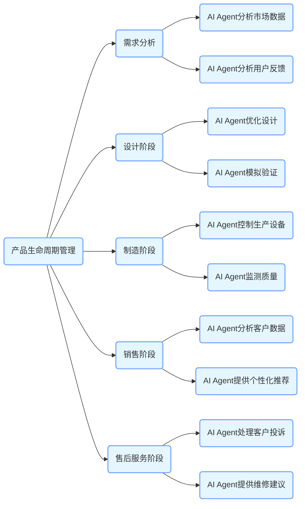

# AI Agent在产品生命周期管理中的全面应用

> 关键词：AI Agent、产品生命周期管理、人工智能、自动化、决策支持

> 摘要：本文深入探讨了AI Agent在产品生命周期管理中的全面应用。首先介绍了产品生命周期管理的背景和AI Agent的相关概念，阐述了两者之间的联系。接着详细讲解了AI Agent的核心算法原理和具体操作步骤，并用Python代码进行了示例。同时给出了相关的数学模型和公式，并举例说明。通过实际项目案例展示了AI Agent在产品生命周期管理中的具体应用，分析了其实际应用场景。此外，还推荐了学习资源、开发工具框架和相关论文著作。最后总结了未来发展趋势与挑战，并对常见问题进行了解答。

## 1. 背景介绍 
### 1.1 目的和范围
产品生命周期管理（Product Lifecycle Management, PLM）涵盖了产品从概念设计、开发、生产、销售到退役的整个过程。在当今竞争激烈的市场环境下，企业需要更高效、智能的方式来管理产品生命周期，以提高产品质量、降低成本、缩短上市时间。AI Agent作为人工智能技术的一种具体实现，具有自主学习、决策和执行任务的能力，能够在产品生命周期的各个阶段发挥重要作用。本文的目的是全面探讨AI Agent在产品生命周期管理中的应用，包括其原理、算法、实际案例等，为企业提供理论和实践指导。范围涵盖了产品生命周期的各个阶段，从需求分析、设计、制造到售后服务。

### 1.2 预期读者
本文的预期读者包括企业的产品管理人员、技术研发人员、项目经理、人工智能爱好者以及相关领域的研究人员。对于产品管理人员，本文可以帮助他们了解如何利用AI Agent提高产品管理效率和决策质量；技术研发人员可以从中获取AI Agent的实现原理和算法，为开发相关应用提供参考；项目经理可以借鉴实际案例，将AI Agent应用到项目管理中；人工智能爱好者和研究人员可以深入了解AI Agent在产品生命周期管理领域的应用现状和发展趋势。

### 1.3 文档结构概述
本文将按照以下结构进行组织：首先介绍背景信息，包括目的、预期读者和文档结构概述；接着阐述AI Agent和产品生命周期管理的核心概念及其联系，并给出相应的示意图和流程图；然后详细讲解AI Agent的核心算法原理和具体操作步骤，并用Python代码进行说明；再介绍相关的数学模型和公式，并举例说明；通过实际项目案例展示AI Agent在产品生命周期管理中的应用；分析AI Agent在产品生命周期管理中的实际应用场景；推荐学习资源、开发工具框架和相关论文著作；最后总结未来发展趋势与挑战，解答常见问题，并提供扩展阅读和参考资料。

### 1.4 术语表
#### 1.4.1 核心术语定义
- **AI Agent**：人工智能代理，是一种能够感知环境、自主学习、做出决策并执行任务的智能实体。它可以根据预设的目标和规则，与环境进行交互，以实现特定的任务。
- **产品生命周期管理（PLM）**：是一种集成的管理理念和方法，用于管理产品从概念设计、开发、生产、销售到退役的整个生命周期。它涉及到多个部门和环节，包括设计、工程、制造、销售、服务等。
- **机器学习**：是一门多领域交叉学科，涉及概率论、统计学、逼近论、凸分析、算法复杂度理论等多门学科。它专门研究计算机怎样模拟或实现人类的学习行为，以获取新的知识或技能，重新组织已有的知识结构使之不断改善自身的性能。
- **深度学习**：是机器学习的一个分支领域，它是一种基于对数据进行表征学习的方法。深度学习通过构建具有很多层的神经网络模型，自动从大量数据中学习特征和模式。

#### 1.4.2 相关概念解释
- **感知**：AI Agent通过各种传感器或数据接口获取环境信息的过程。例如，在产品设计阶段，AI Agent可以通过分析市场调研数据、用户反馈等信息来感知市场需求。
- **决策**：AI Agent根据感知到的环境信息和预设的目标，选择最优行动方案的过程。在产品生命周期管理中，AI Agent可以根据成本、质量、时间等因素做出决策，如选择最佳的原材料供应商、确定产品的生产计划等。
- **执行**：AI Agent根据决策结果采取实际行动的过程。例如，在产品制造阶段，AI Agent可以控制生产设备进行产品的加工和组装。

#### 1.4.3 缩略词列表
- **PLM**：Product Lifecycle Management（产品生命周期管理）
- **ML**：Machine Learning（机器学习）
- **DL**：Deep Learning（深度学习）
- **AI**：Artificial Intelligence（人工智能）

## 2. 核心概念与联系 

### 2.1 AI Agent的核心概念
AI Agent是人工智能领域的一个重要概念，它是一种能够自主感知环境、学习知识、做出决策并执行任务的智能实体。AI Agent通常由感知模块、决策模块和执行模块组成。感知模块用于获取环境信息，决策模块根据感知到的信息和预设的目标进行决策，执行模块则根据决策结果采取实际行动。

### 2.2 产品生命周期管理的核心概念
产品生命周期管理是一种集成的管理理念和方法，它涵盖了产品从概念设计、开发、生产、销售到退役的整个过程。产品生命周期管理的主要目标是提高产品质量、降低成本、缩短上市时间，同时满足客户需求。产品生命周期管理涉及到多个部门和环节，包括设计、工程、制造、销售、服务等，需要进行有效的协同和管理。

### 2.3 AI Agent与产品生命周期管理的联系
AI Agent可以在产品生命周期的各个阶段发挥重要作用。在需求分析阶段，AI Agent可以通过分析市场调研数据、用户反馈等信息，帮助企业准确把握市场需求，为产品设计提供依据。在设计阶段，AI Agent可以利用机器学习和深度学习算法，对产品进行优化设计，提高产品的性能和质量。在制造阶段，AI Agent可以控制生产设备，实现生产过程的自动化和智能化，提高生产效率和质量。在销售和售后服务阶段，AI Agent可以通过分析客户数据，提供个性化的销售和服务，提高客户满意度。

### 2.4 文本示意图
```plaintext
产品生命周期管理
|-- 需求分析
|   |-- AI Agent：分析市场数据、用户反馈
|-- 设计阶段
|   |-- AI Agent：优化设计、模拟验证
|-- 制造阶段
|   |-- AI Agent：控制生产设备、监测质量
|-- 销售阶段
|   |-- AI Agent：分析客户数据、提供个性化推荐
|-- 售后服务阶段
|   |-- AI Agent：处理客户投诉、提供维修建议
```

### 2.5 Mermaid流程图


## 3. 核心算法原理 & 具体操作步骤 

### 3.1 核心算法原理
AI Agent在产品生命周期管理中常用的算法包括机器学习算法和深度学习算法。以下以决策树算法为例，介绍其原理。

决策树是一种基于树结构进行决策的机器学习算法。它通过对训练数据进行分析，构建一棵决策树，每个内部节点表示一个属性上的测试，每个分支表示一个测试输出，每个叶节点表示一个类别或值。决策树的构建过程是一个递归的过程，主要包括以下步骤：
1. 选择最优属性：从所有属性中选择一个最优属性作为当前节点的划分属性。
2. 划分数据集：根据最优属性的不同取值，将数据集划分为多个子集。
3. 递归构建子树：对每个子集递归地执行步骤1和步骤2，直到满足终止条件。

### 3.2 Python代码实现决策树算法
```python
import numpy as np

class DecisionTree:
    def __init__(self):
        self.tree = None

    def fit(self, X, y):
        self.tree = self._build_tree(X, y)

    def _build_tree(self, X, y):
        num_samples, num_features = X.shape
        if len(np.unique(y)) == 1:
            return np.unique(y)[0]
        if num_features == 0:
            return np.bincount(y).argmax()

        best_gini = 1
        best_feature_index = 0
        best_threshold = 0

        for feature_index in range(num_features):
            thresholds = np.unique(X[:, feature_index])
            for threshold in thresholds:
                left_indices = X[:, feature_index] < threshold
                right_indices = X[:, feature_index] >= threshold
                left_y = y[left_indices]
                right_y = y[right_indices]

                if len(left_y) == 0 or len(right_y) == 0:
                    continue

                gini = (len(left_y) / num_samples) * self._gini_index(left_y) + (len(right_y) / num_samples) * self._gini_index(right_y)

                if gini < best_gini:
                    best_gini = gini
                    best_feature_index = feature_index
                    best_threshold = threshold

        left_indices = X[:, best_feature_index] < best_threshold
        right_indices = X[:, best_feature_index] >= best_threshold
        left_X = X[left_indices]
        left_y = y[left_indices]
        right_X = X[right_indices]
        right_y = y[right_indices]

        tree = {
            'feature_index': best_feature_index,
            'threshold': best_threshold,
            'left': self._build_tree(left_X, left_y),
            'right': self._build_tree(right_X, right_y)
        }

        return tree

    def _gini_index(self, y):
        classes = np.unique(y)
        gini = 1
        for c in classes:
            p = np.sum(y == c) / len(y)
            gini -= p ** 2
        return gini

    def predict(self, X):
        predictions = []
        for sample in X:
            prediction = self._predict_sample(sample, self.tree)
            predictions.append(prediction)
        return np.array(predictions)

    def _predict_sample(self, sample, tree):
        if not isinstance(tree, dict):
            return tree
        feature_index = tree['feature_index']
        threshold = tree['threshold']
        if sample[feature_index] < threshold:
            return self._predict_sample(sample, tree['left'])
        else:
            return self._predict_sample(sample, tree['right'])

# 示例数据
X = np.array([[2.771244718, 1.784783929],
              [1.728571309, 1.169761413],
              [3.678319846, 2.81281357],
              [3.961043357, 2.61995032],
              [2.999208922, 2.209014212],
              [7.497545867, 3.162953546],
              [9.00220326, 3.339047188],
              [7.444542326, 0.476683375],
              [10.12493903, 3.234550982],
              [6.642287351, 3.319983761]])
y = np.array([0, 0, 0, 0, 0, 1, 1, 1, 1, 1])

# 创建决策树模型
model = DecisionTree()
model.fit(X, y)

# 预测新数据
new_X = np.array([[3.0, 2.0], [8.0, 3.0]])
predictions = model.predict(new_X)
print("Predictions:", predictions)
```

### 3.3 具体操作步骤
1. **数据准备**：收集和整理产品生命周期管理相关的数据，包括市场调研数据、产品设计数据、生产数据、销售数据等。对数据进行清洗、预处理和特征工程，以提高数据质量和可用性。
2. **模型选择**：根据具体的应用场景和问题，选择合适的AI Agent算法和模型。例如，在需求分析阶段，可以选择文本挖掘算法对市场调研数据进行分析；在产品设计阶段，可以选择优化算法对产品进行设计优化。
3. **模型训练**：使用准备好的数据对选择的模型进行训练。在训练过程中，需要调整模型的参数，以提高模型的性能和准确性。
4. **模型评估**：使用测试数据对训练好的模型进行评估，评估指标包括准确率、召回率、F1值等。根据评估结果，对模型进行调整和优化。
5. **模型部署**：将训练好的模型部署到实际的产品生命周期管理系统中，实现AI Agent的功能。在部署过程中，需要考虑系统的性能、稳定性和安全性等因素。
6. **监控和维护**：对部署后的AI Agent进行监控和维护，及时发现和解决问题。同时，根据实际情况对模型进行更新和优化，以适应不断变化的市场需求和产品生命周期管理要求。

## 4. 数学模型和公式 & 详细讲解 & 举例说明 

### 4.1 决策树的数学模型和公式
#### 4.1.1 基尼指数（Gini Index）
基尼指数是一种衡量数据集纯度的指标，用于决策树算法中选择最优划分属性。基尼指数的计算公式如下：
$$
Gini(D) = 1 - \sum_{k=1}^{K} p_k^2
$$
其中，$D$ 表示数据集，$K$ 表示数据集中的类别数，$p_k$ 表示第 $k$ 类样本在数据集中所占的比例。

#### 4.1.2 基尼系数（Gini Coefficient）
基尼系数用于衡量划分属性的优劣，计算公式如下：
$$
Gini_{split}(D, A) = \frac{|D_1|}{|D|}Gini(D_1) + \frac{|D_2|}{|D|}Gini(D_2)
$$
其中，$D$ 表示数据集，$A$ 表示划分属性，$D_1$ 和 $D_2$ 分别表示根据属性 $A$ 划分得到的两个子集，$|D|$、$|D_1|$ 和 $|D_2|$ 分别表示数据集 $D$、子集 $D_1$ 和子集 $D_2$ 的样本数量。

### 4.2 详细讲解
基尼指数反映了从数据集中随机抽取两个样本，其类别不一致的概率。基尼指数越小，数据集的纯度越高。在决策树算法中，我们希望选择一个划分属性，使得划分后的子集的基尼系数最小，即划分后的子集的纯度最高。

### 4.3 举例说明
假设有一个数据集 $D$ 包含 10 个样本，其中 6 个样本属于类别 0，4 个样本属于类别 1。则数据集 $D$ 的基尼指数为：
$$
Gini(D) = 1 - (\frac{6}{10})^2 - (\frac{4}{10})^2 = 1 - 0.36 - 0.16 = 0.48
$$
假设我们选择一个属性 $A$ 对数据集 $D$ 进行划分，划分后得到两个子集 $D_1$ 和 $D_2$，其中 $D_1$ 包含 4 个样本，全部属于类别 0；$D_2$ 包含 6 个样本，其中 2 个样本属于类别 0，4 个样本属于类别 1。则子集 $D_1$ 和 $D_2$ 的基尼指数分别为：
$$
Gini(D_1) = 1 - (\frac{4}{4})^2 = 0
$$
$$
Gini(D_2) = 1 - (\frac{2}{6})^2 - (\frac{4}{6})^2 = 1 - \frac{1}{9} - \frac{4}{9} = \frac{4}{9} \approx 0.44
$$
划分属性 $A$ 的基尼系数为：
$$
Gini_{split}(D, A) = \frac{4}{10} \times 0 + \frac{6}{10} \times \frac{4}{9} = \frac{4}{15} \approx 0.27
$$

## 5. 项目实战：代码实际案例和详细解释说明 

### 5.1  开发环境搭建
#### 5.1.1 安装Python
首先需要安装Python环境，建议使用Python 3.7及以上版本。可以从Python官方网站（https://www.python.org/downloads/）下载并安装。

#### 5.1.2 安装必要的库
使用以下命令安装必要的Python库：
```bash
pip install numpy pandas scikit-learn matplotlib
```
其中，`numpy` 用于数值计算，`pandas` 用于数据处理，`scikit-learn` 用于机器学习算法的实现，`matplotlib` 用于数据可视化。

### 5.2  源代码详细实现和代码解读
以下是一个使用AI Agent进行产品需求分析的实际案例。假设我们有一份市场调研数据，包含用户对产品的各种需求和评价，我们希望通过AI Agent对这些数据进行分析，找出用户的主要需求。

```python
import pandas as pd
from sklearn.feature_extraction.text import TfidfVectorizer
from sklearn.cluster import KMeans
import matplotlib.pyplot as plt

# 读取数据
data = pd.read_csv('market_research_data.csv')
reviews = data['review'].tolist()

# 文本向量化
vectorizer = TfidfVectorizer(stop_words='english')
X = vectorizer.fit_transform(reviews)

# 使用KMeans进行聚类
k = 5  # 假设分为5类
kmeans = KMeans(n_clusters=k, random_state=42)
kmeans.fit(X)

# 获取每个聚类的中心词
order_centroids = kmeans.cluster_centers_.argsort()[:, ::-1]
terms = vectorizer.get_feature_names_out()
for i in range(k):
    print(f"Cluster {i}:")
    for ind in order_centroids[i, :10]:
        print(f"  {terms[ind]}")

# 可视化聚类结果
labels = kmeans.labels_
plt.scatter(X[:, 0].toarray(), X[:, 1].toarray(), c=labels, cmap='viridis')
plt.title('Product Demand Clustering')
plt.xlabel('Feature 1')
plt.ylabel('Feature 2')
plt.show()
```

### 5.3  代码解读与分析
1. **数据读取**：使用 `pandas` 库读取市场调研数据，将用户的评价信息存储在 `reviews` 列表中。
2. **文本向量化**：使用 `TfidfVectorizer` 将文本数据转换为数值特征向量。`TfidfVectorizer` 可以计算每个词的TF-IDF值，用于衡量词在文本中的重要性。
3. **聚类分析**：使用 `KMeans` 算法对文本特征向量进行聚类，将用户的评价分为 $k$ 类。`KMeans` 算法通过迭代的方式将数据点分配到不同的聚类中心，使得每个数据点到其所属聚类中心的距离之和最小。
4. **获取聚类中心词**：通过 `order_centroids` 获取每个聚类的中心词，这些中心词代表了该聚类的主要特征。
5. **可视化聚类结果**：使用 `matplotlib` 库将聚类结果可视化，帮助我们直观地了解用户的需求分布。

## 6. 实际应用场景 
### 6.1 需求分析阶段
在需求分析阶段，AI Agent可以通过分析市场调研数据、用户反馈、社交媒体数据等，帮助企业准确把握市场需求。例如，AI Agent可以使用文本挖掘算法对用户的评价和反馈进行分析，提取关键信息和主题，找出用户的痛点和需求点。同时，AI Agent还可以通过分析竞争对手的产品和市场动态，为企业提供差异化的产品定位建议。

### 6.2 设计阶段
在设计阶段，AI Agent可以利用机器学习和深度学习算法对产品进行优化设计。例如，AI Agent可以使用遗传算法对产品的结构和参数进行优化，以提高产品的性能和质量。同时，AI Agent还可以通过模拟验证算法对产品的设计方案进行模拟和验证，提前发现潜在的问题和风险，减少设计变更和成本。

### 6.3 制造阶段
在制造阶段，AI Agent可以控制生产设备，实现生产过程的自动化和智能化。例如，AI Agent可以使用机器人控制算法对机器人进行编程和控制，实现产品的自动化加工和组装。同时，AI Agent还可以通过传感器和监控系统对生产过程进行实时监测和分析，及时发现生产过程中的异常情况，并采取相应的措施进行调整和优化。

### 6.4 销售阶段
在销售阶段，AI Agent可以通过分析客户数据，提供个性化的销售和服务。例如，AI Agent可以使用推荐算法根据客户的购买历史、浏览记录等信息，为客户推荐个性化的产品和服务。同时，AI Agent还可以通过聊天机器人与客户进行实时沟通，解答客户的疑问，提供售前和售后服务。

### 6.5 售后服务阶段
在售后服务阶段，AI Agent可以处理客户投诉、提供维修建议等。例如，AI Agent可以使用自然语言处理算法对客户的投诉进行分类和分析，找出问题的根源，并提供相应的解决方案。同时，AI Agent还可以通过预测性维护算法对产品进行实时监测和分析，提前预测产品的故障和维修需求，为客户提供及时的维修服务。

## 7. 工具和资源推荐
### 7.1 学习资源推荐
#### 7.1.1 书籍推荐
- 《人工智能：一种现代的方法》（Artificial Intelligence: A Modern Approach）：这是一本经典的人工智能教材，全面介绍了人工智能的基本概念、算法和应用。
- 《机器学习》（Machine Learning）：由周志华教授编写，是国内机器学习领域的权威教材，内容涵盖了机器学习的各个方面。
- 《深度学习》（Deep Learning）：由Ian Goodfellow、Yoshua Bengio和Aaron Courville编写，是深度学习领域的经典著作，详细介绍了深度学习的原理和应用。

#### 7.1.2 在线课程
- Coursera上的“机器学习”课程：由Andrew Ng教授授课，是一门非常受欢迎的机器学习课程，适合初学者入门。
- edX上的“人工智能基础”课程：由IBM和伯克利大学联合开设，介绍了人工智能的基本概念和算法。
- Udemy上的“深度学习实战”课程：提供了丰富的深度学习实战项目，帮助学习者掌握深度学习的应用技巧。

#### 7.1.3 技术博客和网站
- Medium：是一个技术博客平台，上面有很多人工智能和机器学习领域的优秀文章。
- Towards Data Science：专注于数据科学和机器学习领域的技术博客，提供了很多实用的教程和案例。
- Kaggle：是一个数据科学竞赛平台，上面有很多优秀的开源项目和代码，可以学习到很多实际应用中的技巧和方法。

### 7.2 开发工具框架推荐
#### 7.2.1 IDE和编辑器
- PyCharm：是一款专门为Python开发设计的集成开发环境，提供了丰富的功能和插件，适合开发大型的Python项目。
- Jupyter Notebook：是一个交互式的开发环境，适合进行数据分析和机器学习实验。
- Visual Studio Code：是一款轻量级的代码编辑器，支持多种编程语言，提供了丰富的扩展插件。

#### 7.2.2 调试和性能分析工具
- Py-Spy：是一个Python性能分析工具，可以实时监测Python程序的CPU使用情况和函数调用时间。
- cProfile：是Python标准库中的一个性能分析模块，可以分析Python程序的性能瓶颈。
- TensorBoard：是TensorFlow提供的一个可视化工具，可以用于可视化深度学习模型的训练过程和性能指标。

#### 7.2.3 相关框架和库
- TensorFlow：是Google开发的一个开源深度学习框架，提供了丰富的深度学习模型和工具。
- PyTorch：是Facebook开发的一个开源深度学习框架，具有动态图和易于使用的特点。
- Scikit-learn：是一个常用的机器学习库，提供了各种机器学习算法和工具，适合初学者入门。

### 7.3 相关论文著作推荐
#### 7.3.1 经典论文
- “A Logical Calculus of the Ideas Immanent in Nervous Activity”（神经活动中内在思想的逻辑演算）：由Warren McCulloch和Walter Pitts于1943年发表，提出了人工神经网络的基本概念。
- “Learning Representations by Back-propagating Errors”（通过误差反向传播学习表示）：由David Rumelhart、Geoffrey Hinton和Ronald Williams于1986年发表，提出了误差反向传播算法，推动了神经网络的发展。
- “ImageNet Classification with Deep Convolutional Neural Networks”（使用深度卷积神经网络进行ImageNet图像分类）：由Alex Krizhevsky、Ilya Sutskever和Geoffrey Hinton于2012年发表，提出了AlexNet模型，开启了深度学习在计算机视觉领域的应用热潮。

#### 7.3.2 最新研究成果
- 关注顶级学术会议如NeurIPS（神经信息处理系统大会）、ICML（国际机器学习会议）、CVPR（计算机视觉与模式识别会议）等的最新研究成果，了解AI Agent和产品生命周期管理领域的最新技术和趋势。

#### 7.3.3 应用案例分析
- 一些知名企业如特斯拉、苹果、谷歌等在产品生命周期管理中应用AI Agent的案例分析，可以帮助我们了解实际应用中的经验和教训。

## 8. 总结：未来发展趋势与挑战
### 8.1 未来发展趋势
- **智能化程度不断提高**：随着人工智能技术的不断发展，AI Agent的智能化程度将不断提高，能够更加准确地感知环境、做出决策和执行任务。例如，在产品设计阶段，AI Agent可以通过深度学习算法自动生成最优的设计方案；在制造阶段，AI Agent可以实现生产过程的自适应控制。
- **与物联网、大数据等技术深度融合**：AI Agent将与物联网、大数据等技术深度融合，实现数据的实时采集、分析和处理。例如，通过物联网传感器收集产品在使用过程中的数据，AI Agent可以对产品的性能和状态进行实时监测和预测，为用户提供个性化的服务和维护建议。
- **应用范围不断扩大**：AI Agent在产品生命周期管理中的应用范围将不断扩大，不仅可以应用于传统的制造业，还可以应用于服务业、医疗保健、教育等领域。例如，在医疗保健领域，AI Agent可以帮助医生进行疾病诊断和治疗方案的制定；在教育领域，AI Agent可以为学生提供个性化的学习方案和辅导。

### 8.2 挑战
- **数据隐私和安全问题**：AI Agent在产品生命周期管理中需要处理大量的敏感数据，如用户信息、产品设计数据等，数据隐私和安全问题成为了一个重要的挑战。企业需要采取有效的措施来保护数据的安全，防止数据泄露和滥用。
- **算法可解释性问题**：一些复杂的AI Agent算法，如深度学习算法，往往具有较高的黑盒性，难以解释其决策过程和结果。在产品生命周期管理中，特别是在一些关键决策环节，需要对算法的决策过程进行解释，以确保决策的可靠性和可信度。
- **人才短缺问题**：AI Agent的开发和应用需要具备人工智能、机器学习、数据分析等多方面知识的专业人才。目前，相关领域的人才短缺问题比较严重，企业需要加强人才培养和引进，以满足业务发展的需求。

## 9. 附录：常见问题与解答
### 9.1 AI Agent在产品生命周期管理中的应用是否会导致人员失业？
AI Agent在产品生命周期管理中的应用主要是为了提高效率和决策质量，而不是取代人类。虽然一些重复性、规律性的工作可能会被AI Agent自动化，但同时也会创造出一些新的工作岗位，如AI Agent的开发、维护和管理等。因此，AI Agent的应用不会导致大规模的人员失业，而是会促使人们向更高层次的技能和知识方向发展。

### 9.2 如何评估AI Agent在产品生命周期管理中的性能？
可以从以下几个方面评估AI Agent在产品生命周期管理中的性能：
- **准确性**：评估AI Agent的决策和预测结果的准确性，例如在需求分析阶段，评估AI Agent对市场需求的预测准确率；在产品设计阶段，评估AI Agent优化设计方案的性能指标。
- **效率**：评估AI Agent完成任务的时间和资源消耗，例如在制造阶段，评估AI Agent控制生产设备的生产效率和能源消耗。
- **可靠性**：评估AI Agent在不同环境和条件下的稳定性和可靠性，例如在售后服务阶段，评估AI Agent处理客户投诉和提供维修建议的成功率。

### 9.3 AI Agent在产品生命周期管理中的应用需要多少数据？
AI Agent在产品生命周期管理中的应用需要的数据量取决于具体的应用场景和算法。一般来说，机器学习和深度学习算法需要大量的数据来进行训练，以提高模型的性能和准确性。对于一些简单的应用场景，可能只需要少量的数据就可以实现较好的效果；而对于一些复杂的应用场景，可能需要大量的历史数据和实时数据来进行训练和优化。

## 10. 扩展阅读 & 参考资料
### 10.1 扩展阅读
- 《人工智能时代的产品创新与管理》：探讨了人工智能技术在产品创新和管理中的应用和挑战。
- 《工业4.0：智能工业时代的创新管理》：介绍了工业4.0时代的智能制造和创新管理模式，其中涉及到AI Agent在工业生产中的应用。

### 10.2 参考资料
- 相关学术论文和研究报告，如IEEE Transactions on Industrial Informatics、ACM Transactions on Intelligent Systems and Technology等期刊上的论文。
- 企业的技术文档和案例分析，如特斯拉、苹果等公司的技术白皮书和应用案例。

作者：AI天才研究院/AI Genius Institute & 禅与计算机程序设计艺术 /Zen And The Art of Computer Programming