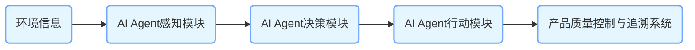

# AI Agent在产品质量控制与追溯系统中的应用

> 关键词：AI Agent、产品质量控制、产品追溯系统、人工智能、质量检测、供应链管理

> 摘要：本文深入探讨了AI Agent在产品质量控制与追溯系统中的应用。首先介绍了相关背景知识，包括目的、预期读者等内容。接着详细阐述了AI Agent的核心概念及与产品质量控制和追溯系统的联系，给出了原理和架构的示意图及流程图。对核心算法原理进行讲解，并使用Python代码进行说明，同时给出了相关的数学模型和公式。通过项目实战展示了如何搭建开发环境、实现源代码并进行解读。分析了AI Agent在产品质量控制与追溯系统中的实际应用场景，推荐了学习资源、开发工具框架以及相关论文著作。最后总结了未来发展趋势与挑战，解答了常见问题，并提供了扩展阅读和参考资料。

## 1. 背景介绍 
### 1.1 目的和范围
随着全球制造业的发展和消费者对产品质量要求的不断提高，产品质量控制与追溯系统变得越来越重要。产品质量控制旨在确保产品符合规定的标准和要求，而追溯系统则能够在产品出现质量问题时，快速定位问题源头，采取有效的召回和改进措施。AI Agent作为一种智能化的软件实体，具有自主决策、学习和交互的能力，将其应用于产品质量控制与追溯系统中，可以提高系统的自动化程度、准确性和效率。

本文的范围主要涵盖AI Agent在产品质量控制与追溯系统中的基本概念、算法原理、实际应用案例以及相关工具和资源的推荐。同时，对该领域的未来发展趋势和挑战进行了分析和探讨。

### 1.2 预期读者
本文预期读者包括从事制造业、质量控制、供应链管理等领域的专业人士，如质量工程师、生产管理人员、供应链分析师等。此外，对人工智能、机器学习等技术在工业领域应用感兴趣的研究人员和学生也可以从本文中获取有价值的信息。

### 1.3 文档结构概述
本文将按照以下结构进行组织：
1. **背景介绍**：阐述本文的目的、范围、预期读者和文档结构概述，并对相关术语进行定义和解释。
2. **核心概念与联系**：介绍AI Agent、产品质量控制和追溯系统的核心概念，并分析它们之间的联系，给出原理和架构的示意图及流程图。
3. **核心算法原理 & 具体操作步骤**：详细讲解AI Agent在产品质量控制与追溯系统中使用的核心算法原理，并使用Python代码进行具体实现。
4. **数学模型和公式 & 详细讲解 & 举例说明**：给出相关的数学模型和公式，并进行详细讲解和举例说明。
5. **项目实战：代码实际案例和详细解释说明**：通过一个实际项目案例，展示如何搭建开发环境、实现源代码并进行解读。
6. **实际应用场景**：分析AI Agent在产品质量控制与追溯系统中的实际应用场景。
7. **工具和资源推荐**：推荐相关的学习资源、开发工具框架和论文著作。
8. **总结：未来发展趋势与挑战**：总结AI Agent在产品质量控制与追溯系统中的应用现状，分析未来发展趋势和面临的挑战。
9. **附录：常见问题与解答**：解答读者在阅读本文过程中可能遇到的常见问题。
10. **扩展阅读 & 参考资料**：提供相关的扩展阅读材料和参考资料。

### 1.4 术语表
#### 1.4.1 核心术语定义
- **AI Agent**：人工智能代理，是一种能够感知环境、自主决策并采取行动以实现特定目标的软件实体。
- **产品质量控制**：为了确保产品符合规定的质量标准和要求，对产品的设计、生产、检验等过程进行的一系列活动。
- **产品追溯系统**：通过记录产品的生产、加工、运输、销售等环节的信息，实现对产品质量和流向的追溯和管理的系统。
- **供应链管理**：对供应链中的物流、信息流和资金流进行计划、组织、协调和控制的过程。
- **机器学习**：一门多领域交叉学科，涉及概率论、统计学、逼近论、凸分析、算法复杂度理论等多门学科。它专门研究计算机怎样模拟或实现人类的学习行为，以获取新的知识或技能，重新组织已有的知识结构使之不断改善自身的性能。

#### 1.4.2 相关概念解释
- **自主决策**：AI Agent能够根据自身的知识和经验，在没有外部干预的情况下，独立地做出决策。
- **学习能力**：AI Agent可以通过与环境的交互和数据的积累，不断学习和改进自己的行为和决策。
- **交互能力**：AI Agent能够与其他Agent或人类进行通信和协作，共同完成任务。

#### 1.4.3 缩略词列表
- **AI**：Artificial Intelligence，人工智能
- **ML**：Machine Learning，机器学习
- **IoT**：Internet of Things，物联网
- **ERP**：Enterprise Resource Planning，企业资源计划

## 2. 核心概念与联系 
### 2.1 AI Agent核心概念
AI Agent是人工智能领域中的一个重要概念，它可以看作是一个具有感知、决策和行动能力的智能体。AI Agent通常由以下几个部分组成：
- **感知模块**：负责收集环境信息，如传感器数据、文本信息等。
- **决策模块**：根据感知模块提供的信息，结合自身的知识和目标，做出决策。
- **行动模块**：根据决策模块的决策，采取相应的行动，如控制设备、发送信息等。

AI Agent可以分为反应式Agent、基于模型的Agent、基于目标的Agent和基于效用的Agent等不同类型。不同类型的Agent适用于不同的应用场景。

### 2.2 产品质量控制与追溯系统核心概念
产品质量控制是确保产品质量的重要手段，它包括质量策划、质量保证和质量改进等环节。产品质量控制的方法包括统计过程控制、六西格玛管理、全面质量管理等。

产品追溯系统是一种用于记录产品生产、加工、运输、销售等环节信息的系统。通过产品追溯系统，可以实现对产品质量的追溯和管理，及时发现和解决产品质量问题。产品追溯系统通常由数据采集、数据存储、数据分析和数据查询等模块组成。

### 2.3 核心概念联系
AI Agent在产品质量控制与追溯系统中具有重要的应用价值。具体来说，AI Agent可以在以下几个方面发挥作用：
- **质量检测**：AI Agent可以通过感知模块收集产品的质量数据，如外观、尺寸、性能等，然后使用决策模块对数据进行分析和判断，确定产品是否符合质量标准。
- **故障诊断**：当产品出现质量问题时，AI Agent可以根据历史数据和实时数据，进行故障诊断，找出问题的根源，并提供相应的解决方案。
- **追溯管理**：AI Agent可以在产品生产、加工、运输、销售等环节中，自动记录相关信息，并将信息存储到追溯系统中。当需要查询产品信息时，AI Agent可以快速准确地提供相关信息。
- **供应链协同**：AI Agent可以与供应链中的其他Agent进行通信和协作，实现供应链的协同管理。例如，AI Agent可以根据市场需求和库存情况，自动调整生产计划和采购计划。

### 2.4 原理和架构的文本示意图
以下是AI Agent在产品质量控制与追溯系统中的原理和架构的文本示意图：

```plaintext
+----------------------+
|      环境信息       |
+----------------------+
         |
         v
+----------------------+
|    AI Agent感知模块  |
+----------------------+
         |
         v
+----------------------+
|    AI Agent决策模块  |
+----------------------+
         |
         v
+----------------------+
|    AI Agent行动模块  |
+----------------------+
         |
         v
+----------------------+
| 产品质量控制与追溯系统 |
+----------------------+
```

### 2.5 Mermaid流程图


## 3. 核心算法原理 & 具体操作步骤 
### 3.1 核心算法原理
在产品质量控制与追溯系统中，AI Agent常用的核心算法包括机器学习算法和优化算法。以下是一些常见的算法及其原理：

#### 3.1.1 决策树算法
决策树是一种基于树结构进行决策的机器学习算法。它通过对数据进行递归划分，构建一棵决策树，每个内部节点表示一个属性上的测试，每个分支表示一个测试输出，每个叶节点表示一个类别或值。决策树算法的优点是易于理解和解释，能够处理多分类问题。

#### 3.1.2 支持向量机算法
支持向量机是一种二分类模型，它的基本思想是在特征空间中找到一个最优的超平面，使得不同类别的样本能够被最大程度地分开。支持向量机算法的优点是在处理高维数据和小样本数据时具有较好的性能。

#### 3.1.3 遗传算法
遗传算法是一种模拟自然选择和遗传机制的优化算法。它通过模拟生物进化过程中的选择、交叉和变异等操作，不断优化解的质量。遗传算法的优点是能够处理复杂的优化问题，具有较强的全局搜索能力。

### 3.2 具体操作步骤
以下是使用Python实现决策树算法进行产品质量检测的具体操作步骤：

#### 3.2.1 数据准备
首先，我们需要准备产品质量检测的数据。假设我们有一个包含产品特征和质量标签的数据集，我们可以使用`pandas`库来读取和处理数据。

```python
import pandas as pd

# 读取数据集
data = pd.read_csv('product_quality_data.csv')

# 分离特征和标签
X = data.drop('quality_label', axis=1)
y = data['quality_label']
```

#### 3.2.2 数据划分
将数据集划分为训练集和测试集，以便评估模型的性能。

```python
from sklearn.model_selection import train_test_split

# 划分训练集和测试集
X_train, X_test, y_train, y_test = train_test_split(X, y, test_size=0.2, random_state=42)
```

#### 3.2.3 模型训练
使用`sklearn`库中的`DecisionTreeClassifier`类来训练决策树模型。

```python
from sklearn.tree import DecisionTreeClassifier

# 创建决策树分类器
clf = DecisionTreeClassifier()

# 训练模型
clf.fit(X_train, y_train)
```

#### 3.2.4 模型评估
使用测试集来评估模型的性能。

```python
from sklearn.metrics import accuracy_score

# 预测测试集
y_pred = clf.predict(X_test)

# 计算准确率
accuracy = accuracy_score(y_test, y_pred)
print(f"模型准确率: {accuracy}")
```

#### 3.2.5 模型可视化
使用`graphviz`库将决策树模型可视化。

```python
from sklearn.tree import export_graphviz
import graphviz

# 导出决策树图形数据
dot_data = export_graphviz(clf, out_file=None, feature_names=X.columns, class_names=['bad', 'good'], filled=True, rounded=True, special_characters=True)

# 创建图形对象
graph = graphviz.Source(dot_data)

# 保存图形
graph.render("product_quality_tree")
```

## 4. 数学模型和公式 & 详细讲解 & 举例说明 
### 4.1 决策树算法数学模型和公式
决策树算法的核心是如何选择最优的划分属性。常用的划分准则包括信息增益、信息增益率和基尼指数等。

#### 4.1.1 信息熵
信息熵是衡量数据不确定性的一个指标，其计算公式为：

$$
H(D) = -\sum_{k=1}^{|y|}p_k\log_2p_k
$$

其中，$D$ 表示数据集，$|y|$ 表示类别数，$p_k$ 表示第 $k$ 类样本在数据集 $D$ 中所占的比例。

#### 4.1.2 信息增益
信息增益是指在划分数据集前后，信息熵的减少量。其计算公式为：

$$
Gain(D, a) = H(D) - \sum_{v=1}^{V}\frac{|D^v|}{|D|}H(D^v)
$$

其中，$D$ 表示数据集，$a$ 表示划分属性，$V$ 表示属性 $a$ 的取值个数，$D^v$ 表示属性 $a$ 取值为 $v$ 的样本子集。

#### 4.1.3 详细讲解
信息熵越大，说明数据的不确定性越大；信息增益越大，说明使用该属性划分数据集能够减少更多的不确定性。在决策树算法中，我们通常选择信息增益最大的属性作为划分属性。

#### 4.1.4 举例说明
假设我们有一个包含 10 个样本的数据集，其中 6 个样本属于类别 1，4 个样本属于类别 2。则该数据集的信息熵为：

$$
H(D) = -\frac{6}{10}\log_2\frac{6}{10} - \frac{4}{10}\log_2\frac{4}{10} \approx 0.971
$$

假设我们使用属性 $A$ 对数据集进行划分，属性 $A$ 有两个取值 $A_1$ 和 $A_2$。划分后，$A_1$ 对应的样本子集 $D_1$ 包含 4 个样本，其中 3 个属于类别 1，1 个属于类别 2；$A_2$ 对应的样本子集 $D_2$ 包含 6 个样本，其中 3 个属于类别 1，3 个属于类别 2。则样本子集 $D_1$ 和 $D_2$ 的信息熵分别为：

$$
H(D_1) = -\frac{3}{4}\log_2\frac{3}{4} - \frac{1}{4}\log_2\frac{1}{4} \approx 0.811
$$

$$
H(D_2) = -\frac{3}{6}\log_2\frac{3}{6} - \frac{3}{6}\log_2\frac{3}{6} = 1
$$

属性 $A$ 的信息增益为：

$$
Gain(D, A) = H(D) - \frac{4}{10}H(D_1) - \frac{6}{10}H(D_2) \approx 0.971 - \frac{4}{10} \times 0.811 - \frac{6}{10} \times 1 = 0.1346
$$

### 4.2 支持向量机算法数学模型和公式
支持向量机的目标是在特征空间中找到一个最优的超平面，使得不同类别的样本能够被最大程度地分开。超平面的方程可以表示为：

$$
w^T x + b = 0
$$

其中，$w$ 是超平面的法向量，$b$ 是偏置项，$x$ 是样本点。

支持向量机的优化目标是最大化间隔，即：

$$
\max_{w, b} \frac{2}{\|w\|}
$$

$$
\text{s.t. } y_i(w^T x_i + b) \geq 1, i = 1, 2, \cdots, n
$$

其中，$y_i$ 是样本 $x_i$ 的类别标签，$n$ 是样本数。

为了求解上述优化问题，通常会引入拉格朗日乘子，将其转化为对偶问题进行求解。

### 4.3 遗传算法数学模型和公式
遗传算法的基本操作包括选择、交叉和变异。

#### 4.3.1 选择操作
选择操作通常使用轮盘赌选择法，每个个体被选中的概率与其适应度值成正比。个体 $i$ 被选中的概率计算公式为：

$$
P_i = \frac{f_i}{\sum_{j=1}^{N}f_j}
$$

其中，$f_i$ 是个体 $i$ 的适应度值，$N$ 是种群大小。

#### 4.3.2 交叉操作
交叉操作是指将两个父代个体的部分基因进行交换，生成子代个体。常用的交叉方法包括单点交叉、多点交叉等。

#### 4.3.3 变异操作
变异操作是指对个体的某些基因进行随机改变。变异概率通常设置为一个较小的值。

## 5. 项目实战：代码实际案例和详细解释说明 
### 5.1  开发环境搭建
#### 5.1.1 安装Python
首先，需要安装Python编程语言。建议使用Python 3.7及以上版本。可以从Python官方网站（https://www.python.org/downloads/）下载并安装适合自己操作系统的Python版本。

#### 5.1.2 安装必要的库
在命令行中使用`pip`工具安装必要的库，包括`pandas`、`numpy`、`scikit-learn`、`graphviz`等。

```sh
pip install pandas numpy scikit-learn graphviz
```

### 5.2  源代码详细实现和代码解读
以下是一个完整的使用决策树算法进行产品质量检测的Python代码示例：

```python
import pandas as pd
from sklearn.model_selection import train_test_split
from sklearn.tree import DecisionTreeClassifier
from sklearn.metrics import accuracy_score
from sklearn.tree import export_graphviz
import graphviz

# 读取数据集
data = pd.read_csv('product_quality_data.csv')

# 分离特征和标签
X = data.drop('quality_label', axis=1)
y = data['quality_label']

# 划分训练集和测试集
X_train, X_test, y_train, y_test = train_test_split(X, y, test_size=0.2, random_state=42)

# 创建决策树分类器
clf = DecisionTreeClassifier()

# 训练模型
clf.fit(X_train, y_train)

# 预测测试集
y_pred = clf.predict(X_test)

# 计算准确率
accuracy = accuracy_score(y_test, y_pred)
print(f"模型准确率: {accuracy}")

# 导出决策树图形数据
dot_data = export_graphviz(clf, out_file=None, feature_names=X.columns, class_names=['bad', 'good'], filled=True, rounded=True, special_characters=True)

# 创建图形对象
graph = graphviz.Source(dot_data)

# 保存图形
graph.render("product_quality_tree")
```

### 5.3  代码解读与分析
- **数据读取和预处理**：使用`pandas`库读取数据集，并将特征和标签分离。
- **数据划分**：使用`train_test_split`函数将数据集划分为训练集和测试集，其中测试集占比为 20%。
- **模型创建和训练**：使用`DecisionTreeClassifier`类创建决策树分类器，并使用训练集对模型进行训练。
- **模型预测和评估**：使用训练好的模型对测试集进行预测，并使用`accuracy_score`函数计算模型的准确率。
- **模型可视化**：使用`export_graphviz`函数将决策树模型导出为图形数据，然后使用`graphviz`库将图形数据可视化并保存为文件。

## 6. 实际应用场景 
### 6.1 生产过程质量控制
在产品生产过程中，AI Agent可以实时监测生产设备的运行状态、原材料的质量和生产工艺参数等信息。通过对这些信息的分析和处理，AI Agent可以及时发现生产过程中的质量问题，并采取相应的措施进行调整和纠正，从而提高产品的质量和生产效率。

例如，在汽车制造过程中，AI Agent可以监测焊接机器人的焊接参数，如焊接电流、电压、时间等。如果发现焊接参数异常，AI Agent可以及时通知操作人员进行调整，避免出现焊接质量问题。

### 6.2 产品质量检测
AI Agent可以利用图像识别、传感器技术等手段对产品进行质量检测。通过对产品的外观、尺寸、性能等方面进行检测，AI Agent可以快速准确地判断产品是否符合质量标准。

例如，在电子产品制造过程中，AI Agent可以使用图像识别技术对电路板进行检测，识别电路板上的元件是否安装正确、焊点是否良好等问题。

### 6.3 产品追溯管理
AI Agent可以在产品生产、加工、运输、销售等环节中，自动记录相关信息，并将信息存储到追溯系统中。当产品出现质量问题时，通过追溯系统可以快速定位问题源头，采取有效的召回和改进措施。

例如，在食品行业中，AI Agent可以记录食品的原材料来源、生产工艺、生产日期、保质期等信息。如果某批次食品出现质量问题，可以通过追溯系统快速找到问题食品的生产批次、销售渠道等信息，及时进行召回和处理。

### 6.4 供应链协同管理
AI Agent可以与供应链中的其他Agent进行通信和协作，实现供应链的协同管理。通过对市场需求、库存情况、生产能力等信息的分析和处理，AI Agent可以自动调整生产计划、采购计划和物流计划，提高供应链的效率和灵活性。

例如，在服装行业中，AI Agent可以根据市场需求预测和库存情况，自动调整服装的生产计划和采购计划。同时，AI Agent可以与物流供应商进行协作，优化物流配送方案，降低物流成本。

## 7. 工具和资源推荐
### 7.1 学习资源推荐
#### 7.1.1 书籍推荐
- 《人工智能：一种现代的方法》：这本书是人工智能领域的经典教材，全面介绍了人工智能的基本概念、算法和应用。
- 《机器学习》：由周志华教授编写，系统地介绍了机器学习的基本理论、算法和应用，是机器学习领域的权威著作。
- 《Python机器学习实战》：这本书通过实际案例介绍了如何使用Python实现机器学习算法，适合初学者学习。

#### 7.1.2 在线课程
- Coursera上的“机器学习”课程：由斯坦福大学的Andrew Ng教授讲授，是机器学习领域最受欢迎的在线课程之一。
- edX上的“人工智能基础”课程：该课程介绍了人工智能的基本概念、算法和应用，适合初学者学习。
- 中国大学MOOC上的“人工智能”课程：由国内多所高校的教授联合讲授，内容丰富，适合国内学习者。

#### 7.1.3 技术博客和网站
- Medium：是一个技术博客平台，上面有很多关于人工智能、机器学习等领域的优秀文章。
- Towards Data Science：专注于数据科学和机器学习领域的技术博客，提供了很多实用的教程和案例。
- 机器之心：是国内知名的人工智能媒体，提供了人工智能领域的最新资讯、技术文章和研究成果。

### 7.2 开发工具框架推荐
#### 7.2.1 IDE和编辑器
- PyCharm：是一款专门为Python开发设计的集成开发环境，具有强大的代码编辑、调试和分析功能。
- Jupyter Notebook：是一个交互式的开发环境，适合进行数据探索、模型训练和可视化等工作。
- Visual Studio Code：是一款轻量级的代码编辑器，支持多种编程语言，具有丰富的插件生态系统。

#### 7.2.2 调试和性能分析工具
- pdb：是Python自带的调试工具，可以帮助开发者定位代码中的问题。
- cProfile：是Python的性能分析工具，可以分析代码的运行时间和函数调用情况。
- TensorBoard：是TensorFlow提供的可视化工具，可以帮助开发者可视化模型的训练过程和性能指标。

#### 7.2.3 相关框架和库
- scikit-learn：是一个简单易用的机器学习库，提供了多种机器学习算法的实现，适合初学者使用。
- TensorFlow：是一个开源的深度学习框架，由Google开发，广泛应用于图像识别、自然语言处理等领域。
- PyTorch：是另一个流行的深度学习框架，具有动态图机制，适合快速开发和实验。

### 7.3 相关论文著作推荐
#### 7.3.1 经典论文
- "A Logical Calculus of the Ideas Immanent in Nervous Activity"：这篇论文由Warren McCulloch和Walter Pitts于1943年发表，提出了人工神经元模型，是神经网络领域的奠基之作。
- "Learning Representations by Back-propagating Errors"：这篇论文由David Rumelhart、Geoffrey Hinton和Ronald Williams于1986年发表，介绍了反向传播算法，使得神经网络的训练变得可行。
- "ImageNet Classification with Deep Convolutional Neural Networks"：这篇论文由Alex Krizhevsky、Ilya Sutskever和Geoffrey Hinton于2012年发表，提出了AlexNet模型，开启了深度学习在图像识别领域的热潮。

#### 7.3.2 最新研究成果
- 关注顶级学术会议如NeurIPS、ICML、CVPR等的最新研究成果，这些会议上发表的论文代表了人工智能领域的最新研究动态。
- 关注知名学术期刊如Journal of Artificial Intelligence Research (JAIR)、Artificial Intelligence等的最新文章。

#### 7.3.3 应用案例分析
- 《工业4.0：即将来袭的第四次工业革命》：这本书介绍了工业4.0的概念、技术和应用案例，包括人工智能在工业领域的应用。
- 《人工智能时代的供应链变革》：探讨了人工智能在供应链管理中的应用，分析了相关的案例和实践经验。

## 8. 总结：未来发展趋势与挑战
### 8.1 未来发展趋势
#### 8.1.1 融合更多技术
未来，AI Agent将与物联网、大数据、区块链等技术深度融合。物联网技术可以为AI Agent提供更丰富的感知数据，大数据技术可以为AI Agent提供更强大的数据分析和处理能力，区块链技术可以为产品追溯系统提供更安全可靠的数据存储和共享机制。

#### 8.1.2 实现更高级的智能
随着人工智能技术的不断发展，AI Agent将具备更高级的智能，如自主学习、推理和决策能力。AI Agent可以通过不断学习和积累经验，自动调整自己的行为和决策，以适应不同的环境和任务需求。

#### 8.1.3 拓展应用领域
AI Agent在产品质量控制与追溯系统中的应用将不断拓展到更多的行业和领域，如医疗、教育、金融等。在医疗领域，AI Agent可以用于药品质量控制和医疗设备追溯；在教育领域，AI Agent可以用于教材质量控制和学生学习过程追溯。

### 8.2 挑战
#### 8.2.1 数据质量和安全问题
AI Agent的性能和决策很大程度上依赖于数据的质量和安全性。如果数据存在噪声、缺失或错误，可能会导致AI Agent做出错误的决策。此外，数据的安全和隐私问题也是一个重要的挑战，需要采取有效的措施来保护数据的安全和隐私。

#### 8.2.2 算法复杂度和可解释性问题
一些先进的人工智能算法，如深度学习算法，具有较高的复杂度，训练和推理过程需要大量的计算资源。此外，这些算法的可解释性较差，难以理解其决策过程和依据，这在一些对安全性和可靠性要求较高的应用场景中是一个重要的问题。

#### 8.2.3 人才短缺问题
AI Agent在产品质量控制与追溯系统中的应用需要具备人工智能、机器学习、质量管理等多方面知识和技能的专业人才。目前，这类人才相对短缺，需要加强相关人才的培养和引进。

## 9. 附录：常见问题与解答
### 9.1 AI Agent和传统软件有什么区别？
AI Agent具有自主决策、学习和交互的能力，能够根据环境的变化自动调整自己的行为和决策。而传统软件通常是按照预先编写的程序执行特定的任务，缺乏自主适应性和智能性。

### 9.2 如何选择适合的AI算法？
选择适合的AI算法需要考虑多个因素，如数据类型、问题类型、数据规模、计算资源等。例如，如果数据是结构化的，且问题是分类问题，可以考虑使用决策树、支持向量机等算法；如果数据是非结构化的，如图像、文本等，可以考虑使用深度学习算法。

### 9.3 如何评估AI Agent在产品质量控制与追溯系统中的性能？
可以使用多种指标来评估AI Agent的性能，如准确率、召回率、F1值等。此外，还可以考虑AI Agent的响应时间、稳定性、可扩展性等方面的性能指标。

### 9.4 AI Agent在产品质量控制与追溯系统中的应用是否会取代人工？
AI Agent在产品质量控制与追溯系统中的应用可以提高系统的自动化程度和效率，但不会完全取代人工。在一些复杂的情况下，如需要人类的判断和决策时，仍然需要人工的参与。AI Agent和人工可以相互协作，共同提高产品质量控制与追溯系统的性能。

## 10. 扩展阅读 & 参考资料
### 10.1 扩展阅读
- 《智能时代》：作者吴军，介绍了人工智能对社会和经济的影响，以及未来的发展趋势。
- 《AI未来进行式》：李开复和王咏刚著，探讨了人工智能在各个领域的应用和挑战。

### 10.2 参考资料
- 周志华. 机器学习. 清华大学出版社, 2016.
- Stuart Russell, Peter Norvig. Artificial Intelligence: A Modern Approach. Prentice Hall, 2020.
- 相关学术论文和研究报告，如NeurIPS、ICML、CVPR等会议上发表的论文。

作者：AI天才研究院/AI Genius Institute & 禅与计算机程序设计艺术 /Zen And The Art of Computer Programming