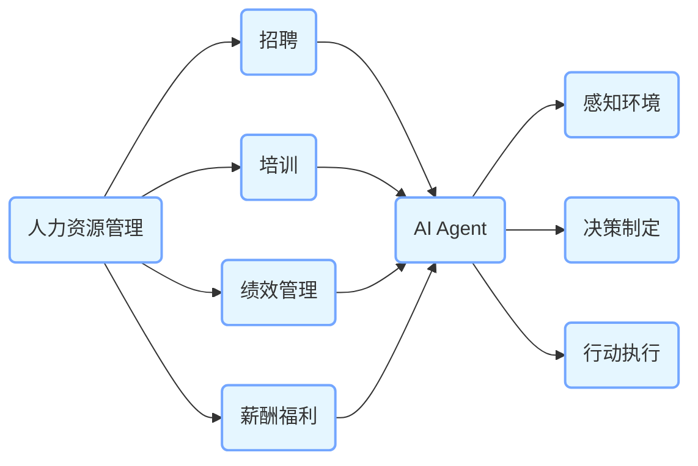

# AI Agent在人力资源管理中的应用

> 关键词：AI Agent、人力资源管理、智能招聘、员工培训、绩效管理

> 摘要：本文深入探讨了AI Agent在人力资源管理中的应用。首先介绍了AI Agent及人力资源管理的背景知识，接着阐述了核心概念及联系，详细讲解了相关算法原理和操作步骤，给出了数学模型和公式。通过实际项目案例展示了AI Agent在人力资源管理中的具体实现，分析了其在不同场景下的应用。同时推荐了学习资源、开发工具和相关论文。最后总结了未来发展趋势与挑战，并提供了常见问题解答和参考资料，旨在为读者全面呈现AI Agent在人力资源管理领域的应用情况。

## 1. 背景介绍 
### 1.1 目的和范围
随着人工智能技术的飞速发展，AI Agent逐渐在各个领域得到广泛应用。在人力资源管理领域，AI Agent的引入可以提高管理效率、降低成本、提升决策的科学性。本文的目的在于深入探讨AI Agent在人力资源管理中的具体应用，包括招聘、培训、绩效管理等各个环节。范围涵盖了AI Agent的基本概念、算法原理、实际案例以及未来发展趋势等方面，旨在为人力资源管理者和相关技术人员提供全面的参考。

### 1.2 预期读者
本文预期读者包括人力资源管理专业人士，他们可以通过了解AI Agent的应用，提升人力资源管理的效率和质量；人工智能领域的技术人员，可从本文中获取AI Agent在人力资源管理场景下的具体应用案例和技术实现思路；高校相关专业的学生，能将其作为学习和研究的参考资料，深入了解跨领域的知识融合。

### 1.3 文档结构概述
本文将按照以下结构展开：首先介绍核心概念与联系，明确AI Agent和人力资源管理相关概念及它们之间的关系；接着详细阐述核心算法原理和具体操作步骤，用Python代码进行解释；然后给出数学模型和公式，并举例说明；通过项目实战展示代码实际案例和详细解释；分析实际应用场景；推荐相关的工具和资源；最后总结未来发展趋势与挑战，提供常见问题解答和参考资料。

### 1.4 术语表
#### 1.4.1 核心术语定义
- **AI Agent（人工智能代理）**：是一种能够感知环境、根据自身的目标和规则进行决策，并采取行动以实现目标的人工智能实体。它可以自主地完成一系列任务，并且能够与其他Agent或人类进行交互。
- **人力资源管理**：是指企业或组织为了实现其战略目标，对人力资源进行有效配置、开发、利用和管理的一系列活动。包括招聘、培训、绩效管理、薪酬福利等方面。

#### 1.4.2 相关概念解释
- **机器学习**：是人工智能的一个重要分支，它让计算机通过数据学习模式和规律，从而能够进行预测和决策。在AI Agent中，机器学习算法常用于训练Agent以提高其性能。
- **自然语言处理**：是研究如何让计算机理解和处理人类语言的技术。在人力资源管理中，自然语言处理可用于简历筛选、员工沟通等场景。

#### 1.4.3 缩略词列表
- **HR（Human Resources）**：人力资源
- **ML（Machine Learning）**：机器学习
- **NLP（Natural Language Processing）**：自然语言处理

## 2. 核心概念与联系 
### 2.1 AI Agent的基本原理
AI Agent的基本原理是基于感知 - 决策 - 行动的循环。它通过传感器感知环境信息，然后根据内部的知识库和算法进行决策，最后通过执行器采取相应的行动。例如，在人力资源管理中，AI Agent可以通过感知招聘网站上的简历信息，根据预设的招聘标准进行决策，筛选出合适的候选人，然后采取行动，如发送面试邀请。

### 2.2 AI Agent与人力资源管理的联系
AI Agent可以在人力资源管理的各个环节发挥重要作用。在招聘环节，AI Agent可以快速筛选简历，识别出符合岗位要求的候选人，提高招聘效率；在培训环节，AI Agent可以根据员工的学习情况和需求，提供个性化的培训方案；在绩效管理环节，AI Agent可以收集和分析员工的工作数据，提供客观的绩效评估。

### 2.3 文本示意图
```plaintext
         +----------------+
         | 人力资源管理   |
         +----------------+
         | 招聘           |
         | 培训           |
         | 绩效管理       |
         | 薪酬福利       |
         +----------------+
               |
               v
         +----------------+
         |  AI Agent       |
         +----------------+
         | 感知环境       |
         | 决策制定       |
         | 行动执行       |
         +----------------+
```

### 2.4 Mermaid流程图


## 3. 核心算法原理 & 具体操作步骤 
### 3.1 简历筛选算法原理
简历筛选是招聘环节中的重要步骤，AI Agent可以使用机器学习算法来实现简历筛选。常用的算法包括朴素贝叶斯分类器、支持向量机等。下面以朴素贝叶斯分类器为例，介绍其原理和Python实现。

朴素贝叶斯分类器基于贝叶斯定理，假设特征之间相互独立。其基本思想是根据已知的训练数据，计算每个类别下各个特征的概率，然后根据这些概率对新的样本进行分类。

### 3.2 Python代码实现
```python
import numpy as np
from sklearn.feature_extraction.text import CountVectorizer
from sklearn.naive_bayes import MultinomialNB

# 训练数据
train_data = [
    ("有多年Java开发经验，熟悉Spring框架", "合适"),
    ("只学过C语言，没有Java经验", "不合适"),
    ("掌握Python和机器学习算法", "合适"),
    ("主要从事前端开发，不熟悉后端技术", "不合适")
]

# 提取特征和标签
train_texts = [data[0] for data in train_data]
train_labels = [data[1] for data in train_data]

# 特征提取
vectorizer = CountVectorizer()
X_train = vectorizer.fit_transform(train_texts)

# 训练模型
clf = MultinomialNB()
clf.fit(X_train, train_labels)

# 测试数据
test_text = ["有两年Java开发经验，了解Spring Boot"]
X_test = vectorizer.transform(test_text)

# 预测
prediction = clf.predict(X_test)
print("预测结果:", prediction[0])
```

### 3.3 代码解释
1. **数据准备**：定义训练数据，包括简历文本和对应的标签（合适或不合适）。
2. **特征提取**：使用`CountVectorizer`将文本转换为向量表示，以便机器学习算法处理。
3. **模型训练**：使用`MultinomialNB`训练朴素贝叶斯分类器。
4. **预测**：对新的简历文本进行预测，输出预测结果。

### 3.4 具体操作步骤
1. **数据收集**：收集大量的简历数据，并标注合适或不合适的标签。
2. **数据预处理**：对简历文本进行清洗、分词等处理。
3. **特征提取**：将文本转换为向量表示。
4. **模型训练**：使用训练数据训练机器学习模型。
5. **模型评估**：使用测试数据评估模型的性能。
6. **部署应用**：将训练好的模型部署到AI Agent中，用于实际的简历筛选。

## 4. 数学模型和公式 & 详细讲解 & 举例说明 
### 4.1 朴素贝叶斯分类器的数学模型
朴素贝叶斯分类器基于贝叶斯定理，其公式为：

$$P(C|X)=\frac{P(X|C)P(C)}{P(X)}$$

其中，$P(C|X)$ 是在特征 $X$ 出现的情况下类别 $C$ 的概率，$P(X|C)$ 是在类别 $C$ 下特征 $X$ 出现的概率，$P(C)$ 是类别 $C$ 的先验概率，$P(X)$ 是特征 $X$ 出现的概率。

由于在分类问题中，我们只需要比较不同类别下的后验概率 $P(C|X)$ 的大小，而 $P(X)$ 对于所有类别都是相同的，因此可以忽略 $P(X)$，得到：

$$P(C|X)\propto P(X|C)P(C)$$

### 4.2 详细讲解
- **先验概率 $P(C)$**：是指在没有任何特征信息的情况下，类别 $C$ 出现的概率。可以通过训练数据中各类别样本的比例来估计。
- **似然概率 $P(X|C)$**：是指在类别 $C$ 下特征 $X$ 出现的概率。在朴素贝叶斯分类器中，假设特征之间相互独立，因此可以将 $P(X|C)$ 分解为各个特征的条件概率的乘积：

$$P(X|C)=\prod_{i=1}^{n}P(x_i|C)$$

其中，$x_i$ 是特征 $X$ 的第 $i$ 个特征值。

### 4.3 举例说明
假设有一个招聘岗位要求是Java开发工程师，我们有两个类别：合适和不合适。训练数据如下：

| 简历文本 | 标签 |
| --- | --- |
| 有多年Java开发经验，熟悉Spring框架 | 合适 |
| 只学过C语言，没有Java经验 | 不合适 |

我们要对一份新的简历“有两年Java开发经验，了解Spring Boot”进行分类。

首先，计算先验概率：

- $P(合适)=\frac{1}{2}$
- $P(不合适)=\frac{1}{2}$

然后，计算似然概率：

假设我们使用词袋模型，将简历文本转换为词频向量。对于新的简历，包含的关键词有“Java”、“开发经验”、“Spring Boot”。

在“合适”类别下：

- $P(Java|合适)=1$
- $P(开发经验|合适)=1$
- $P(Spring Boot|合适)=0$（假设训练数据中没有出现过）

在“不合适”类别下：

- $P(Java|不合适)=0$
- $P(开发经验|不合适)=0$
- $P(Spring Boot|不合适)=0$

根据朴素贝叶斯公式：

- $P(合适|X)\propto P(X|合适)P(合适)=(1\times1\times0)\times\frac{1}{2}=0$
- $P(不合适|X)\propto P(X|不合适)P(不合适)=(0\times0\times0)\times\frac{1}{2}=0$

由于训练数据有限，这里出现了概率为0的情况。在实际应用中，通常会使用平滑技术，如拉普拉斯平滑，来避免这种情况。

## 5. 项目实战：代码实际案例和详细解释说明 
### 5.1  开发环境搭建
#### 5.1.1 安装Python
首先，需要安装Python环境。可以从Python官方网站（https://www.python.org/downloads/）下载适合自己操作系统的Python版本，并按照安装向导进行安装。

#### 5.1.2 安装必要的库
使用`pip`命令安装必要的库，包括`scikit-learn`、`numpy`等。

```sh
pip install scikit-learn numpy
```

### 5.2  源代码详细实现和代码解读
以下是一个完整的AI Agent在招聘简历筛选中的项目代码：

```python
import numpy as np
from sklearn.feature_extraction.text import TfidfVectorizer
from sklearn.naive_bayes import MultinomialNB
from sklearn.model_selection import train_test_split
from sklearn.metrics import accuracy_score

# 模拟招聘数据
data = [
    ("有多年Java开发经验，熟悉Spring框架", "合适"),
    ("只学过C语言，没有Java经验", "不合适"),
    ("掌握Python和机器学习算法", "合适"),
    ("主要从事前端开发，不熟悉后端技术", "不合适"),
    ("有三年Java开发经验，熟悉微服务架构", "合适"),
    ("学过一些编程语言，但没有项目经验", "不合适")
]

# 提取特征和标签
texts = [d[0] for d in data]
labels = [d[1] for d in data]

# 特征提取
vectorizer = TfidfVectorizer()
X = vectorizer.fit_transform(texts)

# 划分训练集和测试集
X_train, X_test, y_train, y_test = train_test_split(X, labels, test_size=0.2, random_state=42)

# 训练模型
clf = MultinomialNB()
clf.fit(X_train, y_train)

# 预测
y_pred = clf.predict(X_test)

# 评估模型
accuracy = accuracy_score(y_test, y_pred)
print("模型准确率:", accuracy)

# 新简历预测
new_resume = ["有一年Java开发经验，了解Spring Cloud"]
new_resume_vector = vectorizer.transform(new_resume)
prediction = clf.predict(new_resume_vector)
print("新简历预测结果:", prediction[0])
```

### 5.3  代码解读与分析
1. **数据准备**：定义模拟的招聘数据，包括简历文本和对应的标签。
2. **特征提取**：使用`TfidfVectorizer`将文本转换为TF-IDF向量表示，TF-IDF可以更好地反映文本中关键词的重要性。
3. **数据划分**：使用`train_test_split`将数据划分为训练集和测试集，测试集占比为20%。
4. **模型训练**：使用`MultinomialNB`训练朴素贝叶斯分类器。
5. **模型评估**：使用`accuracy_score`计算模型在测试集上的准确率。
6. **新简历预测**：对新的简历文本进行预测，输出预测结果。

通过这个项目，我们可以看到AI Agent如何使用机器学习算法实现简历筛选，提高招聘效率。

## 6. 实际应用场景 
### 6.1 招聘环节
- **简历筛选**：AI Agent可以快速筛选大量简历，根据岗位要求识别出符合条件的候选人，减少人工筛选的工作量。
- **候选人推荐**：通过分析候选人的简历和岗位要求，AI Agent可以为招聘人员推荐最匹配的候选人。
- **面试安排**：AI Agent可以与候选人进行沟通，安排面试时间和地点，提高面试安排的效率。

### 6.2 员工培训环节
- **个性化培训方案制定**：AI Agent可以根据员工的技能水平、学习习惯和职业发展目标，制定个性化的培训方案。
- **学习资源推荐**：根据员工的培训需求，AI Agent可以推荐适合的学习资源，如在线课程、书籍等。
- **学习进度跟踪**：AI Agent可以跟踪员工的学习进度，及时发现问题并提供帮助。

### 6.3 绩效管理环节
- **绩效数据收集**：AI Agent可以自动收集员工的工作数据，如工作时长、任务完成情况等。
- **绩效评估**：根据收集到的数据，AI Agent可以进行客观的绩效评估，减少人为因素的影响。
- **绩效反馈**：AI Agent可以将绩效评估结果及时反馈给员工，并提供改进建议。

### 6.4 薪酬福利管理环节
- **薪酬计算**：AI Agent可以根据员工的绩效、岗位等级等因素，自动计算薪酬。
- **福利推荐**：根据员工的需求和偏好，AI Agent可以推荐适合的福利方案。
- **员工满意度调查**：AI Agent可以通过问卷调查等方式，收集员工对薪酬福利的满意度，为企业提供改进依据。

## 7. 工具和资源推荐
### 7.1 学习资源推荐
#### 7.1.1 书籍推荐
- 《Python机器学习》：介绍了Python在机器学习中的应用，包括各种机器学习算法的原理和实现。
- 《自然语言处理入门》：系统地介绍了自然语言处理的基本概念、方法和技术。
- 《人力资源管理概论》：全面阐述了人力资源管理的各个方面，为理解人力资源管理业务提供了理论基础。

#### 7.1.2 在线课程
- Coursera上的“机器学习”课程：由斯坦福大学教授Andrew Ng授课，是机器学习领域的经典课程。
- edX上的“自然语言处理”课程：介绍了自然语言处理的最新技术和应用。
- 中国大学MOOC上的“人力资源管理”课程：由国内知名高校的教授授课，内容丰富实用。

#### 7.1.3 技术博客和网站
- 机器之心：提供人工智能领域的最新技术和应用案例。
- 开源中国：涵盖了各种开源技术和项目，包括机器学习和自然语言处理相关的项目。
- 人力资源管理专业网站：如HRoot，提供人力资源管理的最新资讯和实践经验。

### 7.2 开发工具框架推荐
#### 7.2.1 IDE和编辑器
- PyCharm：是一款专业的Python集成开发环境，提供了丰富的代码编辑、调试和分析功能。
- Jupyter Notebook：是一个交互式的开发环境，适合进行数据探索和模型训练。
- Visual Studio Code：是一款轻量级的代码编辑器，支持多种编程语言和插件扩展。

#### 7.2.2 调试和性能分析工具
- Py-Spy：可以实时分析Python程序的性能，找出性能瓶颈。
- cProfile：是Python内置的性能分析工具，可以统计函数调用的时间和次数。
- TensorBoard：是TensorFlow提供的可视化工具，可以用于查看模型训练过程中的各种指标。

#### 7.2.3 相关框架和库
- Scikit-learn：是一个常用的机器学习库，提供了各种机器学习算法的实现和工具。
- NLTK：是一个自然语言处理工具包，包含了丰富的语料库和处理工具。
- SpaCy：是一个高效的自然语言处理库，适合处理大规模的文本数据。

### 7.3 相关论文著作推荐
#### 7.3.1 经典论文
- 《A Mathematical Theory of Communication》：奠定了信息论的基础，对自然语言处理和机器学习有重要的影响。
- 《The Elements of Statistical Learning》：系统地介绍了统计学习的基本理论和方法。
- 《Introduction to Information Retrieval》：是信息检索领域的经典著作，对文本处理和搜索算法有深入的讲解。

#### 7.3.2 最新研究成果
- 可以关注顶级学术会议如NeurIPS、ACL等的论文，了解AI Agent在人力资源管理中的最新研究进展。
- 查阅相关的学术期刊，如《Journal of Artificial Intelligence Research》、《Journal of Management Information Systems》等。

#### 7.3.3 应用案例分析
- 可以参考一些企业的实际应用案例，了解AI Agent在人力资源管理中的具体实施情况和效果。例如，一些大型科技公司在招聘、培训等环节使用AI Agent的案例。

## 8. 总结：未来发展趋势与挑战
### 8.1 未来发展趋势
- **智能化程度不断提高**：AI Agent将具备更强的学习能力和推理能力，能够更好地理解和处理复杂的人力资源管理问题。
- **多模态交互**：除了文本交互，AI Agent将支持语音、图像等多模态交互方式，提高与员工的沟通效率。
- **与其他系统集成**：AI Agent将与企业的其他信息系统，如ERP、CRM等进行深度集成，实现数据的共享和业务流程的自动化。
- **个性化服务**：根据员工的个性化需求，AI Agent将提供更加精准的服务，如个性化的职业发展规划、培训方案等。

### 8.2 挑战
- **数据隐私和安全问题**：AI Agent需要处理大量的员工数据，如何保证数据的隐私和安全是一个重要的挑战。
- **算法可解释性**：一些复杂的机器学习算法，如深度学习算法，其决策过程往往难以解释，这在人力资源管理中可能会引起员工的质疑。
- **员工接受度**：员工可能对AI Agent的应用存在抵触情绪，如何提高员工的接受度是推广AI Agent的关键。
- **技术更新换代快**：人工智能技术发展迅速，企业需要不断更新和升级AI Agent，以跟上技术的发展步伐。

## 9. 附录：常见问题与解答
### 9.1 AI Agent在人力资源管理中的应用是否会导致员工失业？
AI Agent的应用主要是为了提高人力资源管理的效率和质量，而不是取代人类。虽然一些重复性的工作可能会被AI Agent取代，但同时也会创造出一些新的岗位，如AI Agent的开发、维护和管理等。因此，员工可以通过学习新的技能，适应技术的发展，实现职业转型。

### 9.2 AI Agent的决策是否可靠？
AI Agent的决策可靠性取决于其训练数据和算法。如果训练数据足够丰富和准确，算法设计合理，那么AI Agent的决策是可以信赖的。但是，在实际应用中，仍然需要人工进行审核和监督，以确保决策的准确性和公正性。

### 9.3 如何保证AI Agent处理员工数据的隐私和安全？
企业需要采取一系列措施来保证AI Agent处理员工数据的隐私和安全。例如，对数据进行加密处理，限制数据的访问权限，定期进行数据备份和恢复等。同时，企业还需要遵守相关的法律法规，如《中华人民共和国个人信息保护法》等。

### 9.4 AI Agent是否可以完全替代人力资源管理者？
虽然AI Agent可以在人力资源管理的一些环节发挥重要作用，但它不能完全替代人力资源管理者。人力资源管理涉及到很多人性化的工作，如员工沟通、团队建设等，这些工作需要人力资源管理者具备丰富的经验和情感理解能力。AI Agent可以作为人力资源管理者的辅助工具，帮助他们提高工作效率和决策的科学性。

## 10. 扩展阅读 & 参考资料
- 《人工智能：现代方法》
- 《人力资源管理：赢得竞争优势》
- 机器之心官网（https://www.alpaca.ai/）
- HRoot官网（https://www.hrroot.com/）

作者：AI天才研究院/AI Genius Institute & 禅与计算机程序设计艺术 /Zen And The Art of Computer Programming