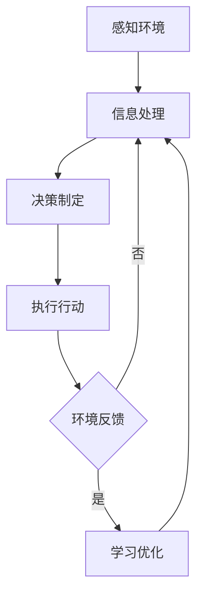

# AI Agent在企业产品创新与概念验证中的应用

> 关键词：AI Agent、企业产品创新、概念验证、人工智能、应用实践

> 摘要：本文深入探讨了AI Agent在企业产品创新与概念验证中的应用。首先介绍了相关背景，包括目的范围、预期读者等内容。接着阐述了AI Agent的核心概念与联系，通过文本示意图和Mermaid流程图进行直观展示。详细讲解了核心算法原理，使用Python代码进行示例。对涉及的数学模型和公式进行了推导和举例说明。结合实际项目，给出代码案例并详细解读。分析了AI Agent在企业中的实际应用场景，推荐了学习资源、开发工具框架以及相关论文著作。最后总结了未来发展趋势与挑战，并提供常见问题解答和扩展阅读参考资料，旨在为企业在产品创新和概念验证方面应用AI Agent提供全面的指导。

## 1. 背景介绍 
### 1.1 目的和范围
在当今快速发展的科技时代，企业面临着日益激烈的市场竞争，产品创新成为企业生存和发展的关键。AI Agent作为人工智能领域的重要技术，具有自主学习、决策和执行任务的能力，为企业的产品创新和概念验证提供了新的思路和方法。本文的目的是全面探讨AI Agent在企业产品创新与概念验证中的应用，包括其核心概念、算法原理、实际应用场景等，帮助企业更好地理解和应用这一技术。范围涵盖了AI Agent的基本原理、在不同行业的应用案例以及相关的开发工具和资源。

### 1.2 预期读者
本文的预期读者包括企业的产品经理、技术研发人员、创新团队成员以及对人工智能技术在企业应用感兴趣的专业人士。产品经理可以从中了解如何利用AI Agent进行产品创新和概念验证，提高产品的竞争力；技术研发人员可以学习到AI Agent的核心算法和实现方法，为实际开发工作提供参考；创新团队成员可以获得新的创新灵感和思路；对人工智能技术感兴趣的专业人士可以拓宽知识面，了解其在企业领域的应用前景。

### 1.3 文档结构概述
本文将按照以下结构进行组织：首先介绍背景信息，包括目的范围、预期读者等；接着阐述AI Agent的核心概念与联系，通过文本示意图和流程图进行直观展示；详细讲解核心算法原理，并使用Python代码进行示例；对涉及的数学模型和公式进行推导和举例说明；结合实际项目，给出代码案例并详细解读；分析AI Agent在企业中的实际应用场景；推荐学习资源、开发工具框架以及相关论文著作；最后总结未来发展趋势与挑战，提供常见问题解答和扩展阅读参考资料。

### 1.4 术语表
#### 1.4.1 核心术语定义
- **AI Agent（人工智能代理）**：是一种能够感知环境、自主学习、做出决策并执行任务的人工智能实体。它可以根据预设的目标和规则，在不同的环境中独立运行，与外界进行交互。
- **企业产品创新**：指企业通过引入新的产品理念、技术或功能，对现有产品进行改进或开发全新的产品，以满足市场需求，提高企业的竞争力。
- **概念验证（Proof of Concept，PoC）**：是一种在产品开发早期进行的验证活动，旨在证明某个概念或想法的可行性和潜在价值。通过小规模的实验和测试，验证产品的核心功能和技术方案是否可行。

#### 1.4.2 相关概念解释
- **机器学习**：是AI Agent实现自主学习的重要技术手段。它通过对大量数据的学习和分析，建立模型，从而能够对未知数据进行预测和决策。常见的机器学习算法包括决策树、神经网络、支持向量机等。
- **深度学习**：是机器学习的一个分支，它使用深度神经网络模型来处理复杂的数据和任务。深度学习在图像识别、语音识别、自然语言处理等领域取得了显著的成果，为AI Agent的发展提供了强大的技术支持。
- **强化学习**：是一种通过智能体与环境进行交互，以最大化累积奖励为目标的学习方法。在强化学习中，智能体根据环境的反馈不断调整自己的行为策略，以获得最优的决策结果。

#### 1.4.3 缩略词列表
- **PoC**：Proof of Concept（概念验证）
- **ML**：Machine Learning（机器学习）
- **DL**：Deep Learning（深度学习）
- **RL**：Reinforcement Learning（强化学习）

## 2. 核心概念与联系 
### 核心概念原理
AI Agent的核心原理是基于感知、决策和行动的循环过程。它通过传感器感知周围环境的信息，然后对这些信息进行处理和分析，根据预设的目标和规则做出决策，最后通过执行器执行相应的行动。在这个过程中，AI Agent可以通过学习不断优化自己的决策和行动策略，以适应不同的环境和任务需求。

例如，在一个智能客服系统中，AI Agent可以通过自然语言处理技术感知用户的问题，然后根据知识库和机器学习模型做出回答，将回答结果通过语音或文字的方式反馈给用户。同时，AI Agent可以根据用户的反馈不断学习和改进自己的回答策略，提高服务质量。

### 架构的文本示意图
```plaintext
           +-------------------+
           |    感知模块       |
           | （传感器、数据采集）|
           +-------------------+
                    |
                    v
           +-------------------+
           |    决策模块       |
           | （机器学习、推理） |
           +-------------------+
                    |
                    v
           +-------------------+
           |    行动模块       |
           | （执行器、输出）   |
           +-------------------+
```
这个示意图展示了AI Agent的基本架构，包括感知模块、决策模块和行动模块。感知模块负责收集环境信息，决策模块根据感知到的信息进行分析和决策，行动模块则执行决策结果。

### Mermaid流程图

这个流程图展示了AI Agent的工作流程。首先，AI Agent感知环境信息，然后对信息进行处理，根据处理结果制定决策，执行相应的行动。行动执行后，AI Agent会收到环境的反馈，如果反馈表明需要优化，则进行学习优化，然后再次进行信息处理；如果反馈不需要优化，则直接进入下一轮信息处理。

## 3. 核心算法原理 & 具体操作步骤 
### 核心算法原理
在AI Agent中，常用的核心算法包括机器学习算法和强化学习算法。下面以强化学习中的Q - learning算法为例进行详细讲解。

Q - learning算法是一种无模型的强化学习算法，它通过学习一个Q值函数来优化智能体的行为策略。Q值函数表示在某个状态下采取某个动作所能获得的最大累积奖励。智能体通过不断地与环境进行交互，更新Q值函数，从而找到最优的行为策略。

### Python源代码详细阐述
```python
import numpy as np

# 定义环境参数
num_states = 5  # 状态数量
num_actions = 2  # 动作数量
gamma = 0.9  # 折扣因子
alpha = 0.1  # 学习率

# 初始化Q表
Q = np.zeros((num_states, num_actions))

# 定义环境的转移函数和奖励函数
def environment(state, action):
    # 简单示例：随机转移到下一个状态
    next_state = np.random.randint(0, num_states)
    # 简单示例：奖励为随机值
    reward = np.random.randint(-1, 2)
    return next_state, reward

# Q - learning算法
def q_learning(num_episodes):
    for episode in range(num_episodes):
        state = np.random.randint(0, num_states)  # 随机初始化状态
        done = False
        while not done:
            # 选择动作（epsilon - greedy策略）
            epsilon = 0.1
            if np.random.uniform(0, 1) < epsilon:
                action = np.random.randint(0, num_actions)
            else:
                action = np.argmax(Q[state, :])

            # 执行动作，获取下一个状态和奖励
            next_state, reward = environment(state, action)

            # 更新Q值
            Q[state, action] = Q[state, action] + alpha * (reward + gamma * np.max(Q[next_state, :]) - Q[state, action])

            # 判断是否结束
            if np.random.uniform(0, 1) < 0.1:  # 简单示例：以10%的概率结束
                done = True
            state = next_state

    return Q

# 训练Q - learning模型
num_episodes = 1000
Q = q_learning(num_episodes)
print("训练后的Q表：")
print(Q)
```
### 具体操作步骤
1. **初始化**：初始化Q表，将其所有元素置为0。定义环境的状态数量、动作数量、折扣因子和学习率。
2. **选择动作**：在每个时间步，智能体根据epsilon - greedy策略选择一个动作。epsilon - greedy策略以一定的概率（epsilon）随机选择一个动作，以1 - epsilon的概率选择Q值最大的动作。
3. **执行动作**：智能体执行选择的动作，与环境进行交互，获取下一个状态和奖励。
4. **更新Q值**：根据Q - learning算法的更新公式更新Q表中的Q值。更新公式为：
   $Q(s,a) = Q(s,a)+\alpha[r + \gamma\max_{a'}Q(s',a') - Q(s,a)]$
   其中，$s$ 是当前状态，$a$ 是当前动作，$r$ 是奖励，$s'$ 是下一个状态，$\alpha$ 是学习率，$\gamma$ 是折扣因子。
5. **判断是否结束**：根据一定的条件判断当前回合是否结束。如果结束，则开始下一个回合；否则，继续执行步骤2 - 4。
6. **训练结束**：经过一定数量的回合训练后，Q表收敛，训练结束。智能体可以根据训练好的Q表选择最优的动作。

## 4. 数学模型和公式 & 详细讲解 & 举例说明 
### 数学模型
在强化学习中，常用的数学模型是马尔可夫决策过程（Markov Decision Process，MDP）。MDP由一个四元组 $(S, A, P, R)$ 表示，其中：
- $S$ 是状态集合，表示智能体可能处于的所有状态。
- $A$ 是动作集合，表示智能体可以采取的所有动作。
- $P$ 是状态转移概率函数，$P(s'|s,a)$ 表示在状态 $s$ 下采取动作 $a$ 后转移到状态 $s'$ 的概率。
- $R$ 是奖励函数，$R(s,a)$ 表示在状态 $s$ 下采取动作 $a$ 所获得的即时奖励。

### 核心公式
#### 1. 状态价值函数
状态价值函数 $V^\pi(s)$ 表示在策略 $\pi$ 下，从状态 $s$ 开始所能获得的期望累积奖励。其定义为：
$$V^\pi(s) = E\left[\sum_{t = 0}^{\infty}\gamma^tR_{t + 1}|S_0 = s\right]$$
其中，$\gamma$ 是折扣因子，$0\leqslant\gamma\leqslant1$，用于权衡即时奖励和未来奖励的重要性。

#### 2. 动作价值函数
动作价值函数 $Q^\pi(s,a)$ 表示在策略 $\pi$ 下，从状态 $s$ 开始采取动作 $a$ 后所能获得的期望累积奖励。其定义为：
$$Q^\pi(s,a) = E\left[\sum_{t = 0}^{\infty}\gamma^tR_{t + 1}|S_0 = s, A_0 = a\right]$$

#### 3. Q - learning更新公式
在Q - learning算法中，Q值的更新公式为：
$$Q(s,a) \leftarrow Q(s,a)+\alpha\left[R(s,a)+\gamma\max_{a'}Q(s',a') - Q(s,a)\right]$$
其中，$\alpha$ 是学习率，用于控制每次更新的步长。

### 详细讲解
状态价值函数和动作价值函数是强化学习中的重要概念，它们用于评估不同状态和动作的价值。状态价值函数反映了从某个状态开始，按照当前策略所能获得的长期收益；动作价值函数则反映了在某个状态下采取某个动作的长期收益。

Q - learning算法通过不断更新Q值函数来逼近最优的动作价值函数。在每个时间步，智能体根据当前的Q值选择动作，与环境进行交互，获取奖励和下一个状态，然后根据Q - learning更新公式更新Q值。随着训练的进行，Q值函数逐渐收敛到最优值，智能体可以根据最优的Q值函数选择最优的动作。

### 举例说明
假设有一个简单的迷宫环境，智能体的目标是从起点走到终点。迷宫中的每个位置可以看作一个状态，智能体可以采取上下左右四个方向的动作。当智能体到达终点时，获得一个正奖励；当智能体撞到墙壁时，获得一个负奖励。

在这个环境中，状态集合 $S$ 是迷宫中所有位置的集合，动作集合 $A$ 是上下左右四个动作的集合。状态转移概率函数 $P$ 描述了智能体在某个位置采取某个动作后转移到下一个位置的概率。奖励函数 $R$ 则根据智能体的位置和动作给出相应的奖励。

智能体可以使用Q - learning算法来学习如何在迷宫中找到最优路径。通过不断地与环境进行交互，更新Q值函数，最终找到从起点到终点的最优动作序列。

## 5. 项目实战：代码实际案例和详细解释说明 
### 5.1 开发环境搭建
#### 1. 安装Python
首先，需要安装Python编程语言。可以从Python官方网站（https://www.python.org/downloads/）下载适合自己操作系统的Python版本，并按照安装向导进行安装。

#### 2. 安装必要的库
在项目中，需要使用一些Python库，如NumPy、Matplotlib等。可以使用pip命令进行安装：
```bash
pip install numpy matplotlib
```

#### 3. 选择开发工具
可以选择使用集成开发环境（IDE），如PyCharm、Jupyter Notebook等，也可以使用文本编辑器，如VS Code等。

### 5.2 源代码详细实现和代码解读
下面是一个简单的AI Agent在迷宫环境中寻找最优路径的代码示例：
```python
import numpy as np
import matplotlib.pyplot as plt

# 定义迷宫环境
maze = np.array([
    [0, 0, 0, 0],
    [0, 1, 1, 0],
    [0, 1, 0, 0],
    [0, 0, 0, 2]
])

# 定义状态和动作
num_states = maze.size
num_actions = 4  # 上、下、左、右

# 初始化Q表
Q = np.zeros((num_states, num_actions))

# 定义动作函数
def action(state, action):
    rows, cols = maze.shape
    row = state // cols
    col = state % cols
    if action == 0:  # 上
        new_row = max(row - 1, 0)
        new_col = col
    elif action == 1:  # 下
        new_row = min(row + 1, rows - 1)
        new_col = col
    elif action == 2:  # 左
        new_row = row
        new_col = max(col - 1, 0)
    elif action == 3:  # 右
        new_row = row
        new_col = min(col + 1, cols - 1)
    new_state = new_row * cols + new_col
    if maze[new_row, new_col] == 1:  # 撞到墙壁
        reward = -1
        new_state = state
    elif maze[new_row, new_col] == 2:  # 到达终点
        reward = 10
    else:
        reward = -0.1
    return new_state, reward

# Q - learning算法
def q_learning(num_episodes, gamma=0.9, alpha=0.1, epsilon=0.1):
    rewards = []
    for episode in range(num_episodes):
        state = 0  # 起点
        total_reward = 0
        done = False
        while not done:
            # 选择动作（epsilon - greedy策略）
            if np.random.uniform(0, 1) < epsilon:
                action_index = np.random.randint(0, num_actions)
            else:
                action_index = np.argmax(Q[state, :])

            # 执行动作，获取下一个状态和奖励
            next_state, reward = action(state, action_index)

            # 更新Q值
            Q[state, action_index] = Q[state, action_index] + alpha * (reward + gamma * np.max(Q[next_state, :]) - Q[state, action_index])

            total_reward += reward
            state = next_state

            if maze[state // maze.shape[1], state % maze.shape[1]] == 2:  # 到达终点
                done = True
        rewards.append(total_reward)
    return rewards

# 训练Q - learning模型
num_episodes = 1000
rewards = q_learning(num_episodes)

# 绘制奖励曲线
plt.plot(rewards)
plt.xlabel('Episode')
plt.ylabel('Total Reward')
plt.title('Q - learning Training Rewards')
plt.show()

# 测试最优路径
state = 0
path = [state]
done = False
while not done:
    action_index = np.argmax(Q[state, :])
    next_state, _ = action(state, action_index)
    path.append(next_state)
    if maze[next_state // maze.shape[1], next_state % maze.shape[1]] == 2:
        done = True
    state = next_state

print("最优路径：", path)
```
### 代码解读与分析
#### 1. 迷宫环境定义
```python
maze = np.array([
    [0, 0, 0, 0],
    [0, 1, 1, 0],
    [0, 1, 0, 0],
    [0, 0, 0, 2]
])
```
这里使用NumPy数组定义了一个迷宫环境，其中0表示可通行的区域，1表示墙壁，2表示终点。

#### 2. Q表初始化
```python
Q = np.zeros((num_states, num_actions))
```
初始化Q表，将其所有元素置为0。Q表的行数为状态数量，列数为动作数量。

#### 3. 动作函数
```python
def action(state, action):
   ...
```
该函数根据当前状态和动作，计算下一个状态和奖励。如果撞到墙壁，奖励为 - 1；如果到达终点，奖励为10；否则，奖励为 - 0.1。

#### 4. Q - learning算法
```python
def q_learning(num_episodes, gamma=0.9, alpha=0.1, epsilon=0.1):
   ...
```
该函数实现了Q - learning算法的训练过程。在每个回合中，智能体从起点开始，根据epsilon - greedy策略选择动作，与环境进行交互，更新Q值，直到到达终点。记录每个回合的总奖励。

#### 5. 训练和测试
```python
num_episodes = 1000
rewards = q_learning(num_episodes)

# 绘制奖励曲线
plt.plot(rewards)
...

# 测试最优路径
state = 0
path = [state]
...
```
训练Q - learning模型，并绘制奖励曲线，观察训练过程中奖励的变化。训练完成后，根据训练好的Q表测试最优路径。

## 6. 实际应用场景 
### 产品设计优化
AI Agent可以在产品设计阶段发挥重要作用。通过收集市场数据、用户反馈和竞争对手信息，AI Agent可以分析出用户的需求和痛点，为产品设计提供有价值的建议。例如，在一款智能手机的设计中，AI Agent可以分析用户对手机功能、外观、性能等方面的偏好，帮助设计师优化产品的设计方案，提高产品的市场竞争力。

### 概念验证加速
在企业推出新产品或新服务之前，需要进行概念验证。AI Agent可以通过模拟用户行为、市场反应等方式，快速验证产品概念的可行性。例如，在推出一款新的电商平台之前，AI Agent可以模拟用户在平台上的购物行为，分析平台的流量、转化率等指标，评估平台的商业模式是否可行，从而加速概念验证的过程。

### 客户服务创新
AI Agent可以应用于客户服务领域，提供更加智能、高效的服务。例如，智能客服系统可以使用AI Agent自动回答客户的问题，解决客户的问题。AI Agent可以通过自然语言处理技术理解客户的问题，根据知识库和机器学习模型提供准确的回答。同时，AI Agent可以通过学习客户的历史问题和反馈，不断优化自己的回答策略，提高客户满意度。

### 供应链管理优化
在供应链管理中，AI Agent可以实时监控供应链的各个环节，预测需求、优化库存管理和物流配送。例如，AI Agent可以根据历史销售数据和市场趋势，预测产品的需求，帮助企业合理安排生产和库存。同时，AI Agent可以实时跟踪物流运输情况，优化配送路线，提高物流效率，降低成本。

## 7. 工具和资源推荐
### 7.1 学习资源推荐
#### 7.1.1 书籍推荐
- 《人工智能：一种现代的方法》（Artificial Intelligence: A Modern Approach）：这是一本经典的人工智能教材，全面介绍了人工智能的各个领域，包括搜索算法、机器学习、自然语言处理等。
- 《强化学习：原理与Python实现》（Reinforcement Learning: An Introduction）：详细介绍了强化学习的基本原理和算法，是学习强化学习的经典书籍。
- 《Python机器学习》（Python Machine Learning）：通过Python代码示例，介绍了机器学习的基本算法和应用，适合初学者学习。

#### 7.1.2 在线课程
- Coursera上的“机器学习”课程：由斯坦福大学的Andrew Ng教授授课，是学习机器学习的经典课程，涵盖了机器学习的基本算法和应用。
- edX上的“强化学习基础”课程：介绍了强化学习的基本概念和算法，通过实际案例帮助学员掌握强化学习的应用。
- 阿里云天池平台的“人工智能实战营”：提供了丰富的人工智能实践课程，包括机器学习、深度学习、强化学习等，适合有一定基础的学员进一步提高。

#### 7.1.3 技术博客和网站
- Medium：是一个技术博客平台，上面有很多关于人工智能、机器学习、强化学习等领域的优秀文章。
- Towards Data Science：专注于数据科学和人工智能领域的技术博客，提供了很多实用的技术文章和案例分析。
- arXiv：是一个预印本论文平台，上面有很多最新的人工智能研究成果和论文。

### 7.2 开发工具框架推荐
#### 7.2.1 IDE和编辑器
- PyCharm：是一款专业的Python集成开发环境，提供了丰富的功能，如代码编辑、调试、版本控制等，适合Python开发。
- Jupyter Notebook：是一个交互式的开发环境，支持多种编程语言，尤其适合数据科学和机器学习的开发和实验。
- VS Code：是一款轻量级的代码编辑器，支持多种编程语言和插件扩展，具有良好的开发体验。

#### 7.2.2 调试和性能分析工具
- PDB：是Python自带的调试工具，可以帮助开发者调试Python代码，定位问题。
- TensorBoard：是TensorFlow提供的可视化工具，可以帮助开发者可视化模型的训练过程、性能指标等。
- cProfile：是Python的性能分析工具，可以帮助开发者分析代码的性能瓶颈，优化代码。

#### 7.2.3 相关框架和库
- TensorFlow：是Google开发的开源深度学习框架，提供了丰富的深度学习模型和工具，支持多种硬件平台。
- PyTorch：是Facebook开发的开源深度学习框架，具有简洁易用的特点，适合快速开发和实验。
- Stable Baselines3：是一个基于PyTorch的强化学习库，提供了多种强化学习算法的实现，方便开发者进行强化学习的开发和实验。

### 7.3 相关论文著作推荐
#### 7.3.1 经典论文
- “Q - learning”：由Christopher J. C. H. Watkins和Peter Dayan发表，是Q - learning算法的经典论文，介绍了Q - learning算法的基本原理和实现方法。
- “Playing Atari with Deep Reinforcement Learning”：由DeepMind团队发表，提出了深度Q网络（DQN）算法，将深度学习和强化学习相结合，在Atari游戏中取得了显著的成果。
- “Asynchronous Methods for Deep Reinforcement Learning”：由DeepMind团队发表，提出了异步优势演员 - 评论家（A3C）算法，提高了强化学习的训练效率。

#### 7.3.2 最新研究成果
- 关注NeurIPS（神经信息处理系统大会）、ICML（国际机器学习会议）、CVPR（计算机视觉与模式识别会议）等顶级学术会议，这些会议上会发布很多最新的人工智能研究成果。
- 关注arXiv上的最新论文，及时了解人工智能领域的最新研究动态。

#### 7.3.3 应用案例分析
- 《人工智能时代的企业转型》：介绍了人工智能在企业各个领域的应用案例，包括产品创新、客户服务、供应链管理等，为企业应用人工智能提供了参考。
- 《AI实战：从算法到商业落地》：通过实际案例分析，介绍了人工智能在不同行业的应用和商业落地经验。

## 8. 总结：未来发展趋势与挑战
### 未来发展趋势
#### 1. 与其他技术的融合
AI Agent将与物联网、大数据、云计算等技术深度融合，实现更加智能化的应用。例如，在智能家居领域，AI Agent可以通过物联网设备收集家庭环境信息，结合大数据分析和云计算的强大计算能力，实现智能家电的自动控制和优化管理。

#### 2. 多智能体协作
未来的AI Agent将不仅仅是单个智能体的应用，而是多个智能体之间的协作。多个AI Agent可以通过通信和协调，共同完成复杂的任务。例如，在自动驾驶领域，多个自动驾驶车辆可以通过协作实现交通流量的优化和安全行驶。

#### 3. 应用领域的拓展
AI Agent的应用领域将不断拓展，除了目前的产品创新、客户服务、供应链管理等领域，还将应用于医疗、教育、金融等更多领域。例如，在医疗领域，AI Agent可以辅助医生进行疾病诊断和治疗方案的制定。

### 挑战
#### 1. 数据隐私和安全
AI Agent的运行需要大量的数据支持，而数据隐私和安全是一个重要的问题。如何保护用户的数据隐私，防止数据泄露和滥用，是AI Agent发展面临的挑战之一。

#### 2. 算法可解释性
目前，很多AI Agent使用的深度学习和强化学习算法是黑盒模型，其决策过程难以解释。在一些关键领域，如医疗、金融等，算法的可解释性是非常重要的。如何提高AI Agent算法的可解释性，是一个亟待解决的问题。

#### 3. 伦理和法律问题
随着AI Agent的广泛应用，伦理和法律问题也逐渐凸显。例如，当AI Agent做出错误的决策导致损失时，责任如何界定；AI Agent的行为是否符合伦理道德标准等。需要建立相应的伦理和法律规范，引导AI Agent的健康发展。

## 9. 附录：常见问题与解答
### 问题1：AI Agent和传统程序有什么区别？
答：传统程序是按照预设的规则和流程执行任务，缺乏自主学习和决策的能力。而AI Agent可以感知环境、自主学习、做出决策并执行任务，能够根据环境的变化和反馈不断优化自己的行为策略。

### 问题2：AI Agent在企业应用中需要大量的数据吗？
答：在很多情况下，AI Agent的训练和运行需要大量的数据支持。通过对大量数据的学习，AI Agent可以更好地理解环境和任务，提高决策的准确性和性能。但是，对于一些简单的应用场景，也可以使用少量的数据进行训练。

### 问题3：如何评估AI Agent的性能？
答：评估AI Agent的性能可以从多个方面进行，如任务完成率、奖励累积值、决策准确性等。根据具体的应用场景和任务需求，选择合适的评估指标。例如，在迷宫寻路问题中，可以使用找到最优路径的时间、路径长度等指标来评估AI Agent的性能。

### 问题4：AI Agent的开发难度大吗？
答：AI Agent的开发难度取决于具体的应用场景和技术要求。对于一些简单的应用场景，使用现有的开源框架和库可以快速开发出AI Agent。但是，对于复杂的应用场景，如自主驾驶、智能机器人等，需要具备深厚的人工智能知识和技术功底，开发难度相对较大。

## 10. 扩展阅读 & 参考资料
### 扩展阅读
- 《智能时代》：介绍了人工智能在各个领域的应用和对社会的影响，帮助读者了解人工智能的发展趋势。
- 《奇点临近》：探讨了人工智能的未来发展，提出了奇点理论，引发读者对人工智能未来的思考。

### 参考资料
- 本文中引用的相关书籍、论文和网站资源。
- 相关的行业报告和研究机构的研究成果。

作者：AI天才研究院/AI Genius Institute & 禅与计算机程序设计艺术 /Zen And The Art of Computer Programming