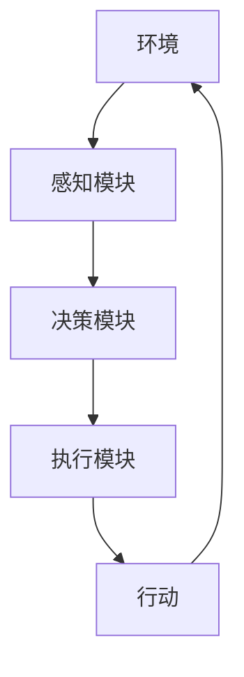

# AI Agent在企业产品创新与概念验证中的角色

> 关键词：AI Agent、企业产品创新、概念验证、人工智能、产品研发

> 摘要：本文深入探讨了AI Agent在企业产品创新与概念验证中所扮演的角色。首先介绍了相关背景知识，包括目的、预期读者、文档结构和术语表等。接着阐述了AI Agent的核心概念、与企业产品创新和概念验证的联系，并给出了原理和架构的示意图及流程图。详细讲解了AI Agent相关的核心算法原理、操作步骤，以及数学模型和公式。通过项目实战案例，展示了如何在实际开发中运用AI Agent。分析了AI Agent在企业中的实际应用场景，推荐了学习资源、开发工具框架和相关论文著作。最后总结了AI Agent在该领域的未来发展趋势与挑战，并对常见问题进行了解答，还提供了扩展阅读和参考资料。

## 1. 背景介绍 
### 1.1 目的和范围
在当今竞争激烈的商业环境中，企业需要不断进行产品创新以满足市场需求和保持竞争力。概念验证（Proof of Concept，PoC）是产品创新过程中的关键环节，它能够验证新想法的可行性和潜在价值。AI Agent作为人工智能领域的重要技术，具有自主学习、决策和执行任务的能力，为企业产品创新和概念验证提供了新的途径和方法。

本文的目的是深入探讨AI Agent在企业产品创新与概念验证中的角色，分析其原理、应用场景和实际操作方法。范围涵盖了AI Agent的基本概念、相关算法、数学模型，以及在企业产品研发过程中的具体应用案例。

### 1.2 预期读者
本文的预期读者包括企业的产品经理、研发人员、技术主管、市场营销人员等，以及对人工智能和企业创新感兴趣的研究人员和学生。对于希望了解如何利用AI Agent推动企业产品创新和验证新概念的人士具有一定的参考价值。

### 1.3 文档结构概述
本文将按照以下结构进行组织：
1. **背景介绍**：介绍文章的目的、预期读者、文档结构和术语表。
2. **核心概念与联系**：阐述AI Agent的核心概念，以及与企业产品创新和概念验证的联系，并给出原理和架构的示意图及流程图。
3. **核心算法原理 & 具体操作步骤**：详细讲解AI Agent相关的核心算法原理，并使用Python源代码进行说明。
4. **数学模型和公式 & 详细讲解 & 举例说明**：介绍AI Agent的数学模型和公式，并通过具体例子进行详细讲解。
5. **项目实战：代码实际案例和详细解释说明**：通过一个实际项目案例，展示如何使用AI Agent进行企业产品创新和概念验证，包括开发环境搭建、源代码实现和代码解读。
6. **实际应用场景**：分析AI Agent在企业产品创新和概念验证中的实际应用场景。
7. **工具和资源推荐**：推荐学习资源、开发工具框架和相关论文著作。
8. **总结：未来发展趋势与挑战**：总结AI Agent在企业产品创新和概念验证中的作用，分析未来发展趋势和面临的挑战。
9. **附录：常见问题与解答**：解答读者可能遇到的常见问题。
10. **扩展阅读 & 参考资料**：提供相关的扩展阅读和参考资料。

### 1.4 术语表
#### 1.4.1 核心术语定义
- **AI Agent**：人工智能代理，是一种能够感知环境、自主学习、做出决策并执行任务的软件实体。
- **企业产品创新**：企业通过引入新的产品或对现有产品进行改进，以满足市场需求和提高竞争力的过程。
- **概念验证（PoC）**：在产品开发的早期阶段，通过构建一个简单的原型或模型，验证新想法或概念的可行性和潜在价值。
- **机器学习**：一门多领域交叉学科，涉及概率论、统计学、逼近论、凸分析、算法复杂度理论等多门学科。它专门研究计算机怎样模拟或实现人类的学习行为，以获取新的知识或技能，重新组织已有的知识结构使之不断改善自身的性能。
- **深度学习**：机器学习的一个分支领域，它是一种基于对数据进行表征学习的方法。深度学习通过构建具有很多层的神经网络模型，自动从大量数据中学习特征和模式。

#### 1.4.2 相关概念解释
- **强化学习**：一种机器学习范式，智能体通过与环境进行交互，根据环境反馈的奖励信号来学习最优的行为策略。
- **自然语言处理（NLP）**：计算机科学、人工智能和语言学交叉的领域，主要研究如何让计算机理解、处理和生成人类语言。
- **计算机视觉**：一门研究如何使机器“看”的科学，它是指用摄影机和电脑代替人眼对目标进行识别、跟踪和测量等机器视觉，并进一步做图形处理，使电脑处理成为更适合人眼观察或传送给仪器检测的图像。

#### 1.4.3 缩略词列表
- **AI**：Artificial Intelligence，人工智能
- **PoC**：Proof of Concept，概念验证
- **ML**：Machine Learning，机器学习
- **DL**：Deep Learning，深度学习
- **RL**：Reinforcement Learning，强化学习
- **NLP**：Natural Language Processing，自然语言处理
- **CV**：Computer Vision，计算机视觉

## 2. 核心概念与联系 

### 2.1 AI Agent的核心概念
AI Agent是一种具有自主性、反应性、社会性和主动性的软件实体。它能够感知周围环境的信息，根据自身的目标和知识进行推理和决策，并采取相应的行动来实现目标。AI Agent可以分为简单反射型Agent、基于模型的反射型Agent、基于目标的Agent和基于效用的Agent等不同类型。

简单反射型Agent根据当前感知到的环境状态直接做出决策，不考虑历史信息和未来目标。基于模型的反射型Agent在简单反射型Agent的基础上，引入了环境模型，能够根据历史信息和当前感知到的状态预测未来的环境变化，从而做出更合理的决策。基于目标的Agent具有明确的目标，它通过搜索和规划来找到实现目标的最佳行动序列。基于效用的Agent在基于目标的Agent的基础上，考虑了不同行动的效用值，选择能够最大化效用的行动。

### 2.2 AI Agent与企业产品创新和概念验证的联系
AI Agent在企业产品创新和概念验证中具有重要的作用。在产品创新方面，AI Agent可以帮助企业发现新的市场机会、优化产品设计、提高产品质量和用户体验。例如，通过分析大量的市场数据和用户反馈，AI Agent可以发现潜在的市场需求和用户痛点，为企业的产品创新提供方向。在产品设计阶段，AI Agent可以根据用户需求和市场趋势，自动生成多种产品设计方案，并对这些方案进行评估和优化。

在概念验证方面，AI Agent可以快速构建原型系统，验证新想法的可行性和潜在价值。例如，企业可以使用AI Agent开发一个简单的智能客服系统，验证自然语言处理技术在客户服务中的应用效果。通过与用户进行交互，收集用户反馈，AI Agent可以帮助企业评估新概念的实用性和用户接受度，为产品的进一步开发提供依据。

### 2.3 核心概念原理和架构的文本示意图
```plaintext
              环境
                |
                v
       +----------------+
       |  AI Agent      |
       | +------------+ |
       | | 感知模块    | |
       | +------------+ |
       | +------------+ |
       | | 决策模块    | |
       | +------------+ |
       | +------------+ |
       | | 执行模块    | |
       | +------------+ |
       +----------------+
                |
                v
              行动
```
上述示意图展示了AI Agent的基本架构。AI Agent通过感知模块获取环境信息，决策模块根据感知到的信息和自身的目标进行推理和决策，执行模块将决策结果转化为具体的行动，作用于环境。环境的变化又会被感知模块再次获取，形成一个闭环反馈系统。

### 2.4 Mermaid流程图

该流程图清晰地展示了AI Agent与环境之间的交互过程。AI Agent不断地感知环境信息，做出决策并执行行动，同时环境的变化又会影响AI Agent的后续决策和行动。

## 3. 核心算法原理 & 具体操作步骤 

### 3.1 核心算法原理
在AI Agent中，常用的算法包括机器学习算法、强化学习算法等。下面以强化学习算法为例，详细介绍其原理。

强化学习是一种通过智能体与环境进行交互，根据环境反馈的奖励信号来学习最优行为策略的机器学习范式。智能体在每个时间步 $t$ 观察到环境的状态 $s_t$，选择一个行动 $a_t$ 执行，环境会根据智能体的行动转移到下一个状态 $s_{t+1}$，并给予智能体一个奖励 $r_{t+1}$。智能体的目标是最大化长期累积奖励。

强化学习的核心是策略 $\pi$，它定义了智能体在每个状态下选择行动的概率分布。常用的策略学习方法包括基于价值的方法和基于策略的方法。基于价值的方法通过学习一个价值函数 $V(s)$ 或 $Q(s,a)$ 来评估状态或状态 - 行动对的价值，然后根据价值函数选择最优行动。基于策略的方法直接学习策略函数 $\pi(a|s)$，通过优化策略函数来最大化长期累积奖励。

### 3.2 具体操作步骤
下面使用Python代码实现一个简单的强化学习示例，使用OpenAI Gym库中的CartPole环境。

```python
import gym
import numpy as np

# 创建CartPole环境
env = gym.make('CartPole-v1')

# 初始化参数
learning_rate = 0.1
discount_factor = 0.99
episodes = 1000
epsilon = 0.1

# 初始化Q表
state_space = env.observation_space.shape[0]
action_space = env.action_space.n
q_table = np.zeros((state_space, action_space))

# 训练循环
for episode in range(episodes):
    state = env.reset()
    done = False
    total_reward = 0
    
    while not done:
        # 选择行动
        if np.random.uniform(0, 1) < epsilon:
            action = env.action_space.sample()  # 探索
        else:
            action = np.argmax(q_table[state])  # 利用
        
        # 执行行动
        next_state, reward, done, _ = env.step(action)
        
        # 更新Q表
        q_table[state, action] = (1 - learning_rate) * q_table[state, action] + \
                                 learning_rate * (reward + discount_factor * np.max(q_table[next_state]))
        
        state = next_state
        total_reward += reward
    
    if episode % 100 == 0:
        print(f"Episode {episode}: Total Reward = {total_reward}")

# 关闭环境
env.close()
```

### 3.3 代码解释
1. **导入必要的库**：导入 `gym` 库用于创建和管理环境，`numpy` 库用于数值计算。
2. **创建环境**：使用 `gym.make('CartPole-v1')` 创建CartPole环境。
3. **初始化参数**：设置学习率 `learning_rate`、折扣因子 `discount_factor`、训练回合数 `episodes` 和探索率 `epsilon`。
4. **初始化Q表**：根据环境的状态空间和行动空间大小，初始化Q表 `q_table`。
5. **训练循环**：在每个回合中，重置环境状态，选择行动，执行行动，更新Q表，直到回合结束。
6. **选择行动**：使用 $\epsilon$-贪心策略，以 $\epsilon$ 的概率进行探索，以 $1 - \epsilon$ 的概率进行利用。
7. **更新Q表**：根据Q学习算法的更新公式更新Q表。
8. **关闭环境**：训练结束后，关闭环境。

## 4. 数学模型和公式 & 详细讲解 & 举例说明 

### 4.1 强化学习的数学模型
强化学习可以用马尔可夫决策过程（Markov Decision Process，MDP）来建模。一个MDP可以用一个五元组 $\langle S, A, P, R, \gamma \rangle$ 表示，其中：
- $S$ 是状态空间，表示环境的所有可能状态。
- $A$ 是行动空间，表示智能体可以采取的所有可能行动。
- $P(s_{t+1}|s_t, a_t)$ 是状态转移概率，表示在状态 $s_t$ 采取行动 $a_t$ 后转移到状态 $s_{t+1}$ 的概率。
- $R(s_t, a_t, s_{t+1})$ 是奖励函数，表示在状态 $s_t$ 采取行动 $a_t$ 后转移到状态 $s_{t+1}$ 时获得的奖励。
- $\gamma \in [0, 1]$ 是折扣因子，用于权衡即时奖励和未来奖励。

### 4.2 价值函数和Q函数
价值函数 $V^\pi(s)$ 表示在策略 $\pi$ 下，从状态 $s$ 开始的长期累积奖励的期望：
$$V^\pi(s) = \mathbb{E}_\pi \left[ \sum_{t=0}^{\infty} \gamma^t r_{t+1} \big| s_0 = s \right]$$

Q函数 $Q^\pi(s, a)$ 表示在策略 $\pi$ 下，从状态 $s$ 采取行动 $a$ 开始的长期累积奖励的期望：
$$Q^\pi(s, a) = \mathbb{E}_\pi \left[ \sum_{t=0}^{\infty} \gamma^t r_{t+1} \big| s_0 = s, a_0 = a \right]$$

### 4.3 Q学习算法的更新公式
Q学习算法是一种基于价值的强化学习算法，它通过不断更新Q函数来学习最优策略。Q学习的更新公式如下：
$$Q(s_t, a_t) \leftarrow (1 - \alpha) Q(s_t, a_t) + \alpha \left[ r_{t+1} + \gamma \max_{a} Q(s_{t+1}, a) \right]$$
其中，$\alpha$ 是学习率，$\gamma$ 是折扣因子。

### 4.4 举例说明
假设一个简单的网格世界环境，智能体的目标是从起点到达终点。环境的状态空间 $S$ 是网格中的所有位置，行动空间 $A$ 是上下左右四个方向。智能体在每个位置采取行动后，会根据状态转移概率转移到下一个位置，并获得相应的奖励。

例如，智能体在状态 $s_t$ 采取行动 $a_t$ 后，转移到状态 $s_{t+1}$ 并获得奖励 $r_{t+1}$。根据Q学习的更新公式，更新Q表中 $(s_t, a_t)$ 对应的Q值。不断重复这个过程，直到智能体找到最优策略。

## 5. 项目实战：代码实际案例和详细解释说明 

### 5.1  开发环境搭建
#### 5.1.1 安装Python
首先需要安装Python，建议使用Python 3.7及以上版本。可以从Python官方网站（https://www.python.org/downloads/）下载安装包，按照安装向导进行安装。

#### 5.1.2 安装必要的库
在项目中，需要使用 `gym`、`numpy` 等库。可以使用 `pip` 命令进行安装：
```sh
pip install gym numpy
```

### 5.2  源代码详细实现和代码解读
下面是一个使用AI Agent进行简单文本分类的项目示例。

```python
import numpy as np
from sklearn.feature_extraction.text import TfidfVectorizer
from sklearn.naive_bayes import MultinomialNB
from sklearn.model_selection import train_test_split
from sklearn.metrics import accuracy_score

# 示例数据
documents = [
    "This is a sports article about football.",
    "The latest technology news: new smartphone released.",
    "A delicious recipe for chocolate cake.",
    "The stock market is up today.",
    "The football team won the championship."
]

labels = ["sports", "technology", "food", "finance", "sports"]

# 数据预处理
vectorizer = TfidfVectorizer()
X = vectorizer.fit_transform(documents)
y = np.array(labels)

# 划分训练集和测试集
X_train, X_test, y_train, y_test = train_test_split(X, y, test_size=0.2, random_state=42)

# 创建AI Agent（使用朴素贝叶斯分类器）
agent = MultinomialNB()

# 训练AI Agent
agent.fit(X_train, y_train)

# 预测
y_pred = agent.predict(X_test)

# 评估模型
accuracy = accuracy_score(y_test, y_pred)
print(f"Accuracy: {accuracy}")
```

### 5.3  代码解读与分析
1. **导入必要的库**：导入 `numpy` 用于数值计算，`TfidfVectorizer` 用于文本特征提取，`MultinomialNB` 用于创建朴素贝叶斯分类器，`train_test_split` 用于划分训练集和测试集，`accuracy_score` 用于评估模型的准确率。
2. **示例数据**：定义一些示例文本数据和对应的标签。
3. **数据预处理**：使用 `TfidfVectorizer` 将文本数据转换为TF-IDF特征向量。
4. **划分训练集和测试集**：使用 `train_test_split` 将数据划分为训练集和测试集，测试集占比为20%。
5. **创建AI Agent**：使用 `MultinomialNB` 创建一个朴素贝叶斯分类器作为AI Agent。
6. **训练AI Agent**：使用训练集数据对AI Agent进行训练。
7. **预测**：使用训练好的AI Agent对测试集数据进行预测。
8. **评估模型**：使用 `accuracy_score` 计算模型的准确率并输出。

## 6. 实际应用场景 
### 6.1 市场调研与机会发现
AI Agent可以通过分析大量的市场数据、社交媒体数据、行业报告等，发现潜在的市场需求和用户痛点。例如，通过分析用户在社交媒体上的讨论和反馈，AI Agent可以了解用户对某种产品的期望和不满，为企业的产品创新提供方向。

### 6.2 产品设计与优化
在产品设计阶段，AI Agent可以根据用户需求和市场趋势，自动生成多种产品设计方案，并对这些方案进行评估和优化。例如，在服装设计中，AI Agent可以根据流行趋势和用户喜好，生成不同款式的服装设计方案，并通过模拟用户试穿和市场反馈，选择最优的设计方案。

### 6.3 概念验证与原型开发
AI Agent可以快速构建原型系统，验证新想法的可行性和潜在价值。例如，企业可以使用AI Agent开发一个简单的智能客服系统，验证自然语言处理技术在客户服务中的应用效果。通过与用户进行交互，收集用户反馈，AI Agent可以帮助企业评估新概念的实用性和用户接受度，为产品的进一步开发提供依据。

### 6.4 客户服务与支持
AI Agent可以作为智能客服，自动回答用户的问题，解决用户的问题。例如，在电商平台上，AI Agent可以根据用户的问题，提供相关的产品信息、订单状态查询、售后服务等。通过使用AI Agent，企业可以提高客户服务的效率和质量，降低人力成本。

## 7. 工具和资源推荐
### 7.1 学习资源推荐
#### 7.1.1 书籍推荐
- 《人工智能：一种现代的方法》（Artificial Intelligence: A Modern Approach）：这是一本经典的人工智能教材，涵盖了人工智能的各个领域，包括搜索算法、知识表示、机器学习、自然语言处理等。
- 《深度学习》（Deep Learning）：由Ian Goodfellow、Yoshua Bengio和Aaron Courville所著，是深度学习领域的权威书籍，介绍了深度学习的基本原理、算法和应用。
- 《强化学习：原理与Python实现》：详细介绍了强化学习的基本概念、算法和应用，并通过Python代码进行了实现和演示。

#### 7.1.2 在线课程
- Coursera上的“人工智能基础”（Foundations of Artificial Intelligence）课程：由哥伦比亚大学教授授课，介绍了人工智能的基本概念、算法和应用。
- edX上的“深度学习”（Deep Learning）课程：由Andrew Ng教授授课，是深度学习领域的经典课程，涵盖了深度学习的各个方面。
- Udemy上的“强化学习实战”（Reinforcement Learning in Action）课程：通过实际项目案例，介绍了强化学习的应用和实现方法。

#### 7.1.3 技术博客和网站
- Medium上的AI相关博客：Medium上有很多人工智能领域的优秀博客，如Towards Data Science、The AI Blog等，提供了最新的技术文章和研究成果。
- arXiv.org：一个预印本服务器，提供了大量的学术论文，涵盖了人工智能的各个领域。
- OpenAI官方博客：OpenAI是人工智能领域的领先研究机构，其官方博客提供了最新的研究成果和技术进展。

### 7.2 开发工具框架推荐
#### 7.2.1 IDE和编辑器
- PyCharm：一款专业的Python集成开发环境，提供了代码编辑、调试、版本控制等功能，适合Python项目的开发。
- Jupyter Notebook：一个交互式的开发环境，支持Python、R等多种编程语言，适合数据分析和机器学习项目的开发。
- Visual Studio Code：一款轻量级的代码编辑器，支持多种编程语言和插件扩展，适合快速开发和调试。

#### 7.2.2 调试和性能分析工具
- TensorBoard：TensorFlow的可视化工具，用于可视化训练过程中的指标、模型结构等，帮助开发者调试和优化模型。
- Py-Spy：一个Python性能分析工具，可以实时分析Python程序的性能瓶颈，帮助开发者优化代码。
- cProfile：Python标准库中的性能分析模块，可以分析Python程序的函数调用时间和次数，帮助开发者找出性能瓶颈。

#### 7.2.3 相关框架和库
- TensorFlow：一个开源的机器学习框架，提供了丰富的工具和库，用于构建和训练深度学习模型。
- PyTorch：另一个开源的机器学习框架，具有动态图和易于使用的特点，受到了很多研究者和开发者的喜爱。
- Scikit-learn：一个简单而高效的机器学习库，提供了多种机器学习算法和工具，适合初学者和快速开发。

### 7.3 相关论文著作推荐
#### 7.3.1 经典论文
- “Q-Learning” by Watkins and Dayan：介绍了Q学习算法的基本原理和实现方法，是强化学习领域的经典论文。
- “ImageNet Classification with Deep Convolutional Neural Networks” by Krizhevsky, Sutskever, and Hinton：介绍了AlexNet模型，开启了深度学习在计算机视觉领域的热潮。
- “Attention Is All You Need” by Vaswani et al.：介绍了Transformer模型，是自然语言处理领域的重要突破。

#### 7.3.2 最新研究成果
- 关注顶级学术会议如NeurIPS、ICML、CVPR、ACL等的最新研究成果，了解人工智能领域的最新进展。
- 关注知名研究机构如OpenAI、DeepMind、Facebook AI Research等的研究论文和技术报告。

#### 7.3.3 应用案例分析
- 《AI in Business: How Artificial Intelligence Is Transforming Companies Around the World》：介绍了人工智能在企业中的应用案例和实践经验。
- 《Artificial Intelligence for Business: A Roadmap for Real-World Adoption》：提供了人工智能在企业中的应用指南和案例分析。

## 8. 总结：未来发展趋势与挑战
### 8.1 未来发展趋势
- **更加智能化和自主化**：未来的AI Agent将具有更强的自主学习和决策能力，能够在复杂的环境中自主完成任务。
- **多模态融合**：AI Agent将融合多种感知模态，如视觉、听觉、触觉等，实现更加全面和准确的环境感知。
- **与人类协作**：AI Agent将与人类更加紧密地协作，成为人类的智能助手，共同完成各种任务。
- **行业应用拓展**：AI Agent将在更多的行业中得到应用，如医疗、金融、交通等，推动各行业的数字化转型和创新发展。

### 8.2 挑战
- **数据隐私和安全**：AI Agent需要大量的数据进行训练和学习，如何保护数据的隐私和安全是一个重要的挑战。
- **算法可解释性**：很多AI Agent使用的是深度学习等复杂算法，这些算法的决策过程往往难以解释，如何提高算法的可解释性是一个亟待解决的问题。
- **伦理和法律问题**：随着AI Agent的广泛应用，会带来一系列的伦理和法律问题，如责任归属、偏见和歧视等，需要建立相应的伦理和法律框架来规范其发展。
- **人才短缺**：AI Agent的开发和应用需要具备跨学科知识和技能的人才，目前相关人才短缺，需要加强人才培养和引进。

## 9. 附录：常见问题与解答
### 9.1 AI Agent和传统软件有什么区别？
AI Agent具有自主性、反应性、社会性和主动性等特点，能够感知环境、自主学习、做出决策并执行任务。而传统软件通常是按照预先编写的程序执行固定的任务，缺乏自主学习和决策能力。

### 9.2 AI Agent在企业产品创新中能起到多大的作用？
AI Agent可以在企业产品创新的多个环节发挥重要作用，如市场调研、产品设计、概念验证等。它可以帮助企业发现新的市场机会、优化产品设计、提高产品质量和用户体验，从而提高企业的竞争力。

### 9.3 如何评估AI Agent的性能？
评估AI Agent的性能可以从多个方面进行，如任务完成率、准确率、效率、稳定性等。具体的评估指标和方法需要根据AI Agent的具体应用场景和任务来确定。

### 9.4 AI Agent的开发难度大吗？
AI Agent的开发难度取决于其功能和复杂度。对于简单的AI Agent，如基于规则的智能客服，开发难度相对较低。而对于复杂的AI Agent，如基于深度学习的自动驾驶系统，开发难度较大，需要具备深厚的专业知识和丰富的实践经验。

## 10. 扩展阅读 & 参考资料
### 10.1 扩展阅读
- 《AI 3.0》：深入探讨了人工智能的发展现状、挑战和未来趋势。
- 《智能时代》：介绍了人工智能在各个领域的应用和影响，以及对人类社会的变革。

### 10.2 参考资料
- OpenAI官方文档：https://openai.com/docs/
- TensorFlow官方文档：https://www.tensorflow.org/api_docs
- PyTorch官方文档：https://pytorch.org/docs/stable/index.html

作者：AI天才研究院/AI Genius Institute & 禅与计算机程序设计艺术 /Zen And The Art of Computer Programming