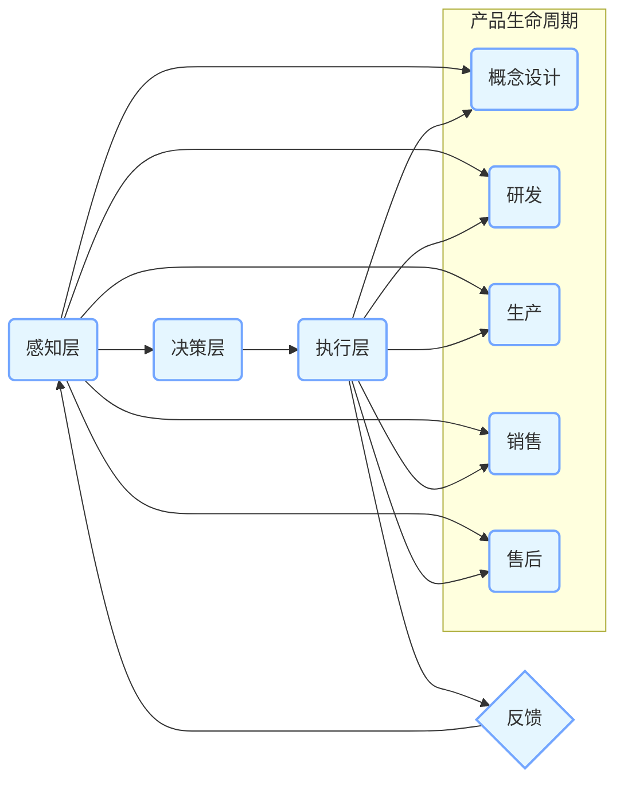

# AI Agent在企业产品生命周期管理与优化中的全面应用

> 关键词：AI Agent、企业产品生命周期管理、产品优化、智能化决策、数据驱动

> 摘要：本文全面探讨了AI Agent在企业产品生命周期管理与优化中的应用。首先介绍了相关背景，包括目的范围、预期读者等。接着阐述了核心概念及联系，分析了AI Agent的工作原理和架构。详细讲解了核心算法原理及操作步骤，结合数学模型和公式进行深入剖析。通过项目实战展示了AI Agent在实际中的应用，包括开发环境搭建、源代码实现与解读。探讨了其在不同场景下的实际应用，推荐了学习、开发相关的工具和资源。最后总结了未来发展趋势与挑战，解答了常见问题，并提供了扩展阅读和参考资料，旨在帮助企业更好地利用AI Agent提升产品管理和优化水平。

## 1. 背景介绍 
### 1.1 目的和范围
企业产品生命周期管理（Product Lifecycle Management, PLM）涵盖了从产品概念设计、研发、生产、销售到售后支持的全过程。在当今竞争激烈的市场环境下，如何有效管理产品生命周期并实现优化成为企业面临的重要挑战。AI Agent作为一种智能化的软件实体，能够自主感知环境、做出决策并执行相应操作，为企业PLM带来了新的解决方案。本文的目的在于深入探讨AI Agent在企业产品生命周期各阶段的应用，分析其原理、算法和实际操作，为企业提供全面的技术指导和实践参考。范围涵盖了AI Agent在产品规划、设计、生产、营销和售后等各个环节的应用，以及相关的技术原理、工具和资源。

### 1.2 预期读者
本文预期读者包括企业管理人员、产品经理、研发工程师、市场营销人员以及对AI和PLM技术感兴趣的技术爱好者。企业管理人员可以通过本文了解如何利用AI Agent提升企业的产品管理效率和竞争力；产品经理可以学习到如何借助AI Agent优化产品规划和设计；研发工程师可以深入掌握AI Agent的技术原理和算法实现；市场营销人员可以了解AI Agent在产品推广和客户服务中的应用；技术爱好者则可以拓宽对AI和PLM领域的知识面。

### 1.3 文档结构概述
本文将按照以下结构进行组织：首先介绍背景信息，包括目的、预期读者和文档结构概述；接着阐述AI Agent和企业产品生命周期管理的核心概念及它们之间的联系；详细讲解AI Agent的核心算法原理和具体操作步骤；通过数学模型和公式进一步分析其工作原理；展示AI Agent在企业产品生命周期管理中的项目实战案例，包括开发环境搭建、源代码实现和代码解读；探讨AI Agent在不同实际场景下的应用；推荐相关的学习、开发工具和资源；总结未来发展趋势与挑战；解答常见问题；最后提供扩展阅读和参考资料。

### 1.4 术语表
#### 1.4.1 核心术语定义
- **AI Agent（人工智能代理）**：是一种能够感知环境、根据感知信息做出决策并采取行动以实现特定目标的智能化软件实体。它可以自主学习、适应环境变化，并与其他Agent或人类进行交互。
- **企业产品生命周期管理（PLM）**：是一种集成的管理理念和方法，用于协调企业内外部资源，对产品从概念设计到退役的整个生命周期进行全面管理，包括产品数据管理、过程管理、协同设计等方面。
- **机器学习（Machine Learning）**：是一门多领域交叉学科，涉及概率论、统计学、逼近论、凸分析、算法复杂度理论等多门学科。它专门研究计算机怎样模拟或实现人类的学习行为，以获取新的知识或技能，重新组织已有的知识结构使之不断改善自身的性能。
- **深度学习（Deep Learning）**：是机器学习的一个分支领域，它是一种基于对数据进行表征学习的方法。深度学习通过构建具有很多层的神经网络模型，自动从大量数据中学习特征和模式，从而实现对数据的分类、预测等任务。

#### 1.4.2 相关概念解释
- **智能决策**：AI Agent通过对大量数据的分析和学习，能够在复杂的情况下做出最优决策。它可以考虑多个因素和约束条件，利用算法和模型评估不同方案的优劣，从而为企业提供科学的决策支持。
- **自动化流程**：AI Agent可以自动化执行一系列任务，减少人工干预，提高工作效率和准确性。例如，在产品生产过程中，AI Agent可以自动监控生产设备的运行状态，及时调整生产参数，实现生产过程的自动化控制。
- **数据驱动**：AI Agent的决策和行动基于大量的数据。通过对产品生命周期各阶段的数据进行收集、整理和分析，AI Agent可以发现潜在的问题和机会，为产品优化提供依据。

#### 1.4.3 缩略词列表
- **AI：Artificial Intelligence（人工智能）**
- **PLM：Product Lifecycle Management（产品生命周期管理）**
- **ML：Machine Learning（机器学习）**
- **DL：Deep Learning（深度学习）**
- **NLP：Natural Language Processing（自然语言处理）**
- **CV：Computer Vision（计算机视觉）**

## 2. 核心概念与联系 
### 核心概念原理
AI Agent的核心原理基于智能感知、决策和行动三个关键环节。智能感知是指AI Agent通过各种传感器或接口获取环境信息，例如产品的销售数据、用户反馈、生产设备的运行状态等。决策环节则是AI Agent根据感知到的信息，运用机器学习、深度学习等算法进行分析和推理，制定出最优的行动方案。行动环节是指AI Agent根据决策结果执行相应的操作，例如调整产品设计参数、优化生产计划、推荐营销策略等。

企业产品生命周期管理的原理是将产品的整个生命周期划分为不同的阶段，每个阶段都有特定的目标和任务。通过对各阶段的有效管理和协调，可以提高产品的质量、降低成本、缩短上市时间，从而增强企业的竞争力。

### 架构的文本示意图
AI Agent在企业产品生命周期管理中的架构可以分为三个层次：感知层、决策层和执行层。

感知层负责收集产品生命周期各阶段的相关数据，包括市场数据、研发数据、生产数据、销售数据和售后数据等。这些数据可以通过各种传感器、数据库、网络爬虫等方式获取。

决策层是AI Agent的核心部分，它对感知层收集到的数据进行处理和分析。决策层通常采用机器学习和深度学习算法，例如神经网络、决策树、支持向量机等，对数据进行建模和预测。根据分析结果，决策层制定出相应的决策和策略。

执行层根据决策层的指令，执行具体的操作和任务。执行层可以与企业的各种信息系统和设备进行集成，例如企业资源规划（ERP）系统、供应链管理（SCM）系统、生产自动化设备等，实现对产品生命周期各环节的控制和优化。

### Mermaid 流程图


这个流程图展示了AI Agent在企业产品生命周期管理中的工作流程。感知层从产品生命周期的各个阶段收集数据，将数据传递给决策层进行分析和决策。决策层制定的决策指令传递给执行层，执行层执行相应的操作。同时，执行层的执行结果会反馈给感知层，形成一个闭环的反馈机制，不断优化AI Agent的决策和行动。

## 3. 核心算法原理 & 具体操作步骤 
### 核心算法原理
在AI Agent应用于企业产品生命周期管理中，常用的核心算法包括机器学习和深度学习算法。以下以决策树算法和神经网络算法为例进行详细讲解。

#### 决策树算法原理
决策树是一种基于树结构进行决策的算法。它通过对数据的特征进行划分，构建一个树形结构，每个内部节点表示一个特征上的测试，每个分支表示一个测试输出，每个叶节点表示一个类别或值。决策树的构建过程主要包括特征选择、树的生成和树的剪枝三个步骤。

特征选择的目的是选择对分类或预测最有帮助的特征。常用的特征选择指标有信息增益、信息增益率和基尼指数等。例如，信息增益的计算公式为：

$IG(D, A) = H(D) - H(D|A)$

其中，$IG(D, A)$ 表示特征 $A$ 对数据集 $D$ 的信息增益，$H(D)$ 表示数据集 $D$ 的信息熵，$H(D|A)$ 表示在特征 $A$ 给定的条件下数据集 $D$ 的条件熵。

树的生成是根据特征选择的结果，递归地将数据集划分为不同的子集，直到满足停止条件。停止条件可以是子集的样本数小于某个阈值、子集的纯度达到某个阈值等。

树的剪枝是为了防止决策树过拟合，提高模型的泛化能力。剪枝方法主要有预剪枝和后剪枝两种。

#### 神经网络算法原理
神经网络是一种模仿人类神经系统的计算模型，由大量的神经元组成。每个神经元接收多个输入信号，经过加权求和和非线性激活函数处理后，输出一个信号。神经网络的训练过程主要是通过反向传播算法来调整神经元之间的连接权重，使得网络的输出与期望输出之间的误差最小。

反向传播算法的基本思想是将误差从输出层反向传播到输入层，根据误差的大小调整神经元之间的连接权重。具体步骤如下：
1. 前向传播：将输入数据传入神经网络，计算网络的输出。
2. 计算误差：计算网络的输出与期望输出之间的误差。
3. 反向传播：根据误差计算每个神经元的梯度，从输出层开始，依次向后传播梯度。
4. 更新权重：根据梯度更新神经元之间的连接权重。

### 具体操作步骤（以Python实现决策树算法为例）
```python
import numpy as np
from collections import Counter

# 计算信息熵
def entropy(y):
    hist = np.bincount(y)
    ps = hist / len(y)
    return -np.sum([p * np.log2(p) for p in ps if p > 0])

# 定义决策树节点类
class Node:
    def __init__(self, feature=None, threshold=None, left=None, right=None, *, value=None):
        self.feature = feature
        self.threshold = threshold
        self.left = left
        self.right = right
        self.value = value

    def is_leaf_node(self):
        return self.value is not None

# 定义决策树类
class DecisionTree:
    def __init__(self, min_samples_split=2, max_depth=100, n_feats=None):
        self.min_samples_split = min_samples_split
        self.max_depth = max_depth
        self.n_feats = n_feats
        self.root = None

    def fit(self, X, y):
        self.n_feats = X.shape[1] if not self.n_feats else min(self.n_feats, X.shape[1])
        self.root = self._grow_tree(X, y)

    def _grow_tree(self, X, y, depth=0):
        n_samples, n_features = X.shape
        n_labels = len(np.unique(y))

        # 停止条件
        if (depth >= self.max_depth
                or n_labels == 1
                or n_samples < self.min_samples_split):
            leaf_value = self._most_common_label(y)
            return Node(value=leaf_value)

        feat_idxs = np.random.choice(n_features, self.n_feats, replace=False)

        # 选择最优特征和阈值
        best_feat, best_thresh = self._best_criteria(X, y, feat_idxs)
        left_idxs, right_idxs = self._split(X[:, best_feat], best_thresh)
        left = self._grow_tree(X[left_idxs, :], y[left_idxs], depth + 1)
        right = self._grow_tree(X[right_idxs, :], y[right_idxs], depth + 1)
        return Node(best_feat, best_thresh, left, right)

    def _best_criteria(self, X, y, feat_idxs):
        best_gain = -1
        split_idx, split_thresh = None, None
        for feat_idx in feat_idxs:
            X_column = X[:, feat_idx]
            thresholds = np.unique(X_column)
            for threshold in thresholds:
                gain = self._information_gain(y, X_column, threshold)

                if gain > best_gain:
                    best_gain = gain
                    split_idx = feat_idx
                    split_thresh = threshold

        return split_idx, split_thresh

    def _information_gain(self, y, X_column, split_thresh):
        # 父节点熵
        parent_entropy = entropy(y)

        # 生成划分
        left_idxs, right_idxs = self._split(X_column, split_thresh)

        if len(left_idxs) == 0 or len(right_idxs) == 0:
            return 0

        # 计算加权子节点熵
        n = len(y)
        n_l, n_r = len(left_idxs), len(right_idxs)
        e_l, e_r = entropy(y[left_idxs]), entropy(y[right_idxs])
        child_entropy = (n_l / n) * e_l + (n_r / n) * e_r

        # 计算信息增益
        ig = parent_entropy - child_entropy
        return ig

    def _split(self, X_column, split_thresh):
        left_idxs = np.argwhere(X_column <= split_thresh).flatten()
        right_idxs = np.argwhere(X_column > split_thresh).flatten()
        return left_idxs, right_idxs

    def _most_common_label(self, y):
        counter = Counter(y)
        most_common = counter.most_common(1)[0][0]
        return most_common

    def predict(self, X):
        return np.array([self._traverse_tree(x, self.root) for x in X])

    def _traverse_tree(self, x, node):
        if node.is_leaf_node():
            return node.value

        if x[node.feature] <= node.threshold:
            return self._traverse_tree(x, node.left)
        return self._traverse_tree(x, node.right)


# 示例使用
if __name__ == "__main__":
    from sklearn.datasets import load_iris
    from sklearn.model_selection import train_test_split

    iris = load_iris()
    X, y = iris.data, iris.target
    X_train, X_test, y_train, y_test = train_test_split(X, y, test_size=0.2, random_state=1234)

    clf = DecisionTree(max_depth=10)
    clf.fit(X_train, y_train)
    predictions = clf.predict(X_test)

    accuracy = np.sum(predictions == y_test) / len(y_test)
    print(f"Accuracy: {accuracy}")
```

### 代码解释
1. **entropy函数**：用于计算数据集的信息熵，信息熵是衡量数据集纯度的指标。
2. **Node类**：定义了决策树的节点结构，包括特征、阈值、左右子节点和节点值。
3. **DecisionTree类**：
    - `fit`方法：用于训练决策树模型，调用`_grow_tree`方法递归地构建决策树。
    - `_grow_tree`方法：根据停止条件和特征选择结果，递归地生成决策树的节点。
    - `_best_criteria`方法：选择最优的特征和阈值，通过计算信息增益来评估不同特征和阈值的优劣。
    - `_information_gain`方法：计算特征和阈值的信息增益。
    - `_split`方法：根据阈值将数据集划分为左右两个子集。
    - `_most_common_label`方法：返回数据集中出现次数最多的标签。
    - `predict`方法：对输入数据进行预测，调用`_traverse_tree`方法遍历决策树。
    - `_traverse_tree`方法：递归地遍历决策树，直到到达叶节点。

通过上述代码，我们可以使用决策树算法对数据进行分类预测，在企业产品生命周期管理中，可以将产品的各种特征作为输入，预测产品的销售情况、质量问题等。

## 4. 数学模型和公式 & 详细讲解 & 举例说明 
### 信息熵和信息增益
#### 信息熵
信息熵是衡量数据集纯度的指标，它表示数据集的不确定性程度。信息熵的计算公式为：

$$H(D) = -\sum_{i=1}^{n}p_i\log_2p_i$$

其中，$D$ 表示数据集，$p_i$ 表示数据集中第 $i$ 类样本的比例，$n$ 表示数据集中的类别数。

例如，假设有一个数据集 $D$ 包含 10 个样本，其中 6 个属于类别 $A$，4 个属于类别 $B$。则类别 $A$ 的比例 $p_A = \frac{6}{10} = 0.6$，类别 $B$ 的比例 $p_B = \frac{4}{10} = 0.4$。数据集 $D$ 的信息熵为：

$$H(D) = - (0.6\log_20.6 + 0.4\log_20.4) \approx 0.971$$

#### 信息增益
信息增益是衡量特征对分类或预测的重要性的指标，它表示使用某个特征进行划分后，数据集的不确定性减少的程度。信息增益的计算公式为：

$$IG(D, A) = H(D) - H(D|A)$$

其中，$IG(D, A)$ 表示特征 $A$ 对数据集 $D$ 的信息增益，$H(D)$ 表示数据集 $D$ 的信息熵，$H(D|A)$ 表示在特征 $A$ 给定的条件下数据集 $D$ 的条件熵。

条件熵的计算公式为：

$$H(D|A) = \sum_{v\in Values(A)}\frac{|D^v|}{|D|}H(D^v)$$

其中，$Values(A)$ 表示特征 $A$ 的所有取值集合，$D^v$ 表示特征 $A$ 取值为 $v$ 时的数据集，$|D^v|$ 表示 $D^v$ 的样本数，$|D|$ 表示数据集 $D$ 的样本数。

例如，假设有一个数据集 $D$ 包含 10 个样本，特征 $A$ 有两个取值 $a_1$ 和 $a_2$。当特征 $A$ 取值为 $a_1$ 时，数据集 $D^{a_1}$ 包含 6 个样本，其中 4 个属于类别 $A$，2 个属于类别 $B$；当特征 $A$ 取值为 $a_2$ 时，数据集 $D^{a_2}$ 包含 4 个样本，其中 1 个属于类别 $A$，3 个属于类别 $B$。

首先计算 $D^{a_1}$ 和 $D^{a_2}$ 的信息熵：

$$H(D^{a_1}) = - (\frac{4}{6}\log_2\frac{4}{6} + \frac{2}{6}\log_2\frac{2}{6}) \approx 0.918$$

$$H(D^{a_2}) = - (\frac{1}{4}\log_2\frac{1}{4} + \frac{3}{4}\log_2\frac{3}{4}) \approx 0.811$$

然后计算条件熵：

$$H(D|A) = \frac{6}{10}H(D^{a_1}) + \frac{4}{10}H(D^{a_2}) = \frac{6}{10} \times 0.918 + \frac{4}{10} \times 0.811 \approx 0.875$$

最后计算信息增益：

$$IG(D, A) = H(D) - H(D|A) = 0.971 - 0.875 = 0.096$$

### 神经网络的损失函数和梯度下降
#### 损失函数
在神经网络中，损失函数用于衡量网络的输出与期望输出之间的误差。常用的损失函数有均方误差（Mean Squared Error, MSE）和交叉熵损失（Cross Entropy Loss）。

均方误差的计算公式为：

$$MSE = \frac{1}{n}\sum_{i=1}^{n}(y_i - \hat{y}_i)^2$$

其中，$n$ 表示样本数，$y_i$ 表示第 $i$ 个样本的期望输出，$\hat{y}_i$ 表示第 $i$ 个样本的网络输出。

交叉熵损失的计算公式为：

$$CE = -\sum_{i=1}^{n}y_i\log(\hat{y}_i)$$

#### 梯度下降
梯度下降是一种优化算法，用于最小化损失函数。它的基本思想是沿着损失函数的负梯度方向更新网络的参数，直到损失函数达到最小值。

梯度下降的更新公式为：

$$\theta_{t+1} = \theta_t - \alpha\nabla J(\theta_t)$$

其中，$\theta$ 表示网络的参数，$t$ 表示迭代次数，$\alpha$ 表示学习率，$\nabla J(\theta_t)$ 表示损失函数 $J$ 在参数 $\theta_t$ 处的梯度。

例如，假设有一个简单的线性回归模型 $y = wx + b$，损失函数为均方误差 $MSE = \frac{1}{n}\sum_{i=1}^{n}(y_i - (wx_i + b))^2$。对 $w$ 和 $b$ 求偏导数，得到梯度：

$$\frac{\partial MSE}{\partial w} = -\frac{2}{n}\sum_{i=1}^{n}x_i(y_i - (wx_i + b))$$

$$\frac{\partial MSE}{\partial b} = -\frac{2}{n}\sum_{i=1}^{n}(y_i - (wx_i + b))$$

然后使用梯度下降算法更新 $w$ 和 $b$：

$$w_{t+1} = w_t - \alpha\frac{\partial MSE}{\partial w}$$

$$b_{t+1} = b_t - \alpha\frac{\partial MSE}{\partial b}$$

通过不断迭代，直到损失函数收敛，得到最优的 $w$ 和 $b$ 值。

## 5. 项目实战：代码实际案例和详细解释说明 
### 5.1  开发环境搭建
#### 安装Python
首先需要安装Python，建议使用Python 3.7及以上版本。可以从Python官方网站（https://www.python.org/downloads/）下载适合自己操作系统的安装包，按照安装向导进行安装。

#### 安装必要的库
在项目中，我们需要使用一些Python库，如NumPy、Pandas、Scikit-learn等。可以使用pip命令进行安装：

```sh
pip install numpy pandas scikit-learn
```

#### 选择开发工具
可以选择使用Jupyter Notebook、PyCharm等开发工具。Jupyter Notebook适合进行交互式开发和数据分析，PyCharm是一个功能强大的Python集成开发环境（IDE），适合进行大型项目的开发。

### 5.2  源代码详细实现和代码解读
以下是一个使用AI Agent进行产品销售预测的项目实战案例。我们将使用Scikit-learn库中的线性回归模型作为AI Agent的决策模型，对产品的销售数据进行分析和预测。

```python
import numpy as np
import pandas as pd
from sklearn.model_selection import train_test_split
from sklearn.linear_model import LinearRegression
from sklearn.metrics import mean_squared_error

# 加载数据集
data = pd.read_csv('sales_data.csv')

# 提取特征和目标变量
X = data[['price', 'advertising', 'season']]
y = data['sales']

# 数据预处理
# 对季节特征进行独热编码
X = pd.get_dummies(X, columns=['season'])

# 划分训练集和测试集
X_train, X_test, y_train, y_test = train_test_split(X, y, test_size=0.2, random_state=42)

# 创建线性回归模型
model = LinearRegression()

# 训练模型
model.fit(X_train, y_train)

# 预测
y_pred = model.predict(X_test)

# 评估模型
mse = mean_squared_error(y_test, y_pred)
rmse = np.sqrt(mse)
print(f"均方误差 (MSE): {mse}")
print(f"均方根误差 (RMSE): {rmse}")
```

### 代码解读
1. **加载数据集**：使用`pandas`库的`read_csv`函数加载产品销售数据集。数据集包含产品价格、广告投入、季节和销售量等信息。
2. **提取特征和目标变量**：从数据集中提取特征（价格、广告投入、季节）和目标变量（销售量）。
3. **数据预处理**：对季节特征进行独热编码，将其转换为数值型特征，以便模型能够处理。
4. **划分训练集和测试集**：使用`sklearn`库的`train_test_split`函数将数据集划分为训练集和测试集，测试集占总数据集的20%。
5. **创建线性回归模型**：使用`sklearn`库的`LinearRegression`类创建线性回归模型。
6. **训练模型**：使用训练集数据对模型进行训练，调用`fit`方法。
7. **预测**：使用训练好的模型对测试集数据进行预测，调用`predict`方法。
8. **评估模型**：使用均方误差（MSE）和均方根误差（RMSE）评估模型的性能。均方误差是预测值与真实值之间误差的平方的平均值，均方根误差是均方误差的平方根。

### 5.3  代码解读与分析
#### 模型选择
在这个项目中，我们选择了线性回归模型作为AI Agent的决策模型。线性回归模型是一种简单而有效的机器学习模型，适用于预测连续数值型变量。它通过拟合一条直线来描述特征和目标变量之间的线性关系。

#### 数据预处理
数据预处理是机器学习项目中非常重要的一步。在这个项目中，我们对季节特征进行了独热编码，将其转换为数值型特征。这是因为线性回归模型只能处理数值型数据，而季节特征是类别型数据。通过独热编码，我们可以将类别型数据转换为多个二进制特征，每个特征表示一个类别。

#### 模型评估
使用均方误差和均方根误差评估模型的性能。均方误差衡量了预测值与真实值之间的平均误差，均方根误差则是均方误差的平方根，它的单位与目标变量的单位相同，更直观地反映了模型的预测误差。在实际应用中，我们希望均方误差和均方根误差尽可能小，说明模型的预测性能越好。

## 6. 实际应用场景 
### 产品规划阶段
在产品规划阶段，AI Agent可以通过对市场数据、竞争对手数据和历史销售数据的分析，为企业提供产品规划建议。例如，AI Agent可以分析市场趋势，预测不同类型产品的需求情况，帮助企业确定产品的研发方向和产品线布局。同时，AI Agent可以根据竞争对手的产品特点和市场份额，为企业的产品定位和差异化竞争提供策略建议。

### 产品设计阶段
在产品设计阶段，AI Agent可以辅助设计师进行产品设计。通过对用户需求数据和产品性能数据的分析，AI Agent可以提供设计参数的优化建议，提高产品的性能和用户体验。例如，在电子产品设计中，AI Agent可以根据用户对电池续航、屏幕分辨率等方面的需求，优化产品的硬件设计；在服装产品设计中，AI Agent可以根据用户的身材数据和时尚趋势，提供款式和尺码的设计建议。

### 产品生产阶段
在产品生产阶段，AI Agent可以实现生产过程的自动化控制和优化。通过对生产设备的运行状态数据和生产过程数据的实时监测，AI Agent可以及时发现生产过程中的异常情况，并自动调整生产参数，保证生产过程的稳定性和产品质量。例如，在制造业中，AI Agent可以根据生产设备的温度、压力等参数，自动调整设备的运行速度和工艺参数，提高生产效率和产品质量。

### 产品营销阶段
在产品营销阶段，AI Agent可以帮助企业制定营销策略和精准营销。通过对用户行为数据和市场数据的分析，AI Agent可以了解用户的需求和偏好，为企业提供个性化的营销方案。例如，AI Agent可以根据用户的购买历史和浏览记录，为用户推荐合适的产品；可以根据市场趋势和竞争对手的营销策略，调整企业的广告投放策略和促销活动方案。

### 产品售后阶段
在产品售后阶段，AI Agent可以提供智能客服服务和产品质量追溯。通过对用户反馈数据和产品故障数据的分析，AI Agent可以自动回答用户的问题，解决用户的故障问题。同时，AI Agent可以对产品的质量问题进行追溯，找出问题的根源，为产品的改进提供依据。例如，在电子产品售后中，AI Agent可以通过分析用户的故障描述和产品的运行数据，自动诊断故障原因，并提供解决方案；可以对产品的生产批次和零部件进行追溯，找出可能存在质量问题的环节。

## 7. 工具和资源推荐
### 7.1 学习资源推荐
#### 7.1.1 书籍推荐
- 《人工智能：一种现代的方法》（Artificial Intelligence: A Modern Approach）：这本书是人工智能领域的经典教材，全面介绍了人工智能的基本概念、算法和应用。
- 《机器学习》（Machine Learning）：周志华教授的著作，系统地介绍了机器学习的基本原理、算法和实践应用。
- 《深度学习》（Deep Learning）：由Ian Goodfellow、Yoshua Bengio和Aaron Courville三位深度学习领域的权威专家撰写，是深度学习领域的经典教材。

#### 7.1.2 在线课程
- Coursera上的“机器学习”课程：由斯坦福大学的Andrew Ng教授授课，是机器学习领域最受欢迎的在线课程之一。
- edX上的“深度学习微硕士项目”：由多家知名高校联合推出，系统地介绍了深度学习的理论和实践。
- 网易云课堂上的“人工智能基础课程”：适合初学者入门，全面介绍了人工智能的基本概念和技术。

#### 7.1.3 技术博客和网站
- Medium：一个技术博客平台，上面有很多关于人工智能、机器学习和深度学习的优质文章。
- Towards Data Science：专注于数据科学和机器学习领域的技术博客，提供了很多实用的技术教程和案例分析。
- AI开源社区：提供了丰富的人工智能开源项目和技术资源，是学习和交流人工智能技术的好去处。

### 7.2 开发工具框架推荐
#### 7.2.1 IDE和编辑器
- PyCharm：是一个功能强大的Python集成开发环境，提供了代码编辑、调试、版本控制等一系列功能，适合进行大型Python项目的开发。
- Jupyter Notebook：是一个交互式的开发环境，支持多种编程语言，适合进行数据分析、机器学习和深度学习的实验和开发。
- Visual Studio Code：是一个轻量级的代码编辑器，支持多种编程语言和插件扩展，适合进行快速开发和代码调试。

#### 7.2.2 调试和性能分析工具
- TensorBoard：是TensorFlow框架提供的可视化工具，用于监控和分析深度学习模型的训练过程和性能。
- Py-Spy：是一个Python性能分析工具，可以实时监测Python程序的CPU使用情况和函数调用时间，帮助开发者找出性能瓶颈。
- PDB：是Python自带的调试器，支持单步执行、断点设置等功能，方便开发者调试Python代码。

#### 7.2.3 相关框架和库
- TensorFlow：是Google开发的开源深度学习框架，提供了丰富的深度学习模型和工具，支持多种硬件平台。
- PyTorch：是Facebook开发的开源深度学习框架，具有简洁易用、动态图等特点，受到了很多研究者和开发者的喜爱。
- Scikit-learn：是一个简单而有效的机器学习工具库，提供了各种机器学习算法和工具，适合进行数据挖掘和数据分析。

### 7.3 相关论文著作推荐
#### 7.3.1 经典论文
- 《A Logical Calculus of the Ideas Immanent in Nervous Activity》：由Warren McCulloch和Walter Pitts于1943年发表，提出了人工神经元模型，是神经网络领域的开山之作。
- 《Learning Representations by Back-propagating Errors》：由David Rumelhart、Geoffrey Hinton和Ronald Williams于1986年发表，提出了反向传播算法，推动了神经网络的发展。
- 《ImageNet Classification with Deep Convolutional Neural Networks》：由Alex Krizhevsky、Ilya Sutskever和Geoffrey Hinton于2012年发表，提出了AlexNet模型，开启了深度学习在计算机视觉领域的革命。

#### 7.3.2 最新研究成果
- 关注顶级学术会议如NeurIPS（神经信息处理系统大会）、ICML（国际机器学习会议）、CVPR（计算机视觉与模式识别会议）等，这些会议上会发布很多人工智能领域的最新研究成果。
- 关注顶级学术期刊如Journal of Artificial Intelligence Research（JAIR）、Artificial Intelligence等，这些期刊上发表的论文具有较高的学术水平和研究价值。

#### 7.3.3 应用案例分析
- 《AI in Business: Real-World Cases of How Companies are Using Artificial Intelligence》：这本书介绍了很多企业在实际业务中应用人工智能的案例，包括产品管理、市场营销、客户服务等方面。
- 各大科技公司的官方博客，如Google AI Blog、Microsoft AI等，会分享他们在人工智能领域的应用案例和技术经验。

## 8. 总结：未来发展趋势与挑战
### 未来发展趋势
#### 智能化程度不断提高
随着人工智能技术的不断发展，AI Agent的智能化程度将不断提高。未来的AI Agent将能够更加准确地感知环境、理解人类语言和行为，做出更加智能的决策和行动。例如，在企业产品生命周期管理中，AI Agent可以自动识别产品的质量问题和潜在风险，并提出相应的解决方案。

#### 与其他技术深度融合
AI Agent将与物联网、大数据、云计算等技术深度融合，实现更加高效和智能的产品管理。例如，通过物联网技术，AI Agent可以实时获取产品的运行状态和使用数据；通过大数据技术，AI Agent可以对海量的数据进行分析和挖掘，发现潜在的问题和机会；通过云计算技术，AI Agent可以利用强大的计算资源进行模型训练和预测。

#### 应用场景不断拓展
AI Agent在企业产品生命周期管理中的应用场景将不断拓展。除了现有的产品规划、设计、生产、营销和售后等环节，AI Agent还将在产品创新、供应链管理、客户关系管理等方面发挥重要作用。例如，在产品创新方面，AI Agent可以通过对市场需求和技术趋势的分析，为企业提供创新的产品概念和设计方案。

### 挑战
#### 数据质量和安全问题
AI Agent的决策和行动基于大量的数据，数据的质量和安全直接影响到AI Agent的性能和可靠性。在企业产品生命周期管理中，数据来源广泛，数据质量参差不齐，如何保证数据的准确性、完整性和一致性是一个挑战。同时，随着数据的不断增加和共享，数据安全问题也日益突出，如何保护企业的敏感数据和用户隐私是一个亟待解决的问题。

#### 算法可解释性问题
深度学习等复杂的机器学习算法在AI Agent中得到了广泛应用，但这些算法往往具有较高的复杂度和黑盒性，难以解释其决策过程和结果。在企业产品生命周期管理中，企业需要了解AI Agent的决策依据，以便做出合理的决策和调整。因此，如何提高算法的可解释性是一个重要的挑战。

#### 人才短缺问题
AI Agent的开发和应用需要具备人工智能、机器学习、数据分析等多方面知识和技能的专业人才。目前，人工智能领域的人才短缺问题比较严重，企业难以招聘到合适的人才来开展AI Agent相关的项目。如何培养和吸引更多的人工智能人才是企业面临的一个挑战。

## 9. 附录：常见问题与解答
### 问题1：AI Agent与传统软件有什么区别？
AI Agent具有自主学习、自主决策和自主行动的能力，能够根据环境的变化自动调整自己的行为。而传统软件通常是按照预先编写的程序执行固定的任务，缺乏自主学习和适应环境的能力。

### 问题2：AI Agent在企业产品生命周期管理中需要多少数据？
数据量的需求取决于具体的应用场景和算法模型。一般来说，数据量越大，模型的训练效果越好，但同时也需要考虑数据的质量和特征的有效性。在实际应用中，需要根据具体情况进行数据的收集和预处理。

### 问题3：如何评估AI Agent在企业产品生命周期管理中的性能？
可以从多个方面评估AI Agent的性能，如预测准确性、决策效率、成本效益等。例如，在产品销售预测中，可以使用均方误差、均方根误差等指标评估预测准确性；在生产过程优化中，可以评估生产效率的提高和成本的降低情况。

### 问题4：AI Agent的开发难度大吗？
AI Agent的开发难度取决于具体的应用场景和技术要求。对于简单的应用场景，可以使用现有的机器学习和深度学习框架进行开发；对于复杂的应用场景，可能需要涉及到多个领域的知识和技术，开发难度相对较大。同时，AI Agent的开发还需要大量的数据和计算资源支持。

## 10. 扩展阅读 & 参考资料
### 扩展阅读
- 《AI Superpowers: China, Silicon Valley, and the New World Order》：这本书探讨了中美两国在人工智能领域的竞争和合作，以及人工智能对未来世界秩序的影响。
- 《The Hundred-Page Machine Learning Book》：这本书以简洁明了的方式介绍了机器学习的基本概念和算法，适合初学者快速入门。
- 《AI 3.0》：李开复博士的著作，介绍了人工智能的发展历程、现状和未来趋势，以及人工智能对社会和人类的影响。

### 参考资料
- 相关学术论文和研究报告，如IEEE Transactions on Artificial Intelligence、ACM Transactions on Intelligent Systems and Technology等期刊上发表的论文。
- 各大科技公司的官方文档和技术博客，如Google AI、Microsoft AI、Facebook AI等。
- 开源项目和代码库，如GitHub上的人工智能相关项目。

作者：AI天才研究院/AI Genius Institute & 禅与计算机程序设计艺术 /Zen And The Art of Computer Programming