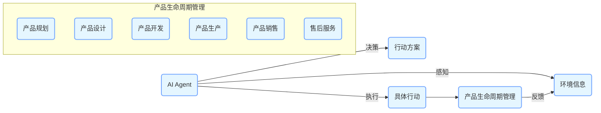

# AI Agent在企业产品生命周期管理中的应用

> 关键词：AI Agent、企业产品生命周期管理、产品设计、生产制造、市场营销、售后服务

> 摘要：本文深入探讨了AI Agent在企业产品生命周期管理中的应用。首先介绍了相关背景，包括目的范围、预期读者、文档结构和术语表。接着阐述了AI Agent与产品生命周期管理的核心概念及联系，通过文本示意图和Mermaid流程图展示其架构。详细讲解了核心算法原理，并给出Python源代码示例。分析了涉及的数学模型和公式，结合实际例子说明。通过项目实战，展示了开发环境搭建、源代码实现与解读。探讨了AI Agent在产品设计、生产制造、市场营销、售后服务等实际应用场景。推荐了学习资源、开发工具框架和相关论文著作。最后总结了未来发展趋势与挑战，还提供了常见问题解答和扩展阅读参考资料，旨在为企业有效利用AI Agent提升产品生命周期管理水平提供全面的指导。

## 1. 背景介绍 
### 1.1 目的和范围
在当今竞争激烈的商业环境中，企业需要不断优化产品生命周期管理（PLM）以提高产品质量、降低成本、缩短上市时间并增强客户满意度。AI Agent作为一种具有自主决策和执行能力的智能实体，能够在产品生命周期的各个阶段发挥重要作用。本文的目的是全面探讨AI Agent在企业产品生命周期管理中的应用，涵盖从产品概念设计到最终退役的整个过程。我们将分析AI Agent如何在不同阶段提供支持，以及相关的技术原理、算法和实际应用案例。范围包括对AI Agent核心概念的介绍、与PLM的集成架构、核心算法的原理和实现、数学模型的分析、项目实战案例以及未来发展趋势和挑战。

### 1.2 预期读者
本文的预期读者包括企业的产品经理、项目经理、研发人员、市场营销人员、售后服务人员以及对AI和PLM技术感兴趣的研究人员和学生。产品经理和项目经理可以从中了解如何利用AI Agent优化产品生命周期管理流程，提高项目的成功率和效率。研发人员可以学习到AI Agent的核心算法和技术实现，为产品创新提供思路。市场营销人员可以了解如何借助AI Agent更好地了解市场需求和客户反馈，制定更有效的营销策略。售后服务人员可以探索如何利用AI Agent提高客户服务质量和效率。研究人员和学生可以将本文作为研究和学习AI在企业应用的参考资料。

### 1.3 文档结构概述
本文将按照以下结构进行组织：
- 核心概念与联系：介绍AI Agent和产品生命周期管理的核心概念，以及它们之间的联系，并通过文本示意图和Mermaid流程图展示其架构。
- 核心算法原理 & 具体操作步骤：详细讲解AI Agent在PLM中应用的核心算法原理，并给出Python源代码示例。
- 数学模型和公式 & 详细讲解 & 举例说明：分析涉及的数学模型和公式，结合实际例子说明其应用。
- 项目实战：代码实际案例和详细解释说明：通过一个实际项目案例，展示开发环境搭建、源代码实现与解读。
- 实际应用场景：探讨AI Agent在产品设计、生产制造、市场营销、售后服务等实际应用场景。
- 工具和资源推荐：推荐学习资源、开发工具框架和相关论文著作。
- 总结：未来发展趋势与挑战：总结AI Agent在PLM中的应用现状，分析未来发展趋势和面临的挑战。
- 附录：常见问题与解答：提供常见问题的解答，帮助读者更好地理解和应用相关技术。
- 扩展阅读 & 参考资料：提供扩展阅读的建议和参考资料，方便读者进一步深入学习。

### 1.4 术语表
#### 1.4.1 核心术语定义
- **AI Agent（人工智能代理）**：是一种能够感知环境、根据预设目标自主决策并采取行动的智能实体。它可以基于人工智能技术，如机器学习、深度学习、自然语言处理等，实现各种复杂的任务。
- **产品生命周期管理（PLM）**：是一种对产品从概念设计、开发、生产、销售到退役的整个生命周期进行管理的方法和技术体系。它涉及到多个部门和环节的协同工作，旨在提高产品质量、降低成本、缩短上市时间。
- **机器学习（Machine Learning）**：是一门多领域交叉学科，涉及概率论、统计学、逼近论、凸分析、算法复杂度理论等多门学科。它专门研究计算机怎样模拟或实现人类的学习行为，以获取新的知识或技能，重新组织已有的知识结构使之不断改善自身的性能。
- **深度学习（Deep Learning）**：是机器学习的一个分支领域，它是一种基于对数据进行表征学习的方法。深度学习通过构建具有很多层的神经网络模型，自动从大量数据中学习到复杂的模式和特征。
- **自然语言处理（Natural Language Processing）**：是计算机科学、人工智能和语言学交叉的领域，旨在让计算机能够理解、处理和生成人类语言。它包括文本分类、情感分析、机器翻译、问答系统等多个应用方向。

#### 1.4.2 相关概念解释
- **智能决策**：AI Agent根据感知到的环境信息和预设的目标，运用机器学习、优化算法等技术，自动做出决策并采取相应的行动。
- **知识图谱**：是一种基于图的数据结构，由节点（实体）和边（关系）组成。它可以将各种知识以图形化的方式表示出来，便于AI Agent进行知识推理和决策。
- **数据挖掘**：是从大量的数据中发现有价值的信息和知识的过程。它可以帮助AI Agent从产品生命周期中的各种数据中提取有用的模式和规律，为决策提供支持。

#### 1.4.3 缩略词列表
- **PLM**：Product Lifecycle Management（产品生命周期管理）
- **ML**：Machine Learning（机器学习）
- **DL**：Deep Learning（深度学习）
- **NLP**：Natural Language Processing（自然语言处理）

## 2. 核心概念与联系 
### 核心概念原理
#### AI Agent
AI Agent是一个具有自主性、反应性、社会性和主动性的智能实体。自主性意味着它可以在没有人类干预的情况下自主地感知环境、做出决策并采取行动。反应性表示它能够及时对环境中的变化做出响应。社会性体现为它可以与其他Agent或人类进行交互和协作。主动性则是指它能够主动地追求预设的目标。AI Agent通常由感知模块、决策模块和执行模块组成。感知模块负责收集环境信息，决策模块根据感知到的信息和预设的目标进行决策，执行模块则将决策转化为具体的行动。

#### 产品生命周期管理
产品生命周期管理是一个涵盖产品从概念设计到最终退役的全过程的管理方法。它包括产品规划、设计、开发、生产、销售、售后服务等多个阶段。在每个阶段，都需要进行数据管理、流程管理和协同工作。产品生命周期管理的目标是提高产品质量、降低成本、缩短上市时间、增强客户满意度和提高企业的竞争力。

### 架构的文本示意图
```plaintext
+---------------------+
|     AI Agent        |
| +-----------------+ |
| |  感知模块       | |
| +-----------------+ |
| +-----------------+ |
| |  决策模块       | |
| +-----------------+ |
| +-----------------+ |
| |  执行模块       | |
| +-----------------+ |
+---------------------+
           |
           v
+---------------------+
|  产品生命周期管理  |
| +-----------------+ |
| |  产品规划       | |
| +-----------------+ |
| +-----------------+ |
| |  产品设计       | |
| +-----------------+ |
| +-----------------+ |
| |  产品开发       | |
| +-----------------+ |
| +-----------------+ |
| |  产品生产       | |
| +-----------------+ |
| +-----------------+ |
| |  产品销售       | |
| +-----------------+ |
| +-----------------+ |
| |  售后服务       | |
| +-----------------+ |
+---------------------+
```

### Mermaid流程图


## 3. 核心算法原理 & 具体操作步骤 
### 核心算法原理
在AI Agent应用于产品生命周期管理中，常用的核心算法包括机器学习算法和优化算法。

#### 机器学习算法 - 决策树算法
决策树是一种常用的机器学习算法，它可以用于分类和回归任务。在产品生命周期管理中，决策树可以用于预测产品的质量、客户需求等。决策树的基本思想是通过对数据的学习，构建一个树形结构，每个内部节点表示一个属性上的测试，每个分支表示一个测试输出，每个叶节点表示一个类别或值。

#### 优化算法 - 遗传算法
遗传算法是一种基于自然选择和遗传机制的优化算法。它可以用于解决复杂的优化问题，如产品设计中的参数优化、生产计划的优化等。遗传算法通过模拟生物进化过程，不断地生成新的解决方案，并通过选择、交叉和变异等操作，逐步找到最优解。

### 具体操作步骤
#### 数据收集与预处理
首先，需要收集产品生命周期管理中的各种数据，如产品设计参数、生产数据、市场反馈数据等。然后，对收集到的数据进行预处理，包括数据清洗、特征提取、数据归一化等操作，以提高数据的质量和可用性。

#### 模型训练
使用预处理后的数据对机器学习模型进行训练。例如，使用决策树算法对产品质量数据进行训练，构建一个产品质量预测模型。在训练过程中，需要选择合适的模型参数，并使用交叉验证等方法来评估模型的性能。

#### 决策制定
在产品生命周期的各个阶段，AI Agent根据感知到的环境信息和训练好的模型，进行决策制定。例如，在产品设计阶段，AI Agent可以根据市场需求和成本限制，使用遗传算法对产品设计参数进行优化，以找到最优的设计方案。

#### 行动执行
AI Agent将决策转化为具体的行动，并在产品生命周期管理中执行。例如，在产品生产阶段，AI Agent可以根据生产计划和设备状态，自动调整生产参数，以提高生产效率和产品质量。

### Python源代码示例
```python
# 决策树算法示例
from sklearn.datasets import load_iris
from sklearn.model_selection import train_test_split
from sklearn.tree import DecisionTreeClassifier
from sklearn.metrics import accuracy_score

# 加载数据集
iris = load_iris()
X = iris.data
y = iris.target

# 划分训练集和测试集
X_train, X_test, y_train, y_test = train_test_split(X, y, test_size=0.2, random_state=42)

# 创建决策树分类器
clf = DecisionTreeClassifier()

# 训练模型
clf.fit(X_train, y_train)

# 预测
y_pred = clf.predict(X_test)

# 评估模型
accuracy = accuracy_score(y_test, y_pred)
print(f"决策树模型的准确率: {accuracy}")

# 遗传算法示例
import numpy as np
from deap import base, creator, tools, algorithms

# 定义问题
creator.create("FitnessMin", base.Fitness, weights=(-1.0,))
creator.create("Individual", list, fitness=creator.FitnessMin)

# 定义基因范围
BOUND_LOW, BOUND_UP = 0.0, 1.0
NDIM = 5

# 初始化工具
toolbox = base.Toolbox()
toolbox.register("attr_float", np.random.uniform, BOUND_LOW, BOUND_UP)
toolbox.register("individual", tools.initRepeat, creator.Individual, toolbox.attr_float, NDIM)
toolbox.register("population", tools.initRepeat, list, toolbox.individual)

# 定义目标函数
def eval_func(individual):
    return sum(x**2 for x in individual),

toolbox.register("evaluate", eval_func)
toolbox.register("mate", tools.cxTwoPoint)
toolbox.register("mutate", tools.mutGaussian, mu=0, sigma=0.2, indpb=0.2)
toolbox.register("select", tools.selTournament, tournsize=3)

# 运行遗传算法
pop = toolbox.population(n=50)
NGEN = 40
for gen in range(NGEN):
    offspring = algorithms.varAnd(pop, toolbox, cxpb=0.5, mutpb=0.2)
    fits = toolbox.map(toolbox.evaluate, offspring)
    for fit, ind in zip(fits, offspring):
        ind.fitness.values = fit
    pop = toolbox.select(offspring, k=len(pop))

best_ind = tools.selBest(pop, k=1)[0]
print(f"遗传算法找到的最优解: {best_ind}")
```

## 4. 数学模型和公式 & 详细讲解 & 举例说明 
### 决策树算法的数学模型和公式
#### 信息熵
信息熵是衡量数据不确定性的一个指标，它的定义如下：
$$
H(X) = -\sum_{i=1}^{n} p(x_i) \log_2 p(x_i)
$$
其中，$X$ 是一个随机变量，$p(x_i)$ 是 $X$ 取值为 $x_i$ 的概率，$n$ 是 $X$ 可能取值的个数。

#### 信息增益
信息增益是在划分数据集前后信息熵的减少量，它可以用来衡量一个属性对分类的重要性。信息增益的计算公式如下：
$$
IG(D, A) = H(D) - \sum_{v \in Values(A)} \frac{|D_v|}{|D|} H(D_v)
$$
其中，$D$ 是数据集，$A$ 是一个属性，$Values(A)$ 是属性 $A$ 的所有可能取值，$D_v$ 是数据集 $D$ 中属性 $A$ 取值为 $v$ 的子集，$|D|$ 和 $|D_v|$ 分别表示数据集 $D$ 和子集 $D_v$ 的样本数量。

#### 举例说明
假设有一个数据集 $D$ 包含 10 个样本，分为两类，其中正类有 6 个样本，负类有 4 个样本。则数据集 $D$ 的信息熵为：
$$
H(D) = -\frac{6}{10} \log_2 \frac{6}{10} - \frac{4}{10} \log_2 \frac{4}{10} \approx 0.971
$$
假设有一个属性 $A$，它有两个取值 $v_1$ 和 $v_2$。$D_{v_1}$ 包含 4 个样本，其中正类有 3 个，负类有 1 个；$D_{v_2}$ 包含 6 个样本，其中正类有 3 个，负类有 3 个。则：
$$
H(D_{v_1}) = -\frac{3}{4} \log_2 \frac{3}{4} - \frac{1}{4} \log_2 \frac{1}{4} \approx 0.811
$$
$$
H(D_{v_2}) = -\frac{3}{6} \log_2 \frac{3}{6} - \frac{3}{6} \log_2 \frac{3}{6} = 1
$$
信息增益为：
$$
IG(D, A) = 0.971 - (\frac{4}{10} \times 0.811 + \frac{6}{10} \times 1) \approx 0.046
$$

### 遗传算法的数学模型和公式
#### 适应度函数
适应度函数是用来评估每个个体（解决方案）优劣的函数。在遗传算法中，我们的目标是找到适应度值最大（或最小）的个体。例如，在上述的遗传算法示例中，适应度函数为：
$$
f(x_1, x_2, \cdots, x_n) = \sum_{i=1}^{n} x_i^2
$$
我们的目标是找到一组 $x_1, x_2, \cdots, x_n$ 使得 $f(x_1, x_2, \cdots, x_n)$ 最小。

#### 选择操作
选择操作是根据个体的适应度值来选择下一代的个体。常用的选择方法是轮盘赌选择法，其选择概率计算公式为：
$$
P(i) = \frac{F(i)}{\sum_{j=1}^{N} F(j)}
$$
其中，$P(i)$ 是个体 $i$ 被选中的概率，$F(i)$ 是个体 $i$ 的适应度值，$N$ 是种群的大小。

#### 交叉操作
交叉操作是将两个父代个体的部分基因进行交换，生成新的子代个体。常用的交叉方法是两点交叉，即在两个父代个体中随机选择两个交叉点，交换两个交叉点之间的基因片段。

#### 变异操作
变异操作是对个体的某些基因进行随机变异，以增加种群的多样性。变异操作的概率通常比较小。例如，在上述的遗传算法示例中，变异操作是对个体的每个基因进行高斯变异。

## 5. 项目实战：代码实际案例和详细解释说明 
### 5.1  开发环境搭建
#### 安装Python
首先，需要安装Python编程语言。可以从Python官方网站（https://www.python.org/downloads/）下载适合自己操作系统的Python版本，并按照安装向导进行安装。

#### 安装必要的库
在Python环境中，需要安装一些必要的库，如 `numpy`、`pandas`、`scikit-learn`、`deap` 等。可以使用 `pip` 命令进行安装：
```sh
pip install numpy pandas scikit-learn deap
```

### 5.2  源代码详细实现和代码解读
#### 产品质量预测系统
```python
import pandas as pd
from sklearn.model_selection import train_test_split
from sklearn.tree import DecisionTreeClassifier
from sklearn.metrics import accuracy_score

# 加载数据集
data = pd.read_csv('product_quality.csv')

# 分离特征和标签
X = data.drop('quality', axis=1)
y = data['quality']

# 划分训练集和测试集
X_train, X_test, y_train, y_test = train_test_split(X, y, test_size=0.2, random_state=42)

# 创建决策树分类器
clf = DecisionTreeClassifier()

# 训练模型
clf.fit(X_train, y_train)

# 预测
y_pred = clf.predict(X_test)

# 评估模型
accuracy = accuracy_score(y_test, y_pred)
print(f"产品质量预测模型的准确率: {accuracy}")
```
#### 代码解读
1. **数据加载**：使用 `pandas` 库的 `read_csv` 函数加载产品质量数据集。
2. **特征和标签分离**：将数据集分为特征矩阵 $X$ 和标签向量 $y$。
3. **数据集划分**：使用 `train_test_split` 函数将数据集划分为训练集和测试集，测试集占比为 20%。
4. **模型创建**：创建一个决策树分类器 `DecisionTreeClassifier`。
5. **模型训练**：使用训练集对决策树分类器进行训练。
6. **模型预测**：使用训练好的模型对测试集进行预测。
7. **模型评估**：使用 `accuracy_score` 函数计算模型的准确率。

#### 产品设计参数优化系统
```python
import numpy as np
from deap import base, creator, tools, algorithms

# 定义问题
creator.create("FitnessMin", base.Fitness, weights=(-1.0,))
creator.create("Individual", list, fitness=creator.FitnessMin)

# 定义基因范围
BOUND_LOW, BOUND_UP = 0.0, 1.0
NDIM = 5

# 初始化工具
toolbox = base.Toolbox()
toolbox.register("attr_float", np.random.uniform, BOUND_LOW, BOUND_UP)
toolbox.register("individual", tools.initRepeat, creator.Individual, toolbox.attr_float, NDIM)
toolbox.register("population", tools.initRepeat, list, toolbox.individual)

# 定义目标函数
def eval_func(individual):
    # 假设这是一个产品设计的目标函数，需要根据实际情况修改
    return sum(x**2 for x in individual),

toolbox.register("evaluate", eval_func)
toolbox.register("mate", tools.cxTwoPoint)
toolbox.register("mutate", tools.mutGaussian, mu=0, sigma=0.2, indpb=0.2)
toolbox.register("select", tools.selTournament, tournsize=3)

# 运行遗传算法
pop = toolbox.population(n=50)
NGEN = 40
for gen in range(NGEN):
    offspring = algorithms.varAnd(pop, toolbox, cxpb=0.5, mutpb=0.2)
    fits = toolbox.map(toolbox.evaluate, offspring)
    for fit, ind in zip(fits, offspring):
        ind.fitness.values = fit
    pop = toolbox.select(offspring, k=len(pop))

best_ind = tools.selBest(pop, k=1)[0]
print(f"产品设计参数优化的最优解: {best_ind}")
```
#### 代码解读
1. **问题定义**：使用 `creator` 模块定义适应度函数和个体类型。
2. **基因范围定义**：定义个体基因的取值范围。
3. **工具初始化**：使用 `toolbox` 模块注册各种操作，如个体生成、种群生成、目标函数评估、交叉操作、变异操作和选择操作。
4. **目标函数定义**：定义一个目标函数，用于评估每个个体的适应度值。
5. **遗传算法运行**：创建初始种群，进行多代进化，每一代中进行交叉、变异和选择操作。
6. **最优解输出**：输出经过多代进化后找到的最优解。

### 5.3  代码解读与分析
#### 产品质量预测系统
- **优点**：决策树算法具有简单易懂、可解释性强的优点。通过决策树模型，可以直观地看到每个特征对产品质量的影响程度。
- **缺点**：决策树模型容易过拟合，尤其是在数据集较小或特征较多的情况下。可以通过剪枝等方法来缓解过拟合问题。
- **适用场景**：适用于产品质量预测、故障诊断等场景，能够快速地根据产品的特征预测其质量状况。

#### 产品设计参数优化系统
- **优点**：遗传算法具有全局搜索能力，能够在复杂的搜索空间中找到较优的解决方案。不需要对目标函数进行求导，适用于各种类型的目标函数。
- **缺点**：遗传算法的收敛速度较慢，尤其是在搜索空间较大的情况下。需要设置合适的参数，如种群大小、迭代次数、交叉概率和变异概率等，否则可能无法找到最优解。
- **适用场景**：适用于产品设计参数优化、生产计划优化等场景，能够在满足各种约束条件的情况下，找到最优的设计方案或生产计划。

## 6. 实际应用场景 
### 产品设计阶段
- **需求分析**：AI Agent可以通过自然语言处理技术，对市场调研数据、客户反馈信息等进行分析，提取客户的需求和痛点，为产品设计提供方向。例如，分析社交媒体上的用户评论，了解用户对产品功能、外观、价格等方面的期望。
- **概念设计**：利用机器学习算法，AI Agent可以根据历史产品数据和市场需求，生成多个产品概念设计方案。例如，通过生成对抗网络（GAN）生成产品的外观设计草图，供设计师参考。
- **参数优化**：在产品设计过程中，AI Agent可以使用优化算法对产品的设计参数进行优化，以提高产品的性能和质量。例如，使用遗传算法对产品的结构参数进行优化，以减轻产品重量、提高强度。

### 生产制造阶段
- **生产计划安排**：AI Agent可以根据订单需求、库存情况、设备状态等信息，制定最优的生产计划。例如，使用线性规划算法，在满足生产能力和交货期的前提下，最小化生产成本。
- **质量控制**：通过对生产过程中的数据进行实时监测和分析，AI Agent可以及时发现质量问题，并采取相应的措施进行调整。例如，使用机器学习算法对生产线上的传感器数据进行分析，预测产品的质量状况，提前发现潜在的质量问题。
- **设备维护**：AI Agent可以根据设备的运行数据和维护记录，预测设备的故障发生时间，提前安排维护计划，减少设备停机时间。例如，使用深度学习算法对设备的振动、温度等数据进行分析，建立设备故障预测模型。

### 市场营销阶段
- **市场细分**：AI Agent可以使用聚类算法对市场进行细分，将客户分为不同的群体，以便企业制定更有针对性的营销策略。例如，根据客户的购买行为、偏好等特征，将客户分为高价值客户、潜在客户、流失客户等群体。
- **精准营销**：通过对客户的个人信息、购买历史、浏览记录等数据进行分析，AI Agent可以为每个客户提供个性化的营销推荐。例如，使用协同过滤算法为客户推荐他们可能感兴趣的产品。
- **竞争对手分析**：AI Agent可以收集和分析竞争对手的产品信息、市场份额、营销策略等数据，为企业制定竞争策略提供支持。例如，通过网络爬虫技术收集竞争对手的产品价格、促销活动等信息，分析竞争对手的优势和劣势。

### 售后服务阶段
- **客户服务**：AI Agent可以通过自然语言处理技术，实现智能客服系统，自动回答客户的问题和解决客户的投诉。例如，使用聊天机器人为客户提供24小时在线服务，提高客户服务效率。
- **产品召回**：如果发现产品存在质量问题，AI Agent可以根据客户的购买记录和使用情况，快速确定需要召回的产品范围和客户名单，及时通知客户进行产品召回。
- **客户反馈分析**：AI Agent可以对客户的反馈信息进行分析，了解客户对产品的满意度和改进建议，为产品的升级和改进提供依据。例如，使用情感分析技术对客户的评价进行分析，了解客户的情感倾向。

## 7. 工具和资源推荐
### 7.1 学习资源推荐
#### 7.1.1 书籍推荐
- 《人工智能：一种现代的方法》（Artificial Intelligence: A Modern Approach）：这是一本经典的人工智能教材，全面介绍了人工智能的各个领域，包括搜索算法、知识表示、机器学习、自然语言处理等。
- 《Python机器学习》（Python Machine Learning）：这本书详细介绍了使用Python进行机器学习的方法和技术，包括数据预处理、模型选择、模型评估等内容。
- 《深度学习》（Deep Learning）：由深度学习领域的三位先驱Ian Goodfellow、Yoshua Bengio和Aaron Courville撰写，全面介绍了深度学习的理论和实践。

#### 7.1.2 在线课程
- Coursera上的“机器学习”课程：由斯坦福大学的Andrew Ng教授授课，是一门非常经典的机器学习入门课程。
- edX上的“人工智能导论”课程：由麻省理工学院（MIT）的Patrick Winston教授授课，介绍了人工智能的基本概念和方法。
- 吴恩达的深度学习专项课程：在Coursera上提供，包括深度学习基础、卷积神经网络、循环神经网络等多个方面的内容。

#### 7.1.3 技术博客和网站
- Medium：是一个技术博客平台，有很多人工智能和机器学习领域的专家分享他们的经验和见解。
- Towards Data Science：专注于数据科学和机器学习领域的技术博客，提供了很多实用的教程和案例。
- Kaggle：是一个数据科学竞赛平台，上面有很多数据集和优秀的解决方案，可以学习到很多实际应用中的技巧和方法。

### 7.2 开发工具框架推荐
#### 7.2.1 IDE和编辑器
- PyCharm：是一款专门为Python开发设计的集成开发环境（IDE），具有代码自动补全、调试、版本控制等功能。
- Jupyter Notebook：是一个交互式的开发环境，适合进行数据探索、模型训练和可视化等工作。
- Visual Studio Code：是一款轻量级的代码编辑器，支持多种编程语言，有丰富的插件扩展。

#### 7.2.2 调试和性能分析工具
- TensorBoard：是TensorFlow提供的一个可视化工具，可以用于查看模型的训练过程、性能指标、网络结构等信息。
- Py-Spy：是一个Python性能分析工具，可以分析Python程序的CPU使用情况和函数调用时间。
- cProfile：是Python标准库中的一个性能分析模块，可以统计函数的调用次数、执行时间等信息。

#### 7.2.3 相关框架和库
- TensorFlow：是一个开源的深度学习框架，由Google开发，广泛应用于图像识别、自然语言处理、语音识别等领域。
- PyTorch：是另一个流行的深度学习框架，由Facebook开发，具有动态图的特点，易于使用和调试。
- Scikit-learn：是一个简单易用的机器学习库，提供了各种机器学习算法和工具，如分类、回归、聚类、降维等。

### 7.3 相关论文著作推荐
#### 7.3.1 经典论文
- “A Logical Calculus of the Ideas Immanent in Nervous Activity” by Warren S. McCulloch and Walter Pitts：这篇论文提出了人工神经网络的第一个数学模型，开创了神经网络研究的先河。
- “Learning Representations by Back-propagating Errors” by David E. Rumelhart, Geoffrey E. Hinton, and Ronald J. Williams：这篇论文介绍了反向传播算法，是深度学习发展的重要里程碑。
- “ImageNet Classification with Deep Convolutional Neural Networks” by Alex Krizhevsky, Ilya Sutskever, and Geoffrey E. Hinton：这篇论文介绍了AlexNet，开启了深度学习在计算机视觉领域的广泛应用。

#### 7.3.2 最新研究成果
- 可以关注顶级学术会议如NeurIPS（神经信息处理系统大会）、ICML（国际机器学习会议）、CVPR（计算机视觉与模式识别会议）等的论文，了解AI Agent和产品生命周期管理领域的最新研究成果。
- 一些知名学术期刊如Journal of Artificial Intelligence Research（JAIR）、Artificial Intelligence等也会发表相关的高质量研究论文。

#### 7.3.3 应用案例分析
- 《AI in Business: The Ultimate Guide to Transforming Your Organization with Artificial Intelligence》：这本书介绍了人工智能在商业领域的各种应用案例，包括产品生命周期管理方面的应用。
- 一些咨询公司如麦肯锡、波士顿咨询集团等会发布关于人工智能在企业应用的研究报告和案例分析，可以关注这些报告以了解实际应用中的经验和教训。

## 8. 总结：未来发展趋势与挑战
### 未来发展趋势
#### 智能化程度不断提高
随着人工智能技术的不断发展，AI Agent在产品生命周期管理中的智能化程度将不断提高。未来的AI Agent将能够更加准确地感知环境、理解复杂的任务和需求，并做出更加智能的决策。例如，在产品设计阶段，AI Agent可以与设计师进行更加深入的交互，根据设计师的意图自动生成多个高质量的设计方案，并对方案进行实时评估和优化。

#### 与物联网和大数据的深度融合
物联网技术的发展使得产品在整个生命周期中产生了大量的数据，而大数据技术则为处理和分析这些数据提供了强大的工具。未来，AI Agent将与物联网和大数据技术深度融合，实现对产品全生命周期的实时监测和管理。例如，通过物联网传感器收集产品在使用过程中的各种数据，AI Agent可以对这些数据进行实时分析，预测产品的故障和维护需求，提前安排维护计划，提高产品的可靠性和可用性。

#### 多Agent协同工作
在复杂的产品生命周期管理中，往往需要多个AI Agent协同工作，共同完成任务。未来，多Agent系统将得到更广泛的应用，不同类型的AI Agent可以在不同的阶段发挥各自的优势，实现高效的协同工作。例如，在产品生产过程中，一个AI Agent负责生产计划的安排，另一个AI Agent负责质量控制，它们之间可以通过信息共享和协作，实现生产过程的优化和质量的提高。

#### 跨领域应用拓展
AI Agent在产品生命周期管理中的应用将不仅仅局限于传统的制造业，还将拓展到更多的领域，如服务业、医疗行业、金融行业等。例如，在医疗行业，AI Agent可以辅助医生进行疾病诊断、治疗方案制定和患者健康管理；在金融行业，AI Agent可以用于风险评估、投资决策和客户服务等方面。

### 挑战
#### 数据隐私和安全问题
在产品生命周期管理中，涉及到大量的敏感数据，如客户信息、产品设计图纸、生产工艺等。如何保障这些数据的隐私和安全是一个重要的挑战。AI Agent在处理这些数据时，需要遵循严格的安全标准和法规，采用加密技术、访问控制等手段，防止数据泄露和滥用。

#### 算法可解释性问题
许多人工智能算法，如深度学习算法，具有很强的黑盒性，难以解释其决策过程和结果。在产品生命周期管理中，尤其是在一些关键决策环节，如产品质量评估、设计方案选择等，需要对算法的决策过程进行解释，以便用户理解和信任。因此，提高算法的可解释性是一个亟待解决的问题。

#### 人才短缺问题
AI Agent在产品生命周期管理中的应用需要具备人工智能、机器学习、产品管理等多方面知识的复合型人才。目前，这类人才相对短缺，限制了AI Agent技术的推广和应用。企业和高校需要加强合作，培养更多适应市场需求的专业人才。

#### 伦理和法律问题
随着AI Agent在产品生命周期管理中的应用越来越广泛，也会带来一系列的伦理和法律问题。例如，当AI Agent做出错误的决策导致产品质量问题或安全事故时，责任如何界定；AI Agent的自主决策是否符合人类的伦理和道德标准等。需要建立相应的伦理和法律框架，规范AI Agent的应用。

## 9. 附录：常见问题与解答
### 问题1：AI Agent与传统软件系统有什么区别？
解答：传统软件系统通常是按照预设的规则和流程进行运行，缺乏自主性和智能决策能力。而AI Agent具有自主感知环境、根据目标进行决策和行动的能力，能够在复杂和动态的环境中自适应地完成任务。例如，传统的生产计划软件可能只是按照固定的算法生成生产计划，而AI Agent可以根据实时的订单需求、设备状态等信息，动态地调整生产计划。

### 问题2：如何评估AI Agent在产品生命周期管理中的性能？
解答：可以从多个方面评估AI Agent的性能，如决策的准确性、效率、可靠性等。在产品设计阶段，可以通过比较AI Agent生成的设计方案与专家设计方案的性能指标来评估其准确性；在生产制造阶段，可以通过生产效率、产品质量等指标来评估其效率和可靠性。此外，还可以使用一些通用的机器学习评估指标，如准确率、召回率、F1值等，来评估AI Agent的分类和预测性能。

### 问题3：AI Agent在产品生命周期管理中会完全取代人类吗？
解答：不会。虽然AI Agent具有很多优势，但在产品生命周期管理中，人类的经验、创造力和判断力仍然是不可替代的。例如，在产品设计阶段，人类设计师的灵感和创意是AI Agent难以企及的；在客户服务阶段，人类的情感沟通和同理心也是AI Agent无法完全替代的。AI Agent更多地是作为人类的辅助工具，帮助人类提高工作效率和决策质量。

### 问题4：如何选择适合的AI Agent算法？
解答：选择适合的AI Agent算法需要考虑多个因素，如问题的类型、数据的特点、计算资源等。如果是分类和预测问题，可以选择决策树、支持向量机、神经网络等算法；如果是优化问题，可以选择遗传算法、模拟退火算法等。此外，还需要根据数据的规模、维度、分布等特点来选择合适的算法。例如，对于大规模数据集，深度学习算法可能更合适；对于高维稀疏数据，支持向量机可能更有效。

## 10. 扩展阅读 & 参考资料
### 扩展阅读
- 《智能商业》：介绍了人工智能和大数据在商业领域的应用，以及如何构建智能商业生态系统。
- 《未来简史：从智人到神人》：探讨了人工智能对人类社会和未来发展的影响，引发对人工智能伦理和社会问题的思考。
- 《创新者的窘境》：虽然不是专门关于AI Agent的书籍，但对于理解企业在产品创新和管理中的挑战和机遇有很大的帮助。

### 参考资料
- 相关学术论文和研究报告，可以通过学术数据库如IEEE Xplore、ACM Digital Library等进行查找。
- 行业报告和白皮书，如Gartner、IDC等咨询公司发布的关于人工智能和产品生命周期管理的报告。
- 开源项目和代码库，如GitHub上的相关项目，可以学习到实际应用中的代码实现和最佳实践。

作者：AI天才研究院/AI Genius Institute & 禅与计算机程序设计艺术 /Zen And The Art of Computer Programming