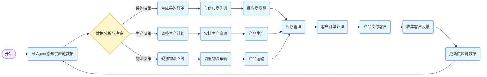

# AI Agent在企业供应链管理中的应用

> 关键词：AI Agent、企业供应链管理、智能决策、自动化流程、数据分析、风险预警、协同优化

> 摘要：本文聚焦于AI Agent在企业供应链管理中的应用。首先介绍了相关背景知识，包括目的范围、预期读者等内容。接着阐述了AI Agent及企业供应链管理的核心概念与联系，通过文本示意图和Mermaid流程图进行清晰展示。详细讲解了核心算法原理与具体操作步骤，并结合Python源代码深入剖析。同时给出了相关数学模型和公式并举例说明。通过项目实战，展示了AI Agent在供应链管理中代码的实际案例并进行详细解读。探讨了其在企业供应链管理中的实际应用场景，推荐了学习、开发工具等相关资源，最后总结了未来发展趋势与挑战，还提供了常见问题解答及扩展阅读参考资料，旨在全面深入地探讨AI Agent在企业供应链管理领域的重要作用与价值。

## 1. 背景介绍 
### 1.1 目的和范围
企业供应链管理是一个复杂的系统工程，涉及到从原材料采购、生产制造、产品运输到销售等多个环节。其目的在于确保产品能够以高效、低成本、高质量的方式从供应商传递到最终客户手中。然而，传统的供应链管理方式往往依赖于人工经验和简单的数据分析，难以应对日益复杂多变的市场环境和供应链风险。

AI Agent（人工智能智能体）作为一种能够感知环境、自主决策并采取行动的智能实体，为企业供应链管理带来了新的机遇。本文的目的是深入探讨AI Agent在企业供应链管理中的应用，范围涵盖了从供应链的各个环节，包括需求预测、库存管理、物流配送、供应商管理等，分析AI Agent如何优化这些环节，提高供应链的效率和灵活性。

### 1.2 预期读者
本文预期读者包括企业供应链管理人员、物流从业者、人工智能研究人员、对供应链数字化转型感兴趣的企业家以及相关专业的学生。对于供应链管理人员和从业者，本文可以为他们提供利用AI Agent提升供应链管理水平的思路和方法；对于人工智能研究人员，可从中了解AI Agent在实际业务场景中的应用需求和挑战；对于企业家，有助于他们认识到AI Agent在企业供应链管理中的战略价值；对于学生，则可以作为学习相关领域知识的参考资料。

### 1.3 文档结构概述
本文首先介绍背景知识，让读者了解研究的目的、范围、预期读者和文档结构。接着阐述AI Agent和企业供应链管理的核心概念与联系，为后续的深入探讨奠定基础。然后详细讲解核心算法原理和具体操作步骤，结合Python代码进行说明。再给出相关的数学模型和公式，并举例解释。通过项目实战，展示AI Agent在供应链管理中的实际应用案例和代码实现。之后探讨其实际应用场景，推荐相关的工具和资源。最后总结未来发展趋势与挑战，提供常见问题解答和扩展阅读参考资料。

### 1.4 术语表
#### 1.4.1 核心术语定义
- **AI Agent（人工智能智能体）**：是一种能够感知环境、根据自身的目标和知识进行推理和决策，并采取相应行动的智能实体。它可以是软件程序、机器人或其他具有智能行为的系统。
- **企业供应链管理**：是对企业从原材料采购、生产制造、产品运输到销售等一系列活动的统筹管理，旨在实现供应链的高效运作和价值最大化。
- **需求预测**：通过对历史数据、市场趋势等因素的分析，预测未来一段时间内产品或服务的需求数量和时间。
- **库存管理**：对企业库存的数量、位置、状态等进行管理和控制，以确保在满足客户需求的前提下，降低库存成本。
- **物流配送**：将产品从生产地或仓库运输到客户手中的过程，包括运输方式选择、路线规划、配送时间安排等。
- **供应商管理**：对企业的供应商进行评估、选择、合作和监督，以确保供应商能够提供高质量的原材料和服务。

#### 1.4.2 相关概念解释
- **智能决策**：AI Agent通过对大量数据的分析和学习，运用先进的算法和模型，做出更加科学、合理的决策，以优化供应链的运作。
- **自动化流程**：利用AI Agent自动执行供应链中的某些任务和流程，减少人工干预，提高效率和准确性。
- **数据分析**：对供应链中的各种数据进行收集、整理、分析和挖掘，以发现潜在的问题和机会，为决策提供支持。
- **风险预警**：AI Agent通过对供应链中的各种风险因素进行监测和分析，提前发出预警信号，帮助企业采取措施应对风险。
- **协同优化**：AI Agent协调供应链中的各个环节和参与方，实现资源的优化配置和协同运作，提高整个供应链的绩效。

#### 1.4.3 缩略词列表
- **AI**：Artificial Intelligence（人工智能）
- **ERP**：Enterprise Resource Planning（企业资源计划）
- **WMS**：Warehouse Management System（仓库管理系统）
- **TMS**：Transportation Management System（运输管理系统）

## 2. 核心概念与联系 

### 2.1 AI Agent核心概念原理
AI Agent的核心原理基于感知、决策和行动三个关键环节。感知环节中，AI Agent通过各种传感器或数据接口获取环境信息，例如在供应链管理中，它可以获取市场需求数据、库存水平数据、物流运输状态数据等。决策环节是AI Agent的智能核心，它运用各种算法和模型对感知到的信息进行分析和推理，根据预设的目标和规则做出决策。例如，根据市场需求预测和库存水平，决定是否需要采购原材料或生产产品。行动环节则是AI Agent将决策转化为实际行动，例如向供应商发送采购订单、安排生产计划、调度物流车辆等。

AI Agent可以分为反应式智能体、基于模型的智能体、基于目标的智能体和基于效用的智能体等不同类型。反应式智能体根据当前的感知信息直接做出反应，不考虑历史信息和未来目标；基于模型的智能体在反应式智能体的基础上，增加了对环境模型的表示和推理；基于目标的智能体则以实现特定的目标为导向进行决策和行动；基于效用的智能体在决策时考虑了不同行动的效用值，以最大化整体效用。

### 2.2 企业供应链管理核心概念
企业供应链管理是一个集成的管理理念，它将供应商、制造商、分销商、零售商和最终客户等各个环节连接成一个有机的整体。其核心目标是实现供应链的高效运作、降低成本、提高客户满意度和增强企业竞争力。

供应链管理包括需求管理、采购管理、生产管理、库存管理、物流管理和客户关系管理等多个子系统。需求管理负责预测市场需求，为后续的生产和采购提供依据；采购管理负责选择合适的供应商，签订采购合同，确保原材料的及时供应；生产管理负责组织生产过程，确保产品的质量和生产效率；库存管理负责控制库存水平，避免库存积压或缺货；物流管理负责产品的运输和配送，确保产品按时到达客户手中；客户关系管理负责与客户沟通，了解客户需求，提高客户满意度。

### 2.3 核心概念联系的文本示意图
AI Agent与企业供应链管理的联系可以用以下文本示意图表示：

AI Agent通过感知供应链中的各种数据，包括市场需求、库存水平、物流状态、供应商绩效等信息。基于这些感知信息，AI Agent运用智能算法进行决策，例如优化采购计划、调整生产进度、规划物流路线等。决策结果通过行动环节转化为实际的供应链操作，影响供应链的各个环节。同时，供应链的实际运作情况又会产生新的数据，反馈给AI Agent，形成一个闭环的智能管理系统。

### 2.4 Mermaid流程图


## 3. 核心算法原理 & 具体操作步骤 

### 3.1 需求预测算法原理及Python实现
需求预测是企业供应链管理中的重要环节，准确的需求预测可以帮助企业合理安排生产和库存，降低成本。常见的需求预测算法包括时间序列分析、回归分析、机器学习算法等。这里我们以简单的线性回归算法为例进行讲解。

线性回归算法的基本原理是通过寻找自变量和因变量之间的线性关系，建立回归模型，从而对因变量进行预测。在需求预测中，自变量可以是时间、季节、促销活动等因素，因变量是产品的需求量。

以下是使用Python实现线性回归需求预测的代码示例：
```python
import numpy as np
from sklearn.linear_model import LinearRegression
import matplotlib.pyplot as plt

# 生成示例数据
# 假设我们有10个时间点的需求量数据
time_points = np.array([1, 2, 3, 4, 5, 6, 7, 8, 9, 10]).reshape(-1, 1)
demand = np.array([10, 12, 15, 18, 20, 22, 25, 28, 30, 32])

# 创建线性回归模型
model = LinearRegression()

# 拟合模型
model.fit(time_points, demand)

# 预测未来的需求量
future_time_points = np.array([11, 12, 13]).reshape(-1, 1)
predicted_demand = model.predict(future_time_points)

# 输出预测结果
print("预测的未来需求量：", predicted_demand)

# 绘制原始数据和预测结果
plt.scatter(time_points, demand, color='blue', label='Actual Demand')
plt.plot(future_time_points, predicted_demand, color='red', label='Predicted Demand')
plt.xlabel('Time')
plt.ylabel('Demand')
plt.title('Demand Forecasting using Linear Regression')
plt.legend()
plt.show()
```
### 3.2 库存管理算法原理及Python实现
库存管理的目标是在满足客户需求的前提下，尽可能降低库存成本。常见的库存管理算法包括经济订货量模型（EOQ）、安全库存模型等。这里我们以经济订货量模型为例进行讲解。

经济订货量模型的基本原理是通过平衡采购成本、库存持有成本和缺货成本，找到一个最优的订货量，使得总成本最小。经济订货量（EOQ）的计算公式为：
$$EOQ = \sqrt{\frac{2DS}{H}}$$
其中，$D$ 是年需求量，$S$ 是每次订货的固定成本，$H$ 是单位产品的年库存持有成本。

以下是使用Python实现经济订货量模型的代码示例：
```python
import math

# 输入参数
D = 1000  # 年需求量
S = 50  # 每次订货的固定成本
H = 2  # 单位产品的年库存持有成本

# 计算经济订货量
EOQ = math.sqrt((2 * D * S) / H)

# 输出结果
print("经济订货量：", EOQ)
```
### 3.3 物流路径规划算法原理及Python实现
物流路径规划的目标是找到一条最优的运输路线，使得运输成本最小或运输时间最短。常见的物流路径规划算法包括Dijkstra算法、A*算法等。这里我们以Dijkstra算法为例进行讲解。

Dijkstra算法是一种贪心算法，用于在带权有向图中找到从一个源节点到所有其他节点的最短路径。其基本原理是从源节点开始，逐步扩展到距离源节点最近的节点，并更新这些节点的最短路径信息，直到所有节点都被访问过。

以下是使用Python实现Dijkstra算法的代码示例：
```python
import heapq

def dijkstra(graph, start):
    distances = {node: float('inf') for node in graph}
    distances[start] = 0
    priority_queue = [(0, start)]

    while priority_queue:
        current_distance, current_node = heapq.heappop(priority_queue)

        if current_distance > distances[current_node]:
            continue

        for neighbor, weight in graph[current_node].items():
            distance = current_distance + weight

            if distance < distances[neighbor]:
                distances[neighbor] = distance
                heapq.heappush(priority_queue, (distance, neighbor))

    return distances

# 示例图
graph = {
    'A': {'B': 1, 'C': 4},
    'B': {'A': 1, 'C': 2, 'D': 5},
    'C': {'A': 4, 'B': 2, 'D': 1},
    'D': {'B': 5, 'C': 1}
}

# 计算从节点A到其他节点的最短路径
start_node = 'A'
shortest_distances = dijkstra(graph, start_node)

# 输出结果
print("从节点", start_node, "到其他节点的最短路径：", shortest_distances)
```

## 4. 数学模型和公式 & 详细讲解 & 举例说明 

### 4.1 需求预测的数学模型
#### 4.1.1 线性回归模型
线性回归模型的数学表达式为：
$$y = \beta_0 + \beta_1x_1 + \beta_2x_2 + \cdots + \beta_nx_n + \epsilon$$
其中，$y$ 是因变量（产品需求量），$x_1, x_2, \cdots, x_n$ 是自变量（如时间、季节等），$\beta_0, \beta_1, \cdots, \beta_n$ 是回归系数，$\epsilon$ 是误差项。

在简单线性回归中，只有一个自变量，模型简化为：
$$y = \beta_0 + \beta_1x + \epsilon$$

回归系数 $\beta_0$ 和 $\beta_1$ 可以通过最小二乘法来估计，最小二乘法的目标是使误差项的平方和最小，即：
$$\min_{\beta_0, \beta_1} \sum_{i=1}^{m}(y_i - (\beta_0 + \beta_1x_i))^2$$
其中，$m$ 是样本数量，$y_i$ 和 $x_i$ 分别是第 $i$ 个样本的因变量和自变量值。

#### 4.1.2 举例说明
假设我们有以下时间和需求量的数据：
| 时间（$x$） | 需求量（$y$） |
|---|---|
| 1 | 10 |
| 2 | 12 |
| 3 | 15 |
| 4 | 18 |
| 5 | 20 |

我们可以使用最小二乘法来估计回归系数 $\beta_0$ 和 $\beta_1$。首先计算 $x$ 和 $y$ 的均值：
$$\bar{x} = \frac{1 + 2 + 3 + 4 + 5}{5} = 3$$
$$\bar{y} = \frac{10 + 12 + 15 + 18 + 20}{5} = 15$$

然后计算 $\beta_1$：
$$\beta_1 = \frac{\sum_{i=1}^{5}(x_i - \bar{x})(y_i - \bar{y})}{\sum_{i=1}^{5}(x_i - \bar{x})^2}$$
$$\sum_{i=1}^{5}(x_i - \bar{x})(y_i - \bar{y}) = (1 - 3)(10 - 15) + (2 - 3)(12 - 15) + (3 - 3)(15 - 15) + (4 - 3)(18 - 15) + (5 - 3)(20 - 15) = 20$$
$$\sum_{i=1}^{5}(x_i - \bar{x})^2 = (1 - 3)^2 + (2 - 3)^2 + (3 - 3)^2 + (4 - 3)^2 + (5 - 3)^2 = 10$$
$$\beta_1 = \frac{20}{10} = 2$$

最后计算 $\beta_0$：
$$\beta_0 = \bar{y} - \beta_1\bar{x} = 15 - 2 \times 3 = 9$$

所以回归方程为：
$$y = 9 + 2x$$

当 $x = 6$ 时，预测的需求量为：
$$y = 9 + 2 \times 6 = 21$$

### 4.2 库存管理的数学模型
#### 4.2.1 经济订货量模型
经济订货量模型的数学表达式为：
$$EOQ = \