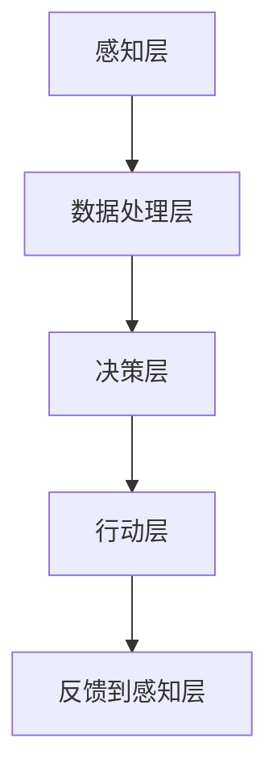

# AI Agent在企业信息安全与隐私保护中的应用

> 关键词：AI Agent、企业信息安全、隐私保护、智能决策、自动化防御

> 摘要：本文围绕AI Agent在企业信息安全与隐私保护中的应用展开深入探讨。首先介绍了研究的背景和相关概念，阐述了AI Agent的核心原理与架构。接着详细讲解了其涉及的核心算法原理，通过Python代码进行了说明，并给出了相关数学模型和公式。通过项目实战展示了AI Agent在实际场景中的应用，分析了其实际应用场景和价值。同时推荐了相关的学习资源、开发工具框架以及论文著作。最后总结了AI Agent在企业信息安全与隐私保护领域的未来发展趋势与挑战，并对常见问题进行了解答。旨在为企业更好地利用AI Agent提升信息安全与隐私保护水平提供全面的参考。

## 1. 背景介绍 
### 1.1 目的和范围
在当今数字化时代，企业面临着日益严峻的信息安全与隐私保护挑战。随着信息技术的飞速发展，企业的数据量呈爆炸式增长，数据的存储、传输和处理过程中面临着各种安全威胁，如黑客攻击、数据泄露等。AI Agent作为一种新兴的智能技术，具有自主学习、智能决策和自动化执行等特点，能够为企业的信息安全与隐私保护提供有效的解决方案。本文的目的在于深入探讨AI Agent在企业信息安全与隐私保护中的应用原理、方法和实践，为企业提供全面的技术参考和指导。研究范围涵盖了AI Agent的核心概念、算法原理、数学模型、项目实战、实际应用场景等多个方面。

### 1.2 预期读者
本文预期读者包括企业信息安全管理人员、隐私保护专家、IT技术人员、研究人员以及对AI Agent和信息安全领域感兴趣的相关人士。这些读者可以从本文中获取关于AI Agent在企业信息安全与隐私保护中应用的专业知识和实践经验，为其工作和研究提供参考。

### 1.3 文档结构概述
本文共分为十个部分。第一部分为背景介绍，阐述了研究的目的、范围、预期读者和文档结构概述，并对相关术语进行了定义和解释。第二部分介绍了AI Agent的核心概念与联系，包括其原理和架构，并通过文本示意图和Mermaid流程图进行了展示。第三部分详细讲解了AI Agent的核心算法原理，并通过Python源代码进行了具体说明。第四部分给出了AI Agent涉及的数学模型和公式，并进行了详细讲解和举例说明。第五部分通过项目实战展示了AI Agent在企业信息安全与隐私保护中的实际应用，包括开发环境搭建、源代码实现和代码解读。第六部分分析了AI Agent在企业信息安全与隐私保护中的实际应用场景。第七部分推荐了相关的学习资源、开发工具框架和论文著作。第八部分总结了AI Agent在该领域的未来发展趋势与挑战。第九部分为附录，解答了常见问题。第十部分提供了扩展阅读和参考资料。

### 1.4 术语表
#### 1.4.1 核心术语定义
- **AI Agent（人工智能智能体）**：是一种能够感知环境、自主学习、做出决策并采取行动的智能实体。它可以根据环境的变化和自身的目标，动态地调整自己的行为。
- **企业信息安全**：指保护企业的信息资产，包括数据、系统、网络等，免受未经授权的访问、使用、披露、破坏、更改或干扰。
- **隐私保护**：是指保护个人或企业的敏感信息不被泄露、滥用或侵犯的一系列措施和技术。

#### 1.4.2 相关概念解释
- **自主学习**：AI Agent能够通过不断地与环境交互，从数据中学习知识和经验，从而不断提升自己的性能和能力。
- **智能决策**：AI Agent可以根据感知到的环境信息和自身的目标，运用所学的知识和算法，做出合理的决策。
- **自动化防御**：利用AI Agent的自主决策和执行能力，自动地对信息安全威胁进行检测、分析和响应，实现对企业信息系统的实时保护。

#### 1.4.3 缩略词列表
- **AI**：Artificial Intelligence（人工智能）
- **ML**：Machine Learning（机器学习）
- **DL**：Deep Learning（深度学习）
- **IDS**：Intrusion Detection System（入侵检测系统）
- **IPS**：Intrusion Prevention System（入侵预防系统）

## 2. 核心概念与联系 
AI Agent是一种具有智能行为的实体，它可以感知环境、做出决策并采取行动。其核心概念主要包括感知、决策和行动三个方面。感知模块负责收集环境信息，决策模块根据感知到的信息和自身的目标进行推理和决策，行动模块则根据决策结果执行相应的操作。

### 核心概念原理和架构的文本示意图
AI Agent的基本架构可以分为以下几个部分：
- **感知层**：通过各种传感器收集环境信息，如网络流量数据、系统日志等。
- **数据处理层**：对感知到的信息进行预处理，包括数据清洗、特征提取等操作。
- **决策层**：运用机器学习、深度学习等算法对处理后的数据进行分析和推理，做出决策。
- **行动层**：根据决策结果执行相应的操作，如阻止非法访问、发送警报等。

### Mermaid流程图

这个流程图展示了AI Agent的工作流程。感知层收集环境信息后，将其传递给数据处理层进行预处理。处理后的数据被送到决策层进行分析和决策，决策结果由行动层执行。执行结果又会反馈到感知层，形成一个闭环的反馈机制，使AI Agent能够不断地适应环境的变化。

## 3. 核心算法原理 & 具体操作步骤 （算法原理讲解必须使用Python源代码来详细阐述）
AI Agent在企业信息安全与隐私保护中常用的算法包括机器学习算法和深度学习算法。下面以基于机器学习的入侵检测算法为例，详细讲解其原理和具体操作步骤。

### 核心算法原理
基于机器学习的入侵检测算法的基本原理是通过对正常和异常网络流量数据的学习，构建一个分类模型。当有新的网络流量数据到来时，将其输入到分类模型中，模型根据学习到的知识判断该流量是否为入侵行为。

### 具体操作步骤
1. **数据收集**：收集正常和异常的网络流量数据。
2. **数据预处理**：对收集到的数据进行清洗、特征提取等操作，将其转换为适合机器学习算法处理的格式。
3. **模型训练**：使用预处理后的数据训练分类模型。
4. **模型评估**：使用测试数据评估模型的性能。
5. **模型部署**：将训练好的模型部署到实际的入侵检测系统中。

### Python源代码实现
```python
import pandas as pd
from sklearn.model_selection import train_test_split
from sklearn.ensemble import RandomForestClassifier
from sklearn.metrics import accuracy_score

# 数据收集
data = pd.read_csv('network_traffic_data.csv')

# 数据预处理
X = data.drop('label', axis=1)  # 特征
y = data['label']  # 标签

# 划分训练集和测试集
X_train, X_test, y_train, y_test = train_test_split(X, y, test_size=0.2, random_state=42)

# 模型训练
model = RandomForestClassifier()
model.fit(X_train, y_train)

# 模型评估
y_pred = model.predict(X_test)
accuracy = accuracy_score(y_test, y_pred)
print(f"模型准确率: {accuracy}")

# 模型部署（这里简单模拟）
def detect_intrusion(traffic_data):
    prediction = model.predict([traffic_data])
    if prediction[0] == 1:
        print("检测到入侵行为！")
    else:
        print("正常流量。")
```
在上述代码中，首先使用`pandas`库读取网络流量数据。然后进行数据预处理，将特征和标签分离，并划分训练集和测试集。接着使用`RandomForestClassifier`训练分类模型，并使用测试集评估模型的准确率。最后定义了一个`detect_intrusion`函数，用于模拟模型的部署，对新的网络流量数据进行入侵检测。

## 4. 数学模型和公式 & 详细讲解 & 举例说明 
### 数学模型
在基于机器学习的入侵检测算法中，常用的数学模型是分类模型。以随机森林分类器为例，其数学模型可以表示为多个决策树的组合。每个决策树根据输入的特征进行节点分裂，最终输出一个分类结果。随机森林通过对多个决策树的结果进行投票，得到最终的分类结果。

### 数学公式
设输入的特征向量为 $\mathbf{x} = [x_1, x_2, \cdots, x_n]$，随机森林中有 $m$ 个决策树，第 $i$ 个决策树的输出为 $y_i$，则随机森林的最终输出 $y$ 可以表示为：
$$y = \text{majority}(\{y_1, y_2, \cdots, y_m\})$$
其中，$\text{majority}$ 表示多数投票函数，即选择出现次数最多的分类结果作为最终输出。

### 详细讲解
随机森林通过集成多个决策树，降低了单个决策树的过拟合风险，提高了模型的泛化能力。每个决策树在训练过程中使用不同的样本子集和特征子集，增加了模型的多样性。在预测时，多个决策树的结果进行投票，使得最终的分类结果更加稳定和准确。

### 举例说明
假设我们有一个包含 10 个决策树的随机森林，对于一个新的输入特征向量，10 个决策树的输出分别为 $[0, 1, 0, 0, 1, 0, 0, 0, 1, 0]$。其中，0 表示正常流量，1 表示入侵行为。通过多数投票，0 出现的次数最多，因此最终的分类结果为正常流量。

## 5. 项目实战：代码实际案例和详细解释说明 
### 5.1  开发环境搭建
- **操作系统**：可以选择 Linux（如 Ubuntu）、Windows 或 macOS。
- **Python 版本**：建议使用 Python 3.7 及以上版本。
- **开发工具**：可以使用 PyCharm、Jupyter Notebook 等。
- **相关库**：需要安装`pandas`、`scikit-learn`等库。可以使用以下命令进行安装：
```sh
pip install pandas scikit-learn
```

### 5.2  源代码详细实现和代码解读
```python
import pandas as pd
from sklearn.model_selection import train_test_split
from sklearn.ensemble import RandomForestClassifier
from sklearn.metrics import accuracy_score

# 数据收集
data = pd.read_csv('network_traffic_data.csv')

# 数据预处理
X = data.drop('label', axis=1)  # 特征
y = data['label']  # 标签

# 划分训练集和测试集
X_train, X_test, y_train, y_test = train_test_split(X, y, test_size=0.2, random_state=42)

# 模型训练
model = RandomForestClassifier()
model.fit(X_train, y_train)

# 模型评估
y_pred = model.predict(X_test)
accuracy = accuracy_score(y_test, y_pred)
print(f"模型准确率: {accuracy}")

# 模型部署（这里简单模拟）
def detect_intrusion(traffic_data):
    prediction = model.predict([traffic_data])
    if prediction[0] == 1:
        print("检测到入侵行为！")
    else:
        print("正常流量。")
```
- **数据收集**：使用`pandas`库的`read_csv`函数读取存储在`network_traffic_data.csv`文件中的网络流量数据。
- **数据预处理**：使用`drop`方法将标签列从数据中移除，得到特征矩阵`X`，同时将标签列单独提取出来作为`y`。
- **划分训练集和测试集**：使用`train_test_split`函数将数据集划分为训练集和测试集，测试集占总数据的 20%。
- **模型训练**：创建一个`RandomForestClassifier`对象，并使用训练集数据进行训练。
- **模型评估**：使用测试集数据进行预测，并使用`accuracy_score`函数计算模型的准确率。
- **模型部署**：定义一个`detect_intrusion`函数，用于对新的网络流量数据进行入侵检测。

### 5.3  代码解读与分析
- **优点**：随机森林算法具有较高的准确率和鲁棒性，能够处理高维数据和大规模数据集。同时，代码结构简单，易于理解和实现。
- **缺点**：随机森林算法的训练时间较长，尤其是在处理大规模数据集时。此外，模型的可解释性较差，难以理解其决策过程。
- **改进方向**：可以尝试使用更高效的算法，如梯度提升树等，以减少训练时间。同时，可以结合特征选择技术，减少特征维度，提高模型的训练效率和可解释性。

## 6. 实际应用场景 
### 网络入侵检测
AI Agent可以实时监测网络流量，通过对流量数据的分析和学习，识别出潜在的入侵行为，如黑客攻击、恶意软件传播等。一旦检测到入侵行为，AI Agent可以自动采取措施，如阻止非法访问、切断网络连接等，保护企业网络的安全。

### 数据泄露防护
AI Agent可以对企业内部的数据进行监控和分析，识别出可能导致数据泄露的行为和事件。例如，监测员工的文件访问行为、数据传输行为等，当发现异常操作时，及时发出警报并采取相应的措施，防止数据泄露。

### 访问控制管理
AI Agent可以根据用户的身份、权限和行为模式，动态地调整访问控制策略。例如，对于频繁进行异常操作的用户，限制其访问权限；对于新入职的员工，根据其岗位需求分配相应的访问权限。通过智能的访问控制管理，提高企业信息系统的安全性。

### 安全漏洞检测与修复
AI Agent可以定期对企业的信息系统进行安全漏洞扫描，通过对系统配置、软件版本等信息的分析，发现潜在的安全漏洞。一旦发现漏洞，AI Agent可以自动生成修复建议，并协助管理员进行漏洞修复，降低企业信息系统被攻击的风险。

## 7. 工具和资源推荐
### 7.1 学习资源推荐
#### 7.1.1 书籍推荐
- 《机器学习》（周志华）：全面介绍了机器学习的基本概念、算法和应用，是机器学习领域的经典教材。
- 《深度学习》（Ian Goodfellow、Yoshua Bengio 和 Aaron Courville）：深入讲解了深度学习的原理、模型和算法，是深度学习领域的权威著作。
- 《Python 机器学习实战》（Sebastian Raschka）：通过实际案例介绍了如何使用 Python 实现机器学习算法，适合初学者学习。

#### 7.1.2 在线课程
- Coursera 上的“机器学习”课程（Andrew Ng 教授）：由机器学习领域的知名专家授课，内容全面，讲解深入。
- edX 上的“深度学习”课程：提供了丰富的深度学习课程资源，包括理论讲解和实践操作。
- 中国大学 MOOC 上的“人工智能基础”课程：适合对人工智能领域感兴趣的初学者学习。

#### 7.1.3 技术博客和网站
- Medium：提供了大量关于人工智能、机器学习、信息安全等领域的技术文章和案例分析。
- Towards Data Science：专注于数据科学和机器学习领域的技术博客，有很多优秀的文章和教程。
- 安全客：专注于信息安全领域的技术博客，提供了最新的安全技术和漏洞信息。

### 7.2 开发工具框架推荐
#### 7.2.1 IDE和编辑器
- PyCharm：一款功能强大的 Python 集成开发环境，提供了代码编辑、调试、版本控制等功能。
- Jupyter Notebook：一种交互式的开发环境，适合进行数据探索、模型训练和实验验证。
- Visual Studio Code：一款轻量级的代码编辑器，支持多种编程语言，有丰富的插件可以扩展功能。

#### 7.2.2 调试和性能分析工具
- PDB：Python 内置的调试器，可以帮助开发者定位和解决代码中的问题。
- cProfile：Python 内置的性能分析工具，可以分析代码的运行时间和资源消耗情况。
- TensorBoard：用于可视化深度学习模型的训练过程和性能指标，方便开发者进行模型优化。

#### 7.2.3 相关框架和库
- Scikit-learn：一个简单易用的机器学习库，提供了各种机器学习算法和工具，如分类、回归、聚类等。
- TensorFlow：一个开源的深度学习框架，广泛应用于图像识别、自然语言处理等领域。
- PyTorch：另一个流行的深度学习框架，具有动态计算图的特点，适合快速迭代和实验。

### 7.3 相关论文著作推荐
#### 7.3.1 经典论文
- “A Few Useful Things to Know about Machine Learning”（Pedro Domingos）：介绍了机器学习中的一些重要概念和经验教训。
- “ImageNet Classification with Deep Convolutional Neural Networks”（Alex Krizhevsky、Ilya Sutskever 和 Geoffrey E. Hinton）：提出了 AlexNet 模型，开启了深度学习在图像识别领域的革命。
- “Attention Is All You Need”（Ashish Vaswani 等）：提出了 Transformer 模型，在自然语言处理领域取得了巨大成功。

#### 7.3.2 最新研究成果
- 可以关注顶级学术会议和期刊，如 NeurIPS、ICML、CVPR、ACM SIGSAC 等，获取关于 AI Agent、信息安全和隐私保护领域的最新研究成果。

#### 7.3.3 应用案例分析
- 可以参考一些企业和研究机构发布的案例