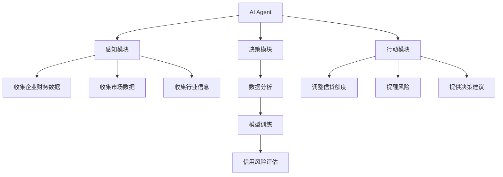

# AI Agent在企业信用风险动态评估中的应用与模型可解释性

> 关键词：AI Agent、企业信用风险、动态评估、模型可解释性、机器学习

> 摘要：本文聚焦于AI Agent在企业信用风险动态评估中的应用以及模型可解释性问题。首先介绍了企业信用风险动态评估的背景和意义，阐述了AI Agent的核心概念及其与企业信用风险评估的联系。详细讲解了相关核心算法原理和具体操作步骤，通过数学模型和公式进行理论支撑并举例说明。接着通过项目实战展示了代码实现和解读，探讨了AI Agent在企业信用风险动态评估中的实际应用场景。推荐了相关的工具和资源，最后总结了未来发展趋势与挑战，解答了常见问题并提供了扩展阅读和参考资料，旨在为企业信用风险评估领域提供全面且深入的技术见解。

## 1. 背景介绍 
### 1.1 目的和范围
企业信用风险评估是金融机构、投资者等进行决策的重要依据。传统的信用风险评估方法往往基于静态数据和固定的模型，难以适应企业经营环境的动态变化。随着人工智能技术的发展，AI Agent作为一种具有自主学习和决策能力的智能体，为企业信用风险的动态评估提供了新的思路和方法。本文的目的在于深入探讨AI Agent在企业信用风险动态评估中的应用，并关注模型的可解释性，以提高评估结果的可信度和实用性。研究范围涵盖了AI Agent的基本原理、相关算法、数学模型，以及在实际项目中的应用案例等方面。

### 1.2 预期读者
本文预期读者包括金融领域的从业者，如银行信贷人员、风险管理人员、投资分析师等，他们希望借助先进的技术手段提升企业信用风险评估的准确性和效率；人工智能领域的研究人员和开发者，对AI Agent的应用场景和模型可解释性问题感兴趣；以及相关专业的学生，希望通过本文了解企业信用风险评估和AI Agent技术的结合点。

### 1.3 文档结构概述
本文首先介绍了企业信用风险动态评估的背景知识和相关术语，让读者对研究领域有初步的了解。接着阐述了AI Agent的核心概念及其与企业信用风险评估的联系，通过文本示意图和Mermaid流程图进行直观展示。然后详细讲解了核心算法原理和具体操作步骤，给出Python源代码进行说明。随后介绍了数学模型和公式，并举例说明其在企业信用风险评估中的应用。通过项目实战展示了代码的实际实现和解读，分析了AI Agent在实际应用中的效果。探讨了AI Agent在企业信用风险动态评估中的实际应用场景，推荐了相关的学习资源、开发工具框架和论文著作。最后总结了未来发展趋势与挑战，解答了常见问题并提供了扩展阅读和参考资料。

### 1.4 术语表
#### 1.4.1 核心术语定义
- **AI Agent（人工智能智能体）**：是一种能够感知环境、进行决策并采取行动的智能实体，具有自主学习和适应环境变化的能力。
- **企业信用风险**：指企业在经营过程中由于各种原因导致无法按时履行债务或其他信用义务的可能性。
- **动态评估**：是指在不同时间点对企业信用风险进行持续、实时的评估，考虑到企业经营环境和财务状况的变化。
- **模型可解释性**：指能够理解和解释模型的决策过程和输出结果的能力，使模型的预测结果具有可信度和可理解性。

#### 1.4.2 相关概念解释
- **机器学习**：是一门多领域交叉学科，涉及概率论、统计学、逼近论、凸分析、算法复杂度理论等多门学科。它专门研究计算机怎样模拟或实现人类的学习行为，以获取新的知识或技能，重新组织已有的知识结构使之不断改善自身的性能。
- **深度学习**：是机器学习的一个分支领域，它是一种基于对数据进行表征学习的方法。深度学习通过构建具有很多层的神经网络模型，自动从数据中学习到复杂的特征和模式。

#### 1.4.3 缩略词列表
- **AI**：Artificial Intelligence（人工智能）
- **ML**：Machine Learning（机器学习）
- **DL**：Deep Learning（深度学习）

## 2. 核心概念与联系 
### 2.1 AI Agent的核心概念
AI Agent是一种能够感知环境、进行决策并采取行动的智能实体。它通常由感知模块、决策模块和行动模块组成。感知模块负责收集环境信息，决策模块根据感知到的信息进行分析和决策，行动模块则根据决策结果采取相应的行动。AI Agent具有自主性、反应性、社会性和适应性等特点。自主性意味着AI Agent能够独立地进行决策和行动；反应性表示AI Agent能够对环境的变化做出及时的反应；社会性指AI Agent能够与其他智能体进行交互和协作；适应性则表示AI Agent能够根据环境的变化不断调整自己的行为和策略。

### 2.2 企业信用风险动态评估的概念
企业信用风险动态评估是指在不同时间点对企业信用风险进行持续、实时的评估。传统的企业信用风险评估方法往往基于静态数据和固定的模型，难以适应企业经营环境的动态变化。而动态评估则考虑到企业的财务状况、市场环境、行业竞争等因素的变化，通过不断更新数据和模型，及时准确地评估企业的信用风险。

### 2.3 AI Agent与企业信用风险动态评估的联系
AI Agent可以在企业信用风险动态评估中发挥重要作用。AI Agent的感知模块可以收集企业的各种数据，包括财务报表、市场数据、行业信息等；决策模块可以根据这些数据进行分析和决策，评估企业的信用风险；行动模块可以根据评估结果采取相应的措施，如调整信贷额度、提醒风险等。同时，AI Agent的适应性特点使其能够根据企业经营环境的变化不断调整评估模型和策略，提高评估的准确性和及时性。

### 2.4 文本示意图
AI Agent在企业信用风险动态评估中的应用可以用以下文本示意图表示：

AI Agent
|-- 感知模块
|   |-- 收集企业财务数据
|   |-- 收集市场数据
|   |-- 收集行业信息
|-- 决策模块
|   |-- 数据分析
|   |-- 模型训练
|   |-- 信用风险评估
|-- 行动模块
|   |-- 调整信贷额度
|   |-- 提醒风险
|   |-- 提供决策建议

### 2.5 Mermaid流程图


## 3. 核心算法原理 & 具体操作步骤 
### 3.1 核心算法原理
在企业信用风险动态评估中，常用的算法包括机器学习算法和深度学习算法。这里以支持向量机（SVM）算法为例进行介绍。

支持向量机是一种二分类模型，其基本思想是在特征空间中找到一个最优的超平面，使得不同类别的样本能够被最大程度地分开。对于线性可分的数据集，SVM可以找到一个唯一的最优超平面；对于线性不可分的数据集，SVM可以通过引入松弛变量和核函数来解决。

SVM的目标是求解以下优化问题：

$$\min_{w,b,\xi} \frac{1}{2}||w||^2 + C\sum_{i=1}^{n}\xi_i$$

$$s.t. \quad y_i(w^T\phi(x_i)+b) \geq 1 - \xi_i, \quad \xi_i \geq 0, \quad i = 1,2,\cdots,n$$

其中，$w$ 是超平面的法向量，$b$ 是偏置，$\xi_i$ 是松弛变量，$C$ 是惩罚参数，$\phi(x_i)$ 是将输入样本 $x_i$ 映射到高维特征空间的函数。

### 3.2 具体操作步骤
#### 3.2.1 数据收集与预处理
收集企业的财务数据、市场数据、行业信息等相关数据，并进行预处理，包括数据清洗、特征选择、数据标准化等操作。

#### 3.2.2 模型训练
使用支持向量机算法对预处理后的数据进行训练，得到信用风险评估模型。

#### 3.2.3 模型评估
使用测试数据集对训练好的模型进行评估，计算模型的准确率、召回率、F1值等指标。

#### 3.2.4 模型优化
根据模型评估的结果，对模型进行优化，如调整惩罚参数 $C$、选择不同的核函数等。

### 3.3 Python源代码实现
```python
import numpy as np
from sklearn import svm
from sklearn.model_selection import train_test_split
from sklearn.preprocessing import StandardScaler
from sklearn.metrics import accuracy_score, recall_score, f1_score

# 生成示例数据
np.random.seed(0)
X = np.random.randn(100, 5)
y = np.random.randint(0, 2, 100)

# 数据预处理
scaler = StandardScaler()
X = scaler.fit_transform(X)

# 划分训练集和测试集
X_train, X_test, y_train, y_test = train_test_split(X, y, test_size=0.2, random_state=42)

# 模型训练
clf = svm.SVC(C=1.0, kernel='rbf')
clf.fit(X_train, y_train)

# 模型预测
y_pred = clf.predict(X_test)

# 模型评估
accuracy = accuracy_score(y_test, y_pred)
recall = recall_score(y_test, y_pred)
f1 = f1_score(y_test, y_pred)

print(f"Accuracy: {accuracy}")
print(f"Recall: {recall}")
print(f"F1 Score: {f1}")
```

## 4. 数学模型和公式 & 详细讲解 & 举例说明 
### 4.1 支持向量机的数学模型
支持向量机的数学模型可以分为线性可分和线性不可分两种情况。

#### 4.1.1 线性可分情况
对于线性可分的数据集，存在一个超平面 $w^T x + b = 0$ 能够将不同类别的样本完全分开。SVM的目标是找到一个最优的超平面，使得不同类别的样本到超平面的距离最大。这个距离称为间隔（margin），最优超平面就是使得间隔最大的超平面。

间隔的计算公式为：

$$\text{margin} = \frac{2}{||w||}$$

因此，SVM的优化问题可以表示为：

$$\max_{w,b} \frac{2}{||w||}$$

$$s.t. \quad y_i(w^T x_i + b) \geq 1, \quad i = 1,2,\cdots,n$$

为了方便求解，通常将上述优化问题转化为其对偶问题：

$$\min_{\alpha} \frac{1}{2}\sum_{i=1}^{n}\sum_{j=1}^{n}\alpha_i\alpha_j y_i y_j x_i^T x_j - \sum_{i=1}^{n}\alpha_i$$

$$s.t. \quad \sum_{i=1}^{n}\alpha_i y_i = 0, \quad \alpha_i \geq 0, \quad i = 1,2,\cdots,n$$

其中，$\alpha_i$ 是拉格朗日乘子。

#### 4.1.2 线性不可分情况
对于线性不可分的数据集，引入松弛变量 $\xi_i$ 来允许一些样本点落在超平面的错误一侧。此时，SVM的优化问题变为：

$$\min_{w,b,\xi} \frac{1}{2}||w||^2 + C\sum_{i=1}^{n}\xi_i$$

$$s.t. \quad y_i(w^T x_i + b) \geq 1 - \xi_i, \quad \xi_i \geq 0, \quad i = 1,2,\cdots,n$$

其中，$C$ 是惩罚参数，用于控制对误分类样本的惩罚程度。

其对偶问题为：

$$\min_{\alpha} \frac{1}{2}\sum_{i=1}^{n}\sum_{j=1}^{n}\alpha_i\alpha_j y_i y_j x_i^T x_j - \sum_{i=1}^{n}\alpha_i$$

$$s.t. \quad \sum_{i=1}^{n}\alpha_i y_i = 0, \quad 0 \leq \alpha_i \leq C, \quad i = 1,2,\cdots,n$$

### 4.2 核函数
对于线性不可分的数据集，除了引入松弛变量外，还可以通过核函数将输入样本映射到高维特征空间，使得在高维特征空间中样本变得线性可分。常用的核函数包括线性核、多项式核、径向基核（RBF）等。

#### 4.2.1 线性核
线性核的定义为：

$$K(x_i, x_j) = x_i^T x_j$$

#### 4.2.2 多项式核
多项式核的定义为：

$$K(x_i, x_j) = (\gamma x_i^T x_j + r)^d$$

其中，$\gamma$、$r$ 和 $d$ 是核函数的参数。

#### 4.2.3 径向基核（RBF）
径向基核的定义为：

$$K(x_i, x_j) = \exp(-\gamma||x_i - x_j||^2)$$

其中，$\gamma$ 是核函数的参数。

### 4.3 举例说明
假设我们有一个二维数据集，包含两个类别的样本点。我们可以使用支持向量机算法对这个数据集进行分类，并通过不同的核函数来比较分类效果。

```python
import numpy as np
import matplotlib.pyplot as plt
from sklearn import svm

# 生成示例数据
np.random.seed(0)
X = np.r_[np.random.randn(20, 2) - [2, 2], np.random.randn(20, 2) + [2, 2]]
Y = [0] * 20 + [1] * 20

# 定义不同的核函数
kernels = ['linear', 'poly', 'rbf']

# 绘制不同核函数的分类结果
plt.figure(figsize=(15, 5))
for i, kernel in enumerate(kernels):
    clf = svm.SVC(kernel=kernel)
    clf.fit(X, Y)

    plt.subplot(1, 3, i + 1)
    plt.scatter(X[:, 0], X[:, 1], c=Y, cmap=plt.cm.Paired)

    ax = plt.gca()
    xlim = ax.get_xlim()
    ylim = ax.get_ylim()

    xx = np.linspace(xlim[0], xlim[1], 30)
    yy = np.linspace(ylim[0], ylim[1], 30)
    YY, XX = np.meshgrid(yy, xx)
    xy = np.vstack([XX.ravel(), YY.ravel()]).T
    Z = clf.decision_function(xy).reshape(XX.shape)

    ax.contour(XX, YY, Z, colors='k', levels=[-1, 0, 1], alpha=0.5, linestyles=['--', '-', '--'])
    ax.scatter(clf.support_vectors_[:, 0], clf.support_vectors_[:, 1], s=100, linewidth=1, facecolors='none', edgecolors='k')
    plt.title(kernel)

plt.show()
```

通过上述代码，我们可以看到不同核函数在分类效果上的差异。线性核适用于线性可分的数据集，多项式核和径向基核可以处理非线性可分的数据集。

## 5. 项目实战：代码实际案例和详细解释说明 
### 5.1  开发环境搭建
#### 5.1.1 安装Python
首先需要安装Python环境，建议使用Python 3.7及以上版本。可以从Python官方网站（https://www.python.org/downloads/） 下载并安装Python。

#### 5.1.2 安装必要的库
在安装好Python后，需要安装一些必要的库，如NumPy、Pandas、Scikit-learn等。可以使用以下命令进行安装：

```sh
pip install numpy pandas scikit-learn matplotlib
```

### 5.2  源代码详细实现和代码解读
#### 5.2.1 数据加载与预处理
```python
import pandas as pd
from sklearn.preprocessing import StandardScaler
from sklearn.model_selection import train_test_split

# 加载数据
data = pd.read_csv('credit_risk_data.csv')

# 分离特征和标签
X = data.drop('credit_risk', axis=1)
y = data['credit_risk']

# 数据预处理
scaler = StandardScaler()
X = scaler.fit_transform(X)

# 划分训练集和测试集
X_train, X_test, y_train, y_test = train_test_split(X, y, test_size=0.2, random_state=42)
```
代码解读：
- `pd.read_csv('credit_risk_data.csv')`：使用Pandas库读取存储企业信用风险数据的CSV文件。
- `data.drop('credit_risk', axis=1)`：从数据集中删除目标变量 `credit_risk`，得到特征矩阵 $X$。
- `data['credit_risk']`：提取目标变量 $y$。
- `StandardScaler()`：使用 `StandardScaler` 对特征矩阵进行标准化处理，使得特征具有零均值和单位方差。
- `train_test_split(X, y, test_size=0.2, random_state=42)`：将数据集划分为训练集和测试集，测试集占比为20%。

#### 5.2.2 模型训练与评估
```python
from sklearn.svm import SVC
from sklearn.metrics import accuracy_score, recall_score, f1_score

# 模型训练
clf = SVC(C=1.0, kernel='rbf')
clf.fit(X_train, y_train)

# 模型预测
y_pred = clf.predict(X_test)

# 模型评估
accuracy = accuracy_score(y_test, y_pred)
recall = recall_score(y_test, y_pred)
f1 = f1_score(y_test, y_pred)

print(f"Accuracy: {accuracy}")
print(f"Recall: {recall}")
print(f"F1 Score: {f1}")
```
代码解读：
- `SVC(C=1.0, kernel='rbf')`：创建一个支持向量机分类器，使用径向基核函数，惩罚参数 $C$ 为1.0。
- `clf.fit(X_train, y_train)`：使用训练集数据对模型进行训练。
- `clf.predict(X_test)`：使用训练好的模型对测试集数据进行预测。
- `accuracy_score(y_test, y_pred)`、`recall_score(y_test, y_pred)`、`f1_score(y_test, y_pred)`：分别计算模型的准确率、召回率和F1值。

### 5.3  代码解读与分析
#### 5.3.1 数据预处理的重要性
数据预处理是机器学习项目中非常重要的一步。通过数据清洗、特征选择和数据标准化等操作，可以提高数据的质量和模型的性能。在本项目中，使用 `StandardScaler` 对特征矩阵进行标准化处理，使得不同特征具有相同的尺度，避免了某些特征因为数值范围过大而对模型产生过大的影响。

#### 5.3.2 模型选择与参数调整
在本项目中，选择了支持向量机作为分类模型，并使用径向基核函数。不同的核函数适用于不同类型的数据集，需要根据实际情况进行选择。同时，惩罚参数 $C$ 也会影响模型的性能，需要通过交叉验证等方法进行调优。

#### 5.3.3 模型评估指标的意义
准确率、召回率和F1值是常用的模型评估指标。准确率表示模型预测正确的样本占总样本的比例；召回率表示模型正确预测为正类的样本占实际正类样本的比例；F1值是准确率和召回率的调和平均数，综合考虑了模型的准确性和召回能力。在企业信用风险评估中，召回率可能更为重要，因为我们更关注模型能否准确地识别出有信用风险的企业。

## 6. 实际应用场景 
### 6.1 银行信贷审批
银行在进行信贷审批时，需要评估企业的信用风险。AI Agent可以实时收集企业的财务数据、市场数据、行业信息等，通过动态评估模型对企业的信用风险进行评估。根据评估结果，银行可以决定是否给予企业贷款、贷款的额度和利率等。例如，如果AI Agent评估某企业的信用风险较高，银行可以减少贷款额度或提高贷款利率，以降低风险。

### 6.2 投资者决策
投资者在进行投资决策时，需要了解企业的信用状况。AI Agent可以为投资者提供企业信用风险的动态评估报告，帮助投资者做出更明智的投资决策。例如，如果某企业的信用风险在短期内突然上升，投资者可以及时调整投资组合，减少对该企业的投资。

### 6.3 供应链金融
在供应链金融中，核心企业的信用状况会影响整个供应链的稳定性。AI Agent可以对核心企业和供应链上下游企业的信用风险进行动态评估，为金融机构提供风险预警。例如，如果核心企业的信用风险增加，金融机构可以及时采取措施，如要求核心企业提供更多的担保或减少对供应链上下游企业的融资支持。

### 6.4 监管机构监管
监管机构需要对企业的信用状况进行监管，以维护金融市场的稳定。AI Agent可以为监管机构提供企业信用风险的实时监测数据，帮助监管机构及时发现潜在的风险。例如，如果某行业的企业信用风险普遍上升，监管机构可以加强对该行业的监管力度，采取相应的措施来防范风险。

## 7. 工具和资源推荐
### 7.1 学习资源推荐
#### 7.1.1 书籍推荐
- 《机器学习》（周志华）：这本书是机器学习领域的经典教材，系统地介绍了机器学习的基本概念、算法和应用。
- 《深度学习》（Ian Goodfellow、Yoshua Bengio和Aaron Courville）：这本书是深度学习领域的权威著作，详细介绍了深度学习的原理、模型和算法。
- 《Python机器学习实战》（Sebastian Raschka）：这本书通过实际案例介绍了如何使用Python进行机器学习项目的开发，适合初学者学习。

#### 7.1.2 在线课程
- Coursera上的《机器学习》课程（Andrew Ng）：这是一门非常经典的机器学习课程，由斯坦福大学的Andrew Ng教授主讲，内容全面，讲解详细。
- edX上的《深度学习》课程（MIT）：这是麻省理工学院开设的深度学习课程，深入介绍了深度学习的原理和应用。
- 中国大学MOOC上的《人工智能基础》课程：这是一门面向初学者的人工智能课程，介绍了人工智能的基本概念、算法和应用。

#### 7.1.3 技术博客和网站
- Medium：这是一个技术博客平台，有很多关于人工智能、机器学习的优秀文章。
- Kaggle：这是一个数据科学竞赛平台，上面有很多关于机器学习和数据分析的优秀案例和代码。
- Towards Data Science：这是一个专注于数据科学和机器学习的技术博客，有很多高质量的文章和教程。

### 7.2 开发工具框架推荐
#### 7.2.1 IDE和编辑器
- PyCharm：这是一款专门为Python开发设计的集成开发环境，功能强大，支持代码调试、代码分析等功能。
- Jupyter Notebook：这是一个交互式的开发环境，适合进行数据分析和机器学习模型的开发和调试。
- Visual Studio Code：这是一款轻量级的代码编辑器，支持多种编程语言，有丰富的插件和扩展。

#### 7.2.2 调试和性能分析工具
- PDB：这是Python自带的调试工具，可以帮助开发者调试Python代码。
- cProfile：这是Python的性能分析工具，可以帮助开发者分析代码的性能瓶颈。
- TensorBoard：这是TensorFlow的可视化工具，可以帮助开发者可视化模型的训练过程和性能指标。

#### 7.2.3 相关框架和库
- Scikit-learn：这是一个简单易用的机器学习库，提供了各种机器学习算法和工具。
- TensorFlow：这是一个开源的深度学习框架，由Google开发，广泛应用于深度学习领域。
- PyTorch：这是一个开源的深度学习框架，由Facebook开发，具有动态计算图的特点，适合进行深度学习模型的开发和研究。

### 7.3 相关论文著作推荐
#### 7.3.1 经典论文
- “Support-Vector Networks”（Cortes和Vapnik）：这是支持向量机领域的经典论文，首次提出了支持向量机的概念和算法。
- “Gradient-based learning applied to document recognition”（LeCun等人）：这是卷积神经网络领域的经典论文，介绍了LeNet-5卷积神经网络模型。
- “ImageNet Classification with Deep Convolutional Neural Networks”（Krizhevsky等人）：这是深度学习领域的经典论文，介绍了AlexNet卷积神经网络模型，开启了深度学习在计算机视觉领域的应用热潮。

#### 7.3.2 最新研究成果
- 关注顶级学术会议，如NeurIPS（神经信息处理系统大会）、ICML（国际机器学习会议）、CVPR（计算机视觉与模式识别会议）等，这些会议上会发表很多关于人工智能、机器学习的最新研究成果。
- 关注顶级学术期刊，如Journal of Artificial Intelligence Research（JAIR）、Artificial Intelligence（AI）等，这些期刊上会发表很多高质量的学术论文。

#### 7.3.3 应用案例分析
- 《智能金融：AI时代金融行业的转型与创新》：这本书介绍了人工智能在金融领域的应用案例和实践经验，包括企业信用风险评估、金融交易、风险管理等方面。
- 《工业4.0：数字化转型解决方案》：这本书介绍了人工智能在工业领域的应用案例和实践经验，包括供应链管理、生产制造、质量控制等方面。

## 8. 总结：未来发展趋势与挑战
### 8.1 未来发展趋势
#### 8.1.1 多模态数据融合
未来的企业信用风险动态评估将不仅仅依赖于财务数据，还会融合市场数据、社交媒体数据、物联网数据等多模态数据，以更全面地了解企业的经营状况和信用风险。

#### 8.1.2 强化学习的应用
强化学习可以使AI Agent在动态环境中不断学习和优化决策策略，提高企业信用风险评估的准确性和及时性。未来，强化学习将在企业信用风险动态评估中得到更广泛的应用。

#### 8.1.3 模型可解释性的提升
随着人工智能技术的发展，模型的可解释性越来越受到关注。未来，将有更多的研究致力于提高AI Agent在企业信用风险评估中的模型可解释性，使评估结果更具可信度和说服力。

#### 8.1.4 与区块链技术的结合
区块链技术具有去中心化、不可篡改、可追溯等特点，可以为企业信用风险评估提供更可靠的数据来源和数据共享机制。未来，AI Agent可能会与区块链技术结合，提高企业信用风险评估的安全性和可信度。

### 8.2 挑战
#### 8.2.1 数据质量和隐私问题
企业信用风险评估需要大量的数据，但数据的质量和隐私问题是一个挑战。数据可能存在缺失、错误、不一致等问题，需要进行有效的数据清洗和预处理。同时，数据的隐私保护也是一个重要问题，需要遵守相关的法律法规和道德准则。

#### 8.2.2 模型复杂度和可解释性的平衡
AI Agent在企业信用风险评估中可能会使用复杂的机器学习和深度学习模型，这些模型的复杂度较高，可解释性较差。如何在提高模型性能的同时，保证模型的可解释性，是一个需要解决的问题。

#### 8.2.3 动态环境的适应性
企业的经营环境是动态变化的，AI Agent需要能够及时适应环境的变化，调整评估模型和策略。如何提高AI Agent在动态环境中的适应性，是一个挑战。

#### 8.2.4 技术人才的短缺
AI Agent在企业信用风险评估中的应用需要具备人工智能、机器学习、金融等多领域知识的技术人才。目前，这类技术人才相对短缺，需要加强人才培养和引进。

## 9. 附录：常见问题与解答
### 9.1 什么是AI Agent？
AI Agent是一种能够感知环境、进行决策并采取行动的智能实体，具有自主学习和适应环境变化的能力。

### 9.2 为什么要进行企业信用风险动态评估？
传统的企业信用风险评估方法往往基于静态数据和固定的模型，难以适应企业经营环境的动态变化。而动态评估则考虑到企业的财务状况、市场环境、行业竞争等因素的变化，通过不断更新数据和模型，及时准确地评估企业的信用风险。

### 9.3 如何提高AI Agent在企业信用风险评估中的模型可解释性？
可以采用以下方法提高模型的可解释性：
- 使用可解释的模型，如决策树、线性回归等。
- 采用模型解释技术，如特征重要性分析、局部解释方法等。
- 结合领域知识，对模型的决策过程进行解释。

### 9.4 数据预处理包括哪些步骤？
数据预处理包括数据清洗、特征选择、数据标准化等步骤。数据清洗用于处理缺失值、异常值等问题；特征选择用于选择与目标变量相关性较高的特征；数据标准化用于将不同特征的数值范围统一，避免某些特征因为数值范围过大而对模型产生过大的影响。

### 9.5 如何选择合适的机器学习算法？
选择合适的机器学习算法需要考虑以下因素：
- 数据的特点，如数据的类型、规模、分布等。
- 问题的类型，如分类问题、回归问题等。
- 模型的性能要求，如准确率、召回率、F1值等。
- 模型的可解释性要求。

## 10. 扩展阅读 & 参考资料
### 10.1 扩展阅读
- 《人工智能：一种现代的方法》（Stuart Russell和Peter Norvig）：这本书是人工智能领域的经典教材，全面介绍了人工智能的基本概念、算法和应用。
- 《大数据时代：生活、工作与思维的大变革》（维克托·迈尔 - 舍恩伯格和肯尼斯·库克耶）：这本书介绍了大数据的概念、特点和应用，探讨了大数据对社会、经济和生活的影响。
- 《创新者的窘境》（克莱顿·克里斯坦森）：这本书介绍了创新的理论和实践，探讨了企业如何在创新的浪潮中保持竞争力。

### 10.2 参考资料
- Scikit-learn官方文档：https://scikit-learn.org/stable/documentation.html
- TensorFlow官方文档：https://www.tensorflow.org/api_docs
- PyTorch官方文档：https://pytorch.org/docs/stable/index.html

作者：AI天才研究院/AI Genius Institute & 禅与计算机程序设计艺术 /Zen And The Art of Computer Programming