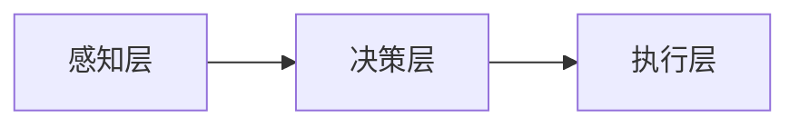

# AI Agent在企业可持续发展目标追踪中的应用

> 关键词：AI Agent、企业可持续发展目标、目标追踪、智能决策、数据分析

> 摘要：本文聚焦于AI Agent在企业可持续发展目标追踪中的应用。首先介绍了相关背景，包括目的、预期读者等。接着阐述了AI Agent和企业可持续发展目标的核心概念及联系，详细讲解了其核心算法原理与操作步骤，通过数学模型和公式进行深入分析并举例说明。通过项目实战展示了代码实现和解读，探讨了实际应用场景。同时推荐了学习资源、开发工具框架和相关论文著作。最后总结了未来发展趋势与挑战，并提供了常见问题解答和扩展阅读参考资料，旨在为企业利用AI Agent有效追踪可持续发展目标提供全面的技术指导和理论支持。

## 1. 背景介绍 
### 1.1 目的和范围
随着全球对可持续发展的关注度不断提高，企业面临着在经济、社会和环境方面实现可持续发展的压力和机遇。企业需要设定明确的可持续发展目标，并对其执行情况进行有效追踪。本文章的目的在于探讨如何利用AI Agent技术来实现企业可持续发展目标的高效追踪。范围涵盖了AI Agent的基本原理、在目标追踪中的应用方法、实际案例分析以及相关工具和资源的推荐等方面。

### 1.2 预期读者
本文的预期读者包括企业管理人员、可持续发展专家、IT技术人员、数据分析师以及对企业可持续发展和AI技术应用感兴趣的研究人员。企业管理人员可以从中了解如何利用AI Agent提升企业可持续发展目标的管理效率；可持续发展专家能够获取新的技术手段来完善目标追踪体系；IT技术人员和数据分析师可以学习到具体的技术实现方法；研究人员则可以获得相关的理论和实践参考。

### 1.3 文档结构概述
本文将按照以下结构展开：首先介绍核心概念与联系，明确AI Agent和企业可持续发展目标的定义和相互关系；接着讲解核心算法原理和具体操作步骤，通过Python代码详细阐述；然后介绍数学模型和公式，并举例说明；通过项目实战展示代码实现和详细解释；探讨实际应用场景；推荐相关的工具和资源；最后总结未来发展趋势与挑战，提供常见问题解答和扩展阅读参考资料。

### 1.4 术语表
#### 1.4.1 核心术语定义
- **AI Agent**：是一种能够感知环境、自主决策并采取行动以实现特定目标的智能实体。它可以通过学习和适应不断优化自身的行为。
- **企业可持续发展目标**：企业为了实现经济、社会和环境的协调发展而设定的一系列具体目标，如减少碳排放、提高员工福利、促进社区发展等。
- **目标追踪**：对企业可持续发展目标的执行情况进行实时监测、评估和分析，以便及时发现问题并采取相应的措施。

#### 1.4.2 相关概念解释
- **智能决策**：AI Agent根据感知到的环境信息和自身的目标，运用一定的算法和模型进行推理和判断，从而做出最优的决策。
- **数据挖掘**：从大量的数据中提取有价值的信息和知识，为AI Agent的决策提供支持。
- **机器学习**：让计算机通过数据学习模式和规律，从而实现对未知数据的预测和决策。

#### 1.4.3 缩略词列表
- **AI**：Artificial Intelligence（人工智能）
- **ML**：Machine Learning（机器学习）
- **SDGs**：Sustainable Development Goals（可持续发展目标）

## 2. 核心概念与联系 
### 2.1 AI Agent的原理和架构
AI Agent的基本原理是基于感知、决策和行动的循环过程。它通过传感器感知环境信息，将这些信息输入到决策模块，决策模块根据预设的目标和算法进行推理和判断，生成相应的行动指令，最后通过执行器将行动指令转化为实际行动。

AI Agent的架构可以分为三个主要部分：感知层、决策层和执行层。感知层负责收集环境信息，如数据传感器、摄像头等；决策层是AI Agent的核心，它包含了各种算法和模型，用于处理感知到的信息并做出决策；执行层则负责将决策层生成的指令转化为实际行动，如控制设备、发送通知等。

以下是AI Agent架构的文本示意图：

```plaintext
+-------------------+
|     感知层        |
| （数据收集）      |
+-------------------+
        |
        v
+-------------------+
|     决策层        |
| （算法和模型）    |
+-------------------+
        |
        v
+-------------------+
|     执行层        |
| （行动执行）      |
+-------------------+
```

以下是对应的Mermaid流程图：



### 2.2 企业可持续发展目标的构成
企业可持续发展目标通常包括经济、社会和环境三个维度。经济维度的目标可能包括提高企业的盈利能力、降低成本等；社会维度的目标可能涉及员工福利、社区发展、供应链社会责任等；环境维度的目标则包括减少碳排放、节约能源、保护自然资源等。

这些目标相互关联、相互影响，共同构成了企业可持续发展的整体框架。例如，降低碳排放不仅有助于环境保护，还可能通过提高能源效率降低企业的运营成本，从而对经济维度产生积极影响。

### 2.3 AI Agent与企业可持续发展目标的联系
AI Agent可以在企业可持续发展目标追踪中发挥重要作用。通过感知层收集与可持续发展目标相关的数据，如能源消耗数据、员工满意度调查结果等，决策层可以对这些数据进行分析和处理，判断目标的执行情况，并根据分析结果生成相应的行动指令。执行层则可以将这些指令转化为实际行动，如调整生产计划、优化能源管理系统等，从而实现对可持续发展目标的有效追踪和管理。

## 3. 核心算法原理 & 具体操作步骤 
### 3.1 核心算法原理
在AI Agent用于企业可持续发展目标追踪中，常用的算法包括机器学习算法和优化算法。以下以监督学习算法中的线性回归为例进行详细阐述。

线性回归是一种用于建立自变量和因变量之间线性关系的算法。在企业可持续发展目标追踪中，我们可以将某些影响因素作为自变量，将可持续发展目标的指标作为因变量，通过线性回归模型来预测目标的完成情况。

线性回归的数学模型可以表示为：

$$y = \theta_0 + \theta_1x_1 + \theta_2x_2 + \cdots + \theta_nx_n + \epsilon$$

其中，$y$ 是因变量，$x_1, x_2, \cdots, x_n$ 是自变量，$\theta_0, \theta_1, \cdots, \theta_n$ 是模型的参数，$\epsilon$ 是误差项。

我们的目标是通过最小化误差项的平方和来估计模型的参数 $\theta$，即最小化以下损失函数：

$$J(\theta) = \frac{1}{2m}\sum_{i=1}^{m}(h_{\theta}(x^{(i)}) - y^{(i)})^2$$

其中，$m$ 是样本数量，$h_{\theta}(x^{(i)})$ 是模型对第 $i$ 个样本的预测值，$y^{(i)}$ 是第 $i$ 个样本的真实值。

### 3.2 具体操作步骤
以下是使用Python实现线性回归算法进行企业可持续发展目标追踪的具体步骤和代码示例：

```python
import numpy as np
from sklearn.linear_model import LinearRegression
from sklearn.model_selection import train_test_split
from sklearn.metrics import mean_squared_error

# 步骤1：准备数据
# 假设我们有一些影响企业可持续发展目标的因素数据 X 和目标指标数据 y
X = np.array([[1, 2], [2, 4], [3, 6], [4, 8]])  # 自变量数据
y = np.array([3, 6, 9, 12])  # 因变量数据

# 步骤2：划分训练集和测试集
X_train, X_test, y_train, y_test = train_test_split(X, y, test_size=0.2, random_state=42)

# 步骤3：创建线性回归模型
model = LinearRegression()

# 步骤4：训练模型
model.fit(X_train, y_train)

# 步骤5：进行预测
y_pred = model.predict(X_test)

# 步骤6：评估模型
mse = mean_squared_error(y_test, y_pred)
print(f"均方误差: {mse}")

# 步骤7：查看模型参数
print(f"截距: {model.intercept_}")
print(f"系数: {model.coef_}")
```

### 3.3 代码解释
1. **数据准备**：我们使用 `numpy` 数组模拟了一些影响企业可持续发展目标的因素数据 `X` 和目标指标数据 `y`。
2. **划分训练集和测试集**：使用 `sklearn.model_selection` 中的 `train_test_split` 函数将数据划分为训练集和测试集，其中测试集占比为 20%。
3. **创建线性回归模型**：使用 `sklearn.linear_model` 中的 `LinearRegression` 类创建线性回归模型。
4. **训练模型**：调用模型的 `fit` 方法，将训练集数据输入模型进行训练。
5. **进行预测**：使用训练好的模型对测试集数据进行预测，得到预测结果 `y_pred`。
6. **评估模型**：使用 `sklearn.metrics` 中的 `mean_squared_error` 函数计算预测结果和真实值之间的均方误差，评估模型的性能。
7. **查看模型参数**：通过模型的 `intercept_` 属性和 `coef_` 属性查看模型的截距和系数。

## 4. 数学模型和公式 & 详细讲解 & 举例说明 
### 4.1 线性回归模型的详细讲解
线性回归模型是一种简单而有效的预测模型，它假设自变量和因变量之间存在线性关系。在企业可持续发展目标追踪中，我们可以使用线性回归模型来分析某些因素对可持续发展目标的影响程度，并进行预测。

例如，假设我们想要预测企业的碳排放目标完成情况，我们可以选择一些与碳排放相关的因素作为自变量，如能源消耗、生产规模等。通过收集历史数据，我们可以使用线性回归模型来建立这些因素与碳排放之间的关系。

### 4.2 最小二乘法原理
最小二乘法是求解线性回归模型参数的常用方法。其基本思想是通过最小化误差项的平方和来估计模型的参数。具体来说，我们要找到一组参数 $\theta$，使得损失函数 $J(\theta)$ 最小。

对损失函数 $J(\theta)$ 求偏导数，并令其等于 0，我们可以得到正规方程：

$$\theta = (X^TX)^{-1}X^Ty$$

其中，$X$ 是自变量矩阵，$y$ 是因变量向量。

### 4.3 举例说明
假设我们有以下数据：

| 能源消耗（吨标准煤） | 生产规模（万元） | 碳排放（吨） |
| --- | --- | --- |
| 100 | 500 | 200 |
| 200 | 1000 | 400 |
| 300 | 1500 | 600 |

我们可以将能源消耗和生产规模作为自变量 $x_1$ 和 $x_2$，碳排放作为因变量 $y$。使用线性回归模型，我们可以得到以下方程：

$$y = \theta_0 + \theta_1x_1 + \theta_2x_2$$

通过最小二乘法求解参数 $\theta_0, \theta_1, \theta_2$，我们可以得到具体的线性回归方程。假设求解结果为 $\theta_0 = 0, \theta_1 = 2, \theta_2 = 0$，则方程为：

$$y = 2x_1$$

这意味着碳排放与能源消耗成正比，能源消耗每增加 1 吨标准煤，碳排放增加 2 吨。

## 5. 项目实战：代码实际案例和详细解释说明 
### 5.1  开发环境搭建
#### 5.1.1 安装Python
首先，我们需要安装Python环境。可以从Python官方网站（https://www.python.org/downloads/）下载适合自己操作系统的Python版本，并按照安装向导进行安装。

#### 5.1.2 安装必要的库
在项目中，我们需要使用 `numpy`、`pandas`、`scikit-learn` 等库。可以使用以下命令进行安装：

```bash
pip install numpy pandas scikit-learn
```

### 5.2  源代码详细实现和代码解读
以下是一个完整的项目实战代码示例，用于使用线性回归模型追踪企业可持续发展目标中的能源消耗目标：

```python
import numpy as np
import pandas as pd
from sklearn.linear_model import LinearRegression
from sklearn.model_selection import train_test_split
from sklearn.metrics import mean_squared_error
import matplotlib.pyplot as plt

# 步骤1：加载数据
data = pd.read_csv('energy_consumption.csv')  # 假设数据存储在 energy_consumption.csv 文件中
X = data[['production_scale', 'number_of_employees']].values  # 自变量：生产规模和员工数量
y = data['energy_consumption'].values  # 因变量：能源消耗

# 步骤2：划分训练集和测试集
X_train, X_test, y_train, y_test = train_test_split(X, y, test_size=0.2, random_state=42)

# 步骤3：创建线性回归模型
model = LinearRegression()

# 步骤4：训练模型
model.fit(X_train, y_train)

# 步骤5：进行预测
y_pred = model.predict(X_test)

# 步骤6：评估模型
mse = mean_squared_error(y_test, y_pred)
print(f"均方误差: {mse}")

# 步骤7：可视化结果
plt.scatter(y_test, y_pred)
plt.xlabel('实际能源消耗')
plt.ylabel('预测能源消耗')
plt.title('实际能源消耗 vs 预测能源消耗')
plt.show()
```

### 5.3  代码解读与分析
1. **数据加载**：使用 `pandas` 库的 `read_csv` 函数加载存储在 `energy_consumption.csv` 文件中的数据。将生产规模和员工数量作为自变量 `X`，能源消耗作为因变量 `y`。
2. **划分训练集和测试集**：使用 `train_test_split` 函数将数据划分为训练集和测试集，测试集占比为 20%。
3. **创建线性回归模型**：使用 `LinearRegression` 类创建线性回归模型。
4. **训练模型**：调用模型的 `fit` 方法，将训练集数据输入模型进行训练。
5. **进行预测**：使用训练好的模型对测试集数据进行预测，得到预测结果 `y_pred`。
6. **评估模型**：使用 `mean_squared_error` 函数计算预测结果和真实值之间的均方误差，评估模型的性能。
7. **可视化结果**：使用 `matplotlib` 库绘制散点图，将实际能源消耗和预测能源消耗进行对比，直观地展示模型的预测效果。

## 6. 实际应用场景 
### 6.1 能源管理
AI Agent可以实时监测企业的能源消耗情况，通过分析历史数据和当前生产情况，预测能源需求，并根据预测结果优化能源分配和使用。例如，在能源价格较低的时段增加能源消耗，在能源价格较高的时段减少能源消耗，从而降低企业的能源成本，同时实现节能减排的目标。

### 6.2 供应链管理
在供应链中，AI Agent可以追踪供应商的可持续发展表现，如供应商的环境管理、社会责任等方面。通过收集和分析供应商的数据，AI Agent可以评估供应商的风险，并根据评估结果选择合适的供应商，促进整个供应链的可持续发展。

### 6.3 员工福利管理
AI Agent可以收集员工的反馈信息，如工作满意度、健康状况等，通过分析这些信息，了解员工的需求和问题，并及时采取措施加以解决。例如，根据员工的工作负荷和健康状况，合理安排工作任务和休息时间，提高员工的工作效率和福利水平。

### 6.4 环境影响评估
AI Agent可以对企业的生产活动对环境的影响进行实时监测和评估，如碳排放、废水排放等。通过建立环境影响模型，AI Agent可以预测企业的环境影响趋势，并提出相应的改进措施，帮助企业降低环境风险，实现可持续发展。

## 7. 工具和资源推荐
### 7.1 学习资源推荐
#### 7.1.1 书籍推荐
- 《Python机器学习》：介绍了Python在机器学习领域的应用，包括各种机器学习算法的原理和实现。
- 《人工智能：一种现代的方法》：全面介绍了人工智能的基本概念、算法和应用，是人工智能领域的经典教材。
- 《可持续发展报告指南》：提供了企业可持续发展报告的编写方法和标准，有助于企业了解可持续发展目标的设定和追踪。

#### 7.1.2 在线课程
- Coursera上的“机器学习”课程：由斯坦福大学教授Andrew Ng主讲，是机器学习领域的经典课程。
- edX上的“人工智能基础”课程：介绍了人工智能的基本概念、算法和应用，适合初学者学习。
- Udemy上的“Python数据科学实战”课程：通过实际项目介绍了Python在数据科学领域的应用。

#### 7.1.3 技术博客和网站
- Medium：上面有很多关于AI和可持续发展的技术文章和案例分享。
- Towards Data Science：专注于数据科学和机器学习领域的技术博客，提供了很多实用的技术教程和案例。
- Sustainable Brands：关注企业可持续发展的网站，提供了很多关于企业可持续发展的最新动态和案例分析。

### 7.2 开发工具框架推荐
#### 7.2.1 IDE和编辑器
- PyCharm：是一款专业的Python集成开发环境，提供了丰富的代码编辑、调试和测试功能。
- Jupyter Notebook：是一种交互式的开发环境，适合进行数据分析和机器学习实验。
- Visual Studio Code：是一款轻量级的代码编辑器，支持多种编程语言，并且有丰富的插件扩展功能。

#### 7.2.2 调试和性能分析工具
- TensorBoard：是TensorFlow提供的可视化工具，可以用于调试和分析深度学习模型的训练过程。
- Py-Spy：是一个Python性能分析工具，可以实时监测Python程序的CPU和内存使用情况。
- cProfile：是Python内置的性能分析模块，可以用于分析Python程序的函数调用时间和次数。

#### 7.2.3 相关框架和库
- TensorFlow：是一个开源的深度学习框架，提供了丰富的深度学习算法和工具。
- PyTorch：是另一个流行的深度学习框架，具有动态图和易于使用的特点。
- Scikit-learn：是一个用于机器学习的Python库，提供了各种机器学习算法和工具，如分类、回归、聚类等。

### 7.3 相关论文著作推荐
#### 7.3.1 经典论文
- “A Unified Approach to Interpreting Model Predictions”：提出了一种统一的方法来解释机器学习模型的预测结果，有助于理解模型的决策过程。
- “Deep Learning”：是深度学习领域的经典综述论文，介绍了深度学习的基本概念、算法和应用。
- “The Lean Startup”：提出了精益创业的理念，强调快速迭代和验证商业模式，对企业的可持续发展具有重要的指导意义。

#### 7.3.2 最新研究成果
- 关注顶级学术会议如NeurIPS、ICML、KDD等上发表的关于AI和可持续发展的研究论文，了解最新的研究动态和技术进展。
- 查阅相关学术期刊如Journal of Artificial Intelligence Research、Journal of Sustainable Development等上的研究成果。

#### 7.3.3 应用案例分析
- 一些国际组织如联合国环境规划署（UNEP）、世界可持续发展工商理事会（WBCSD）等发布的企业可持续发展案例报告，提供了很多实际应用案例和经验分享。
- 一些知名企业如谷歌、苹果、微软等发布的可持续发展报告，展示了它们在可持续发展方面的实践和成果。

## 8. 总结：未来发展趋势与挑战
### 8.1 未来发展趋势
- **智能化程度不断提高**：AI Agent将具备更强的自主学习和决策能力，能够更加准确地感知环境变化，做出更加合理的决策，从而实现对企业可持续发展目标的更高效追踪。
- **与其他技术深度融合**：AI Agent将与物联网、大数据、区块链等技术深度融合，实现数据的实时共享和交互，为企业可持续发展提供更全面、准确的信息支持。
- **应用范围不断扩大**：除了现有的能源管理、供应链管理等领域，AI Agent将在更多的企业业务领域得到应用，如市场营销、产品研发等，为企业的可持续发展提供更广泛的支持。

### 8.2 挑战
- **数据质量和安全问题**：AI Agent的决策依赖于大量的数据，数据的质量和安全直接影响到决策的准确性和可靠性。因此，企业需要加强数据管理，确保数据的质量和安全。
- **算法可解释性问题**：一些复杂的AI算法如深度学习算法，其决策过程往往难以解释。在企业可持续发展目标追踪中，需要算法具有可解释性，以便企业管理人员能够理解和信任算法的决策结果。
- **人才短缺问题**：AI Agent技术的应用需要具备专业知识和技能的人才，如AI算法工程师、数据分析师等。目前，相关领域的人才短缺是企业面临的一个重要挑战。

## 9. 附录：常见问题与解答
### 9.1 AI Agent在企业可持续发展目标追踪中的准确性如何保证？
保证AI Agent在企业可持续发展目标追踪中的准确性需要从多个方面入手。首先，要确保数据的质量，包括数据的准确性、完整性和一致性。可以通过数据清洗、预处理等方法来提高数据质量。其次，选择合适的算法和模型，并进行充分的训练和优化。可以使用交叉验证、模型评估等方法来选择最优的模型。最后，要对AI Agent的决策结果进行实时监测和评估，及时发现问题并进行调整。

### 9.2 AI Agent的应用成本高吗？
AI Agent的应用成本取决于多个因素，如数据采集设备的成本、算法开发和维护的成本、硬件设施的成本等。对于一些大型企业来说，由于其数据规模较大，可能需要投入较多的成本来建立和维护AI Agent系统。但对于一些小型企业来说，可以选择使用一些开源的AI框架和工具，降低应用成本。同时，随着技术的不断发展和普及，AI Agent的应用成本也在逐渐降低。

### 9.3 如何让企业员工接受和使用AI Agent？
让企业员工接受和使用AI Agent需要进行有效的培训和沟通。首先，要向员工介绍AI Agent的功能和优势，让他们了解AI Agent可以帮助他们提高工作效率和质量。其次，要为员工提供相关的培训课程，让他们掌握AI Agent的使用方法和技巧。最后，要建立良好的反馈机制，及时了解员工在使用过程中遇到的问题和建议，并进行改进和优化。

## 10. 扩展阅读 & 参考资料
- 《人工智能时代的企业转型》
- 《可持续发展的商业模式创新》
- 相关学术期刊如《人工智能学报》、《可持续发展研究》等
- 企业可持续发展报告和案例分析报告

作者：AI天才研究院/AI Genius Institute & 禅与计算机程序设计艺术 /Zen And The Art of Computer Programming