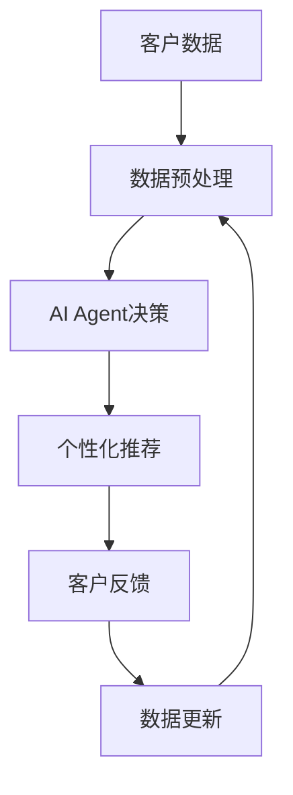

# AI Agent在企业客户体验个性化推荐中的角色

> 关键词：AI Agent、企业客户体验、个性化推荐、智能决策、客户行为分析

> 摘要：本文深入探讨了AI Agent在企业客户体验个性化推荐中的角色。首先介绍了相关背景知识，包括目的范围、预期读者等。接着阐述了核心概念及联系，分析了AI Agent用于个性化推荐的核心算法原理和具体操作步骤，并给出了相应的数学模型和公式。通过项目实战案例详细展示了代码实现和解读。探讨了AI Agent在实际应用场景中的作用，同时推荐了相关的学习资源、开发工具框架以及论文著作。最后总结了未来发展趋势与挑战，并提供了常见问题解答和扩展阅读参考资料，旨在为企业更好地利用AI Agent提升客户体验个性化推荐水平提供全面的技术指导。

## 1. 背景介绍 
### 1.1 目的和范围
在当今竞争激烈的商业环境中，企业越来越重视客户体验，而个性化推荐是提升客户体验的关键手段之一。AI Agent作为一种智能程序，能够模拟人类的行为和决策过程，在企业客户体验个性化推荐中发挥着重要作用。本文的目的是深入分析AI Agent在企业客户体验个性化推荐中的角色，探讨其工作原理、算法实现、实际应用等方面的内容。范围涵盖了AI Agent的基本概念、相关算法、数学模型，以及在不同行业的实际应用案例，同时提供了学习和开发相关技术的资源和工具推荐。

### 1.2 预期读者
本文的预期读者包括企业的技术管理人员、数据分析师、AI开发人员、市场营销人员等。对于技术人员，本文提供了详细的算法原理和代码实现，有助于他们深入理解和应用AI Agent进行个性化推荐系统的开发；对于企业管理人员和市场营销人员，本文从业务角度阐述了AI Agent在提升客户体验方面的作用和应用场景，帮助他们更好地制定营销策略和提升客户满意度。

### 1.3 文档结构概述
本文首先介绍了相关背景知识，包括目的范围、预期读者和文档结构。接着阐述了AI Agent和企业客户体验个性化推荐的核心概念及联系，并给出了相应的文本示意图和Mermaid流程图。然后详细分析了AI Agent用于个性化推荐的核心算法原理和具体操作步骤，同时给出了数学模型和公式，并通过具体例子进行说明。通过项目实战案例，展示了开发环境搭建、源代码实现和代码解读。探讨了AI Agent在实际应用场景中的作用，推荐了学习资源、开发工具框架和相关论文著作。最后总结了未来发展趋势与挑战，提供了常见问题解答和扩展阅读参考资料。

### 1.4 术语表
#### 1.4.1 核心术语定义
- **AI Agent**：一种能够感知环境、做出决策并采取行动以实现特定目标的智能程序。它可以根据输入的信息进行分析和推理，自主地选择合适的策略和行动。
- **企业客户体验**：指客户在与企业进行交互的整个过程中所感受到的各种体验，包括产品或服务的质量、购买流程的便捷性、客户服务的满意度等。
- **个性化推荐**：根据客户的个人特征、历史行为、偏好等信息，为客户提供个性化的产品或服务推荐，以提高客户的购买意愿和满意度。

#### 1.4.2 相关概念解释
- **智能决策**：AI Agent根据感知到的环境信息和自身的目标，运用一定的算法和策略做出最优决策的过程。
- **客户行为分析**：对客户在与企业交互过程中的各种行为数据进行收集、整理和分析，以了解客户的需求、偏好和行为模式。

#### 1.4.3 缩略词列表
- **AI**：Artificial Intelligence，人工智能
- **ML**：Machine Learning，机器学习
- **DL**：Deep Learning，深度学习

## 2. 核心概念与联系 

### 核心概念原理
#### AI Agent原理
AI Agent的核心原理是基于感知、决策和行动的循环过程。它通过传感器感知环境信息，将这些信息输入到决策模块中。决策模块根据预设的目标和规则，运用算法进行分析和推理，做出最优决策。最后，执行器根据决策结果采取相应的行动。例如，在企业客户体验个性化推荐中，AI Agent可以感知客户的浏览历史、购买记录等信息，通过分析这些信息为客户推荐合适的产品或服务。

#### 企业客户体验个性化推荐原理
企业客户体验个性化推荐的原理是基于客户的个性化特征和需求，通过数据分析和机器学习算法，为客户提供符合其兴趣和偏好的推荐。首先，收集客户的各种数据，包括个人信息、历史行为数据等。然后，对这些数据进行清洗和预处理，提取有价值的特征。接着，使用机器学习模型对客户进行分类和预测，了解客户的需求和偏好。最后，根据预测结果为客户推荐合适的产品或服务。

### 架构的文本示意图
```plaintext
              +----------------+
              |   客户数据    |
              +----------------+
                     |
                     v
              +----------------+
              |  数据预处理   |
              +----------------+
                     |
                     v
              +----------------+
              |  AI Agent决策  |
              +----------------+
                     |
                     v
              +----------------+
              |  个性化推荐   |
              +----------------+
                     |
                     v
              +----------------+
              |  客户反馈     |
              +----------------+
                     |
                     v
              +----------------+
              |  数据更新     |
              +----------------+
```

### Mermaid流程图


## 3. 核心算法原理 & 具体操作步骤 

### 核心算法原理
#### 协同过滤算法
协同过滤算法是一种常用的个性化推荐算法，它基于用户之间的相似性或物品之间的相似性进行推荐。分为用户协同过滤和物品协同过滤两种。

用户协同过滤的原理是：找到与目标用户兴趣相似的其他用户，然后将这些相似用户喜欢的物品推荐给目标用户。具体步骤如下：
1. 计算用户之间的相似度，常用的相似度计算方法有皮尔逊相关系数、余弦相似度等。
2. 找出与目标用户最相似的K个用户。
3. 根据这K个用户对物品的评分，预测目标用户对未评分物品的评分。
4. 根据预测评分，为目标用户推荐评分较高的物品。

物品协同过滤的原理是：找到与目标物品相似的其他物品，然后将这些相似物品推荐给喜欢目标物品的用户。具体步骤与用户协同过滤类似，只是计算的是物品之间的相似度。

#### 深度学习算法
深度学习算法在个性化推荐中也有广泛应用，例如使用神经网络对用户的特征进行建模和预测。以多层感知机（MLP）为例，其原理是：将用户的特征向量输入到神经网络中，通过多层神经元的非线性变换，输出用户对物品的评分预测。

### 具体操作步骤（以用户协同过滤为例）
```python
import numpy as np

# 定义用户-物品评分矩阵
ratings = np.array([
    [5, 3, 0, 1],
    [4, 0, 0, 1],
    [1, 1, 0, 5],
    [1, 0, 0, 4],
    [0, 1, 5, 4]
])

# 计算用户之间的余弦相似度
def cosine_similarity(user1, user2):
    dot_product = np.dot(user1, user2)
    norm_user1 = np.linalg.norm(user1)
    norm_user2 = np.linalg.norm(user2)
    if norm_user1 == 0 or norm_user2 == 0:
        return 0
    return dot_product / (norm_user1 * norm_user2)

# 计算所有用户之间的相似度矩阵
num_users = ratings.shape[0]
similarity_matrix = np.zeros((num_users, num_users))
for i in range(num_users):
    for j in range(num_users):
        similarity_matrix[i][j] = cosine_similarity(ratings[i], ratings[j])

# 找到与目标用户最相似的K个用户
target_user = 0
K = 2
similar_users = np.argsort(similarity_matrix[target_user])[::-1][1:K+1]

# 预测目标用户对未评分物品的评分
num_items = ratings.shape[1]
predictions = np.zeros(num_items)
for item in range(num_items):
    if ratings[target_user][item] == 0:
        numerator = 0
        denominator = 0
        for similar_user in similar_users:
            if ratings[similar_user][item]!= 0:
                numerator += similarity_matrix[target_user][similar_user] * ratings[similar_user][item]
                denominator += similarity_matrix[target_user][similar_user]
        if denominator!= 0:
            predictions[item] = numerator / denominator

# 为目标用户推荐评分较高的物品
recommended_items = np.argsort(predictions)[::-1]
print("为用户 {} 推荐的物品：{}".format(target_user, recommended_items))
```

### 代码解释
1. **定义用户-物品评分矩阵**：使用`numpy`数组`ratings`表示用户对物品的评分，其中0表示未评分。
2. **计算用户之间的余弦相似度**：定义`cosine_similarity`函数，通过计算向量的点积和范数来计算余弦相似度。
3. **计算相似度矩阵**：遍历所有用户，计算任意两个用户之间的相似度，存储在`similarity_matrix`中。
4. **找到最相似的K个用户**：使用`np.argsort`函数对相似度矩阵进行排序，找到与目标用户最相似的K个用户。
5. **预测目标用户对未评分物品的评分**：对于目标用户未评分的物品，根据相似用户的评分进行预测。
6. **推荐评分较高的物品**：对预测评分进行排序，推荐评分较高的物品。

## 4. 数学模型和公式 & 详细讲解 & 举例说明 

### 协同过滤算法数学模型
#### 余弦相似度公式
余弦相似度用于计算两个向量之间的相似度，公式如下：
$$
\text{sim}(u, v) = \frac{\mathbf{r}_u \cdot \mathbf{r}_v}{\|\mathbf{r}_u\| \|\mathbf{r}_v\|}
$$
其中，$\mathbf{r}_u$和$\mathbf{r}_v$分别表示用户$u$和用户$v$的评分向量，$\cdot$表示向量的点积，$\|\cdot\|$表示向量的范数。

#### 评分预测公式
预测用户$u$对物品$i$的评分$\hat{r}_{ui}$的公式如下：
$$
\hat{r}_{ui} = \frac{\sum_{v \in N(u, K)} \text{sim}(u, v) \cdot r_{vi}}{\sum_{v \in N(u, K)} \text{sim}(u, v)}
$$
其中，$N(u, K)$表示与用户$u$最相似的$K$个用户集合，$r_{vi}$表示用户$v$对物品$i$的评分。

### 举例说明
假设有3个用户$u_1$、$u_2$、$u_3$，对4个物品$i_1$、$i_2$、$i_3$、$i_4$的评分矩阵如下：
$$
\begin{bmatrix}
5 & 3 & 0 & 1 \\
4 & 0 & 0 & 1 \\
1 & 1 & 0 & 5
\end{bmatrix}
$$
计算用户$u_1$和用户$u_2$的余弦相似度：
$$
\mathbf{r}_{u_1} = [5, 3, 0, 1]
$$
$$
\mathbf{r}_{u_2} = [4, 0, 0, 1]
$$
$$
\mathbf{r}_{u_1} \cdot \mathbf{r}_{u_2} = 5 \times 4 + 3 \times 0 + 0 \times 0 + 1 \times 1 = 21
$$
$$
\|\mathbf{r}_{u_1}\| = \sqrt{5^2 + 3^2 + 0^2 + 1^2} = \sqrt{35}
$$
$$
\|\mathbf{r}_{u_2}\| = \sqrt{4^2 + 0^2 + 0^2 + 1^2} = \sqrt{17}
$$
$$
\text{sim}(u_1, u_2) = \frac{21}{\sqrt{35} \times \sqrt{17}} \approx 0.85
$$

假设要预测用户$u_1$对物品$i_3$的评分，找到与用户$u_1$最相似的2个用户（这里假设是$u_2$和$u_3$），用户$u_2$和$u_3$对物品$i_3$的评分都为0，所以预测评分也为0。

## 5. 项目实战：代码实际案例和详细解释说明 

### 5.1  开发环境搭建
#### 操作系统
推荐使用Linux系统，如Ubuntu 18.04或更高版本，也可以使用Windows 10或macOS。

#### 编程语言
使用Python 3.7或更高版本，Python具有丰富的科学计算和机器学习库，适合开发个性化推荐系统。

#### 开发工具
推荐使用Anaconda作为Python环境管理工具，它可以方便地安装和管理各种Python库。同时，可以使用Jupyter Notebook进行代码的编写和调试，它提供了交互式的开发环境，方便查看代码运行结果。

#### 安装必要的库
在Anaconda环境中，使用以下命令安装必要的库：
```bash
pip install numpy pandas scikit-learn tensorflow
```

### 5.2  源代码详细实现和代码解读
```python
import pandas as pd
from sklearn.model_selection import train_test_split
from sklearn.metrics.pairwise import cosine_similarity
from sklearn.preprocessing import StandardScaler

# 加载数据集
data = pd.read_csv('customer_ratings.csv')

# 数据预处理
# 提取用户ID、物品ID和评分
user_ids = data['user_id'].unique()
item_ids = data['item_id'].unique()
user_id_mapping = {id: i for i, id in enumerate(user_ids)}
item_id_mapping = {id: i for i, id in enumerate(item_ids)}
data['user_index'] = data['user_id'].map(user_id_mapping)
data['item_index'] = data['item_id'].map(item_id_mapping)

# 创建用户-物品评分矩阵
num_users = len(user_ids)
num_items = len(item_ids)
ratings_matrix = np.zeros((num_users, num_items))
for row in data.itertuples():
    ratings_matrix[row.user_index][row.item_index] = row.rating

# 划分训练集和测试集
train_matrix, test_matrix = train_test_split(ratings_matrix, test_size=0.2, random_state=42)

# 计算用户之间的相似度矩阵
user_similarity = cosine_similarity(train_matrix)

# 预测评分
def predict_ratings(ratings_matrix, similarity_matrix):
    num_users, num_items = ratings_matrix.shape
    predictions = np.zeros((num_users, num_items))
    for user in range(num_users):
        for item in range(num_items):
            if ratings_matrix[user][item] == 0:
                numerator = 0
                denominator = 0
                for other_user in range(num_users):
                    if ratings_matrix[other_user][item]!= 0:
                        numerator += similarity_matrix[user][other_user] * ratings_matrix[other_user][item]
                        denominator += similarity_matrix[user][other_user]
                if denominator!= 0:
                    predictions[user][item] = numerator / denominator
    return predictions

# 进行预测
predictions = predict_ratings(train_matrix, user_similarity)

# 评估模型
from sklearn.metrics import mean_squared_error
test_ratings = test_matrix[test_matrix!= 0]
predicted_ratings = predictions[test_matrix!= 0]
mse = mean_squared_error(test_ratings, predicted_ratings)
print("均方误差 (MSE):", mse)
```

### 5.3  代码解读与分析
1. **加载数据集**：使用`pandas`库的`read_csv`函数加载包含用户评分信息的CSV文件。
2. **数据预处理**：
    - 提取用户ID和物品ID，并为每个用户和物品分配一个唯一的索引。
    - 创建用户-物品评分矩阵，将用户的评分信息填充到矩阵中。
3. **划分训练集和测试集**：使用`sklearn`库的`train_test_split`函数将评分矩阵划分为训练集和测试集，比例为8:2。
4. **计算用户之间的相似度矩阵**：使用`sklearn`库的`cosine_similarity`函数计算训练集中用户之间的余弦相似度矩阵。
5. **预测评分**：定义`predict_ratings`函数，根据相似度矩阵和训练集评分矩阵预测用户对未评分物品的评分。
6. **评估模型**：使用`sklearn`库的`mean_squared_error`函数计算预测评分和测试集评分之间的均方误差（MSE），评估模型的性能。

## 6. 实际应用场景 
### 电商行业
在电商平台上，AI Agent可以根据用户的浏览历史、购买记录、搜索关键词等信息，为用户提供个性化的商品推荐。例如，当用户浏览某一款电子产品时，AI Agent可以推荐相关的配件、同类型的其他产品等。同时，AI Agent还可以根据用户的购买习惯和偏好，为用户提供个性化的促销活动和优惠券，提高用户的购买转化率。

### 金融行业
在金融领域，AI Agent可以为客户提供个性化的金融产品推荐。例如，根据客户的资产状况、风险承受能力、投资目标等信息，为客户推荐合适的理财产品、保险产品等。此外，AI Agent还可以根据客户的交易记录和信用状况，为客户提供个性化的贷款额度和利率，提高客户的满意度和忠诚度。

### 娱乐行业
在娱乐行业，AI Agent可以根据用户的观看历史、收藏记录、评分信息等，为用户提供个性化的影视、音乐、游戏等推荐。例如，视频平台可以根据用户的观看偏好，为用户推荐相似类型的电影、电视剧；音乐平台可以根据用户的听歌习惯，为用户推荐喜欢的歌手和歌曲。

### 旅游行业
在旅游行业，AI Agent可以根据用户的旅游历史、目的地偏好、预算等信息，为用户提供个性化的旅游套餐和景点推荐。例如，当用户搜索某个旅游目的地时，AI Agent可以推荐该目的地的热门景点、特色美食、酒店住宿等信息，帮助用户规划个性化的旅游行程。

## 7. 工具和资源推荐
### 7.1 学习资源推荐
#### 7.1.1 书籍推荐
- 《机器学习》（周志华）：全面介绍了机器学习的基本概念、算法和应用，是学习机器学习的经典教材。
- 《深度学习》（Ian Goodfellow、Yoshua Bengio和Aaron Courville）：详细介绍了深度学习的原理、模型和算法，适合深入学习深度学习的读者。
- 《推荐系统实践》（项亮）：结合实际案例，介绍了推荐系统的各种算法和实现方法，对开发个性化推荐系统有很大的帮助。

#### 7.1.2 在线课程
- Coursera上的“机器学习”课程（Andrew Ng教授）：是一门非常经典的机器学习课程，涵盖了机器学习的基本概念、算法和应用。
- edX上的“深度学习微硕士项目”：由多个知名高校联合推出，提供了深度学习的系统学习课程。
- 网易云课堂上的“推荐系统实战”课程：结合实际项目，介绍了推荐系统的开发流程和算法实现。

#### 7.1.3 技术博客和网站
- Medium：上面有很多关于AI、机器学习和推荐系统的技术文章和案例分享。
- Kaggle：是一个数据科学竞赛平台，上面有很多关于推荐系统的数据集和竞赛项目，可以学习到其他选手的优秀解决方案。
- 博客园：有很多国内开发者分享的技术文章和经验总结，对学习和实践有很大的帮助。

### 7.2 开发工具框架推荐
#### 7.2.1 IDE和编辑器
- PyCharm：是一款专业的Python集成开发环境，提供了丰富的代码编辑、调试和项目管理功能。
- Jupyter Notebook：是一个交互式的开发环境，适合进行数据探索、模型训练和结果展示。
- Visual Studio Code：是一款轻量级的代码编辑器，支持多种编程语言和插件扩展，适合快速开发和调试。

#### 7.2.2 调试和性能分析工具
- TensorBoard：是TensorFlow提供的可视化工具，可以用于查看模型的训练过程、损失函数变化等信息。
- Py-Spy：是一个用于分析Python代码性能的工具，可以找出代码中的性能瓶颈。
- Memory Profiler：可以用于分析Python代码的内存使用情况，帮助优化代码的内存占用。

#### 7.2.3 相关框架和库
- TensorFlow：是一个开源的深度学习框架，提供了丰富的深度学习模型和工具，适合开发复杂的推荐系统。
- PyTorch：是另一个流行的深度学习框架，具有简洁的API和高效的计算性能，也广泛应用于推荐系统的开发。
- Scikit-learn：是一个简单易用的机器学习库，提供了各种机器学习算法和工具，适合快速开发和验证推荐系统的模型。

### 7.3 相关论文著作推荐
#### 7.3.1 经典论文
- “Item-Based Collaborative Filtering Recommendation Algorithms”：介绍了物品协同过滤算法的原理和实现方法，是协同过滤算法领域的经典论文。
- “Matrix Factorization Techniques for Recommender Systems”：提出了矩阵分解技术在推荐系统中的应用，为解决推荐系统中的数据稀疏性问题提供了有效的方法。
- “Deep Neural Networks for YouTube Recommendations”：介绍了YouTube使用深度学习模型进行视频推荐的方法和经验，对开发大规模推荐系统有很大的启发。

#### 7.3.2 最新研究成果
- 可以关注ACM SIGKDD、NeurIPS、ICML等顶级学术会议上关于推荐系统的最新研究成果，了解推荐系统领域的前沿技术和发展趋势。
- 一些知名学术期刊，如Journal of Artificial Intelligence Research、ACM Transactions on Information Systems等，也会发表推荐系统相关的高质量研究论文。

#### 7.3.3 应用案例分析
- 可以参考一些企业的技术博客，如Google、Amazon、Netflix等公司的技术博客，了解他们在实际应用中使用推荐系统的经验和案例。
- 一些行业报告和研究机构的分析报告，也会提供推荐系统在不同行业的应用案例和数据分析。

## 8. 总结：未来发展趋势与挑战
### 未来发展趋势
#### 多模态数据融合
未来的个性化推荐系统将不仅仅依赖于文本、数值等单一类型的数据，还会融合图像、音频、视频等多模态数据。例如，在电商平台上，除了根据用户的文字描述和购买记录进行推荐外，还可以根据用户上传的图片识别用户喜欢的商品风格，提供更精准的推荐。

#### 强化学习的应用
强化学习可以让AI Agent在与环境的交互中不断学习和优化策略，从而实现更智能的决策。在个性化推荐中，强化学习可以用于动态调整推荐策略，根据用户的实时反馈和行为变化，及时调整推荐内容，提高推荐的效果和用户满意度。

#### 联邦学习与隐私保护
随着数据隐私问题的日益受到关注，联邦学习将成为个性化推荐系统的一个重要发展方向。联邦学习允许在不共享原始数据的情况下进行模型训练，保护用户的隐私。通过联邦学习，企业可以在多个数据源之间进行协作，提高推荐模型的准确性和泛化能力。

### 挑战
#### 数据质量和数量
个性化推荐系统需要大量高质量的数据来训练模型，但在实际应用中，数据往往存在噪声、缺失值等问题，影响模型的性能。同时，获取足够的数据也面临着成本和隐私等方面的挑战。

#### 模型可解释性
深度学习模型在个性化推荐中取得了很好的效果，但这些模型往往是黑盒模型，难以解释其决策过程和结果。在一些对解释性要求较高的场景中，如金融、医疗等领域，模型的可解释性成为了一个重要的挑战。

#### 实时性要求
在一些实时性要求较高的应用场景中，如实时广告推荐、实时新闻推荐等，需要AI Agent能够快速做出决策并提供推荐。如何在保证推荐准确性的前提下，提高系统的实时性是一个需要解决的问题。

## 9. 附录：常见问题与解答
### 问题1：AI Agent在个性化推荐中需要哪些数据？
AI Agent在个性化推荐中需要多种类型的数据，包括用户的个人信息（如年龄、性别、职业等）、历史行为数据（如浏览记录、购买记录、评分记录等）、上下文信息（如时间、地点等）。这些数据可以帮助AI Agent更好地了解用户的需求和偏好，从而提供更精准的推荐。

### 问题2：如何评估个性化推荐系统的性能？
常用的评估指标包括准确率、召回率、F1值、均方误差（MSE）、平均绝对误差（MAE）等。准确率和召回率用于评估推荐系统推荐的相关性，F1值是准确率和召回率的调和平均值。MSE和MAE用于评估预测评分和实际评分之间的误差。此外，还可以通过用户反馈、点击率、转化率等业务指标来评估推荐系统的实际效果。

### 问题3：AI Agent在个性化推荐中会侵犯用户隐私吗？
如果AI Agent在数据收集、存储和使用过程中遵循严格的隐私保护政策和法规，采取合适的技术手段（如数据加密、匿名化处理等），可以有效保护用户的隐私。同时，企业应该向用户明确告知数据的使用目的和方式，获得用户的授权和同意。

### 问题4：如何选择合适的个性化推荐算法？
选择合适的个性化推荐算法需要考虑多个因素，如数据的特点（数据量、数据稀疏性等）、业务需求（实时性要求、推荐准确性要求等）、算法的复杂度和可解释性等。对于数据量较小、数据稀疏性较高的场景，可以选择协同过滤算法；对于数据量较大、需要处理复杂特征的场景，可以选择深度学习算法。

## 10. 扩展阅读 & 参考资料
### 扩展阅读
- 《人工智能：现代方法》（Stuart Russell和Peter Norvig）：全面介绍了人工智能的基本概念、算法和应用，对深入理解AI Agent的原理和技术有很大的帮助。
- 《大数据时代》（维克托·迈尔 - 舍恩伯格和肯尼斯·库克耶）：探讨了大数据在各个领域的应用和影响，为了解个性化推荐系统的数据驱动原理提供了宏观的视角。

### 参考资料
- ACM SIGKDD官方网站：https://www.kdd.org/
- NeurIPS官方网站：https://neurips.cc/
- ICML官方网站：https://icml.cc/

作者：AI天才研究院/AI Genius Institute & 禅与计算机程序设计艺术 /Zen And The Art of Computer Programming