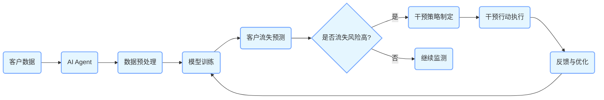

# AI Agent在企业客户流失预警与干预中的应用

> 关键词：AI Agent、企业客户流失预警、客户流失干预、机器学习、数据分析

> 摘要：本文深入探讨了AI Agent在企业客户流失预警与干预中的应用。首先介绍了相关背景知识，包括目的、预期读者、文档结构和术语表。接着阐述了AI Agent、客户流失预警和干预的核心概念及它们之间的联系，并给出了相应的文本示意图和Mermaid流程图。详细讲解了核心算法原理和具体操作步骤，使用Python源代码进行说明。同时介绍了相关的数学模型和公式，并举例说明。通过项目实战，展示了代码实际案例并进行详细解释。分析了AI Agent在企业客户流失预警与干预中的实际应用场景，推荐了学习资源、开发工具框架和相关论文著作。最后总结了未来发展趋势与挑战，提供了常见问题解答和扩展阅读及参考资料。

## 1. 背景介绍 
### 1.1 目的和范围
在当今竞争激烈的商业环境中，企业面临着客户流失的严峻挑战。客户流失不仅意味着直接的收入损失，还可能影响企业的声誉和市场份额。因此，准确地预警客户流失并及时进行干预，对于企业的生存和发展至关重要。

本文的目的是探讨AI Agent在企业客户流失预警与干预中的应用，详细介绍相关的技术原理、算法、实际案例以及应用场景。范围涵盖了从数据收集、分析到模型建立、预警和干预的整个流程，旨在为企业提供全面的技术指导和实践参考。

### 1.2 预期读者
本文的预期读者包括企业的管理人员、市场营销人员、数据分析人员、人工智能开发者以及对客户流失预警和AI Agent应用感兴趣的技术爱好者。对于企业管理人员和市场营销人员，本文可以帮助他们了解如何利用AI Agent来提升客户保留率；对于数据分析人员和人工智能开发者，本文提供了具体的技术实现细节和代码示例。

### 1.3 文档结构概述
本文将按照以下结构进行组织：
- 核心概念与联系：介绍AI Agent、客户流失预警和干预的核心概念，以及它们之间的关系，并给出相应的示意图和流程图。
- 核心算法原理 & 具体操作步骤：详细讲解用于客户流失预警的核心算法，如逻辑回归、决策树等，并给出Python源代码实现。
- 数学模型和公式 & 详细讲解 & 举例说明：介绍相关的数学模型和公式，如损失函数、评估指标等，并通过具体例子进行说明。
- 项目实战：代码实际案例和详细解释说明：通过一个实际的项目案例，展示如何使用AI Agent进行客户流失预警和干预，包括开发环境搭建、源代码实现和代码解读。
- 实际应用场景：分析AI Agent在不同行业和业务场景中的应用。
- 工具和资源推荐：推荐学习资源、开发工具框架和相关论文著作。
- 总结：未来发展趋势与挑战：总结AI Agent在企业客户流失预警与干预中的应用现状，分析未来发展趋势和面临的挑战。
- 附录：常见问题与解答：提供常见问题的解答。
- 扩展阅读 & 参考资料：提供扩展阅读的建议和参考资料列表。

### 1.4 术语表
#### 1.4.1 核心术语定义
- **AI Agent**：人工智能代理，是一种能够感知环境、自主决策并采取行动的智能实体。在本文中，AI Agent用于客户流失预警和干预，通过分析客户数据来预测客户流失的可能性，并采取相应的干预措施。
- **客户流失预警**：通过对客户数据的分析，提前预测客户可能流失的情况，以便企业及时采取措施进行干预。
- **客户流失干预**：当预测到客户可能流失时，企业采取的一系列措施，如提供优惠活动、个性化服务等，以挽留客户。
- **机器学习**：一门多领域交叉学科，涉及概率论、统计学、逼近论、凸分析、算法复杂度理论等多门学科。它专门研究计算机怎样模拟或实现人类的学习行为，以获取新的知识或技能，重新组织已有的知识结构使之不断改善自身的性能。
- **数据分析**：指用适当的统计分析方法对收集来的大量数据进行分析，提取有用信息和形成结论而对数据加以详细研究和概括总结的过程。

#### 1.4.2 相关概念解释
- **特征工程**：指对原始数据进行预处理和转换，提取有价值的特征，以便机器学习模型能够更好地学习和预测。
- **模型评估**：使用评估指标（如准确率、召回率、F1值等）来评估机器学习模型的性能，以选择最优的模型。
- **数据挖掘**：从大量的数据中通过算法搜索隐藏于其中信息的过程。数据挖掘通常与计算机科学有关，并通过统计、在线分析处理、情报检索、机器学习、专家系统（依靠过去的经验法则）和模式识别等诸多方法来实现上述目标。

#### 1.4.3 缩略词列表
- **AI**：Artificial Intelligence，人工智能
- **ML**：Machine Learning，机器学习
- **LR**：Logistic Regression，逻辑回归
- **DT**：Decision Tree，决策树
- **RF**：Random Forest，随机森林

## 2. 核心概念与联系 

### 核心概念原理
#### AI Agent
AI Agent是一种基于人工智能技术的智能实体，它能够感知环境信息，根据预设的目标和规则进行决策，并采取相应的行动。在企业客户流失预警与干预的场景中，AI Agent的主要功能包括：
- **数据感知**：收集和整合企业的客户数据，如客户基本信息、交易记录、服务反馈等。
- **数据分析**：运用机器学习和数据分析技术，对客户数据进行挖掘和分析，以发现客户流失的潜在模式和特征。
- **决策制定**：根据数据分析的结果，预测客户流失的可能性，并制定相应的干预策略。
- **行动执行**：将制定好的干预策略付诸实践，如向可能流失的客户发送个性化的营销信息、提供优惠活动等。

#### 客户流失预警
客户流失预警是指企业通过对客户数据的分析和监测，提前发现客户可能流失的迹象，并发出预警信号。其原理是基于机器学习和数据分析技术，建立客户流失预测模型。该模型通过对历史客户数据的学习，找出与客户流失相关的特征和规律，然后利用这些特征和规律对当前客户进行预测，判断其是否有流失的风险。

#### 客户流失干预
客户流失干预是指企业在收到客户流失预警信号后，采取一系列措施来挽留客户。干预措施的制定需要根据客户流失的原因和客户的个性化需求来进行。常见的干预措施包括：
- **个性化营销**：根据客户的偏好和购买历史，为客户提供个性化的产品推荐和营销信息。
- **优惠活动**：为可能流失的客户提供折扣、赠品等优惠活动，以提高客户的忠诚度。
- **优质服务**：加强与客户的沟通和互动，及时解决客户的问题和投诉，提供优质的服务体验。

### 架构的文本示意图
```plaintext
客户数据（基本信息、交易记录、服务反馈等） -> AI Agent
AI Agent
|-- 数据预处理（清洗、特征提取、特征选择）
|-- 模型训练（逻辑回归、决策树、随机森林等）
|-- 客户流失预测
|-- 干预策略制定
|-- 干预行动执行
|-- 反馈与优化
```

### Mermaid流程图


## 3. 核心算法原理 & 具体操作步骤 

### 逻辑回归算法原理
逻辑回归是一种常用的分类算法，用于预测二分类问题，如客户是否会流失。它的基本原理是通过对输入特征进行线性组合，然后将线性组合的结果通过逻辑函数（sigmoid函数）映射到[0, 1]区间，得到一个概率值。根据这个概率值，可以判断客户是否有流失的风险。

逻辑回归的数学模型可以表示为：
$$P(y=1|x)=\frac{1}{1 + e^{-(w_0 + w_1x_1 + w_2x_2 + \cdots + w_nx_n)}}$$
其中，$P(y=1|x)$ 表示在输入特征 $x=(x_1, x_2, \cdots, x_n)$ 的条件下，客户流失（$y = 1$）的概率；$w_0, w_1, w_2, \cdots, w_n$ 是模型的参数。

### 具体操作步骤
#### 步骤1：数据收集与预处理
收集企业的客户数据，并进行清洗、特征提取和特征选择。以下是一个简单的Python代码示例：
```python
import pandas as pd
from sklearn.preprocessing import StandardScaler
from sklearn.model_selection import train_test_split

# 读取数据
data = pd.read_csv('customer_data.csv')

# 分离特征和标签
X = data.drop('Churn', axis=1)
y = data['Churn']

# 数据标准化
scaler = StandardScaler()
X_scaled = scaler.fit_transform(X)

# 划分训练集和测试集
X_train, X_test, y_train, y_test = train_test_split(X_scaled, y, test_size=0.2, random_state=42)
```

#### 步骤2：模型训练
使用逻辑回归模型对训练数据进行训练。以下是Python代码示例：
```python
from sklearn.linear_model import LogisticRegression

# 创建逻辑回归模型
model = LogisticRegression()

# 训练模型
model.fit(X_train, y_train)
```

#### 步骤3：模型预测
使用训练好的模型对测试数据进行预测。以下是Python代码示例：
```python
# 预测
y_pred = model.predict(X_test)
```

#### 步骤4：模型评估
使用评估指标（如准确率、召回率、F1值等）对模型的性能进行评估。以下是Python代码示例：
```python
from sklearn.metrics import accuracy_score, recall_score, f1_score

# 计算准确率
accuracy = accuracy_score(y_test, y_pred)

# 计算召回率
recall = recall_score(y_test, y_pred)

# 计算F1值
f1 = f1_score(y_test, y_pred)

print(f"Accuracy: {accuracy}")
print(f"Recall: {recall}")
print(f"F1 Score: {f1}")
```

### 决策树算法原理
决策树是一种基于树结构进行决策的分类算法。它通过对输入特征进行递归划分，构建一个决策树模型。每个内部节点表示一个特征上的测试，每个分支表示测试输出，每个叶节点表示一个类别。决策树的构建过程是一个贪心算法，通过选择最优的特征和划分点，使得划分后的子集尽可能地纯净。

### 具体操作步骤
#### 步骤1：数据收集与预处理
与逻辑回归相同，这里不再赘述。

#### 步骤2：模型训练
使用决策树模型对训练数据进行训练。以下是Python代码示例：
```python
from sklearn.tree import DecisionTreeClassifier

# 创建决策树模型
model = DecisionTreeClassifier()

# 训练模型
model.fit(X_train, y_train)
```

#### 步骤3：模型预测
使用训练好的模型对测试数据进行预测。以下是Python代码示例：
```python
# 预测
y_pred = model.predict(X_test)
```

#### 步骤4：模型评估
使用评估指标（如准确率、召回率、F1值等）对模型的性能进行评估。以下是Python代码示例：
```python
from sklearn.metrics import accuracy_score, recall_score, f1_score

# 计算准确率
accuracy = accuracy_score(y_test, y_pred)

# 计算召回率
recall = recall_score(y_test, y_pred)

# 计算F1值
f1 = f1_score(y_test, y_pred)

print(f"Accuracy: {accuracy}")
print(f"Recall: {recall}")
print(f"F1 Score: {f1}")
```

## 4. 数学模型和公式 & 详细讲解 & 举例说明 

### 逻辑回归损失函数
逻辑回归的损失函数通常使用对数损失函数（Log Loss），也称为交叉熵损失函数。对数损失函数的公式为：
$$L(y, \hat{y}) = - \frac{1}{N} \sum_{i=1}^{N} [y_i \log(\hat{y}_i) + (1 - y_i) \log(1 - \hat{y}_i)]$$
其中，$N$ 是样本数量，$y_i$ 是第 $i$ 个样本的真实标签（0 或 1），$\hat{y}_i$ 是第 $i$ 个样本的预测概率。

### 详细讲解
对数损失函数的目的是最小化模型预测的概率与真实标签之间的差异。当真实标签 $y_i = 1$ 时，损失函数变为 $- \log(\hat{y}_i)$，此时希望预测概率 $\hat{y}_i$ 尽可能接近 1；当真实标签 $y_i = 0$ 时，损失函数变为 $- \log(1 - \hat{y}_i)$，此时希望预测概率 $\hat{y}_i$ 尽可能接近 0。

### 举例说明
假设我们有 3 个样本，真实标签分别为 $y = [1, 0, 1]$，模型预测的概率分别为 $\hat{y} = [0.8, 0.2, 0.6]$。则对数损失函数的值为：
$$L(y, \hat{y}) = - \frac{1}{3} [1 \times \log(0.8) + (1 - 1) \times \log(1 - 0.8) + 0 \times \log(0.2) + (1 - 0) \times \log(1 - 0.2) + 1 \times \log(0.6) + (1 - 1) \times \log(1 - 0.6)]$$
```python
import numpy as np

y = np.array([1, 0, 1])
y_pred = np.array([0.8, 0.2, 0.6])

loss = -np.mean(y * np.log(y_pred) + (1 - y) * np.log(1 - y_pred))
print(f"Log Loss: {loss}")
```

### 决策树信息增益
决策树的构建过程中，通常使用信息增益来选择最优的特征和划分点。信息增益的计算公式为：
$$IG(D, A) = H(D) - H(D|A)$$
其中，$IG(D, A)$ 表示特征 $A$ 对数据集 $D$ 的信息增益，$H(D)$ 表示数据集 $D$ 的信息熵，$H(D|A)$ 表示在特征 $A$ 的条件下，数据集 $D$ 的条件熵。

### 详细讲解
信息熵是衡量数据集不确定性的指标，其计算公式为：
$$H(D) = - \sum_{k=1}^{K} p_k \log_2(p_k)$$
其中，$K$ 是类别数量，$p_k$ 是第 $k$ 个类别的样本比例。

条件熵是在给定特征 $A$ 的条件下，数据集 $D$ 的不确定性，其计算公式为：
$$H(D|A) = \sum_{i=1}^{V} \frac{|D_i|}{|D|} H(D_i)$$
其中，$V$ 是特征 $A$ 的取值数量，$D_i$ 是特征 $A$ 取值为第 $i$ 个值的样本子集，$|D_i|$ 是子集 $D_i$ 的样本数量，$|D|$ 是数据集 $D$ 的样本数量。

信息增益越大，说明使用特征 $A$ 进行划分后，数据集的不确定性减少得越多，因此选择信息增益最大的特征作为划分特征。

### 举例说明
假设我们有一个数据集 $D$，包含 10 个样本，其中正类样本有 6 个，负类样本有 4 个。我们有一个特征 $A$，其取值有两个：$A_1$ 和 $A_2$。在特征 $A$ 取值为 $A_1$ 的样本子集中，正类样本有 3 个，负类样本有 1 个；在特征 $A$ 取值为 $A_2$ 的样本子集中，正类样本有 3 个，负类样本有 3 个。

首先计算数据集 $D$ 的信息熵：
$$H(D) = - \frac{6}{10} \log_2(\frac{6}{10}) - \frac{4}{10} \log_2(\frac{4}{10}) \approx 0.971$$

然后计算特征 $A$ 的条件熵：
$$H(D|A) = \frac{4}{10} \left(- \frac{3}{4} \log_2(\frac{3}{4}) - \frac{1}{4} \log_2(\frac{1}{4})\right) + \frac{6}{10} \left(- \frac{3}{6} \log_2(\frac{3}{6}) - \frac{3}{6} \log_2(\frac{3}{6})\right) \approx 0.871$$

最后计算信息增益：
$$IG(D, A) = H(D) - H(D|A) \approx 0.971 - 0.871 = 0.1$$

```python
import numpy as np

# 数据集 D 的信息熵
p1 = 6 / 10
p2 = 4 / 10
H_D = -p1 * np.log2(p1) - p2 * np.log2(p2)

# 特征 A 的条件熵
p1_A1 = 3 / 4
p2_A1 = 1 / 4
H_D_A1 = -p1_A1 * np.log2(p1_A1) - p2_A1 * np.log2(p2_A1)

p1_A2 = 3 / 6
p2_A2 = 3 / 6
H_D_A2 = -p1_A2 * np.log2(p1_A2) - p2_A2 * np.log2(p2_A2)

H_D_A = (4 / 10) * H_D_A1 + (6 / 10) * H_D_A2

# 信息增益
IG = H_D - H_D_A
print(f"Information Gain: {IG}")
```

## 5. 项目实战：代码实际案例和详细解释说明 

### 5.1  开发环境搭建
#### 操作系统
建议使用 Linux 或 macOS 操作系统，也可以使用 Windows 操作系统。

#### Python 环境
安装 Python 3.7 及以上版本。可以从 Python 官方网站（https://www.python.org/downloads/） 下载并安装。

#### 第三方库
安装以下第三方库：
- `pandas`：用于数据处理和分析。
- `numpy`：用于数值计算。
- `scikit-learn`：用于机器学习模型的构建和评估。
- `matplotlib`：用于数据可视化。

可以使用以下命令安装这些库：
```sh
pip install pandas numpy scikit-learn matplotlib
```

### 5.2  源代码详细实现和代码解读
#### 数据加载与预处理
```python
import pandas as pd
from sklearn.preprocessing import StandardScaler
from sklearn.model_selection import train_test_split

# 读取数据
data = pd.read_csv('customer_data.csv')

# 分离特征和标签
X = data.drop('Churn', axis=1)
y = data['Churn']

# 数据标准化
scaler = StandardScaler()
X_scaled = scaler.fit_transform(X)

# 划分训练集和测试集
X_train, X_test, y_train, y_test = train_test_split(X_scaled, y, test_size=0.2, random_state=42)
```
代码解读：
- `pd.read_csv('customer_data.csv')`：读取客户数据文件。
- `data.drop('Churn', axis=1)`：删除目标列 `Churn`，得到特征矩阵 $X$。
- `data['Churn']`：提取目标列 `Churn`，得到标签向量 $y$。
- `StandardScaler()`：创建数据标准化对象。
- `scaler.fit_transform(X)`：对特征矩阵 $X$ 进行标准化处理。
- `train_test_split(X_scaled, y, test_size=0.2, random_state=42)`：将数据集划分为训练集和测试集，测试集占比为 20%。

#### 模型训练与评估
```python
from sklearn.linear_model import LogisticRegression
from sklearn.metrics import accuracy_score, recall_score, f1_score

# 创建逻辑回归模型
model = LogisticRegression()

# 训练模型
model.fit(X_train, y_train)

# 预测
y_pred = model.predict(X_test)

# 计算准确率
accuracy = accuracy_score(y_test, y_pred)

# 计算召回率
recall = recall_score(y_test, y_pred)

# 计算F1值
f1 = f1_score(y_test, y_pred)

print(f"Accuracy: {accuracy}")
print(f"Recall: {recall}")
print(f"F1 Score: {f1}")
```
代码解读：
- `LogisticRegression()`：创建逻辑回归模型对象。
- `model.fit(X_train, y_train)`：使用训练集数据对模型进行训练。
- `model.predict(X_test)`：使用训练好的模型对测试集数据进行预测。
- `accuracy_score(y_test, y_pred)`：计算模型的准确率。
- `recall_score(y_test, y_pred)`：计算模型的召回率。
- `f1_score(y_test, y_pred)`：计算模型的 F1 值。

#### 客户流失预警与干预模拟
```python
# 预测客户流失概率
y_pred_proba = model.predict_proba(X_test)[:, 1]

# 设定预警阈值
threshold = 0.7

# 找出可能流失的客户
churn_risk_customers = X_test[y_pred_proba > threshold]

# 模拟干预措施：给可能流失的客户发送优惠券
print(f"Number of customers at risk of churn: {len(churn_risk_customers)}")
print("Sending coupons to customers at risk of churn...")
```
代码解读：
- `model.predict_proba(X_test)[:, 1]`：预测每个客户流失的概率。
- `threshold = 0.7`：设定预警阈值为 0.7。
- `X_test[y_pred_proba > threshold]`：找出流失概率大于 0.7 的客户。
- 模拟给可能流失的客户发送优惠券的干预措施。

### 5.3  代码解读与分析
#### 数据预处理
数据预处理是机器学习项目中非常重要的一步，它可以提高模型的性能和稳定性。在本项目中，我们使用了数据标准化方法，将特征矩阵的每个特征缩放到均值为 0，标准差为 1 的范围。这样可以避免某些特征因为数值范围过大而对模型产生过大的影响。

#### 模型选择与训练
我们选择了逻辑回归模型进行客户流失预测。逻辑回归是一种简单而有效的分类算法，适用于二分类问题。在训练模型时，我们使用了训练集数据，通过最小化损失函数来学习模型的参数。

#### 模型评估
我们使用了准确率、召回率和 F1 值三个评估指标来评估模型的性能。准确率表示模型预测正确的样本占总样本的比例；召回率表示模型正确预测为正类的样本占实际正类样本的比例；F1 值是准确率和召回率的调和平均值，综合考虑了模型的准确性和召回能力。

#### 客户流失预警与干预
通过预测客户流失的概率，我们可以设定一个预警阈值，找出可能流失的客户。然后，我们可以采取相应的干预措施，如发送优惠券、提供个性化服务等，来挽留这些客户。

## 6. 实际应用场景 
### 电信行业
在电信行业，客户流失是一个普遍存在的问题。电信运营商可以使用 AI Agent 对客户的通话记录、流量使用情况、缴费记录等数据进行分析，预测客户流失的可能性。对于可能流失的客户，运营商可以及时采取措施，如提供套餐优惠、赠送流量等，以提高客户的忠诚度。

### 金融行业
金融机构可以使用 AI Agent 对客户的交易记录、信用评分、账户余额等数据进行分析，预警客户流失的风险。对于高风险客户，金融机构可以提供个性化的理财产品推荐、专属服务等，以增强客户的粘性。

### 电商行业
电商平台可以使用 AI Agent 对客户的浏览记录、购买历史、评价信息等数据进行分析，预测客户流失的概率。对于可能流失的客户，电商平台可以发送个性化的营销邮件、优惠券等，以吸引客户再次购买。

### 酒店行业
酒店可以使用 AI Agent 对客户的预订记录、入住历史、消费情况等数据进行分析，预警客户流失的情况。对于可能流失的客户，酒店可以提供会员专属优惠、免费升级房间等服务，以提高客户的满意度和忠诚度。

## 7. 工具和资源推荐
### 7.1 学习资源推荐
#### 7.1.1 书籍推荐
- 《机器学习》（周志华著）：这是一本经典的机器学习教材，全面介绍了机器学习的基本概念、算法和应用。
- 《Python机器学习基础教程》（Andreas C. Müller, Sarah Guido 著）：本书以Python为工具，详细介绍了机器学习的基本算法和实践应用。
- 《深度学习》（Ian Goodfellow、Yoshua Bengio和Aaron Courville著）：深度学习领域的权威著作，深入介绍了深度学习的理论和实践。

#### 7.1.2 在线课程
- Coursera上的“机器学习”课程（Andrew Ng教授主讲）：这是一门非常受欢迎的机器学习课程，涵盖了机器学习的基本概念、算法和应用。
- edX上的“数据科学与机器学习微硕士项目”：该项目提供了系统的数据科学和机器学习课程，适合想要深入学习的学习者。
- 网易云课堂上的“人工智能基础课程”：该课程从基础知识入手，逐步介绍人工智能的各个方面。

#### 7.1.3 技术博客和网站
- Medium：一个技术博客平台，有很多关于人工智能和机器学习的优质文章。
- Kaggle：一个数据科学竞赛平台，提供了大量的数据集和开源代码，可以学习到很多实际应用的经验。
- 机器之心：专注于人工智能领域的资讯和技术分享网站。

### 7.2 开发工具框架推荐
#### 7.2.1 IDE和编辑器
- PyCharm：一款专业的Python集成开发环境，提供了丰富的功能和插件，适合开发大型Python项目。
- Jupyter Notebook：一个交互式的开发环境，适合进行数据探索和模型实验。
- Visual Studio Code：一款轻量级的代码编辑器，支持多种编程语言，有丰富的插件可以扩展功能。

#### 7.2.2 调试和性能分析工具
- TensorBoard：一个用于可视化深度学习模型训练过程和结果的工具，由TensorFlow提供。
- Scikit-learn的模型评估工具：Scikit-learn提供了丰富的模型评估指标和工具，可以帮助开发者评估模型的性能。
- cProfile：Python的内置性能分析工具，可以帮助开发者找出代码中的性能瓶颈。

#### 7.2.3 相关框架和库
- Scikit-learn：一个简单易用的机器学习库，提供了各种机器学习算法和工具，适合初学者和快速开发。
- TensorFlow：一个开源的深度学习框架，由Google开发，广泛应用于深度学习领域。
- PyTorch：一个动态图的深度学习框架，具有简洁易用的特点，受到很多研究者的喜爱。

### 7.3 相关论文著作推荐
#### 7.3.1 经典论文
- 《A Decision-Theoretic Generalization of On-Line Learning and an Application to Boosting》（Yoav Freund, Robert E. Schapire著）：介绍了Boosting算法的理论基础。
- 《ImageNet Classification with Deep Convolutional Neural Networks》（Alex Krizhevsky, Ilya Sutskever, Geoffrey E. Hinton著）：提出了AlexNet，开启了深度学习在图像分类领域的热潮。
- 《Long Short-Term Memory》（Sepp Hochreiter, Jürgen Schmidhuber著）：介绍了长短期记忆网络（LSTM）的原理和应用。

#### 7.3.2 最新研究成果
- 《Attention Is All You Need》（Ashish Vaswani等人著）：提出了Transformer架构，在自然语言处理领域取得了巨大成功。
- 《Generative Adversarial Nets》（Ian J. Goodfellow等人著）：介绍了生成对抗网络（GAN）的原理和应用。
- 《BERT: Pre-training of Deep Bidirectional Transformers for Language Understanding》（Jacob Devlin等人著）：提出了BERT模型，在自然语言处理任务中取得了优异的成绩。

#### 7.3.3 应用案例分析
- 《Customer Churn Prediction in Telecom Industry Using Machine Learning Techniques》：分析了机器学习技术在电信行业客户流失预测中的应用。
- 《Predicting Customer Churn in Banking Using Machine Learning》：研究了机器学习在银行客户流失预测中的应用。
- 《Customer Churn Prediction in E-commerce Using Deep Learning》：探讨了深度学习在电商客户流失预测中的应用。

## 8. 总结：未来发展趋势与挑战
### 未来发展趋势
#### 多模态数据融合
未来，AI Agent将不仅局限于分析结构化数据，还将融合多模态数据，如图像、音频、视频等。通过综合分析多种类型的数据，可以更全面地了解客户的需求和行为，提高客户流失预警的准确性。

#### 强化学习应用
强化学习可以使AI Agent在与客户的交互过程中不断学习和优化干预策略。通过奖励机制，AI Agent可以自动调整干预措施，以达到最佳的客户挽留效果。

#### 实时预警与干预
随着数据处理技术和计算能力的不断提升，AI Agent将能够实现实时的客户流失预警和干预。及时发现客户流失的迹象，并立即采取相应的措施，将大大提高客户挽留的成功率。

#### 与其他技术的融合
AI Agent将与区块链、物联网等技术进行融合。区块链技术可以保证客户数据的安全性和可信度，物联网技术可以实时收集客户的设备使用数据，为客户流失预警和干预提供更丰富的信息。

### 挑战
#### 数据质量和隐私问题
客户数据的质量和隐私是AI Agent应用面临的重要挑战。低质量的数据可能导致模型的不准确，而数据隐私问题则可能引发客户的信任危机。企业需要加强数据管理，确保数据的质量和安全性。

#### 模型解释性问题
深度学习等复杂模型在客户流失预警中取得了较好的效果，但这些模型往往缺乏解释性。企业需要了解模型的决策依据，以便更好地制定干预策略。因此，提高模型的解释性是一个亟待解决的问题。

#### 技术人才短缺
AI Agent的开发和应用需要具备人工智能、机器学习、数据分析等多方面知识的技术人才。目前，这类人才相对短缺，企业需要加大人才培养和引进的力度。

#### 成本问题
实施AI Agent系统需要投入大量的资金和资源，包括数据收集、存储、处理和模型训练等方面。对于一些中小企业来说，成本可能是一个较大的障碍。企业需要在成本和效益之间进行权衡，选择合适的技术和方案。

## 9. 附录：常见问题与解答
### 问题1：AI Agent在客户流失预警中的准确率能达到多少？
准确率受到多种因素的影响，如数据质量、模型选择、特征工程等。一般来说，在合适的数据集和模型下，准确率可以达到70% - 90%左右。但需要注意的是，准确率并不是唯一的评估指标，还需要考虑召回率、F1值等指标。

### 问题2：如何选择合适的机器学习模型进行客户流失预警？
选择合适的模型需要考虑数据集的特点、问题的复杂度和计算资源等因素。对于简单的数据集和问题，可以选择逻辑回归、决策树等简单模型；对于复杂的数据集和问题，可以选择深度学习模型，如神经网络、卷积神经网络等。同时，可以使用交叉验证等方法对不同的模型进行评估和比较，选择最优的模型。

### 问题3：AI Agent在客户流失干预中的效果如何衡量？
可以使用客户保留率、客户满意度、收入增长等指标来衡量AI Agent在客户流失干预中的效果。客户保留率表示经过干预后，原本可能流失的客户中最终留下来的比例；客户满意度可以通过问卷调查等方式进行收集；收入增长表示干预措施对企业收入的影响。

### 问题4：实施AI Agent系统需要多长时间？
实施AI Agent系统的时间取决于项目的规模和复杂度。一般来说，小型项目可能需要几个月的时间，而大型项目可能需要一年以上的时间。实施过程包括数据收集、预处理、模型开发、测试和部署等多个阶段，每个阶段都需要一定的时间和资源。

### 问题5：AI Agent系统的维护和更新需要注意什么？
AI Agent系统的维护和更新需要注意以下几点：
- 定期检查数据质量，确保数据的准确性和完整性。
- 监控模型的性能，及时发现模型的退化问题，并进行调整和优化。
- 根据业务需求和市场变化，及时更新模型和干预策略。
- 加强系统的安全性，防止数据泄露和恶意攻击。

## 10. 扩展阅读 & 参考资料
### 扩展阅读
- 《人工智能：现代方法》（Stuart Russell, Peter Norvig著）：全面介绍了人工智能的各个领域和方法。
- 《数据挖掘：概念与技术》（Jiawei Han, Micheline Kamber, Jian Pei著）：详细介绍了数据挖掘的基本概念、算法和应用。
- 《深度学习实战》（Antoine Géron著）：通过实际案例介绍了深度学习的应用和实践。

### 参考资料
- 相关行业报告和研究论文，可以从学术数据库（如IEEE Xplore、ACM Digital Library等）和行业网站上获取。
- 开源代码库（如GitHub）上的相关项目，可以学习到其他开发者的实现思路和代码技巧。
- 各大科技公司的官方文档和博客，如Google、Microsoft、Facebook等，提供了很多关于人工智能和机器学习的最新技术和应用案例。

作者：AI天才研究院/AI Genius Institute & 禅与计算机程序设计艺术 /Zen And The Art of Computer Programming