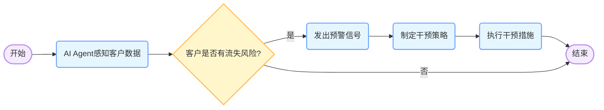

# AI Agent在企业客户流失预警与干预策略制定中的应用

> 关键词：AI Agent、企业客户流失预警、干预策略制定、客户关系管理、机器学习

> 摘要：本文深入探讨了AI Agent在企业客户流失预警与干预策略制定中的应用。首先介绍了研究的背景、目的、预期读者和文档结构等内容。接着阐述了AI Agent、客户流失预警和干预策略制定的核心概念及其联系，给出了相应的文本示意图和Mermaid流程图。详细讲解了核心算法原理，包括使用Python代码进行说明，并介绍了相关的数学模型和公式。通过项目实战部分，展示了开发环境搭建、源代码实现和代码解读。分析了AI Agent在企业客户流失预警与干预策略制定中的实际应用场景。推荐了相关的学习资源、开发工具框架和论文著作。最后总结了未来发展趋势与挑战，提供了常见问题与解答以及扩展阅读和参考资料，旨在为企业有效利用AI Agent解决客户流失问题提供全面的技术指导。

## 1. 背景介绍 
### 1.1 目的和范围
在当今竞争激烈的商业环境中，企业面临着客户流失的巨大挑战。客户流失不仅意味着直接的收入损失，还可能影响企业的品牌形象和市场份额。因此，准确地预测客户流失并及时采取有效的干预措施对于企业的生存和发展至关重要。本文章的目的是探讨如何利用AI Agent技术实现企业客户流失预警与干预策略的制定。范围涵盖了从AI Agent的基本概念和算法原理，到实际项目中的应用和开发，以及相关工具和资源的推荐等方面。

### 1.2 预期读者
本文的预期读者包括企业的管理人员、市场营销人员、客户关系管理专业人士，以及对人工智能技术在商业应用领域感兴趣的程序员、数据分析师和研究人员。这些读者可以从文章中获取关于如何利用AI Agent解决企业客户流失问题的全面知识和技术指导。

### 1.3 文档结构概述
本文将按照以下结构进行阐述：首先介绍相关的背景知识，包括目的、预期读者和文档结构等。然后详细讲解AI Agent、客户流失预警和干预策略制定的核心概念及其联系，并给出相应的示意图和流程图。接着介绍核心算法原理，使用Python代码进行详细说明，同时给出相关的数学模型和公式。通过项目实战部分，展示开发环境搭建、源代码实现和代码解读。分析AI Agent在企业客户流失预警与干预策略制定中的实际应用场景。推荐相关的学习资源、开发工具框架和论文著作。最后总结未来发展趋势与挑战，提供常见问题与解答以及扩展阅读和参考资料。

### 1.4 术语表
#### 1.4.1 核心术语定义
- **AI Agent**：人工智能代理，是一种能够感知环境、根据感知信息做出决策并采取行动的智能实体。它可以自主地执行任务，与环境进行交互，以实现特定的目标。
- **客户流失预警**：通过对客户数据的分析和挖掘，预测客户是否有流失的可能性，并在客户流失之前发出警报，以便企业采取相应的措施。
- **干预策略制定**：根据客户流失预警的结果，制定一系列针对性的措施，以降低客户流失的风险，提高客户的忠诚度和满意度。

#### 1.4.2 相关概念解释
- **客户关系管理（CRM）**：企业为了提高核心竞争力，利用相应的信息技术以及互联网技术来协调企业与顾客间在销售、营销和服务上的交互，从而提升其管理方式，向客户提供创新式的个性化的客户交互和服务的过程。
- **机器学习**：一门多领域交叉学科，涉及概率论、统计学、逼近论、凸分析、算法复杂度理论等多门学科。它专门研究计算机怎样模拟或实现人类的学习行为，以获取新的知识或技能，重新组织已有的知识结构使之不断改善自身的性能。

#### 1.4.3 缩略词列表
- **CRM**：Customer Relationship Management（客户关系管理）
- **ML**：Machine Learning（机器学习）

## 2. 核心概念与联系 
### 核心概念原理
#### AI Agent
AI Agent的核心原理基于智能决策和自主行动。它通过感知模块获取环境信息，利用决策模块对这些信息进行分析和处理，根据预设的目标和规则做出决策，最后通过行动模块执行决策。例如，在企业客户流失预警与干预策略制定中，AI Agent可以感知客户的行为数据，如购买频率、消费金额、投诉情况等，然后根据这些数据判断客户是否有流失的风险，并采取相应的干预措施。

#### 客户流失预警
客户流失预警的原理是通过对大量客户数据的分析和挖掘，建立预测模型。这些数据包括客户的基本信息、交易记录、行为数据等。预测模型可以使用机器学习算法，如逻辑回归、决策树、神经网络等，对客户流失的可能性进行评估。当模型预测某个客户有较高的流失风险时，就会发出预警信号。

#### 干预策略制定
干预策略制定的原理是根据客户流失预警的结果，结合企业的业务目标和资源，制定针对性的措施。这些措施可以包括个性化的营销活动、优惠政策、客户服务改进等。干预策略的制定需要考虑客户的特征和需求，以提高干预的效果。

### 架构的文本示意图
```plaintext
                   +----------------+
                   |  AI Agent      |
                   +----------------+
                   | 感知模块       |
                   | 决策模块       |
                   | 行动模块       |
                   +----------------+
                          |
                          v
                   +----------------+
                   | 客户数据仓库   |
                   +----------------+
                   | 基本信息       |
                   | 交易记录       |
                   | 行为数据       |
                   +----------------+
                          |
                          v
                   +----------------+
                   | 客户流失预警模型 |
                   +----------------+
                   | 机器学习算法   |
                   | 预测结果       |
                   +----------------+
                          |
                          v
                   +----------------+
                   | 干预策略制定   |
                   +----------------+
                   | 个性化措施     |
                   | 营销活动       |
                   | 优惠政策       |
                   +----------------+
```

### Mermaid流程图


## 3. 核心算法原理 & 具体操作步骤 
### 核心算法原理
在企业客户流失预警中，常用的机器学习算法有逻辑回归、决策树和神经网络等。下面以逻辑回归为例，介绍其核心算法原理。

逻辑回归是一种广义线性模型，用于处理二分类问题。在客户流失预警中，我们的目标是预测客户是否会流失，这是一个典型的二分类问题。逻辑回归的基本思想是通过一个逻辑函数将线性回归的输出映射到[0, 1]区间，从而得到一个概率值。逻辑函数的表达式为：

$$\sigma(z)=\frac{1}{1 + e^{-z}}$$

其中，$z$ 是线性回归的输出，$\sigma(z)$ 是逻辑函数的输出，表示客户流失的概率。线性回归的表达式为：

$$z = \theta_0 + \theta_1x_1 + \theta_2x_2 + \cdots + \theta_nx_n$$

其中，$\theta_0, \theta_1, \cdots, \theta_n$ 是模型的参数，$x_1, x_2, \cdots, x_n$ 是输入的特征。

### 具体操作步骤
#### 步骤1：数据准备
首先，需要收集和整理客户数据，包括客户的基本信息、交易记录、行为数据等。然后，对数据进行清洗和预处理，如处理缺失值、异常值，进行特征编码等。

#### 步骤2：特征选择
从预处理后的数据中选择与客户流失相关的特征。可以使用统计方法，如相关性分析、卡方检验等，来评估特征的重要性。

#### 步骤3：模型训练
使用选择好的特征和对应的标签（客户是否流失）来训练逻辑回归模型。可以使用Python的`scikit-learn`库来实现。

#### 步骤4：模型评估
使用测试数据对训练好的模型进行评估，计算模型的准确率、召回率、F1值等指标，以评估模型的性能。

#### 步骤5：预测和预警
使用训练好的模型对新的客户数据进行预测，得到客户流失的概率。当概率超过某个阈值时，发出预警信号。

### Python源代码示例
```python
import pandas as pd
from sklearn.model_selection import train_test_split
from sklearn.linear_model import LogisticRegression
from sklearn.metrics import accuracy_score, recall_score, f1_score

# 步骤1：数据准备
# 假设我们有一个包含客户数据的CSV文件
data = pd.read_csv('customer_data.csv')

# 处理缺失值
data = data.dropna()

# 分离特征和标签
X = data.drop('churn', axis=1)
y = data['churn']

# 步骤2：特征选择
# 这里简单地选择所有特征，实际应用中可以使用更复杂的方法
selected_features = X.columns

# 步骤3：模型训练
# 划分训练集和测试集
X_train, X_test, y_train, y_test = train_test_split(X[selected_features], y, test_size=0.2, random_state=42)

# 创建逻辑回归模型
model = LogisticRegression()

# 训练模型
model.fit(X_train, y_train)

# 步骤4：模型评估
# 预测测试集
y_pred = model.predict(X_test)

# 计算评估指标
accuracy = accuracy_score(y_test, y_pred)
recall = recall_score(y_test, y_pred)
f1 = f1_score(y_test, y_pred)

print(f'Accuracy: {accuracy}')
print(f'Recall: {recall}')
print(f'F1-score: {f1}')

# 步骤5：预测和预警
# 假设我们有一个新的客户数据
new_customer = pd.DataFrame({
    'feature1': [1],
    'feature2': [2],
    # 其他特征...
})

# 预测新客户流失的概率
churn_probability = model.predict_proba(new_customer)[:, 1]

# 设定阈值
threshold = 0.5

if churn_probability > threshold:
    print('Warning: This customer is likely to churn!')
else:
    print('This customer is unlikely to churn.')
```

## 4. 数学模型和公式 & 详细讲解 & 举例说明 
### 逻辑回归的损失函数
逻辑回归使用对数损失函数（也称为交叉熵损失函数）来衡量模型的预测结果与真实标签之间的差异。对数损失函数的表达式为：

$$J(\theta)=-\frac{1}{m}\sum_{i=1}^{m}[y^{(i)}\log(h_{\theta}(x^{(i)}))+(1 - y^{(i)})\log(1 - h_{\theta}(x^{(i)}))]$$

其中，$m$ 是样本数量，$y^{(i)}$ 是第 $i$ 个样本的真实标签，$h_{\theta}(x^{(i)})$ 是模型对第 $i$ 个样本的预测概率，$\theta$ 是模型的参数。

### 详细讲解
对数损失函数的目的是最小化模型的预测误差。当 $y^{(i)} = 1$ 时，损失函数的第一项 $y^{(i)}\log(h_{\theta}(x^{(i)}))$ 起作用，我们希望 $h_{\theta}(x^{(i)})$ 尽可能接近 1，这样 $\log(h_{\theta}(x^{(i)}))$ 就会接近 0，损失函数的值就会较小。当 $y^{(i)} = 0$ 时，损失函数的第二项 $(1 - y^{(i)})\log(1 - h_{\theta}(x^{(i)}))$ 起作用，我们希望 $h_{\theta}(x^{(i)})$ 尽可能接近 0，这样 $\log(1 - h_{\theta}(x^{(i)}))$ 就会接近 0，损失函数的值也会较小。

### 举例说明
假设我们有一个简单的数据集，包含 3 个样本：

| 特征 $x$ | 标签 $y$ |
|----------|----------|
| 1        | 1        |
| 2        | 0        |
| 3        | 1        |

我们使用逻辑回归模型进行训练，假设模型的参数 $\theta = [0.1, 0.2]$，则线性回归的输出 $z$ 为：

$$z_1 = 0.1 + 0.2\times1 = 0.3$$
$$z_2 = 0.1 + 0.2\times2 = 0.5$$
$$z_3 = 0.1 + 0.2\times3 = 0.7$$

通过逻辑函数计算预测概率：

$$h_{\theta}(x_1)=\frac{1}{1 + e^{-0.3}}\approx0.574$$
$$h_{\theta}(x_2)=\frac{1}{1 + e^{-0.5}}\approx0.622$$
$$h_{\theta}(x_3)=\frac{1}{1 + e^{-0.7}}\approx0.669$$

计算对数损失函数的值：

$$J(\theta)=-\frac{1}{3}[(1\times\log(0.574)+(1 - 1)\times\log(1 - 0.574))+(0\times\log(0.622)+(1 - 0)\times\log(1 - 0.622))+(1\times\log(0.669)+(1 - 1)\times\log(1 - 0.669))]$$

$$J(\theta)\approx-\frac{1}{3}[\log(0.574)+\log(0.378)+\log(0.669)]\approx0.65$$

在实际应用中，我们通过不断调整模型的参数 $\theta$，使得损失函数 $J(\theta)$ 最小化，从而得到最优的模型。

## 5. 项目实战：代码实际案例和详细解释说明 
### 5.1  开发环境搭建
#### 操作系统
可以选择常见的操作系统，如Windows、Linux（如Ubuntu）或macOS。

#### Python环境
安装Python 3.x版本，可以从Python官方网站（https://www.python.org/downloads/）下载并安装。

#### 依赖库安装
使用`pip`命令安装必要的依赖库，包括`pandas`、`scikit-learn`等。

```bash
pip install pandas scikit-learn
```

### 5.2  源代码详细实现和代码解读
```python
import pandas as pd
from sklearn.model_selection import train_test_split
from sklearn.linear_model import LogisticRegression
from sklearn.metrics import accuracy_score, recall_score, f1_score

# 步骤1：数据准备
# 假设我们有一个包含客户数据的CSV文件
data = pd.read_csv('customer_data.csv')

# 处理缺失值
data = data.dropna()

# 分离特征和标签
X = data.drop('churn', axis=1)
y = data['churn']

# 步骤2：特征选择
# 这里简单地选择所有特征，实际应用中可以使用更复杂的方法
selected_features = X.columns

# 步骤3：模型训练
# 划分训练集和测试集
X_train, X_test, y_train, y_test = train_test_split(X[selected_features], y, test_size=0.2, random_state=42)

# 创建逻辑回归模型
model = LogisticRegression()

# 训练模型
model.fit(X_train, y_train)

# 步骤4：模型评估
# 预测测试集
y_pred = model.predict(X_test)

# 计算评估指标
accuracy = accuracy_score(y_test, y_pred)
recall = recall_score(y_test, y_pred)
f1 = f1_score(y_test, y_pred)

print(f'Accuracy: {accuracy}')
print(f'Recall: {recall}')
print(f'F1-score: {f1}')

# 步骤5：预测和预警
# 假设我们有一个新的客户数据
new_customer = pd.DataFrame({
    'feature1': [1],
    'feature2': [2],
    # 其他特征...
})

# 预测新客户流失的概率
churn_probability = model.predict_proba(new_customer)[:, 1]

# 设定阈值
threshold = 0.5

if churn_probability > threshold:
    print('Warning: This customer is likely to churn!')
else:
    print('This customer is unlikely to churn.')
```

### 代码解读与分析
#### 数据准备部分
- `pd.read_csv('customer_data.csv')`：使用`pandas`库的`read_csv`函数读取包含客户数据的CSV文件。
- `data.dropna()`：删除数据中的缺失值。
- `X = data.drop('churn', axis=1)`：将除了`churn`（客户是否流失）列之外的所有列作为特征。
- `y = data['churn']`：将`churn`列作为标签。

#### 特征选择部分
- `selected_features = X.columns`：简单地选择所有特征，实际应用中可以使用更复杂的方法，如相关性分析、卡方检验等。

#### 模型训练部分
- `train_test_split(X[selected_features], y, test_size=0.2, random_state=42)`：使用`sklearn`库的`train_test_split`函数将数据集划分为训练集和测试集，测试集占比为20%。
- `LogisticRegression()`：创建逻辑回归模型。
- `model.fit(X_train, y_train)`：使用训练集对模型进行训练。

#### 模型评估部分
- `model.predict(X_test)`：使用训练好的模型对测试集进行预测。
- `accuracy_score(y_test, y_pred)`、`recall_score(y_test, y_pred)`、`f1_score(y_test, y_pred)`：分别计算模型的准确率、召回率和F1值。

#### 预测和预警部分
- `model.predict_proba(new_customer)[:, 1]`：使用训练好的模型对新的客户数据进行预测，得到客户流失的概率。
- `if churn_probability > threshold`：根据设定的阈值判断客户是否有流失的风险，并发出相应的预警信号。

## 6. 实际应用场景 
### 电信行业
在电信行业，客户流失是一个普遍存在的问题。电信运营商可以利用AI Agent对客户的通话记录、上网流量、套餐使用情况等数据进行分析，预测客户是否有流失的可能性。当预测到客户有流失风险时，AI Agent可以自动触发干预策略，如向客户发送个性化的优惠套餐、提供专属的客服服务等，以提高客户的满意度和忠诚度。

### 金融行业
金融行业的客户流失也会对企业造成较大的损失。银行可以利用AI Agent对客户的账户余额、交易频率、信用评级等数据进行分析，预测客户是否会关闭账户或转移资金。当发现客户有流失风险时，银行可以通过AI Agent向客户发送定制化的理财产品推荐、提供优惠的贷款利率等，以留住客户。

### 电商行业
电商平台的客户竞争激烈，客户流失问题不容忽视。电商企业可以利用AI Agent对客户的浏览记录、购买历史、评价信息等数据进行分析，预测客户是否会不再使用该平台。当预测到客户有流失风险时，AI Agent可以向客户发送个性化的促销活动、推荐相关的商品等，以提高客户的复购率。

## 7. 工具和资源推荐
### 7.1 学习资源推荐
#### 7.1.1 书籍推荐
- 《Python机器学习》：这本书详细介绍了Python在机器学习领域的应用，包括数据预处理、模型训练、评估等方面的内容，适合初学者入门。
- 《机器学习实战》：通过实际案例的方式，讲解了机器学习的各种算法和应用，帮助读者更好地理解和掌握机器学习的知识。
- 《深度学习》：由深度学习领域的三位顶级专家编写，全面介绍了深度学习的理论和实践，适合有一定基础的读者深入学习。

#### 7.1.2 在线课程
- Coursera上的“机器学习”课程：由斯坦福大学的Andrew Ng教授授课，是机器学习领域的经典课程，涵盖了机器学习的基本概念、算法和应用。
- edX上的“数据科学与机器学习微硕士”课程：提供了系统的数据分析和机器学习课程，包括Python编程、数据可视化、机器学习算法等内容。
- 阿里云天池平台的在线课程：提供了丰富的人工智能和机器学习课程，结合实际案例进行教学，帮助学员快速掌握相关技能。

#### 7.1.3 技术博客和网站
- Medium：上面有很多关于人工智能和机器学习的优秀文章，涵盖了最新的技术动态和研究成果。
- Towards Data Science：专注于数据科学和机器学习领域的技术博客，提供了很多实用的教程和案例。
- Kaggle：是一个数据科学竞赛平台，上面有很多公开的数据集和优秀的解决方案，可以学习到其他数据科学家的经验和技巧。

### 7.2 开发工具框架推荐
#### 7.2.1 IDE和编辑器
- PyCharm：是一款专门为Python开发设计的集成开发环境，提供了丰富的功能，如代码自动补全、调试、版本控制等，适合专业的Python开发者。
- Jupyter Notebook：是一个交互式的开发环境，支持Python、R等多种编程语言，适合数据探索和模型实验。
- Visual Studio Code：是一款轻量级的代码编辑器，支持多种编程语言和插件扩展，具有良好的用户体验。

#### 7.2.2 调试和性能分析工具
- PDB：Python自带的调试工具，可以帮助开发者定位代码中的问题。
- cProfile：Python的性能分析工具，可以分析代码的运行时间和函数调用情况，帮助开发者优化代码性能。
- TensorBoard：是TensorFlow的可视化工具，可以用于可视化模型的训练过程、损失函数变化等信息。

#### 7.2.3 相关框架和库
- scikit-learn：是一个简单易用的机器学习库，提供了丰富的机器学习算法和工具，如分类、回归、聚类等。
- TensorFlow：是一个开源的深度学习框架，广泛应用于图像识别、自然语言处理等领域。
- PyTorch：是另一个流行的深度学习框架，具有动态图的特点，易于使用和调试。

### 7.3 相关论文著作推荐
#### 7.3.1 经典论文
- 《A Logical Calculus of the Ideas Immanent in Nervous Activity》：由Warren McCulloch和Walter Pitts于1943年发表，提出了神经元的数学模型，为神经网络的发展奠定了基础。
- 《Learning Representations by Back-propagating Errors》：由David Rumelhart、Geoffrey Hinton和Ronald Williams于1986年发表，介绍了反向传播算法，使得神经网络的训练变得更加高效。
- 《ImageNet Classification with Deep Convolutional Neural Networks》：由Alex Krizhevsky、Ilya Sutskever和Geoffrey Hinton于2012年发表，提出了AlexNet模型，在ImageNet图像分类竞赛中取得了巨大成功，推动了深度学习在计算机视觉领域的发展。

#### 7.3.2 最新研究成果
- 关注顶级学术会议，如NeurIPS（神经信息处理系统大会）、ICML（国际机器学习会议）、CVPR（计算机视觉与模式识别会议）等，这些会议上会发布很多最新的人工智能和机器学习研究成果。
- 阅读相关的学术期刊，如Journal of Artificial Intelligence Research（JAIR）、Artificial Intelligence等，这些期刊发表了很多高质量的研究论文。

#### 7.3.3 应用案例分析
- 《AI in Business: How Artificial Intelligence is Transforming Companies Around the World》：介绍了人工智能在商业领域的应用案例，包括客户服务、市场营销、供应链管理等方面。
- 《Machine Learning for Business Analytics: Concepts, Techniques, and Applications in R》：通过实际案例讲解了机器学习在商业分析中的应用，帮助读者了解如何将机器学习技术应用到实际业务中。

## 8. 总结：未来发展趋势与挑战
### 未来发展趋势
#### 更强大的AI Agent能力
随着人工智能技术的不断发展，AI Agent将具备更强大的感知、决策和行动能力。它可以更准确地理解客户的需求和意图，提供更加个性化的服务和解决方案。

#### 多模态数据融合
未来的AI Agent将不仅仅依赖于传统的结构化数据，还会融合多模态数据，如图像、语音、视频等。通过对多模态数据的分析和处理，AI Agent可以更全面地了解客户的特征和行为，提高客户流失预警的准确性。

#### 与其他技术的融合
AI Agent将与区块链、物联网等技术进行深度融合。例如，通过区块链技术可以保证客户数据的安全性和隐私性，物联网技术可以实时获取客户的设备使用数据，为客户流失预警和干预策略制定提供更丰富的信息。

### 挑战
#### 数据质量和隐私问题
客户数据的质量直接影响到AI Agent的性能和准确性。如果数据存在缺失值、异常值或错误标注等问题，会导致模型的训练效果不佳。同时，客户数据的隐私保护也是一个重要的问题，企业需要遵守相关的法律法规，确保客户数据的安全和隐私。

#### 模型解释性和可解释性
一些复杂的机器学习模型，如神经网络，虽然在预测性能上表现出色，但缺乏解释性。在企业客户流失预警与干预策略制定中，模型的解释性非常重要，因为企业需要了解模型的决策依据，以便采取合理的干预措施。

#### 技术人才短缺
人工智能技术的发展需要大量的专业人才，包括数据科学家、机器学习工程师等。目前，市场上这类人才相对短缺，企业在招聘和培养相关人才方面面临一定的挑战。

## 9. 附录：常见问题与解答
### 问题1：如何选择合适的机器学习算法进行客户流失预警？
解答：选择合适的机器学习算法需要考虑多个因素，如数据的特点、问题的复杂度、模型的可解释性等。对于简单的二分类问题，逻辑回归是一个不错的选择，它具有较好的可解释性。对于复杂的问题，可以考虑使用决策树、随机森林、神经网络等算法。在选择算法时，可以通过交叉验证等方法比较不同算法的性能，选择性能最优的算法。

### 问题2：如何处理客户数据中的缺失值和异常值？
解答：处理缺失值的方法有多种，如删除包含缺失值的样本、使用均值、中位数或众数填充缺失值、使用机器学习算法进行预测填充等。处理异常值的方法包括删除异常值、将异常值替换为合理的值、使用鲁棒的统计方法等。具体选择哪种方法需要根据数据的特点和问题的需求来决定。

### 问题3：如何评估客户流失预警模型的性能？
解答：可以使用多种指标来评估客户流失预警模型的性能，如准确率、召回率、F1值、ROC曲线、AUC值等。准确率衡量模型预测正确的比例，召回率衡量模型正确预测出流失客户的比例，F1值是准确率和召回率的调和平均值。ROC曲线和AUC值可以综合评估模型的性能，AUC值越接近1，说明模型的性能越好。

## 10. 扩展阅读 & 参考资料
### 扩展阅读
- 《人工智能时代的商业新生态》：探讨了人工智能技术对商业领域的影响和变革，以及企业如何在人工智能时代构建新的商业生态。
- 《智能商业》：介绍了智能商业的概念和模式，以及如何利用人工智能和大数据技术实现企业的智能化转型。

### 参考资料
- 《Python数据分析实战》，作者：Tony Ojeda、Benjamin Bengfort、Rebecca Bilbro
- 《深度学习入门：基于Python的理论与实现》，作者：斋藤康毅
- 相关学术论文和研究报告，如NeurIPS、ICML、CVPR等会议的论文集

作者：AI天才研究院/AI Genius Institute & 禅与计算机程序设计艺术 /Zen And The Art of Computer Programming