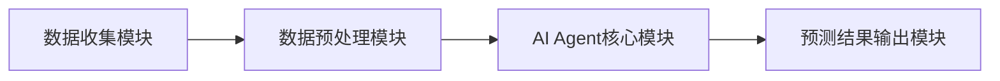

# AI Agent在企业客户生命周期价值预测中的应用

> 关键词：AI Agent、客户生命周期价值预测、企业应用、机器学习、数据分析

> 摘要：本文深入探讨了AI Agent在企业客户生命周期价值预测中的应用。首先介绍了相关背景知识，包括目的范围、预期读者等内容。接着阐述了核心概念与联系，分析了AI Agent和客户生命周期价值预测的原理和架构。详细讲解了核心算法原理和具体操作步骤，通过Python代码进行说明。同时给出了数学模型和公式，并举例解释。在项目实战部分，提供了开发环境搭建、源代码实现和解读。之后探讨了实际应用场景，推荐了相关工具和资源。最后总结了未来发展趋势与挑战，还提供了常见问题解答和扩展阅读参考资料，旨在为企业在客户生命周期价值预测中有效应用AI Agent提供全面的指导。

## 1. 背景介绍 
### 1.1 目的和范围
在当今竞争激烈的商业环境中，企业需要准确了解客户的价值，以便制定更有效的营销策略、优化资源分配和提升客户满意度。客户生命周期价值（Customer Lifetime Value，CLV）预测是企业实现这一目标的重要手段。而AI Agent作为一种智能的自动化程序，能够模拟人类的决策和行为，在数据处理、模型训练和预测等方面具有显著优势。本文的目的是探讨如何将AI Agent应用于企业客户生命周期价值预测，介绍相关的技术原理、算法和实际应用案例。范围涵盖了从基本概念的解释到具体的项目实战，以及对未来发展趋势的展望。

### 1.2 预期读者
本文预期读者包括企业的市场营销人员、数据分析师、产品经理、技术研发人员以及对人工智能和客户关系管理感兴趣的学者和爱好者。市场营销人员可以从中了解如何利用AI Agent来提高客户价值预测的准确性，从而制定更精准的营销策略；数据分析师可以学习到相关的算法和技术，提升数据分析能力；产品经理可以借鉴AI Agent在客户价值预测中的应用，优化产品设计；技术研发人员可以获取具体的代码实现和开发思路；学者和爱好者可以了解该领域的最新研究成果和发展趋势。

### 1.3 文档结构概述
本文将按照以下结构进行组织：首先介绍相关背景知识，包括目的范围、预期读者等内容；接着阐述核心概念与联系，分析AI Agent和客户生命周期价值预测的原理和架构；详细讲解核心算法原理和具体操作步骤，通过Python代码进行说明；同时给出数学模型和公式，并举例解释；在项目实战部分，提供开发环境搭建、源代码实现和解读；之后探讨实际应用场景，推荐相关工具和资源；最后总结未来发展趋势与挑战，还提供常见问题解答和扩展阅读参考资料。

### 1.4 术语表
#### 1.4.1 核心术语定义
- **AI Agent**：是一种能够感知环境、做出决策并采取行动以实现特定目标的智能程序。它可以通过学习和推理来适应不同的环境和任务。
- **客户生命周期价值（CLV）**：指的是企业从客户整个生命周期中所获得的全部收益的现值。它考虑了客户在不同阶段的购买行为、忠诚度和潜在价值。
- **机器学习（Machine Learning）**：是一门多领域交叉学科，涉及概率论、统计学、逼近论、凸分析、算法复杂度理论等多门学科。它专门研究计算机怎样模拟或实现人类的学习行为，以获取新的知识或技能，重新组织已有的知识结构使之不断改善自身的性能。
- **深度学习（Deep Learning）**：是机器学习的一个分支领域，它是一种基于对数据进行表征学习的方法。深度学习通过构建具有很多层的神经网络模型，自动从大量数据中学习特征和模式。

#### 1.4.2 相关概念解释
- **客户生命周期**：通常包括潜在客户、新客户、活跃客户、流失客户等阶段。不同阶段的客户具有不同的特征和价值。
- **预测模型**：用于根据历史数据和特征来预测未来事件或结果的数学模型。在客户生命周期价值预测中，常用的预测模型包括线性回归、逻辑回归、决策树、神经网络等。
- **数据预处理**：在进行数据分析和建模之前，对原始数据进行清洗、转换、归一化等操作，以提高数据的质量和可用性。

#### 1.4.3 缩略词列表
- **AI**：Artificial Intelligence，人工智能
- **CLV**：Customer Lifetime Value，客户生命周期价值
- **ML**：Machine Learning，机器学习
- **DL**：Deep Learning，深度学习

## 2. 核心概念与联系 
### 核心概念原理
#### AI Agent原理
AI Agent可以看作是一个具有感知、决策和行动能力的智能实体。它通过传感器感知环境信息，然后根据内部的决策机制进行推理和决策，最后通过执行器采取相应的行动。AI Agent的决策机制可以基于规则、机器学习或深度学习等方法。例如，一个基于机器学习的AI Agent可以通过学习大量的历史数据来建立预测模型，然后根据当前的环境信息进行预测和决策。

#### 客户生命周期价值预测原理
客户生命周期价值预测的核心是根据客户的历史行为数据和特征，建立预测模型来估计客户在未来一段时间内的价值。常用的方法包括基于交易数据的预测、基于行为数据的预测和基于机器学习的预测等。基于交易数据的预测主要考虑客户的购买金额、购买频率等因素；基于行为数据的预测则考虑客户的浏览行为、搜索行为等；基于机器学习的预测则通过构建复杂的模型来综合考虑各种因素。

### 架构的文本示意图
```plaintext
            +-------------------+
            |  数据收集模块     |
            +-------------------+
                     |
                     v
            +-------------------+
            |  数据预处理模块   |
            +-------------------+
                     |
                     v
            +-------------------+
            |  AI Agent核心模块  |
            +-------------------+
                     |
                     v
            +-------------------+
            |  预测结果输出模块 |
            +-------------------+
```

### Mermaid流程图


## 3. 核心算法原理 & 具体操作步骤 
### 核心算法原理
在客户生命周期价值预测中，常用的算法包括线性回归、逻辑回归、决策树、随机森林和神经网络等。这里以线性回归为例进行详细讲解。

线性回归是一种用于建立自变量和因变量之间线性关系的统计方法。假设我们有 $n$ 个样本，每个样本有 $m$ 个特征 $x_1, x_2, \cdots, x_m$ 和一个目标值 $y$。线性回归模型可以表示为：

$$y = \theta_0 + \theta_1x_1 + \theta_2x_2 + \cdots + \theta_mx_m + \epsilon$$

其中，$\theta_0, \theta_1, \cdots, \theta_m$ 是模型的参数，$\epsilon$ 是误差项。我们的目标是找到一组最优的参数 $\theta$，使得预测值 $\hat{y}$ 与真实值 $y$ 之间的误差最小。常用的误差度量方法是均方误差（Mean Squared Error，MSE）：

$$MSE = \frac{1}{n}\sum_{i=1}^{n}(y_i - \hat{y}_i)^2$$

通过最小化均方误差，我们可以得到最优的参数 $\theta$。

### 具体操作步骤
#### 步骤1：数据收集
收集客户的历史行为数据，包括购买金额、购买频率、浏览行为、搜索行为等。

#### 步骤2：数据预处理
对收集到的数据进行清洗、转换和归一化等操作，以提高数据的质量和可用性。

#### 步骤3：特征选择
选择与客户生命周期价值相关的特征，去除无关或冗余的特征。

#### 步骤4：模型训练
使用线性回归算法对数据进行训练，得到最优的参数 $\theta$。

#### 步骤5：模型评估
使用测试数据对训练好的模型进行评估，计算均方误差等指标。

#### 步骤6：预测
使用训练好的模型对新客户的生命周期价值进行预测。

### Python源代码实现
```python
import numpy as np
from sklearn.linear_model import LinearRegression
from sklearn.model_selection import train_test_split
from sklearn.metrics import mean_squared_error

# 生成示例数据
np.random.seed(0)
X = np.random.rand(100, 5)  # 100个样本，每个样本有5个特征
y = 2 * X[:, 0] + 3 * X[:, 1] + 4 * X[:, 2] + np.random.randn(100)  # 生成目标值

# 划分训练集和测试集
X_train, X_test, y_train, y_test = train_test_split(X, y, test_size=0.2, random_state=42)

# 创建线性回归模型
model = LinearRegression()

# 训练模型
model.fit(X_train, y_train)

# 预测
y_pred = model.predict(X_test)

# 计算均方误差
mse = mean_squared_error(y_test, y_pred)
print(f"均方误差: {mse}")
```

## 4. 数学模型和公式 & 详细讲解 & 举例说明 
### 线性回归数学模型
线性回归的数学模型可以表示为：

$$y = \theta_0 + \theta_1x_1 + \theta_2x_2 + \cdots + \theta_mx_m + \epsilon$$

其中，$y$ 是目标值，$x_1, x_2, \cdots, x_m$ 是特征值，$\theta_0, \theta_1, \cdots, \theta_m$ 是模型的参数，$\epsilon$ 是误差项。

### 最小化均方误差
均方误差（MSE）的计算公式为：

$$MSE = \frac{1}{n}\sum_{i=1}^{n}(y_i - \hat{y}_i)^2$$

其中，$n$ 是样本数量，$y_i$ 是真实值，$\hat{y}_i$ 是预测值。

为了最小化均方误差，我们可以使用最小二乘法。最小二乘法的目标是找到一组参数 $\theta$，使得误差平方和最小。具体来说，我们需要求解以下方程组：

$$\frac{\partial MSE}{\partial \theta_j} = 0, \quad j = 0, 1, \cdots, m$$

通过求解上述方程组，我们可以得到最优的参数 $\theta$。

### 举例说明
假设我们有以下数据集：

| $x_1$ | $x_2$ | $y$ |
|-------|-------|-----|
| 1     | 2     | 5   |
| 2     | 3     | 7   |
| 3     | 4     | 9   |

我们的目标是建立一个线性回归模型来预测 $y$。首先，我们可以将数据集表示为矩阵形式：

$$X = \begin{bmatrix}
1 & 1 & 2 \\
1 & 2 & 3 \\
1 & 3 & 4
\end{bmatrix}, \quad y = \begin{bmatrix}
5 \\
7 \\
9
\end{bmatrix}$$

然后，我们可以使用最小二乘法求解参数 $\theta$：

$$\theta = (X^T X)^{-1} X^T y$$

通过计算，我们可以得到：

$$\theta = \begin{bmatrix}
1 \\
2 \\
1
\end{bmatrix}$$

因此，我们的线性回归模型为：

$$y = 1 + 2x_1 + x_2$$

## 5. 项目实战：代码实际案例和详细解释说明 
### 5.1  开发环境搭建
#### 安装Python
首先，我们需要安装Python。可以从Python官方网站（https://www.python.org/downloads/）下载适合你操作系统的Python版本，并按照安装向导进行安装。

#### 安装必要的库
我们需要安装一些必要的Python库，包括NumPy、Pandas、Scikit-learn等。可以使用以下命令进行安装：

```sh
pip install numpy pandas scikit-learn
```

### 5.2  源代码详细实现和代码解读
```python
import numpy as np
import pandas as pd
from sklearn.linear_model import LinearRegression
from sklearn.model_selection import train_test_split
from sklearn.metrics import mean_squared_error

# 加载数据
data = pd.read_csv('customer_data.csv')

# 提取特征和目标值
X = data.drop('clv', axis=1).values
y = data['clv'].values

# 划分训练集和测试集
X_train, X_test, y_train, y_test = train_test_split(X, y, test_size=0.2, random_state=42)

# 创建线性回归模型
model = LinearRegression()

# 训练模型
model.fit(X_train, y_train)

# 预测
y_pred = model.predict(X_test)

# 计算均方误差
mse = mean_squared_error(y_test, y_pred)
print(f"均方误差: {mse}")
```

### 代码解读与分析
- **数据加载**：使用 `pandas` 库的 `read_csv` 函数加载客户数据。
- **特征提取**：使用 `drop` 方法去除目标值列，得到特征矩阵 $X$，并使用 `values` 属性将其转换为NumPy数组。
- **目标值提取**：提取目标值列 `clv`，并将其转换为NumPy数组。
- **数据集划分**：使用 `train_test_split` 函数将数据集划分为训练集和测试集，测试集占比为20%。
- **模型创建**：创建一个线性回归模型对象。
- **模型训练**：使用训练集数据对模型进行训练。
- **预测**：使用训练好的模型对测试集数据进行预测。
- **模型评估**：使用 `mean_squared_error` 函数计算预测值和真实值之间的均方误差。

## 6. 实际应用场景 
### 市场营销策略制定
通过准确预测客户的生命周期价值，企业可以制定更精准的市场营销策略。例如，对于高价值客户，可以提供个性化的优惠和服务，以提高客户的忠诚度和满意度；对于低价值客户，可以采取适当的营销策略来提高其价值。

### 客户细分
根据客户的生命周期价值，可以将客户分为不同的细分群体。例如，高价值客户、中价值客户和低价值客户。针对不同的细分群体，企业可以采取不同的营销策略和服务方式。

### 资源分配优化
企业可以根据客户的生命周期价值来优化资源分配。例如，将更多的资源投入到高价值客户的维护和拓展上，以提高企业的收益。

### 客户流失预警
通过对客户生命周期价值的动态监测，企业可以及时发现客户流失的迹象，并采取相应的措施进行挽留。例如，对于即将流失的高价值客户，可以提供特殊的优惠和服务，以防止客户流失。

## 7. 工具和资源推荐
### 7.1 学习资源推荐
#### 7.1.1 书籍推荐
- 《机器学习》（周志华）：全面介绍了机器学习的基本概念、算法和应用。
- 《深度学习》（Ian Goodfellow、Yoshua Bengio和Aaron Courville）：深度学习领域的经典教材，涵盖了深度学习的理论和实践。
- 《Python数据分析实战》（Sebastian Raschka）：介绍了如何使用Python进行数据分析和机器学习。

#### 7.1.2 在线课程
- Coursera上的“机器学习”课程（Andrew Ng教授）：经典的机器学习课程，适合初学者。
- edX上的“深度学习基础”课程：介绍了深度学习的基本概念和算法。
- Kaggle上的“机器学习微课程”：提供了实践导向的机器学习教程。

#### 7.1.3 技术博客和网站
- Medium：有很多关于人工智能和机器学习的优秀博客文章。
- Towards Data Science：专注于数据科学和机器学习领域的技术博客。
- Kaggle：数据科学和机器学习领域的社区，提供了丰富的数据集和竞赛。

### 7.2 开发工具框架推荐
#### 7.2.1 IDE和编辑器
- PyCharm：功能强大的Python集成开发环境，适合专业开发者。
- Jupyter Notebook：交互式的开发环境，适合数据探索和模型开发。
- Visual Studio Code：轻量级的代码编辑器，支持多种编程语言和插件。

#### 7.2.2 调试和性能分析工具
- TensorBoard：用于可视化深度学习模型的训练过程和性能指标。
- Py-Spy：用于分析Python程序的性能瓶颈。
- cProfile：Python内置的性能分析工具。

#### 7.2.3 相关框架和库
- NumPy：用于科学计算的基础库。
- Pandas：用于数据处理和分析的库。
- Scikit-learn：提供了丰富的机器学习算法和工具。
- TensorFlow：开源的深度学习框架。
- PyTorch：另一个流行的深度学习框架。

### 7.3 相关论文著作推荐
#### 7.3.1 经典论文
- “A Survey on Customer Lifetime Value Prediction Models”：对客户生命周期价值预测模型进行了全面的综述。
- “Deep Learning for Customer Lifetime Value Prediction”：介绍了如何使用深度学习方法进行客户生命周期价值预测。
- “Customer Lifetime Value: Concepts, Methods, and Applications”：详细阐述了客户生命周期价值的概念、方法和应用。

#### 7.3.2 最新研究成果
可以通过学术搜索引擎（如Google Scholar、IEEE Xplore等）搜索最新的关于AI Agent和客户生命周期价值预测的研究成果。

#### 7.3.3 应用案例分析
- 《客户关系管理：理论与实践》：包含了很多客户关系管理的应用案例，其中涉及到客户生命周期价值预测的应用。
- 各大企业的官方博客和研究报告：可以了解到企业在实际应用中的经验和成果。

## 8. 总结：未来发展趋势与挑战
### 未来发展趋势
#### 多模态数据融合
未来的AI Agent将能够融合多种模态的数据，如文本、图像、音频等，以更全面地了解客户的需求和行为，从而提高客户生命周期价值预测的准确性。

#### 强化学习的应用
强化学习可以让AI Agent在与客户的交互过程中不断学习和优化决策，从而更好地满足客户的需求，提高客户的满意度和忠诚度。

#### 与其他技术的融合
AI Agent将与区块链、物联网等技术进行融合，为企业提供更安全、高效的客户管理解决方案。

### 挑战
#### 数据质量和隐私问题
客户数据的质量和隐私是企业面临的重要挑战。企业需要确保数据的准确性和完整性，同时保护客户的隐私。

#### 模型可解释性
深度学习模型通常具有较高的复杂度，其决策过程难以解释。在客户生命周期价值预测中，模型的可解释性对于企业的决策至关重要。

#### 技术人才短缺
AI Agent和客户生命周期价值预测需要具备多领域知识的技术人才，目前这类人才相对短缺，企业需要加大人才培养和引进的力度。

## 9. 附录：常见问题与解答
### 问题1：AI Agent在客户生命周期价值预测中的准确性如何保证？
答：可以通过以下方法保证准确性：
- 收集高质量的数据，包括全面、准确、无缺失的数据。
- 选择合适的算法和模型，根据数据的特点和问题的性质进行选择。
- 进行充分的模型评估和验证，使用交叉验证等方法来评估模型的性能。
- 不断优化模型，根据实际情况调整模型的参数和结构。

### 问题2：如何处理客户数据中的缺失值和异常值？
答：处理缺失值的方法包括删除含有缺失值的样本、使用均值、中位数或众数填充缺失值、使用插值法填充缺失值等。处理异常值的方法包括删除异常值、将异常值替换为合理的值、使用鲁棒性算法等。

### 问题3：AI Agent在客户生命周期价值预测中的应用是否会取代人工分析？
答：不会。AI Agent可以提高预测的效率和准确性，但人工分析仍然具有重要的作用。人工分析可以对数据进行深入的理解和解释，发现数据中隐藏的信息和规律，同时可以根据业务需求和实际情况进行灵活的调整和决策。

## 10. 扩展阅读 & 参考资料
### 扩展阅读
- 《人工智能：现代方法》：全面介绍了人工智能的基本概念、算法和应用。
- 《数据挖掘：概念与技术》：介绍了数据挖掘的基本概念、算法和应用。
- 《智能时代》：探讨了人工智能对社会和经济的影响。

### 参考资料
- 相关的学术论文和研究报告。
- 各大企业的官方网站和博客。
- 开源项目和代码库，如GitHub上的相关项目。

作者：AI天才研究院/AI Genius Institute & 禅与计算机程序设计艺术 /Zen And The Art of Computer Programming