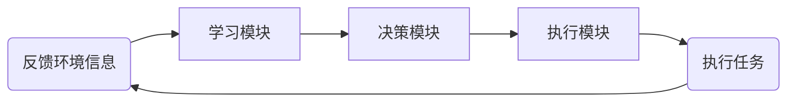

# AI Agent在企业数字化转型中的催化作用：从战略到落地

> 关键词：AI Agent、企业数字化转型、战略规划、落地实施、智能自动化

> 摘要：本文深入探讨了AI Agent在企业数字化转型中的催化作用，从战略层面阐述了如何将AI Agent融入企业的整体规划，再到详细介绍落地实施的具体步骤和方法。通过对核心概念、算法原理、数学模型的分析，结合项目实战案例，揭示了AI Agent如何帮助企业提升效率、创新业务模式。同时，探讨了AI Agent在不同实际应用场景中的表现，推荐了相关的学习资源、开发工具和论文著作。最后，对AI Agent在企业数字化转型中的未来发展趋势与挑战进行了总结，并解答了常见问题，为企业利用AI Agent实现数字化转型提供了全面而深入的指导。

## 1. 背景介绍 
### 1.1 目的和范围
在当今数字化时代，企业面临着日益激烈的市场竞争和快速变化的技术环境。数字化转型已成为企业生存和发展的必由之路。AI Agent作为一种新兴的人工智能技术，具有自主学习、决策和执行任务的能力，能够为企业数字化转型带来新的机遇和动力。本文的目的是深入探讨AI Agent在企业数字化转型中的催化作用，从战略规划到具体落地实施，为企业提供全面的指导和参考。

本文的范围涵盖了AI Agent的核心概念、算法原理、数学模型，以及在企业数字化转型中的实际应用场景。通过项目实战案例，详细介绍了如何在企业中开发和部署AI Agent系统。同时，还推荐了相关的学习资源、开发工具和论文著作，帮助读者进一步深入了解和应用AI Agent技术。

### 1.2 预期读者
本文主要面向企业管理人员、技术决策者、软件开发人员和对AI Agent技术感兴趣的研究人员。企业管理人员可以从本文中了解AI Agent在企业数字化转型中的战略意义和应用价值，为企业的数字化转型决策提供参考。技术决策者可以深入了解AI Agent的技术原理和实现方法，为企业的技术选型和系统架构设计提供指导。软件开发人员可以学习AI Agent的开发技术和实践经验，为开发高质量的AI Agent系统提供帮助。研究人员可以从本文中获取AI Agent技术的最新研究成果和应用案例，为进一步的研究提供参考。

### 1.3 文档结构概述
本文共分为十个部分，具体结构如下：
1. 背景介绍：介绍本文的目的和范围、预期读者、文档结构概述和术语表。
2. 核心概念与联系：阐述AI Agent的核心概念、原理和架构，并通过文本示意图和Mermaid流程图进行说明。
3. 核心算法原理 & 具体操作步骤：详细讲解AI Agent的核心算法原理，并使用Python源代码进行具体操作步骤的阐述。
4. 数学模型和公式 & 详细讲解 & 举例说明：介绍AI Agent的数学模型和公式，并通过具体例子进行详细讲解。
5. 项目实战：代码实际案例和详细解释说明：通过一个实际项目案例，介绍AI Agent在企业数字化转型中的具体实现过程和代码解读。
6. 实际应用场景：探讨AI Agent在不同企业业务场景中的实际应用，如客户服务、生产制造、供应链管理等。
7. 工具和资源推荐：推荐相关的学习资源、开发工具和论文著作，帮助读者进一步深入了解和应用AI Agent技术。
8. 总结：未来发展趋势与挑战：总结AI Agent在企业数字化转型中的发展趋势和面临的挑战。
9. 附录：常见问题与解答：解答读者在使用AI Agent技术过程中常见的问题。
10. 扩展阅读 & 参考资料：提供相关的扩展阅读资料和参考文献，方便读者进一步深入研究。

### 1.4 术语表
#### 1.4.1 核心术语定义
- **AI Agent**：人工智能代理，是一种能够感知环境、自主学习、做出决策并执行任务的智能实体。
- **企业数字化转型**：企业利用数字技术对业务流程、组织架构、商业模式等进行全面改造和升级，以提高企业的竞争力和创新能力。
- **战略规划**：企业为实现长期发展目标而制定的总体计划和策略。
- **落地实施**：将战略规划转化为具体的行动方案，并在企业中实际执行的过程。
- **智能自动化**：利用人工智能技术实现业务流程的自动化，提高效率和质量。

#### 1.4.2 相关概念解释
- **感知能力**：AI Agent通过各种传感器获取环境信息的能力。
- **学习能力**：AI Agent通过机器学习算法从数据中学习知识和技能的能力。
- **决策能力**：AI Agent根据感知到的信息和学习到的知识，做出合理决策的能力。
- **执行能力**：AI Agent根据决策结果执行相应任务的能力。

#### 1.4.3 缩略词列表
- **AI**：Artificial Intelligence，人工智能
- **ML**：Machine Learning，机器学习
- **DL**：Deep Learning，深度学习
- **NLP**：Natural Language Processing，自然语言处理
- **CV**：Computer Vision，计算机视觉

## 2. 核心概念与联系 

### 2.1 AI Agent的核心概念
AI Agent是一种能够自主感知环境、学习知识、做出决策并执行任务的智能实体。它可以看作是一个具有智能的软件程序或硬件设备，能够与环境进行交互，并根据环境的变化动态调整自己的行为。

AI Agent通常由以下几个部分组成：
- **感知模块**：负责获取环境信息，如传感器数据、文本信息、图像信息等。
- **学习模块**：负责从感知到的信息中学习知识和技能，如机器学习算法、深度学习模型等。
- **决策模块**：负责根据学习到的知识和感知到的信息，做出合理的决策。
- **执行模块**：负责根据决策结果执行相应的任务，如控制机器人、发送消息、执行操作等。

### 2.2 AI Agent的原理和架构
AI Agent的工作原理可以概括为以下几个步骤：
1. **感知环境**：AI Agent通过感知模块获取环境信息。
2. **学习知识**：AI Agent将感知到的信息输入到学习模块中，学习知识和技能。
3. **做出决策**：AI Agent根据学习到的知识和感知到的信息，通过决策模块做出合理的决策。
4. **执行任务**：AI Agent根据决策结果，通过执行模块执行相应的任务。

AI Agent的架构可以分为以下几种类型：
- **反应式架构**：AI Agent根据当前的感知信息直接做出决策和执行任务，不进行复杂的推理和学习。
- **慎思式架构**：AI Agent在做出决策之前，会进行复杂的推理和规划，考虑多种可能的情况和后果。
- **混合式架构**：结合了反应式架构和慎思式架构的优点，既能够快速响应环境变化，又能够进行复杂的推理和规划。

### 2.3 文本示意图和Mermaid流程图

#### 文本示意图
AI Agent的核心组件和工作流程可以用以下文本示意图表示：

```plaintext
+-----------------+
|    感知模块     |
+-----------------+
        |
        v
+-----------------+
|    学习模块     |
+-----------------+
        |
        v
+-----------------+
|    决策模块     |
+-----------------+
        |
        v
+-----------------+
|    执行模块     |
+-----------------+
```

#### Mermaid流程图


这个流程图展示了AI Agent的基本工作流程。感知模块获取环境信息，将其传递给学习模块进行学习。学习模块将学习到的知识传递给决策模块，决策模块根据这些知识和当前的感知信息做出决策。决策结果传递给执行模块，执行模块执行相应的任务。执行任务的结果又会反馈给感知模块，形成一个闭环的反馈系统。

## 3. 核心算法原理 & 具体操作步骤 

### 3.1 核心算法原理
AI Agent的核心算法主要包括机器学习算法和搜索算法。以下是几种常见的算法及其原理：

#### 3.1.1 强化学习算法
强化学习是一种通过智能体与环境进行交互，以最大化累积奖励为目标的学习方法。智能体在环境中采取行动，环境会根据智能体的行动给予相应的奖励或惩罚。智能体通过不断地尝试和学习，逐渐找到能够获得最大奖励的行动策略。

强化学习的基本元素包括：
- **智能体（Agent）**：执行决策和行动的主体。
- **环境（Environment）**：智能体所处的外部世界。
- **状态（State）**：环境在某一时刻的特征描述。
- **行动（Action）**：智能体在某一状态下可以采取的操作。
- **奖励（Reward）**：环境根据智能体的行动给予的反馈信号。

强化学习的目标是找到一个最优策略 $\pi$，使得智能体在环境中获得的累积奖励最大。常用的强化学习算法包括Q学习、深度Q网络（DQN）、策略梯度算法等。

#### 3.1.2 遗传算法
遗传算法是一种模拟生物进化过程的优化算法。它通过模拟自然选择、交叉和变异等遗传操作，在解空间中搜索最优解。

遗传算法的基本步骤包括：
1. **初始化种群**：随机生成一组初始解，称为种群。
2. **适应度评估**：计算每个个体的适应度值，用于衡量其优劣程度。
3. **选择操作**：根据适应度值选择一部分个体作为父代，用于繁殖下一代。
4. **交叉操作**：对父代个体进行交叉操作，生成新的个体。
5. **变异操作**：对新生成的个体进行变异操作，引入新的基因。
6. **更新种群**：用新生成的个体替换旧的个体，形成新的种群。
7. **终止条件判断**：如果满足终止条件（如达到最大迭代次数或找到满意解），则停止算法；否则，返回步骤2继续迭代。

#### 3.1.3 A*搜索算法
A*搜索算法是一种启发式搜索算法，用于在图中寻找从起点到终点的最短路径。它结合了Dijkstra算法的广度优先搜索和贪心最佳优先搜索的优点，通过引入启发式函数来指导搜索方向，从而提高搜索效率。

A*搜索算法的基本思想是：对于每个节点 $n$，计算其从起点到该节点的实际代价 $g(n)$ 和从该节点到终点的估计代价 $h(n)$，并将两者相加得到总代价 $f(n)=g(n)+h(n)$。在搜索过程中，优先扩展 $f(n)$ 值最小的节点，直到找到终点或搜索完所有可能的节点。

### 3.2 具体操作步骤（Python源代码）

#### 3.2.1 强化学习（Q学习）示例
```python
import numpy as np

# 定义环境
class Environment:
    def __init__(self):
        self.num_states = 5
        self.num_actions = 2
        self.rewards = np.array([[0, 1], [0, 0], [0, 0], [0, 0], [0, 0]])
        self.current_state = 0

    def reset(self):
        self.current_state = 0
        return self.current_state

    def step(self, action):
        reward = self.rewards[self.current_state][action]
        if action == 0:
            next_state = max(0, self.current_state - 1)
        else:
            next_state = min(self.num_states - 1, self.current_state + 1)
        self.current_state = next_state
        done = (next_state == self.num_states - 1)
        return next_state, reward, done

# 定义Q学习智能体
class QLearningAgent:
    def __init__(self, num_states, num_actions, learning_rate=0.1, discount_factor=0.9):
        self.num_states = num_states
        self.num_actions = num_actions
        self.learning_rate = learning_rate
        self.discount_factor = discount_factor
        self.q_table = np.zeros((num_states, num_actions))

    def choose_action(self, state, epsilon=0.1):
        if np.random.uniform(0, 1) < epsilon:
            return np.random.choice(self.num_actions)
        else:
            return np.argmax(self.q_table[state])

    def update_q_table(self, state, action, reward, next_state):
        max_q_next = np.max(self.q_table[next_state])
        self.q_table[state][action] += self.learning_rate * (
            reward + self.discount_factor * max_q_next - self.q_table[state][action]
        )

# 训练智能体
env = Environment()
agent = QLearningAgent(env.num_states, env.num_actions)

num_episodes = 1000
for episode in range(num_episodes):
    state = env.reset()
    done = False
    while not done:
        action = agent.choose_action(state)
        next_state, reward, done = env.step(action)
        agent.update_q_table(state, action, reward, next_state)
        state = next_state

print("Final Q-table:")
print(agent.q_table)
```

#### 3.2.2 遗传算法示例
```python
import random

# 定义问题
target_string = "Hello, World!"
gene_set = "abcdefghijklmnopqrstuvwxyzABCDEFGHIJKLMNOPQRSTUVWXYZ!,. "

# 定义适应度函数
def get_fitness(guess):
    return sum(1 for expected, actual in zip(target_string, guess) if expected == actual)

# 定义生成随机基因序列的函数
def generate_parent(length):
    genes = []
    while len(genes) < length:
        sample_size = min(length - len(genes), len(gene_set))
        genes.extend(random.sample(gene_set, sample_size))
    return ''.join(genes)

# 定义变异函数
def mutate(parent):
    index = random.randrange(0, len(parent))
    child_genes = list(parent)
    new_gene, alternate = random.sample(gene_set, 2)
    child_genes[index] = alternate if new_gene == child_genes[index] else new_gene
    return ''.join(child_genes)

# 遗传算法主循环
best_parent = generate_parent(len(target_string))
best_fitness = get_fitness(best_parent)
while True:
    child = mutate(best_parent)
    child_fitness = get_fitness(child)
    if best_fitness >= child_fitness:
        continue
    print(f"{child}: {child_fitness}")
    if child_fitness >= len(target_string):
        break
    best_fitness = child_fitness
    best_parent = child
```

#### 3.2.3 A*搜索算法示例
```python
import heapq

# 定义节点类
class Node:
    def __init__(self, state, parent=None, g=0, h=0):
        self.state = state
        self.parent = parent
        self.g = g
        self.h = h
        self.f = g + h

    def __lt__(self, other):
        return self.f < other.f

# 定义启发式函数
def heuristic(state, goal):
    return abs(state[0] - goal[0]) + abs(state[1] - goal[1])

# 定义A*搜索算法
def a_star_search(start, goal, grid):
    open_list = []
    closed_set = set()

    start_node = Node(start, None, 0, heuristic(start, goal))
    heapq.heappush(open_list, start_node)

    while open_list:
        current_node = heapq.heappop(open_list)
        if current_node.state == goal:
            path = []
            while current_node:
                path.append(current_node.state)
                current_node = current_node.parent
            return path[::-1]

        closed_set.add(current_node.state)

        neighbors = [(current_node.state[0] + dx, current_node.state[1] + dy)
                     for dx, dy in [(0, 1), (0, -1), (1, 0), (-1, 0)]
                     if 0 <= current_node.state[0] + dx < len(grid) and
                     0 <= current_node.state[1] + dy < len(grid[0]) and
                     grid[current_node.state[0] + dx][current_node.state[1] + dy] == 0]

        for neighbor in neighbors:
            if neighbor in closed_set:
                continue

            tentative_g = current_node.g + 1
            neighbor_node = Node(neighbor, current_node, tentative_g, heuristic(neighbor, goal))

            for open_node in open_list:
                if open_node.state == neighbor and open_node.g <= tentative_g:
                    break
            else:
                heapq.heappush(open_list, neighbor_node)

    return None

# 示例使用
grid = [
    [0, 0, 0, 0],
    [0, 1, 1, 0],
    [0, 1, 0, 0],
    [0, 0, 0, 0]
]
start = (0, 0)
goal = (3, 3)
path = a_star_search(start, goal, grid)
print("Path:", path)
```

## 4. 数学模型和公式 & 详细讲解 & 举例说明 

### 4.1 强化学习的数学模型和公式
#### 4.1.1 马尔可夫决策过程（MDP）
强化学习通常基于马尔可夫决策过程（MDP）来建模。一个MDP可以用一个五元组 $\langle S, A, P, R, \gamma \rangle$ 表示，其中：
- $S$ 是有限的状态集合。
- $A$ 是有限的行动集合。
- $P: S \times A \times S \to [0, 1]$ 是状态转移概率函数，表示在状态 $s \in S$ 采取行动 $a \in A$ 后转移到状态 $s' \in S$ 的概率，即 $P(s'|s, a)$。
- $R: S \times A \to \mathbb{R}$ 是奖励函数，表示在状态 $s$ 采取行动 $a$ 后获得的即时奖励 $R(s, a)$。
- $\gamma \in [0, 1]$ 是折扣因子，用于权衡即时奖励和未来奖励的重要性。

#### 4.1.2 价值函数
在强化学习中，有两种重要的价值函数：状态价值函数 $V^{\pi}(s)$ 和动作价值函数 $Q^{\pi}(s, a)$。

- 状态价值函数 $V^{\pi}(s)$ 表示在策略 $\pi$ 下，从状态 $s$ 开始的期望累积折扣奖励，定义为：
$$V^{\pi}(s) = \mathbb{E}_{\pi} \left[ \sum_{t=0}^{\infty} \gamma^t R_{t+1} \big| S_0 = s \right]$$

- 动作价值函数 $Q^{\pi}(s, a)$ 表示在策略 $\pi$ 下，从状态 $s$ 采取行动 $a$ 后，再继续遵循策略 $\pi$ 的期望累积折扣奖励，定义为：
$$Q^{\pi}(s, a) = \mathbb{E}_{\pi} \left[ \sum_{t=0}^{\infty} \gamma^t R_{t+1} \big| S_0 = s, A_0 = a \right]$$

#### 4.1.3 Bellman方程
Bellman方程描述了价值函数的递归关系。对于状态价值函数，Bellman方程为：
$$V^{\pi}(s) = \sum_{a \in A} \pi(a|s) \left( R(s, a) + \gamma \sum_{s' \in S} P(s'|s, a) V^{\pi}(s') \right)$$

对于动作价值函数，Bellman方程为：
$$Q^{\pi}(s, a) = R(s, a) + \gamma \sum_{s' \in S} P(s'|s, a) \sum_{a' \in A} \pi(a'|s') Q^{\pi}(s', a')$$

#### 4.1.4 最优价值函数和最优策略
最优状态价值函数 $V^*(s)$ 和最优动作价值函数 $Q^*(s, a)$ 分别定义为所有策略下的最大价值函数：
$$V^*(s) = \max_{\pi} V^{\pi}(s)$$
$$Q^*(s, a) = \max_{\pi} Q^{\pi}(s, a)$$

最优策略 $\pi^*$ 是使得价值函数达到最大值的策略。可以通过求解Bellman最优方程来得到最优价值函数和最优策略：
$$V^*(s) = \max_{a \in A} \left( R(s, a) + \gamma \sum_{s' \in S} P(s'|s, a) V^*(s') \right)$$
$$Q^*(s, a) = R(s, a) + \gamma \sum_{s' \in S} P(s'|s, a) \max_{a' \in A} Q^*(s', a')$$

#### 4.1.5 举例说明
考虑一个简单的格子世界环境，智能体可以在一个 $3 \times 3$ 的网格中移动，目标是从起点 $(0, 0)$ 移动到终点 $(2, 2)$。每次移动如果到达终点则获得奖励 $+1$，否则获得奖励 $0$。假设折扣因子 $\gamma = 0.9$。

我们可以使用Q学习算法来求解这个问题。在Q学习中，Q表的更新公式为：
$$Q(s, a) \leftarrow Q(s, a) + \alpha \left[ R(s, a) + \gamma \max_{a'} Q(s', a') - Q(s, a) \right]$$
其中 $\alpha$ 是学习率。

通过不断地与环境交互并更新Q表，智能体可以逐渐学习到最优策略。

### 4.2 遗传算法的数学模型和公式
#### 4.2.1 适应度函数
遗传算法中的适应度函数用于评估每个个体的优劣程度。设个体 $x$ 的适应度值为 $f(x)$，适应度函数的具体形式取决于具体的问题。例如，在求解函数最大值的问题中，适应度函数可以直接定义为目标函数。

#### 4.2.2 选择操作
选择操作是根据个体的适应度值来选择父代个体的过程。常用的选择方法有轮盘赌选择法。在轮盘赌选择法中，每个个体被选中的概率 $p_i$ 与其适应度值 $f(x_i)$ 成正比，计算公式为：
$$p_i = \frac{f(x_i)}{\sum_{j=1}^{N} f(x_j)}$$
其中 $N$ 是种群的大小。

#### 4.2.3 交叉操作
交叉操作是将父代个体的基因进行交换，生成新个体的过程。设父代个体 $x_1$ 和 $x_2$ 的基因序列分别为 $[x_{11}, x_{12}, \cdots, x_{1n}]$ 和 $[x_{21}, x_{22}, \cdots, x_{2n}]$，交叉点为 $k$，则交叉后的子代个体 $y_1$ 和 $y_2$ 的基因序列分别为：
$$y_1 = [x_{11}, \cdots, x_{1k}, x_{2(k+1)}, \cdots, x_{2n}]$$
$$y_2 = [x_{21}, \cdots, x_{2k}, x_{1(k+1)}, \cdots, x_{1n}]$$

#### 4.2.4 变异操作
变异操作是对个体的基因进行随机改变的过程。设个体 $x$ 的基因序列为 $[x_1, x_2, \cdots, x_n]$，变异点为 $k$，变异概率为 $p_m$，则变异后的个体 $y$ 的基因序列为：
$$y_i = \begin{cases}
x_i, & i \neq k \\
x_i', & i = k
\end{cases}$$
其中 $x_i'$ 是随机生成的新基因。

#### 4.2.5 举例说明
考虑一个简单的二进制编码的优化问题，目标是找到一个二进制字符串，使得其各位数字之和最大。设种群大小为 $N = 4$，每个个体的基因长度为 $n = 5$。初始种群如下：
$$x_1 = [0, 1, 0, 1, 0]$$
$$x_2 = [1, 0, 1, 0, 1]$$
$$x_3 = [0, 0, 1, 1, 0]$$
$$x_4 = [1, 1, 0, 0, 1]$$

适应度函数可以定义为二进制字符串各位数字之和。计算每个个体的适应度值：
$$f(x_1) = 2$$
$$f(x_2) = 3$$
$$f(x_3) = 2$$
$$f(x_4) = 3$$

使用轮盘赌选择法选择父代个体，交叉概率 $p_c = 0.8$，变异概率 $p_m = 0.1$。经过多次迭代，遗传算法可以逐渐找到最优解。

### 4.3 A*搜索算法的数学模型和公式
#### 4.3.1 启发式函数
A*搜索算法通过引入启发式函数 $h(n)$ 来指导搜索方向。启发式函数用于估计从节点 $n$ 到目标节点的代价。常用的启发式函数有曼哈顿距离、欧几里得距离等。

#### 4.3.2 总代价函数
对于每个节点 $n$，A*搜索算法计算其从起点到该节点的实际代价 $g(n)$ 和从该节点到终点的估计代价 $h(n)$，并将两者相加得到总代价 $f(n)$：
$$f(n) = g(n) + h(n)$$

#### 4.3.3 举例说明
考虑一个二维网格地图，智能体需要从起点 $(0, 0)$ 移动到终点 $(3, 3)$。网格中有些位置是障碍物，不能通过。我们可以使用曼哈顿距离作为启发式函数：
$$h(n) = |x_n - x_{goal}| + |y_n - y_{goal}|$$
其中 $(x_n, y_n)$ 是节点 $n$ 的坐标，$(x_{goal}, y_{goal})$ 是目标节点的坐标。

在搜索过程中，A*算法优先扩展 $f(n)$ 值最小的节点，直到找到终点或搜索完所有可能的节点。

## 5. 项目实战：代码实际案例和详细解释说明 

### 5.1 开发环境搭建
本项目实战使用Python语言进行开发，主要依赖以下库：
- `numpy`：用于数值计算和数组操作。
- `matplotlib`：用于数据可视化。
- `tensorflow` 或 `pytorch`：用于深度学习模型的开发（如果需要）。

可以使用以下命令安装这些库：
```bash
pip install numpy matplotlib tensorflow
```

### 5.2 源代码详细实现和代码解读
我们以一个简单的客户服务智能聊天机器人为例，介绍AI Agent在企业数字化转型中的实际应用。

#### 5.2.1 需求分析
客户服务智能聊天机器人的主要功能是自动回答客户的常见问题，提高客户服务效率。机器人需要能够理解客户的问题，根据问题的类型给出相应的回答。

#### 5.2.2 数据准备
我们准备一个简单的问答数据集，包含问题和对应的答案。以下是一个示例数据集：
```python
qa_data = [
    ("你们公司的产品有哪些？", "我们公司的产品包括软件、硬件和服务。"),
    ("产品的价格是多少？", "产品的价格根据不同的型号和配置有所不同，请联系我们的销售团队获取详细报价。"),
    ("如何购买你们的产品？", "您可以通过我们的官方网站、电话或线下门店购买我们的产品。")
]
```

#### 5.2.3 代码实现
```python
import numpy as np
import re

# 文本预处理函数
def preprocess_text(text):
    text = text.lower()
    text = re.sub(r'[^\w\s]', '', text)
    return text

# 计算文本相似度（简单的词匹配）
def text_similarity(text1, text2):
    words1 = set(preprocess_text(text1).split())
    words2 = set(preprocess_text(text2).split())
    intersection = len(words1.intersection(words2))
    union = len(words1.union(words2))
    if union == 0:
        return 0
    return intersection / union

# 定义智能聊天机器人类
class ChatBot:
    def __init__(self, qa_data):
        self.qa_data = qa_data

    def answer_question(self, question):
        max_similarity = 0
        best_answer = "对不起，我不理解您的问题。"
        for q, a in self.qa_data:
            similarity = text_similarity(question, q)
            if similarity > max_similarity:
                max_similarity = similarity
                best_answer = a
        return best_answer

# 创建聊天机器人类实例
chatbot = ChatBot(qa_data)

# 测试聊天机器人
test_question = "你们有什么产品？"
answer = chatbot.answer_question(test_question)
print(f"问题: {test_question}")
print(f"答案: {answer}")
```

#### 5.2.4 代码解读
- **文本预处理函数 `preprocess_text`**：将文本转换为小写，并去除标点符号，以便后续的相似度计算。
- **文本相似度计算函数 `text_similarity`**：使用简单的词匹配方法计算两个文本的相似度，即交集与并集的比例。
- **智能聊天机器人类 `ChatBot`**：
  - `__init__` 方法：初始化问答数据集。
  - `answer_question` 方法：遍历问答数据集，计算输入问题与每个问题的相似度，选择相似度最高的问题对应的答案作为回复。

### 5.3 代码解读与分析
#### 5.3.1 优点
- **简单易懂**：代码结构简单，易于理解和实现，适合初学者入门。
- **可扩展性**：可以通过增加问答数据集和改进文本相似度计算方法来提高机器人的性能。

#### 5.3.2 缺点
- **文本相似度计算方法简单**：仅使用词匹配方法，对于语义相近但词汇不同的问题可能无法准确匹配。
- **缺乏上下文理解**：机器人只能根据当前问题进行回答，无法理解上下文信息。

#### 5.3.3 改进方向
- **使用深度学习模型**：如BERT、GPT等，进行语义理解和问题回答。
- **引入上下文管理**：记录对话历史，根据上下文信息进行更准确的回答。

## 6. 实际应用场景 
### 6.1 客户服务
在客户服务领域，AI Agent可以自动回答客户的常见问题，提供实时的解决方案。例如，电商平台的智能客服机器人可以处理客户的咨询、投诉和退换货请求，提高客户服务效率和满意度。AI Agent还可以通过分析客户的历史数据和行为模式，为客户提供个性化的服务和推荐。

### 6.2 生产制造
在生产制造领域，AI Agent可以实现生产过程的智能监控和优化。例如，通过传感器收集生产设备的运行数据，AI Agent可以实时监测设备的状态，预测设备故障，并及时发出警报。AI Agent还可以根据生产需求和资源状况，自动调整生产计划和工艺流程，提高生产效率和质量。

### 6.3 供应链管理
在供应链管理领域，AI Agent可以优化供应链的各个环节，提高供应链的效率和灵活性。例如，AI Agent可以根据市场需求和库存状况，自动调整采购计划和物流配送方案，降低库存成本和物流成本。AI Agent还可以通过分析供应链数据，预测市场趋势和风险，为企业的决策提供支持。

### 6.4 市场营销
在市场营销领域，AI Agent可以实现精准营销和客户关系管理。例如，AI Agent可以通过分析客户的行为数据和偏好，为客户提供个性化的营销内容和推荐。AI Agent还可以自动识别潜在客户，进行客户跟进和转化，提高市场营销效果和客户转化率。

### 6.5 财务管理
在财务管理领域，AI Agent可以实现财务风险预警和财务决策支持。例如，AI Agent可以通过分析财务数据和市场数据，预测企业的财务风险和经营状况。AI Agent还可以根据企业的财务目标和预算，自动生成财务报表和分析报告，为企业的财务管理提供支持。

## 7. 工具和资源推荐
### 7.1 学习资源推荐
#### 7.1.1 书籍推荐
- 《人工智能：一种现代的方法》（Artificial Intelligence: A Modern Approach）：这是一本经典的人工智能教材，涵盖了人工智能的各个领域，包括搜索算法、机器学习、自然语言处理等。
- 《Python机器学习》（Python Machine Learning）：本书详细介绍了如何使用Python进行机器学习，包括各种机器学习算法的原理和实现。
- 《深度学习》（Deep Learning）：由深度学习领域的三位顶尖专家所著，全面介绍了深度学习的理论和实践。

#### 7.1.2 在线课程
- Coursera上的“人工智能基础”（Foundations of Artificial Intelligence）：由斯坦福大学的教授授课，系统介绍了人工智能的基本概念和方法。
- edX上的“深度学习专项课程”（Deep Learning Specialization）：由吴恩达教授授课，深入讲解了深度学习的原理和应用。
- Udemy上的“Python人工智能实战”（Artificial Intelligence with Python）：通过实际项目案例，介绍了如何使用Python实现人工智能算法。

#### 7.1.3 技术博客和网站
- Medium：上面有很多人工智能领域的优秀博客文章，涵盖了最新的技术进展和实践经验。
- Towards Data Science：专注于数据科学和人工智能领域的技术博客，提供了大量的教程和案例分析。
- AI Planet：提供了人工智能领域的最新资讯、技术文章和学习资源。

### 7.2 开发工具框架推荐
#### 7.2.1 IDE和编辑器
- PyCharm：一款专业的Python集成开发环境，提供了丰富的代码编辑、调试和分析功能。
- Jupyter Notebook：一种交互式的开发环境，适合进行数据分析和机器学习实验。
- Visual Studio Code：一款轻量级的代码编辑器，支持多种编程语言和插件扩展。

#### 7.2.2 调试和性能分析工具
- TensorBoard：TensorFlow的可视化工具，用于监控模型训练过程和分析模型性能。
- PyTorch Profiler：PyTorch的性能分析工具，用于分析模型的运行时间和内存使用情况。
- cProfile：Python的内置性能分析工具，用于分析Python代码的运行时间和函数调用次数。

#### 7.2.3 相关框架和库
- TensorFlow：一个开源的深度学习框架，提供了丰富的深度学习模型和工具。
- PyTorch：另一个流行的深度学习框架，具有动态图和易于使用的特点。
- Scikit-learn：一个用于机器学习的Python库，提供了各种机器学习算法和工具。
- NLTK：一个用于自然语言处理的Python库，提供了丰富的语料库和工具。

### 7.3 相关论文著作推荐
#### 7.3.1 经典论文
- “A Logical Calculus of the Ideas Immanent in Nervous Activity”（神经活动中内在思想的逻辑演算）：由Warren McCulloch和Walter Pitts于1943年发表，提出了人工神经网络的基本概念。
- “Learning Representations by Back-propagating Errors”（通过误差反向传播学习表示）：由David Rumelhart、Geoffrey Hinton和Ronald Williams于1986年发表，介绍了误差反向传播算法，推动了神经网络的发展。
- “ImageNet Classification with Deep Convolutional Neural Networks”（使用深度卷积神经网络进行ImageNet分类）：由Alex Krizhevsky、Ilya Sutskever和Geoffrey Hinton于2012年发表，开创了深度学习在计算机视觉领域的应用。

#### 7.3.2 最新研究成果
- 关注顶级学术会议，如NeurIPS（神经信息处理系统大会）、ICML（国际机器学习会议）、CVPR（计算机视觉与模式识别会议）等，这些会议上会发布人工智能领域的最新研究成果。
- 查阅顶级学术期刊，如Journal of Artificial Intelligence Research（JAIR）、Artificial Intelligence等，这些期刊上会发表高质量的人工智能研究论文。

#### 7.3.3 应用案例分析
- 可以参考一些企业的技术博客和案例分享，如Google AI Blog、Microsoft AI等，了解AI Agent在实际企业中的应用案例和经验。
- 阅读相关的行业报告和研究机构的分析，如Gartner、IDC等，了解AI Agent在不同行业的应用趋势和发展情况。

## 8. 总结：未来发展趋势与挑战
### 8.1 未来发展趋势
#### 8.1.1 与其他技术的融合
AI Agent将与物联网、大数据、区块链等技术深度融合，创造出更加智能、高效的应用场景。例如，在智能工厂中，AI Agent可以通过物联网设备实时获取生产数据，结合大数据分析和区块链技术，实现生产过程的智能化管理和追溯。

#### 8.1.2 多智能体系统的发展
多智能体系统将成为未来AI Agent的重要发展方向。多个AI Agent可以相互协作，共同完成复杂的任务。例如，在城市交通管理中，多个交通智能体可以通过协作优化交通流量，减少拥堵。

#### 8.1.3 应用领域的拓展
AI Agent将在更多的领域得到应用，如医疗、教育、金融等。例如，在医疗领域，AI Agent可以辅助医生进行疾病诊断和治疗方案推荐；在教育领域，AI Agent可以为学生提供个性化的学习服务。

#### 8.1.4 智能化水平的提升
随着人工智能技术的不断发展，AI Agent的智能化水平将不断提升。AI Agent将具备更强的感知能力、学习能力、决策能力和执行能力，能够更好地适应复杂多变的环境。

### 8.2 挑战
#### 8.2.1 数据隐私和安全问题
AI Agent的运行需要大量的数据支持，而数据隐私和安全问题是一个重要的挑战。如何保护用户的数据隐私，防止数据泄露和滥用，是需要解决的关键问题。

#### 8.2.2 算法可解释性问题
很多AI Agent使用的深度学习算法是黑盒模型，缺乏可解释性。在一些关键领域，如医疗、金融等，算法的可解释性非常重要。如何提高AI Agent算法的可解释性，是一个亟待解决的问题。

#### 8.2.3 伦理和法律问题
AI Agent的发展也带来了一系列伦理和法律问题。例如，当AI Agent做出错误决策导致损失时，责任应该由谁承担？如何规范AI Agent的行为，避免其对人类造成伤害？这些问题需要从伦理和法律的角度进行深入探讨。

#### 8.2.4 人才短缺问题
AI Agent的开发和应用需要具备专业知识和技能的人才。目前，人工智能领域的人才短缺问题比较严重，如何培养和吸引更多的人工智能人才，是推动AI Agent发展的关键。

## 9. 附录：常见问题与解答
### 9.1 什么是AI Agent？
AI Agent是一种能够自主感知环境、学习知识、做出决策并执行任务的智能实体。它可以看作是一个具有智能的软件程序或硬件设备，能够与环境进行交互，并根据环境的变化动态调整自己的行为。

### 9.2 AI Agent与传统软件有什么区别？
传统软件通常是按照预先编写的程序逻辑执行任务，缺乏自主学习和决策能力。而AI Agent具有自主感知、学习、决策和执行的能力，能够根据环境的变化动态调整自己的行为。

### 9.3 如何开发一个AI Agent？
开发一个AI Agent通常需要以下步骤：
1. 定义问题和目标：明确AI Agent需要解决的问题和要达到的目标。
2. 收集和准备数据：收集相关的数据，并进行预处理和清洗。
3. 选择合适的算法和模型：根据问题的特点选择合适的机器学习或深度学习算法和模型。
4. 训练模型：使用准备好的数据对模型进行训练。
5. 部署和测试：将训练好的模型部署到实际环境中，并进行测试和优化。

### 9.4 AI Agent在企业数字化转型中有哪些应用场景？
AI Agent在企业数字化转型中的应用场景非常广泛，包括客户服务、生产制造、供应链管理、市场营销、财务管理等。例如，在客户服务领域，AI Agent可以自动回答客户的常见问题，提高客户服务效率；在生产制造领域，AI Agent可以实现生产过程的智能监控和优化。

### 9.5 AI Agent的发展面临哪些挑战？
AI Agent的发展面临着数据隐私和安全问题、算法可解释性问题、伦理和法律问题以及人才短缺问题等挑战。解决这些问题需要政府、企业和社会各界的共同努力。

## 10. 扩展阅读 & 参考资料
### 10.1 扩展阅读
- 《人工智能时代与人类未来》：探讨了人工智能对人类社会的影响和未来发展趋势。
- 《奇点临近》：提出了奇点理论，预测了人工智能将在未来超越人类智能。
- 《智能时代》：介绍了智能技术在各个领域的应用和发展前景。

### 10.2 参考资料
- 相关学术论文和研究报告，可以通过学术数据库如IEEE Xplore、ACM Digital Library等进行查询。
- 企业的技术博客和官方文档，如Google AI Blog、Microsoft AI等。
- 行业协会和研究机构的报告，如Gartner、IDC等。

作者：AI天才研究院/AI Genius Institute & 禅与计算机程序设计艺术 /Zen And The Art of Computer Programming