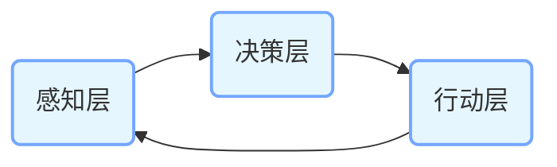

# AI Agent在企业数字化转型中的关键作用：从战略规划到实施监控

> 关键词：AI Agent、企业数字化转型、战略规划、实施监控、智能决策

> 摘要：本文深入探讨了AI Agent在企业数字化转型中的关键作用，从战略规划阶段如何助力企业制定精准有效的数字化战略，到实施过程中提供实时决策支持和优化建议，再到监控阶段对转型效果的评估与反馈。通过详细阐述AI Agent的核心概念、算法原理、数学模型，并结合实际项目案例，分析其在不同应用场景中的价值。同时，推荐了相关的学习资源、开发工具和研究论文，最后对AI Agent在企业数字化转型中的未来发展趋势与挑战进行了总结。

## 1. 背景介绍 
### 1.1 目的和范围
企业数字化转型已成为当今企业提升竞争力、适应市场变化的关键举措。AI Agent作为一种智能化的软件实体，能够模拟人类的决策和行为，在企业数字化转型的各个环节发挥重要作用。本文的目的是全面探讨AI Agent在企业数字化转型中从战略规划到实施监控的关键作用，分析其原理、应用场景和发展趋势，为企业数字化转型提供理论支持和实践指导。范围涵盖了AI Agent的核心概念、算法原理、数学模型、项目实战以及相关的工具和资源推荐。

### 1.2 预期读者
本文预期读者包括企业的高层管理人员、数字化转型项目负责人、技术研发人员以及对企业数字化转型和AI Agent技术感兴趣的研究人员。通过阅读本文，读者可以深入了解AI Agent在企业数字化转型中的应用价值和实施方法，为企业的数字化转型决策和实践提供参考。

### 1.3 文档结构概述
本文共分为10个部分。第1部分为背景介绍，阐述了文章的目的、范围、预期读者和文档结构。第2部分介绍了AI Agent的核心概念与联系，包括其定义、原理和架构。第3部分详细讲解了AI Agent的核心算法原理和具体操作步骤，并给出了Python源代码示例。第4部分介绍了AI Agent的数学模型和公式，并进行了详细讲解和举例说明。第5部分通过实际项目案例，展示了AI Agent在企业数字化转型中的应用，包括开发环境搭建、源代码实现和代码解读。第6部分分析了AI Agent在企业数字化转型中的实际应用场景。第7部分推荐了相关的学习资源、开发工具和研究论文。第8部分总结了AI Agent在企业数字化转型中的未来发展趋势与挑战。第9部分为附录，解答了常见问题。第10部分提供了扩展阅读和参考资料。

### 1.4 术语表
#### 1.4.1 核心术语定义
- **AI Agent**：人工智能代理，是一种能够感知环境、做出决策并采取行动以实现特定目标的智能化软件实体。
- **企业数字化转型**：企业利用数字技术对业务流程、组织架构、商业模式等进行全面变革，以提升企业的竞争力和创新能力。
- **战略规划**：企业在数字化转型过程中，根据自身的发展目标和市场环境，制定的长期发展规划和战略方向。
- **实施监控**：在企业数字化转型实施过程中，对项目的进度、质量、成本等进行实时监控和评估，及时发现问题并采取措施进行调整。

#### 1.4.2 相关概念解释
- **机器学习**：一门多领域交叉学科，涉及概率论、统计学、逼近论、凸分析、算法复杂度理论等多门学科。它专门研究计算机怎样模拟或实现人类的学习行为，以获取新的知识或技能，重新组织已有的知识结构使之不断改善自身的性能。
- **深度学习**：机器学习的一个分支领域，它是一种基于对数据进行表征学习的方法。深度学习通过构建具有很多层的神经网络模型，自动从大量数据中学习特征和模式。
- **强化学习**：一种通过智能体（Agent）与环境进行交互，以最大化累积奖励为目标的机器学习方法。智能体在环境中采取行动，根据环境反馈的奖励信号调整自己的行为策略。

#### 1.4.3 缩略词列表
- **AI**：Artificial Intelligence，人工智能
- **ML**：Machine Learning，机器学习
- **DL**：Deep Learning，深度学习
- **RL**：Reinforcement Learning，强化学习

## 2. 核心概念与联系 
### 2.1 AI Agent的定义
AI Agent是一种能够感知环境、做出决策并采取行动以实现特定目标的智能化软件实体。它可以接收来自环境的信息，通过内部的决策机制进行分析和推理，然后选择合适的行动来影响环境。AI Agent可以是简单的规则引擎，也可以是复杂的基于机器学习和深度学习的智能系统。

### 2.2 AI Agent的原理
AI Agent的工作原理主要包括感知、决策和行动三个环节。感知环节负责收集来自环境的信息，如传感器数据、用户输入等。决策环节根据感知到的信息，利用内部的模型和算法进行分析和推理，选择最优的行动方案。行动环节将决策结果转化为具体的行动，对环境产生影响。这个过程是一个循环迭代的过程，AI Agent不断地感知环境的变化，调整自己的决策和行动，以实现预定的目标。

### 2.3 AI Agent的架构
AI Agent的架构可以分为三个层次：感知层、决策层和行动层。感知层负责收集和处理来自环境的信息，包括数据采集、预处理和特征提取等。决策层根据感知层提供的信息，进行分析和推理，选择最优的行动方案。行动层将决策层的结果转化为具体的行动，对环境产生影响。以下是AI Agent架构的Mermaid流程图：

图1：AI Agent架构流程图

### 2.4 AI Agent与企业数字化转型的联系
AI Agent在企业数字化转型中扮演着关键角色。在战略规划阶段，AI Agent可以通过分析大量的市场数据、行业动态和企业内部数据，为企业提供精准的市场趋势预测和竞争态势分析，帮助企业制定科学合理的数字化战略。在实施阶段，AI Agent可以实时监控项目的进度、质量和成本，提供实时决策支持和优化建议，确保项目的顺利进行。在监控阶段，AI Agent可以对数字化转型的效果进行评估和反馈，帮助企业及时调整战略和实施计划，提高数字化转型的成功率。

## 3. 核心算法原理 & 具体操作步骤 
### 3.1 机器学习算法
机器学习是AI Agent的核心技术之一，常见的机器学习算法包括决策树、支持向量机、神经网络等。下面以决策树算法为例，介绍其原理和具体操作步骤。

#### 3.1.1 决策树算法原理
决策树是一种基于树结构进行决策的机器学习算法。它通过对训练数据进行分析，构建一棵决策树，每个内部节点表示一个属性上的测试，每个分支表示一个测试输出，每个叶节点表示一个类别或值。决策树的构建过程是一个递归划分的过程，通过选择最优的属性进行划分，使得划分后的子集尽可能地纯净。

#### 3.1.2 决策树算法的Python实现
```python
from sklearn.datasets import load_iris
from sklearn.model_selection import train_test_split
from sklearn.tree import DecisionTreeClassifier
from sklearn.metrics import accuracy_score

# 加载数据集
iris = load_iris()
X = iris.data
y = iris.target

# 划分训练集和测试集
X_train, X_test, y_train, y_test = train_test_split(X, y, test_size=0.3, random_state=42)

# 创建决策树分类器
clf = DecisionTreeClassifier()

# 训练模型
clf.fit(X_train, y_train)

# 预测
y_pred = clf.predict(X_test)

# 计算准确率
accuracy = accuracy_score(y_test, y_pred)
print("Accuracy:", accuracy)
```
#### 3.1.3 代码解释
- 首先，使用`load_iris`函数加载鸢尾花数据集。
- 然后，使用`train_test_split`函数将数据集划分为训练集和测试集。
- 接着，创建一个决策树分类器`DecisionTreeClassifier`。
- 使用`fit`方法对模型进行训练。
- 使用`predict`方法对测试集进行预测。
- 最后，使用`accuracy_score`函数计算预测结果的准确率。

### 3.2 深度学习算法
深度学习是机器学习的一个分支领域，它通过构建具有很多层的神经网络模型，自动从大量数据中学习特征和模式。下面以卷积神经网络（CNN）为例，介绍其原理和具体操作步骤。

#### 3.2.1 卷积神经网络原理
卷积神经网络是一种专门用于处理具有网格结构数据的神经网络，如图像、音频等。它主要由卷积层、池化层和全连接层组成。卷积层通过卷积核在输入数据上进行滑动卷积操作，提取数据的特征。池化层用于对卷积层的输出进行下采样，减少数据的维度。全连接层将池化层的输出进行全连接，输出最终的分类结果。

#### 3.2.2 卷积神经网络的Python实现
```python
import tensorflow as tf
from tensorflow.keras.datasets import mnist
from tensorflow.keras.models import Sequential
from tensorflow.keras.layers import Conv2D, MaxPooling2D, Flatten, Dense

# 加载MNIST数据集
(x_train, y_train), (x_test, y_test) = mnist.load_data()

# 数据预处理
x_train = x_train.reshape(-1, 28, 28, 1).astype('float32') / 255.0
x_test = x_test.reshape(-1, 28, 28, 1).astype('float32') / 255.0
y_train = tf.keras.utils.to_categorical(y_train, 10)
y_test = tf.keras.utils.to_categorical(y_test, 10)

# 创建卷积神经网络模型
model = Sequential([
    Conv2D(32, (3, 3), activation='relu', input_shape=(28, 28, 1)),
    MaxPooling2D((2, 2)),
    Conv2D(64, (3, 3), activation='relu'),
    MaxPooling2D((2, 2)),
    Flatten(),
    Dense(64, activation='relu'),
    Dense(10, activation='softmax')
])

# 编译模型
model.compile(optimizer='adam',
              loss='categorical_crossentropy',
              metrics=['accuracy'])

# 训练模型
model.fit(x_train, y_train, epochs=5, batch_size=64, validation_data=(x_test, y_test))

# 评估模型
test_loss, test_acc = model.evaluate(x_test, y_test)
print("Test accuracy:", test_acc)
```
#### 3.2.3 代码解释
- 首先，使用`mnist.load_data`函数加载MNIST手写数字数据集。
- 对数据进行预处理，将图像数据的像素值归一化到0-1之间，并将标签进行one-hot编码。
- 创建一个卷积神经网络模型，包括卷积层、池化层、全连接层。
- 使用`compile`方法编译模型，指定优化器、损失函数和评估指标。
- 使用`fit`方法对模型进行训练。
- 最后，使用`evaluate`方法对模型进行评估，输出测试集的准确率。

### 3.3 强化学习算法
强化学习是一种通过智能体（Agent）与环境进行交互，以最大化累积奖励为目标的机器学习方法。下面以Q-learning算法为例，介绍其原理和具体操作步骤。

#### 3.3.1 Q-learning算法原理
Q-learning是一种无模型的强化学习算法，它通过学习一个Q函数来指导智能体的行动。Q函数表示在某个状态下采取某个行动的预期累积奖励。智能体在每个时间步根据当前状态选择一个行动，与环境进行交互，得到一个奖励和下一个状态。然后，根据奖励和下一个状态更新Q函数的值。通过不断地迭代更新，Q函数逐渐收敛到最优值。

#### 3.3.2 Q-learning算法的Python实现
```python
import numpy as np

# 定义环境
env = {
    'states': [0, 1, 2, 3],
    'actions': [0, 1],
    'rewards': {
        (0, 0): -1,
        (0, 1): 1,
        (1, 0): -2,
        (1, 1): 2,
        (2, 0): -3,
        (2, 1): 3,
        (3, 0): -4,
        (3, 1): 4
    }
}

# 初始化Q表
Q = np.zeros((len(env['states']), len(env['actions'])))

# 超参数
alpha = 0.1  # 学习率
gamma = 0.9  # 折扣因子
epsilon = 0.1  # 探索率
num_episodes = 1000

# Q-learning算法
for episode in range(num_episodes):
    state = np.random.choice(env['states'])
    done = False
    while not done:
        if np.random.uniform(0, 1) < epsilon:
            action = np.random.choice(env['actions'])
        else:
            action = np.argmax(Q[state])
        next_state = np.random.choice(env['states'])
        reward = env['rewards'][(state, action)]
        Q[state, action] = Q[state, action] + alpha * (reward + gamma * np.max(Q[next_state]) - Q[state, action])
        state = next_state
        if state == 3:
            done = True

# 输出最终的Q表
print("Final Q-table:")
print(Q)
```
#### 3.3.3 代码解释
- 首先，定义一个简单的环境，包括状态、行动和奖励。
- 初始化Q表，用于存储每个状态-行动对的Q值。
- 设置超参数，包括学习率、折扣因子和探索率。
- 进行多次迭代训练，每次迭代中，智能体根据当前状态选择一个行动，与环境进行交互，得到奖励和下一个状态。
- 根据奖励和下一个状态更新Q表的值。
- 最后，输出最终的Q表。

## 4. 数学模型和公式 & 详细讲解 & 举例说明 
### 4.1 机器学习中的数学模型
#### 4.1.1 线性回归模型
线性回归是一种用于预测连续值的机器学习模型，其数学模型可以表示为：
$$y = \theta_0 + \theta_1x_1 + \theta_2x_2 + \cdots + \theta_nx_n + \epsilon$$
其中，$y$ 是预测值，$x_1, x_2, \cdots, x_n$ 是特征值，$\theta_0, \theta_1, \cdots, \theta_n$ 是模型的参数，$\epsilon$ 是误差项。

线性回归的目标是找到一组最优的参数 $\theta$，使得预测值 $y$ 与真实值之间的误差最小。通常使用最小二乘法来求解最优参数，其损失函数可以表示为：
$$J(\theta) = \frac{1}{2m}\sum_{i=1}^{m}(h_{\theta}(x^{(i)}) - y^{(i)})^2$$
其中，$m$ 是样本数量，$h_{\theta}(x^{(i)})$ 是第 $i$ 个样本的预测值，$y^{(i)}$ 是第 $i$ 个样本的真实值。

#### 4.1.2 逻辑回归模型
逻辑回归是一种用于分类的机器学习模型，其数学模型可以表示为：
$$h_{\theta}(x) = \frac{1}{1 + e^{-\theta^Tx}}$$
其中，$h_{\theta}(x)$ 是预测的概率值，$\theta$ 是模型的参数，$x$ 是特征向量。

逻辑回归的目标是找到一组最优的参数 $\theta$，使得预测的概率值与真实的类别标签之间的误差最小。通常使用对数损失函数来求解最优参数，其损失函数可以表示为：
$$J(\theta) = -\frac{1}{m}\sum_{i=1}^{m}[y^{(i)}\log(h_{\theta}(x^{(i)})) + (1 - y^{(i)})\log(1 - h_{\theta}(x^{(i)}))]$$
其中，$m$ 是样本数量，$y^{(i)}$ 是第 $i$ 个样本的真实类别标签。

### 4.2 深度学习中的数学模型
#### 4.2.1 神经网络的前向传播
神经网络的前向传播过程可以用矩阵乘法和激活函数来表示。假设一个简单的三层神经网络，输入层有 $n$ 个神经元，隐藏层有 $h$ 个神经元，输出层有 $m$ 个神经元。输入层到隐藏层的权重矩阵为 $W_1$，偏置向量为 $b_1$；隐藏层到输出层的权重矩阵为 $W_2$，偏置向量为 $b_2$。则前向传播的过程可以表示为：
$$z_1 = W_1x + b_1$$
$$a_1 = f(z_1)$$
$$z_2 = W_2a_1 + b_2$$
$$a_2 = f(z_2)$$
其中，$x$ 是输入向量，$z_1$ 和 $z_2$ 是加权和，$a_1$ 和 $a_2$ 是激活值，$f$ 是激活函数。

#### 4.2.2 神经网络的反向传播
神经网络的反向传播过程是为了更新网络的权重和偏置，使得损失函数最小化。反向传播的核心是计算损失函数对每个权重和偏置的梯度。以均方误差损失函数为例，其损失函数可以表示为：
$$J = \frac{1}{2}\sum_{i=1}^{m}(y^{(i)} - a_2^{(i)})^2$$
其中，$m$ 是样本数量，$y^{(i)}$ 是第 $i$ 个样本的真实标签，$a_2^{(i)}$ 是第 $i$ 个样本的输出值。

反向传播的过程可以通过链式法则来计算梯度，具体步骤如下：
1. 计算输出层的误差：
$$\delta_2 = -(y - a_2) \odot f'(z_2)$$
其中，$\odot$ 表示逐元素相乘，$f'(z_2)$ 是激活函数的导数。
2. 计算隐藏层的误差：
$$\delta_1 = (W_2^T\delta_2) \odot f'(z_1)$$
3. 计算权重和偏置的梯度：
$$\frac{\partial J}{\partial W_2} = \delta_2a_1^T$$
$$\frac{\partial J}{\partial b_2} = \delta_2$$
$$\frac{\partial J}{\partial W_1} = \delta_1x^T$$
$$\frac{\partial J}{\partial b_1} = \delta_1$$
4. 更新权重和偏置：
$$W_2 = W_2 - \alpha\frac{\partial J}{\partial W_2}$$
$$b_2 = b_2 - \alpha\frac{\partial J}{\partial b_2}$$
$$W_1 = W_1 - \alpha\frac{\partial J}{\partial W_1}$$
$$b_1 = b_1 - \alpha\frac{\partial J}{\partial b_1}$$
其中，$\alpha$ 是学习率。

### 4.3 强化学习中的数学模型
#### 4.3.1 Q-learning算法的更新公式
Q-learning算法的更新公式可以表示为：
$$Q(s, a) = Q(s, a) + \alpha[r + \gamma\max_{a'}Q(s', a') - Q(s, a)]$$
其中，$Q(s, a)$ 是在状态 $s$ 下采取行动 $a$ 的Q值，$\alpha$ 是学习率，$r$ 是即时奖励，$\gamma$ 是折扣因子，$s'$ 是下一个状态。

#### 4.3.2 举例说明
假设一个简单的网格世界环境，智能体可以在网格中上下左右移动，目标是到达终点。智能体在某个状态 $s$ 下采取行动 $a$，得到奖励 $r$，并转移到下一个状态 $s'$。假设当前的Q值 $Q(s, a) = 0$，学习率 $\alpha = 0.1$，折扣因子 $\gamma = 0.9$，奖励 $r = 1$，下一个状态 $s'$ 的最大Q值 $\max_{a'}Q(s', a') = 2$。则根据Q-learning算法的更新公式，更新后的Q值为：
$$Q(s, a) = 0 + 0.1\times[1 + 0.9\times2 - 0] = 0.28$$

## 5. 项目实战：代码实际案例和详细解释说明 
### 5.1  开发环境搭建
#### 5.1.1 安装Python
首先，需要安装Python环境。可以从Python官方网站（https://www.python.org/downloads/）下载适合自己操作系统的Python安装包，并按照安装向导进行安装。

#### 5.1.2 安装必要的库
在项目中，需要使用一些Python库，如NumPy、Pandas、Scikit-learn、TensorFlow等。可以使用pip命令来安装这些库，例如：
```bash
pip install numpy pandas scikit-learn tensorflow
```

### 5.2  源代码详细实现和代码解读
#### 5.2.1 项目背景
假设我们要开发一个基于AI Agent的客户需求预测系统，帮助企业更好地了解客户需求，制定营销策略。

#### 5.2.2 数据准备
首先，需要收集和整理客户的相关数据，如客户的基本信息、购买历史、浏览记录等。假设我们已经将数据整理成一个CSV文件`customer_data.csv`，可以使用Pandas库来读取数据：
```python
import pandas as pd

# 读取数据
data = pd.read_csv('customer_data.csv')

# 数据预处理
# 处理缺失值
data = data.dropna()

# 分离特征和标签
X = data.drop('demand', axis=1)
y = data['demand']
```

#### 5.2.3 模型训练
使用Scikit-learn库中的随机森林回归模型进行训练：
```python
from sklearn.ensemble import RandomForestRegressor
from sklearn.model_selection import train_test_split

# 划分训练集和测试集
X_train, X_test, y_train, y_test = train_test_split(X, y, test_size=0.2, random_state=42)

# 创建随机森林回归模型
model = RandomForestRegressor()

# 训练模型
model.fit(X_train, y_train)
```

#### 5.2.4 模型评估
使用测试集对模型进行评估：
```python
from sklearn.metrics import mean_squared_error

# 预测
y_pred = model.predict(X_test)

# 计算均方误差
mse = mean_squared_error(y_test, y_pred)
print("Mean Squared Error:", mse)
```

#### 5.2.5 AI Agent的实现
使用AI Agent来监控模型的性能，并根据性能指标调整模型的参数。以下是一个简单的AI Agent实现：
```python
class AIAgent:
    def __init__(self, model):
        self.model = model
        self.best_mse = float('inf')

    def monitor_and_adjust(self, X_test, y_test):
        y_pred = self.model.predict(X_test)
        mse = mean_squared_error(y_test, y_pred)
        if mse < self.best_mse:
            self.best_mse = mse
            print("New best MSE:", self.best_mse)
        else:
            # 调整模型参数
            self.model.set_params(n_estimators=self.model.n_estimators + 10)
            self.model.fit(X_train, y_train)
            print("Model parameters adjusted.")

# 创建AI Agent
agent = AIAgent(model)

# 监控和调整
agent.monitor_and_adjust(X_test, y_test)
```

### 5.3  代码解读与分析
- **数据准备部分**：使用Pandas库读取CSV文件，并对数据进行预处理，包括处理缺失值和分离特征和标签。
- **模型训练部分**：使用Scikit-learn库中的随机森林回归模型进行训练，将数据集划分为训练集和测试集，然后使用训练集对模型进行训练。
- **模型评估部分**：使用测试集对模型进行评估，计算均方误差作为评估指标。
- **AI Agent实现部分**：定义一个`AIAgent`类，用于监控模型的性能，并根据性能指标调整模型的参数。在`monitor_and_adjust`方法中，首先计算当前模型的均方误差，如果均方误差比之前的最佳均方误差小，则更新最佳均方误差；否则，调整模型的参数并重新训练模型。

## 6. 实际应用场景 
### 6.1 战略规划阶段
#### 6.1.1 市场趋势预测
AI Agent可以通过分析大量的市场数据，如行业报告、社交媒体数据、新闻资讯等，预测市场的发展趋势和需求变化。企业可以根据这些预测结果，制定相应的产品研发和市场推广策略。

#### 6.1.2 竞争态势分析
AI Agent可以收集和分析竞争对手的信息，如产品特点、市场份额、营销策略等，帮助企业了解竞争对手的优势和劣势，制定差异化的竞争策略。

#### 6.1.3 战略决策支持
AI Agent可以根据企业的目标和市场环境，提供多种战略方案，并对每个方案进行评估和预测，帮助企业做出科学合理的战略决策。

### 6.2 实施阶段
#### 6.2.1 项目进度监控
AI Agent可以实时监控数字化转型项目的进度，对比实际进度与计划进度，及时发现项目中的延误和风险，并提供相应的解决方案。

#### 6.2.2 质量控制
AI Agent可以对项目的质量进行监控和评估，通过分析项目数据和指标，如代码质量、测试覆盖率等，及时发现质量问题并提出改进建议。

#### 6.2.3 成本管理
AI Agent可以对项目的成本进行实时监控和预测，分析成本的构成和变化趋势，帮助企业合理控制成本，避免成本超支。

### 6.3 监控阶段
#### 6.3.1 效果评估
AI Agent可以对数字化转型的效果进行评估，通过分析企业的业务指标和财务指标，如销售额、利润率、客户满意度等，评估数字化转型对企业的影响。

#### 6.3.2 反馈调整
AI Agent可以根据效果评估的结果，及时向企业反馈数字化转型中存在的问题和不足，并提供相应的调整建议，帮助企业不断优化数字化转型策略和实施计划。

#### 6.3.3 持续改进
AI Agent可以通过持续监控和分析企业的数据，不断发现新的问题和机会，为企业提供持续改进的建议，推动企业的数字化转型不断深入。

## 7. 工具和资源推荐
### 7.1 学习资源推荐
#### 7.1.1 书籍推荐
- 《人工智能：一种现代的方法》：本书是人工智能领域的经典教材，全面介绍了人工智能的基本概念、算法和应用。
- 《机器学习》：周志华教授的经典著作，系统地介绍了机器学习的基本理论和方法。
- 《深度学习》：由Ian Goodfellow、Yoshua Bengio和Aaron Courville三位深度学习领域的领军人物合著，是深度学习领域的权威教材。

#### 7.1.2 在线课程
- Coursera上的《机器学习》课程：由斯坦福大学教授Andrew Ng主讲，是机器学习领域最受欢迎的在线课程之一。
- edX上的《深度学习》课程：由麻省理工学院教授Lex Fridman主讲，深入介绍了深度学习的原理和应用。
- Udemy上的《强化学习实战》课程：通过实际项目案例，介绍了强化学习的基本概念和算法实现。

#### 7.1.3 技术博客和网站
- Medium：一个汇聚了众多技术专家和爱好者的博客平台，有很多关于AI Agent和企业数字化转型的优质文章。
- Towards Data Science：专注于数据科学和人工智能领域的技术博客，提供了丰富的技术文章和案例分析。
- AI Time：一个专注于人工智能领域的学术交流平台，有很多知名学者和专家的讲座和报告。

### 7.2 开发工具框架推荐
#### 7.2.1 IDE和编辑器
- PyCharm：一款专业的Python集成开发环境，提供了丰富的代码编辑、调试和项目管理功能。
- Jupyter Notebook：一个交互式的开发环境，适合进行数据分析、模型训练和可视化。
- Visual Studio Code：一款轻量级的代码编辑器，支持多种编程语言和插件扩展。

#### 7.2.2 调试和性能分析工具
- TensorBoard：TensorFlow提供的可视化工具，可以帮助用户监控模型的训练过程和性能指标。
- Py-Spy：一个用于分析Python程序性能的工具，可以帮助用户找出程序中的性能瓶颈。
- Numba：一个用于加速Python代码的工具，可以将Python代码编译成机器码，提高代码的执行效率。

#### 7.2.3 相关框架和库
- TensorFlow：一个开源的机器学习框架，提供了丰富的深度学习模型和工具，广泛应用于图像识别、自然语言处理等领域。
- PyTorch：一个开源的深度学习框架，具有动态图的特点，适合进行研究和开发。
- Scikit-learn：一个简单易用的机器学习库，提供了多种机器学习算法和工具，适合初学者和快速开发。

### 7.3 相关论文著作推荐
#### 7.3.1 经典论文
- "Playing Atari with Deep Reinforcement Learning"：这篇论文提出了使用深度强化学习算法训练智能体玩Atari游戏的方法，开创了深度强化学习的先河。
- "ImageNet Classification with Deep Convolutional Neural Networks"：这篇论文介绍了AlexNet卷积神经网络，在ImageNet图像分类竞赛中取得了优异的成绩，推动了深度学习在计算机视觉领域的发展。
- "Attention Is All You Need"：这篇论文提出了Transformer模型，在自然语言处理领域取得了巨大的成功，成为了当前自然语言处理的主流模型。

#### 7.3.2 最新研究成果
- 关注顶级学术会议，如NeurIPS、ICML、CVPR等，这些会议上会发表很多关于AI Agent和企业数字化转型的最新研究成果。
- 关注知名学术期刊，如Journal of Artificial Intelligence Research、Artificial Intelligence等，这些期刊上会发表一些高质量的研究论文。

#### 7.3.3 应用案例分析
- 各大科技公司的官方博客和技术报告，如Google、Microsoft、Amazon等，会分享一些他们在AI Agent和企业数字化转型方面的应用案例和实践经验。
- 行业研究机构的报告，如Gartner、IDC等，会对AI Agent和企业数字化转型的市场趋势和应用案例进行分析和研究。

## 8. 总结：未来发展趋势与挑战
### 8.1 未来发展趋势
#### 8.1.1 智能化程度不断提高
随着机器学习和深度学习技术的不断发展，AI Agent的智能化程度将不断提高，能够更加准确地感知环境、做出决策和采取行动。未来的AI Agent将具备更强的自主学习能力和自适应能力，能够在复杂多变的环境中高效地完成任务。

#### 8.1.2 与其他技术深度融合
AI Agent将与物联网、大数据、云计算等技术深度融合，形成更加智能、高效的系统。例如，AI Agent可以通过物联网设备收集大量的实时数据，进行分析和处理，为企业提供更加精准的决策支持；同时，借助云计算的强大计算能力，AI Agent可以处理更加复杂的任务和模型。

#### 8.1.3 应用领域不断拓展
AI Agent的应用领域将不断拓展，除了在企业数字化转型中的应用，还将在医疗、交通、教育、金融等领域发挥重要作用。例如，在医疗领域，AI Agent可以辅助医生进行疾病诊断和治疗方案制定；在交通领域，AI Agent可以实现智能交通管理和自动驾驶。

### 8.2 挑战
#### 8.2.1 数据隐私和安全问题
AI Agent的运行需要大量的数据支持，而这些数据往往包含了企业和用户的敏感信息。因此，数据隐私和安全问题是AI Agent面临的重要挑战之一。企业需要采取有效的措施，保护数据的隐私和安全，防止数据泄露和滥用。

#### 8.2.2 算法可解释性问题
深度学习等复杂算法在AI Agent中得到了广泛应用，但这些算法往往是黑盒模型，难以解释其决策过程和结果。这给企业的决策和监管带来了一定的困难。因此，提高算法的可解释性是AI Agent发展的一个重要方向。

#### 8.2.3 人才短缺问题
AI Agent的开发和应用需要具备机器学习、深度学习、人工智能等多方面知识和技能的专业人才。目前，这类人才相对短缺，成为了AI Agent发展的一个瓶颈。企业和教育机构需要加强人才培养，提高人才的素质和能力。

## 9. 附录：常见问题与解答
### 9.1 什么是AI Agent？
AI Agent是一种能够感知环境、做出决策并采取行动以实现特定目标的智能化软件实体。它可以接收来自环境的信息，通过内部的决策机制进行分析和推理，然后选择合适的行动来影响环境。

### 9.2 AI Agent在企业数字化转型中有哪些作用？
AI Agent在企业数字化转型中可以在战略规划、实施和监控等阶段发挥重要作用。在战略规划阶段，AI Agent可以帮助企业进行市场趋势预测、竞争态势分析和战略决策支持；在实施阶段，AI Agent可以进行项目进度监控、质量控制和成本管理；在监控阶段，AI Agent可以对数字化转型的效果进行评估和反馈，帮助企业及时调整战略和实施计划。

### 9.3 如何选择适合企业的AI Agent技术？
选择适合企业的AI Agent技术需要考虑企业的业务需求、数据状况、技术能力等因素。首先，需要明确企业的数字化转型目标和需求，确定AI Agent需要解决的具体问题。然后，评估企业的数据质量和数量，选择适合的数据处理和分析技术。最后，考虑企业的技术能力和资源，选择易于实现和维护的AI Agent技术。

### 9.4 AI Agent的开发难度大吗？
AI Agent的开发难度取决于所采用的技术和应用场景。对于简单的基于规则的AI Agent，开发难度相对较低；而对于基于机器学习和深度学习的复杂AI Agent，开发难度相对较高，需要具备一定的专业知识和技能。同时，AI Agent的开发还需要大量的数据和计算资源支持。

### 9.5 AI Agent会取代人类吗？
AI Agent不会完全取代人类，而是与人类相互协作，共同完成任务。AI Agent可以在一些重复性、规律性的工作中发挥优势，提高工作效率和质量；而人类则可以在创造性、灵活性和情感交流等方面发挥优势。未来，人类和AI Agent将形成一种互补的关系，共同推动社会的发展和进步。

## 10. 扩展阅读 & 参考资料
### 10.1 扩展阅读
- 《智能时代》：吴军博士的著作，探讨了人工智能对社会和经济的影响，以及人类如何应对智能时代的挑战。
- 《第四次工业革命》：克劳斯·施瓦布的著作，介绍了第四次工业革命的发展趋势和影响，以及企业和社会如何适应这场革命。
- 《奇点临近》：雷·库兹韦尔的著作，探讨了人工智能的发展趋势和未来前景，提出了奇点理论。

### 10.2 参考资料
- Goodfellow, I., Bengio, Y., & Courville, A. (2016). Deep Learning. MIT Press.
- Mitchell, T. M. (1997). Machine Learning. McGraw-Hill.
- McCarthy, J. (2007). What Is Artificial Intelligence? Stanford Artificial Intelligence Laboratory.

作者：AI天才研究院/AI Genius Institute & 禅与计算机程序设计艺术 /Zen And The Art of Computer Programming