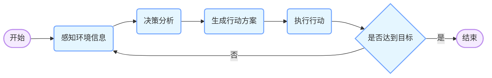

# AI Agent在企业数字化转型中的角色：从战略到执行

> 关键词：AI Agent、企业数字化转型、战略规划、执行落地、智能决策

> 摘要：本文深入探讨了AI Agent在企业数字化转型中的关键角色，从战略规划到具体执行层面进行了全面分析。详细阐述了AI Agent的核心概念、算法原理、数学模型等基础知识，并通过项目实战案例展示了其在实际应用中的具体实现和效果。同时，介绍了AI Agent在不同企业场景下的应用，推荐了相关的学习资源、开发工具和研究论文。最后对AI Agent在企业数字化转型中的未来发展趋势与挑战进行了总结，旨在为企业利用AI Agent推动数字化转型提供全面的指导和参考。

## 1. 背景介绍 
### 1.1 目的和范围
在当今数字化浪潮席卷全球的时代，企业数字化转型已成为企业生存和发展的必由之路。AI Agent作为人工智能领域的一项重要技术，正逐渐在企业数字化转型中发挥着关键作用。本文的目的在于深入探讨AI Agent在企业数字化转型过程中从战略规划到执行落地的各个环节所扮演的角色，分析其原理、应用场景及实现方法，为企业在数字化转型中合理运用AI Agent提供全面的理论支持和实践指导。

本文的范围涵盖了AI Agent的核心概念、算法原理、数学模型、项目实战案例、实际应用场景以及相关的学习资源和研究成果等方面，旨在为读者提供一个系统、全面的关于AI Agent在企业数字化转型中应用的知识体系。

### 1.2 预期读者
本文预期读者主要包括企业的高层管理人员、数字化转型项目负责人、技术研发人员以及对人工智能和企业数字化转型感兴趣的专业人士。对于企业高层管理人员，本文可以帮助他们了解AI Agent在企业战略规划中的重要性和应用价值，为企业数字化转型决策提供参考；对于数字化转型项目负责人，本文可以提供具体的实施方法和案例借鉴，指导项目的顺利开展；对于技术研发人员，本文可以深入讲解AI Agent的技术原理和实现细节，为他们的技术创新提供思路；对于对人工智能和企业数字化转型感兴趣的专业人士，本文可以作为一个学习和了解相关知识的入门指南。

### 1.3 文档结构概述
本文将按照以下结构进行组织：
- 核心概念与联系：介绍AI Agent的基本概念、原理和架构，通过文本示意图和Mermaid流程图进行直观展示。
- 核心算法原理 & 具体操作步骤：详细讲解AI Agent所涉及的核心算法原理，并使用Python源代码进行具体实现和步骤说明。
- 数学模型和公式 & 详细讲解 & 举例说明：运用数学模型和公式对AI Agent的原理进行深入分析，并通过具体例子进行说明。
- 项目实战：代码实际案例和详细解释说明：通过一个实际的项目案例，展示AI Agent在企业数字化转型中的具体应用，包括开发环境搭建、源代码实现和代码解读。
- 实际应用场景：介绍AI Agent在企业不同业务场景下的实际应用，如客户服务、生产管理、市场营销等。
- 工具和资源推荐：推荐与AI Agent相关的学习资源、开发工具和研究论文，帮助读者进一步深入学习和研究。
- 总结：未来发展趋势与挑战：对AI Agent在企业数字化转型中的未来发展趋势进行展望，并分析可能面临的挑战。
- 附录：常见问题与解答：解答读者在学习和应用AI Agent过程中可能遇到的常见问题。
- 扩展阅读 & 参考资料：提供相关的扩展阅读资料和参考文献，方便读者进一步深入研究。

### 1.4 术语表
#### 1.4.1 核心术语定义
- **AI Agent（人工智能代理）**：是一种能够感知环境、进行决策并采取行动以实现特定目标的智能实体。它可以自主地与环境进行交互，根据环境的变化动态调整自己的行为。
- **企业数字化转型**：指企业利用数字技术对业务流程、组织架构、商业模式等进行全面改造和升级，以提高企业的运营效率、创新能力和竞争力。
- **战略规划**：是企业为实现长期发展目标而制定的总体计划和策略，包括市场定位、产品规划、资源配置等方面。
- **执行落地**：是将战略规划转化为具体行动和实际成果的过程，包括项目实施、资源调配、监控评估等环节。

#### 1.4.2 相关概念解释
- **智能决策**：指利用人工智能技术对大量数据进行分析和处理，为决策者提供科学、准确的决策建议。
- **机器学习**：是人工智能的一个重要分支，通过让计算机从数据中学习模式和规律，从而实现对未知数据的预测和分类。
- **深度学习**：是机器学习的一种特殊形式，通过构建深层神经网络模型，自动提取数据中的特征和模式，具有强大的学习和表达能力。

#### 1.4.3 缩略词列表
- **AI（Artificial Intelligence）**：人工智能
- **ML（Machine Learning）**：机器学习
- **DL（Deep Learning）**：深度学习
- **RL（Reinforcement Learning）**：强化学习

## 2. 核心概念与联系 

### 2.1 AI Agent的基本概念
AI Agent是一种具有自主性、反应性、社会性和主动性的智能实体。自主性意味着AI Agent能够独立地感知环境、进行决策和采取行动，不需要人类的实时干预；反应性表示AI Agent能够对环境的变化做出及时的响应；社会性体现了AI Agent可以与其他Agent或人类进行交互和协作；主动性则强调AI Agent能够主动地追求目标，积极地探索和利用环境资源。

### 2.2 AI Agent的原理和架构
AI Agent的基本原理是基于感知 - 决策 - 行动的循环过程。首先，AI Agent通过传感器感知环境信息，然后将这些信息输入到决策模块中进行分析和处理，根据预设的目标和策略生成相应的行动方案，最后通过执行器将行动方案付诸实践。行动的结果会反馈到环境中，环境的变化又会被AI Agent感知，从而开始新的循环。

AI Agent的架构通常包括感知模块、决策模块和执行模块三个部分。感知模块负责收集环境信息，如传感器数据、文本信息、图像信息等；决策模块根据感知到的信息进行分析和推理，选择最优的行动方案；执行模块将决策模块生成的行动方案转化为具体的行动，如控制机器人运动、发送消息等。

### 2.3 文本示意图
```plaintext
+----------------+         +----------------+         +----------------+
|    感知模块    | -------> |    决策模块    | -------> |    执行模块    |
+----------------+         +----------------+         +----------------+
          ^                                              |
          |                                              |
          |                                              v
      环境信息                                       行动结果
```

### 2.4 Mermaid流程图


## 3. 核心算法原理 & 具体操作步骤 

### 3.1 机器学习算法原理
机器学习是AI Agent实现智能决策的重要手段之一。常见的机器学习算法包括监督学习、无监督学习和强化学习。

#### 3.1.1 监督学习
监督学习是指在训练过程中，模型通过学习输入数据和对应的标签之间的映射关系，从而能够对新的输入数据进行预测。以线性回归为例，其目标是找到一条最佳的直线来拟合数据点，使得预测值与真实值之间的误差最小。

以下是一个简单的线性回归的Python代码示例：
```python
import numpy as np
from sklearn.linear_model import LinearRegression

# 生成示例数据
X = np.array([[1], [2], [3], [4], [5]])
y = np.array([2, 4, 6, 8, 10])

# 创建线性回归模型
model = LinearRegression()

# 训练模型
model.fit(X, y)

# 预测新数据
new_X = np.array([[6]])
prediction = model.predict(new_X)
print("预测结果:", prediction)
```

#### 3.1.2 无监督学习
无监督学习是指在训练过程中，模型没有对应的标签，而是通过对输入数据的特征进行挖掘和分析，发现数据中的潜在结构和模式。以聚类算法为例，其目标是将数据点划分为不同的簇，使得同一簇内的数据点相似度较高，不同簇之间的数据点相似度较低。

以下是一个简单的K-Means聚类的Python代码示例：
```python
import numpy as np
from sklearn.cluster import KMeans
import matplotlib.pyplot as plt

# 生成示例数据
X = np.array([[1, 2], [2, 3], [4, 5], [5, 6], [8, 9], [9, 10]])

# 创建K-Means模型
kmeans = KMeans(n_clusters=2)

# 训练模型
kmeans.fit(X)

# 获取聚类标签
labels = kmeans.labels_

# 可视化聚类结果
plt.scatter(X[:, 0], X[:, 1], c=labels)
plt.show()
```

#### 3.1.3 强化学习
强化学习是指智能体通过与环境进行交互，不断尝试不同的行动，根据环境反馈的奖励信号来学习最优的行动策略。以Q学习算法为例，其核心思想是通过不断更新Q值表，使得智能体能够选择在当前状态下获得最大长期奖励的行动。

以下是一个简单的Q学习算法的Python代码示例：
```python
import numpy as np

# 定义环境
num_states = 5
num_actions = 2
reward_matrix = np.array([[0, 1], [1, 0], [0, 1], [1, 0], [0, 1]])

# 初始化Q值表
Q = np.zeros((num_states, num_actions))

# 定义超参数
alpha = 0.1  # 学习率
gamma = 0.9  # 折扣因子
num_episodes = 100

# Q学习算法
for episode in range(num_episodes):
    state = 0
    done = False
    while not done:
        # 选择行动
        action = np.argmax(Q[state, :])

        # 执行行动，获取奖励和下一个状态
        reward = reward_matrix[state, action]
        next_state = state + 1 if state < num_states - 1 else state

        # 更新Q值表
        Q[state, action] = (1 - alpha) * Q[state, action] + alpha * (reward + gamma * np.max(Q[next_state, :]))

        # 更新状态
        state = next_state

        if state == num_states - 1:
            done = True

print("最终的Q值表:", Q)
```

### 3.2 具体操作步骤
#### 3.2.1 数据收集与预处理
首先，需要收集与企业业务相关的数据，如客户信息、销售数据、生产数据等。然后对收集到的数据进行预处理，包括数据清洗、数据转换、特征提取等操作，以提高数据的质量和可用性。

#### 3.2.2 模型选择与训练
根据具体的业务需求和数据特点，选择合适的机器学习算法和模型。然后使用预处理后的数据对模型进行训练，调整模型的参数，使得模型能够达到较好的性能。

#### 3.2.3 模型评估与优化
使用测试数据对训练好的模型进行评估，计算模型的准确率、召回率、F1值等指标，评估模型的性能。如果模型的性能不理想，可以对模型进行优化，如调整模型的参数、增加训练数据、更换算法等。

#### 3.2.4 模型部署与应用
将训练好的模型部署到实际的生产环境中，与企业的业务系统进行集成，实现AI Agent的功能。在实际应用过程中，需要对模型进行实时监控和维护，及时发现和解决问题。

## 4. 数学模型和公式 & 详细讲解 & 举例说明 

### 4.1 线性回归的数学模型和公式
线性回归的数学模型可以表示为：
$$y = \theta_0 + \theta_1x_1 + \theta_2x_2 + \cdots + \theta_nx_n + \epsilon$$
其中，$y$ 是因变量，$x_1, x_2, \cdots, x_n$ 是自变量，$\theta_0, \theta_1, \theta_2, \cdots, \theta_n$ 是模型的参数，$\epsilon$ 是误差项。

线性回归的目标是找到一组最优的参数 $\theta$，使得预测值与真实值之间的误差最小。通常使用最小二乘法来求解参数 $\theta$，其损失函数可以表示为：
$$J(\theta) = \frac{1}{2m}\sum_{i=1}^{m}(h_{\theta}(x^{(i)}) - y^{(i)})^2$$
其中，$m$ 是样本数量，$h_{\theta}(x^{(i)})$ 是第 $i$ 个样本的预测值，$y^{(i)}$ 是第 $i$ 个样本的真实值。

通过对损失函数 $J(\theta)$ 求偏导数，并令其等于0，可以得到参数 $\theta$ 的最优解。

#### 举例说明
假设有一组数据 $(x_1, y_1), (x_2, y_2), \cdots, (x_m, y_m)$，我们要使用线性回归模型来拟合这些数据。首先，我们可以将数据表示为矩阵形式：
$$X = \begin{bmatrix}
1 & x_1 \\
1 & x_2 \\
\vdots & \vdots \\
1 & x_m
\end{bmatrix}, \quad y = \begin{bmatrix}
y_1 \\
y_2 \\
\vdots \\
y_m
\end{bmatrix}$$
然后，根据最小二乘法的公式，参数 $\theta$ 的最优解可以表示为：
$$\theta = (X^TX)^{-1}X^Ty$$

以下是一个使用Python实现线性回归的示例代码：
```python
import numpy as np

# 生成示例数据
X = np.array([[1, 1], [1, 2], [1, 3], [1, 4], [1, 5]])
y = np.array([2, 4, 6, 8, 10])

# 计算参数 theta
theta = np.linalg.inv(X.T.dot(X)).dot(X.T).dot(y)
print("参数 theta:", theta)
```

### 4.2 强化学习的数学模型和公式
强化学习的数学模型通常使用马尔可夫决策过程（MDP）来描述。一个MDP可以表示为一个五元组 $(S, A, P, R, \gamma)$，其中：
- $S$ 是状态空间，表示智能体可能处于的所有状态的集合。
- $A$ 是动作空间，表示智能体可以采取的所有动作的集合。
- $P$ 是状态转移概率函数，表示在状态 $s$ 下采取动作 $a$ 后转移到状态 $s'$ 的概率，即 $P(s'|s, a)$。
- $R$ 是奖励函数，表示在状态 $s$ 下采取动作 $a$ 后获得的即时奖励，即 $R(s, a)$。
- $\gamma$ 是折扣因子，取值范围为 $[0, 1]$，用于衡量未来奖励的重要性。

强化学习的目标是找到一个最优的策略 $\pi$，使得智能体在与环境交互的过程中获得的累积奖励最大。累积奖励可以表示为：
$$G_t = R_{t+1} + \gamma R_{t+2} + \gamma^2 R_{t+3} + \cdots$$
其中，$R_{t+1}, R_{t+2}, R_{t+3}, \cdots$ 是智能体在时间步 $t+1, t+2, t+3, \cdots$ 获得的奖励。

Q学习算法是一种基于值函数的强化学习算法，其核心思想是通过不断更新Q值表来学习最优的策略。Q值表示在状态 $s$ 下采取动作 $a$ 后获得的最大累积奖励，即 $Q(s, a)$。Q学习算法的更新公式可以表示为：
$$Q(s_t, a_t) \leftarrow Q(s_t, a_t) + \alpha [R_{t+1} + \gamma \max_{a} Q(s_{t+1}, a) - Q(s_t, a_t)]$$
其中，$\alpha$ 是学习率，用于控制每次更新的步长。

#### 举例说明
假设有一个简单的网格世界环境，智能体的目标是从起点移动到终点。环境的状态空间 $S$ 是网格中的所有位置，动作空间 $A$ 是上下左右四个方向。奖励函数 $R$ 定义为：到达终点获得奖励1，其他情况获得奖励0。

以下是一个使用Python实现Q学习算法的示例代码：
```python
import numpy as np

# 定义环境
num_states = 9
num_actions = 4
reward_matrix = np.zeros((num_states, num_actions))
reward_matrix[8, :] = 1  # 终点位置获得奖励1

# 初始化Q值表
Q = np.zeros((num_states, num_actions))

# 定义超参数
alpha = 0.1  # 学习率
gamma = 0.9  # 折扣因子
num_episodes = 100

# Q学习算法
for episode in range(num_episodes):
    state = 0
    done = False
    while not done:
        # 选择行动
        action = np.argmax(Q[state, :])

        # 执行行动，获取奖励和下一个状态
        if action == 0:  # 上
            next_state = state - 3 if state >= 3 else state
        elif action == 1:  # 下
            next_state = state + 3 if state < 6 else state
        elif action == 2:  # 左
            next_state = state - 1 if state % 3!= 0 else state
        elif action == 3:  # 右
            next_state = state + 1 if (state + 1) % 3!= 0 else state

        reward = reward_matrix[state, action]

        # 更新Q值表
        Q[state, action] = (1 - alpha) * Q[state, action] + alpha * (reward + gamma * np.max(Q[next_state, :]))

        # 更新状态
        state = next_state

        if state == 8:
            done = True

print("最终的Q值表:", Q)
```

## 5. 项目实战：代码实际案例和详细解释说明 

### 5.1  开发环境搭建
本项目使用Python作为开发语言，需要安装以下必要的库：
- `numpy`：用于数值计算和数组操作。
- `pandas`：用于数据处理和分析。
- `scikit-learn`：用于机器学习算法的实现和模型评估。
- `tensorflow` 或 `pytorch`：用于深度学习模型的开发和训练。

可以使用以下命令来安装这些库：
```bash
pip install numpy pandas scikit-learn tensorflow
```

### 5.2  源代码详细实现和代码解读
本项目以客户流失预测为例，展示AI Agent在企业数字化转型中的应用。客户流失预测是企业客户关系管理中的一个重要问题，通过预测哪些客户可能会流失，企业可以采取相应的措施来挽留客户。

以下是一个完整的客户流失预测项目的Python代码示例：
```python
import numpy as np
import pandas as pd
from sklearn.model_selection import train_test_split
from sklearn.preprocessing import StandardScaler
from sklearn.linear_model import LogisticRegression
from sklearn.metrics import accuracy_score

# 加载数据
data = pd.read_csv('customer_churn.csv')

# 数据预处理
# 提取特征和标签
X = data.drop('Churn', axis=1)
y = data['Churn']

# 处理类别特征
X = pd.get_dummies(X)

# 数据划分
X_train, X_test, y_train, y_test = train_test_split(X, y, test_size=0.2, random_state=42)

# 数据标准化
scaler = StandardScaler()
X_train = scaler.fit_transform(X_train)
X_test = scaler.transform(X_test)

# 创建模型
model = LogisticRegression()

# 训练模型
model.fit(X_train, y_train)

# 预测
y_pred = model.predict(X_test)

# 评估模型
accuracy = accuracy_score(y_test, y_pred)
print("模型准确率:", accuracy)
```

### 5.3  代码解读与分析
#### 5.3.1 数据加载与预处理
- `pd.read_csv('customer_churn.csv')`：使用 `pandas` 库的 `read_csv` 函数加载客户流失数据集。
- `X = data.drop('Churn', axis=1)` 和 `y = data['Churn']`：将数据集分为特征矩阵 $X$ 和标签向量 $y$。
- `pd.get_dummies(X)`：使用 `pandas` 库的 `get_dummies` 函数对类别特征进行独热编码，将其转换为数值特征。
- `train_test_split(X, y, test_size=0.2, random_state=42)`：使用 `sklearn` 库的 `train_test_split` 函数将数据集划分为训练集和测试集，测试集占比为20%。
- `StandardScaler()`：使用 `sklearn` 库的 `StandardScaler` 类对特征矩阵进行标准化处理，使得特征具有零均值和单位方差。

#### 5.3.2 模型创建与训练
- `LogisticRegression()`：使用 `sklearn` 库的 `LogisticRegression` 类创建逻辑回归模型。
- `model.fit(X_train, y_train)`：使用训练集对模型进行训练。

#### 5.3.3 模型预测与评估
- `model.predict(X_test)`：使用训练好的模型对测试集进行预测，得到预测结果 $y_{pred}$。
- `accuracy_score(y_test, y_pred)`：使用 `sklearn` 库的 `accuracy_score` 函数计算模型的准确率，即预测正确的样本数占总样本数的比例。

## 6. 实际应用场景 
### 6.1 客户服务
AI Agent可以在客户服务领域发挥重要作用。例如，智能客服机器人可以自动回答客户的常见问题，提供快速、准确的服务。通过自然语言处理技术，智能客服机器人可以理解客户的问题，并根据预设的规则或机器学习模型给出相应的回答。此外，AI Agent还可以对客户的问题进行分类和优先级排序，将复杂的问题转接给人工客服，提高客户服务的效率和质量。

### 6.2 生产管理
在生产管理方面，AI Agent可以实时监控生产设备的运行状态，预测设备故障，提前进行维护和保养，减少设备停机时间，提高生产效率。同时，AI Agent还可以根据生产计划和原材料库存情况，自动调整生产流程和资源分配，实现生产过程的优化和智能化管理。

### 6.3 市场营销
AI Agent可以帮助企业进行精准的市场营销。通过对客户数据的分析和挖掘，AI Agent可以了解客户的偏好和需求，为客户提供个性化的营销推荐。例如，电商平台可以根据用户的浏览历史和购买记录，向用户推荐符合其兴趣的商品。此外，AI Agent还可以对市场趋势进行预测，为企业的市场营销策略制定提供决策支持。

### 6.4 财务风险管理
在财务风险管理方面，AI Agent可以对企业的财务数据进行实时监测和分析，识别潜在的风险因素。例如，通过对企业的财务报表、现金流数据等进行分析，AI Agent可以预测企业的财务状况和偿债能力，提前发现财务风险，并提供相应的预警和建议。同时，AI Agent还可以对市场风险、信用风险等进行评估和管理，帮助企业降低财务风险。

## 7. 工具和资源推荐
### 7.1 学习资源推荐
#### 7.1.1 书籍推荐
- 《人工智能：一种现代的方法》：这是一本经典的人工智能教材，全面介绍了人工智能的各个领域，包括搜索算法、知识表示、机器学习、自然语言处理等。
- 《机器学习》：周志华著，本书系统地介绍了机器学习的基本概念、算法和应用，是学习机器学习的优秀教材。
- 《深度学习》：Ian Goodfellow、Yoshua Bengio和Aaron Courville著，本书是深度学习领域的权威著作，详细介绍了深度学习的理论和实践。

#### 7.1.2 在线课程
- Coursera上的“机器学习”课程：由Andrew Ng教授主讲，是一门非常受欢迎的机器学习入门课程，涵盖了机器学习的基本概念、算法和应用。
- edX上的“人工智能基础”课程：由麻省理工学院（MIT）开设，介绍了人工智能的基本原理和方法，包括搜索算法、知识表示、机器学习等。
- 吴恩达深度学习专项课程：在Coursera上提供，包括深度学习基础、卷积神经网络、循环神经网络等多个课程，深入讲解了深度学习的理论和实践。

#### 7.1.3 技术博客和网站
- Medium：一个知名的技术博客平台，上面有很多关于人工智能、机器学习、深度学习等领域的优秀文章。
- Towards Data Science：专注于数据科学和人工智能领域的博客，提供了很多实用的技术文章和案例分析。
- arXiv：一个预印本数据库，收录了大量的学术论文，涵盖了人工智能、机器学习、深度学习等多个领域。

### 7.2 开发工具框架推荐
#### 7.2.1 IDE和编辑器
- PyCharm：一款专业的Python集成开发环境（IDE），提供了丰富的代码编辑、调试、测试等功能，适合Python项目的开发。
- Jupyter Notebook：一个交互式的开发环境，支持Python、R等多种编程语言，适合数据科学和机器学习项目的开发和实验。
- Visual Studio Code：一款轻量级的代码编辑器，支持多种编程语言和插件扩展，具有丰富的功能和良好的用户体验。

#### 7.2.2 调试和性能分析工具
- TensorBoard：TensorFlow提供的可视化工具，可以用于可视化训练过程中的损失函数、准确率等指标，帮助开发者调试和优化模型。
- PyTorch Profiler：PyTorch提供的性能分析工具，可以用于分析模型的运行时间、内存使用等情况，帮助开发者优化模型的性能。
- cProfile：Python内置的性能分析工具，可以用于分析Python程序的运行时间和函数调用情况，帮助开发者找出性能瓶颈。

#### 7.2.3 相关框架和库
- TensorFlow：一个开源的深度学习框架，提供了丰富的工具和接口，支持多种深度学习模型的开发和训练。
- PyTorch：另一个开源的深度学习框架，具有简洁易用的接口和强大的动态图功能，受到了很多研究者和开发者的喜爱。
- Scikit-learn：一个用于机器学习的Python库，提供了丰富的机器学习算法和工具，包括分类、回归、聚类等算法，适合初学者和快速原型开发。

### 7.3 相关论文著作推荐
#### 7.3.1 经典论文
- “A Logical Calculus of the Ideas Immanent in Nervous Activity”：Warren S. McCulloch和Walter Pitts于1943年发表的论文，提出了人工神经网络的基本概念。
- “Learning Representations by Back-propagating Errors”：David E. Rumelhart、Geoffrey E. Hinton和Ronald J. Williams于1986年发表的论文，介绍了反向传播算法，推动了神经网络的发展。
- “Playing Atari with Deep Reinforcement Learning”：Volodymyr Mnih等人于2013年发表的论文，提出了深度Q网络（DQN）算法，在强化学习领域取得了重要突破。

#### 7.3.2 最新研究成果
- OpenAI的相关研究：OpenAI是一家知名的人工智能研究机构，其发布的研究成果如GPT系列模型、DALL-E等在自然语言处理和图像生成领域引起了广泛关注。
- Google Brain的研究：Google Brain团队在深度学习、强化学习等领域开展了很多前沿研究，其研究成果对人工智能的发展产生了重要影响。

#### 7.3.3 应用案例分析
- 《AI Superpowers: China, Silicon Valley, and the New World Order》：李开复著，本书通过大量的案例分析，介绍了人工智能在各个领域的应用和发展趋势。
- 《Artificial Intelligence in Practice: How 50 Successful Companies Used AI to Solve Problems》：Thomas H. Davenport和Rajeev Ronanki著，本书介绍了50家成功企业如何应用人工智能解决实际问题的案例。

## 8. 总结：未来发展趋势与挑战
### 8.1 未来发展趋势
#### 8.1.1 与其他技术的融合
AI Agent将与物联网、大数据、云计算等技术深度融合，实现更加智能化的企业运营和管理。例如，通过物联网设备收集大量的实时数据，AI Agent可以对这些数据进行分析和处理，实现对生产设备的实时监控和智能控制；结合云计算的强大计算能力，AI Agent可以处理更复杂的任务和模型，提高决策的准确性和效率。

#### 8.1.2 强化学习和自主决策能力的提升
未来，AI Agent的强化学习和自主决策能力将不断提升。通过强化学习算法，AI Agent可以在复杂的环境中不断学习和优化自己的策略，实现更加自主和智能的决策。例如，在自动驾驶领域，AI Agent可以通过强化学习不断提高自己的驾驶技能，实现更加安全和高效的自动驾驶。

#### 8.1.3 多Agent系统的发展
多Agent系统将成为未来AI Agent发展的一个重要方向。多个AI Agent可以通过协作和竞争的方式，共同完成复杂的任务。例如，在供应链管理中，多个AI Agent可以分别负责采购、生产、物流等环节，通过协作实现供应链的优化和高效运作。

### 8.2 挑战
#### 8.2.1 数据隐私和安全问题
AI Agent的运行依赖于大量的数据，而这些数据往往包含了企业和用户的敏感信息。因此，数据隐私和安全问题成为了AI Agent发展面临的一个重要挑战。企业需要采取有效的措施来保护数据的隐私和安全，防止数据泄露和滥用。

#### 8.2.2 算法可解释性问题
目前，很多AI Agent所使用的算法，如深度学习算法，具有较高的复杂性和黑盒性，难以解释其决策过程和结果。这给企业的决策和监管带来了一定的困难。因此，提高算法的可解释性是未来AI Agent发展需要解决的一个重要问题。

#### 8.2.3 伦理和法律问题
随着AI Agent在企业数字化转型中的广泛应用，伦理和法律问题也日益凸显。例如，AI Agent的决策可能会对人类产生影响，如何确保AI Agent的决策符合伦理和法律要求是一个需要深入研究的问题。同时，在AI Agent的开发和应用过程中，也需要明确责任归属和法律规范。

## 9. 附录：常见问题与解答
### 9.1 什么是AI Agent？
AI Agent是一种能够感知环境、进行决策并采取行动以实现特定目标的智能实体。它可以自主地与环境进行交互，根据环境的变化动态调整自己的行为。

### 9.2 AI Agent与传统软件有什么区别？
传统软件通常是按照预设的规则和流程运行，缺乏自主性和适应性。而AI Agent具有自主性、反应性、社会性和主动性等特点，能够根据环境的变化自主地进行决策和行动，具有更强的智能和适应性。

### 9.3 AI Agent在企业数字化转型中有哪些应用场景？
AI Agent在企业数字化转型中有很多应用场景，如客户服务、生产管理、市场营销、财务风险管理等。在客户服务领域，AI Agent可以作为智能客服机器人自动回答客户的问题；在生产管理方面，AI Agent可以实时监控生产设备的运行状态，预测设备故障；在市场营销领域，AI Agent可以帮助企业进行精准的营销推荐；在财务风险管理方面，AI Agent可以对企业的财务数据进行实时监测和分析，识别潜在的风险因素。

### 9.4 如何开发一个AI Agent？
开发一个AI Agent通常需要以下步骤：
1. 明确AI Agent的目标和任务。
2. 收集和预处理相关的数据。
3. 选择合适的算法和模型，如机器学习算法、深度学习算法等。
4. 使用收集到的数据对模型进行训练和优化。
5. 将训练好的模型部署到实际的生产环境中，并进行实时监控和维护。

### 9.5 AI Agent的发展面临哪些挑战？
AI Agent的发展面临着数据隐私和安全问题、算法可解释性问题、伦理和法律问题等挑战。数据隐私和安全问题需要企业采取有效的措施来保护数据的隐私和安全；算法可解释性问题需要提高算法的透明度和可解释性；伦理和法律问题需要明确AI Agent的责任归属和法律规范。

## 10. 扩展阅读 & 参考资料
### 10.1 扩展阅读
- 《智能时代》：吴军著，本书介绍了人工智能的发展历程、技术原理和应用场景，探讨了人工智能对社会和人类的影响。
- 《奇点临近》：雷·库兹韦尔著，本书提出了奇点理论，预测了人工智能和技术发展的未来趋势。
- 《人类简史：从动物到上帝》：尤瓦尔·赫拉利著，本书从人类的进化和发展角度，探讨了人工智能对人类社会的影响和挑战。

### 10.2 参考资料
- 相关的学术论文和研究报告，可以在IEEE Xplore、ACM Digital Library等学术数据库中查找。
- 人工智能相关的开源项目和代码库，如GitHub上的TensorFlow、PyTorch等项目。
- 企业的官方网站和技术博客，如Google AI、Microsoft AI等，这些网站会发布最新的技术成果和应用案例。

作者：AI天才研究院/AI Genius Institute & 禅与计算机程序设计艺术 /Zen And The Art of Computer Programming