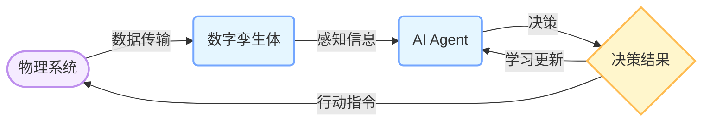

# AI Agent在企业数字孪生技术中的应用

> 关键词：AI Agent、企业数字孪生技术、智能决策、自动化流程、数据交互、应用场景、未来趋势

> 摘要：本文深入探讨了AI Agent在企业数字孪生技术中的应用。首先介绍了相关背景，包括目的范围、预期读者等内容。接着阐述了AI Agent和企业数字孪生技术的核心概念与联系，通过文本示意图和Mermaid流程图进行直观展示。详细讲解了核心算法原理及具体操作步骤，并用Python代码进行说明。同时给出了相关的数学模型和公式，并举例解释。通过项目实战，展示了开发环境搭建、源代码实现与解读。分析了AI Agent在企业数字孪生技术中的实际应用场景，推荐了学习资源、开发工具框架和相关论文著作。最后总结了未来发展趋势与挑战，还提供了常见问题解答和扩展阅读参考资料，旨在为企业更好地利用AI Agent推动数字孪生技术发展提供全面的技术指导。

## 1. 背景介绍 
### 1.1 目的和范围
随着数字化转型的加速，企业对于高效、智能的运营管理需求日益增长。企业数字孪生技术作为一种将物理系统映射到虚拟空间的重要手段，能够为企业提供实时监测、预测分析等功能。而AI Agent作为具备自主决策和行动能力的智能实体，其在企业数字孪生技术中的应用可以进一步提升数字孪生系统的智能化水平和决策能力。

本文的目的在于全面探讨AI Agent在企业数字孪生技术中的应用，涵盖从核心概念、算法原理到实际应用场景等多个方面。范围包括对AI Agent和企业数字孪生技术的基本原理介绍，AI Agent在数字孪生系统中的具体实现方法，以及如何利用AI Agent解决企业在生产、管理等方面的实际问题。

### 1.2 预期读者
本文预期读者主要包括企业数字化转型相关的管理人员、技术人员，如CTO、CIO、软件工程师、数据分析师等。对于对人工智能和数字孪生技术感兴趣的研究人员和学者，本文也提供了深入的技术分析和应用案例，具有一定的参考价值。

### 1.3 文档结构概述
本文按照以下结构进行组织：
- 核心概念与联系：介绍AI Agent和企业数字孪生技术的基本概念，以及它们之间的联系，并通过文本示意图和Mermaid流程图进行直观展示。
- 核心算法原理 & 具体操作步骤：详细讲解AI Agent在企业数字孪生技术中应用的核心算法原理，并用Python代码进行具体实现。
- 数学模型和公式 & 详细讲解 & 举例说明：给出相关的数学模型和公式，并通过具体例子进行解释。
- 项目实战：通过一个实际项目案例，展示开发环境搭建、源代码实现和代码解读。
- 实际应用场景：分析AI Agent在企业数字孪生技术中的实际应用场景。
- 工具和资源推荐：推荐学习资源、开发工具框架和相关论文著作。
- 总结：总结未来发展趋势与挑战。
- 附录：提供常见问题解答。
- 扩展阅读 & 参考资料：列出相关的扩展阅读内容和参考资料。

### 1.4 术语表
#### 1.4.1 核心术语定义
- **AI Agent**：是一种能够感知环境、根据感知信息进行决策并采取行动的智能实体。它可以是软件程序、机器人等，具备自主学习和适应环境变化的能力。
- **企业数字孪生技术**：将企业的物理系统（如生产设备、供应链等）在虚拟空间中创建一个与之对应的数字模型，通过实时数据交互，实现对物理系统的监测、分析、预测和优化。
- **数字孪生体**：即企业物理系统在虚拟空间中的数字模型，它与物理系统保持实时同步，反映物理系统的状态和行为。

#### 1.4.2 相关概念解释
- **自主决策**：AI Agent能够根据自身的感知和内置的规则或学习到的知识，独立做出决策，而不需要人工干预。
- **数据交互**：数字孪生体与物理系统之间通过传感器、网络等手段进行数据的实时传输和共享，以保证数字孪生体的准确性和实时性。

#### 1.4.3 缩略词列表
- **AI**：Artificial Intelligence，人工智能
- **DT**：Digital Twin，数字孪生

## 2. 核心概念与联系 

### 2.1 AI Agent的核心概念
AI Agent是人工智能领域中的一个重要概念，它可以被看作是一个具有自主行为能力的智能个体。AI Agent通常由感知模块、决策模块和行动模块组成。感知模块负责收集环境信息，决策模块根据感知到的信息进行分析和推理，做出决策，行动模块则根据决策结果采取相应的行动。

### 2.2 企业数字孪生技术的核心概念
企业数字孪生技术是将企业的物理实体在虚拟空间中进行精确映射，形成一个数字孪生体。这个数字孪生体与物理实体之间通过数据交互实现实时同步，能够反映物理实体的状态、性能和行为。通过对数字孪生体的分析和模拟，可以预测物理实体的未来状态，优化物理实体的运行过程。

### 2.3 两者的联系
AI Agent可以与企业数字孪生技术紧密结合。在企业数字孪生系统中，AI Agent可以作为数字孪生体的智能控制单元，根据数字孪生体反映的物理系统状态进行实时决策和控制。例如，AI Agent可以根据生产设备的数字孪生体提供的运行数据，自动调整生产参数，以提高生产效率和质量。

### 2.4 文本示意图
```plaintext
物理系统 <---- 数据交互 ----> 数字孪生体
                   |
                   | 感知信息
                   v
              AI Agent
              |     |
              | 决策 |
              v     v
          行动指令  学习更新
              |
              v
物理系统（控制调整）
```

### 2.5 Mermaid流程图


## 3. 核心算法原理 & 具体操作步骤 

### 3.1 核心算法原理
在AI Agent应用于企业数字孪生技术中，常用的算法包括强化学习算法。强化学习是一种通过智能体与环境进行交互，不断尝试不同的行动，并根据环境反馈的奖励信号来学习最优策略的算法。

以Q - learning算法为例，其核心思想是通过一个Q表来存储每个状态 - 行动对的价值。智能体在每个时间步根据当前状态选择一个行动，执行该行动后，环境会反馈一个奖励和下一个状态。智能体根据奖励和下一个状态更新Q表，以逐步找到最优的行动策略。

### 3.2 Python代码实现
```python
import numpy as np

# 定义环境参数
num_states = 10
num_actions = 4
gamma = 0.9  # 折扣因子
alpha = 0.1  # 学习率

# 初始化Q表
Q = np.zeros((num_states, num_actions))

# 定义Q - learning算法
def q_learning(state, action, reward, next_state):
    max_q_next = np.max(Q[next_state, :])
    Q[state, action] = Q[state, action] + alpha * (reward + gamma * max_q_next - Q[state, action])
    return Q

# 模拟智能体与环境的交互
state = 0
for episode in range(100):
    action = np.argmax(Q[state, :])  # 根据Q表选择行动
    # 这里简单模拟环境反馈
    next_state = (state + action) % num_states
    reward = 1 if next_state > state else -1
    Q = q_learning(state, action, reward, next_state)
    state = next_state

print("最终的Q表：")
print(Q)
```

### 3.3 具体操作步骤
1. **环境建模**：将企业数字孪生系统中的物理系统抽象为一个环境，定义状态空间、行动空间和奖励函数。
2. **初始化Q表**：根据状态空间和行动空间的大小，初始化一个Q表，用于存储每个状态 - 行动对的价值。
3. **智能体与环境交互**：智能体在每个时间步根据当前状态从Q表中选择一个行动，执行该行动后，环境反馈一个奖励和下一个状态。
4. **更新Q表**：根据奖励和下一个状态，使用Q - learning算法更新Q表。
5. **重复步骤3和4**：不断重复智能体与环境的交互和Q表的更新过程，直到达到收敛条件。

## 4. 数学模型和公式 & 详细讲解 & 举例说明 

### 4.1 Q - learning算法的数学模型
Q - learning算法的核心公式为：
$$Q(s_t, a_t) \leftarrow Q(s_t, a_t) + \alpha \left[ r_{t+1} + \gamma \max_{a} Q(s_{t+1}, a) - Q(s_t, a_t) \right]$$
其中：
- $s_t$ 表示时间步 $t$ 的状态。
- $a_t$ 表示时间步 $t$ 采取的行动。
- $r_{t+1}$ 表示执行行动 $a_t$ 后在时间步 $t + 1$ 获得的奖励。
- $s_{t+1}$ 表示时间步 $t + 1$ 的状态。
- $\alpha$ 是学习率，控制每次更新的步长。
- $\gamma$ 是折扣因子，用于权衡当前奖励和未来奖励的重要性。

### 4.2 详细讲解
- **$Q(s_t, a_t)$**：表示在状态 $s_t$ 下采取行动 $a_t$ 的价值估计。
- **$r_{t+1} + \gamma \max_{a} Q(s_{t+1}, a)$**：是目标价值，即执行行动 $a_t$ 后获得的即时奖励 $r_{t+1}$ 加上未来可能获得的最大价值的折扣值。
- **$r_{t+1} + \gamma \max_{a} Q(s_{t+1}, a) - Q(s_t, a_t)$**：是时间差分误差，表示当前估计值与目标价值之间的差距。
- **$\alpha$**：学习率 $\alpha$ 控制了每次更新的幅度。如果 $\alpha$ 过大，可能会导致算法不稳定；如果 $\alpha$ 过小，算法收敛速度会很慢。
- **$\gamma$**：折扣因子 $\gamma$ 决定了未来奖励的重要性。$\gamma$ 越接近 1，表示更看重未来的奖励；$\gamma$ 越接近 0，表示更看重当前的奖励。

### 4.3 举例说明
假设一个简单的企业生产场景，状态 $s$ 表示生产设备的运行状态（如正常、轻微故障、严重故障），行动 $a$ 表示采取的维护措施（如继续运行、轻度维护、重度维护）。奖励 $r$ 根据设备的运行情况和维护成本来确定，例如设备正常运行且未进行维护时奖励为 10，设备出现故障但未及时维护导致生产停滞时奖励为 - 50。

初始时，Q表中的值都为 0。当设备处于正常状态 $s_1$ 时，智能体选择继续运行 $a_1$ 行动，执行该行动后设备仍然正常运行，获得奖励 $r = 10$，进入下一个状态 $s_1$。根据Q - learning公式更新Q表：
$$Q(s_1, a_1) = Q(s_1, a_1) + \alpha \left[ r + \gamma \max_{a} Q(s_1, a) - Q(s_1, a_1) \right]$$
由于初始时 $Q(s_1, a)$ 都为 0，更新后的 $Q(s_1, a_1)$ 会增加一个与 $\alpha$ 和 $r$ 相关的值。随着智能体与环境的不断交互，Q表中的值会逐渐收敛，智能体可以根据Q表选择最优的行动策略。

## 5. 项目实战：代码实际案例和详细解释说明 

### 5.1  开发环境搭建
#### 5.1.1 安装Python
首先需要安装Python，建议使用Python 3.7及以上版本。可以从Python官方网站（https://www.python.org/downloads/）下载安装包，按照安装向导进行安装。

#### 5.1.2 安装必要的库
在本项目中，需要使用NumPy库进行数值计算。可以使用以下命令安装NumPy：
```sh
pip install numpy
```

### 5.2  源代码详细实现和代码解读
```python
import numpy as np

# 定义环境参数
num_states = 5  # 状态数量
num_actions = 2  # 行动数量
gamma = 0.9  # 折扣因子
alpha = 0.1  # 学习率

# 初始化Q表
Q = np.zeros((num_states, num_actions))

# 定义奖励矩阵
rewards = np.array([
    [1, -1],
    [-1, 1],
    [2, -2],
    [-2, 2],
    [3, -3]
])

# 定义Q - learning算法
def q_learning(state, action, reward, next_state):
    max_q_next = np.max(Q[next_state, :])
    Q[state, action] = Q[state, action] + alpha * (reward + gamma * max_q_next - Q[state, action])
    return Q

# 模拟智能体与环境的交互
state = 0
episodes = 200
for episode in range(episodes):
    # 选择行动
    if np.random.uniform(0, 1) < 0.1:  # 10%的概率随机选择行动
        action = np.random.randint(0, num_actions)
    else:
        action = np.argmax(Q[state, :])
    
    # 获取奖励
    reward = rewards[state, action]
    
    # 确定下一个状态
    next_state = (state + action) % num_states
    
    # 更新Q表
    Q = q_learning(state, action, reward, next_state)
    
    # 更新当前状态
    state = next_state

# 输出最终的Q表
print("最终的Q表：")
print(Q)

# 输出每个状态下的最优行动
for state in range(num_states):
    optimal_action = np.argmax(Q[state, :])
    print(f"状态 {state} 的最优行动是 {optimal_action}")
```

### 5.3  代码解读与分析
- **环境参数定义**：定义了状态数量 `num_states`、行动数量 `num_actions`、折扣因子 `gamma` 和学习率 `alpha`。
- **Q表初始化**：使用 `np.zeros` 函数初始化一个全零的Q表，用于存储每个状态 - 行动对的价值。
- **奖励矩阵定义**：定义了一个奖励矩阵 `rewards`，表示在每个状态下采取不同行动所获得的奖励。
- **Q - learning算法实现**：`q_learning` 函数实现了Q - learning算法的核心更新公式。
- **智能体与环境交互**：在每个回合中，智能体根据一定的策略选择行动，执行行动后获得奖励和下一个状态，然后更新Q表。
- **输出结果**：输出最终的Q表和每个状态下的最优行动。

通过这个项目实战，我们可以看到如何使用Q - learning算法实现一个简单的AI Agent，并将其应用于企业数字孪生技术的模拟环境中。

## 6. 实际应用场景 
### 6.1 生产制造领域
在生产制造企业中，AI Agent可以与生产设备的数字孪生体相结合。通过实时监测设备的运行状态，AI Agent可以自动调整生产参数，优化生产流程。例如，当设备出现轻微故障时，AI Agent可以根据数字孪生体的分析结果，及时采取维护措施，避免设备故障扩大，提高生产效率和产品质量。

### 6.2 供应链管理领域
在供应链管理中，AI Agent可以与供应链的数字孪生体进行交互。根据市场需求、库存水平和物流信息，AI Agent可以实时优化供应链的调度和配送计划。例如，当某个地区的市场需求突然增加时，AI Agent可以快速调整库存分配和物流路线，确保货物及时供应。

### 6.3 能源管理领域
对于能源企业，AI Agent可以与能源设备（如发电机组、变电站等）的数字孪生体协同工作。通过分析能源消耗数据和设备运行状态，AI Agent可以优化能源生产和分配方案，提高能源利用效率，降低能源成本。例如，根据天气预测和用电需求，AI Agent可以自动调整发电机组的输出功率。

### 6.4 客户服务领域
在企业的客户服务中，AI Agent可以与客户服务流程的数字孪生体相结合。通过分析客户的历史数据和实时反馈，AI Agent可以自动分配客户服务请求，提供个性化的服务建议。例如，当客户咨询产品问题时，AI Agent可以根据客户的购买记录和常见问题库，快速给出准确的解决方案。

## 7. 工具和资源推荐
### 7.1 学习资源推荐
#### 7.1.1 书籍推荐
- 《人工智能：一种现代的方法》（Artificial Intelligence: A Modern Approach）：这本书是人工智能领域的经典教材，涵盖了AI Agent、机器学习、知识表示等多个方面的内容。
- 《强化学习：原理与Python实现》：详细介绍了强化学习的基本原理和算法，并用Python代码进行了实现，对于理解AI Agent在企业数字孪生技术中的应用有很大帮助。

#### 7.1.2 在线课程
- Coursera上的“人工智能基础”课程：由知名高校的教授授课，系统地介绍了人工智能的基本概念和技术。
- edX上的“强化学习”课程：专注于强化学习的理论和实践，通过实际案例让学习者深入理解强化学习算法。

#### 7.1.3 技术博客和网站
- Medium上的AI相关博客：有很多人工智能领域的专家分享最新的研究成果和应用案例。
- arXiv.org：一个预印本平台，提供了大量的人工智能领域的研究论文。

### 7.2 开发工具框架推荐
#### 7.2.1 IDE和编辑器
- PyCharm：一款功能强大的Python集成开发环境，提供了代码编辑、调试、版本控制等多种功能。
- Jupyter Notebook：适合进行数据分析和算法实验，支持Python代码的交互式运行。

#### 7.2.2 调试和性能分析工具
- TensorBoard：用于可视化深度学习模型的训练过程和性能指标，对于调试和优化AI Agent的算法有很大帮助。
- cProfile：Python内置的性能分析工具，可以帮助开发者找出代码中的性能瓶颈。

#### 7.2.3 相关框架和库
- TensorFlow：一个开源的深度学习框架，提供了丰富的工具和接口，方便开发者实现各种AI Agent算法。
- OpenAI Gym：一个用于开发和比较强化学习算法的工具包，提供了多种模拟环境，方便开发者进行算法测试和验证。

### 7.3 相关论文著作推荐
#### 7.3.1 经典论文
- “Reinforcement Learning: An Introduction”：由Richard S. Sutton和Andrew G. Barto所著，是强化学习领域的经典论文，系统地介绍了强化学习的基本概念和算法。
- “Q - learning”：由Watkins和Dayan提出，首次阐述了Q - learning算法的原理和实现方法。

#### 7.3.2 最新研究成果
- 在顶级学术会议（如NeurIPS、ICML等）上发表的关于AI Agent和数字孪生技术的研究论文，这些论文反映了该领域的最新研究动态和发展趋势。

#### 7.3.3 应用案例分析
- 一些企业和研究机构发布的关于AI Agent在企业数字孪生技术中应用的案例分析报告，这些报告可以为实际应用提供参考和借鉴。

## 8. 总结：未来发展趋势与挑战
### 8.1 未来发展趋势
#### 8.1.1 智能化程度不断提高
随着人工智能技术的不断发展，AI Agent在企业数字孪生技术中的智能化程度将不断提高。AI Agent将能够更加准确地感知环境变化，做出更加复杂和智能的决策，实现对企业物理系统的更精细控制和优化。

#### 8.1.2 多智能体协同
未来，多个AI Agent之间的协同工作将成为一个重要的发展方向。在企业数字孪生系统中，不同的AI Agent可以分别负责不同的任务，如生产调度、质量控制、设备维护等，通过协同工作实现企业整体运营效率的提升。

#### 8.1.3 与其他技术融合
AI Agent将与物联网、大数据、云计算等技术进一步融合。物联网技术可以为AI Agent提供更丰富的感知数据，大数据和云计算技术可以为AI Agent提供强大的计算和存储能力，从而推动企业数字孪生技术的更广泛应用。

### 8.2 挑战
#### 8.2.1 数据质量和安全问题
AI Agent的决策和行动依赖于准确的数据。在企业数字孪生系统中，数据的质量和安全是一个关键问题。如果数据不准确或被篡改，可能会导致AI Agent做出错误的决策，影响企业的正常运营。

#### 8.2.2 算法复杂度和可解释性
随着AI Agent的智能化程度不断提高，其算法复杂度也会相应增加。复杂的算法可能会导致计算资源消耗过大，并且难以解释其决策过程。在企业应用中，算法的可解释性是非常重要的，因为企业需要了解AI Agent的决策依据，以便做出合理的判断。

#### 8.2.3 人才短缺
AI Agent和企业数字孪生技术是新兴领域，相关的专业人才相对短缺。企业在实施这些技术时，可能会面临人才不足的问题，需要加强人才培养和引进。

## 9. 附录：常见问题与解答
### 9.1 AI Agent与传统程序有什么区别？
传统程序通常是按照预先编写的规则和流程执行任务，缺乏自主决策和学习能力。而AI Agent能够感知环境变化，根据感知信息进行自主决策，并通过学习不断优化自己的行为。

### 9.2 如何评估AI Agent在企业数字孪生技术中的性能？
可以从多个方面评估AI Agent的性能，如决策的准确性、响应速度、对企业运营指标（如生产效率、成本降低等）的提升效果等。可以通过实际测试和模拟实验来获取相关数据，进行性能评估。

### 9.3 企业在应用AI Agent和数字孪生技术时需要注意什么？
企业需要注意数据的质量和安全，确保AI Agent能够获得准确可靠的数据。同时，要考虑算法的复杂度和可解释性，选择合适的算法和技术方案。此外，还需要加强人才培养和团队建设，以确保技术的顺利实施和应用。

## 10. 扩展阅读 & 参考资料
### 10.1 扩展阅读
- 《数字孪生：从原理到工程应用》：深入介绍了数字孪生技术的原理、方法和应用案例，对于理解企业数字孪生技术有很大帮助。
- 《智能体系统：原理与应用》：详细阐述了AI Agent的基本原理、设计方法和应用领域。

### 10.2 参考资料
- 相关学术期刊，如《Artificial Intelligence》、《IEEE Transactions on Industrial Informatics》等，发表了大量关于AI Agent和数字孪生技术的研究论文。
- 企业发布的技术白皮书和报告，如西门子、GE等公司关于数字孪生技术在工业领域应用的报告。

作者：AI天才研究院/AI Genius Institute & 禅与计算机程序设计艺术 /Zen And The Art of Computer Programming