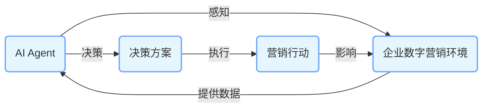

# AI Agent在企业数字营销优化中的应用

> 关键词：AI Agent、企业数字营销、营销优化、智能决策、精准营销

> 摘要：本文深入探讨了AI Agent在企业数字营销优化中的应用。首先介绍了相关背景，包括目的、预期读者等内容。接着阐述了AI Agent及企业数字营销的核心概念和联系，分析了其核心算法原理与操作步骤，并给出了具体的数学模型和公式。通过项目实战案例详细展示了AI Agent在数字营销中的应用，包括开发环境搭建、代码实现与解读。同时探讨了实际应用场景，推荐了学习资源、开发工具框架和相关论文著作。最后总结了未来发展趋势与挑战，提供了常见问题解答和扩展阅读参考资料，旨在帮助企业更好地利用AI Agent提升数字营销效果。

## 1. 背景介绍 
### 1.1 目的和范围
随着互联网技术的飞速发展，企业数字营销面临着越来越多的挑战和机遇。传统的营销方式已经难以满足企业在海量数据和复杂市场环境下的需求。AI Agent作为一种智能的软件程序，能够模拟人类的行为和决策过程，在企业数字营销优化中具有巨大的潜力。本文的目的在于深入研究AI Agent在企业数字营销优化中的应用，探讨其核心原理、操作步骤、实际应用场景等内容，为企业提供全面的技术指导和实践参考。范围涵盖了AI Agent在数字营销的各个环节，包括市场分析、客户细分、精准营销、营销效果评估等。

### 1.2 预期读者
本文的预期读者主要包括企业的市场营销人员、数字营销专家、软件开发者、技术管理者以及对AI和数字营销感兴趣的研究人员。市场营销人员可以通过本文了解如何利用AI Agent提升营销效果和效率；软件开发者可以从中获取AI Agent在数字营销应用中的技术实现思路；技术管理者可以为企业的数字营销战略规划提供决策依据；研究人员可以将本文作为进一步研究的参考资料。

### 1.3 文档结构概述
本文将按照以下结构进行组织：首先介绍背景信息，包括目的、预期读者和文档结构概述等；接着阐述AI Agent和企业数字营销的核心概念和联系，给出相应的文本示意图和Mermaid流程图；然后详细讲解核心算法原理和具体操作步骤，并结合Python源代码进行说明；再介绍数学模型和公式，通过具体例子进行详细讲解；之后通过项目实战展示AI Agent在数字营销中的实际应用，包括开发环境搭建、源代码实现和代码解读；探讨实际应用场景；推荐相关的学习资源、开发工具框架和论文著作；最后总结未来发展趋势与挑战，提供常见问题解答和扩展阅读参考资料。

### 1.4 术语表
#### 1.4.1 核心术语定义
- **AI Agent（人工智能代理）**：是一种能够感知环境、根据预设的目标和规则进行决策，并采取行动以实现目标的智能软件实体。它可以自主地与环境进行交互，不断学习和适应环境的变化。
- **企业数字营销**：是指企业利用数字技术和互联网平台进行产品或服务的推广、销售和客户关系管理的一系列营销活动。包括搜索引擎营销、社交媒体营销、电子邮件营销、内容营销等多种形式。
- **营销优化**：通过对营销活动的各个环节进行分析、调整和改进，以提高营销效果和效率，实现企业营销目标的过程。

#### 1.4.2 相关概念解释
- **机器学习**：是一门多领域交叉学科，涉及概率论、统计学、逼近论、凸分析、算法复杂度理论等多门学科。它专门研究计算机怎样模拟或实现人类的学习行为，以获取新的知识或技能，重新组织已有的知识结构使之不断改善自身的性能。在AI Agent中，机器学习是实现智能决策和学习的重要手段。
- **数据挖掘**：是指从大量的数据中通过算法搜索隐藏于其中信息的过程。数据挖掘通常与计算机科学有关，并通过统计、在线分析处理、情报检索、机器学习、专家系统（依靠过去的经验法则）和模式识别等诸多方法来实现上述目标。在企业数字营销中，数据挖掘可以帮助企业发现潜在的客户需求和市场趋势。

#### 1.4.3 缩略词列表
- **CRM**：Customer Relationship Management，客户关系管理
- **SEO**：Search Engine Optimization，搜索引擎优化
- **SEM**：Search Engine Marketing，搜索引擎营销
- **SMM**：Social Media Marketing，社交媒体营销

## 2. 核心概念与联系 

### 核心概念原理
#### AI Agent原理
AI Agent的核心原理基于感知、决策和行动三个主要环节。感知环节中，AI Agent通过各种传感器或数据接口获取环境信息，例如在企业数字营销中，它可以从网站分析工具、社交媒体平台、客户关系管理系统等获取用户行为数据、市场数据等。决策环节是AI Agent根据预设的目标和规则，对感知到的信息进行分析和处理，运用机器学习、深度学习等算法生成决策方案。行动环节则是AI Agent根据决策结果采取相应的行动，如调整广告投放策略、发送个性化的营销邮件等。

#### 企业数字营销原理
企业数字营销的原理是基于数字技术和互联网平台，通过多种营销渠道和手段，将产品或服务信息传递给目标客户，以实现产品或服务的销售和品牌推广。其核心在于精准定位目标客户、提供个性化的营销内容、优化营销渠道和资源配置，提高营销效果和客户满意度。

### 架构的文本示意图
```plaintext
+----------------------+
|      AI Agent        |
|----------------------|
| 感知模块 (获取数据)  |
| 决策模块 (分析处理)  |
| 行动模块 (执行决策)  |
+----------------------+
           |
           | 交互
           v
+----------------------+
| 企业数字营销环境     |
|----------------------|
| 网站分析工具         |
| 社交媒体平台         |
| 客户关系管理系统     |
| 营销渠道 (邮件、广告) |
+----------------------+
```

### Mermaid流程图


## 3. 核心算法原理 & 具体操作步骤 

### 核心算法原理
在AI Agent应用于企业数字营销优化中，常用的核心算法包括决策树算法、神经网络算法和强化学习算法。

#### 决策树算法
决策树是一种基于树结构进行决策的算法。它通过对数据进行划分，构建一个树状模型，每个内部节点是一个属性上的测试，每个分支是一个测试输出，每个叶节点是一个类别或值。在数字营销中，决策树可以用于客户细分、营销渠道选择等决策。

以下是一个简单的决策树算法的Python实现示例：
```python
from sklearn.datasets import load_iris
from sklearn.model_selection import train_test_split
from sklearn.tree import DecisionTreeClassifier
from sklearn.metrics import accuracy_score

# 加载数据集
iris = load_iris()
X = iris.data
y = iris.target

# 划分训练集和测试集
X_train, X_test, y_train, y_test = train_test_split(X, y, test_size=0.3, random_state=42)

# 创建决策树分类器
clf = DecisionTreeClassifier()

# 训练模型
clf.fit(X_train, y_train)

# 预测
y_pred = clf.predict(X_test)

# 计算准确率
accuracy = accuracy_score(y_test, y_pred)
print(f"决策树模型准确率: {accuracy}")
```

#### 神经网络算法
神经网络是一种模仿人类神经系统的计算模型，由大量的神经元组成。在数字营销中，神经网络可以用于预测客户购买行为、客户满意度等。

以下是一个简单的神经网络算法的Python实现示例：
```python
import numpy as np
import tensorflow as tf
from tensorflow.keras.datasets import mnist
from tensorflow.keras.models import Sequential
from tensorflow.keras.layers import Dense, Flatten

# 加载MNIST数据集
(x_train, y_train), (x_test, y_test) = mnist.load_data()

# 数据预处理
x_train = x_train / 255.0
x_test = x_test / 255.0

# 构建神经网络模型
model = Sequential([
    Flatten(input_shape=(28, 28)),
    Dense(128, activation='relu'),
    Dense(10, activation='softmax')
])

# 编译模型
model.compile(optimizer='adam',
              loss='sparse_categorical_crossentropy',
              metrics=['accuracy'])

# 训练模型
model.fit(x_train, y_train, epochs=5)

# 评估模型
test_loss, test_acc = model.evaluate(x_test, y_test)
print(f"神经网络模型准确率: {test_acc}")
```

#### 强化学习算法
强化学习是一种通过智能体与环境进行交互，根据环境反馈的奖励信号来学习最优行为策略的算法。在数字营销中，强化学习可以用于优化广告投放策略、调整营销资源分配等。

以下是一个简单的强化学习算法（Q-learning）的Python实现示例：
```python
import numpy as np

# 定义环境
env = np.array([
    [-1, -1, -1, -1, 0, -1],
    [-1, -1, -1, 0, -1, 100],
    [-1, -1, -1, 0, -1, -1],
    [-1, 0, 0, -1, 0, -1],
    [0, -1, -1, 0, -1, 100],
    [-1, 0, -1, -1, 0, 100]
])

# 定义超参数
gamma = 0.8
epsilon = 0.1
num_episodes = 1000

# 初始化Q表
Q = np.zeros([env.shape[0], env.shape[1]])

# Q-learning算法
for episode in range(num_episodes):
    state = np.random.randint(0, env.shape[0])
    while True:
        if np.random.uniform(0, 1) < epsilon:
            action = np.random.randint(0, env.shape[1])
        else:
            action = np.argmax(Q[state, :])
        if env[state, action]!= -1:
            next_state = action
            reward = env[state, action]
            Q[state, action] = Q[state, action] + gamma * (reward + np.max(Q[next_state, :]) - Q[state, action])
            state = next_state
        if state == 5:
            break

# 输出最优路径
state = 2
path = [state]
while state!= 5:
    action = np.argmax(Q[state, :])
    state = action
    path.append(state)
print(f"最优路径: {path}")
```

### 具体操作步骤
#### 数据收集与预处理
1. 从各种数据源收集企业数字营销相关的数据，如网站访问日志、社交媒体数据、客户交易记录等。
2. 对收集到的数据进行清洗，去除重复数据、错误数据和缺失值。
3. 对数据进行特征工程，包括特征提取、特征选择和特征转换等，以提高数据的质量和可用性。

#### 模型训练
1. 根据营销目标和数据特点选择合适的算法，如决策树、神经网络或强化学习算法。
2. 将预处理后的数据划分为训练集和测试集。
3. 使用训练集对模型进行训练，调整模型的参数以提高模型的性能。

#### 决策与行动
1. 使用训练好的模型对新的数据进行预测和决策，如预测客户的购买概率、选择最优的营销渠道等。
2. 根据决策结果采取相应的营销行动，如发送个性化的营销邮件、调整广告投放策略等。

#### 评估与优化
1. 对营销行动的效果进行评估，如计算转化率、点击率、客户满意度等指标。
2. 根据评估结果对模型和营销策略进行优化，不断提高营销效果。

## 4. 数学模型和公式 & 详细讲解 & 举例说明 

### 决策树算法的数学模型和公式
决策树算法的核心是通过计算信息增益来选择最优的划分属性。信息增益的计算公式为：
$$IG(D, a) = Ent(D) - \sum_{v=1}^{V} \frac{|D^v|}{|D|} Ent(D^v)$$
其中，$IG(D, a)$ 表示属性 $a$ 对数据集 $D$ 的信息增益，$Ent(D)$ 表示数据集 $D$ 的信息熵，$D^v$ 表示属性 $a$ 取值为 $v$ 的样本子集，$V$ 表示属性 $a$ 的取值个数。

信息熵的计算公式为：
$$Ent(D) = -\sum_{k=1}^{K} p_k \log_2 p_k$$
其中，$p_k$ 表示数据集 $D$ 中第 $k$ 类样本所占的比例，$K$ 表示数据集 $D$ 的类别数。

举例说明：假设有一个数据集 $D$ 包含 10 个样本，分为两类，其中第一类有 6 个样本，第二类有 4 个样本。则数据集 $D$ 的信息熵为：
$$Ent(D) = -\frac{6}{10} \log_2 \frac{6}{10} - \frac{4}{10} \log_2 \frac{4}{10} \approx 0.971$$

假设存在一个属性 $a$，将数据集 $D$ 划分为两个子集 $D^1$ 和 $D^2$，其中 $D^1$ 包含 4 个样本，第一类有 3 个，第二类有 1 个；$D^2$ 包含 6 个样本，第一类有 3 个，第二类有 3 个。则 $D^1$ 的信息熵为：
$$Ent(D^1) = -\frac{3}{4} \log_2 \frac{3}{4} - \frac{1}{4} \log_2 \frac{1}{4} \approx 0.811$$
$D^2$ 的信息熵为：
$$Ent(D^2) = -\frac{3}{6} \log_2 \frac{3}{6} - \frac{3}{6} \log_2 \frac{3}{6} = 1$$

属性 $a$ 对数据集 $D$ 的信息增益为：
$$IG(D, a) = 0.971 - (\frac{4}{10} \times 0.811 + \frac{6}{10} \times 1) \approx 0.126$$

### 神经网络算法的数学模型和公式
神经网络的基本单元是神经元，神经元的输出可以用以下公式表示：
$$y = f(\sum_{i=1}^{n} w_i x_i + b)$$
其中，$x_i$ 表示输入信号，$w_i$ 表示输入信号的权重，$b$ 表示偏置，$f$ 表示激活函数。

常见的激活函数有 sigmoid 函数、ReLU 函数等。sigmoid 函数的计算公式为：
$$\sigma(x) = \frac{1}{1 + e^{-x}}$$
ReLU 函数的计算公式为：
$$f(x) = \max(0, x)$$

在神经网络的训练过程中，通常使用反向传播算法来更新权重和偏置。反向传播算法的核心是通过计算损失函数对权重和偏置的梯度，然后根据梯度下降法更新权重和偏置。损失函数可以使用均方误差（MSE）、交叉熵损失等。

均方误差的计算公式为：
$$MSE = \frac{1}{n} \sum_{i=1}^{n} (y_i - \hat{y}_i)^2$$
其中，$y_i$ 表示真实值，$\hat{y}_i$ 表示预测值，$n$ 表示样本数量。

### 强化学习算法的数学模型和公式
强化学习的核心是智能体与环境进行交互，根据环境反馈的奖励信号来学习最优行为策略。Q-learning 算法是一种常用的强化学习算法，其核心是更新 Q 表。Q 表中的每个元素 $Q(s, a)$ 表示在状态 $s$ 下采取行动 $a$ 的价值。

Q-learning 算法的更新公式为：
$$Q(s, a) = Q(s, a) + \alpha [r + \gamma \max_{a'} Q(s', a') - Q(s, a)]$$
其中，$Q(s, a)$ 表示在状态 $s$ 下采取行动 $a$ 的当前 Q 值，$\alpha$ 表示学习率，$r$ 表示在状态 $s$ 下采取行动 $a$ 后获得的奖励，$\gamma$ 表示折扣因子，$s'$ 表示采取行动 $a$ 后转移到的下一个状态，$\max_{a'} Q(s', a')$ 表示在下一个状态 $s'$ 下采取最优行动的 Q 值。

举例说明：假设智能体处于状态 $s_1$，采取行动 $a_1$ 后转移到状态 $s_2$，获得奖励 $r = 1$。当前 $Q(s_1, a_1) = 0.5$，$\max_{a'} Q(s_2, a') = 0.8$，学习率 $\alpha = 0.1$，折扣因子 $\gamma = 0.9$。则更新后的 $Q(s_1, a_1)$ 为：
$$Q(s_1, a_1) = 0.5 + 0.1 [1 + 0.9 \times 0.8 - 0.5] = 0.5 + 0.1 \times 1.22 = 0.622$$

## 5. 项目实战：代码实际案例和详细解释说明 

### 5.1  开发环境搭建
#### 安装Python
首先需要安装Python，建议使用Python 3.7及以上版本。可以从Python官方网站（https://www.python.org/downloads/）下载适合自己操作系统的安装包，按照安装向导进行安装。

#### 安装必要的库
在项目中需要使用一些Python库，如`numpy`、`pandas`、`scikit-learn`、`tensorflow`等。可以使用`pip`命令进行安装：
```sh
pip install numpy pandas scikit-learn tensorflow
```

### 5.2  源代码详细实现和代码解读
以下是一个使用决策树算法进行客户细分的项目实战代码示例：
```python
import pandas as pd
from sklearn.model_selection import train_test_split
from sklearn.tree import DecisionTreeClassifier
from sklearn.metrics import accuracy_score

# 加载数据集
data = pd.read_csv('customer_data.csv')

# 分离特征和标签
X = data.drop('segment', axis=1)
y = data['segment']

# 划分训练集和测试集
X_train, X_test, y_train, y_test = train_test_split(X, y, test_size=0.3, random_state=42)

# 创建决策树分类器
clf = DecisionTreeClassifier()

# 训练模型
clf.fit(X_train, y_train)

# 预测
y_pred = clf.predict(X_test)

# 计算准确率
accuracy = accuracy_score(y_test, y_pred)
print(f"决策树模型准确率: {accuracy}")
```

### 代码解读与分析
1. **数据加载**：使用`pandas`库的`read_csv`函数加载客户数据集，数据集文件名为`customer_data.csv`。
2. **特征和标签分离**：使用`drop`方法将目标变量`segment`从数据集中分离出来，得到特征矩阵`X`和标签向量`y`。
3. **数据集划分**：使用`train_test_split`函数将数据集划分为训练集和测试集，测试集占比为 30%。
4. **模型创建**：使用`DecisionTreeClassifier`类创建一个决策树分类器。
5. **模型训练**：使用`fit`方法对决策树分类器进行训练，传入训练集的特征矩阵和标签向量。
6. **模型预测**：使用`predict`方法对测试集的特征矩阵进行预测，得到预测结果`y_pred`。
7. **模型评估**：使用`accuracy_score`函数计算预测结果的准确率，并打印输出。

## 6. 实际应用场景 
### 市场分析
AI Agent可以通过收集和分析大量的市场数据，如行业报告、竞争对手数据、消费者行为数据等，帮助企业了解市场趋势和竞争态势。例如，AI Agent可以分析社交媒体上的用户评论和话题，了解消费者对产品或服务的需求和反馈，为企业的产品研发和市场定位提供参考。

### 客户细分
AI Agent可以根据客户的特征和行为数据，如年龄、性别、购买历史、浏览记录等，将客户划分为不同的细分群体。企业可以针对不同的细分群体制定个性化的营销策略，提高营销效果。例如，对于高价值客户，企业可以提供专属的优惠活动和服务；对于潜在客户，企业可以加强市场推广和引导。

### 精准营销
AI Agent可以根据客户的个性化需求和偏好，精准地推送营销信息。例如，AI Agent可以分析客户的浏览历史和购买记录，为客户推荐相关的产品或服务；可以根据客户的地理位置和时间，推送适合的营销活动。通过精准营销，企业可以提高营销信息的送达率和转化率，降低营销成本。

### 营销效果评估
AI Agent可以实时监测营销活动的效果，如点击率、转化率、客户满意度等指标，并根据评估结果及时调整营销策略。例如，如果某个广告投放渠道的点击率较低，AI Agent可以建议企业调整广告内容或投放时间；如果某个营销活动的转化率较高，AI Agent可以建议企业加大投入和推广力度。

## 7. 工具和资源推荐
### 7.1 学习资源推荐
#### 7.1.1 书籍推荐
- 《人工智能：一种现代的方法》：这是一本经典的人工智能教材，全面介绍了人工智能的各个领域，包括搜索算法、知识表示、机器学习、自然语言处理等。
- 《Python机器学习》：本书详细介绍了Python在机器学习中的应用，包括数据预处理、模型选择、评估和优化等内容，适合初学者入门。
- 《深度学习》：由深度学习领域的三位顶尖专家Ian Goodfellow、Yoshua Bengio和Aaron Courville合著，全面介绍了深度学习的理论和实践。

#### 7.1.2 在线课程
- Coursera上的“机器学习”课程：由斯坦福大学教授Andrew Ng主讲，是一门非常经典的机器学习入门课程，涵盖了机器学习的基本概念、算法和应用。
- edX上的“人工智能基础”课程：由麻省理工学院（MIT）开设，介绍了人工智能的基本原理和方法，包括搜索算法、知识表示、机器学习等内容。
- Udemy上的“Python深度学习实战”课程：通过实际项目案例，介绍了Python在深度学习中的应用，包括神经网络、卷积神经网络、循环神经网络等。

#### 7.1.3 技术博客和网站
- Medium：是一个知名的技术博客平台，上面有很多关于AI、机器学习和数字营销的优质文章。
- Towards Data Science：专注于数据科学和机器学习领域的技术博客，提供了很多实用的技术教程和案例分析。
- Google AI Blog：谷歌官方的AI博客，分享了谷歌在AI领域的最新研究成果和应用案例。

### 7.2 开发工具框架推荐
#### 7.2.1 IDE和编辑器
- PyCharm：是一款专业的Python集成开发环境（IDE），提供了丰富的代码编辑、调试、测试等功能，适合Python开发。
- Jupyter Notebook：是一个基于网页的交互式计算环境，支持Python、R等多种编程语言，适合数据探索、模型开发和可视化。
- Visual Studio Code：是一款轻量级的代码编辑器，支持多种编程语言，通过安装插件可以扩展其功能，适合快速开发和调试。

#### 7.2.2 调试和性能分析工具
- TensorBoard：是TensorFlow提供的可视化工具，可以用于可视化模型的训练过程、评估指标、网络结构等，帮助开发者调试和优化模型。
- Py-Spy：是一个用于Python程序性能分析的工具，可以实时监测Python程序的CPU使用率、函数调用时间等信息，帮助开发者找出性能瓶颈。
- Memory Profiler：是一个用于Python程序内存分析的工具，可以分析Python程序中各个函数的内存使用情况，帮助开发者优化内存使用。

#### 7.2.3 相关框架和库
- TensorFlow：是一个开源的机器学习框架，由谷歌开发，提供了丰富的深度学习模型和工具，支持CPU、GPU和TPU等多种计算设备。
- PyTorch：是一个开源的深度学习框架，由Facebook开发，具有动态图机制，易于使用和调试，在学术界和工业界都有广泛的应用。
- Scikit-learn：是一个开源的机器学习库，提供了丰富的机器学习算法和工具，包括分类、回归、聚类、降维等，适合初学者和快速开发。

### 7.3 相关论文著作推荐
#### 7.3.1 经典论文
- “A Logical Calculus of the Ideas Immanent in Nervous Activity”：由Warren S. McCulloch和Walter Pitts在1943年发表，提出了第一个神经网络模型——MP神经元模型，为神经网络的发展奠定了基础。
- “Learning Representations by Back-propagating Errors”：由David E. Rumelhart、Geoffrey E. Hinton和Ronald J. Williams在1986年发表，提出了反向传播算法，使得神经网络的训练变得可行，推动了神经网络的发展。
- “Playing Atari with Deep Reinforcement Learning”：由Volodymyr Mnih等人在2013年发表，提出了深度Q网络（DQN）算法，将深度学习和强化学习相结合，在Atari游戏中取得了很好的效果，开启了深度强化学习的时代。

#### 7.3.2 最新研究成果
- OpenAI的相关研究：OpenAI是一个知名的人工智能研究机构，他们在自然语言处理、强化学习等领域取得了很多重要的研究成果，如GPT系列模型、DALL-E等。
- DeepMind的相关研究：DeepMind是一家专注于人工智能研究的公司，他们在强化学习、游戏AI等领域取得了很多突破，如AlphaGo、AlphaZero等。

#### 7.3.3 应用案例分析
- 《营销革命4.0：从传统到数字》：本书介绍了数字营销的发展趋势和应用案例，分析了企业如何利用数字技术和AI提升营销效果。
- 《AI营销：从策略到执行》：通过实际案例，介绍了AI在营销中的应用场景和实施方法，为企业提供了实践参考。

## 8. 总结：未来发展趋势与挑战
### 未来发展趋势
#### 更智能的决策
随着AI技术的不断发展，AI Agent将具备更强大的智能决策能力。它可以综合考虑更多的因素，如市场动态、竞争对手策略、客户情绪等，为企业提供更精准、更智能的营销决策建议。

#### 跨渠道整合营销
未来，AI Agent将能够整合多种营销渠道，如搜索引擎营销、社交媒体营销、电子邮件营销等，实现跨渠道的统一管理和优化。通过分析不同渠道的数据，AI Agent可以为企业制定更全面、更有效的营销方案。

#### 个性化体验升级
AI Agent将进一步提升客户的个性化体验。它可以根据客户的实时行为和偏好，动态调整营销内容和方式，为客户提供更加个性化、实时化的服务。例如，在客户浏览网站时，AI Agent可以实时推荐相关的产品或服务。

#### 与物联网的融合
随着物联网技术的普及，AI Agent将与物联网设备深度融合。例如，通过物联网设备收集客户的行为数据，如智能手表记录的运动数据、智能家居设备记录的使用习惯等，AI Agent可以为企业提供更丰富、更准确的客户画像，从而实现更精准的营销。

### 挑战
#### 数据隐私和安全
在企业数字营销中，AI Agent需要收集和处理大量的客户数据。如何保护客户数据的隐私和安全是一个重要的挑战。企业需要采取有效的数据加密、访问控制等措施，确保客户数据不被泄露和滥用。

#### 算法可解释性
AI Agent通常使用复杂的机器学习和深度学习算法，这些算法的决策过程往往难以解释。在企业数字营销中，营销人员需要了解AI Agent的决策依据，以便更好地调整营销策略。因此，提高算法的可解释性是一个亟待解决的问题。

#### 技术人才短缺
AI Agent的开发和应用需要具备专业的技术人才，包括机器学习工程师、数据科学家等。目前，市场上这类人才相对短缺，企业在招聘和培养相关人才方面面临一定的困难。

#### 伦理和法律问题
AI Agent的应用可能会引发一些伦理和法律问题，如算法歧视、虚假营销等。企业需要遵守相关的法律法规和伦理准则，确保AI Agent的应用符合社会道德和法律要求。

## 9. 附录：常见问题与解答
### 问题1：AI Agent在企业数字营销中的应用成本高吗？
解答：AI Agent的应用成本因具体情况而异。一方面，开发和部署AI Agent需要一定的技术投入，包括购买服务器、开发软件等；另一方面，使用AI Agent可以提高营销效率和效果，降低营销成本。总体来说，如果企业能够合理规划和应用AI Agent，其带来的收益将大于成本。

### 问题2：AI Agent可以完全替代营销人员吗？
解答：目前来看，AI Agent还不能完全替代营销人员。虽然AI Agent可以在数据处理、决策分析等方面提供强大的支持，但营销人员的创造力、人际交往能力和对市场的敏锐洞察力是AI Agent无法替代的。未来，AI Agent将与营销人员相互协作，共同提升企业数字营销的效果。

### 问题3：如何确保AI Agent的决策是准确可靠的？
解答：要确保AI Agent的决策准确可靠，需要从以下几个方面入手：一是保证数据的质量，数据是AI Agent决策的基础，高质量的数据可以提高决策的准确性；二是选择合适的算法和模型，并进行充分的训练和优化；三是对AI Agent的决策结果进行评估和验证，及时发现和纠正错误。

### 问题4：AI Agent在数字营销中的应用是否存在风险？
解答：AI Agent在数字营销中的应用存在一定的风险。例如，数据隐私和安全风险、算法歧视风险、虚假营销风险等。企业需要采取相应的措施来降低这些风险，如加强数据安全管理、提高算法的可解释性、遵守相关法律法规等。

## 10. 扩展阅读 & 参考资料
### 扩展阅读
- 《人工智能时代的营销革命》：深入探讨了AI对营销行业的影响和变革，介绍了一些前沿的营销理念和方法。
- 《数字营销实战手册》：提供了丰富的数字营销实战案例和操作指南，帮助读者更好地应用数字营销技术。

### 参考资料
- 《Python数据分析实战》
- 《机器学习实战》
- 相关学术期刊：《Journal of Artificial Intelligence Research》、《Artificial Intelligence》、《Marketing Science》等。

作者：AI天才研究院/AI Genius Institute & 禅与计算机程序设计艺术 /Zen And The Art of Computer Programming