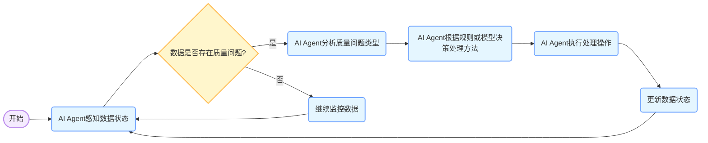

# AI Agent在企业数据质量管理与治理自动化中的应用

> 关键词：AI Agent、企业数据质量管理、数据治理自动化、数据质量评估、数据清洗

> 摘要：本文深入探讨了AI Agent在企业数据质量管理与治理自动化中的应用。首先介绍了相关背景，包括目的范围、预期读者等内容。接着阐述了AI Agent、企业数据质量管理和治理自动化的核心概念及它们之间的联系，并给出了相应的文本示意图和Mermaid流程图。详细讲解了核心算法原理及具体操作步骤，通过Python源代码进行了说明。同时，给出了相关的数学模型和公式，并举例说明。在项目实战部分，进行了开发环境搭建，给出了源代码实现及解读分析。还探讨了实际应用场景，推荐了相关的工具和资源。最后总结了未来发展趋势与挑战，提供了常见问题解答和扩展阅读参考资料。

## 1. 背景介绍 
### 1.1 目的和范围
在当今数字化时代，企业积累了海量的数据。数据已经成为企业的核心资产之一，其质量直接影响到企业的决策、运营和竞争力。然而，企业数据往往存在着数据不准确、不完整、不一致等质量问题，同时数据治理过程也面临着流程复杂、效率低下等挑战。

本文的目的是研究如何利用AI Agent来实现企业数据质量管理与治理的自动化。具体范围包括探讨AI Agent在数据质量评估、数据清洗、数据监控等数据质量管理环节的应用，以及在数据标准制定、数据权限管理等数据治理环节的应用。

### 1.2 预期读者
本文预期读者主要包括企业的数据管理人员、数据分析师、数据科学家、IT工程师等相关人员。这些人员在企业的数据管理和治理工作中扮演着重要角色，对提高数据质量和实现数据治理自动化有着迫切需求。同时，也适合对AI Agent和数据管理领域感兴趣的研究人员和学生阅读。

### 1.3 文档结构概述
本文将按照以下结构进行阐述：
- 核心概念与联系：介绍AI Agent、企业数据质量管理和治理自动化的核心概念，以及它们之间的相互关系，并给出相应的示意图和流程图。
- 核心算法原理 & 具体操作步骤：详细讲解AI Agent在数据质量管理与治理自动化中所使用的核心算法原理，并给出具体的操作步骤，通过Python源代码进行说明。
- 数学模型和公式 & 详细讲解 & 举例说明：给出相关的数学模型和公式，对其进行详细讲解，并通过实际例子进行说明。
- 项目实战：代码实际案例和详细解释说明：包括开发环境搭建、源代码详细实现和代码解读、代码解读与分析。
- 实际应用场景：探讨AI Agent在企业数据质量管理与治理自动化中的实际应用场景。
- 工具和资源推荐：推荐相关的学习资源、开发工具框架和论文著作。
- 总结：未来发展趋势与挑战：总结AI Agent在企业数据质量管理与治理自动化中的未来发展趋势和面临的挑战。
- 附录：常见问题与解答：解答读者可能遇到的常见问题。
- 扩展阅读 & 参考资料：提供相关的扩展阅读材料和参考资料。

### 1.4 术语表
#### 1.4.1 核心术语定义
- **AI Agent**：是一种能够感知环境、自主决策并采取行动以实现特定目标的智能实体。在本文中，AI Agent主要用于企业数据质量管理与治理自动化任务。
- **企业数据质量管理**：是指对企业数据的质量进行评估、监控和改进的过程，以确保数据的准确性、完整性、一致性、及时性等质量特征。
- **数据治理自动化**：是指利用技术手段实现数据治理流程的自动化，减少人工干预，提高数据治理的效率和效果。
- **数据质量评估**：是指对数据的质量进行量化评估，确定数据的质量水平。
- **数据清洗**：是指对数据中的错误、缺失、重复等问题进行处理，提高数据的质量。

#### 1.4.2 相关概念解释
- **机器学习**：是一门多领域交叉学科，涉及概率论、统计学、逼近论、凸分析、算法复杂度理论等多门学科。它专门研究计算机怎样模拟或实现人类的学习行为，以获取新的知识或技能，重新组织已有的知识结构使之不断改善自身的性能。在AI Agent中，机器学习算法常用于数据质量评估和预测。
- **自然语言处理**：是计算机科学领域与人工智能领域中的一个重要方向。它研究能实现人与计算机之间用自然语言进行有效通信的各种理论和方法。在数据治理自动化中，自然语言处理可用于处理非结构化数据和理解用户的自然语言指令。

#### 1.4.3 缩略词列表
- **AI**：Artificial Intelligence，人工智能
- **ML**：Machine Learning，机器学习
- **NLP**：Natural Language Processing，自然语言处理

## 2. 核心概念与联系 

### 核心概念原理
#### AI Agent
AI Agent是一种具有自主性、反应性、社会性和能动性的智能实体。它可以通过传感器感知环境信息，根据内置的规则或学习到的模型进行决策，并通过执行器采取行动。在企业数据质量管理与治理自动化中，AI Agent可以感知数据的状态、质量问题等信息，根据预设的目标和策略进行决策，如选择合适的数据清洗方法、调整数据治理流程等，并执行相应的操作。

#### 企业数据质量管理
企业数据质量管理的核心是确保数据满足企业的业务需求。它包括数据质量规划、数据质量评估、数据质量改进等环节。数据质量规划确定数据质量的目标和标准；数据质量评估通过各种指标和方法对数据的质量进行量化评估；数据质量改进则根据评估结果采取相应的措施，如数据清洗、数据集成等，以提高数据的质量。

#### 数据治理自动化
数据治理自动化是利用技术手段实现数据治理流程的自动化。它包括数据标准自动化、数据权限自动化、数据监控自动化等方面。通过自动化，可以减少人工干预，提高数据治理的效率和准确性，降低数据治理的成本。

### 架构的文本示意图
```plaintext
企业数据质量管理与治理自动化系统
|-- AI Agent
|   |-- 数据感知模块（感知数据状态、质量问题等）
|   |-- 决策模块（根据预设规则或学习模型进行决策）
|   |-- 执行模块（执行数据清洗、调整治理流程等操作）
|-- 企业数据
|   |-- 结构化数据
|   |-- 非结构化数据
|-- 数据治理流程
|   |-- 数据标准制定
|   |-- 数据权限管理
|   |-- 数据监控
```

### Mermaid流程图


## 3. 核心算法原理 & 具体操作步骤 

### 核心算法原理
#### 数据质量评估算法
在数据质量评估中，常用的算法是基于规则的评估算法和基于机器学习的评估算法。

基于规则的评估算法是根据预设的规则对数据进行评估。例如，对于一个数值型字段，可以设定规则为“数值必须在0到100之间”，如果数据不满足该规则，则认为数据存在质量问题。

基于机器学习的评估算法则是通过训练机器学习模型来预测数据的质量。例如，可以使用逻辑回归模型，将数据的各种特征作为输入，数据的质量标签（如合格、不合格）作为输出，进行模型训练。训练好的模型可以对新的数据进行质量预测。

#### 数据清洗算法
数据清洗算法主要包括缺失值处理、异常值处理和重复值处理等。

缺失值处理算法有均值填充、中位数填充、基于模型的填充等。例如，均值填充是将缺失值用该字段的均值进行填充。

异常值处理算法有基于统计的方法（如Z-score方法）和基于机器学习的方法（如孤立森林算法）。Z-score方法是通过计算数据点与均值的标准差倍数来判断是否为异常值。

重复值处理算法则是通过比较数据记录的特征来识别和删除重复的记录。

### 具体操作步骤及Python源代码

#### 数据质量评估
```python
import pandas as pd
from sklearn.linear_model import LogisticRegression
from sklearn.model_selection import train_test_split
from sklearn.metrics import accuracy_score

# 假设我们有一个包含数据特征和质量标签的数据集
data = pd.read_csv('data_quality.csv')
X = data.drop('quality_label', axis=1)
y = data['quality_label']

# 划分训练集和测试集
X_train, X_test, y_train, y_test = train_test_split(X, y, test_size=0.2, random_state=42)

# 训练逻辑回归模型
model = LogisticRegression()
model.fit(X_train, y_train)

# 预测测试集数据的质量
y_pred = model.predict(X_test)

# 评估模型的准确率
accuracy = accuracy_score(y_test, y_pred)
print(f"数据质量评估模型的准确率: {accuracy}")
```

#### 数据清洗
```python
import pandas as pd
import numpy as np

# 生成一个包含缺失值和异常值的示例数据集
data = pd.DataFrame({
    'col1': [1, 2, np.nan, 4, 5],
    'col2': [10, 20, 30, 1000, 50]
})

# 缺失值处理：均值填充
data['col1'] = data['col1'].fillna(data['col1'].mean())

# 异常值处理：Z-score方法
z_scores = np.abs((data['col2'] - data['col2'].mean()) / data['col2'].std())
data = data[z_scores < 3]

# 重复值处理
data = data.drop_duplicates()

print("清洗后的数据:")
print(data)
```

## 4. 数学模型和公式 & 详细讲解 & 举例说明 

### 数据质量评估的数学模型和公式
#### 基于规则的评估
假设我们有一个字段 $x$，规则为 $a \leq x \leq b$。对于数据集中的每个数据点 $x_i$，可以定义一个质量评估函数 $Q(x_i)$：

$$
Q(x_i) = 
\begin{cases}
1, & \text{if } a \leq x_i \leq b \\
0, & \text{otherwise}
\end{cases}
$$

整个数据集的质量得分 $Q_{total}$ 可以通过计算所有数据点质量评估函数的平均值得到：

$$
Q_{total} = \frac{1}{n} \sum_{i=1}^{n} Q(x_i)
$$

其中 $n$ 是数据集中数据点的数量。

**举例说明**：假设我们有一个数据集 $\{1, 2, 3, 4, 5\}$，规则为 $2 \leq x \leq 4$。则 $Q(1)=0$，$Q(2)=1$，$Q(3)=1$，$Q(4)=1$，$Q(5)=0$。$Q_{total} = \frac{0 + 1 + 1 + 1 + 0}{5} = 0.6$。

#### 基于机器学习的评估
以逻辑回归模型为例，逻辑回归模型的预测函数为：

$$
P(y = 1 | x) = \frac{1}{1 + e^{-(w_0 + w_1x_1 + w_2x_2 + \cdots + w_mx_m)}}
$$

其中 $x = (x_1, x_2, \cdots, x_m)$ 是输入特征向量，$w = (w_0, w_1, w_2, \cdots, w_m)$ 是模型的参数。$P(y = 1 | x)$ 表示输入特征为 $x$ 时，数据质量标签为 1（合格）的概率。

### 数据清洗的数学模型和公式
#### 缺失值处理：均值填充
假设我们有一个字段 $x$，其均值为 $\bar{x}$。对于缺失值 $x_{missing}$，填充后的值为：

$$
x_{filled} = \bar{x}
$$

其中 $\bar{x} = \frac{1}{n} \sum_{i=1}^{n} x_i$，$n$ 是该字段非缺失值的数量。

**举例说明**：假设字段 $x = \{1, 2, \text{nan}, 4, 5\}$，则 $\bar{x} = \frac{1 + 2 + 4 + 5}{4} = 3$，缺失值填充后的值为 3。

#### 异常值处理：Z-score方法
对于数据点 $x_i$，其Z-score为：

$$
Z(x_i) = \frac{x_i - \bar{x}}{\sigma}
$$

其中 $\bar{x}$ 是该字段的均值，$\sigma$ 是该字段的标准差。通常，如果 $|Z(x_i)| > 3$，则认为 $x_i$ 是异常值。

**举例说明**：假设字段 $x = \{1, 2, 3, 100, 5\}$，$\bar{x} = \frac{1 + 2 + 3 + 100 + 5}{5} = 22.2$，$\sigma \approx 43.4$。则 $Z(100) = \frac{100 - 22.2}{43.4} \approx 1.79$，由于 $|Z(100)| < 3$，在这个简单示例中暂不认为 100 是异常值（实际情况可能根据业务需求调整阈值）。

## 5. 项目实战：代码实际案例和详细解释说明 

### 5.1  开发环境搭建
#### 安装Python
首先需要安装Python，建议使用Python 3.7及以上版本。可以从Python官方网站（https://www.python.org/downloads/）下载并安装适合自己操作系统的Python版本。

#### 安装必要的库
使用pip命令安装项目所需的库，主要包括pandas、numpy、scikit-learn等。在命令行中执行以下命令：
```sh
pip install pandas numpy scikit-learn
```

### 5.2  源代码详细实现和代码解读
```python
import pandas as pd
import numpy as np
from sklearn.linear_model import LogisticRegression
from sklearn.model_selection import train_test_split
from sklearn.metrics import accuracy_score

# 步骤1：加载数据集
data = pd.read_csv('enterprise_data.csv')

# 步骤2：数据预处理
# 处理缺失值，使用均值填充
for column in data.columns:
    if data[column].isnull().any():
        data[column] = data[column].fillna(data[column].mean())

# 步骤3：划分特征和标签
X = data.drop('quality_label', axis=1)
y = data['quality_label']

# 步骤4：划分训练集和测试集
X_train, X_test, y_train, y_test = train_test_split(X, y, test_size=0.2, random_state=42)

# 步骤5：训练逻辑回归模型
model = LogisticRegression()
model.fit(X_train, y_train)

# 步骤6：预测测试集数据的质量
y_pred = model.predict(X_test)

# 步骤7：评估模型的准确率
accuracy = accuracy_score(y_test, y_pred)
print(f"数据质量评估模型的准确率: {accuracy}")

# 步骤8：数据清洗
# 异常值处理，使用Z-score方法
for column in X.columns:
    z_scores = np.abs((X[column] - X[column].mean()) / X[column].std())
    X = X[z_scores < 3]

# 重复值处理
X = X.drop_duplicates()

print("清洗后的数据:")
print(X)
```

### 代码解读与分析
- **步骤1**：使用pandas的`read_csv`函数加载企业数据集。
- **步骤2**：遍历数据集中的每一列，检查是否存在缺失值。如果存在缺失值，则使用该列的均值进行填充。
- **步骤3**：将数据集划分为特征矩阵 $X$ 和标签向量 $y$。
- **步骤4**：使用`train_test_split`函数将数据集划分为训练集和测试集，测试集占比为 20%。
- **步骤5**：创建逻辑回归模型并使用训练集进行训练。
- **步骤6**：使用训练好的模型对测试集进行预测。
- **步骤7**：使用`accuracy_score`函数计算模型的准确率并输出。
- **步骤8**：对特征矩阵 $X$ 进行数据清洗，包括异常值处理和重复值处理。最后输出清洗后的数据。

## 6. 实际应用场景 
### 金融行业
在金融行业，企业需要处理大量的客户数据、交易数据等。AI Agent可以用于数据质量评估，确保客户信息的准确性和完整性，避免因数据错误导致的风险。例如，在信贷审批过程中，AI Agent可以对客户的收入、信用记录等数据进行质量评估，提高审批的准确性。同时，AI Agent可以自动化数据治理流程，如定期更新客户数据的标准，确保数据符合监管要求。

### 医疗行业
医疗行业拥有大量的患者病历、医疗影像等数据。AI Agent可以帮助进行数据清洗，去除病历中的错误信息和重复记录，提高数据的质量。在医疗研究中，AI Agent可以对研究数据进行质量监控，确保研究结果的可靠性。此外，AI Agent还可以自动化数据权限管理，确保患者数据的安全性和隐私性。

### 零售行业
零售企业需要处理大量的销售数据、库存数据等。AI Agent可以实时监控数据的质量，及时发现数据中的异常情况，如销售数据的突然下降或库存数据的异常波动。同时，AI Agent可以自动化数据集成过程，将不同渠道的数据进行整合，为企业的决策提供更准确的数据支持。

## 7. 工具和资源推荐
### 7.1 学习资源推荐
#### 7.1.1 书籍推荐
- 《Python数据分析实战》：这本书详细介绍了使用Python进行数据分析的方法和技巧，包括数据处理、数据可视化等内容，对于学习企业数据质量管理和治理非常有帮助。
- 《机器学习》（周志华）：被称为“西瓜书”，是机器学习领域的经典教材，全面介绍了机器学习的基本概念、算法和应用，适合深入学习AI Agent相关的机器学习算法。
- 《数据治理：概念、战略与最佳实践》：系统地介绍了数据治理的理论和实践，包括数据质量管理、数据标准制定等方面的内容。

#### 7.1.2 在线课程
- Coursera上的“机器学习”课程：由斯坦福大学的Andrew Ng教授授课，是学习机器学习的经典课程，涵盖了机器学习的基本算法和应用。
- edX上的“数据科学基础”课程：介绍了数据科学的基本概念、工具和技术，包括数据处理、数据分析等内容。
- 网易云课堂上的“企业数据治理实战”课程：结合实际案例，介绍了企业数据治理的流程和方法。

#### 7.1.3 技术博客和网站
- Medium：上面有很多关于AI、数据科学和数据治理的技术文章，作者来自世界各地的专业人士。
- Kaggle：是一个数据科学竞赛平台，上面有很多数据科学的案例和教程，同时也有很多数据治理和质量管理的相关讨论。
- 开源中国：提供了大量的技术文章和开源项目，对于学习和实践AI Agent在数据管理中的应用有很大帮助。

### 7.2 开发工具框架推荐
#### 7.2.1 IDE和编辑器
- PyCharm：是一款专门为Python开发设计的集成开发环境，具有强大的代码编辑、调试和自动补全功能，适合开发AI Agent相关的Python代码。
- Jupyter Notebook：是一个交互式的开发环境，支持Python、R等多种编程语言，非常适合进行数据探索和模型训练。
- Visual Studio Code：是一款轻量级的代码编辑器，支持多种编程语言和插件，具有丰富的扩展功能，可以满足不同的开发需求。

#### 7.2.2 调试和性能分析工具
- PDB：是Python自带的调试工具，可以帮助开发者定位代码中的问题。
- cProfile：是Python的性能分析工具，可以分析代码的运行时间和函数调用次数，帮助开发者优化代码性能。
- TensorBoard：是TensorFlow的可视化工具，可以用于可视化模型的训练过程和性能指标，对于深度学习模型的调试和优化非常有帮助。

#### 7.2.3 相关框架和库
- Pandas：是Python中用于数据处理和分析的重要库，提供了丰富的数据结构和函数，方便进行数据清洗、转换和分析。
- NumPy：是Python中用于科学计算的基础库，提供了高效的数组操作和数学函数，对于数据处理和机器学习算法的实现非常有帮助。
- Scikit-learn：是Python中用于机器学习的开源库，提供了各种机器学习算法和工具，如分类、回归、聚类等，方便进行数据质量评估和预测。

### 7.3 相关论文著作推荐
#### 7.3.1 经典论文
- “A Taxonomy and Survey of Data Quality Research”：对数据质量研究进行了分类和综述，介绍了数据质量的定义、评估方法和改进技术。
- “Data Cleaning: Problems and Current Approaches”：详细讨论了数据清洗的问题和当前的解决方法，包括缺失值处理、异常值处理等内容。
- “Machine Learning for Data Quality Assessment”：探讨了如何使用机器学习方法进行数据质量评估，提出了一些有效的评估模型和算法。

#### 7.3.2 最新研究成果
- 关注ACM SIGMOD、VLDB等数据库领域的顶级会议，这些会议上会有很多关于数据质量管理和治理的最新研究成果。
- IEEE Transactions on Knowledge and Data Engineering等学术期刊也会发表相关的研究论文。

#### 7.3.3 应用案例分析
- 可以查阅一些行业报告和案例分析，了解AI Agent在不同行业的数据质量管理与治理自动化中的应用案例，如Gartner的相关报告、Forrester的研究报告等。

## 8. 总结：未来发展趋势与挑战
### 未来发展趋势
#### 智能化程度不断提高
未来，AI Agent将具备更强的学习能力和推理能力，能够自动学习和适应不同企业的数据特点和业务需求，实现更加智能化的数据质量管理与治理自动化。例如，AI Agent可以自动发现新的数据质量问题类型，并提出相应的解决方案。

#### 与其他技术的融合
AI Agent将与区块链、物联网等技术进行深度融合。区块链技术可以保证数据的安全性和不可篡改，物联网技术可以提供更多的实时数据。AI Agent可以利用这些技术提供的数据，实现更加精准的数据质量评估和治理。

#### 跨领域应用拓展
AI Agent在企业数据质量管理与治理自动化中的应用将拓展到更多的领域，如教育、农业等。不同领域的数据具有不同的特点和需求，AI Agent需要不断优化和改进，以适应不同领域的应用。

### 面临的挑战
#### 数据隐私和安全问题
在使用AI Agent进行数据质量管理与治理自动化的过程中，需要处理大量的企业敏感数据。如何保证数据的隐私和安全是一个重要的挑战。需要采用先进的加密技术和访问控制技术，防止数据泄露和滥用。

#### 算法可解释性问题
AI Agent中使用的一些机器学习算法，如深度学习算法，往往具有较高的复杂度，其决策过程难以解释。在企业数据质量管理与治理中，需要对AI Agent的决策进行解释，以便企业管理人员理解和信任其决策结果。

#### 技术人才短缺问题
实现AI Agent在企业数据质量管理与治理自动化中的应用需要具备AI、数据科学、企业管理等多方面知识的复合型人才。目前，这类人才相对短缺，制约了该技术的推广和应用。

## 9. 附录：常见问题与解答
### 问题1：AI Agent在数据质量管理与治理自动化中的应用是否会完全取代人工？
答：不会。虽然AI Agent可以实现很多数据质量管理与治理的自动化任务，但在一些复杂的情况下，如制定数据治理策略、处理特殊的数据质量问题等，仍然需要人工的参与和决策。AI Agent更多的是辅助人工，提高工作效率和准确性。

### 问题2：如何选择适合企业的AI Agent？
答：选择适合企业的AI Agent需要考虑多个因素，如企业的数据规模、数据类型、业务需求等。可以先对市场上的AI Agent产品进行调研和评估，了解其功能、性能、易用性等方面的情况。同时，可以进行试点项目，验证AI Agent是否能够满足企业的实际需求。

### 问题3：AI Agent在数据质量管理与治理自动化中的应用是否需要大量的计算资源？
答：这取决于具体的应用场景和使用的算法。一些简单的规则基于的AI Agent可能只需要较少的计算资源，而使用深度学习等复杂算法的AI Agent可能需要较多的计算资源。企业可以根据自身的情况选择合适的计算资源，如云计算、本地服务器等。

## 10. 扩展阅读 & 参考资料
### 扩展阅读
- 《人工智能：现代方法》：全面介绍了人工智能的基本概念、算法和应用，对于深入理解AI Agent的原理和技术有很大帮助。
- 《大数据时代：生活、工作与思维的大变革》：探讨了大数据时代的特点和影响，以及数据管理和治理的重要性。

### 参考资料
- 相关的行业标准和规范，如ISO 8000数据质量标准。
- 企业内部的数据管理文档和报告，了解企业的数据现状和需求。

作者：AI天才研究院/AI Genius Institute & 禅与计算机程序设计艺术 /Zen And The Art of Computer Programming