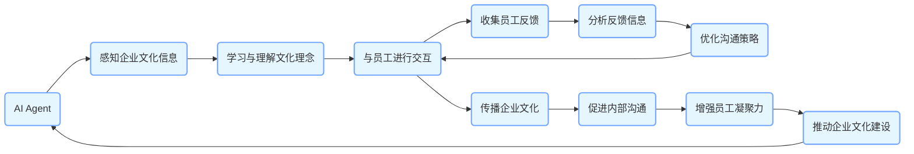

# AI Agent在企业文化建设与内部沟通中的应用

> 关键词：AI Agent、企业文化建设、内部沟通、智能交互、数字化转型

> 摘要：本文聚焦于AI Agent在企业文化建设与内部沟通中的应用。首先介绍了相关背景，明确目的、范围、预期读者等内容。接着阐述了AI Agent、企业文化建设和内部沟通的核心概念及相互联系，给出了原理和架构的示意图与流程图。详细讲解了AI Agent相关核心算法原理及具体操作步骤，配以Python源代码。通过数学模型和公式进一步剖析其作用机制，并举例说明。在项目实战部分，从开发环境搭建到源代码实现及解读进行了全面分析。探讨了AI Agent在企业文化建设与内部沟通中的实际应用场景，推荐了学习资源、开发工具框架以及相关论文著作。最后总结了未来发展趋势与挑战，提供常见问题解答和扩展阅读参考资料，旨在为企业利用AI Agent提升文化建设和内部沟通水平提供全面而深入的指导。

## 1. 背景介绍 
### 1.1 目的和范围
在当今数字化时代，企业面临着提升竞争力、增强员工凝聚力和促进高效沟通的挑战。企业文化建设与内部沟通作为企业发展的重要支撑，需要不断创新和优化。AI Agent作为一种智能技术，具有理解、学习和交互的能力，能够为企业文化建设与内部沟通带来新的机遇。本文的目的是深入探讨AI Agent在企业文化建设与内部沟通中的应用，包括其原理、方法、实际案例以及未来发展趋势等方面，为企业提供理论和实践指导。范围涵盖了AI Agent的基本概念、相关算法、在企业文化建设和内部沟通中的具体应用场景，以及与之相关的工具和资源等。

### 1.2 预期读者
本文预期读者主要包括企业管理人员、人力资源专家、企业文化建设专员、信息技术人员以及对AI技术在企业应用感兴趣的研究人员。企业管理人员可以从本文中了解如何利用AI Agent提升企业文化建设和内部沟通的效果，以增强企业的核心竞争力；人力资源专家可以借鉴相关方法和案例，优化员工管理和沟通策略；企业文化建设专员可以获取创新的思路和工具，推动企业文化的传播和落地；信息技术人员可以深入了解AI Agent的技术原理和实现方法，为企业开发相关应用提供技术支持；研究人员可以通过本文了解该领域的最新动态和研究方向，开展进一步的学术研究。

### 1.3 文档结构概述
本文共分为十个部分。第一部分为背景介绍，阐述了文章的目的、范围、预期读者和文档结构概述，并给出了相关术语表。第二部分介绍了AI Agent、企业文化建设和内部沟通的核心概念及相互联系，配有文本示意图和Mermaid流程图。第三部分详细讲解了AI Agent的核心算法原理和具体操作步骤，通过Python源代码进行说明。第四部分给出了数学模型和公式，并进行详细讲解和举例说明。第五部分是项目实战，包括开发环境搭建、源代码详细实现和代码解读。第六部分探讨了AI Agent在企业文化建设与内部沟通中的实际应用场景。第七部分推荐了学习资源、开发工具框架和相关论文著作。第八部分总结了未来发展趋势与挑战。第九部分是附录，提供常见问题与解答。第十部分为扩展阅读和参考资料。

### 1.4 术语表
#### 1.4.1 核心术语定义
- **AI Agent**：人工智能代理，是一种能够感知环境、自主决策并采取行动以实现特定目标的智能实体。它可以通过机器学习、自然语言处理等技术进行训练和优化，具有一定的智能和自主性。
- **企业文化建设**：企业为了实现自身的发展目标，通过一系列的理念、价值观、行为准则等的塑造和传播，形成独特的企业精神和文化氛围的过程。
- **内部沟通**：企业内部各部门、各层级之间以及员工之间进行信息传递、交流和共享的过程，包括正式沟通和非正式沟通。

#### 1.4.2 相关概念解释
- **智能交互**：指AI Agent与用户之间通过自然语言、语音、图像等方式进行的高效、自然的交互过程，能够理解用户意图并提供相应的服务和反馈。
- **知识图谱**：一种语义网络，用于表示实体之间的关系和知识，AI Agent可以利用知识图谱进行知识推理和问答。
- **情感分析**：通过对文本、语音等数据的分析，识别其中包含的情感倾向，如积极、消极、中性等，帮助企业了解员工的情绪状态。

#### 1.4.3 缩略词列表
- **NLP**：Natural Language Processing，自然语言处理
- **ML**：Machine Learning，机器学习
- **DL**：Deep Learning，深度学习

## 2. 核心概念与联系 

### 核心概念原理
#### AI Agent原理
AI Agent的核心是其智能决策机制，它通过感知模块获取环境信息，利用学习模块对这些信息进行处理和分析，然后通过决策模块根据预设的目标和规则做出决策，并通过执行模块采取相应的行动。其学习过程可以基于监督学习、无监督学习、强化学习等多种机器学习算法，不断优化自身的决策能力。

#### 企业文化建设原理
企业文化建设基于企业的愿景、使命和价值观，通过制定相应的文化理念、行为规范和制度，将这些文化元素融入到企业的各项工作和活动中，以影响员工的思想和行为，形成共同的价值取向和行为准则。企业文化建设需要通过宣传、培训、激励等多种手段进行传播和落地。

#### 内部沟通原理
内部沟通的原理是信息的有效传递和共享。通过建立合理的沟通渠道和机制，确保信息能够准确、及时地从发送者传递到接收者，并得到有效的反馈。沟通的方式包括面对面交流、电子邮件、即时通讯工具等，不同的沟通方式适用于不同的场景和信息类型。

### 架构的文本示意图
```plaintext
            企业文化建设
                |
                | 影响
                |
        AI Agent  <----> 内部沟通
```
该示意图表示AI Agent在企业文化建设和内部沟通之间起到桥梁和促进的作用。AI Agent可以通过与员工的交互，传播企业文化理念，同时收集员工的反馈信息，促进内部沟通的高效进行。而企业文化建设的成果也会影响AI Agent的设计和应用，内部沟通的情况也会为AI Agent提供改进的方向。

### Mermaid流程图

该流程图展示了AI Agent在企业文化建设与内部沟通中的工作流程。AI Agent首先感知企业文化信息，学习和理解文化理念，然后与员工进行交互，传播企业文化并收集员工反馈。对反馈信息进行分析后，优化沟通策略，进一步促进内部沟通，增强员工凝聚力，最终推动企业文化建设。而企业文化建设的成果又会为AI Agent提供新的信息和目标，形成一个循环的过程。

## 3. 核心算法原理 & 具体操作步骤 

### 核心算法原理
#### 自然语言处理（NLP）算法
NLP是AI Agent与员工进行交互的关键技术，其中包括词法分析、句法分析、语义理解等多个方面。以文本分类算法为例，常见的有朴素贝叶斯算法。朴素贝叶斯算法基于贝叶斯定理，假设特征之间相互独立，通过计算文本属于不同类别的概率来进行分类。其原理公式为：
$$P(c|d)=\frac{P(d|c)P(c)}{P(d)}$$
其中，$P(c|d)$ 表示文档 $d$ 属于类别 $c$ 的概率，$P(d|c)$ 表示类别 $c$ 下出现文档 $d$ 的概率，$P(c)$ 表示类别 $c$ 出现的先验概率，$P(d)$ 表示文档 $d$ 出现的概率。

#### 机器学习算法
机器学习算法用于AI Agent的学习和决策过程，如决策树算法。决策树是一种基于树结构进行决策的算法，它通过对数据的特征进行划分，构建决策树模型。每个内部节点表示一个特征上的测试，每个分支表示一个测试输出，每个叶节点表示一个类别或值。决策树的构建过程是一个递归的过程，通过选择最优的特征进行划分，直到满足停止条件。

### 具体操作步骤及Python源代码
#### 文本分类（朴素贝叶斯算法）示例
```python
import numpy as np
from sklearn.feature_extraction.text import CountVectorizer
from sklearn.naive_bayes import MultinomialNB

# 示例数据
documents = ["这是关于企业文化的文章", "内部沟通很重要", "企业文化能增强凝聚力", "沟通不畅会影响工作"]
labels = ["企业文化", "内部沟通", "企业文化", "内部沟通"]

# 特征提取
vectorizer = CountVectorizer()
X = vectorizer.fit_transform(documents)

# 训练模型
clf = MultinomialNB()
clf.fit(X, labels)

# 预测新文本
new_doc = ["企业文化的传播"]
new_X = vectorizer.transform(new_doc)
prediction = clf.predict(new_X)
print("预测结果:", prediction)
```
#### 代码解释
1. **数据准备**：定义了一组文档和对应的标签，用于训练模型。
2. **特征提取**：使用 `CountVectorizer` 将文本转换为词频向量，即将文本中的每个词转换为一个特征，统计每个词在文档中出现的次数。
3. **模型训练**：使用 `MultinomialNB` 训练朴素贝叶斯分类器，将特征向量和标签作为输入。
4. **预测**：对新的文本进行特征提取，并使用训练好的模型进行预测，输出预测结果。

#### 决策树算法示例
```python
from sklearn.datasets import load_iris
from sklearn.tree import DecisionTreeClassifier
from sklearn.model_selection import train_test_split
from sklearn.metrics import accuracy_score

# 加载数据集
iris = load_iris()
X = iris.data
y = iris.target

# 划分训练集和测试集
X_train, X_test, y_train, y_test = train_test_split(X, y, test_size=0.2, random_state=42)

# 训练决策树模型
clf = DecisionTreeClassifier()
clf.fit(X_train, y_train)

# 预测
y_pred = clf.predict(X_test)

# 评估模型
accuracy = accuracy_score(y_test, y_pred)
print("准确率:", accuracy)
```
#### 代码解释
1. **数据加载**：使用 `load_iris` 加载鸢尾花数据集，将特征数据和标签数据分别存储在 `X` 和 `y` 中。
2. **数据划分**：使用 `train_test_split` 将数据集划分为训练集和测试集，测试集占比为 20%。
3. **模型训练**：使用 `DecisionTreeClassifier` 训练决策树模型，将训练集的特征数据和标签数据作为输入。
4. **预测和评估**：使用训练好的模型对测试集进行预测，并使用 `accuracy_score` 计算预测的准确率。

## 4. 数学模型和公式 & 详细讲解 & 举例说明 

### 朴素贝叶斯分类器的数学模型和公式
如前面所述，朴素贝叶斯分类器基于贝叶斯定理：
$$P(c|d)=\frac{P(d|c)P(c)}{P(d)}$$
其中，$P(c|d)$ 是后验概率，表示在给定文档 $d$ 的情况下，文档属于类别 $c$ 的概率；$P(d|c)$ 是似然概率，表示在类别 $c$ 下出现文档 $d$ 的概率；$P(c)$ 是先验概率，表示类别 $c$ 出现的概率；$P(d)$ 是证据概率，表示文档 $d$ 出现的概率。

在实际应用中，由于 $P(d)$ 对于所有类别都是相同的，因此可以忽略，只需要比较 $P(d|c)P(c)$ 的大小来确定文档的类别。假设文档 $d$ 由特征 $f_1,f_2,\cdots,f_n$ 组成，且特征之间相互独立，则有：
$$P(d|c)=\prod_{i=1}^{n}P(f_i|c)$$
因此，最终的分类规则为：
$$\hat{c}=\arg\max_{c}P(c)\prod_{i=1}^{n}P(f_i|c)$$
其中，$\hat{c}$ 是预测的类别。

### 举例说明
假设有两个类别：“企业文化”（$c_1$）和“内部沟通”（$c_2$），文档 $d$ 为“企业文化的重要性”。我们可以通过统计训练数据中各个类别出现的频率来估计先验概率 $P(c_1)$ 和 $P(c_2)$，通过统计每个特征（词）在各个类别中出现的频率来估计似然概率 $P(f_i|c_1)$ 和 $P(f_i|c_2)$。假设 $P(c_1)=0.6$，$P(c_2)=0.4$，对于特征“企业文化”，$P(企业文化|c_1)=0.8$，$P(企业文化|c_2)=0.2$，对于特征“重要性”，$P(重要性|c_1)=0.7$，$P(重要性|c_2)=0.3$。则有：
$$P(d|c_1)P(c_1)=P(企业文化|c_1)P(重要性|c_1)P(c_1)=0.8\times0.7\times0.6 = 0.336$$
$$P(d|c_2)P(c_2)=P(企业文化|c_2)P(重要性|c_2)P(c_2)=0.2\times0.3\times0.4 = 0.024$$
由于 $P(d|c_1)P(c_1)>P(d|c_2)P(c_2)$，因此预测文档 $d$ 属于“企业文化”类别。

### 决策树的数学模型和公式
决策树的构建过程主要基于信息增益、信息增益率或基尼指数等指标来选择最优的特征进行划分。以信息增益为例，信息增益的计算公式为：
$$IG(D,A)=H(D)-H(D|A)$$
其中，$IG(D,A)$ 表示特征 $A$ 对数据集 $D$ 的信息增益，$H(D)$ 是数据集 $D$ 的熵，$H(D|A)$ 是在特征 $A$ 给定的条件下，数据集 $D$ 的条件熵。

数据集 $D$ 的熵定义为：
$$H(D)=-\sum_{i=1}^{n}P(c_i)\log_2P(c_i)$$
其中，$P(c_i)$ 是类别 $c_i$ 在数据集 $D$ 中出现的概率。

条件熵 $H(D|A)$ 定义为：
$$H(D|A)=\sum_{v\in Values(A)}\frac{|D^v|}{|D|}H(D^v)$$
其中，$Values(A)$ 是特征 $A$ 的取值集合，$D^v$ 是数据集 $D$ 中特征 $A$ 取值为 $v$ 的子集。

### 举例说明
假设有一个数据集 $D$ 包含 10 个样本，其中 6 个属于类别 $c_1$，4 个属于类别 $c_2$。则数据集 $D$ 的熵为：
$$H(D)=-\frac{6}{10}\log_2\frac{6}{10}-\frac{4}{10}\log_2\frac{4}{10}\approx0.971$$
假设特征 $A$ 有两个取值 $v_1$ 和 $v_2$，$D^{v_1}$ 包含 3 个样本，其中 2 个属于类别 $c_1$，1 个属于类别 $c_2$；$D^{v_2}$ 包含 7 个样本，其中 4 个属于类别 $c_1$，3 个属于类别 $c_2$。则有：
$$H(D^{v_1})=-\frac{2}{3}\log_2\frac{2}{3}-\frac{1}{3}\log_2\frac{1}{3}\approx0.918$$
$$H(D^{v_2})=-\frac{4}{7}\log_2\frac{4}{7}-\frac{3}{7}\log_2\frac{3}{7}\approx0.985$$
$$H(D|A)=\frac{3}{10}H(D^{v_1})+\frac{7}{10}H(D^{v_2})=\frac{3}{10}\times0.918+\frac{7}{10}\times0.985\approx0.963$$
$$IG(D,A)=H(D)-H(D|A)=0.971 - 0.963 = 0.008$$
通过比较不同特征的信息增益，选择信息增益最大的特征作为当前节点的划分特征。

## 5. 项目实战：代码实际案例和详细解释说明 

### 5.1  开发环境搭建
#### 操作系统
可以选择Windows、Linux或macOS等主流操作系统。这里以Ubuntu 20.04为例进行说明。

#### 编程语言和版本
使用Python 3.8及以上版本，Python具有丰富的库和工具，适合开发AI Agent应用。

#### 安装Python和相关库
在Ubuntu系统中，可以使用以下命令安装Python：
```bash
sudo apt update
sudo apt install python3 python3-pip
```
安装必要的库，如 `scikit-learn`、`numpy`、`pandas` 等：
```bash
pip3 install scikit-learn numpy pandas
```

### 5.2  源代码详细实现和代码解读
#### 实现一个简单的AI Agent用于企业文化问答
```python
import numpy as np
from sklearn.feature_extraction.text import TfidfVectorizer
from sklearn.metrics.pairwise import cosine_similarity

# 企业文化知识库
knowledge_base = [
    "企业文化是企业的灵魂，它包括企业的价值观、使命和愿景。",
    "企业的价值观是诚信、创新、共赢。",
    "企业的使命是为客户提供优质的产品和服务。",
    "企业的愿景是成为行业的领导者。"
]

# 问题
question = "企业的价值观是什么？"

# 特征提取
vectorizer = TfidfVectorizer()
corpus = knowledge_base + [question]
X = vectorizer.fit_transform(corpus)

# 计算相似度
question_vector = X[-1]
knowledge_vectors = X[:-1]
similarities = cosine_similarity(question_vector, knowledge_vectors)

# 找到最相似的答案
most_similar_index = np.argmax(similarities)
answer = knowledge_base[most_similar_index]

print("问题:", question)
print("答案:", answer)
```
#### 代码解读
1. **知识库构建**：定义了一个包含企业文化相关知识的列表 `knowledge_base`，作为AI Agent的知识库。
2. **问题输入**：定义了一个问题 `question`，表示用户的查询。
3. **特征提取**：使用 `TfidfVectorizer` 将知识库中的文本和问题转换为TF-IDF向量，TF-IDF可以反映一个词在文档中的重要性。
4. **相似度计算**：使用 `cosine_similarity` 计算问题向量与知识库中每个文本向量的余弦相似度，余弦相似度可以衡量两个向量之间的夹角，夹角越小，相似度越高。
5. **答案选择**：找到相似度最高的文本的索引，从知识库中取出对应的文本作为答案。

### 5.3  代码解读与分析
#### 优点
- **简单易用**：代码实现简单，使用了常见的机器学习库，易于理解和扩展。
- **可扩展性**：可以通过增加知识库中的知识来提高AI Agent的回答能力。
- **灵活性**：可以根据不同的需求选择不同的特征提取方法和相似度计算方法。

#### 缺点
- **语义理解不足**：只基于文本的相似度进行匹配，可能无法理解问题的深层语义。
- **知识库更新困难**：当企业文化发生变化时，需要手动更新知识库。

#### 改进方向
- **引入深度学习模型**：如BERT等预训练模型，提高语义理解能力。
- **实现自动知识库更新**：通过爬虫等技术自动收集和更新企业文化相关信息。

## 6. 实际应用场景 
### 企业文化培训与宣传
AI Agent可以作为虚拟培训师，为新员工提供企业文化培训。它可以通过问答的方式解答员工关于企业文化的疑问，提供相关的案例和资料，帮助员工快速了解和掌握企业文化。同时，AI Agent可以在企业内部的各种平台上宣传企业文化，如企业微信、内部网站等，通过推送文章、图片、视频等形式，传播企业文化理念。

### 内部沟通与协作
AI Agent可以作为智能助手，促进员工之间的沟通和协作。例如，当员工需要了解某个项目的进展情况时，可以向AI Agent提问，AI Agent可以查询相关的项目信息并提供给员工。此外，AI Agent还可以帮助员工安排会议、提醒任务等，提高工作效率。

### 员工反馈与意见收集
AI Agent可以收集员工的反馈和意见，了解员工对企业文化和内部沟通的满意度。它可以通过问卷调查、聊天等方式与员工进行交互，收集员工的意见和建议，并将这些信息反馈给企业管理层，以便企业及时调整和改进。

### 企业文化活动组织与推广
AI Agent可以协助企业组织和推广企业文化活动。它可以发布活动信息、报名通知等，提醒员工参加活动。在活动过程中，AI Agent可以提供活动指引、解答员工的疑问，提高活动的参与度和效果。

## 7. 工具和资源推荐
### 7.1 学习资源推荐
#### 7.1.1 书籍推荐
- 《Python机器学习》：介绍了Python在机器学习中的应用，包括各种机器学习算法的原理和实现。
- 《自然语言处理入门》：系统地讲解了自然语言处理的基本概念、方法和技术，适合初学者。
- 《人工智能：一种现代的方法》：是人工智能领域的经典教材，涵盖了人工智能的各个方面。

#### 7.1.2 在线课程
- Coursera上的“机器学习”课程：由斯坦福大学的Andrew Ng教授授课，是机器学习领域的经典课程。
- edX上的“自然语言处理”课程：介绍了自然语言处理的最新技术和应用。
- 中国大学MOOC上的“人工智能基础”课程：适合国内学生学习人工智能的基础知识。

#### 7.1.3 技术博客和网站
- Medium：有很多关于AI、机器学习和自然语言处理的技术文章。
- Towards Data Science：专注于数据科学和人工智能领域的技术分享。
- 机器之心：提供人工智能领域的最新动态和技术解读。

### 7.2 开发工具框架推荐
#### 7.2.1 IDE和编辑器
- PyCharm：是一款专业的Python集成开发环境，具有强大的代码编辑、调试和自动补全功能。
- Visual Studio Code：是一款轻量级的代码编辑器，支持多种编程语言，有丰富的插件扩展。
- Jupyter Notebook：适合进行数据探索和模型实验，以交互式的方式编写和运行代码。

#### 7.2.2 调试和性能分析工具
- pdb：Python自带的调试工具，可以帮助开发者定位和解决代码中的问题。
- cProfile：用于分析Python代码的性能，找出代码中的瓶颈。
- TensorBoard：是TensorFlow的可视化工具，可以帮助开发者监控模型的训练过程和性能。

#### 7.2.3 相关框架和库
- scikit-learn：是Python中常用的机器学习库，提供了各种机器学习算法和工具。
- NLTK：是Python中常用的自然语言处理库，包含了大量的语料库和工具。
- PyTorch：是一个开源的深度学习框架，具有动态图和易于使用的特点。

### 7.3 相关论文著作推荐
#### 7.3.1 经典论文
- "A Logical Calculus of the Ideas Immanent in Nervous Activity"：由Warren S. McCulloch和Walter Pitts发表，提出了人工神经网络的基本模型。
- "Learning Representations by Back-propagating Errors"：由David E. Rumelhart、Geoffrey E. Hinton和Ronald J. Williams发表，介绍了反向传播算法。
- "Natural Language Processing (Almost) from Scratch"：由Ronan Collobert等人发表，对自然语言处理的基本方法进行了系统的介绍。

#### 7.3.2 最新研究成果
- 在ACL（Association for Computational Linguistics）、NeurIPS（Neural Information Processing Systems）等顶级学术会议上可以找到关于AI Agent、自然语言处理等领域的最新研究成果。

#### 7.3.3 应用案例分析
- 一些企业发布的技术博客和白皮书会分享AI Agent在实际应用中的案例和经验，如Google、Microsoft等公司的官方博客。

## 8. 总结：未来发展趋势与挑战
### 未来发展趋势
#### 智能化程度不断提高
随着深度学习、强化学习等技术的不断发展，AI Agent的智能化程度将不断提高。它将能够更好地理解员工的意图和情感，提供更加个性化、精准的服务。

#### 与其他技术融合
AI Agent将与物联网、大数据、区块链等技术深度融合，实现更加智能化的企业管理和运营。例如，通过物联网设备收集员工的工作数据，AI Agent可以进行分析和预测，为企业提供决策支持。

#### 跨语言和跨文化应用
随着企业的国际化发展，AI Agent需要支持跨语言和跨文化的交流。未来的AI Agent将能够理解和处理多种语言，适应不同文化背景下的沟通需求。

### 挑战
#### 数据隐私和安全问题
AI Agent需要处理大量的员工数据，包括个人信息、工作数据等，这涉及到数据隐私和安全问题。企业需要采取有效的措施保护员工数据的安全，防止数据泄露和滥用。

#### 技术复杂性
AI Agent的开发和应用涉及到多种技术，如机器学习、自然语言处理、知识图谱等，技术复杂性较高。企业需要拥有专业的技术团队来进行开发和维护。

#### 员工接受度
员工对AI Agent的接受度也是一个挑战。一些员工可能对新技术存在疑虑和抵触情绪，企业需要加强对员工的培训和宣传，提高员工对AI Agent的认知和接受度。

## 9. 附录：常见问题与解答
### 问题1：AI Agent在企业文化建设中的应用是否会取代人力资源部门的工作？
解答：不会。AI Agent可以辅助人力资源部门进行企业文化建设，如提供培训资料、解答员工疑问等，但不能完全取代人力资源部门的工作。人力资源部门在企业文化建设中起着关键的组织、协调和推动作用，需要进行战略规划、员工沟通和文化落地等工作，这些工作需要人类的情感理解和决策能力。

### 问题2：如何确保AI Agent提供的企业文化信息的准确性？
解答：可以通过以下方法确保信息的准确性：一是建立完善的知识库，由专业人员对知识库中的信息进行审核和更新；二是对AI Agent进行定期的训练和优化，提高其对企业文化信息的理解和处理能力；三是建立反馈机制，让员工对AI Agent提供的信息进行反馈，及时纠正错误信息。

### 问题3：AI Agent在内部沟通中的应用是否会影响员工之间的面对面交流？
解答：AI Agent在内部沟通中的应用不会影响员工之间的面对面交流，反而可以促进交流。AI Agent可以提供便捷的信息查询和沟通渠道，让员工能够快速获取所需信息，提高工作效率。同时，它也可以提醒员工参加面对面的会议和活动，促进员工之间的交流和协作。

## 10. 扩展阅读 & 参考资料
### 扩展阅读
- 《企业数字化转型：从战略到实践》：介绍了企业数字化转型的相关理论和实践经验，包括AI技术在企业中的应用。
- 《人工智能时代的管理变革》：探讨了人工智能对企业管理的影响和挑战，以及如何进行管理变革。

### 参考资料
- 《Python数据分析实战》
- 《深度学习入门：基于Python的理论与实现》
- 相关学术论文和研究报告

作者：AI天才研究院/AI Genius Institute & 禅与计算机程序设计艺术 /Zen And The Art of Computer Programming