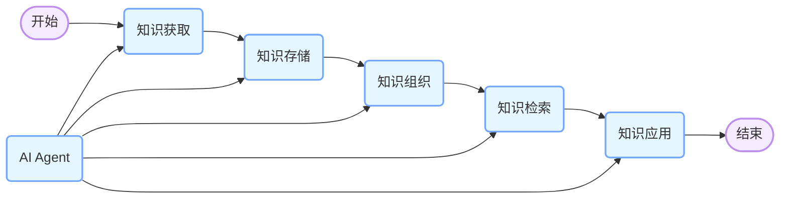

# AI Agent在企业知识管理中的应用与价值

> 关键词：AI Agent、企业知识管理、应用、价值、知识图谱

> 摘要：本文围绕AI Agent在企业知识管理中的应用与价值展开深入探讨。首先介绍了企业知识管理的背景，阐述了AI Agent的核心概念及其与知识管理的联系。接着详细分析了AI Agent的核心算法原理和具体操作步骤，并给出了相关的数学模型和公式。通过实际的项目实战案例，展示了AI Agent在企业知识管理中的具体实现和应用效果。同时探讨了AI Agent在企业知识管理中的实际应用场景，推荐了相关的工具和资源。最后对AI Agent在企业知识管理领域的未来发展趋势与挑战进行了总结，并提供了常见问题的解答和扩展阅读参考资料。

## 1. 背景介绍 
### 1.1 目的和范围
随着企业规模的不断扩大和业务的日益复杂，企业内部积累了大量的知识和信息。如何有效地管理这些知识，提高知识的利用效率，成为企业面临的重要挑战。AI Agent作为一种智能的软件实体，具有自主学习、推理和决策的能力，能够在企业知识管理中发挥重要作用。本文的目的是深入探讨AI Agent在企业知识管理中的应用与价值，分析其核心算法原理和操作步骤，通过实际案例展示其应用效果，并为企业在知识管理中应用AI Agent提供参考和指导。本文的范围主要涵盖AI Agent在企业知识管理中的各个方面，包括知识的获取、存储、组织、检索和应用等。

### 1.2 预期读者
本文的预期读者包括企业的知识管理相关人员，如知识管理专员、企业信息官等，他们希望了解如何利用AI Agent提升企业知识管理的效率和效果；软件开发人员和技术专家，对AI Agent的技术原理和实现感兴趣，希望将其应用到企业知识管理系统的开发中；企业的管理层，关注企业的信息化建设和知识资产的价值，希望了解AI Agent在企业知识管理中的战略意义和投资回报。

### 1.3 文档结构概述
本文共分为十个部分。第一部分为背景介绍，阐述了文章的目的和范围、预期读者以及文档结构概述，并给出了相关术语的定义和解释。第二部分介绍了AI Agent和企业知识管理的核心概念及其联系，通过文本示意图和Mermaid流程图进行了直观展示。第三部分详细讲解了AI Agent的核心算法原理和具体操作步骤，并使用Python源代码进行了说明。第四部分给出了相关的数学模型和公式，并进行了详细讲解和举例说明。第五部分通过项目实战案例，介绍了开发环境的搭建、源代码的实现和解读。第六部分探讨了AI Agent在企业知识管理中的实际应用场景。第七部分推荐了相关的学习资源、开发工具框架和论文著作。第八部分总结了AI Agent在企业知识管理领域的未来发展趋势与挑战。第九部分为附录，解答了常见问题。第十部分提供了扩展阅读和参考资料。

### 1.4 术语表
#### 1.4.1 核心术语定义
- **AI Agent**：一种能够感知环境、自主学习、推理和决策，并根据环境变化采取相应行动的智能软件实体。
- **企业知识管理**：对企业内部的知识和信息进行有效的获取、存储、组织、检索和应用，以提高企业的创新能力和竞争力。
- **知识图谱**：一种以图的形式表示知识的结构化数据模型，用于描述实体之间的关系和属性。
- **自然语言处理（NLP）**：研究如何让计算机理解和处理人类自然语言的技术。

#### 1.4.2 相关概念解释
- **智能搜索**：利用AI技术，如自然语言处理和机器学习，实现对知识的更精准、智能的搜索。
- **知识推荐**：根据用户的兴趣和需求，为用户推荐相关的知识和信息。
- **知识推理**：利用已有的知识和规则，推导出新的知识和结论。

#### 1.4.3 缩略词列表
- **AI**：Artificial Intelligence（人工智能）
- **NLP**：Natural Language Processing（自然语言处理）
- **KG**：Knowledge Graph（知识图谱）

## 2. 核心概念与联系 
### 核心概念原理
#### AI Agent
AI Agent是一个具有自主性、反应性、社会性和学习性的智能实体。自主性意味着它能够在没有人类干预的情况下自主地执行任务；反应性表示它能够感知环境的变化并做出相应的反应；社会性指的是它可以与其他Agent或人类进行交互；学习性则是指它能够通过学习不断提高自己的能力。AI Agent通常由感知模块、决策模块和执行模块组成。感知模块用于获取环境信息，决策模块根据感知到的信息进行推理和决策，执行模块则根据决策结果采取相应的行动。

#### 企业知识管理
企业知识管理的核心目标是将企业内部的知识和信息转化为企业的竞争优势。它包括知识的获取、存储、组织、检索和应用等环节。知识获取是指从企业内部和外部收集各种知识和信息；知识存储是将获取到的知识进行分类和存储，以便后续的使用；知识组织是对存储的知识进行结构化和关联化处理，形成知识体系；知识检索是根据用户的需求从知识体系中查找相关的知识；知识应用则是将检索到的知识应用到企业的实际业务中。

### 架构的文本示意图
```plaintext
企业知识管理系统
|
|--知识获取模块
|   |--内部数据源（文档、数据库等）
|   |--外部数据源（互联网、合作伙伴等）
|
|--知识存储模块
|   |--知识库（关系型数据库、非关系型数据库等）
|   |--知识图谱
|
|--知识组织模块
|   |--分类体系
|   |--关联规则
|
|--知识检索模块
|   |--搜索引擎
|   |--智能推荐系统
|
|--知识应用模块
|   |--业务流程
|   |--决策支持
|
|--AI Agent
|   |--感知模块（与各模块交互获取信息）
|   |--决策模块（基于知识和规则进行推理）
|   |--执行模块（执行决策结果，如更新知识、提供推荐等）
```

### Mermaid流程图


这个流程图展示了企业知识管理的主要流程，包括知识获取、存储、组织、检索和应用，同时也体现了AI Agent在各个环节中的参与和作用。

## 3. 核心算法原理 & 具体操作步骤 
### 核心算法原理
#### 自然语言处理算法
自然语言处理是AI Agent在企业知识管理中常用的技术之一，用于处理和理解人类语言。其中，词法分析、句法分析和语义分析是自然语言处理的基础算法。

- **词法分析**：将文本分割成单词或词元的过程。常用的算法有最大匹配法、基于统计的方法等。
- **句法分析**：分析句子的语法结构，确定句子中各个成分之间的关系。常见的算法有自顶向下分析法、自底向上分析法等。
- **语义分析**：理解文本的语义信息，确定文本所表达的含义。可以使用语义网络、本体等技术来实现。

#### 机器学习算法
机器学习算法用于让AI Agent从数据中学习和提取知识。在企业知识管理中，常用的机器学习算法包括分类算法、聚类算法和推荐算法。

- **分类算法**：将知识或信息分为不同的类别。常见的分类算法有决策树、支持向量机、神经网络等。
- **聚类算法**：将相似的知识或信息聚集在一起。常用的聚类算法有K-Means算法、层次聚类算法等。
- **推荐算法**：根据用户的历史行为和兴趣，为用户推荐相关的知识和信息。常见的推荐算法有基于内容的推荐算法、协同过滤推荐算法等。

### 具体操作步骤
#### 步骤1：知识获取
AI Agent通过感知模块从企业内部和外部数据源获取知识和信息。可以使用网络爬虫技术从互联网上抓取相关的文档和数据，也可以从企业内部的数据库和文档中提取知识。

#### 步骤2：知识预处理
对获取到的知识进行预处理，包括清洗、分词、去除停用词等操作。清洗是指去除文本中的噪声和无关信息；分词是将文本分割成单词或词元；去除停用词是指去除文本中的常用词，如“的”、“是”、“和”等。

#### 步骤3：知识表示
将预处理后的知识表示为计算机能够理解和处理的形式。可以使用知识图谱、向量空间模型等方法来表示知识。

#### 步骤4：知识推理
AI Agent根据已有的知识和规则，进行推理和推导新的知识。可以使用逻辑推理、基于规则的推理等方法来实现知识推理。

#### 步骤5：知识应用
将推理得到的知识应用到企业的实际业务中，如提供智能搜索、知识推荐、决策支持等服务。

### Python源代码示例
```python
import nltk
from nltk.corpus import stopwords
from nltk.tokenize import word_tokenize
from sklearn.feature_extraction.text import TfidfVectorizer
from sklearn.cluster import KMeans

# 下载必要的nltk数据
nltk.download('punkt')
nltk.download('stopwords')

# 知识获取和预处理示例
def preprocess_text(text):
    # 分词
    tokens = word_tokenize(text.lower())
    # 去除停用词
    stop_words = set(stopwords.words('english'))
    filtered_tokens = [token for token in tokens if token.isalpha() and token not in stop_words]
    return " ".join(filtered_tokens)

# 示例知识数据
documents = [
    "This is a document about artificial intelligence.",
    "Machine learning is a subfield of artificial intelligence.",
    "Knowledge management is important for businesses.",
    "AI can be applied in various industries."
]

# 预处理知识数据
preprocessed_documents = [preprocess_text(doc) for doc in documents]

# 知识表示：使用TF-IDF向量表示
vectorizer = TfidfVectorizer()
X = vectorizer.fit_transform(preprocessed_documents)

# 知识聚类：使用K-Means算法
kmeans = KMeans(n_clusters=2, random_state=42)
kmeans.fit(X)

# 输出聚类结果
for i, label in enumerate(kmeans.labels_):
    print(f"Document {i}: Cluster {label}")
```

在这个示例中，我们首先定义了一个`preprocess_text`函数，用于对文本进行预处理，包括分词和去除停用词。然后，我们使用`TfidfVectorizer`将预处理后的文本转换为TF-IDF向量表示。最后，我们使用`KMeans`算法对向量进行聚类，并输出聚类结果。

## 4. 数学模型和公式 & 详细讲解 & 举例说明 
### 词频 - 逆文档频率（TF - IDF）
#### 数学公式
词频 - 逆文档频率（TF - IDF）是一种常用的文本特征表示方法，用于衡量一个词在文档中的重要性。其计算公式如下：

$$TF - IDF(t, d, D) = TF(t, d) \times IDF(t, D)$$

其中：
- $TF(t, d)$ 表示词 $t$ 在文档 $d$ 中的词频，计算公式为：
$$TF(t, d) = \frac{词 t 在文档 d 中出现的次数}{文档 d 中的总词数}$$
- $IDF(t, D)$ 表示词 $t$ 在文档集合 $D$ 中的逆文档频率，计算公式为：
$$IDF(t, D) = \log\frac{|D|}{|{d \in D : t \in d}| + 1}$$

其中，$|D|$ 表示文档集合 $D$ 中的文档总数，$|{d \in D : t \in d}|$ 表示包含词 $t$ 的文档数量。

#### 详细讲解
TF - IDF的核心思想是，如果一个词在某个文档中频繁出现，同时在整个文档集合中很少出现，那么这个词对于该文档的重要性就比较高。词频（TF）反映了词在文档中的出现频率，逆文档频率（IDF）反映了词的稀有性。通过将两者相乘，可以得到一个综合的指标，用于衡量词在文档中的重要性。

#### 举例说明
假设我们有一个文档集合 $D$ 包含三个文档：
- $d_1$: "This is a document about artificial intelligence."
- $d_2$: "Machine learning is a subfield of artificial intelligence."
- $d_3$: "Knowledge management is important for businesses."

我们来计算词 "artificial" 的TF - IDF值。

首先，计算词频（TF）：
- 在 $d_1$ 中，"artificial" 出现了 1 次，文档总词数为 7，所以 $TF("artificial", d_1) = \frac{1}{7}$。
- 在 $d_2$ 中，"artificial" 出现了 1 次，文档总词数为 8，所以 $TF("artificial", d_2) = \frac{1}{8}$。
- 在 $d_3$ 中，"artificial" 没有出现，所以 $TF("artificial", d_3) = 0$。

然后，计算逆文档频率（IDF）：
包含 "artificial" 的文档有 2 个，文档集合总数为 3，所以 $IDF("artificial", D) = \log\frac{3}{2 + 1} = \log 1 = 0$。

最后，计算TF - IDF值：
- $TF - IDF("artificial", d_1, D) = TF("artificial", d_1) \times IDF("artificial", D) = \frac{1}{7} \times 0 = 0$
- $TF - IDF("artificial", d_2, D) = TF("artificial", d_2) \times IDF("artificial", D) = \frac{1}{8} \times 0 = 0$
- $TF - IDF("artificial", d_3, D) = TF("artificial", d_3) \times IDF("artificial", D) = 0 \times 0 = 0$

### K - Means聚类算法
#### 数学公式
K - Means聚类算法的目标是将 $n$ 个样本划分为 $k$ 个簇，使得簇内的样本相似度最大，簇间的样本相似度最小。其优化目标是最小化所有样本到其所属簇的质心的距离之和，即：

$$\min_{C_1, C_2, \cdots, C_k} \sum_{i = 1}^{k} \sum_{x \in C_i} ||x - \mu_i||^2$$

其中，$C_i$ 表示第 $i$ 个簇，$\mu_i$ 表示第 $i$ 个簇的质心，$||x - \mu_i||^2$ 表示样本 $x$ 到质心 $\mu_i$ 的欧几里得距离的平方。

#### 详细讲解
K - Means聚类算法的基本步骤如下：
1. **初始化**：随机选择 $k$ 个样本作为初始的簇质心。
2. **分配样本**：将每个样本分配到距离最近的簇质心所在的簇。
3. **更新质心**：计算每个簇内所有样本的平均值，作为新的簇质心。
4. **重复步骤2和3**：直到簇质心不再发生变化或达到最大迭代次数。

#### 举例说明
假设我们有以下四个二维样本：
$$x_1 = (1, 2), x_2 = (2, 3), x_3 = (8, 9), x_4 = (9, 10)$$

我们要将这些样本划分为 $k = 2$ 个簇。

1. **初始化**：随机选择 $x_1$ 和 $x_3$ 作为初始的簇质心，即 $\mu_1 = (1, 2)$ 和 $\mu_2 = (8, 9)$。
2. **分配样本**：
    - 计算 $x_2$ 到 $\mu_1$ 和 $\mu_2$ 的距离：
$||x_2 - \mu_1||^2 = (2 - 1)^2 + (3 - 2)^2 = 2$
$||x_2 - \mu_2||^2 = (2 - 8)^2 + (3 - 9)^2 = 72$
因为 $2 < 72$，所以 $x_2$ 分配到簇 $C_1$。
    - 计算 $x_4$ 到 $\mu_1$ 和 $\mu_2$ 的距离：
$||x_4 - \mu_1||^2 = (9 - 1)^2 + (10 - 2)^2 = 128$
$||x_4 - \mu_2||^2 = (9 - 8)^2 + (10 - 9)^2 = 2$
因为 $2 < 128$，所以 $x_4$ 分配到簇 $C_2$。

此时，$C_1 = \{x_1, x_2\}$，$C_2 = \{x_3, x_4\}$。

3. **更新质心**：
    - 计算簇 $C_1$ 的新质心 $\mu_1$：
$\mu_1 = \frac{(1, 2) + (2, 3)}{2} = (1.5, 2.5)$
    - 计算簇 $C_2$ 的新质心 $\mu_2$：
$\mu_2 = \frac{(8, 9) + (9, 10)}{2} = (8.5, 9.5)$

4. **重复步骤2和3**：继续迭代，直到簇质心不再发生变化。

## 5. 项目实战：代码实际案例和详细解释说明 
### 5.1  开发环境搭建
#### 操作系统
可以选择Windows、Linux或macOS操作系统。本项目推荐使用Linux系统，如Ubuntu 20.04，因为它具有良好的开源软件支持和稳定性。

#### Python环境
安装Python 3.7或更高版本。可以从Python官方网站（https://www.python.org/downloads/）下载并安装Python。安装完成后，使用以下命令验证Python版本：
```sh
python3 --version
```

#### 虚拟环境
为了避免不同项目之间的依赖冲突，建议使用虚拟环境。可以使用`venv`模块创建虚拟环境：
```sh
python3 -m venv myenv
```
激活虚拟环境：
- 在Windows上：
```sh
myenv\Scripts\activate
```
- 在Linux或macOS上：
```sh
source myenv/bin/activate
```

#### 安装依赖库
在激活的虚拟环境中，使用`pip`安装项目所需的依赖库：
```sh
pip install nltk sklearn pandas numpy flask
```

### 5.2  源代码详细实现和代码解读
#### 项目概述
本项目实现一个简单的企业知识管理系统，使用AI Agent进行知识的获取、预处理、聚类和搜索。系统包括一个Web界面，用户可以上传文档、进行搜索和查看聚类结果。

#### 代码实现

```python
import os
import nltk
from nltk.corpus import stopwords
from nltk.tokenize import word_tokenize
from sklearn.feature_extraction.text import TfidfVectorizer
from sklearn.cluster import KMeans
import pandas as pd
from flask import Flask, request, render_template_string

# 下载必要的nltk数据
nltk.download('punkt')
nltk.download('stopwords')

# 知识预处理函数
def preprocess_text(text):
    # 分词
    tokens = word_tokenize(text.lower())
    # 去除停用词
    stop_words = set(stopwords.words('english'))
    filtered_tokens = [token for token in tokens if token.isalpha() and token not in stop_words]
    return " ".join(filtered_tokens)

# 知识聚类函数
def cluster_documents(documents, num_clusters=2):
    preprocessed_documents = [preprocess_text(doc) for doc in documents]
    vectorizer = TfidfVectorizer()
    X = vectorizer.fit_transform(preprocessed_documents)
    kmeans = KMeans(n_clusters=num_clusters, random_state=42)
    kmeans.fit(X)
    return kmeans.labels_

# Flask应用
app = Flask(__name__)

@app.route('/', methods=['GET', 'POST'])
def index():
    if request.method == 'POST':
        # 获取上传的文档
        files = request.files.getlist('files')
        documents = []
        for file in files:
            if file:
                content = file.read().decode('utf-8')
                documents.append(content)
        
        # 进行聚类
        labels = cluster_documents(documents)
        
        # 显示聚类结果
        result = []
        for i, label in enumerate(labels):
            result.append(f"Document {i}: Cluster {label}")
        
        return render_template_string('''
            <html>
            <head>
                <title>Knowledge Management System</title>
            </head>
            <body>
                <h1>Clustering Results</h1>
                <ul>
                    
                        <li>{{ res }}</li>
                    
                </ul>
                <a href="/">Back to Upload</a>
            </body>
            </html>
        ''', result=result)
    
    return render_template_string('''
        <html>
        <head>
            <title>Knowledge Management System</title>
        </head>
        <body>
            <h1>Upload Documents</h1>
            <form method="post" enctype="multipart/form-data">
                <input type="file" name="files" multiple>
                <input type="submit" value="Upload and Cluster">
            </form>
        </body>
        </html>
    ''')

if __name__ == '__main__':
    app.run(debug=True)
```

#### 代码解读
1. **知识预处理函数**：`preprocess_text`函数用于对文本进行预处理，包括分词和去除停用词。
2. **知识聚类函数**：`cluster_documents`函数使用TF - IDF向量表示文本，并使用K - Means算法进行聚类。
3. **Flask应用**：使用Flask框架创建一个Web应用，提供一个上传文档的界面。用户上传文档后，系统对文档进行聚类，并显示聚类结果。

### 5.3  代码解读与分析
#### 优点
- **简单易懂**：代码结构清晰，使用了常见的Python库和算法，易于理解和维护。
- **可扩展性**：可以很容易地扩展功能，如添加知识搜索、知识推荐等功能。
- **用户友好**：提供了一个Web界面，用户可以方便地上传文档和查看聚类结果。

#### 缺点
- **功能有限**：目前只实现了知识聚类功能，还可以进一步完善其他知识管理功能。
- **性能问题**：对于大规模的文档集合，聚类算法的性能可能会受到影响。

## 6. 实际应用场景 
### 智能搜索
AI Agent可以利用自然语言处理技术，实现对企业知识的智能搜索。用户可以使用自然语言进行查询，AI Agent能够理解用户的意图，并从知识库中检索出相关的知识和信息。例如，用户可以输入“如何提高客户满意度”，AI Agent可以从企业的文档、案例库等知识库中找到相关的解决方案和建议。

### 知识推荐
AI Agent可以根据用户的历史行为和兴趣，为用户推荐相关的知识和信息。例如，当用户查看了一篇关于市场营销的文章后，AI Agent可以推荐其他相关的市场营销文章、案例和报告。知识推荐可以帮助用户发现新的知识和信息，提高知识的利用效率。

### 知识问答
AI Agent可以作为一个智能问答系统，回答用户关于企业知识的问题。用户可以通过文本或语音的方式提问，AI Agent能够根据知识库中的知识和规则进行推理和回答。例如，用户可以问“公司的产品有哪些特点”，AI Agent可以根据产品文档和知识库中的信息进行回答。

### 知识推理
AI Agent可以利用知识图谱和推理规则，进行知识推理和推导新的知识。例如，根据企业的组织架构和员工信息，AI Agent可以推导出员工之间的关系和职责；根据产品的属性和销售数据，AI Agent可以推导出产品的市场趋势和用户需求。

### 业务流程自动化
AI Agent可以集成到企业的业务流程中，实现业务流程的自动化。例如，在客户服务流程中，AI Agent可以自动处理客户的咨询和投诉，根据知识库中的解决方案进行回复；在项目管理流程中，AI Agent可以根据项目计划和资源信息，自动分配任务和提醒项目进度。

## 7. 工具和资源推荐
### 7.1 学习资源推荐
#### 7.1.1 书籍推荐
- 《人工智能：一种现代的方法》（Artificial Intelligence: A Modern Approach）：这是一本经典的人工智能教材，全面介绍了人工智能的各个领域，包括搜索算法、知识表示、推理、机器学习、自然语言处理等。
- 《Python自然语言处理》（Natural Language Processing with Python）：本书详细介绍了如何使用Python进行自然语言处理，包括词法分析、句法分析、语义分析、文本分类、信息检索等内容。
- 《机器学习》（Machine Learning）：由周志华教授编写，系统地介绍了机器学习的基本概念、算法和应用，是学习机器学习的优秀教材。

#### 7.1.2 在线课程
- Coursera上的“人工智能基础”（Foundations of Artificial Intelligence）课程：由斯坦福大学教授讲授，介绍了人工智能的基本概念、算法和应用。
- edX上的“自然语言处理”（Natural Language Processing）课程：由哥伦比亚大学教授讲授，深入探讨了自然语言处理的各种技术和方法。
- 吴恩达的“机器学习”课程：在Coursera平台上非常受欢迎，全面介绍了机器学习的基础知识和算法。

#### 7.1.3 技术博客和网站
- Medium：上面有很多关于人工智能、机器学习和自然语言处理的技术博客和文章，涵盖了最新的研究成果和应用案例。
- Towards Data Science：专注于数据科学和机器学习领域，提供了很多高质量的技术文章和教程。
- AI Time：是一个专注于人工智能领域的资讯平台，提供了最新的学术动态、行业新闻和技术分享。

### 7.2 开发工具框架推荐
#### 7.2.1 IDE和编辑器
- PyCharm：是一款专门为Python开发设计的集成开发环境（IDE），具有强大的代码编辑、调试和项目管理功能。
- Visual Studio Code：是一款轻量级的代码编辑器，支持多种编程语言，具有丰富的插件生态系统，可以方便地进行Python开发。

#### 7.2.2 调试和性能分析工具
- PDB：是Python自带的调试器，可以帮助开发者调试Python代码，定位和解决问题。
- cProfile：是Python的性能分析工具，可以分析代码的运行时间和函数调用次数，帮助开发者优化代码性能。

#### 7.2.3 相关框架和库
- NLTK：是Python中最常用的自然语言处理库，提供了丰富的工具和数据集，用于文本处理、词法分析、句法分析等任务。
- Scikit - learn：是Python中常用的机器学习库，提供了各种机器学习算法和工具，如分类、聚类、回归等。
- TensorFlow：是Google开发的开源机器学习框架，广泛应用于深度学习领域，支持各种深度学习模型的构建和训练。

### 7.3 相关论文著作推荐
#### 7.3.1 经典论文
- "A Mathematical Theory of Communication" by Claude E. Shannon：这篇论文奠定了信息论的基础，对自然语言处理和机器学习中的信息度量和编码有重要影响。
- "Perceptrons: An Introduction to Computational Geometry" by Marvin Minsky and Seymour Papert：这篇论文对感知机模型进行了深入研究，推动了神经网络的发展。
- "The PageRank Citation Ranking: Bringing Order to the Web" by Larry Page and Sergey Brin：这篇论文介绍了PageRank算法，是搜索引擎技术的重要基础。

#### 7.3.2 最新研究成果
- 可以关注顶级学术会议和期刊上的最新研究成果，如NeurIPS（神经信息处理系统大会）、ICML（国际机器学习会议）、ACL（计算语言学协会年会）等。

#### 7.3.3 应用案例分析
- 《AI 超实用：30 个落地案例全景解析》：本书介绍了人工智能在各个领域的应用案例，包括企业知识管理、医疗、金融等领域。
- 各大科技公司的官方博客和技术报告，如Google、Microsoft、IBM等公司会分享他们在人工智能领域的应用案例和实践经验。

## 8. 总结：未来发展趋势与挑战
### 未来发展趋势
#### 与其他技术的融合
AI Agent将与区块链、物联网、大数据等技术深度融合，为企业知识管理带来更强大的功能和价值。例如，结合区块链技术可以实现知识的安全存储和共享；结合物联网技术可以实时获取企业设备和环境的知识信息；结合大数据技术可以对海量的知识数据进行分析和挖掘。

#### 智能化程度不断提高
随着人工智能技术的不断发展，AI Agent的智能化程度将不断提高。它将具备更强的自主学习、推理和决策能力，能够更好地理解和满足企业用户的需求。例如，AI Agent可以自动发现企业知识管理中的问题，并提出相应的解决方案。

#### 个性化服务
未来的AI Agent将能够根据不同用户的角色、兴趣和需求，提供个性化的知识服务。例如，为企业的管理层提供战略决策相关的知识和分析报告；为普通员工提供与工作任务相关的知识和培训资料。

### 挑战
#### 数据质量和安全问题
企业知识管理中涉及大量的数据，数据的质量和安全是关键问题。如果数据存在错误、不完整或不一致的情况，会影响AI Agent的学习和决策效果。同时，企业需要保护知识数据的安全，防止数据泄露和滥用。

#### 技术复杂性和成本
AI Agent的开发和应用涉及到多种复杂的技术，如自然语言处理、机器学习、知识图谱等。企业需要具备一定的技术实力和专业人才来实施和维护AI Agent系统。此外，技术的研发和应用成本也是企业需要考虑的因素。

#### 员工接受度和培训
企业员工对AI Agent的接受度和使用能力也是一个挑战。一些员工可能对新技术存在抵触情绪，需要进行有效的培训和宣传，提高员工对AI Agent的认识和使用技能。

## 9. 附录：常见问题与解答
### 问题1：AI Agent在企业知识管理中需要多少数据才能有效工作？
解答：这取决于具体的应用场景和算法。一般来说，数据量越大，AI Agent的学习效果越好。但在某些情况下，即使是少量的数据，通过合适的算法和特征工程，也可以实现较好的效果。例如，在知识分类任务中，如果数据具有明显的特征和规律，几百条数据可能就可以训练出一个有效的分类模型。

### 问题2：如何确保AI Agent在企业知识管理中的决策是可靠的？
解答：可以从以下几个方面确保AI Agent决策的可靠性：
- **数据质量**：保证输入的数据准确、完整和一致。
- **算法选择**：选择合适的算法，并进行充分的验证和评估。
- **规则和约束**：设置明确的规则和约束，限制AI Agent的决策范围。
- **人工审核**：对AI Agent的决策结果进行人工审核和干预。

### 问题3：AI Agent与传统的知识管理系统有什么区别？
解答：传统的知识管理系统主要依赖于人工的知识录入、分类和检索，缺乏智能性和自主性。而AI Agent具有自主学习、推理和决策的能力，能够自动获取、处理和应用知识。它可以根据用户的需求和环境的变化，动态地调整知识管理策略，提供更个性化、智能化的服务。

### 问题4：AI Agent在企业知识管理中的应用会导致员工失业吗？
解答：AI Agent的应用主要是为了提高企业知识管理的效率和效果，而不是取代员工。虽然一些重复性、规律性的工作可能会被AI Agent自动化，但它也会创造新的工作机会，如AI Agent的开发、维护和管理，以及与AI Agent协作的工作。同时，员工可以将更多的时间和精力投入到创造性、战略性的工作中，提升自身的价值和竞争力。

## 10. 扩展阅读 & 参考资料
### 扩展阅读
- 《智能时代：大数据与智能革命重新定义未来》：介绍了人工智能和大数据对社会和经济的影响，以及未来的发展趋势。
- 《失控：全人类的最终命运和结局》：探讨了人工智能、生物进化等领域的复杂系统和自组织现象，对理解AI Agent的发展有一定的启发。

### 参考资料
- 《人工智能及其应用》，蔡自兴，清华大学出版社
- 《自然语言处理入门》，何晗，人民邮电出版社
- 《机器学习实战》，Peter Harrington，人民邮电出版社

作者：AI天才研究院/AI Genius Institute & 禅与计算机程序设计艺术 /Zen And The Art of Computer Programming