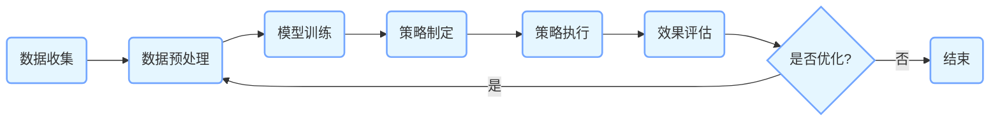

# AI Agent在企业精准营销策略制定中的应用

> 关键词：AI Agent、企业精准营销、营销策略制定、数据驱动、个性化推荐

> 摘要：本文深入探讨了AI Agent在企业精准营销策略制定中的应用。首先介绍了相关背景，包括目的范围、预期读者等。接着阐述了AI Agent和企业精准营销的核心概念及联系，分析了其核心算法原理和操作步骤，并给出了数学模型和公式。通过项目实战案例展示了如何运用AI Agent进行精准营销策略的制定，包括开发环境搭建、源代码实现与解读。还探讨了实际应用场景，推荐了相关工具和资源。最后总结了未来发展趋势与挑战，解答了常见问题，并提供了扩展阅读和参考资料，旨在帮助企业更好地利用AI Agent提升精准营销效果。

## 1. 背景介绍 
### 1.1 目的和范围
在当今竞争激烈的商业环境中，企业需要更精准、高效的营销策略来吸引和留住客户。传统的营销方式往往缺乏针对性，难以满足不同客户的个性化需求。AI Agent作为一种智能技术，能够通过对大量数据的分析和学习，为企业提供更精准的营销策略建议。本文的目的是深入探讨AI Agent在企业精准营销策略制定中的应用，包括其原理、方法、实际案例等，为企业提供实用的指导和参考。范围涵盖了AI Agent的基本概念、核心算法、数学模型，以及在不同行业的应用场景等。

### 1.2 预期读者
本文的预期读者包括企业营销人员、市场分析师、数据科学家、技术研发人员以及对AI和营销领域感兴趣的专业人士。对于营销人员来说，本文可以帮助他们了解如何利用AI Agent提升营销效果；对于数据科学家和技术研发人员，本文提供了相关的算法原理和实现方法；对于其他专业人士，本文可以作为了解AI在营销领域应用的参考资料。

### 1.3 文档结构概述
本文将按照以下结构进行组织：首先介绍AI Agent和企业精准营销的核心概念及联系，包括原理和架构的文本示意图和Mermaid流程图；接着详细讲解核心算法原理和具体操作步骤，并给出Python源代码示例；然后阐述数学模型和公式，并通过举例进行说明；再通过项目实战展示AI Agent在企业精准营销策略制定中的应用，包括开发环境搭建、源代码实现和代码解读；之后探讨实际应用场景；推荐相关的工具和资源；最后总结未来发展趋势与挑战，解答常见问题，并提供扩展阅读和参考资料。

### 1.4 术语表
#### 1.4.1 核心术语定义
- **AI Agent**：是一种能够感知环境、自主决策并采取行动以实现特定目标的智能实体。在本文中，主要指利用人工智能技术开发的软件程序，用于分析营销数据、提供营销策略建议等。
- **企业精准营销**：是指企业通过对客户数据的深入分析，了解客户的需求、偏好和行为特征，从而制定针对性的营销策略，以提高营销效果和客户满意度。
- **数据驱动营销**：是指企业基于大量的数据进行分析和决策，以优化营销活动的过程。通过收集、整理和分析客户数据，企业可以更好地了解市场需求，制定更精准的营销策略。
- **个性化推荐**：是指根据客户的个人信息、历史行为和偏好等，为客户提供个性化的产品或服务推荐。个性化推荐可以提高客户的购买意愿和忠诚度。

#### 1.4.2 相关概念解释
- **机器学习**：是一门多领域交叉学科，涉及概率论、统计学、逼近论、凸分析、算法复杂度理论等多门学科。它专门研究计算机怎样模拟或实现人类的学习行为，以获取新的知识或技能，重新组织已有的知识结构使之不断改善自身的性能。在AI Agent中，机器学习算法常用于数据挖掘、模型训练和预测等。
- **深度学习**：是机器学习的一个分支领域，它是一种基于对数据进行表征学习的方法。深度学习通过构建多层神经网络，自动从数据中学习特征和模式，从而实现更复杂的任务，如图像识别、自然语言处理等。在企业精准营销中，深度学习可以用于客户画像的构建和预测分析。
- **自然语言处理**：是计算机科学领域与人工智能领域中的一个重要方向。它研究能实现人与计算机之间用自然语言进行有效通信的各种理论和方法。在AI Agent中，自然语言处理可以用于文本分析、情感分析和对话系统等。

#### 1.4.3 缩略词列表
- **AI**：Artificial Intelligence，人工智能
- **ML**：Machine Learning，机器学习
- **DL**：Deep Learning，深度学习
- **NLP**：Natural Language Processing，自然语言处理

## 2. 核心概念与联系 

### 核心概念原理
#### AI Agent原理
AI Agent的核心原理是基于感知、决策和行动的循环过程。它通过传感器感知环境信息，然后利用内部的决策机制对这些信息进行分析和处理，最后根据决策结果采取相应的行动。在企业精准营销策略制定中，AI Agent可以通过收集和分析营销数据，如客户信息、市场趋势、竞争对手数据等，来制定针对性的营销策略。

#### 企业精准营销原理
企业精准营销的原理是基于对客户数据的深入分析，了解客户的需求、偏好和行为特征。通过对客户进行细分，企业可以将目标市场划分为不同的客户群体，然后针对每个客户群体制定个性化的营销策略。精准营销可以提高营销效果，降低营销成本，增强客户满意度和忠诚度。

### 架构的文本示意图
AI Agent在企业精准营销策略制定中的架构可以分为以下几个层次：
- **数据层**：负责收集和存储各种营销数据，包括客户信息、交易记录、市场数据等。数据可以来自企业内部的数据库、外部的数据源和社交媒体等。
- **模型层**：利用机器学习和深度学习算法对数据进行分析和建模。模型可以用于客户细分、需求预测、个性化推荐等。
- **决策层**：根据模型的输出结果，AI Agent制定具体的营销策略。决策层可以考虑多种因素，如营销目标、预算限制、市场竞争等。
- **执行层**：将制定好的营销策略付诸实施，包括广告投放、促销活动、客户沟通等。执行层可以通过自动化工具和营销平台来实现。

### Mermaid流程图


该流程图展示了AI Agent在企业精准营销策略制定中的主要流程。首先，收集各种营销数据并进行预处理；然后，使用预处理后的数据进行模型训练；根据模型的输出结果制定营销策略并执行；最后，对营销效果进行评估。如果效果不理想，则对模型和策略进行优化，重新开始整个流程。

## 3. 核心算法原理 & 具体操作步骤 

### 核心算法原理
#### 客户细分算法
客户细分是企业精准营销的基础。常用的客户细分算法包括聚类算法和分类算法。聚类算法可以将客户根据相似性划分为不同的群体，而分类算法可以根据已知的客户类别对新客户进行分类。

以下是一个使用K-Means聚类算法进行客户细分的Python示例代码：
```python
import numpy as np
from sklearn.cluster import KMeans
import matplotlib.pyplot as plt

# 生成示例数据
X = np.array([[1, 2], [1, 4], [1, 0],
              [4, 2], [4, 4], [4, 0]])

# 创建K-Means模型
kmeans = KMeans(n_clusters=2, random_state=0).fit(X)

# 获取聚类标签
labels = kmeans.labels_

# 可视化聚类结果
plt.scatter(X[:, 0], X[:, 1], c=labels, cmap='viridis')
plt.scatter(kmeans.cluster_centers_[:, 0], kmeans.cluster_centers_[:, 1], marker='x', s=200, linewidths=3, color='r')
plt.show()
```
在上述代码中，首先生成了一些示例数据，然后使用K-Means算法将这些数据划分为两个聚类。最后，将聚类结果可视化展示。

#### 需求预测算法
需求预测是企业制定营销策略的重要依据。常用的需求预测算法包括时间序列分析、回归分析和神经网络等。

以下是一个使用简单线性回归进行需求预测的Python示例代码：
```python
import numpy as np
from sklearn.linear_model import LinearRegression

# 生成示例数据
X = np.array([1, 2, 3, 4, 5]).reshape(-1, 1)
y = np.array([2, 4, 6, 8, 10])

# 创建线性回归模型
model = LinearRegression()
model.fit(X, y)

# 进行预测
new_X = np.array([6]).reshape(-1, 1)
prediction = model.predict(new_X)
print("预测结果:", prediction)
```
在上述代码中，首先生成了一些示例数据，然后使用线性回归算法对数据进行拟合。最后，使用拟合好的模型对新的数据进行预测。

### 具体操作步骤
#### 数据收集
收集各种营销数据，包括客户信息（如年龄、性别、职业等）、交易记录（如购买时间、购买金额等）、市场数据（如市场份额、竞争对手信息等）。数据可以来自企业内部的数据库、外部的数据源和社交媒体等。

#### 数据预处理
对收集到的数据进行清洗、转换和归一化等预处理操作。清洗数据可以去除噪声和缺失值，转换数据可以将数据转换为适合模型处理的格式，归一化数据可以将数据缩放到相同的尺度。

#### 模型训练
选择合适的算法对预处理后的数据进行模型训练。根据营销目标和数据特点，选择不同的算法，如聚类算法、分类算法、回归算法等。在训练过程中，使用交叉验证等方法评估模型的性能，并调整模型的参数以提高性能。

#### 策略制定
根据模型的输出结果，制定具体的营销策略。例如，根据客户细分结果，为不同的客户群体制定不同的促销活动；根据需求预测结果，合理安排库存和生产计划。

#### 策略执行
将制定好的营销策略付诸实施。可以通过自动化工具和营销平台来实现，如电子邮件营销、社交媒体营销、搜索引擎营销等。

#### 效果评估
对营销效果进行评估，如销售额、客户满意度、市场份额等。根据评估结果，判断营销策略的有效性，并对模型和策略进行优化。

## 4. 数学模型和公式 & 详细讲解 & 举例说明 

### 聚类算法数学模型
#### K-Means算法
K-Means算法的目标是将数据集 $X = \{x_1, x_2, \cdots, x_n\}$ 划分为 $k$ 个聚类 $C = \{C_1, C_2, \cdots, C_k\}$，使得每个聚类内的数据点到该聚类中心的距离之和最小。数学公式表示为：
$$
\min_{C} \sum_{i=1}^{k} \sum_{x_j \in C_i} \| x_j - \mu_i \|^2
$$
其中，$\mu_i$ 是第 $i$ 个聚类的中心，$\| \cdot \|$ 表示欧几里得距离。

### 详细讲解
K-Means算法的基本步骤如下：
1. 随机初始化 $k$ 个聚类中心 $\mu_1, \mu_2, \cdots, \mu_k$。
2. 对于每个数据点 $x_j$，计算它到每个聚类中心的距离，并将其分配到距离最近的聚类中。
3. 重新计算每个聚类的中心 $\mu_i$，即该聚类内所有数据点的平均值。
4. 重复步骤2和3，直到聚类中心不再发生变化或达到最大迭代次数。

### 举例说明
假设有以下数据集：
$$
X = \begin{bmatrix}
1 & 2 \\
1 & 4 \\
1 & 0 \\
4 & 2 \\
4 & 4 \\
4 & 0
\end{bmatrix}
$$
我们希望将这些数据点划分为2个聚类。首先，随机初始化2个聚类中心，例如 $\mu_1 = [1, 2]$ 和 $\mu_2 = [4, 2]$。然后，计算每个数据点到这两个聚类中心的距离，并将其分配到距离最近的聚类中。接着，重新计算每个聚类的中心。重复这个过程，直到聚类中心不再发生变化。

### 回归算法数学模型
#### 线性回归算法
线性回归算法的目标是找到一个线性函数 $y = \theta_0 + \theta_1 x_1 + \theta_2 x_2 + \cdots + \theta_n x_n$，使得预测值 $\hat{y}$ 与真实值 $y$ 之间的误差最小。数学公式表示为：
$$
\min_{\theta} \sum_{i=1}^{m} (y^{(i)} - \hat{y}^{(i)})^2 = \min_{\theta} \sum_{i=1}^{m} (y^{(i)} - \theta_0 - \theta_1 x_1^{(i)} - \theta_2 x_2^{(i)} - \cdots - \theta_n x_n^{(i)})^2
$$
其中，$m$ 是样本数量，$y^{(i)}$ 是第 $i$ 个样本的真实值，$\hat{y}^{(i)}$ 是第 $i$ 个样本的预测值，$\theta_0, \theta_1, \cdots, \theta_n$ 是模型的参数。

### 详细讲解
线性回归算法的基本步骤如下：
1. 初始化模型的参数 $\theta_0, \theta_1, \cdots, \theta_n$。
2. 计算预测值 $\hat{y}$。
3. 计算误差函数 $J(\theta)$。
4. 使用梯度下降等优化算法更新模型的参数 $\theta$，使得误差函数 $J(\theta)$ 最小。
5. 重复步骤2、3和4，直到误差函数 $J(\theta)$ 收敛或达到最大迭代次数。

### 举例说明
假设有以下数据集：
$$
X = \begin{bmatrix}
1 \\
2 \\
3 \\
4 \\
5
\end{bmatrix},
y = \begin{bmatrix}
2 \\
4 \\
6 \\
8 \\
10
\end{bmatrix}
$$
我们希望找到一个线性函数 $y = \theta_0 + \theta_1 x$ 来拟合这些数据。首先，初始化模型的参数 $\theta_0 = 0$ 和 $\theta_1 = 0$。然后，计算预测值 $\hat{y}$，并计算误差函数 $J(\theta)$。接着，使用梯度下降算法更新模型的参数 $\theta$。重复这个过程，直到误差函数 $J(\theta)$ 收敛。最终得到的线性函数为 $y = 0 + 2x$。

## 5. 项目实战：代码实际案例和详细解释说明 

### 5.1  开发环境搭建
#### 安装Python
首先，需要安装Python编程语言。可以从Python官方网站（https://www.python.org/downloads/） 下载适合自己操作系统的Python版本，并按照安装向导进行安装。

#### 安装必要的库
在项目中，需要使用一些Python库，如NumPy、Pandas、Scikit-learn等。可以使用以下命令来安装这些库：
```bash
pip install numpy pandas scikit-learn
```

### 5.2  源代码详细实现和代码解读
以下是一个完整的项目实战代码示例，展示了如何使用AI Agent进行企业精准营销策略制定：
```python
import numpy as np
import pandas as pd
from sklearn.cluster import KMeans
from sklearn.linear_model import LinearRegression
from sklearn.model_selection import train_test_split
from sklearn.preprocessing import StandardScaler

# 数据加载
data = pd.read_csv('marketing_data.csv')

# 数据预处理
# 提取特征和目标变量
X = data.drop('target_variable', axis=1)
y = data['target_variable']

# 数据标准化
scaler = StandardScaler()
X_scaled = scaler.fit_transform(X)

# 客户细分
# 使用K-Means算法进行客户细分
kmeans = KMeans(n_clusters=3, random_state=0)
kmeans.fit(X_scaled)
labels = kmeans.labels_

# 将聚类标签添加到原始数据中
data['cluster'] = labels

# 需求预测
# 划分训练集和测试集
X_train, X_test, y_train, y_test = train_test_split(X_scaled, y, test_size=0.2, random_state=0)

# 创建线性回归模型
model = LinearRegression()
model.fit(X_train, y_train)

# 进行预测
y_pred = model.predict(X_test)

# 策略制定
# 根据聚类结果和需求预测结果制定营销策略
# 示例：为不同聚类的客户制定不同的促销活动
for cluster in range(3):
    cluster_data = data[data['cluster'] == cluster]
    if len(cluster_data) > 0:
        # 这里可以根据需求预测结果和其他因素制定具体的营销策略
        print(f"为聚类 {cluster} 的客户制定促销活动")

# 效果评估
from sklearn.metrics import mean_squared_error
mse = mean_squared_error(y_test, y_pred)
print(f"均方误差: {mse}")
```
### 代码解读
1. **数据加载**：使用Pandas库读取营销数据文件 `marketing_data.csv`。
2. **数据预处理**：提取特征和目标变量，并使用 `StandardScaler` 对特征数据进行标准化处理。
3. **客户细分**：使用K-Means算法将客户划分为3个聚类，并将聚类标签添加到原始数据中。
4. **需求预测**：将数据划分为训练集和测试集，使用线性回归模型进行训练和预测。
5. **策略制定**：根据聚类结果和需求预测结果，为不同聚类的客户制定不同的促销活动。
6. **效果评估**：使用均方误差（MSE）评估需求预测模型的性能。

### 5.3  代码解读与分析
#### 数据预处理的重要性
数据预处理是机器学习项目中非常重要的一步。通过数据标准化，可以消除不同特征之间的量纲差异，提高模型的训练效果。同时，数据清洗和缺失值处理可以去除噪声和异常值，提高数据的质量。

#### 客户细分的作用
客户细分可以帮助企业更好地了解客户的需求和偏好，从而制定更有针对性的营销策略。通过将客户划分为不同的聚类，企业可以为每个聚类的客户提供个性化的产品或服务，提高客户满意度和忠诚度。

#### 需求预测的意义
需求预测可以帮助企业合理安排生产和库存，降低成本。通过对市场需求的预测，企业可以提前做好准备，避免缺货和积压库存的情况发生。

#### 策略制定的灵活性
策略制定需要根据聚类结果和需求预测结果进行灵活调整。不同聚类的客户可能有不同的需求和偏好，因此需要制定不同的营销策略。同时，需求预测结果也可以为营销策略的制定提供参考，如促销活动的力度和时间等。

## 6. 实际应用场景 
### 电子商务行业
在电子商务行业，AI Agent可以用于客户细分、个性化推荐和营销活动优化等方面。通过对客户的购买历史、浏览行为和搜索记录等数据进行分析，AI Agent可以将客户划分为不同的群体，并为每个群体提供个性化的产品推荐。同时，AI Agent还可以根据客户的需求和偏好，制定针对性的营销活动，如优惠券发放、限时折扣等，提高客户的购买转化率和忠诚度。

### 金融行业
在金融行业，AI Agent可以用于风险评估、客户服务和精准营销等方面。通过对客户的信用记录、财务状况和投资偏好等数据进行分析，AI Agent可以评估客户的风险等级，并为客户提供个性化的金融产品推荐。同时，AI Agent还可以通过智能客服系统，为客户提供实时的咨询和服务，提高客户的满意度和忠诚度。

### 医疗行业
在医疗行业，AI Agent可以用于疾病预测、医疗资源分配和健康管理等方面。通过对患者的病历、基因数据和生活习惯等数据进行分析，AI Agent可以预测患者的疾病风险，并为患者提供个性化的健康建议。同时，AI Agent还可以根据患者的需求和病情，合理分配医疗资源，提高医疗效率和质量。

### 零售行业
在零售行业，AI Agent可以用于商品陈列优化、库存管理和促销活动策划等方面。通过对消费者的购物行为和偏好等数据进行分析，AI Agent可以优化商品的陈列布局，提高商品的曝光率和销售量。同时，AI Agent还可以根据销售数据和市场趋势，合理安排库存，避免缺货和积压库存的情况发生。此外，AI Agent还可以根据消费者的需求和偏好，制定针对性的促销活动，提高消费者的购买意愿和忠诚度。

## 7. 工具和资源推荐
### 7.1 学习资源推荐
#### 7.1.1 书籍推荐
- 《Python机器学习》：本书详细介绍了Python在机器学习领域的应用，包括数据预处理、模型选择、算法实现等方面的内容。
- 《深度学习》：由深度学习领域的三位顶尖专家Ian Goodfellow、Yoshua Bengio和Aaron Courville撰写，全面介绍了深度学习的基本原理、算法和应用。
- 《人工智能：一种现代的方法》：本书是人工智能领域的经典教材，涵盖了人工智能的各个方面，包括搜索算法、知识表示、机器学习、自然语言处理等。

#### 7.1.2 在线课程
- Coursera上的“机器学习”课程：由斯坦福大学教授Andrew Ng主讲，是机器学习领域的经典课程，适合初学者入门。
- edX上的“深度学习”课程：由麻省理工学院等高校的教授联合授课，深入介绍了深度学习的原理和应用。
- Kaggle上的“机器学习微课程”：提供了一系列的机器学习微课程，内容简洁明了，适合快速学习和实践。

#### 7.1.3 技术博客和网站
- Towards Data Science：是一个专注于数据科学和机器学习的技术博客，提供了大量的优质文章和教程。
- Medium上的“AI”主题：汇集了众多人工智能领域的专家和爱好者，分享了最新的技术动态和研究成果。
- GitHub：是全球最大的开源代码托管平台，上面有许多优秀的机器学习和人工智能项目，可以学习和参考。

### 7.2 开发工具框架推荐
#### 7.2.1 IDE和编辑器
- PyCharm：是一款专门为Python开发设计的集成开发环境（IDE），具有强大的代码编辑、调试和项目管理功能。
- Jupyter Notebook：是一个基于Web的交互式计算环境，适合进行数据探索、模型训练和可视化等工作。
- Visual Studio Code：是一款轻量级的代码编辑器，支持多种编程语言和插件扩展，非常适合快速开发和调试。

#### 7.2.2 调试和性能分析工具
- TensorBoard：是TensorFlow提供的一个可视化工具，可以用于查看模型的训练过程、性能指标和数据可视化等。
- Py-Spy：是一个用于Python程序性能分析的工具，可以帮助开发者找出程序中的性能瓶颈。
- Numba：是一个用于加速Python代码的即时编译器，可以显著提高Python代码的执行速度。

#### 7.2.3 相关框架和库
- TensorFlow：是Google开发的一个开源机器学习框架，广泛应用于深度学习领域，提供了丰富的工具和库。
- PyTorch：是Facebook开发的一个开源深度学习框架，具有动态图、易于使用等特点，受到了许多研究者和开发者的喜爱。
- Scikit-learn：是一个用于机器学习的Python库，提供了丰富的机器学习算法和工具，适合初学者和快速开发。

### 7.3 相关论文著作推荐
#### 7.3.1 经典论文
- “Gradient-Based Learning Applied to Document Recognition”：由Yann LeCun等人撰写，介绍了卷积神经网络（CNN）在手写数字识别中的应用，是深度学习领域的经典论文之一。
- “Attention Is All You Need”：由Google Brain团队撰写，提出了Transformer模型，为自然语言处理领域带来了革命性的变化。
- “A Survey on Transfer Learning”：对迁移学习进行了全面的综述，介绍了迁移学习的基本概念、方法和应用。

#### 7.3.2 最新研究成果
- 可以关注顶级学术会议如NeurIPS、ICML、CVPR等的论文，了解人工智能领域的最新研究成果。
- 一些知名的学术期刊如Journal of Artificial Intelligence Research（JAIR）、Artificial Intelligence等也会发表高质量的研究论文。

#### 7.3.3 应用案例分析
- 《AI in Marketing》：介绍了人工智能在营销领域的应用案例和实践经验，对企业营销人员有很大的参考价值。
- 《Data-Driven Marketing: The 15 Metrics Everyone in Marketing Should Know》：强调了数据驱动营销的重要性，并介绍了15个关键的营销指标和应用案例。

## 8. 总结：未来发展趋势与挑战
### 未来发展趋势
#### 更强大的智能决策能力
随着人工智能技术的不断发展，AI Agent将具备更强大的智能决策能力。它可以综合考虑更多的因素，如市场动态、竞争对手策略、客户情绪等，为企业提供更精准、更具前瞻性的营销策略建议。

#### 与物联网和区块链的融合
AI Agent将与物联网和区块链技术深度融合。通过物联网设备收集更多的实时数据，AI Agent可以更好地了解客户的行为和需求。而区块链技术可以提供更安全、可信的数据存储和共享环境，保证营销数据的真实性和完整性。

#### 个性化营销的深化
未来，AI Agent将进一步深化个性化营销。除了根据客户的基本信息和历史行为进行个性化推荐外，还可以根据客户的实时情境和情绪状态提供更加个性化的营销内容和服务。

### 挑战
#### 数据隐私和安全问题
随着AI Agent对大量客户数据的收集和分析，数据隐私和安全问题变得尤为重要。企业需要采取有效的措施来保护客户的个人信息，防止数据泄露和滥用。

#### 算法可解释性
许多人工智能算法，如深度学习算法，具有较高的复杂性和黑盒性，难以解释其决策过程和结果。在企业精准营销策略制定中，算法的可解释性至关重要，因为企业需要了解为什么推荐某个策略，以便做出合理的决策。

#### 技术人才短缺
人工智能技术的发展需要大量的专业人才，包括数据科学家、算法工程师、人工智能专家等。目前，市场上这类人才相对短缺，企业在招聘和培养相关人才方面面临一定的挑战。

## 9. 附录：常见问题与解答
### 问题1：AI Agent在企业精准营销中的应用成本高吗？
解答：AI Agent的应用成本取决于多个因素，如数据收集和存储成本、算法开发和维护成本、硬件设备成本等。对于一些小型企业来说，可能需要投入一定的资金来建立和使用AI Agent系统。但从长期来看，AI Agent可以提高营销效果，降低营销成本，为企业带来更大的收益。

### 问题2：如何评估AI Agent制定的营销策略的效果？
解答：可以从多个方面评估营销策略的效果，如销售额、客户满意度、市场份额、转化率等。同时，还可以使用一些数据分析指标，如ROI（投资回报率）、CPA（每次获取成本）等，来评估营销策略的经济效益。

### 问题3：AI Agent是否可以完全替代人工进行营销策略制定？
解答：虽然AI Agent可以提供有价值的营销策略建议，但目前还不能完全替代人工。人工营销人员具有丰富的经验和判断力，可以根据市场的变化和企业的实际情况进行灵活调整。因此，在实际应用中，通常采用AI Agent和人工相结合的方式进行营销策略制定。

## 10. 扩展阅读 & 参考资料
### 扩展阅读
- 《营销管理》：是营销领域的经典著作，全面介绍了营销管理的理论和实践。
- 《数字营销：从策略到执行》：介绍了数字营销的最新趋势和方法，包括社交媒体营销、搜索引擎营销、内容营销等。

### 参考资料
- 相关学术论文和研究报告，可以从学术数据库如IEEE Xplore、ACM Digital Library等获取。
- 企业的官方网站和行业报告，了解企业在精准营销方面的实践经验和案例。

作者：AI天才研究院/AI Genius Institute & 禅与计算机程序设计艺术 /Zen And The Art of Computer Programming