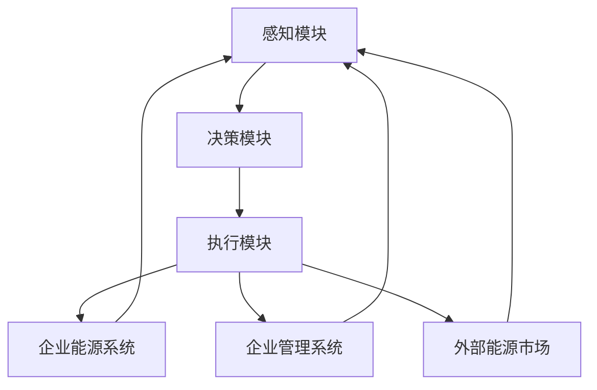

# AI Agent在企业能源管理与可持续发展中的应用

> 关键词：AI Agent、企业能源管理、可持续发展、能源优化、智能决策

> 摘要：本文深入探讨了AI Agent在企业能源管理与可持续发展中的应用。首先介绍了相关背景，包括目的、预期读者、文档结构和术语表。接着阐述了AI Agent的核心概念及其与企业能源管理的联系，通过文本示意图和Mermaid流程图进行了清晰展示。详细讲解了核心算法原理，并给出Python源代码示例。同时介绍了相关的数学模型和公式，并举例说明。通过项目实战，展示了代码的实际案例和详细解释。分析了AI Agent在企业能源管理中的实际应用场景，推荐了相关的工具和资源，包括学习资源、开发工具框架和论文著作。最后总结了未来发展趋势与挑战，提供了常见问题与解答以及扩展阅读和参考资料，旨在为企业利用AI Agent实现能源管理和可持续发展提供全面的技术指导。

## 1. 背景介绍 
### 1.1 目的和范围
随着全球对可持续发展的关注度不断提高，企业在能源管理方面面临着越来越大的压力和挑战。如何降低能源消耗、提高能源利用效率、减少碳排放成为企业亟待解决的问题。AI Agent作为一种智能技术，具有自主学习、决策和执行的能力，能够为企业能源管理提供有效的解决方案。本文的目的是深入探讨AI Agent在企业能源管理与可持续发展中的应用，介绍相关的技术原理、算法、数学模型和实际案例，为企业提供全面的技术指导和参考。

本文的范围主要涵盖AI Agent的基本概念、核心算法原理、在企业能源管理中的具体应用场景、项目实战案例以及相关的工具和资源推荐等方面。

### 1.2 预期读者
本文的预期读者包括企业能源管理人员、可持续发展专家、IT技术人员、人工智能研究人员以及对企业能源管理和可持续发展感兴趣的相关人士。通过阅读本文，读者可以了解AI Agent在企业能源管理中的应用原理和方法，掌握相关的技术和工具，为企业的能源管理和可持续发展提供决策支持和技术保障。

### 1.3 文档结构概述
本文的文档结构如下：
1. **背景介绍**：介绍本文的目的、范围、预期读者、文档结构和术语表。
2. **核心概念与联系**：阐述AI Agent的核心概念及其与企业能源管理的联系，通过文本示意图和Mermaid流程图进行展示。
3. **核心算法原理 & 具体操作步骤**：详细讲解AI Agent的核心算法原理，并给出Python源代码示例。
4. **数学模型和公式 & 详细讲解 & 举例说明**：介绍相关的数学模型和公式，并举例说明其在企业能源管理中的应用。
5. **项目实战：代码实际案例和详细解释说明**：通过项目实战，展示代码的实际案例和详细解释。
6. **实际应用场景**：分析AI Agent在企业能源管理中的实际应用场景。
7. **工具和资源推荐**：推荐相关的工具和资源，包括学习资源、开发工具框架和论文著作。
8. **总结：未来发展趋势与挑战**：总结AI Agent在企业能源管理与可持续发展中的未来发展趋势和挑战。
9. **附录：常见问题与解答**：提供常见问题的解答。
10. **扩展阅读 & 参考资料**：提供扩展阅读和参考资料。

### 1.4 术语表
#### 1.4.1 核心术语定义
- **AI Agent**：人工智能代理，是一种能够感知环境、自主学习、做出决策并执行相应动作的智能实体。
- **企业能源管理**：企业通过对能源的采购、分配、使用等环节进行计划、组织、控制和监督，以实现能源的合理利用和降低能源消耗的管理活动。
- **可持续发展**：既满足当代人的需求，又不损害后代人满足其需求的能力的发展模式。
- **能源优化**：通过合理配置能源资源、采用先进的能源技术和管理方法，提高能源利用效率，降低能源消耗和成本的过程。
- **智能决策**：利用人工智能技术，对大量的数据进行分析和处理，为决策者提供科学、合理的决策建议的过程。

#### 1.4.2 相关概念解释
- **多智能体系统**：由多个AI Agent组成的系统，这些Agent之间可以相互协作、通信和竞争，以实现共同的目标。
- **强化学习**：一种机器学习方法，Agent通过与环境进行交互，根据环境反馈的奖励信号来学习最优的行为策略。
- **深度学习**：一种基于人工神经网络的机器学习方法，能够自动从大量的数据中学习特征和模式。
- **物联网**：通过各种信息传感设备，将物品与互联网连接起来，实现物品的智能化识别、定位、跟踪、监控和管理的网络。

#### 1.4.3 缩略词列表
- **AI**：Artificial Intelligence，人工智能
- **IoT**：Internet of Things，物联网
- **RL**：Reinforcement Learning，强化学习
- **DL**：Deep Learning，深度学习
- **MAS**：Multi-Agent System，多智能体系统

## 2. 核心概念与联系 

### 2.1 AI Agent的核心概念
AI Agent是一种能够感知环境、自主学习、做出决策并执行相应动作的智能实体。它通常由感知模块、决策模块和执行模块组成。感知模块用于收集环境信息，决策模块根据感知到的信息进行分析和推理，做出决策，执行模块根据决策结果执行相应的动作。

AI Agent具有以下特点：
- **自主性**：能够独立地感知环境、做出决策和执行动作，不需要人工干预。
- **学习能力**：能够通过与环境进行交互，不断学习和改进自己的行为策略。
- **适应性**：能够根据环境的变化及时调整自己的行为策略，以适应不同的环境需求。
- **协作性**：多个AI Agent可以相互协作，共同完成复杂的任务。

### 2.2 AI Agent与企业能源管理的联系
在企业能源管理中，AI Agent可以发挥重要的作用。通过感知企业的能源使用情况、设备运行状态、环境参数等信息，AI Agent可以对能源消耗进行实时监测和分析，发现能源浪费的环节和潜在的节能机会。同时，AI Agent可以根据分析结果做出决策，如调整设备的运行参数、优化能源分配方案等，以实现能源的优化利用和降低能源消耗。

此外，AI Agent还可以与企业的其他管理系统进行集成，如企业资源计划（ERP）系统、生产管理系统等，实现信息的共享和协同工作，提高企业的整体管理效率和决策水平。

### 2.3 文本示意图
以下是AI Agent在企业能源管理中的应用示意图：

```plaintext
+-------------------+         +-------------------+         +-------------------+
|    感知模块       |         |    决策模块       |         |    执行模块       |
+-------------------+         +-------------------+         +-------------------+
| - 能源使用数据     |         | - 数据分析与推理  |         | - 设备控制        |
| - 设备运行状态     |         | - 节能策略生成    |         | - 能源分配调整    |
| - 环境参数         |         | - 决策优化        |         | - 能源采购建议    |
+-------------------+         +-------------------+         +-------------------+
           |                             |                             |
           |                             |                             |
           v                             v                             v
+-------------------+         +-------------------+         +-------------------+
|    企业能源系统    |         |    企业管理系统    |         |    外部能源市场  |
+-------------------+         +-------------------+         +-------------------+
```

### 2.4 Mermaid流程图


## 3. 核心算法原理 & 具体操作步骤 

### 3.1 强化学习算法原理
强化学习是AI Agent常用的一种学习算法。在强化学习中，Agent通过与环境进行交互，根据环境反馈的奖励信号来学习最优的行为策略。具体来说，强化学习的基本要素包括：
- **状态（State）**：表示环境的当前状态，Agent根据状态来做出决策。
- **动作（Action）**：Agent可以采取的行为，不同的动作会导致环境状态的变化。
- **奖励（Reward）**：环境对Agent采取的动作的反馈，用于评价动作的好坏。
- **策略（Policy）**：Agent根据状态选择动作的规则，目标是找到最优的策略，使得累积奖励最大。

强化学习的基本流程如下：
1. Agent感知环境的当前状态 $s_t$。
2. 根据当前策略 $\pi$ 选择动作 $a_t$。
3. 执行动作 $a_t$，环境状态转移到 $s_{t+1}$，并获得奖励 $r_t$。
4. 根据奖励 $r_t$ 和新的状态 $s_{t+1}$ 更新策略 $\pi$。
5. 重复步骤1-4，直到达到终止条件。

### 3.2 Python源代码示例
以下是一个简单的强化学习示例，使用OpenAI Gym库中的CartPole环境：

```python
import gym
import numpy as np

# 创建CartPole环境
env = gym.make('CartPole-v1')

# 初始化Q表
state_size = env.observation_space.shape[0]
action_size = env.action_space.n
q_table = np.zeros((state_size, action_size))

# 超参数
learning_rate = 0.1
discount_rate = 0.99
epsilon = 1.0
epsilon_decay = 0.995
epsilon_min = 0.01
num_episodes = 1000

# 训练Agent
for episode in range(num_episodes):
    state = env.reset()
    state = np.reshape(state, [1, state_size])
    done = False
    total_reward = 0

    while not done:
        # 选择动作
        if np.random.rand() <= epsilon:
            action = env.action_space.sample()
        else:
            action = np.argmax(q_table[state])

        # 执行动作
        next_state, reward, done, _ = env.step(action)
        next_state = np.reshape(next_state, [1, state_size])

        # 更新Q表
        q_table[state, action] = (1 - learning_rate) * q_table[state, action] + \
                                 learning_rate * (reward + discount_rate * np.max(q_table[next_state]))

        state = next_state
        total_reward += reward

    # 衰减epsilon
    if epsilon > epsilon_min:
        epsilon *= epsilon_decay

    print(f"Episode {episode + 1}: Total Reward = {total_reward}")

# 测试Agent
state = env.reset()
state = np.reshape(state, [1, state_size])
done = False
total_reward = 0

while not done:
    action = np.argmax(q_table[state])
    next_state, reward, done, _ = env.step(action)
    next_state = np.reshape(next_state, [1, state_size])
    state = next_state
    total_reward += reward

print(f"Test Total Reward = {total_reward}")

env.close()
```

### 3.3 具体操作步骤
1. **数据收集**：通过传感器等设备收集企业的能源使用数据、设备运行状态、环境参数等信息。
2. **数据预处理**：对收集到的数据进行清洗、转换和特征提取，以便于后续的分析和处理。
3. **模型训练**：使用强化学习等算法对AI Agent进行训练，使其学习最优的能源管理策略。
4. **模型评估**：使用测试数据对训练好的模型进行评估，评估指标包括能源消耗降低率、能源利用效率提高率等。
5. **部署与优化**：将训练好的模型部署到实际的企业能源管理系统中，并根据实际运行情况进行优化和调整。

## 4. 数学模型和公式 & 详细讲解 & 举例说明 

### 4.1 Q学习算法的数学模型和公式
Q学习是一种基于值函数的强化学习算法，其核心思想是通过学习状态-动作对的价值函数 $Q(s,a)$ 来找到最优的策略。Q学习的更新公式如下：

$$Q(s_t,a_t) \leftarrow Q(s_t,a_t) + \alpha [r_t + \gamma \max_{a} Q(s_{t+1},a) - Q(s_t,a_t)]$$

其中：
- $Q(s_t,a_t)$ 表示在状态 $s_t$ 下采取动作 $a_t$ 的Q值。
- $\alpha$ 是学习率，控制每次更新的步长。
- $r_t$ 是在状态 $s_t$ 下采取动作 $a_t$ 后获得的奖励。
- $\gamma$ 是折扣率，用于权衡当前奖励和未来奖励的重要性。
- $\max_{a} Q(s_{t+1},a)$ 表示在状态 $s_{t+1}$ 下所有可能动作的最大Q值。

### 4.2 详细讲解
Q学习算法的基本思想是通过不断地尝试不同的动作，根据环境反馈的奖励来更新Q值，最终使得Q值收敛到最优值。具体来说，在每个时间步 $t$，Agent根据当前的Q表选择动作 $a_t$，执行动作后获得奖励 $r_t$ 和新的状态 $s_{t+1}$，然后根据更新公式更新Q表。

学习率 $\alpha$ 控制每次更新的步长，如果 $\alpha$ 过大，可能会导致Q值更新不稳定；如果 $\alpha$ 过小，学习速度会很慢。折扣率 $\gamma$ 用于权衡当前奖励和未来奖励的重要性，如果 $\gamma$ 接近1，表示更看重未来奖励；如果 $\gamma$ 接近0，表示更看重当前奖励。

### 4.3 举例说明
假设一个企业的能源管理系统中有两个设备，分别为设备A和设备B。每个设备有两种运行状态：开启和关闭。环境状态 $s$ 可以表示为设备A和设备B的运行状态组合，动作 $a$ 可以表示为对设备A和设备B的控制操作（开启或关闭）。奖励 $r$ 可以根据能源消耗情况来定义，例如，如果能源消耗降低，则给予正奖励；如果能源消耗增加，则给予负奖励。

初始时，Q表中的所有Q值都为0。在每个时间步，Agent根据当前的Q表选择动作，执行动作后获得奖励和新的状态，然后根据更新公式更新Q表。经过多次迭代，Q表中的Q值会逐渐收敛到最优值，Agent可以根据最优的Q值来选择动作，实现能源的优化管理。

## 5. 项目实战：代码实际案例和详细解释说明 

### 5.1  开发环境搭建
1. **安装Python**：建议使用Python 3.7及以上版本。
2. **安装必要的库**：使用pip安装OpenAI Gym、NumPy等库。
```bash
pip install gym numpy
```

### 5.2  源代码详细实现和代码解读
以下是一个基于强化学习的企业能源管理项目的代码示例：

```python
import gym
import numpy as np

# 创建自定义的企业能源管理环境
class EnergyManagementEnv(gym.Env):
    def __init__(self):
        # 定义状态空间和动作空间
        self.state_size = 4  # 假设状态包括能源消耗、设备运行状态等4个维度
        self.action_size = 2  # 假设动作包括开启和关闭设备
        self.observation_space = gym.spaces.Box(low=-np.inf, high=np.inf, shape=(self.state_size,))
        self.action_space = gym.spaces.Discrete(self.action_size)

    def reset(self):
        # 初始化环境状态
        self.state = np.random.rand(self.state_size)
        return self.state

    def step(self, action):
        # 执行动作，更新环境状态
        if action == 0:
            # 开启设备
            self.state[0] += 0.1  # 能源消耗增加
            self.state[1] = 1  # 设备运行状态变为开启
        else:
            # 关闭设备
            self.state[0] -= 0.1  # 能源消耗减少
            self.state[1] = 0  # 设备运行状态变为关闭

        # 计算奖励
        reward = -self.state[0]  # 奖励为负的能源消耗

        # 判断是否终止
        done = False

        return self.state, reward, done, {}

    def render(self, mode='human'):
        print(f"State: {self.state}, Reward: {self.reward}")

# 创建环境实例
env = EnergyManagementEnv()

# 初始化Q表
state_size = env.observation_space.shape[0]
action_size = env.action_space.n
q_table = np.zeros((state_size, action_size))

# 超参数
learning_rate = 0.1
discount_rate = 0.99
epsilon = 1.0
epsilon_decay = 0.995
epsilon_min = 0.01
num_episodes = 1000

# 训练Agent
for episode in range(num_episodes):
    state = env.reset()
    state = np.reshape(state, [1, state_size])
    done = False
    total_reward = 0

    while not done:
        # 选择动作
        if np.random.rand() <= epsilon:
            action = env.action_space.sample()
        else:
            action = np.argmax(q_table[state])

        # 执行动作
        next_state, reward, done, _ = env.step(action)
        next_state = np.reshape(next_state, [1, state_size])

        # 更新Q表
        q_table[state, action] = (1 - learning_rate) * q_table[state, action] + \
                                 learning_rate * (reward + discount_rate * np.max(q_table[next_state]))

        state = next_state
        total_reward += reward

    # 衰减epsilon
    if epsilon > epsilon_min:
        epsilon *= epsilon_decay

    print(f"Episode {episode + 1}: Total Reward = {total_reward}")

# 测试Agent
state = env.reset()
state = np.reshape(state, [1, state_size])
done = False
total_reward = 0

while not done:
    action = np.argmax(q_table[state])
    next_state, reward, done, _ = env.step(action)
    next_state = np.reshape(next_state, [1, state_size])
    state = next_state
    total_reward += reward

print(f"Test Total Reward = {total_reward}")

env.close()
```

### 5.3  代码解读与分析
1. **自定义环境类 `EnergyManagementEnv`**：继承自 `gym.Env`，定义了企业能源管理环境的状态空间、动作空间、重置方法、步长方法和渲染方法。
2. **Q表初始化**：根据环境的状态空间和动作空间初始化Q表。
3. **训练过程**：使用Q学习算法对Agent进行训练，通过不断地与环境交互，更新Q表，使得Agent学习到最优的能源管理策略。
4. **测试过程**：使用训练好的Q表对Agent进行测试，评估其在实际环境中的性能。

通过这个项目实战，我们可以看到如何使用强化学习算法来实现企业能源管理的优化。

## 6. 实际应用场景 
### 6.1 能源消耗预测
AI Agent可以通过分析历史能源消耗数据、设备运行状态、环境参数等信息，建立能源消耗预测模型。根据预测结果，企业可以提前做好能源采购和分配计划，避免能源浪费和短缺。

### 6.2 设备运行优化
AI Agent可以实时监测设备的运行状态，根据能源消耗情况和生产需求，自动调整设备的运行参数，如温度、湿度、功率等，以实现设备的最优运行，提高能源利用效率。

### 6.3 能源分配优化
AI Agent可以根据企业的生产计划和能源需求，优化能源在不同部门、不同设备之间的分配，确保能源的合理利用，降低能源成本。

### 6.4 碳排放管理
AI Agent可以监测企业的碳排放情况，分析碳排放的来源和影响因素，制定碳排放减少策略。通过优化能源管理和生产过程，降低企业的碳排放，实现可持续发展目标。

### 6.5 能源市场交易
AI Agent可以实时监测能源市场的价格波动和供需情况，根据企业的能源需求和成本目标，自动进行能源市场交易，以获取最优的能源采购价格。

## 7. 工具和资源推荐
### 7.1 学习资源推荐
#### 7.1.1 书籍推荐
- 《人工智能：一种现代的方法》（Artificial Intelligence: A Modern Approach）：全面介绍了人工智能的基本概念、算法和应用，是人工智能领域的经典教材。
- 《强化学习：原理与Python实现》（Reinforcement Learning: An Introduction）：详细介绍了强化学习的基本原理、算法和应用，是强化学习领域的权威著作。
- 《深度学习》（Deep Learning）：由深度学习领域的三位先驱Ian Goodfellow、Yoshua Bengio和Aaron Courville撰写，系统地介绍了深度学习的理论和实践。

#### 7.1.2 在线课程
- Coursera上的“人工智能基础”（Foundations of Artificial Intelligence）课程：由斯坦福大学的Sebastian Thrun教授授课，介绍了人工智能的基本概念、算法和应用。
- edX上的“强化学习”（Reinforcement Learning）课程：由伯克利大学的Pieter Abbeel教授授课，深入讲解了强化学习的原理和算法。
- 网易云课堂上的“深度学习工程师微专业”课程：提供了深度学习的系统学习路径，包括理论知识和实践项目。

#### 7.1.3 技术博客和网站
- Medium上的Towards Data Science：汇集了大量关于数据科学、人工智能和机器学习的优质文章。
- OpenAI官方博客：发布OpenAI在人工智能领域的最新研究成果和技术进展。
- AI科技大本营：提供人工智能领域的最新资讯、技术文章和行业报告。

### 7.2 开发工具框架推荐
#### 7.2.1 IDE和编辑器
- PyCharm：一款专门为Python开发设计的集成开发环境，具有强大的代码编辑、调试和项目管理功能。
- Jupyter Notebook：一种交互式的开发环境，适合进行数据探索、模型训练和可视化分析。
- Visual Studio Code：一款轻量级的代码编辑器，支持多种编程语言和插件扩展。

#### 7.2.2 调试和性能分析工具
- TensorBoard：TensorFlow提供的可视化工具，用于监控模型训练过程、分析模型性能和可视化数据。
- Py-Spy：一个用于Python代码性能分析的工具，可以实时监测Python程序的CPU使用率和函数调用情况。
- cProfile：Python标准库中的性能分析工具，可以统计函数调用的时间和次数，帮助开发者找出性能瓶颈。

#### 7.2.3 相关框架和库
- TensorFlow：一个开源的机器学习框架，提供了丰富的工具和库，用于构建和训练深度学习模型。
- PyTorch：另一个流行的深度学习框架，具有动态图和易于使用的特点，广泛应用于学术研究和工业实践。
- OpenAI Gym：一个用于开发和比较强化学习算法的工具包，提供了丰富的环境和基准测试。

### 7.3 相关论文著作推荐
#### 7.3.1 经典论文
- “Q-learning” by Christopher J. C. H. Watkins and Peter Dayan：介绍了Q学习算法的基本原理和应用。
- “Playing Atari with Deep Reinforcement Learning” by Volodymyr Mnih et al.：提出了深度Q网络（DQN）算法，开创了深度强化学习的先河。
- “Attention Is All You Need” by Ashish Vaswani et al.：提出了Transformer模型，在自然语言处理领域取得了巨大的成功。

#### 7.3.2 最新研究成果
- 关注顶级学术会议如NeurIPS、ICML、CVPR等的最新论文，了解人工智能和强化学习领域的最新研究进展。
- 关注知名研究机构如OpenAI、DeepMind、FAIR等的官方网站，获取他们发布的最新研究成果。

#### 7.3.3 应用案例分析
- 查阅相关的行业报告和案例分析，了解AI Agent在企业能源管理和可持续发展中的实际应用案例和经验教训。

## 8. 总结：未来发展趋势与挑战
### 8.1 未来发展趋势
- **智能化程度不断提高**：随着人工智能技术的不断发展，AI Agent的智能化程度将不断提高，能够更加准确地感知环境、做出决策和执行动作，为企业能源管理提供更加高效、智能的解决方案。
- **多智能体协作**：多个AI Agent之间的协作将成为未来的发展趋势。通过多智能体协作，不同的AI Agent可以发挥各自的优势，共同完成复杂的企业能源管理任务，提高能源管理的效率和效果。
- **与物联网深度融合**：物联网技术的发展为企业能源管理提供了丰富的数据来源。AI Agent将与物联网深度融合，实现对企业能源系统的实时监测和控制，进一步提高能源管理的精细化水平。
- **可持续发展导向**：未来的AI Agent将更加注重可持续发展目标的实现。除了降低能源消耗和成本，还将关注碳排放减少、环境保护等方面，为企业的可持续发展提供全方位的支持。

### 8.2 挑战
- **数据质量和安全**：AI Agent的性能和效果高度依赖于数据的质量和数量。企业在收集和使用能源数据时，需要确保数据的准确性、完整性和安全性，避免数据泄露和滥用。
- **算法复杂度和计算资源**：一些先进的人工智能算法，如深度学习和强化学习，具有较高的复杂度，需要大量的计算资源和时间进行训练和优化。企业需要具备足够的计算能力和技术实力来支持这些算法的应用。
- **伦理和法律问题**：AI Agent的决策和行为可能会对人类社会产生影响，因此需要考虑伦理和法律问题。例如，如何确保AI Agent的决策符合人类的价值观和法律法规，如何应对AI Agent可能带来的失业和社会不平等问题等。
- **人才短缺**：人工智能和能源管理领域的复合型人才短缺是当前面临的一个挑战。企业需要培养和吸引既懂人工智能技术又懂能源管理的专业人才，以推动AI Agent在企业能源管理中的应用和发展。

## 9. 附录：常见问题与解答
### 9.1 AI Agent在企业能源管理中的应用需要哪些数据？
AI Agent在企业能源管理中的应用需要收集和分析多种数据，包括能源消耗数据、设备运行状态数据、环境参数数据、生产计划数据等。这些数据可以通过传感器、仪表、企业管理系统等渠道获取。

### 9.2 如何评估AI Agent在企业能源管理中的效果？
可以从多个方面评估AI Agent在企业能源管理中的效果，如能源消耗降低率、能源利用效率提高率、碳排放减少量、能源成本降低率等。同时，还可以通过用户反馈、业务指标提升等方式进行综合评估。

### 9.3 AI Agent在企业能源管理中的应用是否需要大量的资金投入？
AI Agent在企业能源管理中的应用需要一定的资金投入，主要包括数据采集设备的购置、计算资源的租赁、软件开发和维护等方面。但是，通过提高能源利用效率、降低能源成本和碳排放等方式，企业可以获得长期的经济效益和社会效益，从而抵消前期的投入。

### 9.4 如何确保AI Agent在企业能源管理中的决策符合企业的利益和目标？
可以通过以下方式确保AI Agent在企业能源管理中的决策符合企业的利益和目标：
- 明确企业的能源管理目标和策略，将其作为AI Agent的优化目标。
- 对AI Agent进行训练和优化，使其学习到符合企业利益和目标的决策策略。
- 建立监督和评估机制，对AI Agent的决策进行实时监测和评估，及时调整和优化决策策略。

## 10. 扩展阅读 & 参考资料
### 10.1 扩展阅读
- 《智能电网：技术、应用与挑战》：介绍了智能电网的相关技术和应用，以及在能源管理和可持续发展中的作用。
- 《工业4.0：智能制造时代的转型与升级》：探讨了工业4.0时代的智能制造技术和应用，包括人工智能在工业生产中的应用。
- 《可持续发展经济学》：从经济学的角度探讨了可持续发展的理论和实践，为企业的可持续发展提供了理论支持。

### 10.2 参考资料
- OpenAI官方文档：https://openai.com/
- TensorFlow官方文档：https://www.tensorflow.org/
- PyTorch官方文档：https://pytorch.org/
- OpenAI Gym官方文档：https://gym.openai.com/

作者：AI天才研究院/AI Genius Institute & 禅与计算机程序设计艺术 /Zen And The Art of Computer Programming