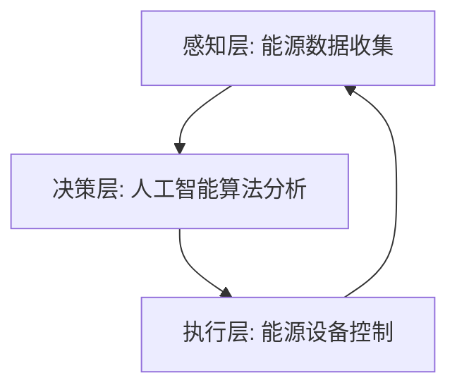

# AI Agent在企业能源管理与节能减排中的应用

> 关键词：AI Agent、企业能源管理、节能减排、智能决策、优化控制

> 摘要：本文深入探讨了AI Agent在企业能源管理与节能减排领域的应用。首先介绍了相关背景知识，包括目的范围、预期读者等。接着阐述了AI Agent的核心概念及其与企业能源管理的联系，详细讲解了核心算法原理和具体操作步骤，给出了数学模型和公式并举例说明。通过项目实战展示了代码的实际应用和详细解释。分析了AI Agent在企业能源管理中的实际应用场景，推荐了相关的工具和资源。最后总结了未来发展趋势与挑战，并提供了常见问题解答和扩展阅读参考资料，旨在为企业利用AI Agent实现高效能源管理和节能减排提供全面的技术指导。

## 1. 背景介绍 
### 1.1 目的和范围
随着全球对环境保护和可持续发展的关注度不断提高，企业面临着越来越大的节能减排压力。同时，能源成本的上升也促使企业寻求更高效的能源管理方法。AI Agent作为一种智能计算实体，能够感知环境、做出决策并采取行动，为企业能源管理与节能减排提供了新的解决方案。本文的目的是深入研究AI Agent在企业能源管理与节能减排中的应用，探讨其核心原理、算法和实际应用场景，为企业实施相关项目提供技术支持和指导。

本文的范围涵盖了AI Agent的基本概念、与企业能源管理的结合方式、核心算法原理、数学模型、项目实战案例、实际应用场景以及相关的工具和资源推荐等方面。

### 1.2 预期读者
本文的预期读者包括企业能源管理人员、节能减排项目负责人、人工智能领域的技术人员、科研人员以及对企业能源管理和节能减排感兴趣的相关人士。

### 1.3 文档结构概述
本文将按照以下结构进行阐述：
1. 背景介绍：介绍本文的目的、范围、预期读者和文档结构概述，以及相关术语的定义和解释。
2. 核心概念与联系：阐述AI Agent的核心概念、原理和架构，以及其与企业能源管理的联系，并给出相应的文本示意图和Mermaid流程图。
3. 核心算法原理 & 具体操作步骤：详细讲解AI Agent在企业能源管理中使用的核心算法原理，并使用Python源代码进行具体操作步骤的阐述。
4. 数学模型和公式 & 详细讲解 & 举例说明：给出AI Agent在企业能源管理中的数学模型和公式，并进行详细讲解和举例说明。
5. 项目实战：代码实际案例和详细解释说明：通过一个实际的项目案例，展示AI Agent在企业能源管理中的应用，包括开发环境搭建、源代码详细实现和代码解读。
6. 实际应用场景：分析AI Agent在企业能源管理中的实际应用场景，如能源预测、设备优化控制、能源调度等。
7. 工具和资源推荐：推荐相关的学习资源、开发工具框架和论文著作。
8. 总结：未来发展趋势与挑战：总结AI Agent在企业能源管理与节能减排中的应用现状，分析未来发展趋势和面临的挑战。
9. 附录：常见问题与解答：解答读者在阅读本文过程中可能遇到的常见问题。
10. 扩展阅读 & 参考资料：提供相关的扩展阅读资料和参考书目。

### 1.4 术语表
#### 1.4.1 核心术语定义
- **AI Agent**：人工智能代理，是一种能够感知环境、根据感知信息做出决策并采取行动的智能计算实体。
- **企业能源管理**：企业对能源的采购、使用、消耗等进行全面规划、组织、控制和监督的一系列活动，旨在提高能源利用效率，降低能源成本。
- **节能减排**：减少能源消耗和降低污染物排放，是实现可持续发展的重要举措。
- **智能决策**：利用人工智能技术，根据大量的数据和信息，自动做出最优决策的过程。
- **优化控制**：通过对系统的参数进行调整和优化，使系统达到最优性能的控制方法。

#### 1.4.2 相关概念解释
- **多Agent系统**：由多个AI Agent组成的系统，这些Agent之间可以相互协作、通信和竞争，以实现共同的目标。
- **强化学习**：一种机器学习方法，Agent通过与环境进行交互，根据环境反馈的奖励信号来学习最优的行为策略。
- **预测模型**：用于预测未来事件或趋势的数学模型，如能源消耗预测模型、设备故障预测模型等。

#### 1.4.3 缩略词列表
- **AI**：Artificial Intelligence，人工智能
- **ML**：Machine Learning，机器学习
- **RL**：Reinforcement Learning，强化学习
- **MDP**：Markov Decision Process，马尔可夫决策过程

## 2. 核心概念与联系 

### 2.1 AI Agent的核心概念
AI Agent是一个具有自主性、反应性、社会性和主动性的智能实体。自主性意味着Agent能够独立地感知环境、做出决策并采取行动；反应性表示Agent能够对环境的变化做出及时的反应；社会性指Agent可以与其他Agent或人类进行交互和协作；主动性则体现为Agent能够主动地寻找机会和解决问题。

### 2.2 AI Agent与企业能源管理的联系
在企业能源管理中，AI Agent可以扮演多种角色。例如，它可以作为能源监测Agent，实时感知企业的能源消耗情况；作为决策Agent，根据能源监测数据和企业的能源管理目标，制定最优的能源管理策略；作为控制Agent，执行决策Agent制定的策略，对企业的能源设备进行优化控制。通过多个Agent之间的协作和交互，可以实现企业能源管理的智能化和自动化。

### 2.3 核心概念原理和架构的文本示意图
AI Agent在企业能源管理中的架构可以分为三个层次：感知层、决策层和执行层。感知层负责收集企业能源消耗的相关数据，如电量、水量、气量等；决策层根据感知层收集的数据，运用人工智能算法进行分析和决策，制定最优的能源管理策略；执行层根据决策层制定的策略，对企业的能源设备进行控制和调节。

```plaintext
+---------------------+
|       感知层        |
| （能源数据收集）    |
+---------------------+
        |
        v
+---------------------+
|       决策层        |
| （人工智能算法分析）|
+---------------------+
        |
        v
+---------------------+
|       执行层        |
| （能源设备控制）    |
+---------------------+
```

### 2.4 Mermaid流程图


这个流程图展示了AI Agent在企业能源管理中的工作流程。感知层收集能源数据并传递给决策层，决策层进行分析和决策后，将策略传递给执行层，执行层对能源设备进行控制。执行层的控制结果又会反馈给感知层，形成一个闭环的反馈系统，不断优化企业的能源管理。

## 3. 核心算法原理 & 具体操作步骤 

### 3.1 核心算法原理 - 强化学习
在企业能源管理中，强化学习是一种常用的算法。强化学习的基本思想是Agent通过与环境进行交互，根据环境反馈的奖励信号来学习最优的行为策略。在企业能源管理的场景中，Agent可以看作是能源管理系统，环境是企业的能源消耗情况，奖励信号可以是能源成本的降低、节能减排的效果等。

强化学习通常使用马尔可夫决策过程（MDP）来建模。MDP是一个五元组 $(S, A, P, R, \gamma)$，其中：
- $S$ 是状态空间，表示环境的所有可能状态。在企业能源管理中，状态可以包括能源消耗的历史数据、设备的运行状态等。
- $A$ 是动作空间，表示Agent可以采取的所有可能动作。例如，调整设备的运行参数、切换能源供应方式等。
- $P$ 是状态转移概率，表示在状态 $s$ 下采取动作 $a$ 后转移到状态 $s'$ 的概率，即 $P(s'|s, a)$。
- $R$ 是奖励函数，表示在状态 $s$ 下采取动作 $a$ 后获得的即时奖励，即 $R(s, a)$。
- $\gamma$ 是折扣因子，取值范围为 $[0, 1]$，用于权衡即时奖励和未来奖励的重要性。

Agent的目标是学习一个最优的策略 $\pi^*$，使得长期累积奖励最大化。策略 $\pi$ 是一个从状态到动作的映射，即 $\pi: S \to A$。

### 3.2 具体操作步骤及Python源代码实现
以下是一个使用强化学习（Q-learning算法）实现企业能源管理的简单示例代码：

```python
import numpy as np

# 定义状态空间和动作空间
num_states = 10  # 假设有10个状态
num_actions = 3  # 假设有3个动作

# 初始化Q表
Q = np.zeros((num_states, num_actions))

# 定义超参数
alpha = 0.1  # 学习率
gamma = 0.9  # 折扣因子
epsilon = 0.1  # 探索率
num_episodes = 1000  # 训练的回合数

# 定义奖励函数
def get_reward(state, action):
    # 这里简单假设奖励是一个随机值，实际应用中需要根据具体情况定义
    return np.random.randint(-10, 10)

# 定义状态转移函数
def transition(state, action):
    # 这里简单假设状态转移是随机的，实际应用中需要根据具体情况定义
    next_state = np.random.randint(0, num_states)
    return next_state

# Q-learning算法
for episode in range(num_episodes):
    state = np.random.randint(0, num_states)  # 随机初始化状态
    done = False

    while not done:
        # 选择动作
        if np.random.uniform(0, 1) < epsilon:
            action = np.random.randint(0, num_actions)  # 探索
        else:
            action = np.argmax(Q[state, :])  # 利用

        # 获取奖励和下一个状态
        reward = get_reward(state, action)
        next_state = transition(state, action)

        # 更新Q表
        Q[state, action] = (1 - alpha) * Q[state, action] + alpha * (reward + gamma * np.max(Q[next_state, :]))

        state = next_state

        # 判断是否结束
        if np.random.uniform(0, 1) < 0.1:  # 简单假设以10%的概率结束回合
            done = True

# 输出最终的Q表
print("Final Q-table:")
print(Q)
```

### 3.3 代码解释
1. **状态空间和动作空间的定义**：`num_states` 和 `num_actions` 分别定义了状态空间和动作空间的大小。
2. **Q表的初始化**：`Q` 是一个二维数组，用于存储每个状态和动作对应的Q值。
3. **超参数的设置**：`alpha` 是学习率，控制Q值更新的速度；`gamma` 是折扣因子，用于权衡即时奖励和未来奖励；`epsilon` 是探索率，用于平衡探索和利用；`num_episodes` 是训练的回合数。
4. **奖励函数和状态转移函数的定义**：`get_reward` 函数用于计算在某个状态下采取某个动作所获得的奖励；`transition` 函数用于模拟状态的转移。
5. **Q-learning算法的实现**：在每个回合中，Agent根据当前状态选择动作，执行动作后获取奖励和下一个状态，然后更新Q表。重复这个过程，直到回合结束。
6. **最终Q表的输出**：训练结束后，输出最终的Q表，Agent可以根据Q表选择最优的动作。

## 4. 数学模型和公式 & 详细讲解 & 举例说明 

### 4.1 马尔可夫决策过程（MDP）的数学模型
如前所述，MDP是一个五元组 $(S, A, P, R, \gamma)$。其核心目标是找到一个最优策略 $\pi^*$，使得长期累积奖励最大化。长期累积奖励可以用折扣累积奖励来表示，定义如下：

$$G_t = \sum_{k=0}^{\infty} \gamma^k R_{t+k+1}$$

其中，$G_t$ 表示从时间步 $t$ 开始的折扣累积奖励，$R_{t+k+1}$ 表示在时间步 $t + k + 1$ 获得的即时奖励，$\gamma$ 是折扣因子。

### 4.2 Q-learning算法的更新公式
Q-learning算法通过不断更新Q表来学习最优策略。Q表中的每个元素 $Q(s, a)$ 表示在状态 $s$ 下采取动作 $a$ 的价值。Q-learning的更新公式如下：

$$Q(s, a) \leftarrow (1 - \alpha) Q(s, a) + \alpha \left[R(s, a) + \gamma \max_{a'} Q(s', a')\right]$$

其中，$\alpha$ 是学习率，$R(s, a)$ 是在状态 $s$ 下采取动作 $a$ 获得的即时奖励，$s'$ 是采取动作 $a$ 后转移到的下一个状态，$\max_{a'} Q(s', a')$ 表示在下一个状态 $s'$ 下采取最优动作的Q值。

### 4.3 详细讲解
- **折扣累积奖励**：折扣因子 $\gamma$ 的作用是权衡即时奖励和未来奖励的重要性。当 $\gamma$ 接近 1 时，Agent更注重未来的奖励；当 $\gamma$ 接近 0 时，Agent更注重即时奖励。
- **Q-learning更新公式**：Q-learning算法通过不断地与环境交互，根据环境反馈的奖励来更新Q表。学习率 $\alpha$ 控制了Q值更新的速度，当 $\alpha$ 较大时，Q值更新较快，但可能会导致不稳定；当 $\alpha$ 较小时，Q值更新较慢，但更稳定。

### 4.4 举例说明
假设企业能源管理系统有两个状态：高能耗状态（$s_1$）和低能耗状态（$s_2$），有两个动作：增加能源消耗（$a_1$）和减少能源消耗（$a_2$）。初始时，Q表如下：

| 状态 | $a_1$ | $a_2$ |
|------|-------|-------|
| $s_1$ | 0     | 0     |
| $s_2$ | 0     | 0     |

假设当前状态为 $s_1$，Agent选择动作 $a_2$，获得奖励 $R(s_1, a_2) = 10$，转移到状态 $s_2$。假设学习率 $\alpha = 0.1$，折扣因子 $\gamma = 0.9$，则更新后的Q值为：

$$Q(s_1, a_2) = (1 - 0.1) \times 0 + 0.1 \times (10 + 0.9 \times \max\{Q(s_2, a_1), Q(s_2, a_2)\}) = 1$$

更新后的Q表如下：

| 状态 | $a_1$ | $a_2$ |
|------|-------|-------|
| $s_1$ | 0     | 1     |
| $s_2$ | 0     | 0     |

通过不断地与环境交互和更新Q表，Agent可以学习到最优的策略。

## 5. 项目实战：代码实际案例和详细解释说明 

### 5.1 开发环境搭建
#### 5.1.1 操作系统
可以选择Windows、Linux或macOS等常见的操作系统。这里以Ubuntu 20.04为例进行说明。

#### 5.1.2 Python环境
安装Python 3.7及以上版本。可以使用以下命令安装Python：

```bash
sudo apt update
sudo apt install python3 python3-pip
```

#### 5.1.3 依赖库安装
安装项目所需的依赖库，包括NumPy、Pandas等。可以使用以下命令安装：

```bash
pip3 install numpy pandas
```

### 5.2 源代码详细实现和代码解读
以下是一个更完整的企业能源管理项目的Python代码示例，使用强化学习（Q-learning算法）来优化企业的能源消耗：

```python
import numpy as np
import pandas as pd

# 定义状态空间和动作空间
num_states = 5  # 假设有5个状态
num_actions = 2  # 假设有2个动作

# 初始化Q表
Q = np.zeros((num_states, num_actions))

# 定义超参数
alpha = 0.1  # 学习率
gamma = 0.9  # 折扣因子
epsilon = 0.1  # 探索率
num_episodes = 1000  # 训练的回合数

# 加载能源数据
data = pd.read_csv('energy_data.csv')
energy_consumption = data['energy_consumption'].values

# 定义奖励函数
def get_reward(state, action, energy_consumption):
    if action == 0:  # 减少能源消耗
        if energy_consumption[state] > 0:
            reward = 10
        else:
            reward = -5
    else:  # 增加能源消耗
        if energy_consumption[state] < 100:
            reward = 5
        else:
            reward = -10
    return reward

# 定义状态转移函数
def transition(state, action):
    if action == 0:  # 减少能源消耗
        next_state = max(state - 1, 0)
    else:  # 增加能源消耗
        next_state = min(state + 1, num_states - 1)
    return next_state

# Q-learning算法
for episode in range(num_episodes):
    state = np.random.randint(0, num_states)  # 随机初始化状态
    done = False

    while not done:
        # 选择动作
        if np.random.uniform(0, 1) < epsilon:
            action = np.random.randint(0, num_actions)  # 探索
        else:
            action = np.argmax(Q[state, :])  # 利用

        # 获取奖励和下一个状态
        reward = get_reward(state, action, energy_consumption)
        next_state = transition(state, action)

        # 更新Q表
        Q[state, action] = (1 - alpha) * Q[state, action] + alpha * (reward + gamma * np.max(Q[next_state, :]))

        state = next_state

        # 判断是否结束
        if np.random.uniform(0, 1) < 0.1:  # 简单假设以10%的概率结束回合
            done = True

# 输出最终的Q表
print("Final Q-table:")
print(Q)

# 根据Q表选择最优动作
optimal_actions = []
for state in range(num_states):
    optimal_action = np.argmax(Q[state, :])
    optimal_actions.append(optimal_action)

print("Optimal actions for each state:")
print(optimal_actions)
```

### 5.3 代码解读与分析
#### 5.3.1 数据加载
使用Pandas库加载能源数据文件 `energy_data.csv`，并提取能源消耗列 `energy_consumption`。

#### 5.3.2 奖励函数
奖励函数 `get_reward` 根据当前状态、动作和能源消耗情况来计算奖励。如果动作是减少能源消耗且当前能源消耗大于 0，则奖励为 10；否则奖励为 -5。如果动作是增加能源消耗且当前能源消耗小于 100，则奖励为 5；否则奖励为 -10。

#### 5.3.3 状态转移函数
状态转移函数 `transition` 根据当前状态和动作来确定下一个状态。如果动作是减少能源消耗，则状态减 1（但不小于 0）；如果动作是增加能源消耗，则状态加 1（但不大于状态空间的最大值）。

#### 5.3.4 Q-learning算法
在每个回合中，Agent根据当前状态选择动作，执行动作后获取奖励和下一个状态，然后更新Q表。重复这个过程，直到回合结束。

#### 5.3.5 最优动作选择
训练结束后，根据最终的Q表为每个状态选择最优动作，并输出结果。

通过这个项目实战，我们可以看到如何使用强化学习（Q-learning算法）来优化企业的能源消耗，实现节能减排的目标。

## 6. 实际应用场景 
### 6.1 能源预测
AI Agent可以利用历史能源消耗数据和相关的环境因素（如天气、时间等），建立能源预测模型。通过实时感知环境信息，Agent可以预测企业未来的能源需求，帮助企业提前做好能源采购和调度计划，避免能源浪费和供应不足的情况发生。

### 6.2 设备优化控制
企业中的各种能源设备（如空调、照明、电机等）是能源消耗的主要来源。AI Agent可以实时监测设备的运行状态和能源消耗情况，根据企业的能源管理目标和设备的性能特点，对设备进行优化控制。例如，在保证生产需求的前提下，调整空调的温度设置、优化照明的亮度等，以降低能源消耗。

### 6.3 能源调度
在企业拥有多种能源供应方式（如电网供电、太阳能发电、天然气发电等）的情况下，AI Agent可以根据能源价格、能源供应情况和企业的能源需求，制定最优的能源调度策略。例如，在太阳能充足时优先使用太阳能发电，在电网电价低谷时增加电网购电量等，以降低企业的能源成本。

### 6.4 设备故障预测与维护
AI Agent可以通过对设备运行数据的分析和挖掘，建立设备故障预测模型。提前预测设备可能出现的故障，及时安排维护人员进行检修，避免设备故障导致的能源浪费和生产损失。同时，合理的设备维护计划也可以延长设备的使用寿命，提高设备的能源利用效率。

## 7. 工具和资源推荐
### 7.1 学习资源推荐
#### 7.1.1 书籍推荐
- 《人工智能：一种现代的方法》（Artificial Intelligence: A Modern Approach）：这是一本经典的人工智能教材，涵盖了人工智能的各个方面，包括搜索算法、知识表示、机器学习、自然语言处理等。
- 《强化学习：原理与Python实现》（Reinforcement Learning: An Introduction）：这本书是强化学习领域的权威著作，详细介绍了强化学习的基本概念、算法和应用。
- 《Python机器学习》（Python Machine Learning）：本书介绍了如何使用Python进行机器学习，包括各种机器学习算法的实现和应用，适合初学者入门。

#### 7.1.2 在线课程
- Coursera上的“人工智能基础”（Fundamentals of Artificial Intelligence）课程：由知名高校的教授授课，系统地介绍了人工智能的基本概念和算法。
- edX上的“强化学习”（Reinforcement Learning）课程：深入讲解了强化学习的原理和应用，提供了丰富的案例和实践项目。
- 吴恩达的“机器学习”（Machine Learning）课程：这是一门非常经典的机器学习课程，通过视频讲解和编程作业，帮助学员掌握机器学习的基本算法和应用。

#### 7.1.3 技术博客和网站
- Towards Data Science：这是一个专注于数据科学和机器学习的博客平台，上面有很多关于人工智能和强化学习的高质量文章。
- Medium：一个综合性的博客平台，有很多技术专家分享人工智能和能源管理方面的经验和见解。
- OpenAI Blog：OpenAI官方博客，发布关于人工智能最新研究成果和应用案例的文章。

### 7.2 开发工具框架推荐
#### 7.2.1 IDE和编辑器
- PyCharm：一款专业的Python集成开发环境，提供了丰富的代码编辑、调试和项目管理功能。
- Jupyter Notebook：一种交互式的开发环境，适合进行数据探索、模型训练和结果展示。
- Visual Studio Code：一款轻量级的代码编辑器，支持多种编程语言和插件扩展，具有良好的开发体验。

#### 7.2.2 调试和性能分析工具
- PDB：Python自带的调试器，可以帮助开发者定位和解决代码中的问题。
- cProfile：Python标准库中的性能分析工具，可以分析代码的运行时间和函数调用情况。
- TensorBoard：一个用于可视化深度学习模型训练过程和结果的工具，也可以用于强化学习的性能分析。

#### 7.2.3 相关框架和库
- NumPy：Python中用于科学计算的基础库，提供了高效的数组操作和数学函数。
- Pandas：用于数据处理和分析的库，提供了灵活的数据结构和数据操作方法。
- TensorFlow：一个开源的深度学习框架，支持多种深度学习算法和模型的开发和训练。
- PyTorch：另一个流行的深度学习框架，具有动态图机制，适合快速开发和实验。
- Stable Baselines：一个用于强化学习的开源库，提供了多种强化学习算法的实现和训练工具。

### 7.3 相关论文著作推荐
#### 7.3.1 经典论文
- Richard S. Sutton和Andrew G. Barto的“Reinforcement Learning: An Introduction”：这篇论文是强化学习领域的奠基之作，详细介绍了强化学习的基本概念和算法。
- Vapnik和Chervonenkis的“Statistical Learning Theory”：这篇论文提出了统计学习理论，为机器学习的发展奠定了理论基础。
- Geoffrey E. Hinton等人的“Deep Learning”：这篇论文是深度学习领域的经典综述，介绍了深度学习的基本概念、模型和应用。

#### 7.3.2 最新研究成果
- 关注顶级学术会议（如NeurIPS、ICML、AAAI等）和期刊（如Journal of Artificial Intelligence Research、Artificial Intelligence等）上发表的关于人工智能和能源管理的最新研究论文。
- 可以使用学术搜索引擎（如Google Scholar、Semantic Scholar等）搜索相关的研究成果。

#### 7.3.3 应用案例分析
- 研究一些企业在能源管理和节能减排中应用AI Agent的实际案例，了解他们的实施方法、遇到的问题和解决方案。可以通过企业的官方网站、行业报告和学术论文等渠道获取相关信息。

## 8. 总结：未来发展趋势与挑战
### 8.1 未来发展趋势
#### 8.1.1 多Agent系统的应用
未来，多个AI Agent之间的协作和交互将变得更加复杂和智能。多Agent系统可以更好地处理企业能源管理中的复杂问题，如分布式能源系统的优化调度、多个企业之间的能源协同管理等。

#### 8.1.2 与物联网和大数据的深度融合
随着物联网技术的发展，企业可以获取更多的能源数据。AI Agent可以与物联网设备相结合，实时感知能源消耗情况，并利用大数据分析技术对数据进行深度挖掘和分析，从而提供更准确的能源管理决策。

#### 8.1.3 强化学习算法的改进和创新
强化学习是AI Agent在企业能源管理中常用的算法，未来将不断有新的强化学习算法被提出和应用。例如，基于深度强化学习的算法可以处理更复杂的状态空间和动作空间，提高能源管理的效率和效果。

#### 8.1.4 智能化的能源管理平台
未来将出现更多智能化的能源管理平台，集成AI Agent、物联网、大数据等技术，为企业提供一站式的能源管理解决方案。这些平台可以实现能源数据的实时监测、分析、决策和控制，帮助企业实现更加高效的能源管理和节能减排。

### 8.2 挑战
#### 8.2.1 数据质量和安全问题
企业能源管理中需要大量的能源数据，数据的质量和安全直接影响AI Agent的决策效果。数据可能存在噪声、缺失值等问题，需要进行数据清洗和预处理。同时，能源数据涉及企业的商业机密和隐私，需要采取有效的安全措施来保护数据的安全。

#### 8.2.2 算法复杂度和计算资源需求
一些复杂的人工智能算法（如深度强化学习算法）具有较高的复杂度，需要大量的计算资源来进行训练和推理。企业可能需要投入更多的硬件设备和计算资源来支持这些算法的运行，增加了实施成本。

#### 8.2.3 与现有系统的集成问题
企业现有的能源管理系统和设备可能已经存在，将AI Agent集成到现有系统中可能会面临兼容性和接口问题。需要开发合适的接口和协议，确保AI Agent能够与现有系统进行有效的通信和协作。

#### 8.2.4 人才短缺问题
AI Agent在企业能源管理中的应用需要既懂人工智能技术又懂能源管理的复合型人才。目前，这类人才相对短缺，企业可能需要花费更多的时间和精力来培养和招聘相关人才。

## 9. 附录：常见问题与解答
### 9.1 什么是AI Agent？
AI Agent是一种能够感知环境、根据感知信息做出决策并采取行动的智能计算实体。它具有自主性、反应性、社会性和主动性等特点，可以在不同的领域中发挥作用。

### 9.2 AI Agent在企业能源管理中有哪些优势？
AI Agent可以实时感知企业的能源消耗情况，根据数据分析和决策，制定最优的能源管理策略。它可以实现能源管理的智能化和自动化，提高能源利用效率，降低能源成本，减少污染物排放。

### 9.3 强化学习在企业能源管理中是如何应用的？
强化学习通过让Agent与环境进行交互，根据环境反馈的奖励信号来学习最优的行为策略。在企业能源管理中，Agent可以看作是能源管理系统，环境是企业的能源消耗情况，奖励信号可以是能源成本的降低、节能减排的效果等。Agent通过不断地学习和优化策略，实现企业能源管理的目标。

### 9.4 如何评估AI Agent在企业能源管理中的效果？
可以从多个方面评估AI Agent在企业能源管理中的效果，如能源消耗的降低程度、能源成本的节约情况、设备运行效率的提高等。同时，还可以通过对比使用AI Agent前后的能源管理指标，以及与同行业企业的能源管理水平进行比较，来评估其效果。

### 9.5 实施AI Agent在企业能源管理中的项目需要注意哪些问题？
实施AI Agent在企业能源管理中的项目需要注意以下问题：
- 数据质量和安全：确保能源数据的准确性、完整性和安全性。
- 算法选择和优化：根据企业的实际情况选择合适的算法，并进行优化和调整。
- 与现有系统的集成：确保AI Agent能够与企业现有的能源管理系统和设备进行有效的集成。
- 人才培养和团队建设：培养和招聘既懂人工智能技术又懂能源管理的复合型人才。
- 项目管理和风险控制：制定合理的项目计划，控制项目风险，确保项目的顺利实施。

## 10. 扩展阅读 & 参考资料
### 10.1 扩展阅读
- 《智能电网：技术、应用与市场》：介绍了智能电网的相关技术和应用，包括能源管理、分布式能源系统等方面的内容。
- 《工业4.0：即将来袭的第四次工业革命》：探讨了工业4.0时代的技术变革和发展趋势，对企业能源管理和节能减排有一定的启示。
- 《能源互联网：理念、技术与应用》：介绍了能源互联网的概念、技术和应用，为企业能源管理提供了新的思路和方法。

### 10.2 参考资料
- [Richard S. Sutton, Andrew G. Barto. Reinforcement Learning: An Introduction. MIT Press, 2018.](https://mitpress.mit.edu/books/reinforcement-learning-second-edition)
- [Geoffrey E. Hinton, Yoshua Bengio, Yann LeCun. Deep Learning. Nature, 2015.](https://www.nature.com/articles/nature14539)
- [Vladimir N. Vapnik. The Nature of Statistical Learning Theory. Springer, 2000.](https://link.springer.com/book/10.1007/978-1-4757-3264-1)

作者：AI天才研究院/AI Genius Institute & 禅与计算机程序设计艺术 /Zen And The Art of Computer Programming