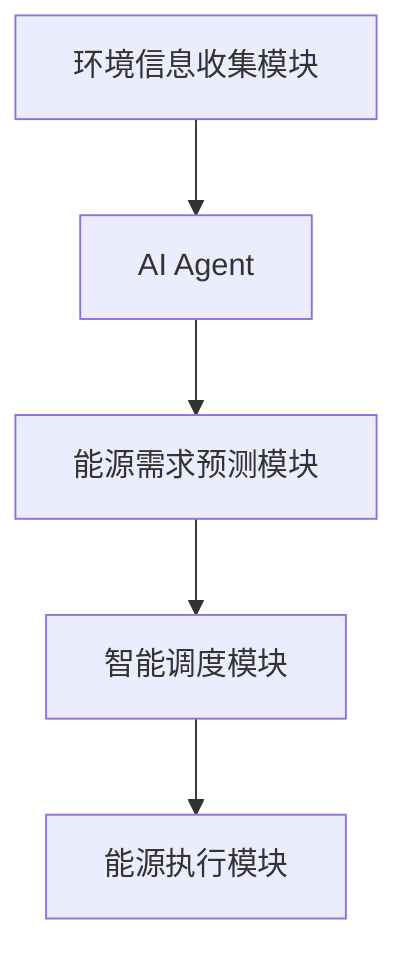

# AI Agent在企业能源需求预测与智能调度中的应用

> 关键词：AI Agent、企业能源需求预测、智能调度、能源管理、机器学习

> 摘要：本文深入探讨了AI Agent在企业能源需求预测与智能调度中的应用。首先介绍了相关背景知识，包括目的范围、预期读者等。接着阐述了核心概念及联系，通过文本示意图和Mermaid流程图进行说明。详细讲解了核心算法原理，并用Python代码进行阐述，同时给出了数学模型和公式。通过项目实战，展示了开发环境搭建、源代码实现与解读。分析了实际应用场景，推荐了学习资源、开发工具框架以及相关论文著作。最后总结了未来发展趋势与挑战，并给出常见问题解答和扩展阅读参考资料，旨在为企业能源管理提供全面的技术指导和思路。

## 1. 背景介绍 
### 1.1 目的和范围
企业能源管理是企业运营中的重要环节，合理的能源需求预测与智能调度能够有效降低企业能源成本，提高能源利用效率，减少对环境的影响。本文的目的在于深入研究AI Agent在企业能源需求预测与智能调度中的应用，探讨如何利用AI Agent的智能特性，实现更精准的能源需求预测和更高效的能源调度。

本文的范围涵盖了AI Agent的基本概念、相关算法原理、数学模型，以及在企业能源管理中的具体应用案例。同时，还会介绍相关的开发工具、学习资源和研究成果，为企业和研究人员提供全面的参考。

### 1.2 预期读者
本文预期读者包括企业能源管理人员、能源领域的技术研发人员、计算机科学和人工智能领域的研究人员和学生，以及对企业能源管理和AI Agent应用感兴趣的相关人士。

### 1.3 文档结构概述
本文将按照以下结构进行组织：首先介绍背景知识，包括目的范围、预期读者和文档结构概述。接着阐述核心概念及联系，通过文本示意图和Mermaid流程图进行说明。详细讲解核心算法原理，并用Python代码进行阐述，同时给出数学模型和公式。通过项目实战，展示开发环境搭建、源代码实现与解读。分析实际应用场景，推荐学习资源、开发工具框架以及相关论文著作。最后总结未来发展趋势与挑战，并给出常见问题解答和扩展阅读参考资料。

### 1.4 术语表
#### 1.4.1 核心术语定义
- **AI Agent（人工智能智能体）**：是一种能够感知环境，根据自身的目标和知识进行决策，并采取行动以实现目标的智能实体。
- **企业能源需求预测**：根据企业历史能源消耗数据、生产计划、天气等因素，对企业未来一段时间内的能源需求进行预测。
- **智能调度**：根据能源需求预测结果，结合能源供应情况、能源价格等因素，对企业的能源使用进行优化调度，以实现能源的高效利用和成本的降低。

#### 1.4.2 相关概念解释
- **机器学习**：是一门多领域交叉学科，涉及概率论、统计学、逼近论、凸分析、算法复杂度理论等多门学科。它专门研究计算机怎样模拟或实现人类的学习行为，以获取新的知识或技能，重新组织已有的知识结构使之不断改善自身的性能。
- **深度学习**：是机器学习的一个分支领域，它是一种基于对数据进行表征学习的方法。深度学习通过构建具有很多层的神经网络模型，自动从大量数据中学习特征和模式。

#### 1.4.3 缩略词列表
- **ANN**：Artificial Neural Network，人工神经网络
- **LSTM**：Long Short-Term Memory，长短期记忆网络
- **RL**：Reinforcement Learning，强化学习

## 2. 核心概念与联系 

### 核心概念原理
AI Agent在企业能源需求预测与智能调度中的应用主要基于其智能感知、决策和行动的能力。AI Agent可以感知企业的能源消耗数据、生产计划、天气等环境信息，通过机器学习和深度学习算法对这些信息进行分析和处理，预测企业未来的能源需求。然后，根据能源需求预测结果和能源供应情况、能源价格等因素，利用强化学习等算法进行决策，制定最优的能源调度策略，并采取相应的行动来执行调度策略。

### 架构的文本示意图
```plaintext
+----------------------+
|  环境信息收集模块    |
|  (能源消耗数据、     |
|  生产计划、天气等)  |
+----------------------+
          |
          v
+----------------------+
|  AI Agent            |
|  (感知、决策、行动)  |
|  - 机器学习算法      |
|  - 深度学习算法      |
|  - 强化学习算法      |
+----------------------+
          |
          v
+----------------------+
|  能源需求预测模块    |
|  (预测未来能源需求)  |
+----------------------+
          |
          v
+----------------------+
|  智能调度模块        |
|  (制定最优调度策略)  |
+----------------------+
          |
          v
+----------------------+
|  能源执行模块        |
|  (执行调度策略)      |
+----------------------+
```

### Mermaid流程图


## 3. 核心算法原理 & 具体操作步骤 

### 能源需求预测算法 - LSTM
LSTM（长短期记忆网络）是一种特殊的循环神经网络（RNN），能够有效处理序列数据中的长期依赖关系。在企业能源需求预测中，能源消耗数据通常具有时间序列特性，因此LSTM非常适合用于能源需求预测。

#### 算法原理
LSTM通过门控机制来控制信息的流动，包括输入门、遗忘门和输出门。遗忘门决定上一时刻的细胞状态有多少信息需要被遗忘；输入门决定当前输入有多少信息需要被加入到细胞状态中；输出门决定当前细胞状态有多少信息需要被输出。

#### Python源代码实现
```python
import numpy as np
import pandas as pd
from keras.models import Sequential
from keras.layers import LSTM, Dense

# 加载数据
data = pd.read_csv('energy_data.csv')
energy_consumption = data['energy_consumption'].values

# 数据预处理
def create_dataset(dataset, look_back=1):
    dataX, dataY = [], []
    for i in range(len(dataset)-look_back-1):
        a = dataset[i:(i+look_back), 0]
        dataX.append(a)
        dataY.append(dataset[i + look_back, 0])
    return np.array(dataX), np.array(dataY)

look_back = 3
X, y = create_dataset(energy_consumption.reshape(-1, 1), look_back)

# 划分训练集和测试集
train_size = int(len(X) * 0.8)
X_train, X_test = X[:train_size], X[train_size:]
y_train, y_test = y[:train_size], y[train_size:]

# 调整输入数据的形状以适应LSTM模型
X_train = np.reshape(X_train, (X_train.shape[0], X_train.shape[1], 1))
X_test = np.reshape(X_test, (X_test.shape[0], X_test.shape[1], 1))

# 构建LSTM模型
model = Sequential()
model.add(LSTM(50, input_shape=(look_back, 1)))
model.add(Dense(1))
model.compile(loss='mean_squared_error', optimizer='adam')

# 训练模型
model.fit(X_train, y_train, epochs=100, batch_size=1, verbose=2)

# 预测
train_predict = model.predict(X_train)
test_predict = model.predict(X_test)
```

### 智能调度算法 - 强化学习（Q-learning）
强化学习是一种通过智能体与环境进行交互，不断尝试不同的行动并根据环境反馈的奖励来学习最优策略的机器学习方法。Q-learning是一种无模型的强化学习算法，通过维护一个Q表来记录每个状态-行动对的价值。

#### 算法原理
Q-learning的核心是更新Q表，更新公式如下：
$$Q(s_t, a_t) = Q(s_t, a_t) + \alpha [r_{t+1} + \gamma \max_{a} Q(s_{t+1}, a) - Q(s_t, a_t)]$$
其中，$Q(s_t, a_t)$ 是当前状态 $s_t$ 下采取行动 $a_t$ 的Q值，$\alpha$ 是学习率，$r_{t+1}$ 是采取行动 $a_t$ 后获得的奖励，$\gamma$ 是折扣因子，$\max_{a} Q(s_{t+1}, a)$ 是下一状态 $s_{t+1}$ 下所有可能行动的最大Q值。

#### Python源代码实现
```python
import numpy as np

# 定义环境
class EnergyEnvironment:
    def __init__(self):
        self.states = np.arange(10)  # 状态空间
        self.actions = np.arange(3)  # 行动空间
        self.rewards = np.random.randn(10, 3)  # 奖励矩阵

    def step(self, state, action):
        next_state = np.random.choice(self.states)
        reward = self.rewards[state, action]
        return next_state, reward

# 定义Q-learning算法
class QLearningAgent:
    def __init__(self, env, learning_rate=0.1, discount_factor=0.9):
        self.env = env
        self.learning_rate = learning_rate
        self.discount_factor = discount_factor
        self.q_table = np.zeros((len(env.states), len(env.actions)))

    def choose_action(self, state):
        if np.random.uniform(0, 1) < 0.1:
            action = np.random.choice(self.env.actions)
        else:
            action = np.argmax(self.q_table[state, :])
        return action

    def update_q_table(self, state, action, reward, next_state):
        max_q_next = np.max(self.q_table[next_state, :])
        self.q_table[state, action] = (1 - self.learning_rate) * self.q_table[state, action] + \
                                      self.learning_rate * (reward + self.discount_factor * max_q_next)

# 训练过程
env = EnergyEnvironment()
agent = QLearningAgent(env)

num_episodes = 1000
for episode in range(num_episodes):
    state = np.random.choice(env.states)
    done = False
    while not done:
        action = agent.choose_action(state)
        next_state, reward = env.step(state, action)
        agent.update_q_table(state, action, reward, next_state)
        state = next_state
```

## 4. 数学模型和公式 & 详细讲解 & 举例说明 

### 能源需求预测的数学模型
#### ARIMA模型
ARIMA（Autoregressive Integrated Moving Average）模型是一种常用的时间序列预测模型，其数学表达式为：
$$(1 - \sum_{i=1}^{p} \phi_i B^i)(1 - B)^d Y_t = (1 + \sum_{j=1}^{q} \theta_j B^j) \epsilon_t$$
其中，$Y_t$ 是时间序列数据，$B$ 是滞后算子，$p$ 是自回归阶数，$d$ 是差分阶数，$q$ 是移动平均阶数，$\phi_i$ 是自回归系数，$\theta_j$ 是移动平均系数，$\epsilon_t$ 是白噪声。

#### 举例说明
假设我们有一个能源消耗的时间序列数据 $Y_t$，通过对数据进行差分处理（$d = 1$），确定自回归阶数 $p = 2$ 和移动平均阶数 $q = 1$，则ARIMA(2, 1, 1)模型的具体表达式为：
$$(1 - \phi_1 B - \phi_2 B^2)(1 - B) Y_t = (1 + \theta_1 B) \epsilon_t$$

### 智能调度的数学模型
#### 目标函数
智能调度的目标通常是在满足企业能源需求的前提下，最小化能源成本。假设企业有 $n$ 种能源供应方式，每种能源的价格为 $c_i$，供应量为 $x_i$，能源需求为 $D$，则目标函数可以表示为：
$$\min \sum_{i=1}^{n} c_i x_i$$
#### 约束条件
- 能源供应满足需求：$\sum_{i=1}^{n} x_i \geq D$
- 每种能源的供应量限制：$0 \leq x_i \leq x_{i,max}$

#### 举例说明
假设企业有两种能源供应方式，电力和天然气，电力价格 $c_1 = 0.5$ 元/度，天然气价格 $c_2 = 3$ 元/立方米，企业能源需求 $D = 1000$ 单位，电力最大供应量 $x_{1,max} = 800$ 度，天然气最大供应量 $x_{2,max} = 500$ 立方米。则目标函数为：
$$\min 0.5x_1 + 3x_2$$
约束条件为：
$$x_1 + x_2 \geq 1000$$
$$0 \leq x_1 \leq 800$$
$$0 \leq x_2 \leq 500$$

## 5. 项目实战：代码实际案例和详细解释说明 

### 5.1  开发环境搭建
#### 操作系统
建议使用Linux系统，如Ubuntu 18.04或更高版本，因为Linux系统在开发和部署机器学习项目方面具有很多优势。

#### 编程语言和库
- **Python**：作为主要的编程语言，版本建议使用Python 3.7或更高版本。
- **NumPy**：用于数值计算。
- **Pandas**：用于数据处理和分析。
- **Keras**：用于构建和训练深度学习模型。
- **TensorFlow**：Keras的后端，提供高效的计算支持。

#### 安装步骤
```bash
# 安装Python
sudo apt-get update
sudo apt-get install python3 python3-pip

# 安装所需库
pip3 install numpy pandas keras tensorflow
```

### 5.2  源代码详细实现和代码解读
#### 能源需求预测代码实现
```python
import numpy as np
import pandas as pd
from keras.models import Sequential
from keras.layers import LSTM, Dense

# 加载数据
data = pd.read_csv('energy_data.csv')
energy_consumption = data['energy_consumption'].values

# 数据预处理
def create_dataset(dataset, look_back=1):
    dataX, dataY = [], []
    for i in range(len(dataset)-look_back-1):
        a = dataset[i:(i+look_back), 0]
        dataX.append(a)
        dataY.append(dataset[i + look_back, 0])
    return np.array(dataX), np.array(dataY)

look_back = 3
X, y = create_dataset(energy_consumption.reshape(-1, 1), look_back)

# 划分训练集和测试集
train_size = int(len(X) * 0.8)
X_train, X_test = X[:train_size], X[train_size:]
y_train, y_test = y[:train_size], y[train_size:]

# 调整输入数据的形状以适应LSTM模型
X_train = np.reshape(X_train, (X_train.shape[0], X_train.shape[1], 1))
X_test = np.reshape(X_test, (X_test.shape[0], X_test.shape[1], 1))

# 构建LSTM模型
model = Sequential()
model.add(LSTM(50, input_shape=(look_back, 1)))
model.add(Dense(1))
model.compile(loss='mean_squared_error', optimizer='adam')

# 训练模型
model.fit(X_train, y_train, epochs=100, batch_size=1, verbose=2)

# 预测
train_predict = model.predict(X_train)
test_predict = model.predict(X_test)
```
#### 代码解读
1. **数据加载**：使用Pandas库读取能源消耗数据文件 `energy_data.csv`，并提取能源消耗列。
2. **数据预处理**：定义 `create_dataset` 函数，将时间序列数据转换为适合LSTM模型输入的格式。
3. **划分训练集和测试集**：将数据按照80%和20%的比例划分为训练集和测试集。
4. **调整数据形状**：将输入数据的形状调整为 `(样本数, 时间步长, 特征数)` 的形式，以适应LSTM模型的输入要求。
5. **构建LSTM模型**：使用Keras库构建一个简单的LSTM模型，包含一个LSTM层和一个全连接层。
6. **编译模型**：指定损失函数为均方误差（MSE），优化器为Adam。
7. **训练模型**：使用训练集对模型进行训练，设置训练轮数为100，批次大小为1。
8. **预测**：使用训练好的模型对训练集和测试集进行预测。

#### 智能调度代码实现
```python
import numpy as np

# 定义环境
class EnergyEnvironment:
    def __init__(self):
        self.states = np.arange(10)  # 状态空间
        self.actions = np.arange(3)  # 行动空间
        self.rewards = np.random.randn(10, 3)  # 奖励矩阵

    def step(self, state, action):
        next_state = np.random.choice(self.states)
        reward = self.rewards[state, action]
        return next_state, reward

# 定义Q-learning算法
class QLearningAgent:
    def __init__(self, env, learning_rate=0.1, discount_factor=0.9):
        self.env = env
        self.learning_rate = learning_rate
        self.discount_factor = discount_factor
        self.q_table = np.zeros((len(env.states), len(env.actions)))

    def choose_action(self, state):
        if np.random.uniform(0, 1) < 0.1:
            action = np.random.choice(self.env.actions)
        else:
            action = np.argmax(self.q_table[state, :])
        return action

    def update_q_table(self, state, action, reward, next_state):
        max_q_next = np.max(self.q_table[next_state, :])
        self.q_table[state, action] = (1 - self.learning_rate) * self.q_table[state, action] + \
                                      self.learning_rate * (reward + self.discount_factor * max_q_next)

# 训练过程
env = EnergyEnvironment()
agent = QLearningAgent(env)

num_episodes = 1000
for episode in range(num_episodes):
    state = np.random.choice(env.states)
    done = False
    while not done:
        action = agent.choose_action(state)
        next_state, reward = env.step(state, action)
        agent.update_q_table(state, action, reward, next_state)
        state = next_state
```
#### 代码解读
1. **定义环境**：定义 `EnergyEnvironment` 类，包含状态空间、行动空间和奖励矩阵。`step` 方法用于根据当前状态和行动返回下一状态和奖励。
2. **定义Q-learning算法**：定义 `QLearningAgent` 类，包含Q表、学习率和折扣因子。`choose_action` 方法用于根据当前状态选择行动，采用 $\epsilon$-贪心策略。`update_q_table` 方法用于更新Q表。
3. **训练过程**：创建环境和智能体对象，进行1000个回合的训练。在每个回合中，智能体不断与环境进行交互，选择行动，获取奖励，并更新Q表。

### 5.3  代码解读与分析
#### 能源需求预测代码分析
- **优点**：LSTM模型能够有效处理时间序列数据中的长期依赖关系，在能源需求预测中具有较好的性能。使用Keras库可以方便地构建和训练深度学习模型。
- **缺点**：LSTM模型的训练时间较长，需要大量的计算资源。模型的超参数（如LSTM单元数、训练轮数等）需要进行调优，否则可能会导致过拟合或欠拟合问题。

#### 智能调度代码分析
- **优点**：Q-learning算法是一种无模型的强化学习算法，不需要对环境进行建模，具有较强的通用性。通过不断与环境进行交互，智能体可以学习到最优的调度策略。
- **缺点**：Q-learning算法的收敛速度较慢，需要进行大量的训练回合。Q表的存储和更新需要占用一定的内存空间，当状态空间和行动空间较大时，可能会导致内存不足问题。

## 6. 实际应用场景 
### 制造业企业
在制造业企业中，能源消耗主要用于生产设备的运行。AI Agent可以根据企业的生产计划、设备运行状态等信息，预测未来的能源需求，并根据能源价格和供应情况，智能调度能源的使用。例如，在电价低谷时段，增加设备的运行负荷，提前生产部分产品；在电价高峰时段，减少设备的运行负荷，采用备用能源或调整生产计划。

### 商业建筑
商业建筑的能源消耗主要用于照明、空调、电梯等设备的运行。AI Agent可以根据建筑内的人员流动情况、天气情况等信息，预测未来的能源需求，并智能调度能源的使用。例如，在人员较少的时段，降低照明和空调的功率；在天气较凉爽的时段，减少空调的使用，采用自然通风。

### 数据中心
数据中心的能源消耗主要用于服务器的运行和冷却系统的散热。AI Agent可以根据服务器的负载情况、温度情况等信息，预测未来的能源需求，并智能调度能源的使用。例如，在服务器负载较低的时段，降低服务器的功率；在温度较低的时段，减少冷却系统的运行时间。

## 7. 工具和资源推荐
### 7.1 学习资源推荐
#### 7.1.1 书籍推荐
- 《深度学习》（Deep Learning）：由Ian Goodfellow、Yoshua Bengio和Aaron Courville所著，是深度学习领域的经典教材，涵盖了深度学习的基本概念、算法和应用。
- 《Python机器学习》（Python Machine Learning）：由Sebastian Raschka所著，介绍了使用Python进行机器学习的方法和技巧，包括数据预处理、模型选择、深度学习等内容。
- 《强化学习：原理与Python实现》：由智能系统实验室所著，详细介绍了强化学习的基本原理和算法，并通过Python代码进行了实现和讲解。

#### 7.1.2 在线课程
- Coursera上的“深度学习专项课程”（Deep Learning Specialization）：由吴恩达教授授课，包括神经网络和深度学习、改善深层神经网络、结构化机器学习项目、卷积神经网络、序列模型等五门课程，是学习深度学习的优质课程。
- edX上的“强化学习基础”（Fundamentals of Reinforcement Learning）：由UC Berkeley的Pieter Abbeel教授授课，介绍了强化学习的基本概念、算法和应用。
- 网易云课堂上的“Python数据分析与机器学习实战”：由唐宇迪老师授课，通过实际案例介绍了使用Python进行数据分析和机器学习的方法和技巧。

#### 7.1.3 技术博客和网站
- Medium：是一个内容平台，上面有很多关于人工智能、机器学习和深度学习的技术博客和文章。
- Towards Data Science：是一个专注于数据科学和机器学习的博客平台，上面有很多高质量的技术文章和教程。
- arXiv：是一个预印本平台，上面有很多最新的人工智能和机器学习研究论文。

### 7.2 开发工具框架推荐
#### 7.2.1 IDE和编辑器
- PyCharm：是一款专门为Python开发设计的集成开发环境（IDE），具有代码编辑、调试、版本控制等功能，适合专业的Python开发者使用。
- Jupyter Notebook：是一个基于Web的交互式计算环境，支持Python、R等多种编程语言，适合数据科学家和机器学习工程师进行数据探索和模型开发。
- Visual Studio Code：是一款轻量级的代码编辑器，支持多种编程语言和插件扩展，具有丰富的功能和良好的用户体验。

#### 7.2.2 调试和性能分析工具
- TensorBoard：是TensorFlow提供的一个可视化工具，可以用于可视化模型的训练过程、损失函数曲线、模型结构等信息，帮助开发者进行模型调试和优化。
- Py-Spy：是一个Python性能分析工具，可以用于分析Python程序的CPU使用情况和函数调用时间，帮助开发者找出性能瓶颈。
- cProfile：是Python标准库中的一个性能分析模块，可以用于分析Python程序的函数调用时间和调用次数，帮助开发者进行性能优化。

#### 7.2.3 相关框架和库
- TensorFlow：是一个开源的机器学习框架，由Google开发，提供了高效的计算支持和丰富的机器学习算法库，适合开发深度学习模型。
- PyTorch：是一个开源的深度学习框架，由Facebook开发，具有动态图机制和良好的易用性，适合研究人员和开发者进行深度学习研究和开发。
- Scikit-learn：是一个开源的机器学习库，提供了丰富的机器学习算法和工具，包括数据预处理、模型选择、分类、回归等功能，适合初学者和快速开发。

### 7.3 相关论文著作推荐
#### 7.3.1 经典论文
- “Long Short-Term Memory”：由Sepp Hochreiter和Jürgen Schmidhuber发表于1997年，介绍了LSTM的基本原理和结构，是LSTM领域的经典论文。
- “Q-learning”：由Christopher J. C. H. Watkins和Peter Dayan发表于1992年，介绍了Q-learning算法的基本原理和收敛性证明，是强化学习领域的经典论文。
- “Deep Residual Learning for Image Recognition”：由Kaiming He等人发表于2015年，介绍了残差网络（ResNet）的基本原理和结构，是深度学习领域的经典论文。

#### 7.3.2 最新研究成果
- 关注arXiv、NeurIPS、ICML等学术平台和会议，上面有很多最新的人工智能和机器学习研究成果。
- 关注相关领域的顶级期刊，如Journal of Artificial Intelligence Research（JAIR）、Artificial Intelligence等，上面有很多高质量的研究论文。

#### 7.3.3 应用案例分析
- 《人工智能在能源领域的应用案例集》：收集了人工智能在能源领域的各种应用案例，包括能源需求预测、智能调度、能源管理等方面的案例，具有较高的参考价值。
- 各大企业的技术博客和官方网站，如Google、Microsoft、IBM等，上面有很多关于人工智能在能源领域应用的案例和技术分享。

## 8. 总结：未来发展趋势与挑战
### 未来发展趋势
- **多智能体协同**：未来，AI Agent可能会与其他智能体（如物联网设备、机器人等）进行协同工作，实现更加复杂的能源管理任务。例如，AI Agent可以与智能电表、智能空调等设备进行交互，实时获取能源消耗数据，并根据数据进行智能调度。
- **融合多种算法**：将多种机器学习和深度学习算法进行融合，如将LSTM与强化学习算法相结合，以提高能源需求预测和智能调度的准确性和效率。
- **与区块链技术结合**：区块链技术具有去中心化、不可篡改等特点，可以为能源管理提供更加安全、可信的环境。未来，AI Agent可能会与区块链技术相结合，实现能源交易的智能化和自动化。

### 挑战
- **数据质量和隐私问题**：能源数据通常包含企业的敏感信息，数据的质量和隐私保护是一个重要的挑战。如何确保数据的准确性、完整性和安全性，同时保护企业的隐私，是需要解决的问题。
- **模型可解释性**：深度学习模型通常是黑盒模型，其决策过程难以解释。在能源管理领域，模型的可解释性非常重要，因为企业需要了解模型的决策依据，以便做出合理的决策。
- **算法复杂度和计算资源**：一些复杂的机器学习和深度学习算法需要大量的计算资源和时间，如何在有限的计算资源下实现高效的能源需求预测和智能调度，是需要解决的问题。

## 9. 附录：常见问题与解答
### 1. 如何选择合适的能源需求预测算法？
选择合适的能源需求预测算法需要考虑多个因素，如数据的特点（时间序列、季节性等）、预测的精度要求、计算资源等。如果数据具有明显的时间序列特性，可以选择LSTM、ARIMA等算法；如果数据量较小，可以选择简单的线性回归等算法。

### 2. 强化学习算法在智能调度中的收敛速度较慢怎么办？
可以通过调整学习率、折扣因子等超参数来提高收敛速度。另外，使用经验回放（Experience Replay）技术可以提高数据的利用率，加快收敛速度。

### 3. 如何处理能源数据中的缺失值和异常值？
对于缺失值，可以采用插值法（如线性插值、样条插值等）进行填充；对于异常值，可以采用统计方法（如Z-score方法）进行检测和处理。

### 4. 如何评估能源需求预测和智能调度的效果？
对于能源需求预测，可以使用均方误差（MSE）、平均绝对误差（MAE）等指标进行评估；对于智能调度，可以使用能源成本降低率、能源利用效率等指标进行评估。

## 10. 扩展阅读 & 参考资料
- [1] Goodfellow, I., Bengio, Y., & Courville, A. (2016). Deep Learning. MIT Press.
- [2] Raschka, S. (2015). Python Machine Learning. Packt Publishing.
- [3] Watkins, C. J. C. H., & Dayan, P. (1992). Q-learning. Machine learning, 8(3-4), 279-292.
- [4] Hochreiter, S., & Schmidhuber, J. (1997). Long short-term memory. Neural computation, 9(8), 1735-1780.
- [5] He, K., Zhang, X., Ren, S., & Sun, J. (2015). Deep residual learning for image recognition. In Proceedings of the IEEE conference on computer vision and pattern recognition (pp. 770-778).

作者：AI天才研究院/AI Genius Institute & 禅与计算机程序设计艺术 /Zen And The Art of Computer Programming