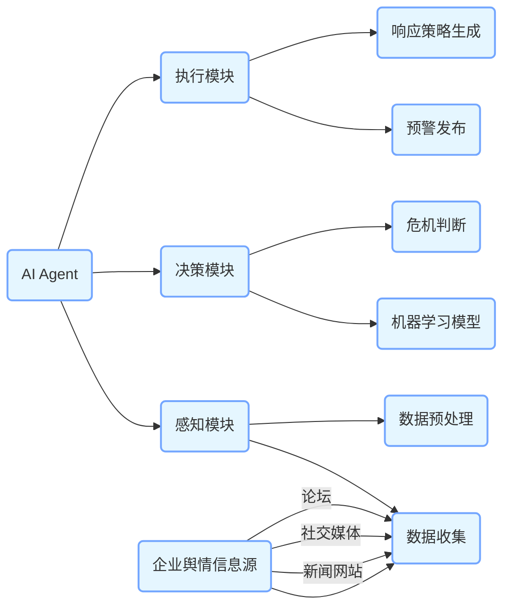

# AI Agent在企业舆情危机预警与响应中的实时应用

> 关键词：AI Agent、企业舆情危机、预警与响应、实时应用、自然语言处理

> 摘要：本文深入探讨了AI Agent在企业舆情危机预警与响应中的实时应用。首先介绍了相关背景，包括目的、预期读者等内容。接着阐述了AI Agent及企业舆情危机的核心概念与联系，详细讲解了其核心算法原理和具体操作步骤，同时给出了相应的数学模型和公式。通过项目实战展示了代码实现及解读，分析了实际应用场景。还推荐了相关的工具和资源，最后总结了未来发展趋势与挑战，并提供了常见问题解答和扩展阅读参考资料，旨在为企业有效利用AI Agent应对舆情危机提供全面的技术指导和思路。

## 1. 背景介绍 
### 1.1 目的和范围
在当今数字化时代，企业面临着海量的舆情信息，舆情危机可能随时爆发并对企业造成严重影响。本文章的目的在于详细探讨如何利用AI Agent实现企业舆情危机的实时预警与响应，为企业提供有效的危机管理解决方案。范围涵盖了AI Agent的技术原理、在舆情危机预警与响应中的具体应用、相关算法和数学模型，以及实际项目案例和未来发展趋势等方面。

### 1.2 预期读者
本文预期读者包括企业的管理人员、市场营销人员、公关人员，他们需要了解如何借助AI Agent应对舆情危机；同时也适合从事人工智能、自然语言处理等领域的技术人员，他们可以从技术层面深入研究AI Agent在舆情分析中的应用；此外，对企业舆情管理和人工智能交叉领域感兴趣的研究人员也能从本文中获取有价值的信息。

### 1.3 文档结构概述
本文首先介绍背景知识，让读者了解研究的目的和相关概念。接着阐述核心概念与联系，帮助读者建立起清晰的知识框架。然后详细讲解核心算法原理和具体操作步骤，使读者掌握技术实现的关键。通过数学模型和公式进一步深入分析，并用实际例子进行说明。项目实战部分展示代码案例和详细解释，让读者能够将理论应用到实际中。分析实际应用场景，让读者了解其实际价值。推荐相关的工具和资源，方便读者进一步学习和研究。最后总结未来发展趋势与挑战，提供常见问题解答和扩展阅读参考资料。

### 1.4 术语表
#### 1.4.1 核心术语定义
- **AI Agent**：是一种能够感知环境、自主决策并采取行动以实现特定目标的人工智能实体。在本文中，它可以自动收集、分析舆情信息，进行危机预警和响应。
- **企业舆情危机**：指由于企业的行为、产品或服务等引发的公众负面评价和舆论压力，可能对企业的声誉、形象和业务造成严重损害的情况。
- **舆情预警**：通过对舆情信息的监测和分析，提前发现潜在的危机信号，并及时发出警报的过程。
- **舆情响应**：在舆情危机发生后，企业采取的一系列应对措施，以缓解危机的影响，恢复企业的声誉和形象。

#### 1.4.2 相关概念解释
- **自然语言处理（NLP）**：是AI Agent处理舆情信息的关键技术，它涉及到对人类语言的理解、分析和生成。通过NLP技术，AI Agent可以对文本数据进行情感分析、主题分类等操作。
- **机器学习（ML）**：是AI Agent实现智能决策的重要手段，通过对大量数据的学习和训练，AI Agent可以建立模型，预测舆情危机的发生概率和发展趋势。

#### 1.4.3 缩略词列表
- **AI**：Artificial Intelligence，人工智能
- **NLP**：Natural Language Processing，自然语言处理
- **ML**：Machine Learning，机器学习

## 2. 核心概念与联系 

### 核心概念原理
#### AI Agent原理
AI Agent由感知模块、决策模块和执行模块组成。感知模块负责收集和处理舆情信息，它可以从各种数据源（如新闻网站、社交媒体、论坛等）获取文本数据，并进行预处理，如分词、词性标注等。决策模块根据感知模块提供的信息，利用机器学习模型进行分析和判断，确定是否存在舆情危机以及危机的严重程度。执行模块根据决策模块的结果，采取相应的行动，如发出预警信息、生成应对策略等。

#### 企业舆情危机原理
企业舆情危机的产生通常是由于企业的行为、产品或服务等方面出现问题，引发了公众的不满和负面评价。这些负面评价通过各种渠道传播，形成舆情信息。当舆情信息达到一定的规模和影响力时，就可能演变成舆情危机。舆情危机的发展通常分为潜伏期、爆发期、扩散期和消退期四个阶段。

### 架构的文本示意图
```plaintext
           +-------------------+
           |    AI Agent       |
           +-------------------+
           | 感知模块          |
           |  - 数据收集        |
           |  - 数据预处理      |
           +-------------------+
           | 决策模块          |
           |  - 机器学习模型    |
           |  - 危机判断        |
           +-------------------+
           | 执行模块          |
           |  - 预警发布        |
           |  - 响应策略生成    |
           +-------------------+
                 |
                 v
+-------------------+
| 企业舆情信息源    |
|  - 新闻网站       |
|  - 社交媒体       |
|  - 论坛           |
+-------------------+
```

### Mermaid流程图


## 3. 核心算法原理 & 具体操作步骤 

### 核心算法原理
#### 情感分析算法
情感分析是判断舆情信息情感倾向（积极、消极、中性）的关键算法。常用的情感分析算法有基于词典的方法和基于机器学习的方法。基于词典的方法通过预先构建情感词典，对文本中的词语进行匹配，统计积极和消极词语的数量，从而判断文本的情感倾向。基于机器学习的方法则通过训练分类模型，如支持向量机（SVM）、朴素贝叶斯（Naive Bayes）等，对文本进行分类。

以下是一个基于Python的简单情感分析示例，使用`TextBlob`库：
```python
from textblob import TextBlob

def sentiment_analysis(text):
    blob = TextBlob(text)
    polarity = blob.sentiment.polarity
    if polarity > 0:
        return '积极'
    elif polarity < 0:
        return '消极'
    else:
        return '中性'

text = "这家公司的产品质量太差了"
result = sentiment_analysis(text)
print(f"文本情感倾向: {result}")
```

#### 主题分类算法
主题分类是将舆情信息归类到不同主题的算法。常用的主题分类算法有基于规则的方法和基于机器学习的方法。基于规则的方法通过定义一系列规则，对文本进行匹配和分类。基于机器学习的方法则通过训练分类模型，如卷积神经网络（CNN）、循环神经网络（RNN）等，对文本进行分类。

以下是一个基于Python的简单主题分类示例，使用`sklearn`库：
```python
from sklearn.feature_extraction.text import TfidfVectorizer
from sklearn.naive_bayes import MultinomialNB
from sklearn.pipeline import Pipeline

# 训练数据
train_data = [
    ("这家公司的产品质量很好", "产品评价"),
    ("该公司的营销策略很成功", "营销推广"),
    ("公司最近有重大人事变动", "人事管理")
]
train_texts = [text for text, label in train_data]
train_labels = [label for text, label in train_data]

# 构建分类器
classifier = Pipeline([
    ('vectorizer', TfidfVectorizer()),
    ('classifier', MultinomialNB())
])

# 训练模型
classifier.fit(train_texts, train_labels)

# 测试数据
test_text = "这家公司的新产品很有创意"
predicted_label = classifier.predict([test_text])
print(f"文本主题分类: {predicted_label[0]}")
```

### 具体操作步骤
1. **数据收集**：使用网络爬虫技术从新闻网站、社交媒体、论坛等数据源收集舆情信息。
2. **数据预处理**：对收集到的文本数据进行清洗、分词、词性标注等操作，去除噪声和无用信息。
3. **特征提取**：使用TF-IDF、词向量等方法将文本数据转换为数值特征。
4. **模型训练**：使用训练数据对情感分析模型和主题分类模型进行训练。
5. **实时监测**：实时收集舆情信息，对其进行预处理和特征提取，然后使用训练好的模型进行情感分析和主题分类。
6. **危机判断**：根据情感分析和主题分类的结果，判断是否存在舆情危机以及危机的严重程度。
7. **预警与响应**：如果发现舆情危机，及时发出预警信息，并生成相应的响应策略。

## 4. 数学模型和公式 & 详细讲解 & 举例说明 

### 情感分析数学模型
#### 基于词典的情感分析
基于词典的情感分析通过计算文本中积极和消极词语的得分来判断情感倾向。假设文本 $T$ 由 $n$ 个词语组成，$w_i$ 表示第 $i$ 个词语，$s(w_i)$ 表示词语 $w_i$ 的情感得分（积极词语为正分，消极词语为负分，中性词语为 0 分），则文本 $T$ 的情感得分 $S(T)$ 可以表示为：
$$S(T)=\sum_{i=1}^{n}s(w_i)$$
如果 $S(T) > 0$，则文本 $T$ 为积极情感；如果 $S(T) < 0$，则文本 $T$ 为消极情感；如果 $S(T) = 0$，则文本 $T$ 为中性情感。

例如，文本 “这家公司的产品质量很好” 中，“很好” 为积极词语，情感得分设为 2，其他词语为中性词语，情感得分设为 0，则该文本的情感得分 $S(T)=2$，因此该文本为积极情感。

#### 基于机器学习的情感分析
基于机器学习的情感分析通常使用分类模型进行分类。假设训练数据由 $m$ 个样本组成，每个样本 $x_i$ 由 $k$ 个特征组成，对应的标签 $y_i$ 为情感类别（积极、消极、中性）。分类模型的目标是找到一个函数 $f(x)$，使得对于输入的样本 $x$，能够准确预测其标签 $y$。常用的分类模型有支持向量机（SVM）、朴素贝叶斯（Naive Bayes）等。

以朴素贝叶斯分类器为例，其核心公式为贝叶斯定理：
$$P(y|x)=\frac{P(x|y)P(y)}{P(x)}$$
其中，$P(y|x)$ 表示在给定样本 $x$ 的情况下，标签为 $y$ 的概率；$P(x|y)$ 表示在标签为 $y$ 的情况下，样本 $x$ 出现的概率；$P(y)$ 表示标签 $y$ 出现的先验概率；$P(x)$ 表示样本 $x$ 出现的概率。在分类时，选择 $P(y|x)$ 最大的类别作为预测结果。

### 主题分类数学模型
#### 基于规则的主题分类
基于规则的主题分类通过定义一系列规则来判断文本的主题。假设规则集合为 $R=\{r_1,r_2,\cdots,r_l\}$，每个规则 $r_j$ 由一个或多个关键词组成。对于文本 $T$，如果它包含规则 $r_j$ 中的关键词，则将其归类到规则 $r_j$ 对应的主题。

例如，规则 $r_1$ 为 “产品质量、产品性能”，对应的主题为 “产品评价”。如果文本 “这家公司的产品质量很好” 包含规则 $r_1$ 中的关键词 “产品质量”，则将该文本归类到 “产品评价” 主题。

#### 基于机器学习的主题分类
基于机器学习的主题分类同样使用分类模型进行分类。与情感分析类似，通过训练分类模型，找到一个函数 $f(x)$，使得对于输入的样本 $x$，能够准确预测其主题标签 $y$。常用的分类模型有卷积神经网络（CNN）、循环神经网络（RNN）等。

以卷积神经网络为例，其核心操作是卷积运算。假设输入的文本特征矩阵为 $X$，卷积核为 $W$，则卷积运算的结果 $Y$ 可以表示为：
$$Y = X * W + b$$
其中，$*$ 表示卷积运算，$b$ 为偏置项。通过多层卷积和池化操作，提取文本的特征，最后通过全连接层进行分类。

## 5. 项目实战：代码实际案例和详细解释说明 

### 5.1  开发环境搭建
#### 操作系统
建议使用Linux或Windows操作系统，确保系统具备良好的稳定性和兼容性。

#### Python环境
安装Python 3.7及以上版本，可以从Python官方网站（https://www.python.org/downloads/）下载安装包进行安装。

#### 相关库安装
使用`pip`命令安装以下必要的库：
```bash
pip install requests beautifulsoup4 textblob sklearn pandas
```
- `requests`：用于网络请求，收集舆情信息。
- `beautifulsoup4`：用于解析HTML和XML数据。
- `textblob`：用于情感分析。
- `sklearn`：用于机器学习模型的训练和预测。
- `pandas`：用于数据处理和分析。

### 5.2  源代码详细实现和代码解读
```python
import requests
from bs4 import BeautifulSoup
from textblob import TextBlob
from sklearn.feature_extraction.text import TfidfVectorizer
from sklearn.naive_bayes import MultinomialNB
from sklearn.pipeline import Pipeline
import pandas as pd

# 数据收集
def collect_data(url):
    response = requests.get(url)
    soup = BeautifulSoup(response.text, 'html.parser')
    articles = soup.find_all('p')
    texts = [article.get_text() for article in articles]
    return texts

# 情感分析
def sentiment_analysis(text):
    blob = TextBlob(text)
    polarity = blob.sentiment.polarity
    if polarity > 0:
        return '积极'
    elif polarity < 0:
        return '消极'
    else:
        return '中性'

# 主题分类
def train_topic_classifier():
    # 训练数据
    train_data = [
        ("这家公司的产品质量很好", "产品评价"),
        ("该公司的营销策略很成功", "营销推广"),
        ("公司最近有重大人事变动", "人事管理")
    ]
    train_texts = [text for text, label in train_data]
    train_labels = [label for text, label in train_data]

    # 构建分类器
    classifier = Pipeline([
        ('vectorizer', TfidfVectorizer()),
        ('classifier', MultinomialNB())
    ])

    # 训练模型
    classifier.fit(train_texts, train_labels)
    return classifier

# 实时监测
def real_time_monitoring(url):
    texts = collect_data(url)
    classifier = train_topic_classifier()
    results = []
    for text in texts:
        sentiment = sentiment_analysis(text)
        topic = classifier.predict([text])[0]
        results.append({'文本': text, '情感倾向': sentiment, '主题分类': topic})
    df = pd.DataFrame(results)
    return df

# 主函数
if __name__ == "__main__":
    url = "https://example.com"  # 替换为实际的新闻网站URL
    df = real_time_monitoring(url)
    print(df)
```

### 5.3  代码解读与分析
- **数据收集**：`collect_data`函数使用`requests`库发送HTTP请求，获取网页内容，然后使用`BeautifulSoup`库解析HTML数据，提取所有的段落文本。
- **情感分析**：`sentiment_analysis`函数使用`TextBlob`库对文本进行情感分析，根据情感极性判断文本的情感倾向。
- **主题分类**：`train_topic_classifier`函数使用`sklearn`库构建一个基于TF-IDF和朴素贝叶斯的分类器，并使用训练数据进行训练。
- **实时监测**：`real_time_monitoring`函数调用`collect_data`函数收集舆情信息，调用`train_topic_classifier`函数训练主题分类模型，然后对每条文本进行情感分析和主题分类，最后将结果存储在`pandas`的`DataFrame`中。
- **主函数**：在主函数中，指定新闻网站的URL，调用`real_time_monitoring`函数进行实时监测，并打印结果。

## 6. 实际应用场景 
### 产品质量问题预警
当企业的产品出现质量问题时，舆情信息中会出现大量的负面评价。AI Agent可以实时监测舆情信息，通过情感分析和主题分类，及时发现产品质量问题的舆情危机，并发出预警。企业可以根据预警信息，及时采取措施，如召回产品、改进质量等，以减少损失。

### 营销活动效果评估
企业开展营销活动后，AI Agent可以实时监测舆情信息，分析公众对营销活动的反应和评价。通过情感分析和主题分类，了解营销活动的效果，如是否引起了公众的关注、是否获得了正面评价等。企业可以根据评估结果，调整营销策略，提高营销效果。

### 竞争对手动态监测
AI Agent可以实时监测竞争对手的舆情信息，了解竞争对手的产品、服务、营销活动等方面的动态。通过分析竞争对手的舆情信息，企业可以发现自身的优势和不足，及时调整战略，提高市场竞争力。

### 品牌形象维护
企业的品牌形象是企业的重要资产。AI Agent可以实时监测舆情信息，及时发现可能损害企业品牌形象的负面信息，并发出预警。企业可以根据预警信息，采取相应的措施，如发布声明、进行公关活动等，以维护企业的品牌形象。

## 7. 工具和资源推荐
### 7.1 学习资源推荐
#### 7.1.1 书籍推荐
- 《Python自然语言处理实战》：本书详细介绍了Python在自然语言处理中的应用，包括文本预处理、情感分析、主题分类等内容，适合初学者学习。
- 《机器学习实战》：本书通过实际案例介绍了机器学习的基本算法和应用，包括决策树、支持向量机、神经网络等，对于理解AI Agent中的机器学习模型有很大帮助。
- 《深度学习》：本书是深度学习领域的经典著作，详细介绍了深度学习的原理、算法和应用，适合有一定基础的读者深入学习。

#### 7.1.2 在线课程
- Coursera上的“Natural Language Processing Specialization”：该课程由顶尖大学的教授授课，系统地介绍了自然语言处理的理论和实践，包括情感分析、机器翻译等内容。
- edX上的“Artificial Intelligence”：该课程涵盖了人工智能的各个方面，包括机器学习、深度学习、知识表示等，对于全面了解AI Agent有很大帮助。
- 中国大学MOOC上的“Python语言程序设计”：该课程适合初学者学习Python编程语言，为后续学习AI Agent的相关技术打下基础。

#### 7.1.3 技术博客和网站
- Medium：该网站上有很多关于人工智能、自然语言处理等领域的技术文章，作者来自世界各地的技术专家和研究人员，可以获取最新的技术动态和研究成果。
- Towards Data Science：该网站专注于数据科学和机器学习领域，提供了大量的技术文章、案例分析和教程，对于学习AI Agent的相关技术有很大帮助。
- 开源中国：该网站是国内知名的开源技术社区，提供了丰富的开源项目和技术文章，对于了解国内的人工智能技术发展有很大帮助。

### 7.2 开发工具框架推荐
#### 7.2.1 IDE和编辑器
- PyCharm：是一款专业的Python集成开发环境，提供了丰富的代码编辑、调试、版本控制等功能，适合开发AI Agent相关的Python项目。
- Jupyter Notebook：是一款交互式的笔记本工具，支持Python、R等多种编程语言，适合进行数据分析、模型训练和可视化等工作。
- Visual Studio Code：是一款轻量级的代码编辑器，支持多种编程语言和插件扩展，适合快速开发和调试AI Agent相关的代码。

#### 7.2.2 调试和性能分析工具
- Py-Spy：是一款Python性能分析工具，可以实时监测Python程序的CPU使用率、内存使用率等性能指标，帮助开发者找出性能瓶颈。
- pdb：是Python自带的调试工具，可以在代码中设置断点，逐步执行代码，查看变量的值和程序的执行流程，方便调试代码。
- TensorBoard：是TensorFlow提供的可视化工具，可以用于可视化深度学习模型的训练过程、损失函数、准确率等指标，帮助开发者优化模型。

#### 7.2.3 相关框架和库
- NLTK：是Python中最常用的自然语言处理库，提供了丰富的文本处理工具和语料库，如分词、词性标注、命名实体识别等。
- SpaCy：是一款快速、高效的自然语言处理库，支持多种语言，提供了预训练的模型和高效的算法，适合大规模的文本处理任务。
- TensorFlow：是Google开发的深度学习框架，提供了丰富的深度学习模型和工具，如卷积神经网络、循环神经网络等，适合开发复杂的AI Agent模型。

### 7.3 相关论文著作推荐
#### 7.3.1 经典论文
- “A Sentimental Education: Sentiment Analysis Using Subjectivity Summarization Based on Minimum Cuts”：该论文提出了一种基于最小割的主观性总结方法，用于情感分析，是情感分析领域的经典论文。
- “Convolutional Neural Networks for Sentence Classification”：该论文提出了一种基于卷积神经网络的句子分类方法，在文本分类任务中取得了很好的效果，是深度学习在自然语言处理领域的经典论文。
- “Attention Is All You Need”：该论文提出了Transformer模型，是自然语言处理领域的重大突破，被广泛应用于机器翻译、文本生成等任务。

#### 7.3.2 最新研究成果
- 关注顶级学术会议（如ACL、EMNLP、ICML等）的论文，这些会议收录了自然语言处理和机器学习领域的最新研究成果。
- 关注知名学术期刊（如Journal of Artificial Intelligence Research、ACM Transactions on Intelligent Systems and Technology等）的论文，这些期刊发表了高质量的研究论文。

#### 7.3.3 应用案例分析
- 可以查阅一些企业的案例分析报告，了解他们如何使用AI Agent进行舆情危机预警与响应。例如，一些大型企业会在其官方网站或行业报告中分享他们的实践经验和成果。

## 8. 总结：未来发展趋势与挑战
### 未来发展趋势
#### 多模态融合
未来的AI Agent将不仅仅局限于文本信息的处理，还将融合图像、视频、音频等多模态信息，更全面地了解舆情危机的情况。例如，通过分析社交媒体上的图片和视频，发现企业产品在实际使用中的问题。

#### 知识图谱的应用
知识图谱可以将企业的各种信息进行整合和关联，为AI Agent提供更丰富的背景知识。AI Agent可以利用知识图谱进行推理和判断，更准确地识别舆情危机的潜在风险。

#### 智能化响应策略生成
未来的AI Agent将能够根据舆情危机的具体情况，自动生成更智能化的响应策略。例如，根据不同的危机类型和严重程度，提供个性化的公关方案和应对措施。

### 挑战
#### 数据质量和隐私问题
舆情信息的质量参差不齐，存在大量的噪声和虚假信息，这会影响AI Agent的分析和判断结果。同时，在收集和处理舆情信息时，还需要注意数据隐私问题，遵守相关的法律法规。

#### 模型的可解释性
深度学习模型在舆情分析中取得了很好的效果，但这些模型通常是黑盒模型，缺乏可解释性。在企业舆情危机预警与响应中，需要能够解释模型的决策过程和结果，以便企业做出合理的决策。

#### 实时性要求
舆情危机的发展非常迅速，需要AI Agent能够实时监测和分析舆情信息，及时发出预警和响应。这对系统的性能和处理速度提出了很高的要求。

## 9. 附录：常见问题与解答
### 问题1：AI Agent在舆情危机预警与响应中的准确率如何保证？
答：可以通过以下方法保证准确率：使用高质量的训练数据，对数据进行充分的预处理和标注；选择合适的算法和模型，并进行调优；定期对模型进行评估和更新，以适应新的舆情数据。

### 问题2：如何处理多语言的舆情信息？
答：可以使用支持多语言的自然语言处理库，如SpaCy、NLTK等，这些库提供了多种语言的处理工具和模型。同时，也可以使用预训练的多语言模型，如BERT等，进行跨语言的舆情分析。

### 问题3：AI Agent能否替代人工进行舆情危机预警与响应？
答：AI Agent可以辅助人工进行舆情危机预警与响应，但不能完全替代人工。AI Agent可以快速处理大量的舆情信息，发现潜在的危机信号，但在应对复杂的舆情危机时，还需要人工的专业判断和决策。

### 问题4：如何保障AI Agent系统的稳定性和可靠性？
答：可以采取以下措施保障系统的稳定性和可靠性：使用高性能的服务器和硬件设备；采用分布式架构和负载均衡技术，提高系统的处理能力和容错能力；定期对系统进行维护和升级，及时修复漏洞和故障。

## 10. 扩展阅读 & 参考资料
### 扩展阅读
- 《人工智能时代的企业管理变革》：本书探讨了人工智能对企业管理的影响和挑战，以及企业如何应对这些变革。
- 《大数据舆情分析与管理》：本书详细介绍了大数据在舆情分析与管理中的应用，包括数据收集、处理、分析和可视化等方面。

### 参考资料
- [Python官方文档](https://docs.python.org/3/)
- [Scikit-learn官方文档](https://scikit-learn.org/stable/)
- [TensorFlow官方文档](https://www.tensorflow.org/api_docs)

作者：AI天才研究院/AI Genius Institute & 禅与计算机程序设计艺术 /Zen And The Art of Computer Programming